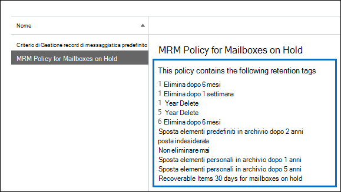

# <a name="increase-the-recoverable-items-quota-for-mailboxes-on-hold"></a>Aumentare la quota degli elementi ripristinabili per le cassette postali bloccate

Il criterio Exchange di conservazione predefinito, denominato Criterio di gestione dei messaggistica predefinito, applicato automaticamente alle nuove cassette postali di Exchange Online contiene un tag di conservazione denominato Elementi ripristinabili 14 giorni sposta nell'archivio. Questo tag di conservazione sposta gli elementi dalla cartella Elementi ripristinabili nella cassetta postale principale dell'utente alla cartella Elementi ripristinabili nella cassetta postale di archiviazione dell'utente dopo la scadenza del periodo di conservazione di 14 giorni per un elemento. A tale scopo, è necessario che la cassetta postale di archiviazione dell'utente sia abilitata. Se la cassetta postale di archiviazione non è abilitata, non viene eseguita alcuna azione, il che significa che gli elementi nella cartella Elementi ripristinabili per una cassetta postale in attesa non vengono spostati nella cassetta postale di archiviazione dopo la scadenza del periodo di conservazione di 14 giorni. Poiché non viene eliminato nulla da una cassetta postale di archiviazione, è possibile che la quota di archiviazione per la cartella Elementi ripristinabili venga superata, soprattutto se la cassetta postale di archiviazione dell'utente non è abilitata.

Per ridurre la possibilità di superare questo limite, la quota di archiviazione per la cartella Elementi ripristinabili viene automaticamente aumentata da 30 GB a 100 GB quando viene effettuato un blocco su una cassetta postale in Exchange Online. Se la cassetta postale di archiviazione è abilitata, anche la quota di archiviazione per la cartella Elementi ripristinabili nella cassetta postale di archiviazione viene aumentata da 30 GB a 100 GB. Se la funzionalità di archiviazione con espansione automatica in Exchange Online è abilitata, la quota di archiviazione per la cartella Elementi ripristinabili nell'archivio dell'utente sarà illimitata.

 Nella tabella seguente viene riepilogata la quota di archiviazione per la cartella Elementi ripristinabili.

|**Percorso della cartella Elementi ripristinabili**|**Cassette postali non in attesa**|**Cassette postali in attesa**|
|:-----|:-----|:-----|
|Cassetta postale principale  <br/> |30 GB  <br/> |100 GB  <br/> |
|Cassetta postale di archiviazione<sup>\*</sup> <br/> |Illimitati  <br/> |Illimitati  <br/> |
|**Quota di archiviazione totale per la cartella Elementi ripristinabili** <br/> |Illimitati  <br/> |Illimitati  <br/> |

> [!NOTE]
> <sup>\*</sup>La quota di archiviazione iniziale per la cassetta postale di archiviazione è di 100 GB per gli utenti con una Exchange Online (Piano 2) licenza. Tuttavia, quando l'archiviazione con espansione automatica è attivata per le cassette postali in attesa, la quota di archiviazione per la cassetta postale di archiviazione e la cartella Elementi ripristinabili viene aumentata a 110 GB. Se necessario, verrà eseguito il provisioning di ulteriore spazio di archiviazione di archiviazione, con una quantità illimitata di spazio di archiviazione. Per ulteriori informazioni sull'espansione automatica dell'archiviazione, vedere [Overview of unlimited archiving in Office 365](unlimited-archiving.md).

Quando la quota di archiviazione per la cartella Elementi ripristinabili nella cassetta postale principale di una cassetta postale in attesa è vicina al raggiungimento del limite, è possibile eseguire le operazioni seguenti:

- **Abilitare la cassetta postale di archiviazione e attivare l'archiviazione con espansione automatica.** È possibile abilitare una capacità di archiviazione illimitata per la cartella Elementi ripristinabili semplicemente abilitando la cassetta postale di archiviazione e quindi attivando la funzionalità di archiviazione con espansione automatica in Exchange Online. Ciò comporta 110 GB per la cartella Elementi ripristinabili nella cassetta postale principale e una quantità illimitata di capacità di archiviazione per la cartella Elementi ripristinabili nell'archivio dell'utente. Vedere come: Abilitare le cassette postali di archiviazione nel [Centro sicurezza & conformità](enable-archive-mailboxes.md) e Abilitare l'archiviazione [illimitata in Office 365](enable-unlimited-archiving.md).

    > [!NOTE]
    > Dopo aver abilitato l'archivio per una cassetta postale vicina al superamento della quota di archiviazione per la cartella Elementi ripristinabili, è possibile eseguire l'Assistente cartelle gestite per attivare manualmente l'assistente per elaborare la cassetta postale in modo che gli elementi scaduti siano spostati nella cartella Elementi ripristinabili nella cassetta postale di archiviazione. Per istruzioni, vedere il passaggio [4.](#optional-step-4-run-the-managed-folder-assistant-to-apply-the-new-retention-settings) Si noti che altri elementi nella cassetta postale dell'utente potrebbero essere spostati nella nuova cassetta postale di archiviazione. Prendere in considerazione la possibilità di invii di informazioni all'utente dopo l'abilitazione della cassetta postale di archiviazione.

- **Creare un criterio di Exchange personalizzato per le cassette postali in attesa.** Oltre a abilitare la cassetta postale di archiviazione e l'espansione automatica dell'archiviazione per le cassette postali con conservazione per controversia legale o blocco In-Place, è anche possibile creare un criterio di conservazione Exchange personalizzato per le cassette postali in attesa. In questo modo è possibile applicare un criterio di conservazione alle cassette postali di blocco diverso dal criterio di gestione dei messaggistica predefinito applicato alle cassette postali che non sono in attesa e consente di applicare tag di conservazione progettati per le cassette postali in attesa. Ciò include la creazione di un nuovo tag di conservazione per la cartella Elementi ripristinabili.

Nella parte restante di questo argomento vengono descritte le procedure dettagliate per creare un criterio di conservazione Exchange personalizzato per le cassette postali in attesa.

[Passaggio 1: Creare un tag di conservazione personalizzato per la cartella Elementi ripristinabili](#step-1-create-a-custom-retention-tag-for-the-recoverable-items-folder)

[Passaggio 2: Creare un nuovo criterio di conservazione Exchange per le cassette postali in attesa](#step-2-create-a-new-exchange-retention-policy-for-mailboxes-on-hold)

[Passaggio 3: Applicare il nuovo criterio Exchange di conservazione alle cassette postali in attesa](#step-3-apply-the-new-exchange-retention-policy-to-mailboxes-on-hold)

[(Facoltativo) Passaggio 4: Eseguire l'Assistente cartelle gestite per applicare le nuove impostazioni di conservazione](#optional-step-4-run-the-managed-folder-assistant-to-apply-the-new-retention-settings)

## <a name="step-1-create-a-custom-retention-tag-for-the-recoverable-items-folder"></a>Passaggio 1: Creare un tag di conservazione personalizzato per la cartella Elementi ripristinabili

Il primo passaggio consiste nel creare un tag di conservazione personalizzato (denominato tag dei criteri di conservazione o RPT) per la cartella Elementi ripristinabili. Come spiegato in precedenza, questo RPT sposta gli elementi dalla cartella Elementi ripristinabili nella cassetta postale principale dell'utente alla cartella Elementi ripristinabili nella cassetta postale di archiviazione dell'utente. È necessario utilizzare PowerShell per creare un RPT per la cartella Elementi ripristinabili. Non è possibile usare l'interfaccia di amministrazione di Exchange (EAC).

1. [Connettersi a Exchange Online tramite la sessione remota di PowerShell](/powershell/exchange/connect-to-exchange-online-powershell)

2. Eseguire il comando seguente per creare un nuovo RPT per la cartella Elementi ripristinabili:

    ```powershell
    New-RetentionPolicyTag -Name <Name of RPT> -Type RecoverableItems -AgeLimitForRetention <Number of days> -RetentionAction MoveToArchive
    ```

    Ad esempio, il comando seguente crea un RPT per la cartella Elementi ripristinabili denominata "Elementi ripristinabili 30 giorni per le cassette postali in attesa", con un periodo di conservazione di 30 giorni. Ciò significa che, dopo che un elemento è stato nella cartella Elementi ripristinabili per 30 giorni, verrà spostato nella cartella Elementi ripristinabili nella cassetta postale di archiviazione dell'utente.

    ```powershell
    New-RetentionPolicyTag -Name "Recoverable Items 30 days for mailboxes on hold" -Type RecoverableItems -AgeLimitForRetention 30 -RetentionAction MoveToArchive
    ```

    > [!TIP]
    > È consigliabile che il periodo di conservazione (definito dal parametro  _AgeLimitForRetention)_ per il criterio RPT Elementi ripristinabili sia lo stesso del periodo di conservazione degli elementi eliminati per le cassette postali a cui verrà applicato il criterio RPT. Ciò consente a un utente l'intero periodo di conservazione degli elementi eliminati di recuperare gli elementi eliminati prima di essere spostati nella cassetta postale di archiviazione. Nell'esempio precedente, il periodo di conservazione è stato impostato su 30 giorni in base al presupposto che anche il periodo di conservazione degli elementi eliminati per le cassette postali sia di 30 giorni. Per Exchange Online una cassetta postale di posta elettronica è configurata per conservare gli elementi eliminati per 14 giorni. È tuttavia possibile modificare questa impostazione impostando un massimo di 30 giorni. Per ulteriori informazioni, vedere [Change the deleted item retention period for a mailbox in Exchange Online](https://www.microsoft.com/?ref=go).

## <a name="step-2-create-a-new-exchange-retention-policy-for-mailboxes-on-hold"></a>Passaggio 2: Creare un nuovo criterio di conservazione Exchange per le cassette postali in attesa

Il passaggio successivo consiste nel creare un nuovo criterio di conservazione e aggiungervi tag di conservazione, incluso il criterio RPT Elementi ripristinabili creato nel passaggio 1. Questo nuovo criterio verrà applicato alle cassette postali in attesa nel passaggio successivo.

Prima di creare il nuovo criterio di conservazione, determinare i tag di conservazione aggiuntivi che si desidera aggiungere. Per un elenco dei tag di conservazione aggiunti al criterio di gestione dei messaggismi predefinito e per informazioni sulla creazione di nuovi tag di conservazione, vedere quanto segue:

- [Criteri di conservazione predefiniti di Exchange Online](/exchange/security-and-compliance/messaging-records-management/default-retention-policy)

- [Cartelle predefinite che supportano i tag di Criteri di conservazione](/exchange/security-and-compliance/messaging-records-management/default-folders)

- La sezione "Creare un tag di conservazione" [nell'argomento Create a Retention Policy.](/exchange/security-and-compliance/messaging-records-management/create-a-retention-policy)

È possibile utilizzare EAC o Exchange Online PowerShell per creare un criterio di conservazione.

### <a name="use-the-eac-to-create-a-retention-policy"></a>Creazione di un criterio di conservazione tramite l'interfaccia di amministrazione di Exchange

1. Nell'interfaccia di amministrazione di Exchange, andare a **Gestione conformità** Criteri \> **di conservazione** e quindi fare clic su **Aggiungi** Icona  .

2. Nella pagina **Nuovo criterio di conservazione,** in **Nome,** digitare un nome che descriva lo scopo del criterio di conservazione. ad esempio, **Criteri gestione messaggistica per le cassette postali in attesa**.

3. In **Tag di conservazione** fare clic su **Aggiungi** icona  Aggiungi.

4. Nell'elenco dei tag di conservazione, selezionare il tag RPT Elementi ripristinabili creato nel passaggio 1 e quindi fare clic su **Aggiungi**.

    

5. Selezionare altri tag di conservazione da aggiungere al criterio di conservazione. Ad esempio, è possibile aggiungere gli stessi tag inclusi nel criterio di gestione dei criteri di gestione dei dati predefinito.

6. Al termine dell'aggiunta dei tag di conservazione, fare clic su **OK.**

7. Fare **clic su** Salva per creare il nuovo criterio di conservazione.

    Si noti che i tag di conservazione collegati al criterio di conservazione vengono visualizzati nel riquadro dei dettagli.

    

### <a name="use-exchange-online-powershell-to-create-a-retention-policy"></a>Usare Exchange Online PowerShell per creare un criterio di conservazione

Eseguire il comando seguente per creare nuovi criteri di conservazione per le cassette postali in attesa.

```powershell
New-RetentionPolicy <Name of retention policy>  -RetentionPolicyTagLinks <list of retention tags>

```

Ad esempio, il comando seguente crea i criteri di conservazione e i tag di conservazione collegati visualizzati nella figura precedente.

```powershell
New-RetentionPolicy "MRM Policy for Mailboxes on Hold"  -RetentionPolicyTagLinks "Recoverable Items 30 days for mailboxes on hold","1 Month Delete","1 Week Delete","1 Year Delete","5 Year Delete","6 Month Delete","Default 2 year move to archive","Junk Email","Never Delete","Personal 1 year move to archive","Personal 5 year move to archive"
```

## <a name="step-3-apply-the-new-exchange-retention-policy-to-mailboxes-on-hold"></a>Passaggio 3: Applicare il nuovo criterio Exchange di conservazione alle cassette postali in attesa

L'ultimo passaggio consiste nell'applicare il nuovo criterio di conservazione creato nel passaggio 2 alle cassette postali di archiviazione nell'organizzazione. È possibile utilizzare EAC o Exchange Online PowerShell per applicare il criterio di conservazione a una singola cassetta postale o a più cassette postali.

### <a name="use-the-eac-to-apply-the-new-retention-policy"></a>Utilizzo dell'interfaccia di amministrazione di Exchange per applicare il nuovo criterio di conservazione

1. Passare a **Destinatari**  >  **Cassette postali**.

2. Nella visualizzazione elenco, selezionare la cassetta postale a cui si desidera applicare il criterio di conservazione e quindi fare clic su **Modifica**  .

3. Nella pagina **Cassetta postale utente** fare clic su Funzionalità cassetta **postale**.

4. In **Criteri di conservazione** selezionare il criterio di conservazione creato nel passaggio 2 e quindi fare clic su **Salva.**

È inoltre possibile utilizzare L'interfaccia di amministrazione di Exchange per applicare il criterio di conservazione a più cassette postali.

1. Passare a **Destinatari**  >  **Cassette postali**.

2. Nell'elenco, utilizzare il tasto Maiusc o Ctrl per selezionare più cassette postali.

3. Nel riquadro dei dettagli, fare clic su **Altre opzioni**.

4. In **Criterio di conservazione**, fare clic su **Aggiorna**.

5. Nella pagina **Assegnazione in blocco dei criteri di** conservazione selezionare i criteri di conservazione creati nel passaggio 2 e quindi fare clic su **Salva**.

### <a name="use-exchange-online-powershell-to-apply-the-new-retention-policy"></a>Usare Exchange Online PowerShell per applicare il nuovo criterio di conservazione

È possibile utilizzare Exchange Online PowerShell per applicare un nuovo criterio di conservazione a una singola cassetta postale. Tuttavia, il vero potere di PowerShell è che è possibile utilizzarlo per identificare rapidamente tutte le cassette postali dell'organizzazione che sono in conservazione per controversia legale o blocco In-Place e quindi applicare il nuovo criterio di conservazione a tutte le cassette postali in attesa in un unico comando. Ecco alcuni esempi di utilizzo di Exchange PowerShell per applicare un criterio di conservazione a una o più cassette postali. Tutti gli esempi applicano i criteri di conservazione creati nel passaggio 2.

In questo esempio il nuovo criterio di conservazione viene applicato alla cassetta postale di Pilar Pinilla.

```powershell
Set-Mailbox "Pilar Pinilla" -RetentionPolicy "MRM Policy for Mailboxes on Hold"
```

In questo esempio il nuovo criterio di conservazione viene applicato a tutte le cassette postali dell'organizzazione con conservazione per controversia legale.

```powershell
$LitigationHolds = Get-Mailbox -ResultSize unlimited | Where-Object {$_.LitigationHoldEnabled -eq 'True'}
```

```powershell
$LitigationHolds.DistinguishedName | Set-Mailbox -RetentionPolicy "MRM Policy for Mailboxes on Hold"
```

In questo esempio il nuovo criterio di conservazione viene applicato a tutte le cassette postali dell'organizzazione In-Place conservazione.

```powershell
$InPlaceHolds = Get-Mailbox -ResultSize unlimited | Where-Object {$_.InPlaceHolds -ne $null}
```

```powershell
$InPlaceHolds.DistinguishedName | Set-Mailbox -RetentionPolicy "MRM Policy for Mailboxes on Hold"
```

È possibile utilizzare il cmdlet **Get-Mailbox** per verificare che il nuovo criterio di conservazione sia stato applicato.

Ecco alcuni esempi per verificare che i comandi negli esempi precedenti hanno applicato il criterio di conservazione "Criteri gestione record di messaggistica per le cassette postali in attesa" alle cassette postali con blocco per controversia legale e alle cassette postali In-Place conservazione.

```powershell
Get-Mailbox "Pilar Pinilla" | Select RetentionPolicy
```

```powershell
Get-Mailbox -ResultSize unlimited | Where-Object {$_.LitigationHoldEnabled -eq 'True'} | FT DisplayName,RetentionPolicy -Auto
```

```powershell
Get-Mailbox -ResultSize unlimited | Where-Object {$_.InPlaceHolds -ne $null} | FT DisplayName,RetentionPolicy -Auto
```

## <a name="optional-step-4-run-the-managed-folder-assistant-to-apply-the-new-retention-settings"></a>(Facoltativo) Passaggio 4: Eseguire l'Assistente cartelle gestite per applicare le nuove impostazioni di conservazione

Dopo aver applicato il nuovo criterio di conservazione Exchange alle cassette postali in attesa, possono essere necessario fino a 7 giorni in Exchange Online per l'elaborazione di queste cassette postali da parte dell'Assistente cartelle gestite utilizzando le impostazioni del nuovo criterio di conservazione. Anziché attendere l'esecuzione dell'Assistente cartelle gestite, è possibile utilizzare il cmdlet **Start-ManagedFolderAssistant** per attivare manualmente l'assistente per elaborare le cassette postali a cui è stato applicato il nuovo criterio di conservazione.

Eseguire il comando seguente per avviare l'Assistente cartelle gestite per la cassetta postale di Pilar Pinilla.

```powershell
Start-ManagedFolderAssistant "Pilar Pinilla"
```

Eseguire i comandi seguenti per avviare l'Assistente cartelle gestite per tutte le cassette postali in attesa.

```powershell
$MailboxesOnHold = Get-Mailbox -ResultSize unlimited | Where-Object {($_.InPlaceHolds -ne $null) -or ($_.LitigationHoldEnabled -eq "True")}
```

```powershell
$MailboxesOnHold.DistinguishedName | Start-ManagedFolderAssistant
```

## <a name="more-information"></a>Ulteriori informazioni

- Dopo aver abilitato la cassetta postale di archiviazione di un utente, è consigliabile invii all'utente che altri elementi nella cassetta postale (non solo gli elementi nella cartella Elementi ripristinabili) potrebbero essere spostati nella cassetta postale di archiviazione. Ciò è dovuto al fatto che il criterio mrm predefinito assegnato alle cassette postali di Exchange Online contiene un tag di conservazione (denominato Spostamento predefinito 2 anni nell'archivio) che sposta gli elementi nella cassetta postale di archiviazione due anni dopo la data in cui l'elemento è stato recapitato alla cassetta postale o creato dall'utente. Per ulteriori informazioni, vedere [Default Retention Policy in Exchange Online](/exchange/security-and-compliance/messaging-records-management/default-retention-policy)

- Dopo aver abilitato la cassetta postale di archiviazione di un utente, è anche possibile indicare all'utente che può recuperare gli elementi eliminati nella cartella Elementi ripristinabili nella cassetta postale di archiviazione. A tale scopo, Outlook la cartella  Posta eliminata nella cassetta postale di archiviazione e quindi facendo clic su Recupera elementi eliminati dal **server** nella **scheda Home.** Per ulteriori informazioni sul ripristino degli elementi eliminati, vedere [Recover deleted items in Outlook for Windows](https://go.microsoft.com/fwlink/p/?LinkId=624829).
