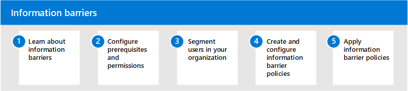

# Barriere di informazioni in Microsoft 365Information barriers in Microsoft 365

Microsoft 365 consente la comunicazione e la collaborazione tra gruppi e organizzazioni e supporta modi per limitare la comunicazione e la collaborazione tra gruppi specifici di utenti, se necessario.Microsoft 365 enables communication and collaboration across groups and organizations and supports ways to restrict communication and collaboration among specific groups of users when necessary. Ciò può includere situazioni o scenari in cui si desidera limitare la comunicazione e la collaborazione tra due gruppi per evitare che si verifichi un conflitto di interesse nell'organizzazione.This may include situations or scenarios where you want to restrict communication and collaboration between two groups to avoid a conflict of interest from occurring in your organization. Ciò può includere anche situazioni in cui è necessario limitare la comunicazione e la collaborazione tra alcune persone all'interno dell'organizzazione per proteggere le informazioni interne.This may also include situations when you need to restrict communication and collaboration between certain people inside your organization to safeguard internal information.

Le barriere di informazioni sono supportate in Microsoft Teams, SharePoint Online e OneDrive for Business.Information barriers are supported in Microsoft Teams, SharePoint Online, and OneDrive for Business. Un amministratore di conformità o un amministratore delle barriere di informazioni può definire criteri per consentire o impedire le comunicazioni tra gruppi di utenti in Microsoft Teams.A compliance administrator or information barriers administrator can define policies to allow or prevent communications between groups of users in Microsoft Teams. I criteri delle barriere di informazioni possono essere usati in situazioni come queste:Information barrier policies can be used for situations like these:

- L'utente nel gruppo di distribuzione giornaliera non deve comunicare o condividere file con il team di marketingUser in the day trader group should not communicate or share files with the marketing team
- Il personale finanziario che lavora su informazioni aziendali riservate non deve comunicare o condividere file con determinati gruppi all'interno dell'organizzazioneFinance personnel working on confidential company information should not communicate or share files with certain groups within their organization
- Un team interno con materiale segreto commerciale non deve chiamare o chattare online con persone in determinati gruppi all'interno dell'organizzazioneAn internal team with trade secret material should not call or chat online with people in certain groups within their organization
- Un team di ricerca deve chiamare o chattare solo online con un team di sviluppo del prodottoA research team should only call or chat online with a product development team

## Configurare le barriere di informazioni per Microsoft 365Configure information barriers for Microsoft 365

Per configurare le barriere di informazioni per l'organizzazione, eseguire la procedura seguente:Use the following steps to configure information barriers for your organization:

1. Informazioni sulle [barriere di informazioni](information-barriers.md) in Microsoft 365Learn about [information barriers](information-barriers.md) in Microsoft 365
2. Configurare [i prerequisiti e le autorizzazioni](information-barriers-policies.md#prerequisites)Configure [prerequisites and permissions](information-barriers-policies.md#prerequisites)
3. Segmentare [gli utenti nell'organizzazione](information-barriers-policies.md#part-1-segment-users)Segment [users in your organization](information-barriers-policies.md#part-1-segment-users)
4. Creare e configurare [i criteri delle barriere di informazioni](information-barriers-policies.md#part-2-define-information-barrier-policies)Create and configure [information barrier policies](information-barriers-policies.md#part-2-define-information-barrier-policies)
5. Applicare [i criteri delle barriere di informazioni](information-barriers-policies.md#part-3-apply-information-barrier-policies)Apply [information barrier policies](information-barriers-policies.md#part-3-apply-information-barrier-policies)

## Ulteriori informazioni sulle barriere in fatto di informazioniMore information about information barriers

- [Attributi per i criteri delle barriere informativeAttributes for information barrier policies](information-barriers-attributes.md)
- [Modificare o rimuovere i criteri delle barriere di informazioniEdit or remove information barrier policies](information-barriers-edit-segments-policies.md)