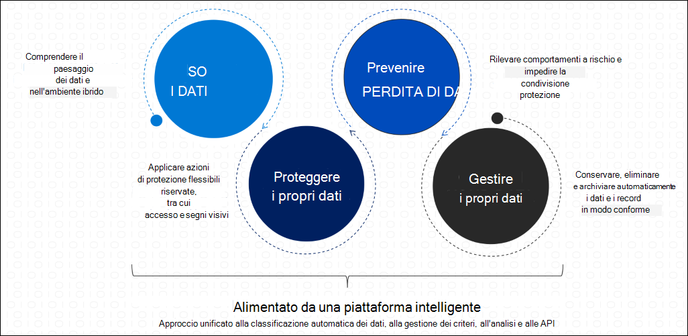

# Microsoft Information Protection in Microsoft 365.Microsoft Information Protection in Microsoft 365

>*[Licenze per sicurezza e conformità di Microsoft 365](https://docs.microsoft.com/office365/servicedescriptions/microsoft-365-service-descriptions/microsoft-365-tenantlevel-services-licensing-guidance/microsoft-365-security-compliance-licensing-guidance)**[Licensing for Microsoft 365 Security & Compliance](https://docs.microsoft.com/office365/servicedescriptions/microsoft-365-service-descriptions/microsoft-365-tenantlevel-services-licensing-guidance/microsoft-365-security-compliance-licensing-guidance)*

Implementare Microsoft Information Protection (MIP) per individuare, classificare e proteggere le informazioni sensibili, ovunque ci si trovi.Implement Microsoft Information Protection (MIP) to help you discover, classify, and protect sensitive information wherever it lives or travels.

Le funzionalità MIP sono incluse nella conformità di Microsoft 365 ed è possibile usare gli strumenti per [conoscere i dati](#know-your-data), [proteggere i dati](#protect-your-data)e [impedire la perdita di dati](#prevent-data-loss).MIP capabilities are included with Microsoft 365 Compliance and give you the tools to [know your data](#know-your-data), [protect your data](#protect-your-data), and [prevent data loss](#prevent-data-loss).

Per informazioni su come gestire i dati, vedere [Microsoft Information Governance in Microsoft 365](manage-Information-governance.md).For information about governing your data, see [Microsoft Information Governance in Microsoft 365](manage-Information-governance.md).

## Riconoscere i propri datiKnow your data

> [!NOTE]
> Per informazioni su come classificare ed etichettare i dati in Azure Purview, attualmente in anteprima, vedere  [Etichettare contenuto in Azure Purview](https://docs.microsoft.com/azure/purview/create-sensitivity-label).For information about classifying and labeling data in Azure Purview, currently in preview, see [Automatically label your content in Azure Purview](https://docs.microsoft.com/azure/purview/create-sensitivity-label).

Per comprendere l’insieme dei dati e identificare i dati importanti nell'ambiente ibrido, usare le funzionalità seguenti:To understand your data landscape and identify important data across your hybrid environment, use the following capabilities:
 
|FunzionalitàCapability|Che problemi risolve?What problems does it solve?|Per iniziareGet started|
|:------|:------------|:--------------------|:-----------------------------|
|[Tipi di informazioni sensibiliSensitive information types](sensitive-information-type-entity-definitions.md)| Identifica i dati sensibili usando espressioni regolari predefinite o personalizzate o una funzione, insieme a prove corroborative che includono parole chiave, livelli di confidenza e prossimità.Identifies sensitive data by using built-in or custom regular expressions or a function, together with corroborative evidence that includes keywords, confidence levels, and proximity.| [Personalizzare una tipologia integrata di informazioni sensibiliCustomize a built-in sensitive information type](customize-a-built-in-sensitive-information-type.md)|
|[Classificatori sottoponibili a training (anteprima)Trainable classifiers (preview)](classifier-learn-about.md)| Classifica i dati automaticamente, usando uno dei classificatori predefiniti o sottoponendo a training un classificatore con il proprio contenutoClassifies data for you, using one of the built-in classifiers or train a classifier with your own content | [Introduzione ai classificatori sottoponibili a training (anteprima)Get started with trainable classifiers (preview)](classifier-get-started-with.md) |
|[Classificazione dei datiData classification](data-classification-overview.md) | Identifica elementi che hanno un'etichetta di riservatezza, un'etichetta di conservazione o sono stati classificati come tipo di informazioni sensibili nell'organizzazione e le azioni degli utenti su di esse.Identifies items that have a sensitivity label, a retention label, or have been classified as a sensitive information type in your organization and the actions that your users are taking on them  | [Introduzione a Esplora contenutoGet started with content explorer](data-classification-content-explorer.md)   [Introduzione a Esplora attivitàGet started with activity explorer](data-classification-activity-explorer.md) |

## Proteggere i propri datiProtect your data

Applicare azioni di protezione flessibili che includono crittografia, restrizioni di accesso e contrassegni visivi, usare le funzionalità seguenti:To apply flexible protection actions that include encryption, access restrictions, and visual markings, use the following capabilities:

|FunzionalitàCapability|Che problemi risolve?What problems does it solve?|Per iniziareGet started|
|:------|:------------|---------------------|:----------------------------|
|[Etichette di riservatezzaSensitivity labels](sensitivity-labels.md)| Una singola soluzione tra app, servizi e dispositivi per etichettare e proteggere i dati mentre viaggiano all'interno e all'esterno dell'organizzazioneA single solution across apps, services, and devices to label and protect your data as it travels inside and outside your organization   Scenario esemplificativo: [Applicare e visualizzare le etichette di riservatezza in Power BI e proteggere i dati durante l'esportazione](https://docs.microsoft.com/power-bi/admin/service-security-apply-data-sensitivity-labels)Example scenario: [Apply and view sensitivity labels in Power BI, and protect data when it is exported](https://docs.microsoft.com/power-bi/admin/service-security-apply-data-sensitivity-labels)|[Iniziare a usare le etichette di riservatezza Get started with sensitivity labels](get-started-with-sensitivity-labels.md) |
|[Client di etichettatura unificata di Azure Information Protection Azure Information Protection unified labeling client](https://docs.microsoft.com/azure/information-protection/rms-client/aip-clientv2)| Per i computer Windows, estende le etichette di riservatezza per altre caratteristiche e funzionalità che includono l'etichettatura e la protezione di tutti i tipi di file da Esplora file e PowerShellFor Windows computers, extends sensitivity labels for additional features and functionality that includes labeling and protecting all file types from File Explorer and PowerShell   Esempio di funzionalità supplementari: [Configurazioni personalizzate per il client di etichettatura unificato di Azure Information Protection](https://docs.microsoft.com/azure/information-protection/rms-client/clientv2-admin-guide-customizations)Example additional features: [Custom configurations for the Azure Information Protection unified labeling client](https://docs.microsoft.com/azure/information-protection/rms-client/clientv2-admin-guide-customizations)| [Guida dell’amministratore client per l’etichettatura unificata di Azure Information ProtectionAzure Information Protection unified labeling client administrator guide](https://docs.microsoft.com/azure/information-protection/rms-client/clientv2-admin-guide)|
|[Crittografia a chiave doppiaDouble Key Encryption](double-key-encryption.md)| In tutti i casi, solo l’utente autorizzato può decrittografare il contenuto protetto o, in base a i requisiti normativi, l’utente deve essere in possesso di chiave di crittografia in base a un confine geografico.Under all circumstances, only you can ever decrypt protected content, or for regulatory requirements you must hold encryption keys within a geographical boundary | [Crittografia a chiave doppiaDeploy Double Key Encryption](double-key-encryption.md#deploy-dke)|
|[Office 365 Message Encryption (OME)Office 365 Message Encryption (OME)](ome.md)| Consente di crittografare i messaggi di posta elettronica e i documenti allegati inviati a qualsiasi utente da qualsiasi dispositivo, in modo che solo i destinatari autorizzati possano leggere le informazioni di posta elettronicaEncrypts email messages and attached documents that are sent to any user on any device, so only authorized recipients can read emailed information    Scenario esemplificativo: [Revocare un'e-mail crittografata da Advanced Message Encryption](revoke-ome-encrypted-mail.md)Example scenario: [Revoke email encrypted by Advanced Message Encryption](revoke-ome-encrypted-mail.md) | [Configurare le nuove funzionalità di Message EncryptionSet up new Message Encryption capabilities](set-up-new-message-encryption-capabilities.md)|
|[Crittografia del servizio con Customer KeyService encryption with Customer Key](customer-key-overview.md) | Protegge dalla visualizzazione dei dati da parte di sistemi o personale non autorizzati e integra la crittografia disco BitLocker nei Data Center Microsoft.Protects against viewing of data by unauthorized systems or personnel, and complements BitLocker disk encryption in Microsoft datacenters | [Configurare Customer Key per Office 365Set up Customer Key for Office 365](customer-key-set-up.md)|
|[Information Rights Management (IRM)SharePoint Information Rights Management (IRM)](set-up-irm-in-sp-admin-center.md#irm-enable-sharepoint-document-libraries-and-lists)|Protegge gli elenchi e le raccolte di SharePoint in modo che, quando un utente estrae un documento, il file scaricato sia protetto in modo che solo gli utenti autorizzati possano visualizzare e usare il file in base ai criteri specificati.Protects SharePoint lists and libraries so that when a user checks out a document, the downloaded file is protected so that only authorized people can view and use the file according to policies that you specify | [Configurare Information Rights Management (IRM) nell'interfaccia di amministrazione di SharePointSet up Information Rights Management (IRM) in SharePoint admin center](set-up-irm-in-sp-admin-center.md)|
[Connettore Rights ManagementRights Management connector](https://docs.microsoft.com/azure/information-protection/deploy-rms-connector) |Protezione-solo per le distribuzioni locali esistenti che usano Exchange o SharePoint Server o file server che eseguono Windows Server e un'infrastruttura di classificazione file (FCI)Protection-only for existing on-premises deployments that use Exchange or SharePoint Server, or file servers that run Windows Server and File Classification Infrastructure (FCI) | [Procedura per distribuire il connettore RMSSteps to deploy the RMS connector](https://docs.microsoft.com/azure/information-protection/deploy-rms-connector#steps-to-deploy-the-rms-connector)
|[Scanner per l’etichettatura unificata di Azure Information ProtectionAzure Information Protection unified labeling scanner](https://docs.microsoft.com/azure/information-protection/deploy-aip-scanner)| Consente di individuare, etichettare e proteggere le informazioni riservate che risiedono negli archivi dati localiDiscovers, labels, and protects sensitive information that resides in data stores that are on premises | [Configurazione e installazione dello scanner di etichettatura unificata di Azure Information Protection.rConfiguring and installing the Azure Information Protection unified labeling scanner](https://docs.microsoft.com/azure/information-protection/deploy-aip-scanner-configure-install)|
|[Microsoft Cloud App SecurityMicrosoft Cloud App Security](https://docs.microsoft.com/cloud-app-security/what-is-cloud-app-security)| Consente di individuare, etichettare e proteggere le informazioni riservate che si trovano negli archivi dati nel cloudDiscovers, labels, and protects sensitive information that resides in data stores that are in the cloud | [Individuare, classificare, etichettare e proteggere i dati regolamentati e sensibili archiviati nel cloudDiscover, classify, label, and protect regulated and sensitive data stored in the cloud](https://docs.microsoft.com/cloud-app-security/best-practices#discover-classify-label-and-protect-regulated-and-sensitive-data-stored-in-the-cloud)|
|[SDK di Microsoft Information ProtectionMicrosoft Information Protection SDK](https://docs.microsoft.com/information-protection/develop/overview#microsoft-information-protection-sdk)|Estendere le etichette di riservatezza ad app e servizi di terze partiExtends sensitivity labels to third-party apps and services     Scenario esemplificativo: [impostare e ottenere un'etichetta di riservatezza ( C++ )](https://docs.microsoft.com/information-protection/develop/quick-file-set-get-label-cpp)Example scenario: [Set and get a sensitivity label (C++)](https://docs.microsoft.com/information-protection/develop/quick-file-set-get-label-cpp) |[Installazione e configurazione del kit SDK di Microsoft Information Protection (MIP)Microsoft Information Protection (MIP) SDK setup and configuration](https://docs.microsoft.com/information-protection/develop/setup-configure-mip)|

## Prevenire la perdita di datiPrevent data loss

Per evitare la condivisione accidentale di informazioni riservate, usare le funzionalità seguenti:To help prevent accidental oversharing of sensitive information, use the following capabilities:

|FunzionalitàCapability|Che problemi risolve?What problems does it solve?|Per iniziareGet started|
|:------|:------------|:---------------------|:-----------------------------|
|[Data loss prevention (DLP)Data loss prevention (DLP)](data-loss-prevention-policies.md)| Prevenzione della condivisione involontaria di elementi riservatiHelps prevent unintentional sharing of sensitive items   Scenario esemplificativo: [Proteggere le informazioni riservate nella chat e nei messaggi di canale di Microsoft Teams](dlp-microsoft-teams.md)Example scenario: [Protect sensitive information in Microsoft Teams chat and channel messages](dlp-microsoft-teams.md) | [Cominciare con il criterio di prevenzione della perdita dei dati predefinitoGet started with the default DLP policy](get-started-with-the-default-dlp-policy.md)|
|[Informazioni sulla prevenzione della perdita di dati degli endpointLearn about Endpoint data loss prevention](endpoint-dlp-learn-about.md)| Consente di estendere le funzionalità DLP agli elementi usati e condivisi nei computer con Windows 10Extends DLP capabilities to items that are used and shared on Windows 10 computers | [Introduzione alla prevenzione della perdita di dati degli endpointGet started with Endpoint data loss prevention](endpoint-dlp-getting-started.md)|
