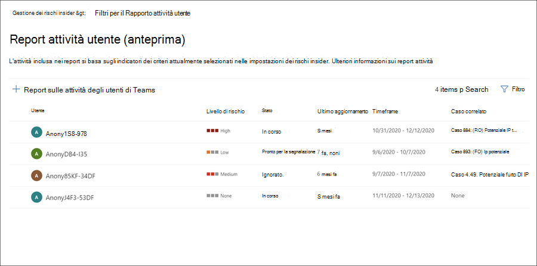
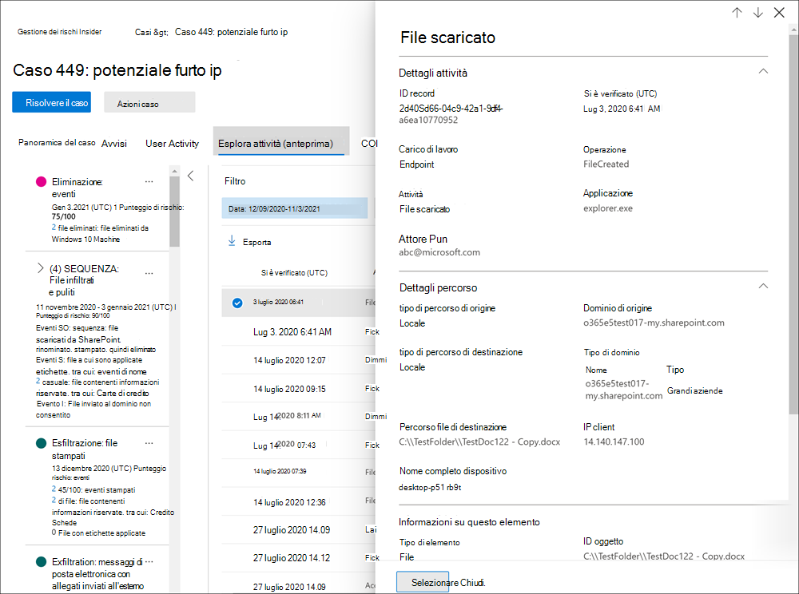

# Analizzare le attività di gestione dei rischi insider

L'analisi delle attività degli utenti rischiose è un primo passo importante per ridurre al minimo i rischi insider per l'organizzazione. Questi rischi possono essere attività che generano avvisi dai criteri di gestione dei rischi insider o rischi derivanti da attività rilevate dai criteri ma che non creano immediatamente un avviso per la gestione dei rischi insider per gli utenti. È possibile analizzare questi tipi di attività utilizzando i **report attività utente (anteprima)** o con il **dashboard di avviso.**

## Report attività utente (anteprima)

I report attività utente consentono di esaminare le attività per utenti specifici per un periodo di tempo definito senza doverle assegnare temporaneamente o esplicitamente a un criterio di gestione dei rischi insider. Nella maggior parte degli scenari di gestione dei rischi insider, gli utenti vengono definiti in modo esplicito nei criteri e possono disporre di avvisi per i criteri (a seconda degli eventi di attivazione) e dei punteggi di rischio associati alle attività. Tuttavia, in alcuni scenari è possibile esaminare le attività per gli utenti che non sono esplicitamente definite in un criterio. Potrebbero trattarsi di utenti che hanno ricevuto un suggerimento sull'utente e sulle attività potenzialmente rischiose o utenti che in genere non devono essere assegnati a un criterio di gestione dei rischi insider.

Dopo aver configurato gli indicatori nella pagina insider risk **management Impostazioni,** viene rilevata l'attività dell'utente per le attività rischiose associate agli indicatori selezionati. Non è necessario configurare criteri per i report attività utente per rilevare e segnalare attività rischiose da parte degli utenti dell'organizzazione. Le attività incluse nei report attività utente non richiedono l'attivazione di eventi per la visualizzazione delle attività. Questa configurazione significa che tutte le attività rilevate per l'utente sono disponibili per la revisione, indipendentemente dal fatto che abbia un evento di attivazione o se crei un avviso. I report vengono creati per utente e possono includere tutte le attività per un periodo personalizzato di 90 giorni. Non sono supportati più report per lo stesso utente.

Dopo aver esaminato le attività per un utente, gli investigatori possono ignorare le singole attività come benigne, condividere o inviare tramite posta elettronica un collegamento al report con altri investigatori oppure scegliere di assegnare l'utente temporaneamente o esplicitamente a un criterio di gestione dei rischi insider. Gli utenti devono essere assegnati al gruppo di ruoli *Insider Risk Management Investigators* per visualizzare la **pagina Report attività** utente.  

Per iniziare, selezionare **Gestisci report nella** sezione **Analizzare** le attività degli utenti nella pagina Panoramica sulla gestione dei **rischi insider.** Per visualizzare le attività di un utente, selezionare innanzitutto **Crea report** attività utente e completare i campi seguenti nel riquadro Nuovo report **attività utente:**

- **Utente:** cercare un utente in base al nome o all'indirizzo di posta elettronica
- **Data inizio**: utilizzare il controllo calendario per selezionare la data di inizio per le attività dell'utente.
- **Data di fine**: utilizzare il controllo calendario per selezionare la data di fine per le attività dell'utente. La data di fine selezionata deve essere maggiore di due giorni dopo la data di inizio selezionata e non più di 90 giorni dalla data di inizio selezionata.
I nuovi report in genere richiedono fino a 10 ore prima di essere pronti per la revisione. Quando il report è pronto, verrà visualizzato *Report pronto* nella colonna **Stato** della pagina Report attività utente. Selezionare l'utente per visualizzare il report dettagliato:

Il **report Attività utente per** l'utente selezionato contiene le schede Attività **utente** ed **Esplora** attività:

- **Attività utente**: utilizzare questa visualizzazione grafico per analizzare le attività e visualizzare le potenziali attività che si verificano in sequenze. Questa scheda è strutturata per consentire una rapida revisione di un caso, inclusa una cronologia di tutte le attività, i dettagli dell'attività, il punteggio di rischio corrente per l'utente nel caso, la sequenza di eventi di rischio e i controlli di filtro per facilitare gli sforzi investigativi.
- **Esplora attività:** la **scheda Esplora** attività offre agli investigatori dei rischi uno strumento analitico completo che fornisce informazioni dettagliate sulle attività. Con Esplora attività, i revisori possono esaminare rapidamente una sequenza temporale delle attività rischiose rilevate e identificare e filtrare tutte le attività di rischio associate agli avvisi. Per altre informazioni sull'uso di Esplora attività, vedi la *sezione Esplora* attività più avanti in questo articolo.

## Dashboard degli avvisi

Gli avvisi di gestione dei rischi Insider vengono generati automaticamente tramite gli indicatori di rischio definiti nei criteri di gestione dei rischi Insider. Questi avvisi offrono agli analisti e agli investigatori della conformità una visione d'insieme sullo stato di rischio corrente, consentendo all'organizzazione di valutare e di intraprendere azioni contro i rischi rilevati. Per impostazione predefinita, i criteri generano una determinata quantità di avvisi di gravità bassa, media e alta, ma è possibile aumentare o ridurre il [volume](insider-risk-management-settings.md#alert-volume) degli avvisi in base alle proprie esigenze. Inoltre, è possibile configurare la soglia di [avviso per gli indicatori dei](insider-risk-management-settings.md#indicator-level-settings-preview) criteri quando si crea un nuovo criterio con la procedura guidata dei criteri.

Per una panoramica di come gli avvisi forniscono dettagli, contesto e contenuti correlati per attività rischiose e su come rendere più efficace il processo di analisi, vedere il video Insider [Risk Management Alerts Triage Experience.](https://www.youtube.com/watch?v=KgmpxBLJLPI)

Il dashboard di avviso **per il rischio** insider consente di visualizzare e agire sugli avvisi generati dai criteri di rischio insider. Ogni widget di report visualizza informazioni per gli ultimi 30 giorni.

- **Totale avvisi che devono essere esaminati**: viene elencato il numero totale di avvisi che necessitano di revisione e valutazione, inclusa una suddivisione in base alla gravità dell'avviso.
- **Avvisi aperti negli ultimi 30** giorni: numero totale di avvisi creati dai criteri corrispondenti negli ultimi 30 giorni, ordinati in base ai livelli di gravità degli avvisi alti, medi e bassi.
- **Tempo medio per la risoluzione degli avvisi**: riepilogo delle statistiche di avviso utili:
  - Tempo medio di risoluzione degli avvisi di gravità elevata, elencato in ore, giorni o mesi.
  - Tempo medio di risoluzione degli avvisi di gravità media, elencato in ore, giorni o mesi.
  - Tempo medio di risoluzione degli avvisi di gravità bassa, elencato in ore, giorni o mesi.

> [!NOTE]
> La gestione dei rischi Insider usa la limitazione degli avvisi incorporata al fine di contribuire alla protezione e ottimizzazione dell'esperienza di indagine e revisione dei rischi. Tale limitazione protegge da problemi che possono causare un sovraccarico di avvisi relativi a criteri, come ad esempio connettori di dati configurati in modo non corretto o criteri di prevenzione della perdita dei dati. Di conseguenza, potrebbe verificarsi un ritardo nella visualizzazione di nuovi avvisi per un utente.

## Stato e gravità dell'avviso

È possibile eseguire il triage degli avvisi in uno dei seguenti stati:

- **Confirmed**: avviso confermato e assegnato a un caso nuovo o esistente.
- **Dismissed**: avviso ignorato come benigno nel processo di triage.
- **Revisione delle esigenze**: nuovo avviso in cui non sono ancora state eseguite azioni di valutazione.
- **Risolto**: avviso che fa parte di un caso chiuso e risolto.

I punteggi dei rischi di avviso vengono calcolati automaticamente da diversi indicatori di attività di rischio. Questi indicatori includono il tipo di attività di rischio, il numero e la frequenza dell'occorrenza dell'attività, la cronologia dell'attività di rischio utente e l'aggiunta di rischi di attività che possono aumentare la gravità dell'attività. Il punteggio di rischio dell'avviso determina l'assegnazione programmatica di un livello di gravità del rischio per ogni avviso e non può essere personalizzato. Se gli avvisi non vengono ancora inviati e le attività di rischio continuano a accumularsi nell'avviso, il livello di gravità del rischio può aumentare. Gli analisti e gli investigatori del rischio possono utilizzare la gravità del rischio degli avvisi per facilitare la valutazione degli avvisi in base ai criteri e agli standard di rischio dell'organizzazione.

I livelli di gravità del rischio di avviso sono:

- **Gravità elevata:** le attività e gli indicatori per l'avviso rappresentano un rischio significativo. Le attività di rischio associate sono gravi, ripetitive e sono fortemente correlate ad altri fattori di rischio significativi.
- **Gravità media:** le attività e gli indicatori per l'avviso rappresentano un rischio moderato. Le corrispondenti attività di rischio sono moderate, frequenti e in certa misura correlate ad altri fattori di rischio.
- **Gravità bassa:** le attività e gli indicatori per l'avviso rappresentano un rischio minore. Le attività di rischio associate sono secondarie, più poco frequenti e non sono correlate ad altri fattori di rischio significativi.

## Filtrare gli avvisi nel dashboard degli avvisi

A seconda del numero e del tipo di criteri di gestione dei rischi Insider adottati nell'organizzazione, la revisione di una lunga coda di avvisi può rappresentare una sfida. L'uso di filtri di avviso può aiutare analisti e investigatori a ordinare gli avvisi in base a diversi attributi. Per filtrare gli avvisi nel **dashboard Avvisi,** selezionare il **controllo** Filtro. È possibile filtrare gli avvisi in base a uno o più attributi:

- **Stato:** selezionare uno o più valori di stato per filtrare l'elenco degli avvisi. Le opzioni sono *Confermato*, *Ignorato*, *Da rivedere* e *Risolto*.
- **Gravità:** selezionare uno o più livelli di gravità del rischio di avviso per filtrare l'elenco degli avvisi. Le opzioni sono *Elevato*, *Medio* e *Basso*.
- **Ora rilevata:** selezionare le date di inizio e di fine per la creazione dell'avviso.
- **Criterio:** selezionare uno o più criteri per filtrare gli avvisi generati dai criteri selezionati.

## Ricerca degli avvisi nel dashboard degli avvisi

Per cercare una parola specifica nel nome dell'avviso, selezionare il controllo **Ricerca** e digitare la parola desiderata. I risultati della ricerca mostreranno tutti gli avvisi relativi a tale criterio contenenti la parola cercata.

## Avvisi di triage

Per eseguire la valutazione di un avviso di rischio insider, completare i passaggi seguenti:

1. Nel [Centro conformità Microsoft 365](https://compliance.microsoft.com), passare a **Gestione dei rischi Insider** e selezionare la **scheda** Avvisi.
2. Nel **dashboard Avvisi** selezionare l'avviso che si desidera utilizzare.
3. Nel riquadro **dei dettagli degli avvisi** è possibile esaminare le schede seguenti e analizzare l'avviso:
    - **Riepilogo:** questa scheda contiene informazioni generali sull'avviso e consente di confermare l'avviso e creare un nuovo caso o di ignorare l'avviso. Include lo stato corrente per l'avviso e il livello di gravità del rischio di avviso, elencato come *Alto,* *Medio* o *Basso.* Il livello di gravità può aumentare o diminuire nel tempo se l'avviso non viene triaged.
        - **What happened (preview)**: Visualizza le prime tre attività di rischio e le corrispondenze dei criteri durante il periodo di valutazione dell'attività, incluso il tipo di violazione associata all'attività e il numero di occorrenze.
        - **Dettagli utente**: visualizza informazioni generali sull'utente assegnato all'avviso. Se l'anonimizzazione è abilitata, i campi nome utente, indirizzo di posta elettronica, alias e organizzazione vengono anonimi.
        - **Dettagli avviso**: include il periodo di tempo dopo la generazione dell'avviso, i criteri che hanno generato l'avviso e il caso generato dall'avviso. Per i nuovi avvisi, nel **campo Caso** viene visualizzato Nessuno.
        - **Contenuto rilevato (anteprima):** include il contenuto associato alle attività di rischio per l'avviso e riepiloga gli eventi di attività in base alle aree chiave. Se si seleziona un collegamento a un'attività, viene aperto Esplora attività e vengono visualizzati ulteriori dettagli sull'attività.
    - **Attività utente**: in questa scheda viene visualizzata la cronologia delle attività per l'utente associato all'avviso. Questa cronologia include altri avvisi e attività correlati agli indicatori di rischio definiti nel modello assegnato al criterio per questo avviso. Questa cronologia consente agli analisti e agli investigatori del rischio di fattori di qualsiasi comportamento rischioso passato per il dipendente nell'ambito del processo di valutazione.
    - **Azioni**: sono disponibili le azioni seguenti per ogni avviso:
        - **Apri visualizzazione espansa**: apre il dashboard **esplora** attività.
        - **Conferma e crea caso**: utilizzare questa azione per confermare e creare un nuovo caso per tutti gli avvisi associati a un utente. Questa azione modifica automaticamente lo stato dell'avviso *in Confermato*.
        - **Ignora avviso:** utilizzare questa azione per ignorare l'avviso. Questa azione modifica lo stato dell'avviso in *Risolto*.

## Esplora attività (anteprima)

> [!NOTE]
> Esplora attività è disponibile nell'area di gestione degli avvisi per gli utenti che attivano eventi dopo che questa funzionalità è disponibile nell'organizzazione.

Esplora attività offre agli investigatori e agli analisti dei rischi uno strumento analitico completo che fornisce informazioni dettagliate sugli avvisi. Con Esplora attività, i revisori possono esaminare rapidamente una sequenza temporale delle attività rischiose rilevate e identificare e filtrare tutte le attività di rischio associate agli avvisi. Per filtrare gli avvisi in Esplora attività, selezionare il controllo Filtro. È possibile filtrare gli avvisi in base a uno o più attributi elencati nel riquadro dei dettagli per l'avviso. Esplora attività supporta anche colonne personalizzabili per consentire a investigatori e analisti di concentrare il dashboard sulle informazioni più importanti per loro.

Per usare **Esplora attività,** completare la procedura seguente:

1. Nella finestra Centro conformità Microsoft 365, vai a **Gestione dei rischi Insider** e seleziona la **scheda** Avvisi.
2. Nel **dashboard Avvisi** selezionare l'avviso che si desidera utilizzare.
3. Nel riquadro **dei dettagli degli avvisi** selezionare Apri visualizzazione **espansa.**
4. Nella pagina dell'avviso selezionato selezionare la **scheda Esplora** attività.

Quando si esaminano le attività in Esplora attività, gli investigatori e gli analisti possono selezionare un'attività specifica e aprire il riquadro dei dettagli dell'attività. Nel riquadro vengono visualizzate informazioni dettagliate sull'attività che gli investigatori e gli analisti possono utilizzare durante il processo di analisi degli avvisi. Le informazioni dettagliate possono fornire contesto per l'avviso e facilitare l'identificazione dell'ambito completo dell'attività di rischio che ha attivato l'avviso.

## Creare un caso per un avviso

Quando l'avviso viene esaminato e esaminato, è possibile creare un nuovo caso per analizzare ulteriormente l'attività di rischio. Per creare un caso per un avviso, attenersi alla seguente procedura:

1. Nel [Centro conformità Microsoft 365](https://compliance.microsoft.com), passare a **Gestione dei rischi Insider** e selezionare la **scheda** Avvisi.
2. Nel **dashboard Avvisi** selezionare l'avviso per cui si desidera confermare e creare un nuovo caso.
3. Nel riquadro **Dei dettagli degli avvisi** selezionare Azioni   >  **Confermare gli avvisi & creare il caso.**
4. Nella finestra **di dialogo Conferma avviso e crea** caso di rischio insider immetti un nome per il caso, seleziona gli utenti da aggiungere come collaboratori e aggiungi commenti come applicabili. I commenti vengono aggiunti automaticamente al caso come nota del caso.
5. Selezionare **Crea caso** per creare un nuovo caso o Annulla per chiudere la finestra di dialogo senza creare un caso. 

Dopo la creazione del caso, gli investigatori e gli analisti possono gestire e agire sul caso. Per altre informazioni, vedi [l'articolo caso di gestione dei rischi Insider.](insider-risk-management-cases.md)
