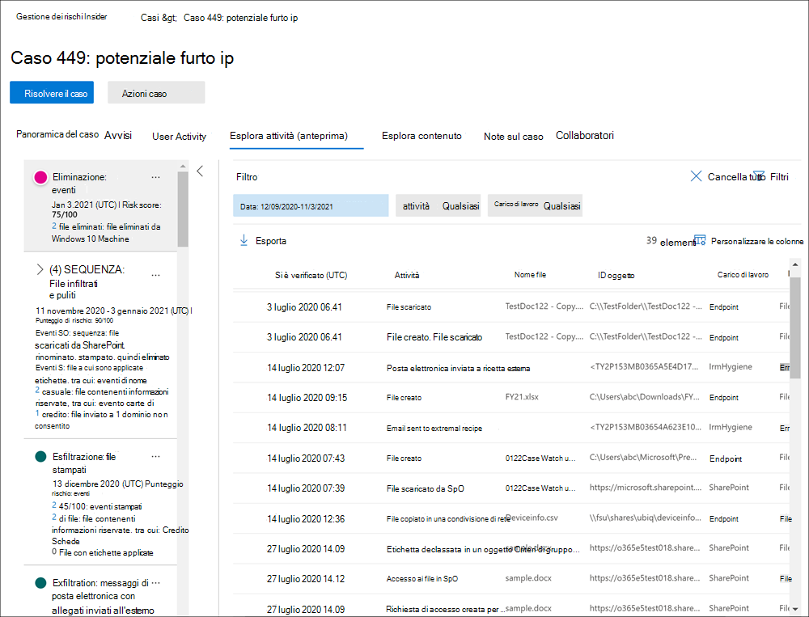

# Analizzare le attività di gestione dei rischi insiderInvestigate insider risk management activities

L'analisi delle attività degli utenti rischiose è un primo passo importante per ridurre al minimo i rischi insider per l'organizzazione.Investigating risky user activities is an important first step in minimizing insider risks for your organization. Questi rischi possono essere attività che generano avvisi dai criteri di gestione dei rischi insider o rischi derivanti da attività rilevate dai criteri ma che non creano immediatamente un avviso per la gestione dei rischi insider per gli utenti.These risks may be activities that generate alerts from insider risk management policies, or risks from activities that are detected by policies but do not immediately create an insider risk management alert for users. È possibile analizzare questi tipi di attività utilizzando i **report attività utente (anteprima)** o con il **dashboard di avviso.**You can investigate these types of activities by using the **User activity reports (preview)** or with the **Alert dashboard**.

## Report attività utente (anteprima)User activity reports (preview)

I report attività utente consentono di esaminare le attività per utenti specifici per un periodo di tempo definito senza doverle assegnare temporaneamente o esplicitamente a un criterio di gestione dei rischi insider.User activity reports allow you to examine activities for specific users for a defined time period without having to assign them temporarily or explicitly to an insider risk management policy. Nella maggior parte degli scenari di gestione dei rischi insider, gli utenti vengono definiti in modo esplicito nei criteri e possono disporre di avvisi per i criteri (a seconda degli eventi di attivazione) e dei punteggi di rischio associati alle attività.In most insider risk management scenarios, users are explicitly defined in policies, and they may have policy alerts (depending on triggering events) and risk scores associated with the activities. Tuttavia, in alcuni scenari è possibile esaminare le attività per gli utenti che non sono esplicitamente definite in un criterio.But in some scenarios, you may want to examine the activities for users that aren't explicitly defined in a policy. Potrebbero trattarsi di utenti che hanno ricevuto un suggerimento sull'utente e sulle attività potenzialmente rischiose o utenti che in genere non devono essere assegnati a un criterio di gestione dei rischi insider.These may be users that you've received a tip about the user and potentially risky activities, or users that typically don't need to be assigned to an insider risk management policy.

Dopo aver configurato gli indicatori nella pagina insider risk **management Impostazioni,** viene rilevata l'attività dell'utente per le attività rischiose associate agli indicatori selezionati.After you've configured indicators on the insider risk management **Settings** page, user activity is detected for risky activity associated with the selected indicators. Non è necessario configurare criteri per i report attività utente per rilevare e segnalare attività rischiose da parte degli utenti dell'organizzazione.You do not have to configure a policy for user activity reports to detect and report risky activities by users in your organization. Le attività incluse nei report attività utente non richiedono l'attivazione di eventi per la visualizzazione delle attività.Activities included in user activity reports do not require triggering events for the activities to be displayed. Questa configurazione significa che tutte le attività rilevate per l'utente sono disponibili per la revisione, indipendentemente dal fatto che abbia un evento di attivazione o se crei un avviso.This configuration means that all detected activity for the user is available for review, regardless if it has a triggering event or if it creates an alert. I report vengono creati per utente e possono includere tutte le attività per un periodo personalizzato di 90 giorni.Reports are created on a per-user basis and can include all activities for a custom 90-day period. Non sono supportati più report per lo stesso utente.Multiple reports for the same user aren't supported.

Dopo aver esaminato le attività per un utente, gli investigatori possono ignorare le singole attività come benigne, condividere o inviare tramite posta elettronica un collegamento al report con altri investigatori oppure scegliere di assegnare l'utente temporaneamente o esplicitamente a un criterio di gestione dei rischi insider.After examining activities for a user, investigators can dismiss individual activities as benign, share or email a link to the report with other investigators, or choose to assign the user temporarily or explicitly to an insider risk management policy. Gli utenti devono essere assegnati al gruppo di ruoli *Insider Risk Management Investigators* per visualizzare la **pagina Report attività** utente.Users must be assigned to the *Insider Risk Management Investigators* role group to view the **User activity reports** page.  

Per iniziare, selezionare **Gestisci report nella** sezione **Analizzare** le attività degli utenti nella pagina Panoramica sulla gestione dei **rischi insider.**You can get started by selecting **Manage reports** in the **Investigate user activity** section on the insider risk management **Overview** page. Per visualizzare le attività di un utente, selezionare innanzitutto **Crea report** attività utente e completare i campi seguenti nel riquadro Nuovo report **attività utente:**To view activities for a user, first select **Create user activity report** and complete the following fields in the **New user activity report** pane:

- **Utente:** cercare un utente in base al nome o all'indirizzo di posta elettronica**User**: Search for a user by name or email address
- **Data inizio**: utilizzare il controllo calendario per selezionare la data di inizio per le attività dell'utente.**Start date**: Use the calendar control to select the start date for user activities.
- **Data di fine**: utilizzare il controllo calendario per selezionare la data di fine per le attività dell'utente.**End date**: Use the calendar control to select the end date for user activities. La data di fine selezionata deve essere maggiore di due giorni dopo la data di inizio selezionata e non più di 90 giorni dalla data di inizio selezionata.The end date selected must be greater than two days after the selected start date and no greater than 90 days from the selected start date.
I nuovi report in genere richiedono fino a 10 ore prima di essere pronti per la revisione.New reports typically take up to 10 hours before they are ready for review. Quando il report è pronto, verrà visualizzato *Report pronto* nella colonna **Stato** della pagina Report attività utente.When the report is ready, you'll see *Report ready* in the **Status** column on the User activity report page. Selezionare l'utente per visualizzare il report dettagliato:Select the user to view the detailed report:

Il **report Attività utente per** l'utente selezionato contiene le schede Attività **utente** ed **Esplora** attività:The **User activity report** for the selected user contains the **User activity** and **Activity explorer** tabs:

- **Attività utente**: utilizzare questa visualizzazione grafico per analizzare le attività e visualizzare le potenziali attività che si verificano in sequenze.**User activity**: Use this chart view to investigate activities and view potential activities that occur in sequences. Questa scheda è strutturata per consentire una rapida revisione di un caso, inclusa una cronologia di tutte le attività, i dettagli dell'attività, il punteggio di rischio corrente per l'utente nel caso, la sequenza di eventi di rischio e i controlli di filtro per facilitare gli sforzi investigativi.This tab is structured to enable quick review of a case, including a historical timeline of all activities, activity details, the current risk score for the user in the case, the sequence of risk events, and filtering controls to help with investigative efforts.
- **Esplora attività:** la **scheda Esplora** attività offre agli investigatori dei rischi uno strumento analitico completo che fornisce informazioni dettagliate sulle attività.**Activity explorer**: The **Activity explorer** tab provides risk investigators with a comprehensive analytic tool that provides detailed information about activities. Con Esplora attività, i revisori possono esaminare rapidamente una sequenza temporale delle attività rischiose rilevate e identificare e filtrare tutte le attività di rischio associate agli avvisi.With the Activity explorer, reviewers can quickly review a timeline of detected risky activity and identify and filter all risk activities associated with alerts. Per altre informazioni sull'uso di Esplora attività, vedi la *sezione Esplora* attività più avanti in questo articolo.To learn more about using the Activity explorer, see the *Activity explorer* section later in this article.

## Dashboard degli avvisiAlert dashboard

Gli avvisi di gestione dei rischi Insider vengono generati automaticamente tramite gli indicatori di rischio definiti nei criteri di gestione dei rischi Insider.Insider risk management alerts are automatically generated by risk indicators defined in insider risk management policies. Questi avvisi offrono agli analisti e agli investigatori della conformità una visione d'insieme sullo stato di rischio corrente, consentendo all'organizzazione di valutare e di intraprendere azioni contro i rischi rilevati.These alerts give compliance analysts and investigators an all-up view of the current risk status and allow your organization to triage and take actions for discovered risks. Per impostazione predefinita, i criteri generano una determinata quantità di avvisi di gravità bassa, media e alta, ma è possibile aumentare o ridurre il [volume](insider-risk-management-settings.md#alert-volume) degli avvisi in base alle proprie esigenze.By default, policies generate a certain amount of low, medium, and high severity alerts, but you can [increase or decrease the alert volume](insider-risk-management-settings.md#alert-volume) to suit your needs. Inoltre, è possibile configurare la soglia di [avviso per gli indicatori dei](insider-risk-management-settings.md#indicator-level-settings-preview) criteri quando si crea un nuovo criterio con la procedura guidata dei criteri.Additionally, you can configure the [alert threshold for policy indicators](insider-risk-management-settings.md#indicator-level-settings-preview) when creating a new policy with the policy wizard.

Per una panoramica di come gli avvisi forniscono dettagli, contesto e contenuti correlati per attività rischiose e su come rendere più efficace il processo di analisi, vedere il video Insider [Risk Management Alerts Triage Experience.](https://www.youtube.com/watch?v=KgmpxBLJLPI)Check out the [Insider Risk Management Alerts Triage Experience video](https://www.youtube.com/watch?v=KgmpxBLJLPI) for an overview of how alerts provide details, context, and related content for risky activity and how to make your investigation process more effective.

Il dashboard di avviso **per il rischio** insider consente di visualizzare e agire sugli avvisi generati dai criteri di rischio insider.The insider risk **Alert dashboard** allows you to view and act on alerts generated by insider risk policies. Ogni widget di report visualizza informazioni per gli ultimi 30 giorni.Each report widget displays information for last 30 days.

- **Totale avvisi che devono essere esaminati**: viene elencato il numero totale di avvisi che necessitano di revisione e valutazione, inclusa una suddivisione in base alla gravità dell'avviso.**Total alerts that need review**: The total number of alerts needing review and triage are listed, including a breakdown by alert severity.
- **Avvisi aperti negli ultimi 30** giorni: numero totale di avvisi creati dai criteri corrispondenti negli ultimi 30 giorni, ordinati in base ai livelli di gravità degli avvisi alti, medi e bassi.**Open alerts over past 30 days**: The total number of alerts created by policy matches over the last 30 days, sorted by high, medium, and low alert severity levels.
- **Tempo medio per la risoluzione degli avvisi**: riepilogo delle statistiche di avviso utili:**Average time to resolve alerts**: A summary of useful alert statistics:
  - Tempo medio di risoluzione degli avvisi di gravità elevata, elencato in ore, giorni o mesi.Average time to resolve high severity alerts, listed in hours, days, or months.
  - Tempo medio di risoluzione degli avvisi di gravità media, elencato in ore, giorni o mesi.Average time to resolve medium severity alerts, listed in hours, days, or months.
  - Tempo medio di risoluzione degli avvisi di gravità bassa, elencato in ore, giorni o mesi.Average time to resolve low severity alerts, listed in hours, days, or months.

> [!NOTE]
> La gestione dei rischi Insider usa la limitazione degli avvisi incorporata al fine di contribuire alla protezione e ottimizzazione dell'esperienza di indagine e revisione dei rischi.Insider risk management uses built-in alert throttling to help protect and optimize your risk investigation and review experience. Tale limitazione protegge da problemi che possono causare un sovraccarico di avvisi relativi a criteri, come ad esempio connettori di dati configurati in modo non corretto o criteri di prevenzione della perdita dei dati.This throttling guards against issues that might result in an overload of policy alerts, such as misconfigured data connectors or DLP policies. Di conseguenza, potrebbe verificarsi un ritardo nella visualizzazione di nuovi avvisi per un utente.As a result, there might be a delay in displaying new alerts for a user.

## Stato e gravità dell'avvisoAlert status and severity

È possibile eseguire il triage degli avvisi in uno dei seguenti stati:You can triage alerts into one of the following statuses:

- **Confirmed**: avviso confermato e assegnato a un caso nuovo o esistente.**Confirmed**: An alert confirmed and assigned to a new or existing case.
- **Dismissed**: avviso ignorato come benigno nel processo di triage.**Dismissed**: An alert dismissed as benign in the triage process.
- **Revisione delle esigenze**: nuovo avviso in cui non sono ancora state eseguite azioni di valutazione.**Needs review**: A new alert where triage actions have not yet been taken.
- **Risolto**: avviso che fa parte di un caso chiuso e risolto.**Resolved**: An alert that is part of a closed and resolved case.

I punteggi dei rischi di avviso vengono calcolati automaticamente da diversi indicatori di attività di rischio.Alert risk scores are automatically calculated from several risk activity indicators. Questi indicatori includono il tipo di attività di rischio, il numero e la frequenza dell'occorrenza dell'attività, la cronologia dell'attività di rischio utente e l'aggiunta di rischi di attività che possono aumentare la gravità dell'attività.These indicators include the type of risk activity, the number and frequency of the activity occurrence, the history of user risk activity, and the addition of activity risks that may boost the seriousness of the activity. Il punteggio di rischio dell'avviso determina l'assegnazione programmatica di un livello di gravità del rischio per ogni avviso e non può essere personalizzato.The alert risk score drives the programmatic assignment of a risk severity level for each alert and cannot be customized. Se gli avvisi non vengono ancora inviati e le attività di rischio continuano a accumularsi nell'avviso, il livello di gravità del rischio può aumentare.If alerts remain untriaged and risk activities continue to accrue to the alert, the risk severity level can increase. Gli analisti e gli investigatori del rischio possono utilizzare la gravità del rischio degli avvisi per facilitare la valutazione degli avvisi in base ai criteri e agli standard di rischio dell'organizzazione.Risk analysts and investigators can use the alert risk severity to help triage alerts in accordance with your organization's risk policies and standards.

I livelli di gravità del rischio di avviso sono:Alert risk severity levels are:

- **Gravità elevata:** le attività e gli indicatori per l'avviso rappresentano un rischio significativo.**High severity**: The activities and indicators for the alert pose significant risk. Le attività di rischio associate sono gravi, ripetitive e sono fortemente correlate ad altri fattori di rischio significativi.The associated risk activities are serious, repetitive, and corelate strongly to other significant risk factors.
- **Gravità media:** le attività e gli indicatori per l'avviso rappresentano un rischio moderato.**Medium severity**: The activities and indicators for the alert pose a moderate risk. Le corrispondenti attività di rischio sono moderate, frequenti e in certa misura correlate ad altri fattori di rischio.The associated risk activities are moderate, frequent, and have some correlation to other risk factors.
- **Gravità bassa:** le attività e gli indicatori per l'avviso rappresentano un rischio minore.**Low severity**: The activities and indicators for the alert pose a minor risk. Le attività di rischio associate sono secondarie, più poco frequenti e non sono correlate ad altri fattori di rischio significativi.The associated risk activities are minor, more infrequent, and do not corelate to other significant risk factors.

## Filtrare gli avvisi nel dashboard degli avvisiFilter alerts on the Alert dashboard

A seconda del numero e del tipo di criteri di gestione dei rischi Insider adottati nell'organizzazione, la revisione di una lunga coda di avvisi può rappresentare una sfida.Depending on the number and type of active insider risk management policies in your organization, reviewing a large queue of alerts can be challenging. L'uso di filtri di avviso può aiutare analisti e investigatori a ordinare gli avvisi in base a diversi attributi.Using alert filters can help analysts and investigators sort alerts by several attributes. Per filtrare gli avvisi nel **dashboard Avvisi,** selezionare il **controllo** Filtro.To filter alerts on the **Alerts dashboard**, select the **Filter** control. È possibile filtrare gli avvisi in base a uno o più attributi:You can filter alerts by one or more attributes:

- **Stato:** selezionare uno o più valori di stato per filtrare l'elenco degli avvisi.**Status**: Select one or more status values to filter the alert list. Le opzioni sono *Confermato*, *Ignorato*, *Da rivedere* e *Risolto*.The options are *Confirmed*, *Dismissed*, *Needs review*, and *Resolved*.
- **Gravità:** selezionare uno o più livelli di gravità del rischio di avviso per filtrare l'elenco degli avvisi.**Severity**: Select one or more alert risk severity levels to filter the alert list. Le opzioni sono *Elevato*, *Medio* e *Basso*.The options are *High*, *Medium*, and *Low*.
- **Ora rilevata:** selezionare le date di inizio e di fine per la creazione dell'avviso.**Time detected**: Select the start and end dates for when the alert was created.
- **Criterio:** selezionare uno o più criteri per filtrare gli avvisi generati dai criteri selezionati.**Policy**: Select one or more policies to filter the alerts generated by the selected policies.

## Ricerca degli avvisi nel dashboard degli avvisiSearch alerts on the Alert dashboard

Per cercare una parola specifica nel nome dell'avviso, selezionare il controllo **Ricerca** e digitare la parola desiderata.To search the alert name for a specific word, select the **Search** control and type the word to search. I risultati della ricerca mostreranno tutti gli avvisi relativi a tale criterio contenenti la parola cercata.The search results display any policy alert containing the word defined in the search.

## Avvisi di triageTriage alerts

Per eseguire la valutazione di un avviso di rischio insider, completare i passaggi seguenti:To triage an insider risk alert, complete the following steps:

1. Nel [Centro conformità Microsoft 365](https://compliance.microsoft.com), passare a **Gestione dei rischi Insider** e selezionare la **scheda** Avvisi.In the [Microsoft 365 compliance center](https://compliance.microsoft.com), go to **Insider risk management** and select the **Alerts** tab.
2. Nel **dashboard Avvisi** selezionare l'avviso che si desidera utilizzare.On the **Alerts dashboard**, select the alert you want to triage.
3. Nel riquadro **dei dettagli degli avvisi** è possibile esaminare le schede seguenti e analizzare l'avviso:On the **Alerts detail pane**, you can review the following tabs and triage the alert:
    - **Riepilogo:** questa scheda contiene informazioni generali sull'avviso e consente di confermare l'avviso e creare un nuovo caso o di ignorare l'avviso.**Summary**: This tab contains general information about the alert and allows you to confirm the alert and create a new case or allows you to dismiss the alert. Include lo stato corrente per l'avviso e il livello di gravità del rischio di avviso, elencato come *Alto,* *Medio* o *Basso.*It includes the current status for the alert and the alert risk severity level, listed as *High*, *Medium*, or *Low*. Il livello di gravità può aumentare o diminuire nel tempo se l'avviso non viene triaged.The severity level may increase or decrease over time if the alert is not triaged.
        - **What happened (preview)**: Visualizza le prime tre attività di rischio e le corrispondenze dei criteri durante il periodo di valutazione dell'attività, incluso il tipo di violazione associata all'attività e il numero di occorrenze.**What happened (preview)**: Displays the top three risk activities and policy matches during the activity evaluation period, including the type of violation associated with the activity and the number of occurrences.
        - **Dettagli utente**: visualizza informazioni generali sull'utente assegnato all'avviso.**User details**: Displays general information about the user assigned to the alert. Se l'anonimizzazione è abilitata, i campi nome utente, indirizzo di posta elettronica, alias e organizzazione vengono anonimi.If anonymization is enabled, the username, email address, alias, and organization fields are anonymized.
        - **Dettagli avviso**: include il periodo di tempo dopo la generazione dell'avviso, i criteri che hanno generato l'avviso e il caso generato dall'avviso.**Alert details**: Includes the length of time since the alert was generated, the policies that generated the alert are listed, and the case generated from the alert is listed. Per i nuovi avvisi, nel **campo Caso** viene visualizzato Nessuno.For new alerts, the **Case** field displays None.
        - **Contenuto rilevato (anteprima):** include il contenuto associato alle attività di rischio per l'avviso e riepiloga gli eventi di attività in base alle aree chiave.**Content detected (preview)**: Includes content associated with the risk activities for the alert and summarizes activity events by key areas. Se si seleziona un collegamento a un'attività, viene aperto Esplora attività e vengono visualizzati ulteriori dettagli sull'attività.Selecting an activity link opens the Activity explorer and displays additional details about the activity.
    - **Attività utente**: in questa scheda viene visualizzata la cronologia delle attività per l'utente associato all'avviso.**User activity**: This tab displays the activity history for the user associated with the alert. Questa cronologia include altri avvisi e attività correlati agli indicatori di rischio definiti nel modello assegnato al criterio per questo avviso.This history includes other alerts and activities related to risk indicators defined in the template assigned to the policy for this alert. Questa cronologia consente agli analisti e agli investigatori del rischio di fattori di qualsiasi comportamento rischioso passato per il dipendente nell'ambito del processo di valutazione.This history allows risk analysts and investigators to factor in any past risky behavior for the employee as part of the triage process.
    - **Azioni**: sono disponibili le azioni seguenti per ogni avviso:**Actions**: The following actions are available for each alert:
        - **Apri visualizzazione espansa**: apre il dashboard **esplora** attività.**Open expanded view**: Opens the **Activity explorer** dashboard.
        - **Conferma e crea caso**: utilizzare questa azione per confermare e creare un nuovo caso per tutti gli avvisi associati a un utente.**Confirm and create case**: Use this action to confirm and create a new case for all the alerts associated with a user. Questa azione modifica automaticamente lo stato dell'avviso *in Confermato*.This action automatically changes the alert status to *Confirmed*.
        - **Ignora avviso:** utilizzare questa azione per ignorare l'avviso.**Dismiss alert**: Use this action to dismiss the alert. Questa azione modifica lo stato dell'avviso in *Risolto*.This action changes the alert status to *Resolved*.

## Esplora attività (anteprima)Activity explorer (preview)

> [!NOTE]
> Esplora attività è disponibile nell'area di gestione degli avvisi per gli utenti che attivano eventi dopo che questa funzionalità è disponibile nell'organizzazione.Activity explorer is available in the alert management area for users with triggering events after this feature is available in your organization.

Esplora attività offre agli investigatori e agli analisti dei rischi uno strumento analitico completo che fornisce informazioni dettagliate sugli avvisi.The Activity explorer provides risk investigators and analysts with a comprehensive analytic tool that provides detailed information about alerts. Con Esplora attività, i revisori possono esaminare rapidamente una sequenza temporale delle attività rischiose rilevate e identificare e filtrare tutte le attività di rischio associate agli avvisi.With the Activity explorer, reviewers can quickly review a timeline of detected risky activity and identify and filter all risk activities associated with alerts. Per filtrare gli avvisi in Esplora attività, selezionare il controllo Filtro.To filter alerts on the Activity explorer, select the Filter control. È possibile filtrare gli avvisi in base a uno o più attributi elencati nel riquadro dei dettagli per l'avviso.You can filter alerts by one or more attributes listed in the details pane for the alert. Esplora attività supporta anche colonne personalizzabili per consentire a investigatori e analisti di concentrare il dashboard sulle informazioni più importanti per loro.Activity explorer also supports customizable columns to help investigators and analysts focus the dashboard on the information most important to them.

Per usare **Esplora attività,** completare la procedura seguente:To use the **Activity explorer**, complete the following steps:

1. Nella finestra Centro conformità Microsoft 365, vai a **Gestione dei rischi Insider** e seleziona la **scheda** Avvisi.In the Microsoft 365 compliance center, go to **Insider risk management** and select the **Alerts** tab.
2. Nel **dashboard Avvisi** selezionare l'avviso che si desidera utilizzare.On the **Alerts dashboard**, select the alert you want to triage.
3. Nel riquadro **dei dettagli degli avvisi** selezionare Apri visualizzazione **espansa.**On the **Alerts detail pane**, select **Open expanded view**.
4. Nella pagina dell'avviso selezionato selezionare la **scheda Esplora** attività.On the page for the selected alert, select the **Activity explorer** tab.

Quando si esaminano le attività in Esplora attività, gli investigatori e gli analisti possono selezionare un'attività specifica e aprire il riquadro dei dettagli dell'attività.When reviewing activities in the Activity explorer, investigators and analysts can select a specific activity and open the activity details pane. Nel riquadro vengono visualizzate informazioni dettagliate sull'attività che gli investigatori e gli analisti possono utilizzare durante il processo di analisi degli avvisi.The pane displays detailed information about the activity that investigators and analysts can use during the alert triage process. Le informazioni dettagliate possono fornire contesto per l'avviso e facilitare l'identificazione dell'ambito completo dell'attività di rischio che ha attivato l'avviso.The detailed information may provide context for the alert and assist with identifying the full scope of the risk activity that triggered the alert.

## Creare un caso per un avvisoCreate a case for an alert

Quando l'avviso viene esaminato e esaminato, è possibile creare un nuovo caso per analizzare ulteriormente l'attività di rischio.As alert is reviewed and triaged, you can create a new case to further investigate the risk activity. Per creare un caso per un avviso, attenersi alla seguente procedura:To create a case for an alert, follow these steps:

1. Nel [Centro conformità Microsoft 365](https://compliance.microsoft.com), passare a **Gestione dei rischi Insider** e selezionare la **scheda** Avvisi.In the [Microsoft 365 compliance center](https://compliance.microsoft.com), go to **Insider risk management** and select the **Alerts** tab.
2. Nel **dashboard Avvisi** selezionare l'avviso per cui si desidera confermare e creare un nuovo caso.On the **Alerts dashboard**, select the alert you want to confirm and create a new case for.
3. Nel riquadro **Dei dettagli degli avvisi** selezionare Azioni   >  **Confermare gli avvisi & creare il caso.**On the **Alerts details pane**, select **Actions** > **Confirm alerts & create case**.
4. Nella finestra **di dialogo Conferma avviso e crea** caso di rischio insider immetti un nome per il caso, seleziona gli utenti da aggiungere come collaboratori e aggiungi commenti come applicabili.On the **Confirm alert and create insider risk case** dialog, enter a name for the case, select users to add as contributors, and add comments as applicable. I commenti vengono aggiunti automaticamente al caso come nota del caso.Comments are automatically added to the case as a case note.
5. Selezionare **Crea caso** per creare un nuovo caso o Annulla per chiudere la finestra di dialogo senza creare un caso. Select **Create case** to create a new case or select **Cancel** to close the dialog without creating a case.

Dopo la creazione del caso, gli investigatori e gli analisti possono gestire e agire sul caso.After the case is created, investigators and analysts can manage and act on the case. Per altre informazioni, vedi [l'articolo caso di gestione dei rischi Insider.](insider-risk-management-cases.md)For more information, see the [Insider risk management case](insider-risk-management-cases.md) article.
