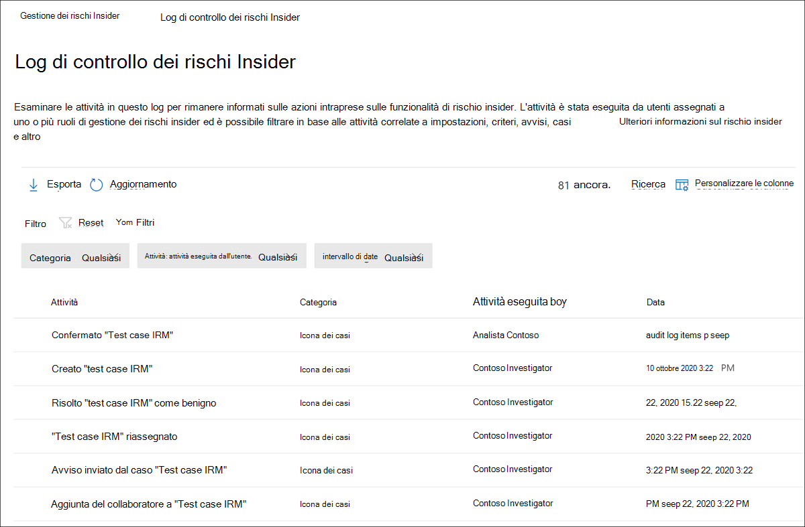

# Log di controllo per la gestione dei rischi Insider

Il log di controllo per la gestione dei rischi insider consente di rimanere informati sulle azioni intraprese sulle funzionalità di gestione dei rischi insider. Questo registro consente di esaminare in modo indipendente le azioni intraprese dagli utenti assegnati a uno o più gruppi di ruoli di gestione dei rischi insider. Il log di controllo della gestione dei rischi insider viene abilitato automaticamente nell'organizzazione e non può essere disabilitato.

Il log di controllo viene aggiornato automaticamente e immediatamente ogni volta che si verificano attività monitorate e il registro conserva le informazioni sull'attività per 180 giorni (circa sei mesi). Dopo 180 giorni, i dati per l'attività vengono eliminati definitivamente dal registro.

Le aree incluse nel monitoraggio delle attività includono:

- Criteri
- Casi
- Avvisi
- Impostazioni
- Utenti
- Modelli di avviso

Per visualizzare ed esportare i dati dal log di controllo, gli utenti devono essere assegnati ai gruppi di ruoli *Insider Risk Management* o Insider Risk Management *Auditors.* Per ulteriori informazioni sui gruppi di ruoli di gestione dei rischi insider, vedere Introduzione alla gestione dei rischi [insider Passaggio 1: abilitazione delle autorizzazioni.](insider-risk-management-configure.md#step-1-enable-permissions-for-insider-risk-management)

>[!NOTE]
>Il log di controllo della gestione dei rischi insider non è associato al log di controllo di Microsoft 365, ma è un sistema di controllo indipendente e acquisisce informazioni su attività separate. La disabilitazione del controllo di Microsoft 365 non influisce sul controllo delle attività all'interno della gestione dei rischi insider.

## Visualizzare le attività nel log di controllo dei rischi insider

Per visualizzare l'attività delle funzionalità monitorate per la gestione dei rischi insider, passare a e selezionare il collegamento Log di controllo dei rischi **Insider** nell'area in alto a destra di qualsiasi scheda di gestione dei rischi insider. Per impostazione predefinita, verranno visualizzate le informazioni seguenti per le attività di gestione dei rischi insider:

- **Attività:** Descrizione dell'attività eseguita all'interno della soluzione di gestione dei rischi insider da un utente.
- **Categoria:** Area o elemento in cui è stata eseguita l'attività. Ad esempio, vedrai Criteri *come* categoria quando sono state eseguite le attività di modifica dei criteri.
- **Attività eseguita da:** Nome utente dell'utente che ha eseguito l'attività.
- **Data:** Data e ora in cui è stata eseguita l'attività. La data e l'ora sono la data e l'ora locali dell'organizzazione.

Per ulteriori informazioni su un'attività registrata, selezionare l'attività per visualizzare il riquadro dei dettagli dell'attività. Questo riquadro include informazioni aggiuntive sull'attività.

## Colonne e filtro

Per facilitare ai revisori la revisione dell'attività registrata, il filtro è supportato nel log di controllo **dei rischi Insider.** Per il filtro di base, sono disponibili colonne della coda da aggiungere alla visualizzazione per fornire pivot diversi sui file e sui messaggi. È possibile filtrare le attività in base **ai campi Categoria, Intervallo di date** e Attività **eseguiti dai** campi.

Per aggiungere o rimuovere intestazioni di colonna per la coda attività, utilizzare il controllo **Personalizza** colonne e selezionare le opzioni di colonna. Queste colonne vengono mappate a condizioni comuni supportate nel **log di** controllo dei rischi Insider e sono elencate più avanti in questo articolo.

## Esportazione log di controllo

Gli utenti assegnati ai gruppi di ruolo *Insider Risk Management* o Insider Risk Management *Auditors* possono esportare tutte le attività nel log di controllo in un file CSV (valori delimitati da virgole) selezionando **Esporta** nella pagina Del log di controllo dei rischi **Insider.** A seconda dell'attività, alcuni campi di un'attività potrebbero non essere applicabili all'attività e questi campi verranno visualizzati come vuoti nel file esportato.

Il file contiene informazioni sulle attività per i campi seguenti:

- **Attività eseguita da:** Nome utente dell'utente che modifica un valore di elemento. Gli utenti elencati qui sono stati assegnati a uno o più dei seguenti gruppi di ruoli insider risk [management](insider-risk-management-configure.md#step-1-enable-permissions-for-insider-risk-management): *Insider Risk Management,* *Insider Risk Management Admins,* Insider Risk Management *Analysts,* *Insider Risk Management Investigators*. Ogni gruppo di ruoli dispone di livelli di autorizzazione diversi per la gestione delle funzionalità di rischio insider.
- **Attività:** Attività eseguita su un elemento. I valori *sono Viewed, Deleted, Added, Edited policy, Case, User, Alert* e *Settings.*
- **Added**: oggetti aggiunti durante l'attività, ad esempio utenti, tipi di file o domini.
- **Volume avviso:** livello di volume di avviso definito nelle impostazioni di gestione dei rischi insider.
- **Amount:** gli importi dell'indicatore personalizzato attualmente selezionato per un criterio.
- **ID risorsa**: ID risorsa dell'asset fisico con priorità su cui è stata eseguita l'attività.
- **Categoria:** Categoria dell'elemento modificato. I valori *sono Criteri, Casi, Utenti, Avvisi, Impostazioni* e *Modelli di avviso.*
- **Data:** Data e ora, elencate nella data e ora locali dell'organizzazione.
- **Descrizione:** l'input di descrizione da parte dell'utente per l'oggetto su cui si agisce (ad esempio un criterio o un gruppo di utenti con priorità).
- **Criterio DLP:** il criterio di prevenzione della perdita dei dati (DLP) selezionato per attivare l'inclusione in un criterio di gestione dei rischi insider.
- **Indicatore:** l'indicatore nelle impostazioni di rischio insider su cui è stata eseguita l'attività (ad esempio l'aggiunta o la rimozione di un indicatore).
- **Modello di avviso:** modello di avviso su cui è stata eseguita l'attività.
- **Numero di giorni**: finestra di attivazione dei criteri definita nelle impostazioni dei rischi insider.
- **Numero di file**: Limite del volume di file definito nelle impostazioni di gestione dei rischi insider.
- **Modello di criteri:** il modello di criteri a cui hanno agito gli indicatori appartiene.
- **Importo precedente:** gli importi degli indicatori personalizzati selezionati in precedenza per un criterio.
- **Gruppo di utenti con priorità**: Gruppo di utenti con priorità su cui è stata eseguita l'attività.
- **Rimosso:** oggetti rimossi durante l'attività, ad esempio utenti, tipi di file o domini.
- **Sender**: campo del mittente del modello di avviso su cui è stata eseguita l'attività.
- **Criterio di destinazione:** criterio su cui è stata eseguita l'attività , ad esempio l'aggiunta o la rimozione di un utente.
- **Corpo del messaggio del modello**: Corpo del messaggio del modello di avviso su cui è stata eseguita l'attività.
- **Oggetto modello:** campo dell'oggetto del modello di avviso su cui è stata eseguita l'attività.
- **Utente:** Utente su cui è stata eseguita l'attività.
