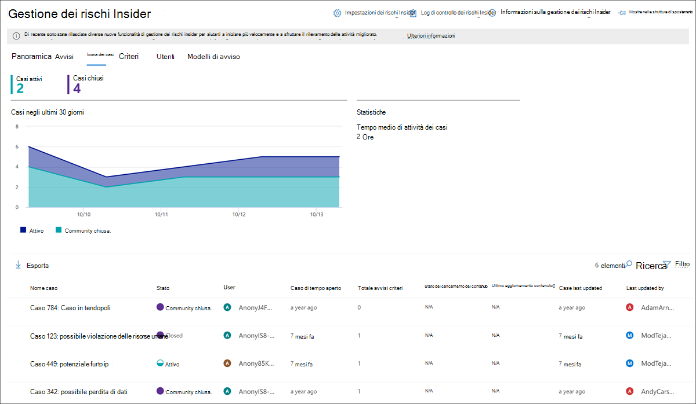
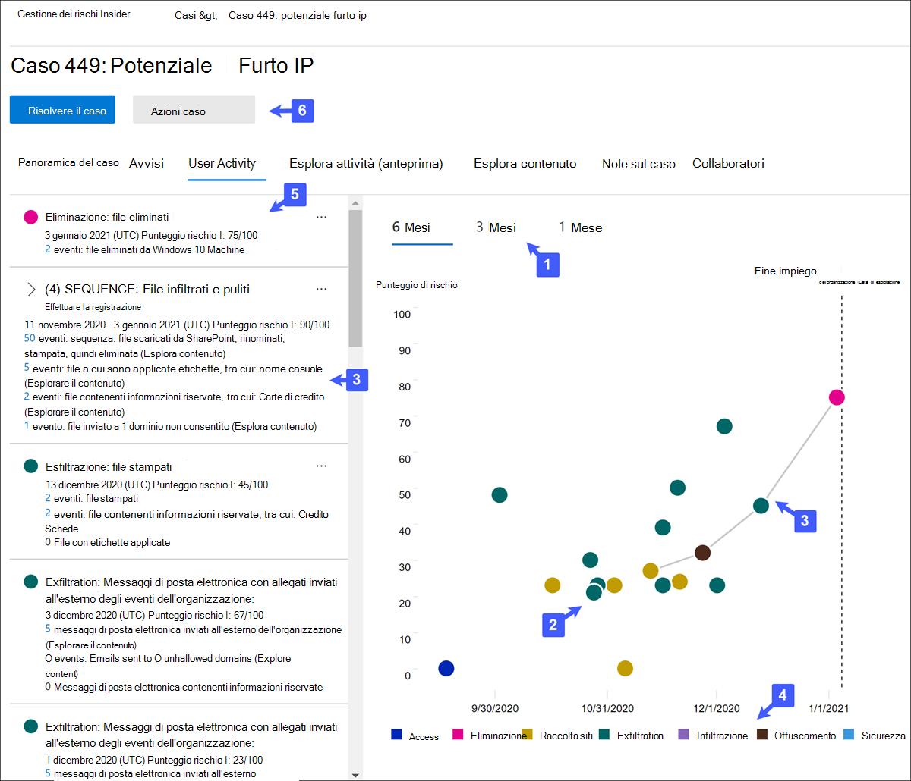
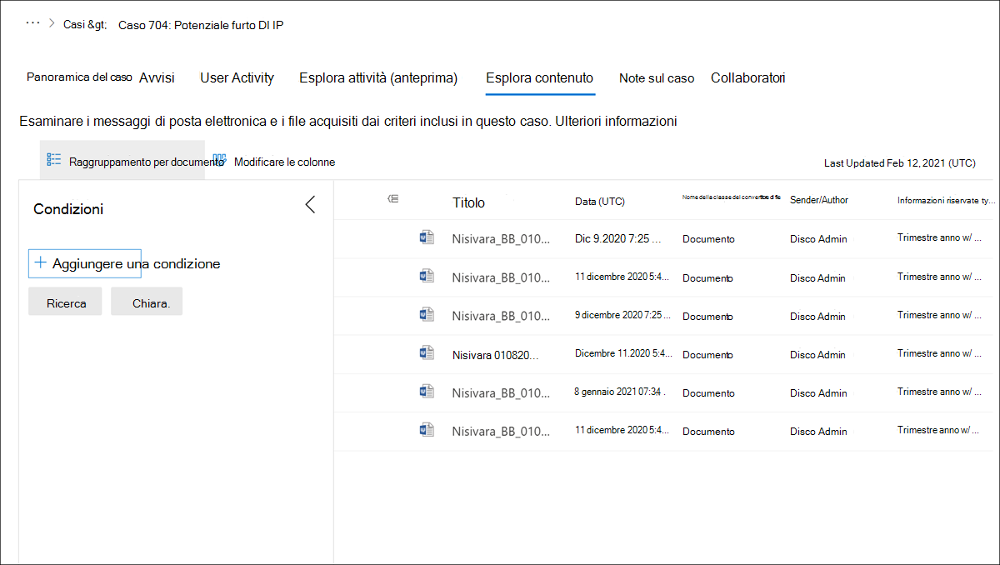

# Casi di gestione dei rischi Insider

I casi sono il fulcro della gestione dei rischi Insider e consentono di approfondire e di agire su questioni generate da indicatori di rischio definiti nei criteri. I casi vengono creati manualmente da avvisi in situazioni in cui è necessaria un'ulteriore azione per risolvere un problema relativo alla conformità per un utente. Ogni caso ha l'ambito di un singolo utente e più avvisi per l'utente possono essere aggiunti a un caso esistente o a un nuovo caso. 

Dopo aver esaminato i dettagli di un caso, è possibile eseguire le operazioni seguenti:

- invio di un avviso all'utente
- risoluzione del caso come benigno
- condivisione del caso con l'istanza di ServiceNow o con un destinatario di posta elettronica
- escalation del caso di un'indagine eDiscovery avanzata

## Dashboard per i casi

Il dashboard Insider Risk Management **Cases** consente di visualizzare e agire sui casi. Ogni widget del report nel dashboard Visualizza le informazioni per gli ultimi 30 giorni.

- **Casi attivi**: numero totale di casi attivi in esame.
- **Casi negli ultimi 30 giorni**: il numero totale di casi creati, ordinati in base allo stato *attivo* e *chiuso* .
- **Statistiche**: tempo medio dei casi attivi, elencati in ore, giorni o mesi.

La coda case elenca tutti i casi attivi e chiusi per l'organizzazione, oltre allo stato corrente dei seguenti attributi di caso:

- **Nome del caso**: il nome del caso, definito quando viene confermato un avviso e viene creato il caso.  
- **Stato**: lo stato del caso, *attivo* o *chiuso*.
- **Utente**: l'utente per il caso. Se Anonymization per i nomi utente è abilitato, vengono visualizzate le informazioni di anonimi.
- **Caso di tempo aperto**: il tempo trascorso dopo l'apertura del caso.
- **Totale avvisi sui criteri**: il numero di corrispondenze di criteri incluse nel caso. Questo numero potrebbe aumentare se sono stati aggiunti nuovi avvisi al caso.
- **Ultimo aggiornamento**: il tempo trascorso dal momento in cui è stata aggiunta una nota del caso o una modifica nello stato del caso.
- **Ultimo aggiornamento**: il nome dell'analista di gestione dei rischi insider o del ricercatore che ha aggiornato l'ultima volta il caso.

Utilizzare il controllo di **ricerca** per cercare i nomi dei casi per testo specifico e utilizzare il filtro case per ordinare i casi in base ai seguenti attributi:

- Stato
- Caso di tempo aperto, data di inizio e data di fine
- Ultimo aggiornamento, data di inizio e data di fine

## Casi di filtro

A seconda del numero e del tipo di criteri di gestione dei rischi Insider attivi nell'organizzazione, la revisione di una coda di casi di grandi dimensioni può essere difficile. L'utilizzo di filtri case può aiutare gli analisti e gli investigatori a ordinare i casi in base a diversi attributi. Per filtrare gli avvisi nel **dashboard dei casi**, selezionare il controllo **filtro** . È possibile filtrare i casi in base a uno o più attributi:

- **Stato**: selezionare uno o più valori di stato per filtrare l'elenco dei casi. Le opzioni sono *attive* e *chiuse*.
- **Caso di tempo aperto**: selezionare le date di inizio e di fine per il caso in cui è stato aperto.
- **Ultimo aggiornamento**: selezionare le date di inizio e di fine per il caso in cui è stato aggiornato.

## Esaminare un caso

Indagini più approfondite sugli avvisi di gestione dei rischi Insider sono fondamentali per l'esecuzione di azioni correttive appropriate. I casi di gestione dei rischi Insider sono lo strumento di gestione centrale per approfondire la cronologia delle attività e i dettagli degli avvisi degli utenti, nonché per esplorare il contenuto e i messaggi esposti ai rischi. Gli analisti e gli investigatori di rischio usano anche casi per centralizzare commenti e suggerimenti e per elaborare la risoluzione dei casi.

Se si seleziona un caso, vengono aperti gli strumenti di gestione dei casi e gli analisti e gli investigatori possono analizzare i dettagli nei casi.

### Panoramica del caso

La scheda **Panoramica del caso** riepiloga la cronologia delle attività di avviso e del livello di rischio per il caso. 

- Il widget **avvisi** Visualizza le corrispondenze dei criteri per il caso, incluso lo stato dell'avviso, la gravità del rischio di avviso e il momento in cui è stato rilevato l'avviso. 
- Il grafico della **cronologia a livello di rischio** Visualizza il livello di rischio degli utenti negli ultimi 30 giorni. Il grafico a linee consente agli analisti e ai ricercatori di visualizzare rapidamente la tendenza del rischio globale degli utenti nel tempo. 
- Il widget **contenuto attività di rischio** riepiloga i tipi di dati e il contenuto contenuti negli avvisi aggiunti al caso. Questo widget fornisce una visualizzazione all-up dell'intero set di dati e di contenuto a rischio nel caso.

Il riquadro dei **Dettagli del case** è disponibile in tutte le schede di gestione dei casi e riepiloga i dettagli del caso per analisti e ricercatori di rischio. Include le aree seguenti:

- **Nome del caso**: il nome del caso, preceduto da un numero di sequenza di caso generato automaticamente e il nome del rischio associato al modello di criteri per il quale il primo avviso ha confermato la corrispondenza. 
- **Stato del caso**: lo stato corrente del caso, *attivo* o *chiuso*.
- **Punteggio di rischio dell'utente**: il livello di rischio calcolato corrente dell'utente per il caso. Questo punteggio viene calcolato ogni 24 ore e utilizza i punteggi dei rischi di avviso provenienti da tutti gli avvisi attivi associati all'utente.
- **Avvisi confermati**: elenco degli avvisi per l'utente confermati per il caso.
- **Contenuto correlato**: elenco di contenuti, ordinati in base a origini di contenuto e tipi. Ad esempio, nel caso di contenuto di avviso in SharePoint Online, è possibile che vengano visualizzati i nomi delle cartelle o dei file elencati associati all'attività di rischio per gli avvisi nel caso.

### Avvisi

La scheda **avvisi** riepiloga gli avvisi correnti inclusi nel caso. È possibile aggiungere nuovi avvisi a un caso esistente e quindi aggiungerli alla coda di **avviso** quando vengono assegnati. Gli attributi di avviso seguenti sono elencati nella coda:

- Stato
- Gravità
- Tempo rilevato

Selezionare un avviso dalla coda per visualizzare la pagina dei **Dettagli dell'avviso** .

Utilizzare il controllo di ricerca per cercare i nomi degli avvisi per il testo specifico e utilizzare il filtro avvisi per ordinare i casi in base ai seguenti attributi:

- Stato
- Gravità
- Data e ora di inizio rilevata

Utilizzare il controllo Filter per filtrare gli avvisi in base a diversi attributi, tra cui:

- **Stato**: selezionare uno o più valori di stato per filtrare l'elenco degli avvisi. Le opzioni vengono *confermate*, *ignorate*, *devono essere riesaminate*e *risolte*.
- **Severity**: selezionare uno o più livelli di gravità dei rischi di avviso per filtrare l'elenco degli avvisi. Le opzioni sono *High*, *medium*e *low*.
- **Tempo rilevato**: selezionare le date di inizio e di fine per il momento in cui è stato creato l'avviso.
- **Criterio**: selezionare uno o più criteri per filtrare gli avvisi generati dai criteri selezionati.

### Attività dell'utente

La scheda **attività utente** è uno degli strumenti più potenti per l'analisi dei rischi interni e l'indagine per i casi nella soluzione di gestione dei rischi Insider. Questa scheda è strutturata per consentire la revisione rapida di un caso, tra cui una cronologia cronologica di tutti gli avvisi, tutti i dettagli sugli avvisi, il Punteggio di rischio corrente per l'utente nel caso e i controlli per intraprendere azioni efficaci per contenere i rischi nel caso.

1. **Filtri temporali data e finestra**: per impostazione predefinita, gli ultimi sei mesi di avvisi confermati nel caso vengono visualizzati nel grafico attività utente. È possibile filtrare facilmente la visualizzazione del grafico con i controlli Slider a entrambe le estremità della finestra del grafico oppure definendo date di inizio e fine specifiche nel controllo filtro grafico.
2. **Attività e dettagli dell'avviso di rischio**: le attività a rischio sono visualizzate visivamente come bolle colorate nel grafico attività utente. Le bolle vengono create per diverse categorie di rischi e le dimensioni delle bolle sono proporzionali al numero di attività di rischio per la categoria. Selezionare una bolla per visualizzare i dettagli di ogni attività di rischio. I dettagli includono:
    - **Data** dell'attività di rischio.
    - La **Categoria attività di rischio**. Ad esempio, *i messaggi di posta elettronica con allegati inviati al di fuori dell'organizzazione* o dei *file scaricati da SharePoint Online*.
    - **Punteggio di rischio** per l'avviso. Questo punteggio è il punteggio numerico per il livello di gravità dei rischi di avviso.
    - Numero di eventi associati all'avviso. Sono inoltre disponibili collegamenti a ogni file o indirizzo di posta elettronica associato all'attività di rischio.
3. **Legenda attività rischio**: nella parte inferiore del grafico attività utente, una legenda con codice a colori consente di determinare rapidamente la categoria dei rischi per ogni avviso.
4. **Cronologia attività di rischio**: sono elencate le cronologie complete di tutti gli avvisi di rischio associati al caso, inclusi tutti i dettagli disponibili nel corrispondente bolla di avviso.
5. **Azioni del caso**: le opzioni per la risoluzione del caso si trovano nella barra degli strumenti azione caso. È possibile risolvere un caso, inviare un messaggio di posta elettronica all'utente oppure inoltrare il caso per una ricerca di dati o di utenti.

### Esplora contenuto

La scheda **Content Explorer** consente agli analisti e ai ricercatori dei rischi di esaminare le copie di tutti i singoli file e messaggi di posta elettronica associati agli avvisi di rischio. Ad esempio, se viene creato un avviso quando un utente esegue il download di centinaia di file da SharePoint Online e l'attività attiva un avviso per i criteri, tutti i file scaricati per l'avviso vengono acquisiti e copiati nel caso di gestione dei rischi Insider provenienti da origini di archiviazione originali.

Content Explorer è uno strumento potente con funzionalità di ricerca e filtro di base e avanzate. Per ulteriori informazioni sull'utilizzo di Content Explorer, vedere [Insider Risk Management Content Explorer](insider-risk-management-content-explorer.md).

### Note del caso

La scheda **Note del caso** è il caso in cui gli analisti e gli investigatori del rischio condividono commenti, feedback e informazioni sul loro lavoro per il caso. Le note sono aggiunte permanenti a un caso e non possono essere modificate o eliminate dopo il salvataggio della nota. Quando si crea un caso da un avviso, i commenti immessi nella finestra di dialogo **conferma avviso e crea Insider Risk case** vengono aggiunti automaticamente come nota del caso.

Il dashboard note case Visualizza note dall'utente che ha creato la nota e l'ora passata dopo che la nota è stata salvata. Per cercare una parola chiave specifica nel campo testo nota caso, utilizzare il pulsante **Cerca** nel dashboard del caso e immettere una parola chiave specifica.

Per aggiungere una nota a un caso:

1. Nel [centro conformità di Microsoft 365](https://compliance.microsoft.com)accedere a **gestione dei rischi Insider** e selezionare la scheda **case** .
2. Selezionare un caso, quindi selezionare la scheda **note case** .
3. Selezionare **Add case note**.
4. Nella finestra di dialogo **Aggiungi nota caso** Digitare la nota per il caso. Fare clic su **Salva** per aggiungere la nota al caso oppure selezionare **Annulla** Chiudi senza salvare la nota nel caso.

### Contributori

La scheda **Contributors** nel caso in cui gli analisti e gli investigatori del rischio possono aggiungere altri revisori al caso. Per impostazione predefinita, tutti gli utenti assegnati agli **analisti di gestione dei rischi Insider** e ai ruoli **investigatori di gestione dei rischi** sono elencati come collaboratori per ogni caso attivo e chiuso.

Tutti i casi di gestione dei rischi Insider devono essere gestiti con i controlli di accesso adeguati per mantenere la riservatezza e l'integrità dell'indagine. Per garantire il controllo dell'accesso dei casi, agli utenti viene assegnato uno dei due tipi di accesso ai casi:

- **Accesso permanente**: l'accesso permanente viene concesso automaticamente agli utenti con gli **analisti di gestione dei rischi Insider** e i ruoli **investigatori di gestione dei rischi Insider** quando il caso viene creato da un avviso. L'accesso permanente garantisce il controllo completo del caso per tutta la durata del caso e garantisce la possibilità di aggiungere altri collaboratori del caso.
- **Accesso temporaneo**: l'accesso temporaneo è concesso solo agli utenti da collaboratori che hanno accesso permanente per il caso. In genere, questo livello di accesso viene concesso all'utente che deve aggiungere note a un caso. I collaboratori con accesso temporaneo dispongono di tutti i controlli di gestione dei casi, tranne:
    - Autorizzazione per confermare o ignorare gli avvisi
    - Autorizzazione per la modifica dei collaboratori per i casi
    - Autorizzazione per la visualizzazione di file e messaggi nell'Esplora contenuto

Per aggiungere un collaboratore a un caso:

1. Nel [centro conformità di Microsoft 365](https://compliance.microsoft.com)accedere a **gestione dei rischi Insider** e selezionare la scheda **case** .
2. Selezionare un caso, quindi selezionare la scheda **Contributors** .
3. Selezionare **Aggiungi collaboratore**.
4. Nella finestra di dialogo **Aggiungi collaboratore** , iniziare a digitare il nome dell'utente che si desidera aggiungere, quindi selezionare l'utente dall'elenco degli utenti consigliato. Questo elenco viene generato da Azure Active Directory della sottoscrizione tenant.
5. Nella finestra di dialogo **Aggiungi collaboratore** selezionare il livello di accesso per il collaboratore. È possibile selezionare **permanente** o **temporanea**.
6. Selezionare **Aggiungi** per aggiungere l'utente come collaboratore o selezionare **Annulla** Chiudi la finestra di dialogo senza aggiungere l'utente come collaboratore.

## Azioni del caso

Gli analisti di rischio e gli investigatori possono intervenire su un caso in uno dei vari metodi, a seconda della gravità del caso, della cronologia del rischio dell'utente e delle linee guida per i rischi della propria organizzazione. In alcuni casi, potrebbe essere necessario inoltrare un caso a un utente o a un'indagine dei dati per collaborare con altre aree dell'organizzazione e per approfondire le attività relative ai rischi. La gestione dei rischi Insider è strettamente integrata con altre soluzioni Microsoft 365 Compliance che consentono di gestire la risoluzione end-to-end.

### Invio di notifiche di posta elettronica

Nella maggior parte dei casi, le azioni degli utenti che creano avvisi di rischio Insider sono accidentali o casuali L'invio di un avviso di sollecito all'utente tramite posta elettronica è un metodo efficace per documentare la revisione dei casi e l'azione, nonché un metodo per ricordare agli utenti i criteri aziendali o per indirizzarli all'aggiornamento. Gli avvisi vengono generati da [modelli di avviso creati](insider-risk-management-notices.md) per l'infrastruttura di gestione dei rischi Insider.

È importante tenere presente che l'invio di una notifica di posta elettronica a ***un utente non*** risolve il caso come *chiuso*. In alcuni casi, è possibile che si desideri lasciare un caso aperto dopo aver inviato un avviso a un utente per cercare altre attività a rischio senza aprire un nuovo caso. Se si desidera risolvere un caso dopo l'invio di un avviso, è necessario selezionare il **caso di risoluzione** come passaggio di follow-on dopo l'invio di un avviso.

Per inviare un avviso all'utente assegnato a un caso:

1. Nel [centro conformità di Microsoft 365](https://compliance.microsoft.com)accedere a **gestione dei rischi Insider** e selezionare la scheda **case** .
2. Selezionare un caso, quindi selezionare il pulsante **Invia avviso di posta elettronica** sulla barra degli strumenti azione caso.
3. Nella finestra di dialogo **Invia messaggio di posta elettronica** , selezionare il controllo elenco a discesa **scegliere un modello di avviso** per selezionare il modello di avviso per l'avviso. Questa selezione preriempie gli altri campi nell'avviso.
4. Esaminare i campi avvisi e aggiornarli in base alle esigenze. I valori immessi qui sostituiranno i valori del modello.
5. Selezionare **Invia** per inviare l'avviso all'utente o selezionare **Annulla** Chiudi la finestra di dialogo senza inviare la notifica all'utente. Tutte le notifiche inviate vengono aggiunte alla coda di note del caso nel dashboard di **Notes del caso** .

### Escalation per l'analisi

Escalation del caso per l'analisi degli utenti in situazioni in cui è necessaria una revisione legale supplementare per l'attività di rischio dell'utente. Questa escalation apre un nuovo caso di eDiscovery avanzato nell'organizzazione Microsoft 365. Advanced eDiscovery offre un flusso di lavoro end-to-end per conservare, raccogliere, rivedere, analizzare ed esportare contenuti rispondenti alle indagini legali interne ed esterne dell'organizzazione. Consente inoltre al team legale di gestire l'intero flusso di lavoro di notifica per la conservazione legale per comunicare con i depositari coinvolti in un caso. L'assegnazione di un revisore come custode in un caso avanzato di eDiscovery creato da un caso di gestione dei rischi Insider aiuta il team legale a prendere le misure appropriate e gestire la conservazione dei contenuti. Per ulteriori informazioni sui casi di eDiscovery avanzati, vedere [Overview of Advanced eDiscovery in Microsoft 365](overview-ediscovery-20.md).

Per inoltrare un caso a un'indagine dell'utente:

1. Nel [centro conformità di Microsoft 365](https://compliance.microsoft.com)accedere a **gestione dei rischi Insider** e selezionare la scheda **case** .
2. Selezionare un caso, quindi selezionare il pulsante **escalation for investigation** sulla barra degli strumenti azione case.
3. Nella finestra **di dialogo escalation for investigation** immettere un nome per la nuova indagine utente. Se necessario, immettere le note relative al caso e selezionare **escalation**.
5. Selezionare **conferma** per creare il caso di indagine dell'utente oppure fare clic su **Annulla** per chiudere la finestra di dialogo senza creare un nuovo caso di indagine utente.

Dopo che il caso di gestione dei rischi Insider è stato inoltrato a un nuovo caso di indagine dell'utente, è possibile esaminare il nuovo caso nell'area avanzata di **eDiscovery**  >  **Advanced** nel centro conformità di Microsoft 365.

### Condivisione di un caso

La condivisione di un caso di gestione dei rischi insider consente a ricercatori e revisioni di collaborare facilmente con altre parti interessate della conformità nell'organizzazione. È possibile condividere rapidamente un collegamento a un caso di gestione dei rischi Insider con le parti interessate esterne dall'area di gestione dei casi. Per accedere al caso di gestione dei rischi Insider dal collegamento, le parti interessate devono essere incluse in tutti i gruppi di ruoli di gestione dei rischi Insider.

Sono disponibili le opzioni di condivisione seguenti: 

- **ServiceNow**: dopo aver configurato il connettore Microsoft 365 ServiceNow per l'organizzazione Microsoft 365, è possibile condividere facilmente un collegamento al caso, aprire un evento imprevisto o richiedere una modifica all'organizzazione di ServiceNow. Per condividere il caso con ServiceNow, selezionare **Condividi**  >  **ServiceNow** dall'azione maiuscole/minuscole. L'integrazione di ServiceNow con i supporti di gestione dei rischi Insider include le seguenti operazioni e informazioni sul caso:
    - **Nome attività**: il nome della nuova attività di ServiceNow.
    - **Descrizione attività**: descrizione per la nuova attività ServiceNow. Questo campo Descrizione modificabile include automaticamente un collegamento al caso di gestione dei rischi Insider.
    - **Tipo**di attività: il tipo di attività per la nuova attività di ServiceNow, ovvero la *richiesta di modifica*o di *incidente* .
    - **Priorità**: la priorità per la nuova attività di ServiceNow, ovvero *pianificazione*, *bassa*, *moderata*, *elevata*o *critica*.
    - **Data**scadenza: la data richiesta per il completamento dell'attività di ServiceNow.

- **Posta elettronica**: condivide un collegamento al caso di gestione dei rischi insider in un messaggio di posta elettronica. È possibile scegliere qualsiasi client di posta elettronica configurato localmente con questa opzione di condivisione. Per condividere il collegamento del caso con la posta elettronica, selezionare **Condividi**la  >  **posta elettronica** dalla barra degli strumenti azione caso.
- **Copia collegamento**: copia un collegamento al caso di gestione dei rischi Insider negli Appunti. Per copiare il collegamento al caso negli Appunti, selezionare **Condividi**  >  **copia collegamento** dalla barra degli strumenti azione case.

### Risolvere il caso

Dopo che gli analisti e gli investigatori di rischio hanno completato la revisione e le indagini, è possibile risolvere un caso in cui agiscono tutti gli avvisi attualmente inclusi nel caso. La risoluzione di un caso aggiunge una classificazione di soluzione, modifica lo stato del caso in *Closed*e i motivi di azione di risoluzione vengono aggiunti automaticamente alla coda di note del caso nel dashboard di **Notes del caso** . I casi vengono risolti in base a quanto segue:

- **Benigno**: la classificazione dei casi in cui gli avvisi corrispondono ai criteri sono valutati come a basso rischio, non grave o falso positivo.
- **Violazione dei criteri confermata**: la classificazione dei casi in cui gli avvisi corrispondono ai criteri sono considerati rischiosi, gravi o il risultato di intenti dolosi.

Per risolvere un caso:

1. Nel [centro conformità di Microsoft 365](https://compliance.microsoft.com)accedere a **gestione dei rischi Insider** e selezionare la scheda **case** .
2. Selezionare un caso, quindi selezionare il pulsante **Risolvi caso** sulla barra degli strumenti azione caso.
3. Nella finestra di dialogo **Risolvi il caso** , selezionare il controllo **Risolvi come** a discesa per selezionare la classificazione della risoluzione per il caso. Le opzioni sono violazioni dei criteri **benigne** o **confermate**.
4. Nella finestra di dialogo **Risolvi il caso** , immettere i motivi della classificazione della risoluzione nel campo di testo **azione** .
5. Selezionare **Risolvi** per chiudere il caso o selezionare **Annulla** Chiudi la finestra di dialogo senza risolvere il caso.
