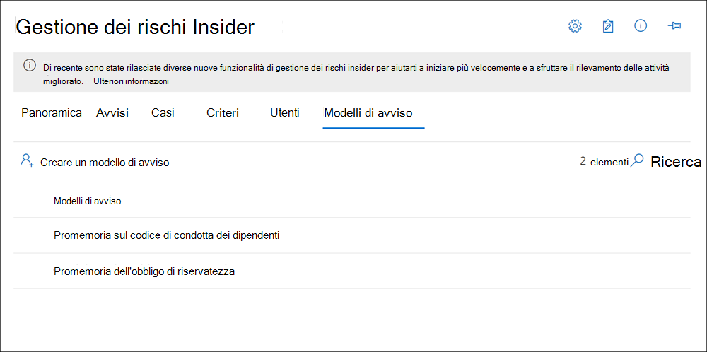

# <a name="insider-risk-management-notice-templates"></a>Modelli di avviso per la gestione dei rischi Insider

I modelli di avviso per la gestione dei rischi Insider consentono di inviare messaggi di posta elettronica agli utenti quando le attività generano un criterio di corrispondenza e avviso. Nella maggior parte dei casi, le azioni degli utenti che generano avvisi sono il risultato di errori o attività involontarie senza intenti. Gli avvisi fungono da promemoria semplici per gli utenti per essere più cauti, per fornire collegamenti alle informazioni per l'aggiornamento, o per le risorse dei criteri aziendali. Gli avvisi possono essere una parte importante del programma di formazione per la conformità interno e possono contribuire alla creazione di una traccia di controllo documentata per gli utenti con attività di rischio ricorrenti.

Creare modelli di avviso se si desidera inviare agli utenti una notifica di promemoria tramite posta elettronica per le corrispondenze di criteri nell'ambito del processo di risoluzione dei problemi. Gli avvisi possono essere inviati solo all'indirizzo di posta elettronica dell'utente associato all'avviso specifico in fase di revisione. Quando si seleziona un modello di avviso da applicare a una corrispondenza di criteri, è possibile scegliere di accettare i valori del campo definiti nel modello o sovrascrivere i campi in base alle esigenze.

## <a name="notice-templates-dashboard"></a>Dashboard modelli di avviso

Il **dashboard dei modelli di avviso** Visualizza un elenco di modelli di avviso configurati e consente di creare nuovi modelli di avviso. I modelli di avviso sono elencati nell'ordine di data inverso con il modello di avviso più recente elencato per primo.



## <a name="html-for-notices"></a>HTML per gli avvisi

Se si desidera creare più di un semplice messaggio di posta elettronica basato su testo per le notifiche, è possibile creare un messaggio più dettagliato utilizzando HTML nel campo corpo del messaggio di un modello di avviso. Nell'esempio seguente viene fornito il formato del corpo del messaggio per un modello di notifica di posta elettronica basato su HTML:

```HTML
<!DOCTYPE html>
<html>
<body>
<h2>Action Required: Contoso User Code of Conduct Policy Training</h2>
<p>A recent activity you've performed has generated a risk alert prohibited by the Contoso User <a href='https://www.contoso.com'>Code of Conduct Policy</a>.</p>
<p>You are required to attend the Contoso User Code of Conduct <a href='https://www.contoso.com'>training</a> within the next 14 days. Please contact <a href='mailto:hr@contoso.com'>Human Resources</a> with any questions about this training request.</p>
<p>Thank you,</p>
<p><em>Human Resources</em></p>
</body>
</html>
```

> [!NOTE]
> L'implementazione dell'attributo HTML href nei modelli di avviso per la gestione dei rischi Insider attualmente supporta solo virgolette singole anziché virgolette doppie per i riferimenti URL.

## <a name="create-a-new-notice-template"></a>Creare un nuovo modello di avviso

Per creare un nuovo modello di avviso per la gestione dei rischi Insider, è possibile utilizzare la procedura guidata di avviso nella soluzione di **gestione dei rischi Insider** nel centro conformità Microsoft 365.

Completare la procedura seguente per creare un nuovo modello di avviso per la gestione dei rischi Insider:

1. Nel [centro conformità di Microsoft 365](https://compliance.microsoft.com)accedere a **gestione dei rischi Insider** e selezionare la scheda **modelli di avviso** .
2. Selezionare **Crea modello di avviso** per aprire la procedura guidata di avviso.
3. Nella pagina **Crea un nuovo modello di avviso** completare i seguenti campi:
    - **Nome modello**: immettere un nome descrittivo per l'avviso. Questo nome viene visualizzato nell'elenco delle notifiche nel dashboard di avviso e nell'elenco di selezione delle notifiche quando si inviano notifiche da un caso.
    - **Invia da**: immettere l'indirizzo di posta elettronica del mittente per l'avviso. Questo indirizzo verrà visualizzato nel campo **da:** in tutti gli avvisi inviati agli utenti, a meno che non siano stati modificati quando si invia un avviso da un caso.
    - Campi **CC e Ccn** : utenti facoltativi o gruppi da notificare della corrispondenza dei criteri, selezionati da Active Directory per l'abbonamento.
    - **Oggetto**: le informazioni visualizzate nella riga dell'oggetto del messaggio supportano caratteri di testo.
    - **Corpo del messaggio**: informazioni visualizzate nel corpo del messaggio, che supportano i valori di testo o HTML.
4. Selezionare **Crea** per creare e salvare il modello di avviso oppure fare clic su **Annulla** per chiudere senza salvare il modello di avviso.

## <a name="update-a-notice-template"></a>Aggiornare un modello di avviso

Per aggiornare un modello di avviso per la gestione dei rischi Insider esistente, completare i passaggi seguenti:

1. Nel [centro conformità di Microsoft 365](https://compliance.microsoft.com)accedere a **gestione dei rischi Insider** e selezionare la scheda **modelli di avviso** .
2. Nel dashboard di avviso selezionare il modello di avviso che si desidera gestire.
3. Nella pagina Dettagli avviso selezionare **modifica**
4. Nella pagina **modifica** è possibile modificare i campi seguenti:
    - **Nome modello**: immettere un nuovo nome descrittivo per l'avviso. Questo nome viene visualizzato nell'elenco delle notifiche nel dashboard di avviso e nell'elenco di selezione delle notifiche quando si inviano notifiche da un caso.
    - **Invia da**: aggiornare l'indirizzo di posta elettronica del mittente per l'avviso. Questo indirizzo verrà visualizzato nel campo **da:** in tutti gli avvisi inviati agli utenti, a meno che non siano stati modificati quando si invia un avviso da un caso.
    - Campi **CC e Ccn** : aggiornare gli utenti o i gruppi facoltativi da notificare la corrispondenza dei criteri, selezionata da Active Directory per l'abbonamento.
    - **Oggetto**: aggiornare le informazioni visualizzate nella riga dell'oggetto del messaggio, che supportano caratteri di testo.
    - **Corpo del messaggio**: aggiornare le informazioni visualizzate nel corpo del messaggio, supporta i valori di testo o HTML.
5. Selezionare **Salva** per aggiornare e salvare l'avviso oppure fare clic su **Annulla** per chiudere senza salvare il modello di avviso.

## <a name="delete-a-notice-template"></a>Eliminare un modello di avviso

Per eliminare un modello di avviso per la gestione dei rischi Insider esistente, completare i passaggi seguenti:

1. Nel [centro conformità di Microsoft 365](https://compliance.microsoft.com)accedere a **gestione dei rischi Insider** e selezionare la scheda **modelli di avviso** .
2. Nel dashboard di avviso selezionare il modello di avviso che si desidera eliminare.
3. Selezionare l'icona **Elimina** sulla barra degli strumenti.
4. Per eliminare il modello di avviso, selezionare **Sì** nella finestra di dialogo Elimina. Per annullare l'eliminazione, selezionare **Annulla**.
