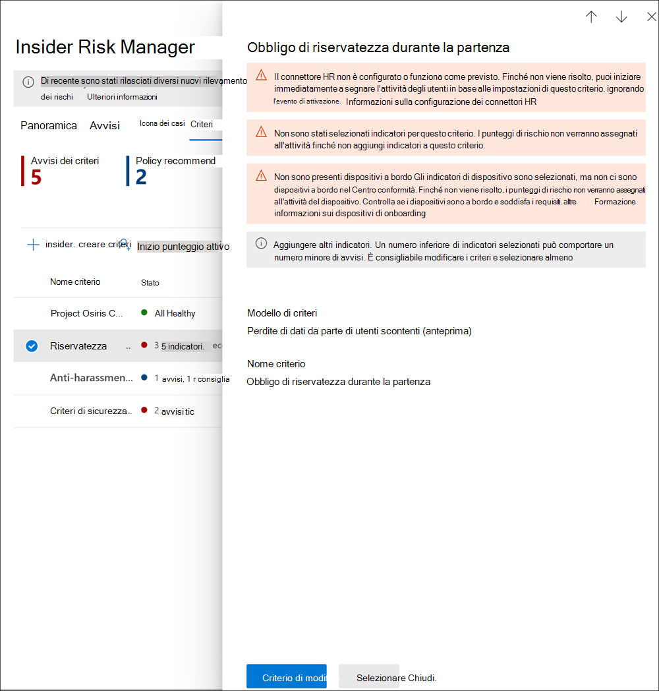

# <a name="insider-risk-management-policies"></a><span data-ttu-id="cd987-104">Criteri di gestione dei rischi Insider</span><span class="sxs-lookup"><span data-stu-id="cd987-104">Insider risk management policies</span></span>

<span data-ttu-id="cd987-105">I criteri di gestione dei rischi Insider determinano quali utenti includere nell'ambito e quali tipi di indicatori di rischio siano configurati per gli avvisi.</span><span class="sxs-lookup"><span data-stu-id="cd987-105">Insider risk management policies determine which users are in-scope and which types of risk indicators are configured for alerts.</span></span> <span data-ttu-id="cd987-106">È possibile creare rapidamente un criterio applicabile a tutti gli utenti dell'organizzazione oppure definire singoli utenti o gruppi da gestire in un criterio.</span><span class="sxs-lookup"><span data-stu-id="cd987-106">You can quickly create a policy that applies to all users in your organization or define individual users or groups for management in a policy.</span></span> <span data-ttu-id="cd987-107">I criteri supportano le priorità dei contenuti, per focalizzare l'attenzione sulle condizioni dei criteri su uno o più team di Microsoft Teams, siti di SharePoint, tipi di riservatezza dei dati ed etichette dati.</span><span class="sxs-lookup"><span data-stu-id="cd987-107">Policies support content priorities to focus policy conditions on multiple or specific Microsoft Teams, SharePoint sites, data sensitivity types, and data labels.</span></span> <span data-ttu-id="cd987-108">Usando i modelli è possibile selezionare specifici indicatori di rischio e personalizzare le soglie degli eventi per gli indicatori dei criteri, personalizzando efficacemente i punteggi di rischio, oltre che il livello e la frequenza degli avvisi.</span><span class="sxs-lookup"><span data-stu-id="cd987-108">Using templates, you can select specific risk indicators and customize event thresholds for policy indicators, effectively customizing risk scores, and level and frequency of alerts.</span></span> <span data-ttu-id="cd987-109">Inoltre, i booster del punteggio del rischio e i rilevamenti delle anomalie aiutano a identificare le attività utente di maggiore importanza o più insolite.</span><span class="sxs-lookup"><span data-stu-id="cd987-109">Additionally, risk score boosters and anomaly detections help identify user activity that is of higher importance or more unusual.</span></span> <span data-ttu-id="cd987-110">Le finestre dei criteri consentono di definire l'intervallo di tempo in cui applicare il criterio alle attività di avviso e vengono usate per determinare la durata del criterio dopo l'attivazione.</span><span class="sxs-lookup"><span data-stu-id="cd987-110">Policy windows allow you to define the time frame to apply the policy to alert activities and are used to determine the duration of the policy once activated.</span></span>

<span data-ttu-id="cd987-111">Guardare il video[ ](https://www.youtube.com/watch?v=kudK5ajZTUo)sulla configurazione dei criteri di gestione dei rischi Insider per una panoramica del modo in cui i criteri creati con modelli di criteri predefiniti consentono di intervenire rapidamente sui potenziali rischi.</span><span class="sxs-lookup"><span data-stu-id="cd987-111">Check out the [Insider Risk Management Policies Configuration video](https://www.youtube.com/watch?v=kudK5ajZTUo) for an overview of how policies created with built-in policy templates can help you to quickly take action on potential risks.</span></span>

## <a name="policy-dashboard"></a><span data-ttu-id="cd987-112">Dashboard dei criteri</span><span class="sxs-lookup"><span data-stu-id="cd987-112">Policy dashboard</span></span>

<span data-ttu-id="cd987-113">Il **Dashboard dei criteri** consente di visualizzare rapidamente i criteri nell'organizzazione e il relativo stato dei, di aggiungere manualmente utenti ai criteri e di visualizzare lo stato corrente degli avvisi associati a ciascun criterio.</span><span class="sxs-lookup"><span data-stu-id="cd987-113">The **Policy dashboard** allows you to quickly see the policies in your organization, the health of the policy, manually add users to policies, and the view the status of alerts associated with each policy.</span></span>

- <span data-ttu-id="cd987-114">**Nome criterio**: nome assegnato al criterio nella procedura guidata.</span><span class="sxs-lookup"><span data-stu-id="cd987-114">**Policy name**: The name assigned to the policy in the policy wizard.</span></span>
- <span data-ttu-id="cd987-115">**Stato**: stato di integrità di ogni criterio.</span><span class="sxs-lookup"><span data-stu-id="cd987-115">**Status**: The health status for each policy.</span></span> <span data-ttu-id="cd987-116">Mostra il numero di avvisi e suggerimenti per i criteri oppure lo stato *Integro* per i criteri senza problemi.</span><span class="sxs-lookup"><span data-stu-id="cd987-116">Displays number of policy warnings and recommendations, or a status of *Healthy* for policies without issues.</span></span>  <span data-ttu-id="cd987-117">È possibile fare clic sul criterio per visualizzare i dettagli sullo stato di integrità per eventuali avvisi o suggerimenti.</span><span class="sxs-lookup"><span data-stu-id="cd987-117">You can click on the policy to see the health status details for any warnings or recommendations.</span></span>
- <span data-ttu-id="cd987-118">**Avvisi attivi**: numero di avvisi attivi per ogni criterio.</span><span class="sxs-lookup"><span data-stu-id="cd987-118">**Active alerts**: The number of active alerts for each policy.</span></span>
- <span data-ttu-id="cd987-119">**Avvisi confermati**: numero totale di avvisi generati dal criterio risultati in casi negli ultimi 365 giorni.</span><span class="sxs-lookup"><span data-stu-id="cd987-119">**Confirmed alerts**: The total number of alerts the resulted in cases from the policy in the last 365 days.</span></span>
- <span data-ttu-id="cd987-120">**Interventi in seguito ad avvisi**: numero totale di avvisi confermati o ignorati negli ultimi 365 giorni.</span><span class="sxs-lookup"><span data-stu-id="cd987-120">**Actions taken on alerts**: The total number of alerts that were confirmed or dismissed for the last 365 days.</span></span>
- <span data-ttu-id="cd987-121">**Efficacia degli avvisi dei criteri**: percentuale determinata dal totale degli avvisi confermati diviso per le azioni totali eseguite sugli avvisi, ovvero la somma degli avvisi confermati o ignorati nell'ultimo anno.</span><span class="sxs-lookup"><span data-stu-id="cd987-121">**Policy alert effectiveness**: The percentage determined by total confirmed alerts divided by total actions taken on alerts (which is the sum of alerts that were confirmed or dismissed over the past year).</span></span>


## <a name="policy-recommendations-from-analytics-preview"></a><span data-ttu-id="cd987-123">Suggerimenti per i criteri dall'analisi (anteprima)</span><span class="sxs-lookup"><span data-stu-id="cd987-123">Policy recommendations from analytics (preview)</span></span>

<span data-ttu-id="cd987-124">L'analisi del rischio Insider consente di condurre una valutazione dei potenziali rischi insider nell'organizzazione senza configurare criteri di rischio Insider.</span><span class="sxs-lookup"><span data-stu-id="cd987-124">Insider risk analytics enables you to conduct an evaluation of potential insider risks in your organization without configuring any insider risk policies.</span></span> <span data-ttu-id="cd987-125">Questa valutazione può aiutare l'organizzazione a identificare le potenziali aree con rischio utente più elevato e a determinare il tipo e l'ambito dei criteri di gestione dei rischi Insider che può essere opportuno configurare.</span><span class="sxs-lookup"><span data-stu-id="cd987-125">This evaluation can help your organization identify potential areas of higher user risk and help determine the type and scope of insider risk management policies you may consider configuring.</span></span>

<span data-ttu-id="cd987-126">Per altre informazioni sull'analisi del rischio Insider, vedere [Impostazioni di gestione dei rischi Insider: Analisi (anteprima)](insider-risk-management-settings.md#analytics-preview).</span><span class="sxs-lookup"><span data-stu-id="cd987-126">To learn more about insider risk analytics and policy recommendations, see [Insider risk management settings: Analytics (preview)](insider-risk-management-settings.md#analytics-preview).</span></span>

## <a name="policy-templates"></a><span data-ttu-id="cd987-127">Modelli di criteri</span><span class="sxs-lookup"><span data-stu-id="cd987-127">Policy templates</span></span>

<span data-ttu-id="cd987-128">I modelli di gestione dei rischi Insider sono condizioni predefinite dei criteri che definiscono i tipi di indicatori di rischio e il modello di assegnazione del punteggio di rischio usati da un criterio.</span><span class="sxs-lookup"><span data-stu-id="cd987-128">Insider risk management templates are pre-defined policy conditions that define the types of risk indicators and risk scoring model used by the policy.</span></span> <span data-ttu-id="cd987-129">Per poter creare i criteri, è necessario che a ogni criterio sia assegnato un modello nella procedura guidata.</span><span class="sxs-lookup"><span data-stu-id="cd987-129">Each policy must have a template assigned in the policy creation wizard before the policy is created.</span></span> <span data-ttu-id="cd987-130">La gestione dei rischi Insider supporta fino a cinque criteri per ogni modello di criterio.</span><span class="sxs-lookup"><span data-stu-id="cd987-130">Insider risk management supports up to five policies for each policy template.</span></span> <span data-ttu-id="cd987-131">Quando si crea un nuovo criterio di rischio Insider con la creazione guidata criteri, si può scegliere uno dei modelli seguenti:</span><span class="sxs-lookup"><span data-stu-id="cd987-131">When you create a new insider risk policy with the policy wizard, you'll choose from one of the following policy templates:</span></span>

### <a name="data-theft-by-departing-users"></a><span data-ttu-id="cd987-132">Furto di dati da parte di utenti che lasciano l'organizzazione</span><span class="sxs-lookup"><span data-stu-id="cd987-132">Data theft by departing users</span></span>

<span data-ttu-id="cd987-133">Esistono specifici indicatori di rischio in genere associati al furto di dati da parte degli utenti che lasciano l'organizzazione.</span><span class="sxs-lookup"><span data-stu-id="cd987-133">When users leave your organization, there are specific risk indicators typically associated with data theft by departing users.</span></span> <span data-ttu-id="cd987-134">Questo modello di criteri usa indicatori di esfiltrazione per il l'assegnazione del punteggio di rischio ed è incentrato sul rilevamento e sugli avvisi in quest'area di rischio.</span><span class="sxs-lookup"><span data-stu-id="cd987-134">This policy template uses exfiltration indicators for risk scoring and focuses on detection and alerts in this risk area.</span></span> <span data-ttu-id="cd987-135">Il furto di dati da parte di utenti che lasciano l'organizzazione può includere il download di file da SharePoint Online, la stampa di file e la copia di dati in servizi personali di messaggistica e archiviazione cloud all'approssimarsi delle date di dimissioni e di termine del rapporto di lavoro.</span><span class="sxs-lookup"><span data-stu-id="cd987-135">Data theft for departing users may include downloading files from SharePoint Online, printing files, and copying data to personal cloud messaging and storage services near their employment resignation and end dates.</span></span> <span data-ttu-id="cd987-136">Usando il connettore HR di Microsoft 365 o l'opzione per monitorare automaticamente l'eliminazione degli account utente in Azure Active Directory per l'organizzazione, questo modello inizia a valutare gli indicatori di rischio relativi a queste attività e la relativa correlazione con lo stato di impiego degli utenti.</span><span class="sxs-lookup"><span data-stu-id="cd987-136">By using either the Microsoft 365 HR connector or the option to automatically monitor for user account deletion in Azure Active Directory for your organization, this template starts scoring for risk indicators relating to these activities and how they correlate with user employment status.</span></span>

>[!IMPORTANT]
><span data-ttu-id="cd987-137">Quando si usa questo modello, è possibile configurare un connettore HR di Microsoft 365 in modo da importare periodicamente i dettagli sulle date di fine rapporto o dimissioni per gli utenti dell'organizzazion.</span><span class="sxs-lookup"><span data-stu-id="cd987-137">When using this template, you can configure a Microsoft 365 HR connector to periodically import resignation and termination date information for users in your organization.</span></span> <span data-ttu-id="cd987-138">Vedere l'articolo [Importare dati con il connettore HR](import-hr-data.md) per istruzioni dettagliate su come configurare il connettore HR di Microsoft 365 per l'organizzazione.</span><span class="sxs-lookup"><span data-stu-id="cd987-138">See the [Import data with the HR connector](import-hr-data.md) article for step-by-step guidance to configure the Microsoft 365 HR connector for your organization.</span></span> <span data-ttu-id="cd987-139">Se si sceglie di non usare il connettore HR, quando si configurano gli eventi di attivazione nella creazione guidata criteri è necessario selezionare l'opzione L'account utente è stato eliminato da Azure AD.</span><span class="sxs-lookup"><span data-stu-id="cd987-139">If you choose not to use the HR connector, you must select the User account deleted from Azure AD option when configuring trigger events in the policy wizard.</span></span>

### <a name="general-data-leaks"></a><span data-ttu-id="cd987-140">Fughe di dati generali</span><span class="sxs-lookup"><span data-stu-id="cd987-140">General data leaks</span></span>

<span data-ttu-id="cd987-141">Proteggere i dati e impedirne la violazione è una sfida costante per la maggior parte delle organizzazioni, in particolare con il rapido aumento dei nuovi dati creati da utenti, dispositivi e servizi.</span><span class="sxs-lookup"><span data-stu-id="cd987-141">Protecting data and preventing data leaks is a constant challenge for most organizations, particularly with the rapid grow of new data created by users, devices, and services.</span></span> <span data-ttu-id="cd987-142">Gli utenti possono creare, archiviare e condividere informazioni tra servizi e dispositivi, rendendo la gestione delle fughe di dati sempre più complessa.</span><span class="sxs-lookup"><span data-stu-id="cd987-142">Users are empowered to create, store, and share information across services and devices that make managing data leaks increasingly more complex and difficult.</span></span> <span data-ttu-id="cd987-143">Le violazioni dei dati spaziano dalla condivisione accidentale di informazioni all'esterno dell'organizzazione al furto di dati con intento doloso.</span><span class="sxs-lookup"><span data-stu-id="cd987-143">Data leaks can include accidental oversharing of information outside your organization or data theft with malicious intent.</span></span> <span data-ttu-id="cd987-144">Dopo l'assegnazione di un criterio di prevenzione della perdita dei dati (DLP) o dell'evento di attivazione predefinito, questo modello inizia a valutare i rilevamenti in tempo reale di attività sospette di download di dati di SharePoint Online, condivisione di file e cartelle, stampa di file e copia di dati in servizi personali di messaggistica cloud e archiviazione.</span><span class="sxs-lookup"><span data-stu-id="cd987-144">With an assigned Data Loss Prevention (DLP) policy or the built-in triggering event, this template starts scoring real-time detections of suspicious SharePoint Online data downloads, file and folder sharing, printing files, and copying data to personal cloud messaging and storage services.</span></span>

<span data-ttu-id="cd987-145">Quando si usa un modello *Fughe di dati*, è possibile assegnare un criterio DLP in modo da attivare nel criterio di rischio Insider indicatori per gli avvisi con livello di gravità alto nell'organizzazione.</span><span class="sxs-lookup"><span data-stu-id="cd987-145">When using a *Data leaks* template, you can assign a DLP policy to trigger indicators in the insider risk policy for high severity alerts in your organization.</span></span> <span data-ttu-id="cd987-146">Ogni volta che un avviso con livello di gravità alto generato da una regola di criterio DLP viene aggiunto al log di controllo di Office 365, i criteri di rischio Insider creati con questo modello esaminano automaticamente l'avviso.</span><span class="sxs-lookup"><span data-stu-id="cd987-146">Whenever a high severity alert is generated by a DLP policy rule is added to the Office 365 audit log, insider risk policies created with this template automatically examine the high severity DLP alert.</span></span> <span data-ttu-id="cd987-147">Se l'avviso contiene un utente nell'ambito definito nel criterio di rischio Insider, viene elaborato dal criterio di rischio Insider come nuovo avviso e gli vengono assegnati un livello di gravità e un punteggio di rischio Insider.</span><span class="sxs-lookup"><span data-stu-id="cd987-147">If the alert contains an in-scope user defined in the insider risk policy, the alert is processed by the insider risk policy as a new alert and assigned an insider risk severity and risk score.</span></span> <span data-ttu-id="cd987-148">Questo criterio consente di valutare l'avviso nel contesto con altre attività incluse nel caso.</span><span class="sxs-lookup"><span data-stu-id="cd987-148">This policy allows you to evaluate this alert in context with other activities included in the case.</span></span> <span data-ttu-id="cd987-149">Se non si sceglie un criterio di prevenzione della perdita dei dati, è necessario selezionare l'evento di attivazione predefinito.</span><span class="sxs-lookup"><span data-stu-id="cd987-149">If you don't choose a DLP policy, you must select the built-in triggering event.</span></span>

#### <a name="data-leaks-policy-guidelines"></a><span data-ttu-id="cd987-150">Linee guida per i criteri sulle fughe di dati</span><span class="sxs-lookup"><span data-stu-id="cd987-150">Data leaks policy guidelines</span></span>

<span data-ttu-id="cd987-151">Quando si creano o si modificano criteri DLP da usare con i criteri di gestione dei rischi Insider, considerare le linee guida seguenti:</span><span class="sxs-lookup"><span data-stu-id="cd987-151">When creating or modifying DLP policies for use with insider risk management policies, consider the following guidelines:</span></span>

- <span data-ttu-id="cd987-152">Assegnare la priorità agli eventi di esfiltrazione di dati ed essere selettivi quando si configurano le impostazioni dei **Report degli incidenti** su *Alto* durante la configurazione delle regole nei criteri di prevenzione della perdita dei dati.</span><span class="sxs-lookup"><span data-stu-id="cd987-152">Prioritize data exfiltration events and be selective when assigning **Incident reports** settings to *High* when configuring rules in your DLP policies.</span></span> <span data-ttu-id="cd987-153">Ad esempio, l'invio di documenti riservati a un concorrente noto dovrebbe essere un evento di esfiltrazione con livello di avviso *Alto*.</span><span class="sxs-lookup"><span data-stu-id="cd987-153">For example, emailing sensitive documents to a known competitor should be a *High* alert level exfiltration event.</span></span> <span data-ttu-id="cd987-154">Assegnare senza una reale necessità il livello *Alto* nelle impostazioni dei **Report degli incidenti** in altre regole di criteri DLP può aumentare il numero di messaggi nel flusso di lavoro degli avvisi per la gestione dei rischi Insider, rendendone più difficile la valutazione corretta da parte di investigatori e analisti dei dati.</span><span class="sxs-lookup"><span data-stu-id="cd987-154">Over-assigning the *High* level in the **Incident reports** settings in other DLP policy rules can increase the noise in the insider risk management alert workflow and make it more difficult for your data investigators and analysts to properly evaluate these alerts.</span></span> <span data-ttu-id="cd987-155">Ad esempio, assegnare il livello di avviso *Alto* alle attività di tipo accesso negato nei criteri DLP rende più difficile individuare i comportamenti e le attività degli utenti effettivamente a rischio.</span><span class="sxs-lookup"><span data-stu-id="cd987-155">For example, assigning *High* alert levels to access denial activities in DLP policies makes it more challenging to evaluate truly risky user behavior and activities.</span></span>
- <span data-ttu-id="cd987-156">Assicurarsi di comprendere e configurare correttamente gli utenti compresi nell'ambito sia nei criteri DLP, sia nei criteri di gestione dei rischi Insider.</span><span class="sxs-lookup"><span data-stu-id="cd987-156">Make sure you understand and properly configure the in-scope users in both the DLP and insider risk management policies.</span></span> <span data-ttu-id="cd987-157">Gli avvisi dei criteri DLP con livello di gravità alto verranno elaborati solo per gli utenti definiti come compresi nell'ambito per i criteri di gestione dei rischi Insider usando il modello **Fughe di dati**.</span><span class="sxs-lookup"><span data-stu-id="cd987-157">Only users defined as in-scope for insider risk management policies using the **Data leaks** template will have high severity DLP policy alerts processed.</span></span> <span data-ttu-id="cd987-158">Inoltre, solo gli utenti definiti come compresi nell'ambito in una regola per un avviso DLP con livello di gravità alto verranno esaminati dal criterio di gestione dei rischi Insider.</span><span class="sxs-lookup"><span data-stu-id="cd987-158">Additionally, only users defined as in-scope in a rule for a high severity DLP alert will be examined by the insider risk management policy for consideration.</span></span> <span data-ttu-id="cd987-159">È importante non configurare inconsapevolmente utenti in ambito nei criteri DLP e nei criteri di rischio Insider in un modo che generi conflitti.</span><span class="sxs-lookup"><span data-stu-id="cd987-159">It is important that you don't unknowingly configure in-scope users in both your DLP and insider risk policies in a conflicting manner.</span></span>

     <span data-ttu-id="cd987-160">Ad esempio, se l'ambito delle regole del criterio DLP è limitato agli utenti del team di vendita e allo stesso tempo l'ambito del criterio di rischio Insider creato dal modello **Fughe di dati** include tutti gli utenti, di fatto il criterio di rischio Insider elaborerà solo gli avvisi DLP di gravità elevata per gli utenti del team di vendita.</span><span class="sxs-lookup"><span data-stu-id="cd987-160">For example, if your DLP policy rules are scoped to only users on the Sales Team and the insider risk policy created from the **Data leaks** template has defined all users as in-scope, the insider risk policy will only actually process high severity DLP alerts for the users on the Sales Team.</span></span> <span data-ttu-id="cd987-161">Il criterio di rischio Insider non riceverà avvisi DLP con priorità alta da elaborare per gli utenti non definiti nelle regole DLP in questo esempio.</span><span class="sxs-lookup"><span data-stu-id="cd987-161">The insider risk policy won't receive any high priority DLP alerts for users to process that aren't defined in the DLP rules in this example.</span></span> <span data-ttu-id="cd987-162">Viceversa, se l'ambito del criterio di rischio Insider creato dal modello **Fughe di dati** è limitato agli utenti del team di vendita, mentre il criterio DLP assegnato include tutti gli utenti, il criterio di rischio Insider elaborerà solo gli avvisi DLP di gravità elevata per i membri del team di vendita.</span><span class="sxs-lookup"><span data-stu-id="cd987-162">Conversely, if your insider risk management policy created from **Data leaks** templates is scoped to only users on the Sales Team and the assigned DLP policy is scoped to all users, the insider risk policy will only process high severity DLP alerts for members of the Sales Team.</span></span> <span data-ttu-id="cd987-163">Il criterio di rischio Insider ignorerà gli avvisi DLP di gravità elevata per tutti gli utenti non del team di vendita.</span><span class="sxs-lookup"><span data-stu-id="cd987-163">The insider risk management policy will ignore high severity DLP alerts for all users not on the Sales Team.</span></span>

- <span data-ttu-id="cd987-164">Assicurarsi che l'impostazione della regola **Report degli incidenti** nel criterio DLP usato per questo modello di gestione dei rischi Insider sia configurata per gli avvisi con livello di gravità *Alto*.</span><span class="sxs-lookup"><span data-stu-id="cd987-164">Make sure the **Incident reports** rule setting in the DLP policy used for this insider risk management template is configured for *High* severity level alerts.</span></span> <span data-ttu-id="cd987-165">Il livello di gravità *Alto* è l'evento di attivazione e gli avvisi di gestione dei rischi Insider non verranno generati dalle regole nei criteri DLP con il campo **Report degli incidenti** impostato su *Basso* o *Medio*.</span><span class="sxs-lookup"><span data-stu-id="cd987-165">The *High* severity level is the triggering events and insider risk management alerts won't be generated from rules in DLP policies with the **Incident reports** field set at *Low* or *Medium*.</span></span>

    

     >[!NOTE]
     ><span data-ttu-id="cd987-167">Quando si crea un nuovo criterio DLP usando i modelli predefiniti, è necessario selezionare l'opzione **Creare o personalizzare le regole avanzate di prevenzione della perdita dei dati** per configurare l'impostazione **Report degli incidenti** per il livello di gravità *Alto*.</span><span class="sxs-lookup"><span data-stu-id="cd987-167">When creating a new DLP policy using the built-in templates, you'll need to select the **Create or customize advanced DLP rules** option to configure the **Incident reports** setting for the *High* severity level.</span></span>

<span data-ttu-id="cd987-168">A ogni criterio di gestione dei rischi Insider creato dal modello **Fughe di dati** può essere assegnato un solo criterio DLP.</span><span class="sxs-lookup"><span data-stu-id="cd987-168">Each insider risk management policy created from the **Data leaks** template can only have one DLP policy assigned.</span></span> <span data-ttu-id="cd987-169">È consigliabile creare un criterio DLP dedicato che combini le diverse attività da rilevare e che dovranno fungere da eventi di attivazione per i criteri di rischio insider che usano il modello **Fughe di dati**.</span><span class="sxs-lookup"><span data-stu-id="cd987-169">Consider creating a dedicated DLP policy that combines the different activities you want to detect and act as triggering events for  insider risk policies that use the **Data leaks** template.</span></span>

<span data-ttu-id="cd987-170">Vedere l'articolo [Creare, testare e ottimizzare un criterio DLP](create-test-tune-dlp-policy.md) per istruzioni dettagliate su come configurare i criteri DLP per l'organizzazione.</span><span class="sxs-lookup"><span data-stu-id="cd987-170">See the [Create, test, and tune a DLP policy](create-test-tune-dlp-policy.md) article for step-by-step guidance to configure DLP policies for your organization.</span></span>

### <a name="data-leaks-by-priority-users-preview"></a><span data-ttu-id="cd987-171">Perdita di dati per utenti con priorità (anteprima)</span><span class="sxs-lookup"><span data-stu-id="cd987-171">Data leaks by priority users (preview)</span></span>

<span data-ttu-id="cd987-172">La protezione dei dati e la prevenzione della perdita di dati per gli utenti dell'organizzazione possono dipendere da fattori come la posizione, il livello di accesso alle informazioni riservate o la cronologia dei rischi.</span><span class="sxs-lookup"><span data-stu-id="cd987-172">Protecting data and preventing data leaks for users in your organization may depend on their position, level of access to sensitive information, or risk history.</span></span> <span data-ttu-id="cd987-173">Le violazioni dei dati spaziano dalla condivisione accidentale di informazioni altamente sensibili all'esterno dell'organizzazione al furto di dati con intento doloso.</span><span class="sxs-lookup"><span data-stu-id="cd987-173">Data leaks can include accidental oversharing of highly sensitive information outside your organization or data theft with malicious intent.</span></span> <span data-ttu-id="cd987-174">Con un criterio di prevenzione della perdita dei dati (DLP) assegnato, questo modello avvia l'assegnazione di un punteggio ai rilevamenti in tempo reale di attività sospette e aumenta la probabilità di ricevere avvisi di rischio Insider e avvisi con livelli di gravità più elevati.</span><span class="sxs-lookup"><span data-stu-id="cd987-174">With an assigned Data Loss Prevention (DLP) policy, this template starts scoring real-time detections of suspicious activity and result in an increased likelihood of insider risk alerts and alerts with higher severity levels.</span></span> <span data-ttu-id="cd987-175">Gli utenti con priorità sono definiti nei [gruppi di utenti con priorità](insider-risk-management-settings.md#priority-user-groups-preview) configurati nell'area delle impostazioni di gestione dei rischi Insider.</span><span class="sxs-lookup"><span data-stu-id="cd987-175">Priority users are defined in [priority user groups](insider-risk-management-settings.md#priority-user-groups-preview) configured in the insider risk management settings area.</span></span>

<span data-ttu-id="cd987-176">Come con il modello **Fughe di dati generali**, è necessario assegnare un criterio DLP per attivare nel criterio di rischio Insider indicatori per avvisi con livello di gravità alto nell'organizzazione.</span><span class="sxs-lookup"><span data-stu-id="cd987-176">As with the **General data leaks template**, you must assign a DLP policy to trigger indicators in the insider risk policy for high severity alerts in your organization.</span></span> <span data-ttu-id="cd987-177">Quando si crea un criterio con questo modello, seguire le linee guida per i criteri sulle fughe di dati.</span><span class="sxs-lookup"><span data-stu-id="cd987-177">Follow the Data leaks policy guidelines above when creating a policy using this template.</span></span> <span data-ttu-id="cd987-178">Sarà anche necessario assegnare al criterio i gruppi di utenti con priorità creati in **Gestione dei rischi Insider** > **Impostazioni** > **Gruppi di utenti con priorità**.</span><span class="sxs-lookup"><span data-stu-id="cd987-178">Additionally, you will need to assign priority user groups created in **Insider risk management** > **Settings** > **Priority user groups** to the policy.</span></span>

### <a name="data-leaks-by-disgruntled-users-preview"></a><span data-ttu-id="cd987-179">Perdite di dati da parte di utenti scontenti (anteprima)</span><span class="sxs-lookup"><span data-stu-id="cd987-179">Data leaks by disgruntled users (preview)</span></span>

<span data-ttu-id="cd987-180">Quando gli utenti sperimentano eventi di stress legati all'impiego, possono diventare scontenti, il che può aumentare la possibilità di attività di rischio Insider.</span><span class="sxs-lookup"><span data-stu-id="cd987-180">When users experience employment stressors, they may become disgruntled, which may increase the chances of insider risk activity.</span></span> <span data-ttu-id="cd987-181">Questo modello avvia l'assegnazione di un punteggio alle attività utente quando viene identificato un indicatore associato a malcontento.</span><span class="sxs-lookup"><span data-stu-id="cd987-181">This template starts scoring user activity when an indicator associated with disgruntlement is identified.</span></span> <span data-ttu-id="cd987-182">Ad esempio notifiche per il miglioramento delle prestazioni, valutazioni delle prestazioni insoddisfacenti o modifiche del livello di lavoro.</span><span class="sxs-lookup"><span data-stu-id="cd987-182">Examples include performance improvement notifications, poor performance reviews, or changes to job level status.</span></span> <span data-ttu-id="cd987-183">Le violazioni dei dati da parte di utenti scontenti possono includere il download di file da SharePoint Online, la stampa di file e la copia di dati in servizi personali di messaggistica e archiviazione cloud all'approssimarsi delle date di dimissioni e di termine del rapporto di lavoro.</span><span class="sxs-lookup"><span data-stu-id="cd987-183">Data leaks for disgruntled users may include downloading files from SharePoint Online and copying data to personal cloud messaging and storage services near employment stressor events.</span></span>

<span data-ttu-id="cd987-184">Quando si usa questo modello, è necessario configurare anche un connettore HR di Microsoft 365 per importare periodicamente notifiche per il miglioramento delle prestazioni, valutazioni delle prestazioni insoddisfacenti o modifiche del livello di lavoro relative agli utenti dell'organizzazione.</span><span class="sxs-lookup"><span data-stu-id="cd987-184">When using this template, you must also configure a Microsoft 365 HR connector to periodically import performance improvement notifications, poor performance review status, or job level change information for users in your organization.</span></span> <span data-ttu-id="cd987-185">Vedere l'articolo [Importare dati con il connettore HR](import-hr-data.md) per istruzioni dettagliate su come configurare il connettore HR di Microsoft 365 per l'organizzazione.</span><span class="sxs-lookup"><span data-stu-id="cd987-185">See the [Import data with the HR connector](import-hr-data.md) article for step-by-step guidance to configure the Microsoft 365 HR connector for your organization.</span></span>

### <a name="general-security-policy-violations-preview"></a><span data-ttu-id="cd987-186">Violazioni dei criteri di sicurezza generali (anteprima)</span><span class="sxs-lookup"><span data-stu-id="cd987-186">General security policy violations (preview)</span></span>

<span data-ttu-id="cd987-187">In molte organizzazioni gli utenti sono autorizzati a installare software nei propri dispositivi o a modificarne le impostazioni.</span><span class="sxs-lookup"><span data-stu-id="cd987-187">In many organizations, users have permission to install software on their devices or to modify device settings to help with their tasks.</span></span> <span data-ttu-id="cd987-188">Accidentalmente o con intento doloso, gli utenti possono installare malware o disabilitare funzionalità di sicurezza importanti che proteggono le informazioni nel dispositivo o nelle risorse di rete.</span><span class="sxs-lookup"><span data-stu-id="cd987-188">Either inadvertently or with malicious intent, users may install malware or disable important security features that help protect information on their device or on your network resources.</span></span> <span data-ttu-id="cd987-189">Questo modello di criteri usa gli avvisi di sicurezza di Microsoft Defender per endpoint per iniziare ad assegnare un punteggio a queste attività e concentrare il rilevamento e gli avvisi su questa area di rischio.</span><span class="sxs-lookup"><span data-stu-id="cd987-189">This policy template uses security alerts from Microsoft Defender for Endpoint to start scoring these activities and focus detection and alerts to this risk area.</span></span> <span data-ttu-id="cd987-190">Usare questo modello per fornire informazioni dettagliate sulle violazioni dei criteri di sicurezza negli scenari in cui gli utenti potrebbero avere una storia di violazioni, che potenzialmente indica un rischio Insider.</span><span class="sxs-lookup"><span data-stu-id="cd987-190">Use this template to provide insights for security policy violations in scenarios when users may have a history of security policy violations that may be an indicator of insider risk.</span></span>

<span data-ttu-id="cd987-191">Per importare gli avvisi di violazione della sicurezza è necessario configurare Microsoft Defender for endpoint nell'organizzazione e abilitarlo per l'integrazione della gestione dei rischi Insider in Defender Security Center.</span><span class="sxs-lookup"><span data-stu-id="cd987-191">You'll need to have Microsoft Defender for Endpoint configured in your organization and enable Defender for Endpoint for insider risk management integration in the Defender Security Center to import security violation alerts.</span></span> <span data-ttu-id="cd987-192">Per altre informazioni sulla configurazione di Defender per Endpoint per l'integrazione della gestione dei rischi Insider, vedere [Configurare le funzionalità avanzate in Defender per endpoint](/windows/security/threat-protection/microsoft-defender-atp/advanced-features#share-endpoint-alerts-with-microsoft-compliance-center).</span><span class="sxs-lookup"><span data-stu-id="cd987-192">For more information on configuring Defender for Endpoint for insider risk management integration, see [Configure advanced features in Defender for Endpoint](/windows/security/threat-protection/microsoft-defender-atp/advanced-features#share-endpoint-alerts-with-microsoft-compliance-center).</span></span>

### <a name="security-policy-violations-by-departing-users-preview"></a><span data-ttu-id="cd987-193">Violazioni dei criteri di sicurezza da parte di utenti che lasciano l'organizzazione (anteprima)</span><span class="sxs-lookup"><span data-stu-id="cd987-193">Security policy violations by departing users (preview)</span></span>

<span data-ttu-id="cd987-194">Gli utenti che lasciano l'organizzazione, in termini sia positivi che negativi, possono essere associati a rischi più elevati di violazioni dei criteri di sicurezza.</span><span class="sxs-lookup"><span data-stu-id="cd987-194">Departing users, whether leaving on positive or negative terms, may be higher risks for security policy violations.</span></span> <span data-ttu-id="cd987-195">Per proteggersi da violazioni della sicurezza involontarie o dolose da parte degli utenti che lasciano l'organizzazione, questo modello di criteri usa Defender per endpoint per fornire informazioni dettagliate sulle attività correlate alla sicurezza.</span><span class="sxs-lookup"><span data-stu-id="cd987-195">To help protect against inadvertent or malicious security violations for departing users, this policy template uses Defender for Endpoint alerts to provide insights into security-related activities.</span></span> <span data-ttu-id="cd987-196">Queste attività includono l'installazione di malware o altre applicazioni potenzialmente dannose e la disabilitazione delle funzionalità di sicurezza nei dispositivi.</span><span class="sxs-lookup"><span data-stu-id="cd987-196">These activities include the user installing malware or other potentially harmful applications and disabling security features on their devices.</span></span> <span data-ttu-id="cd987-197">Usando il [connettore HR di Microsoft 365](import-hr-data.md) o l'opzione per monitorare automaticamente l'eliminazione degli account utente in Azure Active Directory per l'organizzazione, questo modello inizia a valutare gli indicatori di rischio relativi a queste attività di sicurezza e la relativa correlazione con lo stato di impiego degli utenti.</span><span class="sxs-lookup"><span data-stu-id="cd987-197">By using either the [Microsoft 365 HR connector](import-hr-data.md) or the option to automatically monitor for user account deletion in Azure Active Directory for your organization, this template starts scoring for risk indicators relating to these security activities and how they correlate with user employment status.</span></span>

<span data-ttu-id="cd987-198">Per importare gli avvisi di violazione della sicurezza è necessario configurare Microsoft Defender for endpoint nell'organizzazione e abilitarlo per l'integrazione della gestione dei rischi Insider in Defender Security Center.</span><span class="sxs-lookup"><span data-stu-id="cd987-198">You'll need to have Microsoft Defender for Endpoint configured in your organization and enable Defender for Endpoint for insider risk management integration in the Defender Security Center to import security violation alerts.</span></span> <span data-ttu-id="cd987-199">Per altre informazioni sulla configurazione di Defender per Endpoint per l'integrazione della gestione dei rischi Insider, vedere [Configurare le funzionalità avanzate in Defender per endpoint](/windows/security/threat-protection/microsoft-defender-atp/advanced-features#share-endpoint-alerts-with-microsoft-compliance-center).</span><span class="sxs-lookup"><span data-stu-id="cd987-199">For more information on configuring Defender for Endpoint for insider risk management integration, see [Configure advanced features in Defender for Endpoint](/windows/security/threat-protection/microsoft-defender-atp/advanced-features#share-endpoint-alerts-with-microsoft-compliance-center).</span></span>

### <a name="security-policy-violations-by-priority-users-preview"></a><span data-ttu-id="cd987-200">Violazioni dei criteri di sicurezza per utenti con priorità (anteprima)</span><span class="sxs-lookup"><span data-stu-id="cd987-200">Security policy violations by priority users (preview)</span></span>

<span data-ttu-id="cd987-201">La protezione dalle violazioni della sicurezza per gli utenti dell'organizzazione può dipendere da fattori come la posizione, il livello di accesso alle informazioni riservate o la cronologia dei rischi.</span><span class="sxs-lookup"><span data-stu-id="cd987-201">Protecting against security violations for users in your organization may depend on their position, level of access to sensitive information, or risk history.</span></span> <span data-ttu-id="cd987-202">Poiché le violazioni della sicurezza da parte degli utenti con priorità possono avere un notevole impatto sulle aree critiche dell'organizzazione, questo modello di criteri avvia l'assegnazione di punteggi a questi indicatori e usa gli avvisi di Microsoft Defender per endpoint per fornire informazioni sulle attività correlate alla sicurezza per questi utenti.</span><span class="sxs-lookup"><span data-stu-id="cd987-202">Because security violations by priority users may have a significant impact on your organization's critical areas, this policy template starts scoring on these indicators and uses Microsoft Defender for Endpoint alerts to provide insights into security-related activities for these users.</span></span> <span data-ttu-id="cd987-203">Queste attività possono includere l'installazione di malware o altre applicazioni potenzialmente dannose e la disabilitazione delle funzionalità di sicurezza nei dispositivi.</span><span class="sxs-lookup"><span data-stu-id="cd987-203">These activities may include the priority users installing malware or other potentially harmful applications and disabling security features on their devices.</span></span> <span data-ttu-id="cd987-204">Gli utenti con priorità sono definiti nei gruppi di utenti con priorità configurati nell'area delle impostazioni di gestione dei rischi Insider.</span><span class="sxs-lookup"><span data-stu-id="cd987-204">Priority users are defined in priority user groups configured in the insider risk management settings area.</span></span>

<span data-ttu-id="cd987-205">Per importare gli avvisi di violazione della sicurezza è necessario configurare Microsoft Defender for endpoint nell'organizzazione e abilitarlo per l'integrazione della gestione dei rischi Insider in Defender Security Center.</span><span class="sxs-lookup"><span data-stu-id="cd987-205">You'll need to have Microsoft Defender for Endpoint configured in your organization and enable Defender for Endpoint for insider risk management integration in the Defender Security Center to import security violation alerts.</span></span> <span data-ttu-id="cd987-206">Per altre informazioni sulla configurazione di Defender per Endpoint per l'integrazione della gestione dei rischi Insider, vedere [Configurare le funzionalità avanzate in Defender per endpoint](/windows/security/threat-protection/microsoft-defender-atp/advanced-features#share-endpoint-alerts-with-microsoft-compliance-center).</span><span class="sxs-lookup"><span data-stu-id="cd987-206">For more information on configuring Defender for Endpoint for insider risk management integration, see [Configure advanced features in Defender for Endpoint](/windows/security/threat-protection/microsoft-defender-atp/advanced-features#share-endpoint-alerts-with-microsoft-compliance-center).</span></span> <span data-ttu-id="cd987-207">Sarà anche necessario assegnare al criterio i gruppi di utenti con priorità creati in **Gestione dei rischi Insider** > **Impostazioni** > **Gruppi di utenti con priorità**.</span><span class="sxs-lookup"><span data-stu-id="cd987-207">Additionally, you will need to assign priority user groups created in **Insider risk management** > **Settings** > **Priority user groups** to the policy.</span></span>

### <a name="security-policy-violations-by-disgruntled-users-preview"></a><span data-ttu-id="cd987-208">Violazioni dei criteri di sicurezza da parte di utenti scontenti (anteprima)</span><span class="sxs-lookup"><span data-stu-id="cd987-208">Security policy violations by disgruntled users (preview)</span></span>

<span data-ttu-id="cd987-209">Gli utenti che sperimentano un evento che produce stress legato al lavoro possono essere a rischio più elevato di violazioni dei criteri di sicurezza, accidentali o dolose.</span><span class="sxs-lookup"><span data-stu-id="cd987-209">Users that experience employment stressors may be at a higher risk for inadvertent or malicious security policy violations.</span></span> <span data-ttu-id="cd987-210">Questi eventi stressanti possono includere un abbassamento di livello rispetto alla mansione attuale, una valutazione che indica prestazioni insoddisfacenti o l'inserimento in un piano di miglioramento delle prestazioni.</span><span class="sxs-lookup"><span data-stu-id="cd987-210">These stressors may include the user being placed on a performance improvement plan, poor performance review status, or being demoted from their current position.</span></span> <span data-ttu-id="cd987-211">Questo modello di criteri avvia l'assegnazione di un punteggio di rischio in base a questi indicatori e alle attività associate a questi eventi per questi utenti.</span><span class="sxs-lookup"><span data-stu-id="cd987-211">This policy template starts risk scoring based on these indicators and activities associated with these events for these users.</span></span>

<span data-ttu-id="cd987-212">Quando si usa questo modello, è necessario configurare anche un connettore HR di Microsoft 365 per importare periodicamente notifiche per il miglioramento delle prestazioni, valutazioni delle prestazioni insoddisfacenti o modifiche del livello di lavoro relative agli utenti dell'organizzazione.</span><span class="sxs-lookup"><span data-stu-id="cd987-212">When using this template, you must also configure a Microsoft 365 HR connector to periodically import performance improvement notifications, poor performance review status, or job level change information for users in your organization.</span></span> <span data-ttu-id="cd987-213">Vedere l'articolo [Importare dati con il connettore HR](import-hr-data.md) per istruzioni dettagliate su come configurare il connettore HR di Microsoft 365 per l'organizzazione.</span><span class="sxs-lookup"><span data-stu-id="cd987-213">See the [Import data with the HR connector](import-hr-data.md) article for step-by-step guidance to configure the Microsoft 365 HR connector for your organization.</span></span>

<span data-ttu-id="cd987-214">Per importare gli avvisi di violazione della sicurezza è necessario inoltre configurare Microsoft Defender for endpoint nell'organizzazione e abilitarlo per l'integrazione della gestione dei rischi Insider in Defender Security Center.</span><span class="sxs-lookup"><span data-stu-id="cd987-214">You'll also need to have Microsoft Defender for Endpoint configured in your organization and enable Defender for Endpoint for insider risk management integration in the Defender Security Center to import security violation alerts.</span></span> <span data-ttu-id="cd987-215">Per altre informazioni sulla configurazione di Defender per Endpoint per l'integrazione della gestione dei rischi Insider, vedere [Configurare le funzionalità avanzate in Defender per endpoint](/windows/security/threat-protection/microsoft-defender-atp/advanced-features#share-endpoint-alerts-with-microsoft-compliance-center).</span><span class="sxs-lookup"><span data-stu-id="cd987-215">For more information on configuring Defender for Endpoint for insider risk management integration, see [Configure advanced features in Defender for Endpoint](/windows/security/threat-protection/microsoft-defender-atp/advanced-features#share-endpoint-alerts-with-microsoft-compliance-center).</span></span>

### <a name="policy-template-prerequisites-and-triggering-events"></a><span data-ttu-id="cd987-216">Prerequisiti ed eventi di attivazione dei modelli di criteri</span><span class="sxs-lookup"><span data-stu-id="cd987-216">Policy template prerequisites and triggering events</span></span>

<span data-ttu-id="cd987-217">Gli eventi di attivazione e i prerequisiti dei criteri di gestione dei rischi Insider variano in base al modello di criteri scelto.</span><span class="sxs-lookup"><span data-stu-id="cd987-217">Depending on the template you choose for an insider risk management policy, the triggering events and policy prerequisites vary.</span></span> <span data-ttu-id="cd987-218">Gli eventi di attivazione sono prerequisiti che determinano se un utente è attivo per un criterio di gestione dei rischi Insider.</span><span class="sxs-lookup"><span data-stu-id="cd987-218">Triggering events are prerequisites that determine if a user is active for an insider risk management policy.</span></span> <span data-ttu-id="cd987-219">Se un utente viene aggiunto a un criterio di rischio Insider, ma non ha un evento di attivazione, l'attività utente non viene valutata dal criterio a meno che l'utente non venga aggiunto manualmente nel dashboard Utenti.</span><span class="sxs-lookup"><span data-stu-id="cd987-219">If a user is added to an insider risk management policy but does not have a triggering event, the user activity is not evaluated by the policy unless they are manually added in the Users dashboard.</span></span> <span data-ttu-id="cd987-220">I prerequisiti dei criteri sono gli elementi necessari perché i criteri ricevano i segnali o le attività necessarie per valutare il rischio.</span><span class="sxs-lookup"><span data-stu-id="cd987-220">Policy prerequisites are required items so that the policy receives the signals or activities necessary to evaluate risk.</span></span>

<span data-ttu-id="cd987-221">La tabella seguente elenca gli eventi di attivazione e i prerequisiti per i criteri creati da ogni modello di criteri di gestione dei rischi Insider:</span><span class="sxs-lookup"><span data-stu-id="cd987-221">The following table lists the triggering events and prerequisites for policies created from each insider risk management policy template:</span></span>

| <span data-ttu-id="cd987-222">**Modello di criteri**</span><span class="sxs-lookup"><span data-stu-id="cd987-222">**Policy template**</span></span> | <span data-ttu-id="cd987-223">**Eventi di attivazione per i criteri**</span><span class="sxs-lookup"><span data-stu-id="cd987-223">**Triggering events for policies**</span></span> | <span data-ttu-id="cd987-224">**Prerequisiti**</span><span class="sxs-lookup"><span data-stu-id="cd987-224">**Prerequisites**</span></span> |
| :------------------ | :--------------------------------- | :---------------- |
| <span data-ttu-id="cd987-225">Furto di dati da parte di utenti che lasciano l'organizzazione</span><span class="sxs-lookup"><span data-stu-id="cd987-225">Data theft by departing users</span></span> | <span data-ttu-id="cd987-226">Indicatore data di dimissioni o di fine rapporto dal connettore HR</span><span class="sxs-lookup"><span data-stu-id="cd987-226">Resignation or termination date indicator from HR connector</span></span> | <span data-ttu-id="cd987-227">(Facoltativo) Connettore HR di Microsoft 365 configurato per gli indicatori della data di dimissioni o di fine rapporto o integrazione con Azure Active Directory abilitata</span><span class="sxs-lookup"><span data-stu-id="cd987-227">(optional) Microsoft 365 HR connector configured for termination and resignation date indicators or Azure Active Directory integration enabled</span></span> |
| <span data-ttu-id="cd987-228">Fughe di dati generali</span><span class="sxs-lookup"><span data-stu-id="cd987-228">General data leaks</span></span> | <span data-ttu-id="cd987-229">Attività di un criterio sulla fuga di dati che crea un avviso di gravità elevata</span><span class="sxs-lookup"><span data-stu-id="cd987-229">Data leak policy activity that creates a High severity alert</span></span> | <span data-ttu-id="cd987-230">(Facoltativo) Criterio DLP configurato per avvisi di gravità elevata o evento di attivazione esfiltrazione dati predefinito</span><span class="sxs-lookup"><span data-stu-id="cd987-230">(optional) DLP policy configured for High severity alerts or built-in data exfiltration triggering event</span></span> |
| <span data-ttu-id="cd987-231">Perdita di dati per utenti con priorità</span><span class="sxs-lookup"><span data-stu-id="cd987-231">Data leaks by priority users</span></span> | <span data-ttu-id="cd987-232">Attività di un criterio sulla fuga di dati che crea un avviso *Livello di gravità alto* o trigger di evento di esfiltrazione predefiniti</span><span class="sxs-lookup"><span data-stu-id="cd987-232">Data leak policy activity that creates a *High severity* alert or built-in exfiltration event triggers</span></span> | <span data-ttu-id="cd987-233">(Facoltativo) Criterio DLP configurato per gli avvisi di gravità elevata</span><span class="sxs-lookup"><span data-stu-id="cd987-233">(optional) DLP policy configured for High severity alerts</span></span> <br><br> <span data-ttu-id="cd987-234">Gruppi di utenti con priorità configurati nelle impostazioni dei rischi Insider</span><span class="sxs-lookup"><span data-stu-id="cd987-234">Priority user groups configured in insider risk settings</span></span> |
| <span data-ttu-id="cd987-235">Perdite di dati da parte di utenti scontenti</span><span class="sxs-lookup"><span data-stu-id="cd987-235">Data leaks by disgruntled users</span></span> | <span data-ttu-id="cd987-236">Indicatori di miglioramento delle prestazioni, prestazioni insoddisfacenti o variazione del livello di lavoro dal connettore HR</span><span class="sxs-lookup"><span data-stu-id="cd987-236">Performance improvement, poor performance, or job level change indicators from HR connector</span></span> | <span data-ttu-id="cd987-237">Connettore HR di Microsoft 365 configurato per gli indicatori di malcontento</span><span class="sxs-lookup"><span data-stu-id="cd987-237">Microsoft 365 HR connector configured for disgruntlement indicators</span></span> |
| <span data-ttu-id="cd987-238">Violazioni dei criteri di sicurezza generali</span><span class="sxs-lookup"><span data-stu-id="cd987-238">General security policy violations</span></span> | <span data-ttu-id="cd987-239">Evasione difensiva dei controlli di sicurezza o software indesiderato rilevato da Microsoft Defender for endpoint</span><span class="sxs-lookup"><span data-stu-id="cd987-239">Defensive evasion of security controls or unwanted software detected by Microsoft Defender for Endpoint</span></span> | <span data-ttu-id="cd987-240">Abbonamento attivo a Microsoft Defender per endpoint</span><span class="sxs-lookup"><span data-stu-id="cd987-240">Active Microsoft Defender for Endpoint subscription</span></span> <br><br> <span data-ttu-id="cd987-241">Integrazione di Microsoft Defender per endpoint con il Centro conformità Microsoft 365 configurata</span><span class="sxs-lookup"><span data-stu-id="cd987-241">Microsoft Defender for Endpoint integration with Microsoft 365 compliance center configured</span></span> |
| <span data-ttu-id="cd987-242">Violazioni dei criteri di sicurezza da parte di utenti che lasciano l'organizzazione</span><span class="sxs-lookup"><span data-stu-id="cd987-242">Security policy violations by departing users</span></span> | <span data-ttu-id="cd987-243">Indicatore della data di dimissioni o di fine rapporto dal connettore HR oppure eliminazione dell'account Azure Active Directory.</span><span class="sxs-lookup"><span data-stu-id="cd987-243">Resignation or termination date indicators from HR connector or Azure Active Directory account deletion</span></span> | <span data-ttu-id="cd987-244">(Facoltativo) Connettore HR di Microsoft 365 configurato per gli indicatori della data di dimissioni o di fine rapporto</span><span class="sxs-lookup"><span data-stu-id="cd987-244">(optional) Microsoft 365 HR connector configured for termination and resignation date indicators</span></span> <br><br> <span data-ttu-id="cd987-245">Abbonamento attivo a Microsoft Defender per endpoint</span><span class="sxs-lookup"><span data-stu-id="cd987-245">Active Microsoft Defender for Endpoint subscription</span></span> <br><br> <span data-ttu-id="cd987-246">Integrazione di Microsoft Defender per endpoint con il Centro conformità Microsoft 365 configurata</span><span class="sxs-lookup"><span data-stu-id="cd987-246">Microsoft Defender for Endpoint integration with Microsoft 365 compliance center configured</span></span> |
| <span data-ttu-id="cd987-247">Violazioni dei criteri di sicurezza per utenti con priorità</span><span class="sxs-lookup"><span data-stu-id="cd987-247">Security policy violations by priority users</span></span> | <span data-ttu-id="cd987-248">Evasione difensiva dei controlli di sicurezza o software indesiderato rilevato da Microsoft Defender for endpoint</span><span class="sxs-lookup"><span data-stu-id="cd987-248">Defensive evasion of security controls or unwanted software detected by Microsoft Defender for Endpoint</span></span> | <span data-ttu-id="cd987-249">Abbonamento attivo a Microsoft Defender per endpoint</span><span class="sxs-lookup"><span data-stu-id="cd987-249">Active Microsoft Defender for Endpoint subscription</span></span> <br><br> <span data-ttu-id="cd987-250">Integrazione di Microsoft Defender per endpoint con il Centro conformità Microsoft 365 configurata</span><span class="sxs-lookup"><span data-stu-id="cd987-250">Microsoft Defender for Endpoint integration with Microsoft 365 compliance center configured</span></span> <br><br> <span data-ttu-id="cd987-251">Gruppi di utenti con priorità configurati nelle impostazioni dei rischi Insider</span><span class="sxs-lookup"><span data-stu-id="cd987-251">Priority user groups configured in insider risk settings</span></span> |
| <span data-ttu-id="cd987-252">Violazioni dei criteri di sicurezza da parte di utenti scontenti</span><span class="sxs-lookup"><span data-stu-id="cd987-252">Security policy violations by disgruntled user</span></span> | <span data-ttu-id="cd987-253">Indicatori di miglioramento delle prestazioni, prestazioni insoddisfacenti o variazione del livello di lavoro dal connettore HR</span><span class="sxs-lookup"><span data-stu-id="cd987-253">Performance improvement, poor performance, or job level change indicators from HR connector</span></span> | <span data-ttu-id="cd987-254">Connettore HR di Microsoft 365 configurato per gli indicatori di malcontento</span><span class="sxs-lookup"><span data-stu-id="cd987-254">Microsoft 365 HR connector configured for disgruntlement indicators</span></span> <br><br> <span data-ttu-id="cd987-255">Abbonamento attivo a Microsoft Defender per endpoint</span><span class="sxs-lookup"><span data-stu-id="cd987-255">Active Microsoft Defender for Endpoint subscription</span></span> <br><br> <span data-ttu-id="cd987-256">Integrazione di Microsoft Defender per endpoint con il Centro conformità Microsoft 365 configurata</span><span class="sxs-lookup"><span data-stu-id="cd987-256">Microsoft Defender for Endpoint integration with Microsoft 365 compliance center configured</span></span> |

## <a name="prioritize-content-in-policies"></a><span data-ttu-id="cd987-257">Assegnare priorità al contenuto nei criteri</span><span class="sxs-lookup"><span data-stu-id="cd987-257">Prioritize content in policies</span></span>

<span data-ttu-id="cd987-258">I criteri di gestione dei rischi Insider supportano l'impostazione di una priorità più alta per il contenuto in base alla classificazione o alla posizione in cui è archiviato.</span><span class="sxs-lookup"><span data-stu-id="cd987-258">Insider risk management policies support specifying a higher priority for content depending on where it is stored or how it is classified.</span></span> <span data-ttu-id="cd987-259">La definizione del contenuto come priorità aumenta il punteggio di rischio per le attività associate, il che, a sua volta, aumenta la possibilità di generare un avviso di gravità elevato.</span><span class="sxs-lookup"><span data-stu-id="cd987-259">Specifying content as a priority increases the risk score for any associated activity, which in turn increases the chance of generating a high severity alert.</span></span> <span data-ttu-id="cd987-260">Alcune attività, tuttavia, non generano un avviso, a meno che il contenuto correlato non contenga tipi di informazioni sensibili incorporati o personalizzati oppure non sia stato specificato come priorità nel criterio.</span><span class="sxs-lookup"><span data-stu-id="cd987-260">However, some activities won't generate an alert at all unless the related content contains built-in or custom sensitive info types or was specified as a priority in the policy.</span></span>

<span data-ttu-id="cd987-261">Si supponga, ad esempio, che l'organizzazione abbia un sito di SharePoint dedicato per un progetto estremamente riservato.</span><span class="sxs-lookup"><span data-stu-id="cd987-261">For example, your organization has a dedicated SharePoint site for a highly confidential project.</span></span> <span data-ttu-id="cd987-262">Una fuga di dati in questo sito di SharePoint potrebbe compromettere il progetto e avere un impatto significativo sul suo successo.</span><span class="sxs-lookup"><span data-stu-id="cd987-262">Data leaks for information in this SharePoint site could compromise the project and would have a significant impact on its success.</span></span> <span data-ttu-id="cd987-263">Assegnando la priorità a questo sito di SharePoint in un criterio sulle fughe di dati, i punteggi di rischio per le attività pertinenti vengono aumentati automaticamente.</span><span class="sxs-lookup"><span data-stu-id="cd987-263">By prioritizing this SharePoint site in a Data leaks policy, risk scores for qualifying activities are automatically increased.</span></span> <span data-ttu-id="cd987-264">Questa definizione di priorità aumenta la probabilità che queste attività generino un avviso di rischio Insider e aumenta il livello di gravità dell'avviso.</span><span class="sxs-lookup"><span data-stu-id="cd987-264">This prioritization increases the likelihood that these activities generate an insider risk alert and raises the severity level for the alert.</span></span>

<span data-ttu-id="cd987-265">Quando si crea un criterio di rischio Insider nella creazione guidata criteri, è possibile scegliere una delle priorità seguenti:</span><span class="sxs-lookup"><span data-stu-id="cd987-265">When you create an insider risk management policy in the policy wizard, you can choose from the following priorities:</span></span>

- <span data-ttu-id="cd987-266">**Siti di SharePoint**: a qualunque attività associata a tutti i tipi di file nei siti di SharePoint definiti viene assegnato un punteggio di rischio più alto.</span><span class="sxs-lookup"><span data-stu-id="cd987-266">**SharePoint sites**: Any activity associated with all file types in defined SharePoint sites is assigned a higher risk score.</span></span> 
- <span data-ttu-id="cd987-267">**Tipi di informazioni sensibili**: a qualunque attività associata a un contenuto che include [tipi di informazioni sensibili](sensitive-information-type-entity-definitions.md) verrà assegnato un punteggio di rischio più alto.</span><span class="sxs-lookup"><span data-stu-id="cd987-267">**Sensitive information types**: Any activity associated with content that contains [sensitive information types](sensitive-information-type-entity-definitions.md) are assigned a higher risk score.</span></span>
- <span data-ttu-id="cd987-268">**Etichette di riservatezza**: a qualunque attività associata a un contenuto a cui sono applicate specifiche [etichette di riservatezza](sensitivity-labels.md) verrà assegnato un punteggio di rischio più alto.</span><span class="sxs-lookup"><span data-stu-id="cd987-268">**Sensitivity labels**: Any activity associated with content that has specific [sensitivity labels](sensitivity-labels.md) applied are assigned a higher risk score.</span></span>

## <a name="sequence-detection-preview"></a><span data-ttu-id="cd987-269">Rilevamento sequenza (anteprima)</span><span class="sxs-lookup"><span data-stu-id="cd987-269">Sequence detection (preview)</span></span>

<span data-ttu-id="cd987-270">Le attività rischiose potrebbero non presentarsi come eventi isolati.</span><span class="sxs-lookup"><span data-stu-id="cd987-270">Risky activities may not occur as isolated events.</span></span> <span data-ttu-id="cd987-271">Questi rischi fanno spesso parte di una sequenza di eventi più ampia.</span><span class="sxs-lookup"><span data-stu-id="cd987-271">These risks are frequently part of a larger sequence of events.</span></span> <span data-ttu-id="cd987-272">Una sequenza è un gruppo di due o più attività utente eseguite una dopo l'altra, che potrebbe suggerire un rischio elevato.</span><span class="sxs-lookup"><span data-stu-id="cd987-272">A sequence is a group of two or more user activities performed one after the other that might suggest an elevated risk.</span></span> <span data-ttu-id="cd987-273">L'identificazione di queste attività correlate è una parte importante della valutazione del rischio complessivo.</span><span class="sxs-lookup"><span data-stu-id="cd987-273">Identifying these related activities is an important part of evaluating overall risk.</span></span> <span data-ttu-id="cd987-274">Quando si abilita il rilevamento delle sequenze per i criteri relativi al furto o alla fuga di dati, informazioni dettagliate sulle attività in sequenza vengono visualizzate nella scheda **Attività utente** all'interno di un caso di gestione dei rischi Insider.</span><span class="sxs-lookup"><span data-stu-id="cd987-274">When sequence detection is enabled for data theft or data leaks policies, insights from sequence information activities are displayed on the **User activity** tab within an insider risk management case.</span></span> <span data-ttu-id="cd987-275">I modelli di criteri seguenti supportano il rilevamento delle sequenze:</span><span class="sxs-lookup"><span data-stu-id="cd987-275">The following policy templates support sequence detection:</span></span>

- <span data-ttu-id="cd987-276">Furto di dati da parte di utenti che lasciano l'organizzazione</span><span class="sxs-lookup"><span data-stu-id="cd987-276">Data theft by departing users</span></span>
- <span data-ttu-id="cd987-277">Fughe di dati generali</span><span class="sxs-lookup"><span data-stu-id="cd987-277">General data leaks</span></span>
- <span data-ttu-id="cd987-278">Perdita di dati per utenti con priorità</span><span class="sxs-lookup"><span data-stu-id="cd987-278">Data leaks by priority users</span></span>
- <span data-ttu-id="cd987-279">Perdite di dati da parte di utenti scontenti</span><span class="sxs-lookup"><span data-stu-id="cd987-279">Data leaks by disgruntled users</span></span>

<span data-ttu-id="cd987-280">Questi criteri di gestione dei rischi Insider possono usare indicatori specifici e l'ordine in cui si verificano per rilevare ogni passaggio in una sequenza di rischio.</span><span class="sxs-lookup"><span data-stu-id="cd987-280">These insider risk management policies can use specific indicators and the order that they occur to detect each step in a sequence of risk.</span></span> <span data-ttu-id="cd987-281">I nomi file vengono usati quando si esegue il mapping delle attività in una sequenza.</span><span class="sxs-lookup"><span data-stu-id="cd987-281">File names are used when mapping activities across a sequence.</span></span> <span data-ttu-id="cd987-282">Questi rischi sono organizzati in quattro categorie di attività principali:</span><span class="sxs-lookup"><span data-stu-id="cd987-282">These risks are organized into four main categories of activity:</span></span>

- <span data-ttu-id="cd987-283">**Raccolta**: i segnali di questa categoria sono incentrati sulle attività di download da parte degli utenti nell'ambito del criterio.</span><span class="sxs-lookup"><span data-stu-id="cd987-283">**Collection**: These category signals focus on download activities by in-scope policy users.</span></span> <span data-ttu-id="cd987-284">Un'attività di esempio in questa categoria è il download di file dai siti di SharePoint.</span><span class="sxs-lookup"><span data-stu-id="cd987-284">An example activity in this category would be downloading files from SharePoint sites.</span></span>
- <span data-ttu-id="cd987-285">**Esfiltrazione**: i segnali di questa categoria sono incentrati sulle attività di estrazione o condivisione in origini interne ed esterne da parte degli utenti nell'ambito del criterio.</span><span class="sxs-lookup"><span data-stu-id="cd987-285">**Exfiltration**: These category signals focus on sharing or extraction activities to internal and external sources by in-scope policy users.</span></span> <span data-ttu-id="cd987-286">Un'attività di esempio in questa categoria è l'invio di messaggi di posta elettronica con allegati dall'organizzazione a destinatari esterni.</span><span class="sxs-lookup"><span data-stu-id="cd987-286">An example activity in this category would be sending emails with attachments from your organization to external recipients.</span></span>
- <span data-ttu-id="cd987-287">**Offuscamento**: i segnali di questa categoria sono incentrati sul mascheramento delle attività rischiose da parte degli utenti nell'ambito del criterio.</span><span class="sxs-lookup"><span data-stu-id="cd987-287">**Obfuscation**: These category signals focus on the masking of risky activities by in-scope policy users.</span></span> <span data-ttu-id="cd987-288">Un'attività di esempio in questa categoria è la ridenominazione dei file in un dispositivo.</span><span class="sxs-lookup"><span data-stu-id="cd987-288">An example activity in this category would be renaming files on a device.</span></span>
- <span data-ttu-id="cd987-289">**Pulizia**: i segnali di questa categoria sono incentrati sulle attività di eliminazione da parte degli utenti nell'ambito del criterio.</span><span class="sxs-lookup"><span data-stu-id="cd987-289">**Clean-up**: These category signals focus on deletion activities by in-scope policy users.</span></span> <span data-ttu-id="cd987-290">Un'attività di esempio in questa categoria è l'eliminazione dei file in un dispositivo.</span><span class="sxs-lookup"><span data-stu-id="cd987-290">An example activity in this category would be deleting files from a device.</span></span>

>[!NOTE]
><span data-ttu-id="cd987-291">Il rilevamento delle sequenze usa gli indicatori abilitati nelle impostazioni globali per la gestione dei rischi Insider e gli indicatori selezionati in un criterio.</span><span class="sxs-lookup"><span data-stu-id="cd987-291">Sequence detection uses indicators that are enabled in the global settings for insider risk management and indicators that are selected in a policy.</span></span> <span data-ttu-id="cd987-292">Se non sono selezionati gli indicatori appropriati, il rilevamento delle sequenze non funziona.</span><span class="sxs-lookup"><span data-stu-id="cd987-292">If appropriate indicators are not selected, sequence detection will not work.</span></span>

<span data-ttu-id="cd987-293">È possibile personalizzare singole impostazioni di soglia per ogni tipo di rilevamento sequenza configurato nei criteri.</span><span class="sxs-lookup"><span data-stu-id="cd987-293">You can customize individual threshold settings for each sequence detection type when configured in the policy.</span></span> <span data-ttu-id="cd987-294">Queste impostazioni di soglia modificano gli avvisi in base al volume di file associati alla sequenza.</span><span class="sxs-lookup"><span data-stu-id="cd987-294">These threshold settings adjust alerts based on the volume of files associated with the sequence.</span></span>

<span data-ttu-id="cd987-295">Per altre informazioni sulla gestione del rilevamento delle sequenze nella visualizzazione **Attività utente**, vedere [Casi di gestione dei rischi Insider: Attività utente](insider-risk-management-cases.md#user-activity).</span><span class="sxs-lookup"><span data-stu-id="cd987-295">To learn more about sequence detection management in the **User activity** view, see [Insider risk management cases: User activity](insider-risk-management-cases.md#user-activity).</span></span>

## <a name="cumulative-exfiltration-detection-preview"></a><span data-ttu-id="cd987-296">Rilevamento esfiltrazione cumulativa (anteprima)</span><span class="sxs-lookup"><span data-stu-id="cd987-296">Cumulative exfiltration detection (preview)</span></span>

<span data-ttu-id="cd987-297">Gli indicatori di rischio Insider aiutano a identificare i livelli insoliti di attività di rischio, quando valutate quotidianamente per gli utenti nell'ambito dei criteri di rischio Insider.</span><span class="sxs-lookup"><span data-stu-id="cd987-297">Insider risk indicators help identify unusual levels of risk activities when evaluated daily for users that are in-scope for insider risk policies.</span></span> <span data-ttu-id="cd987-298">Il rilevamento dell'esfiltrazione cumulativa usa modelli di apprendimento automatico per identificare i casi in cui le attività di esfiltrazione degli utenti superano le medie dell'organizzazione, quando misurate nel tempo e su più tipi di attività di esfiltrazione.</span><span class="sxs-lookup"><span data-stu-id="cd987-298">Cumulative exfiltration detection uses machine learning models to help you identify when user exfiltration activities exceed the organizational averages when measured over time and over multiple exfiltration activity types.</span></span> <span data-ttu-id="cd987-299">Investigatori e analisti impegnati nella gestione dei rischi Insider possono usare queste informazioni per identificare le attività di esfiltrazione che solitamente non generano avvisi, ma sono superiori a quelle tipiche dell'organizzazione.</span><span class="sxs-lookup"><span data-stu-id="cd987-299">Insider risk management analysts and investigators may use cumulative exfiltration detection insights to help identify exfiltration activities that may not typically generate alerts but are above what is typical for their organization.</span></span> <span data-ttu-id="cd987-300">Alcuni esempi possono essere i casi in cui utenti che stanno per lasciare l'organizzazione esfiltrano lentamente dati giorno dopo giorno oppure i casi in cui gli utenti condividono ripetutamente dati tra più canali in misura superiore rispetto al normale.</span><span class="sxs-lookup"><span data-stu-id="cd987-300">Some examples may be departing users slowly exfiltrate data across a range of days, or when users repeatedly share data across multiple channels more than usual for data sharing for your organization.</span></span>

<span data-ttu-id="cd987-301">Il rilevamento dell'esfiltrazione cumulativa è abilitato per impostazione predefinita quando si usano i modelli di criteri seguenti:</span><span class="sxs-lookup"><span data-stu-id="cd987-301">Cumulative exfiltration detection is enabled by default when using the following policy templates:</span></span>

- <span data-ttu-id="cd987-302">Furto di dati da parte di utenti che lasciano l'organizzazione</span><span class="sxs-lookup"><span data-stu-id="cd987-302">Data theft by departing users</span></span>
- <span data-ttu-id="cd987-303">Fughe di dati generali</span><span class="sxs-lookup"><span data-stu-id="cd987-303">General data leaks</span></span>
- <span data-ttu-id="cd987-304">Perdita di dati per utenti con priorità</span><span class="sxs-lookup"><span data-stu-id="cd987-304">Data leaks by priority users</span></span>
- <span data-ttu-id="cd987-305">Perdite di dati da parte di utenti scontenti</span><span class="sxs-lookup"><span data-stu-id="cd987-305">Data leaks by disgruntled users</span></span>

>[!NOTE]
><span data-ttu-id="cd987-306">Il rilevamento dell'esfiltrazione cumulativa usa gli indicatori di esfiltrazione abilitati nelle impostazioni globali per la gestione dei rischi Insider e gli indicatori di esfiltrazione selezionati in un criterio.</span><span class="sxs-lookup"><span data-stu-id="cd987-306">Cumulative exfiltration detection uses exfiltration indicators that are enabled in the global settings for insider risk management and exfiltration indicators that are selected in a policy.</span></span> <span data-ttu-id="cd987-307">Di conseguenza, il rilevamento dell'esfiltrazione cumulativa viene valutato solo per gli indicatori di esfiltrazione necessari selezionati.</span><span class="sxs-lookup"><span data-stu-id="cd987-307">As such, cumulative exfiltration detection is only evaluated for the necessary exfiltration indicators selected.</span></span>

<span data-ttu-id="cd987-308">Quando si abilita il rilevamento dell'esfiltrazione cumulativa per i criteri relativi al furto o alla fuga di dati, informazioni dettagliate sulle attività di esfiltrazione cumulative vengono visualizzate nella scheda **Attività utente** all'interno di un caso di gestione dei rischi Insider.</span><span class="sxs-lookup"><span data-stu-id="cd987-308">When cumulative exfiltration detection is enabled for data theft or data leak policies, insights from cumulative exfiltration activities are displayed on the **User activity** tab within an insider risk management case.</span></span>

<span data-ttu-id="cd987-309">Per altre informazioni sulla gestione delle attività degli utenti, vedere [Casi di gestione dei rischi Insider: Attività utente](insider-risk-management-cases.md#user-activity).</span><span class="sxs-lookup"><span data-stu-id="cd987-309">To learn more about the User activity management, see [Insider risk management cases: User activities](insider-risk-management-cases.md#user-activity).</span></span>

## <a name="policy-health-preview"></a><span data-ttu-id="cd987-310">Integrità dei criteri (anteprima)</span><span class="sxs-lookup"><span data-stu-id="cd987-310">Policy health (preview)</span></span>

<span data-ttu-id="cd987-311">Lo stato di integrità dei criteri fornisce informazioni dettagliate sui potenziali problemi relativi ai criteri di gestione dei rischi Insider.</span><span class="sxs-lookup"><span data-stu-id="cd987-311">The policy health status gives you insights into potential issues with your insider risk management policies.</span></span> <span data-ttu-id="cd987-312">La colonna Stato nella scheda Criteri può indicare problemi relativi ai criteri che potrebbero impedire la segnalazione di attività utente o il motivo per cui il numero di avvisi per le attività è insolito.</span><span class="sxs-lookup"><span data-stu-id="cd987-312">The Status column on the Policies tab can alert you to policies issues that may prevent user activity from being reported or why the number of activity alerts is unusual.</span></span> <span data-ttu-id="cd987-313">Lo stato di integrità dei criteri può anche confermare che il criterio è integro e non richiede attenzione o modifiche alla configurazione.</span><span class="sxs-lookup"><span data-stu-id="cd987-313">The policy health status can also confirm that the policy is healthy and doesn't need attention or configuration changes.</span></span>

<span data-ttu-id="cd987-314">Se ci sono problemi con un criterio, lo stato di integrità mostra avvisi di notifica e suggerimenti per intervenire e risolverli.</span><span class="sxs-lookup"><span data-stu-id="cd987-314">If there are issues with a policy, the policy health status displays notification warnings and recommendations to help you take action to resolve policy issues.</span></span> <span data-ttu-id="cd987-315">Queste notifiche possono essere utili per risolvere i problemi seguenti:</span><span class="sxs-lookup"><span data-stu-id="cd987-315">These notifications can help you resolve the following issues:</span></span>

- <span data-ttu-id="cd987-316">Criteri con configurazione incompleta.</span><span class="sxs-lookup"><span data-stu-id="cd987-316">Policies with incomplete configuration.</span></span> <span data-ttu-id="cd987-317">Questi problemi possono includere utenti o gruppi mancanti nel criterio o altri passaggi di configurazione del criterio incompleti.</span><span class="sxs-lookup"><span data-stu-id="cd987-317">These issues may include missing users or groups in the policy or other incomplete policy configuration steps.</span></span>
- <span data-ttu-id="cd987-318">Criteri con problemi di configurazione degli indicatori.</span><span class="sxs-lookup"><span data-stu-id="cd987-318">Policies with indicator configuration issues.</span></span> <span data-ttu-id="cd987-319">Gli indicatori sono una parte importante di ogni criterio.</span><span class="sxs-lookup"><span data-stu-id="cd987-319">Indicators are an important part of each policy.</span></span> <span data-ttu-id="cd987-320">Se gli indicatori non sono configurati o se gli indicatori selezionati sono troppo pochi, il criterio potrebbe non valutare le attività rischiose come previsto.</span><span class="sxs-lookup"><span data-stu-id="cd987-320">If indicators aren't configured, or if too few indicators are selected, the policy may not evaluate risky activities as expected.</span></span>
- <span data-ttu-id="cd987-321">I trigger di criteri non funzionano o i relativi requisiti non sono configurati correttamente.</span><span class="sxs-lookup"><span data-stu-id="cd987-321">Policy triggers aren't working, or policy trigger requirements aren't properly configured.</span></span> <span data-ttu-id="cd987-322">La funzionalità dei criteri può dipendere da altri servizi o requisiti di configurazione per rilevare in modo efficace gli eventi di attivazione e attivare l'assegnazione del punteggio di rischio agli utenti.</span><span class="sxs-lookup"><span data-stu-id="cd987-322">Policy functionality may depend on other services or configuration requirements to effectively detect triggering events to activate risk score assignment to users in the policy.</span></span> <span data-ttu-id="cd987-323">Queste dipendenze possono includere problemi con la configurazione del connettore, la condivisione degli avvisi di Microsoft Defender per endpoint o le impostazioni di configurazione dei criteri DLP.</span><span class="sxs-lookup"><span data-stu-id="cd987-323">These dependencies may include issues with connector configuration, Microsoft Defender for Endpoint alert sharing, or data loss prevention policy configuration settings.</span></span>
- <span data-ttu-id="cd987-324">I limiti di volume sono vicini o superiori ai limiti.</span><span class="sxs-lookup"><span data-stu-id="cd987-324">Volume limits are nearing or over limits.</span></span> <span data-ttu-id="cd987-325">I criteri di gestione dei rischi Insider usano numerosi servizi ed endpoint di Microsoft 365 per aggregare i segnali delle attività di rischio.</span><span class="sxs-lookup"><span data-stu-id="cd987-325">Insider risk management policies use numerous Microsoft 365 services and endpoints to aggregate risk activity signals.</span></span> <span data-ttu-id="cd987-326">A seconda del numero di utenti nei criteri, i limiti di volume possono ritardare l'identificazione e la segnalazione delle attività di rischio.</span><span class="sxs-lookup"><span data-stu-id="cd987-326">Depending on the number of users in your policies, volume limits may delay identification and reporting of risk activities.</span></span> <span data-ttu-id="cd987-327">Per altre informazioni su questi limiti, vedere la sezione Limiti dei modelli di criteri di questo articolo.</span><span class="sxs-lookup"><span data-stu-id="cd987-327">Learn more about these limits in the Policy template limits section of this article.</span></span>

<span data-ttu-id="cd987-328">Per vedere rapidamente lo stato di integrità di un criterio, passare alla scheda Criteri e alla colonna Stato.</span><span class="sxs-lookup"><span data-stu-id="cd987-328">To quickly view the health status for a policy, navigate the Policy tab and the Status column.</span></span> <span data-ttu-id="cd987-329">Qui saranno visualizzati i possibili stati di integrità seguenti per ogni criterio:</span><span class="sxs-lookup"><span data-stu-id="cd987-329">Here you will see the following policy health status options for each policy:</span></span>

- <span data-ttu-id="cd987-330">Integro: non sono stati identificati problemi.</span><span class="sxs-lookup"><span data-stu-id="cd987-330">Healthy: No issues have been identified with the policy.</span></span>
- <span data-ttu-id="cd987-331">Suggerimenti: sono presenti alcuni problemi che potrebbero impedire che il criterio funzioni come previsto.</span><span class="sxs-lookup"><span data-stu-id="cd987-331">Recommendations: There are some issues with the policy that may prevent the policy from operating as expected.</span></span>
- <span data-ttu-id="cd987-332">Avvisi: sono presenti problemi che impediscono al criterio di identificare le attività rischiose.</span><span class="sxs-lookup"><span data-stu-id="cd987-332">Warnings: There are issues with the policy that will prevent it from identifying risky activities.</span></span>

<span data-ttu-id="cd987-333">Per altre informazioni sui suggerimenti o sugli avvisi, selezionare un criterio nella scheda **Criteri** per aprire la scheda dei dettagli del criterio.</span><span class="sxs-lookup"><span data-stu-id="cd987-333">For more details about any recommendations or warnings, select a policy on the **Policy** tab to open the policy details card.</span></span> <span data-ttu-id="cd987-334">Nella sezione Notifiche della scheda dettagli verranno visualizzate altre informazioni su suggerimenti e avvisi, con indicazioni su come risolvere questi problemi.</span><span class="sxs-lookup"><span data-stu-id="cd987-334">More information about the recommendations and warnings, including guidance on how to address these issues, will be displayed in the Notifications section of the details card.</span></span>



<span data-ttu-id="cd987-336">Usare la tabella seguente per altre informazioni su suggerimenti, notifiche di avviso e azioni da intraprendere per risolvere i potenziali problemi.</span><span class="sxs-lookup"><span data-stu-id="cd987-336">Use the following table to learn more about recommendations and warning notifications and actions to take to resolve potential issues.</span></span>

|<span data-ttu-id="cd987-337">**Messaggi di notifica**</span><span class="sxs-lookup"><span data-stu-id="cd987-337">**Notification messages**</span></span>|<span data-ttu-id="cd987-338">**Modelli di criteri**</span><span class="sxs-lookup"><span data-stu-id="cd987-338">**Policy templates**</span></span>|<span data-ttu-id="cd987-339">**Cause/Provare questa azione per correggere**</span><span class="sxs-lookup"><span data-stu-id="cd987-339">**Causes / Try this action to fix**</span></span>|
|:------------------------|:-------------------|:---------------------------|
| <span data-ttu-id="cd987-340">Il criterio non sta assegnando i punteggi di rischio all'attività</span><span class="sxs-lookup"><span data-stu-id="cd987-340">Policy isn't assigning risk scores to activity</span></span> | <span data-ttu-id="cd987-341">Tutti i modelli di criteri</span><span class="sxs-lookup"><span data-stu-id="cd987-341">All policy templates</span></span> | <span data-ttu-id="cd987-342">Rivedere l'ambito del criterio e la configurazione dell'evento di attivazione perché il criterio possa assegnare punteggi di rischio all'attività</span><span class="sxs-lookup"><span data-stu-id="cd987-342">You may want to review your policy scope and triggering event configuration so that the policy can assign risk scores to activity</span></span> <br><br> <span data-ttu-id="cd987-343">1. Rivedere gli utenti selezionati per il criterio.</span><span class="sxs-lookup"><span data-stu-id="cd987-343">1. Review the users that are selected for the policy.</span></span> <span data-ttu-id="cd987-344">Se sono selezionati pochi utenti, può essere utile selezionarne altri.</span><span class="sxs-lookup"><span data-stu-id="cd987-344">If you have few users selected, you may want to select additional users.</span></span> <br> <span data-ttu-id="cd987-345">2. Se si usa un connettore HR, verificare che invii i dati corretti.</span><span class="sxs-lookup"><span data-stu-id="cd987-345">2. If you're using an HR connector, check that your HR connector is sending the correct data.</span></span> <br> <span data-ttu-id="cd987-346">3. Se si usa un criterio DLP come evento di attivazione, verificare che sia configurato per essere usato in questo criterio.</span><span class="sxs-lookup"><span data-stu-id="cd987-346">3. If you're using a DLP policy as your triggering event, check your DLP policy configuration to ensure it is configured to be used in this policy.</span></span> <br> <span data-ttu-id="cd987-347">4. Per i criteri di violazione della sicurezza, esaminare lo stato di valutazione degli avvisi di Microsoft Defender per endpoint selezionato nelle impostazioni dei rischi Insider in Rilevamenti intelligenti.</span><span class="sxs-lookup"><span data-stu-id="cd987-347">4. For security violation policies, review the Microsoft Defender for Endpoint alert triage status selected in Insider risk settings > Intelligent detections.</span></span> <span data-ttu-id="cd987-348">Verificare che il filtro degli avvisi non sia troppo ristretto.</span><span class="sxs-lookup"><span data-stu-id="cd987-348">Confirm that the alert filter isn't too narrow.</span></span> |
| <span data-ttu-id="cd987-349">I criteri non hanno generato avvisi</span><span class="sxs-lookup"><span data-stu-id="cd987-349">Policy hasn't generated any alerts</span></span> | <span data-ttu-id="cd987-350">Tutti i modelli di criteri</span><span class="sxs-lookup"><span data-stu-id="cd987-350">All policy templates</span></span> | <span data-ttu-id="cd987-351">Rivedere la configurazione del criterio in modo da analizzare l'assegnazione dei punteggi dell'attività a cui si è interessati.</span><span class="sxs-lookup"><span data-stu-id="cd987-351">You may want to review your policy configuration so that you are analyzing the scoring the activity that you care about.</span></span> <br><br> <span data-ttu-id="cd987-352">1. Verificare di aver selezionato gli indicatori per cui si vuole calcolare il punteggio.</span><span class="sxs-lookup"><span data-stu-id="cd987-352">1. Confirm that you've selected indicators that you want to score.</span></span> <span data-ttu-id="cd987-353">Più sono gli indicatori selezionati, più sono le attività a cui sono assegnati punteggi di rischio.</span><span class="sxs-lookup"><span data-stu-id="cd987-353">The more indicators selected, the more activities are assigned risk scores.</span></span> <br> <span data-ttu-id="cd987-354">2. Rivedere la personalizzazione della soglia per il criterio.</span><span class="sxs-lookup"><span data-stu-id="cd987-354">2. Review threshold customization for policy.</span></span> <span data-ttu-id="cd987-355">Se le soglie selezionate non sono allineate alla tolleranza al rischio dell'organizzazione, modificare le selezioni in modo che vengano creati avvisi in base alle soglie preferite.</span><span class="sxs-lookup"><span data-stu-id="cd987-355">If the thresholds selected do not align with your organization's risk tolerance, adjust the selections so that alerts are created based on your preferred thresholds.</span></span> <br> <span data-ttu-id="cd987-356">3. Rivedere gli utenti e i gruppi selezionati per il criterio.</span><span class="sxs-lookup"><span data-stu-id="cd987-356">3. Review the users and groups selected for the policy.</span></span> <span data-ttu-id="cd987-357">Verificare di aver selezionato tutti gli utenti e i gruppi applicabili.</span><span class="sxs-lookup"><span data-stu-id="cd987-357">Confirm you've selected all of the applicable users and groups.</span></span> <br> <span data-ttu-id="cd987-358">4. Per i criteri di violazione della sicurezza, verificare di aver selezionato lo stato di valutazione degli avvisi per cui si vuole calcolare il punteggio per gli avvisi di Microsoft Defender per endpoint nelle impostazioni, in Rilevamenti intelligenti.</span><span class="sxs-lookup"><span data-stu-id="cd987-358">4. For security violation policies, confirm you've selected the alert triage status that you want to score for Microsoft Defender for Endpoint alerts in Intelligent Detections in settings.</span></span>|
| <span data-ttu-id="cd987-359">Nessun utente o gruppo incluso in questo criterio</span><span class="sxs-lookup"><span data-stu-id="cd987-359">No users or groups are included in this policy</span></span> | <span data-ttu-id="cd987-360">Tutti i modelli di criteri</span><span class="sxs-lookup"><span data-stu-id="cd987-360">All policy templates</span></span> | <span data-ttu-id="cd987-361">Al criterio non sono assegnati utenti o gruppi.</span><span class="sxs-lookup"><span data-stu-id="cd987-361">Users or groups aren't assigned to the policy.</span></span> <br><br> <span data-ttu-id="cd987-362">Modificare il criterio e selezionare utenti o gruppi.</span><span class="sxs-lookup"><span data-stu-id="cd987-362">Edit your policy and select users or groups for the policy.</span></span> |
| <span data-ttu-id="cd987-363">Nessun indicatore selezionato per questi criteri</span><span class="sxs-lookup"><span data-stu-id="cd987-363">No indicators have been selected for this policy</span></span> | <span data-ttu-id="cd987-364">Tutti i modelli di criteri</span><span class="sxs-lookup"><span data-stu-id="cd987-364">All policy templates</span></span> | <span data-ttu-id="cd987-365">Non sono stati selezionati indicatori per il criterio</span><span class="sxs-lookup"><span data-stu-id="cd987-365">Indicators haven't been selected for the policy</span></span> <br><br> <span data-ttu-id="cd987-366">Modificare il criterio e selezionare gli indicatori appropriati.</span><span class="sxs-lookup"><span data-stu-id="cd987-366">Edit your policy and select appropriate policy indicators for the policy.</span></span> |
| <span data-ttu-id="cd987-367">Nessun gruppo di utenti con priorità incluso nel criterio</span><span class="sxs-lookup"><span data-stu-id="cd987-367">No priority user groups are included in this policy</span></span> | <span data-ttu-id="cd987-368">- Perdita di dati per utenti con priorità</span><span class="sxs-lookup"><span data-stu-id="cd987-368">- Data leaks by priority users</span></span> <br> <span data-ttu-id="cd987-369">- Violazioni dei criteri di sicurezza per utenti con priorità</span><span class="sxs-lookup"><span data-stu-id="cd987-369">- Security policy violations by priority users</span></span> | <span data-ttu-id="cd987-370">Al criterio non sono assegnati gruppi di utenti con priorità.</span><span class="sxs-lookup"><span data-stu-id="cd987-370">Priority user groups aren't assigned to the policy.</span></span> <br><br> <span data-ttu-id="cd987-371">Configurare gruppi di utenti con priorità in Gestione dei rischi Insider e assegnarli al criterio.</span><span class="sxs-lookup"><span data-stu-id="cd987-371">Configure priority user groups in Insider risk management settings and assign priority user groups to the policy.</span></span> |
| <span data-ttu-id="cd987-372">Nessun evento di attivazione selezionato per questo criterio</span><span class="sxs-lookup"><span data-stu-id="cd987-372">No triggering event has been selected for this policy</span></span> | <span data-ttu-id="cd987-373">Tutti i modelli di criteri</span><span class="sxs-lookup"><span data-stu-id="cd987-373">All policy templates</span></span> | <span data-ttu-id="cd987-374">Per il criterio non è selezionato un evento di attivazione</span><span class="sxs-lookup"><span data-stu-id="cd987-374">A triggering event isn't configured for the policy</span></span> <br><br> <span data-ttu-id="cd987-375">Alle attività utente non verranno assegnati punteggi di rischio finché non si modifica il criterio e non si seleziona un evento di attivazione.</span><span class="sxs-lookup"><span data-stu-id="cd987-375">Risk scores won't be assigned to user activities until you edit the policy and select a triggering event.</span></span> |
| <span data-ttu-id="cd987-376">Il connettore HR non è configurato o non sta funzionando come previsto</span><span class="sxs-lookup"><span data-stu-id="cd987-376">HR connector isn't configured or working as expected</span></span> | <span data-ttu-id="cd987-377">- Furto di dati da parte di utente che lascia l'organizzazione</span><span class="sxs-lookup"><span data-stu-id="cd987-377">- Data theft by departing user</span></span> <br> <span data-ttu-id="cd987-378">- Violazioni dei criteri di sicurezza da parte di utenti che lasciano l'organizzazione.</span><span class="sxs-lookup"><span data-stu-id="cd987-378">- Security policy violations by departing user</span></span> <br> <span data-ttu-id="cd987-379">- Perdite di dati da parte di utenti scontenti</span><span class="sxs-lookup"><span data-stu-id="cd987-379">- Data leaks by disgruntled users</span></span> <br> <span data-ttu-id="cd987-380">- Violazioni dei criteri di sicurezza da parte di utenti scontenti</span><span class="sxs-lookup"><span data-stu-id="cd987-380">- Security policy violations by disgruntled users</span></span> | <span data-ttu-id="cd987-381">C'è un problema con il connettore HR.</span><span class="sxs-lookup"><span data-stu-id="cd987-381">There is an issue with the HR connector.</span></span> <br><br> <span data-ttu-id="cd987-382">1. Se si usa un connettore HR, verificare che invii i dati corretti</span><span class="sxs-lookup"><span data-stu-id="cd987-382">1. If you're using an HR connector, check that your HR connector is sending correct data</span></span> <br><br> <span data-ttu-id="cd987-383">OPPURE</span><span class="sxs-lookup"><span data-stu-id="cd987-383">OR</span></span> <br><br> <span data-ttu-id="cd987-384">2. Selezionare l'evento di attivazione eliminato dell'account Azure AD.</span><span class="sxs-lookup"><span data-stu-id="cd987-384">2. Select the Azure AD account deleted triggering event.</span></span> |
| <span data-ttu-id="cd987-385">Non è stato eseguito l'onboarding dei dispositivi</span><span class="sxs-lookup"><span data-stu-id="cd987-385">No devices are onboarded</span></span> | <span data-ttu-id="cd987-386">- Furto di dati da parte di utenti che lasciano l'organizzazione</span><span class="sxs-lookup"><span data-stu-id="cd987-386">- Data theft by departing users</span></span> <br> <span data-ttu-id="cd987-387">- Fughe di dati generali</span><span class="sxs-lookup"><span data-stu-id="cd987-387">- General data leaks</span></span> <br> <span data-ttu-id="cd987-388">- Perdite di dati da parte di utenti scontenti</span><span class="sxs-lookup"><span data-stu-id="cd987-388">- Data leaks by disgruntled users</span></span> <br> <span data-ttu-id="cd987-389">- Perdita di dati per utenti con priorità</span><span class="sxs-lookup"><span data-stu-id="cd987-389">- Data Leaks by priority users</span></span> | <span data-ttu-id="cd987-390">Gli indicatori di dispositivo sono selezionati, ma non è stato eseguito l'onboarding di dispositivi in Microsoft 365</span><span class="sxs-lookup"><span data-stu-id="cd987-390">Device indicators are selected but there aren't any devices onboarded to the Microsoft 365</span></span> <br><br> <span data-ttu-id="cd987-391">Verificare che sia stato eseguito l'onboarding dei dispositivi e che soddisfino i requisiti.</span><span class="sxs-lookup"><span data-stu-id="cd987-391">Check whether devices are onboarded and meet requirements.</span></span> |
| <span data-ttu-id="cd987-392">Il connettore HR non ha caricato dati di recente</span><span class="sxs-lookup"><span data-stu-id="cd987-392">HR connector hasn't uploaded data recently</span></span> | <span data-ttu-id="cd987-393">- Furto di dati da parte di utente che lascia l'organizzazione</span><span class="sxs-lookup"><span data-stu-id="cd987-393">- Data theft by departing user</span></span> <br> <span data-ttu-id="cd987-394">- Violazioni dei criteri di sicurezza da parte di utenti che lasciano l'organizzazione.</span><span class="sxs-lookup"><span data-stu-id="cd987-394">- Security policy violations by departing user</span></span> <br> <span data-ttu-id="cd987-395">- Perdite di dati da parte di utenti scontenti</span><span class="sxs-lookup"><span data-stu-id="cd987-395">- Data leaks by disgruntled users</span></span> <br> <span data-ttu-id="cd987-396">- Violazioni dei criteri di sicurezza da parte di utenti scontenti</span><span class="sxs-lookup"><span data-stu-id="cd987-396">- Security policy violations by disgruntled users</span></span> | <span data-ttu-id="cd987-397">Il connettore HR non ha importato dati per più di 7 giorni.</span><span class="sxs-lookup"><span data-stu-id="cd987-397">HR connector has not imported data in more than 7 days.</span></span> <br><br> <span data-ttu-id="cd987-398">Verificare che il connettore HR sia configurato correttamente e stia inviando dati.</span><span class="sxs-lookup"><span data-stu-id="cd987-398">Check that your HR connector is configured correctly and sending data.</span></span> |
| <span data-ttu-id="cd987-399">Non è possibile verificare lo stato del connettore HR al momento. Ricontrolla in seguito.</span><span class="sxs-lookup"><span data-stu-id="cd987-399">We are unable to check the status of your HR connector right now, please check again later</span></span> | <span data-ttu-id="cd987-400">- Furto di dati da parte di utente che lascia l'organizzazione</span><span class="sxs-lookup"><span data-stu-id="cd987-400">- Data theft by departing user</span></span> <br> <span data-ttu-id="cd987-401">- Violazioni dei criteri di sicurezza da parte di utenti che lasciano l'organizzazione.</span><span class="sxs-lookup"><span data-stu-id="cd987-401">- Security policy violations by departing user</span></span> <br> <span data-ttu-id="cd987-402">- Perdite di dati da parte di utenti scontenti</span><span class="sxs-lookup"><span data-stu-id="cd987-402">- Data leaks by disgruntled users</span></span> <br> <span data-ttu-id="cd987-403">- Violazioni dei criteri di sicurezza da parte di utenti scontenti</span><span class="sxs-lookup"><span data-stu-id="cd987-403">- Security policy violations by disgruntled users</span></span> | <span data-ttu-id="cd987-404">La soluzione di gestione dei rischi Insider non è in grado di controllare lo stato del connettore HR.</span><span class="sxs-lookup"><span data-stu-id="cd987-404">The insider risk management solution is unable to check the status of your HR connector.</span></span> <br><br> <span data-ttu-id="cd987-405">Verificare che il connettore HR sia configurato correttamente e stia inviando dati oppure tornare e controllare lo stato del criterio.</span><span class="sxs-lookup"><span data-stu-id="cd987-405">Check that your HR connector is configured correctly and sending data, or come back and check the policy status.</span></span>  |
| <span data-ttu-id="cd987-406">I criteri di prevenzione della perdita dei dati non sono selezionati come evento di attivazione</span><span class="sxs-lookup"><span data-stu-id="cd987-406">DLP policy isn't selected as the triggering event</span></span> | <span data-ttu-id="cd987-407">- Fughe di dati generali</span><span class="sxs-lookup"><span data-stu-id="cd987-407">- General Data leaks</span></span> <br> <span data-ttu-id="cd987-408">- Perdita di dati per utenti con priorità</span><span class="sxs-lookup"><span data-stu-id="cd987-408">- Data leaks by priority users</span></span> | <span data-ttu-id="cd987-409">Non è stato selezionato un criterio DLP come evento di attivazione oppure il criterio selezionato è stato eliminato.</span><span class="sxs-lookup"><span data-stu-id="cd987-409">A DLP policy has not been selected as a triggering event or the selected DLP policy has been deleted.</span></span> <br><br> <span data-ttu-id="cd987-410">Modificare il criterio e selezionare un criterio DLP attivo o "L'utente esegue un'attività di esfiltrazione" come evento di attivazione nella configurazione criterio.</span><span class="sxs-lookup"><span data-stu-id="cd987-410">Edit the policy and either select an active DLP policy or 'User performs an exfiltration activity' as the triggering event in the policy configuration.</span></span> |
| <span data-ttu-id="cd987-411">I criteri di prevenzione della perdita dei dati utilizzati in questo criterio sono disattivati</span><span class="sxs-lookup"><span data-stu-id="cd987-411">DLP policy used in this policy is turned off</span></span> | <span data-ttu-id="cd987-412">- Fughe di dati generali</span><span class="sxs-lookup"><span data-stu-id="cd987-412">- General Data leaks</span></span> <br> <span data-ttu-id="cd987-413">- Perdita di dati per utenti con priorità</span><span class="sxs-lookup"><span data-stu-id="cd987-413">- Data leaks by priority users</span></span> | <span data-ttu-id="cd987-414">I criteri di prevenzione della perdita dei dati utilizzati in questo criterio sono disattivati.</span><span class="sxs-lookup"><span data-stu-id="cd987-414">DLP policy used in this policy is turned off.</span></span> <br><br> <span data-ttu-id="cd987-415">1. Attivare i criteri DLP assegnati a questo criterio.</span><span class="sxs-lookup"><span data-stu-id="cd987-415">1. Turn the DLP policy assigned to this policy on.</span></span> <br><br> <span data-ttu-id="cd987-416">OPPURE</span><span class="sxs-lookup"><span data-stu-id="cd987-416">OR</span></span> <br><br> <span data-ttu-id="cd987-417">2. Modificare questo criterio e selezionare un nuovo criterio DLP o "L'utente esegue un'attività di esfiltrazione" come evento di attivazione nella configurazione criterio.</span><span class="sxs-lookup"><span data-stu-id="cd987-417">2. Edit this policy and either select a new DLP policy or 'User performs an exfiltration activity' as the triggering event in the policy configuration.</span></span> |
| <span data-ttu-id="cd987-418">Il criterio di prevenzione della perdita di dati non soddisfa i requisiti</span><span class="sxs-lookup"><span data-stu-id="cd987-418">DLP policy doesn't meet requirements</span></span> | <span data-ttu-id="cd987-419">- Fughe di dati generali</span><span class="sxs-lookup"><span data-stu-id="cd987-419">- General Data leaks</span></span> <br> <span data-ttu-id="cd987-420">- Perdita di dati per utenti con priorità</span><span class="sxs-lookup"><span data-stu-id="cd987-420">- Data leaks by priority users</span></span> | <span data-ttu-id="cd987-421">I criteri DLP usati come eventi di attivazione devono essere configurati in modo da generare avvisi di gravità elevata.</span><span class="sxs-lookup"><span data-stu-id="cd987-421">DLP policies used as triggering events must be configured to generate high severity alerts.</span></span> <br><br>  <span data-ttu-id="cd987-422">1. Modificare il criterio DLP per assegnare agli avvisi applicabili il *Livello di gravità alto*.</span><span class="sxs-lookup"><span data-stu-id="cd987-422">1. Edit your DLP policy to assign applicable alerts as *High severity*.</span></span> <br><br> <span data-ttu-id="cd987-423">OPPURE</span><span class="sxs-lookup"><span data-stu-id="cd987-423">OR</span></span> <br><br> <span data-ttu-id="cd987-424">2. Modificare questo criterio e selezionare *L'utente esegue un'attività di esfiltrazione* come evento di attivazione.</span><span class="sxs-lookup"><span data-stu-id="cd987-424">2. Edit this policy and select *User performs an exfiltration activity* as the triggering event.</span></span> |
| <span data-ttu-id="cd987-425">La tua organizzazione non dispone di un abbonamento a Microsoft Defender per endpoint</span><span class="sxs-lookup"><span data-stu-id="cd987-425">Your organization doesn't have a Microsoft Defender for Endpoint subscription</span></span> | <span data-ttu-id="cd987-426">- Violazioni dei criteri di sicurezza generali</span><span class="sxs-lookup"><span data-stu-id="cd987-426">- General security policy violations</span></span> <br> <span data-ttu-id="cd987-427">- Violazioni dei criteri di sicurezza da parte di utenti che lasciano l'organizzazione</span><span class="sxs-lookup"><span data-stu-id="cd987-427">- Security policy violations by departing users</span></span> <br> <span data-ttu-id="cd987-428">- Violazioni dei criteri di sicurezza da parte di utenti scontenti</span><span class="sxs-lookup"><span data-stu-id="cd987-428">- Security policy violations by disgruntled users</span></span> <br> <span data-ttu-id="cd987-429">- Violazioni dei criteri di sicurezza per utenti con priorità</span><span class="sxs-lookup"><span data-stu-id="cd987-429">- Security policy violations by priority users</span></span> | <span data-ttu-id="cd987-430">Non è stato rilevato un abbonamento attivo a Microsoft Defender per endpoint per l'organizzazione.</span><span class="sxs-lookup"><span data-stu-id="cd987-430">An active Microsoft Defender for Endpoint subscription wasn't detected for your organization.</span></span> <br><br> <span data-ttu-id="cd987-431">Finché non viene aggiunto un abbonamento a Microsoft Defender per endpoint, questi criteri non assegnano punteggi di rischio alle attività utente.</span><span class="sxs-lookup"><span data-stu-id="cd987-431">Until a Microsoft Defender for Endpoint subscription is added, these policies won't assign risk scores to user activity.</span></span> |
| <span data-ttu-id="cd987-432">Gli avvisi di Microsoft Defender per endpoint non sono condivisi con il centro conformità</span><span class="sxs-lookup"><span data-stu-id="cd987-432">Microsoft Defenders for Endpoint alerts aren't being shared with the compliance center</span></span> | <span data-ttu-id="cd987-433">- Violazioni dei criteri di sicurezza generali</span><span class="sxs-lookup"><span data-stu-id="cd987-433">- General security policy violations</span></span> <br> <span data-ttu-id="cd987-434">- Violazioni dei criteri di sicurezza da parte di utenti che lasciano l'organizzazione</span><span class="sxs-lookup"><span data-stu-id="cd987-434">- Security policy violations by departing users</span></span> <br> <span data-ttu-id="cd987-435">- Violazioni dei criteri di sicurezza da parte di utenti scontenti</span><span class="sxs-lookup"><span data-stu-id="cd987-435">- Security policy violations by disgruntled users</span></span> <br> <span data-ttu-id="cd987-436">- Violazioni dei criteri di sicurezza per utenti con priorità</span><span class="sxs-lookup"><span data-stu-id="cd987-436">- Security policy violations by priority users</span></span> | <span data-ttu-id="cd987-437">Gli avvisi di Microsoft Defender per endpoint non sono condivisi con il centro conformità.</span><span class="sxs-lookup"><span data-stu-id="cd987-437">Microsoft Defender for Endpoint alerts aren't being shared with the compliance center.</span></span> <br><br> <span data-ttu-id="cd987-438">Configurare la condivisione degli avvisi di Microsoft Defender per endpoint.</span><span class="sxs-lookup"><span data-stu-id="cd987-438">Configure sharing of Microsoft Defender for Endpoint alerts.</span></span> |
| <span data-ttu-id="cd987-439">Stai per raggiungere il limite massimo di utenti sottoposti all'assegnazione di un punteggio per questo criterio.</span><span class="sxs-lookup"><span data-stu-id="cd987-439">You are approaching the maximum limit of users being actively scored for this policy template.</span></span> | <span data-ttu-id="cd987-440">Tutti i modelli di criteri</span><span class="sxs-lookup"><span data-stu-id="cd987-440">All policy templates</span></span> | <span data-ttu-id="cd987-441">Ogni modello di criteri ha un numero massimo di utenti nell'ambito.</span><span class="sxs-lookup"><span data-stu-id="cd987-441">Each policy template has a maximum number of in-scope users.</span></span> <span data-ttu-id="cd987-442">Vedere i dettagli nella sezione sui limiti dei modelli.</span><span class="sxs-lookup"><span data-stu-id="cd987-442">See the template limit section details.</span></span> <br><br> <span data-ttu-id="cd987-443">Rivedere gli utenti nella scheda Utenti e rimuovere quelli ai quali non è più necessario assegnare un punteggio.</span><span class="sxs-lookup"><span data-stu-id="cd987-443">Review the users in the Users tab and remove any users who do not need to be scored anymore.</span></span> |

## <a name="policy-template-limits"></a><span data-ttu-id="cd987-444">Limiti dei modelli di criteri</span><span class="sxs-lookup"><span data-stu-id="cd987-444">Policy template limits</span></span>

<span data-ttu-id="cd987-445">I modelli di criteri di gestione dei rischi Insider usano dei limiti per gestire il volume e il tasso di elaborazione delle attività di rischio degli utenti compresi nell'ambito e il modo in cui questo processo viene integrato con i servizi Microsoft 365 di supporto.</span><span class="sxs-lookup"><span data-stu-id="cd987-445">Insider risk management policy templates use limits to manage the volume and rate of processing for in-scope user risk activities and how this process is integrated with supporting Microsoft 365 services.</span></span> <span data-ttu-id="cd987-446">Ogni modello di criteri include un numero massimo di utenti ai quali è possibile assegnare attivamente punteggi di rischio e che il criterio può supportare ed elaborare in modo efficace segnalando le attività a rischio.</span><span class="sxs-lookup"><span data-stu-id="cd987-446">Each policy template has a maximum number of users that can be actively assigned risk scores for the policy that it can support and effectively process and report risk activities.</span></span> <span data-ttu-id="cd987-447">Gli utenti nell'ambito sono utenti con eventi di attivazione per il criterio.</span><span class="sxs-lookup"><span data-stu-id="cd987-447">In-scope users are users with triggering events for the policy.</span></span>

<span data-ttu-id="cd987-448">Il limite per ogni criterio viene calcolato in base al numero totale di utenti univoci che ricevono punteggi di rischio per ogni tipo di modello di criterio.</span><span class="sxs-lookup"><span data-stu-id="cd987-448">The limit for each policy is calculated based on the total number of unique users receiving risk scores per policy template type.</span></span> <span data-ttu-id="cd987-449">Se il numero di utenti per un tipo di modello di criteri è prossimo o superiore il limite, le prestazioni dei criteri saranno ridotte.</span><span class="sxs-lookup"><span data-stu-id="cd987-449">If the number of users for a policy template type is near or exceeds the user limit, the policy performance will be reduced.</span></span> <span data-ttu-id="cd987-450">Per visualizzare il numero corrente di utenti per un criterio, passare alla scheda Criteri e alla colonna Utenti compresi nell'ambito.</span><span class="sxs-lookup"><span data-stu-id="cd987-450">To view the current number of users for a policy, navigate to the Policy tab and the Users in scope column.</span></span> <span data-ttu-id="cd987-451">Possono essere presenti fino a cinque criteri per ogni modello di criteri.</span><span class="sxs-lookup"><span data-stu-id="cd987-451">You may have up to five policies for any policy template.</span></span> <span data-ttu-id="cd987-452">Questi limiti massimi si applicano agli utenti in tutti i criteri che usano un determinato modello di criteri.</span><span class="sxs-lookup"><span data-stu-id="cd987-452">These maximum limits apply to users across all policies using a given policy template.</span></span>

<span data-ttu-id="cd987-453">Usare la tabella seguente per determinare il numero massimo di utenti nell'ambito supportati per ogni modello di criteri:</span><span class="sxs-lookup"><span data-stu-id="cd987-453">Use the following table to determine the maximum number of in-scope users supported for each policy template:</span></span>

|<span data-ttu-id="cd987-454">**Modello di criteri**</span><span class="sxs-lookup"><span data-stu-id="cd987-454">**Policy template**</span></span>|<span data-ttu-id="cd987-455">**Numero massimo attuale di utenti nell'ambito**</span><span class="sxs-lookup"><span data-stu-id="cd987-455">**Current in-scope user maximum**</span></span>|
|:------------------|:--------------------------------|
| <span data-ttu-id="cd987-456">Fughe di dati generali</span><span class="sxs-lookup"><span data-stu-id="cd987-456">General data leak</span></span> | <span data-ttu-id="cd987-457">15.000</span><span class="sxs-lookup"><span data-stu-id="cd987-457">15,000</span></span> |
| <span data-ttu-id="cd987-458">Perdite di dati da parte di utenti scontenti</span><span class="sxs-lookup"><span data-stu-id="cd987-458">Data leak by disgruntled users</span></span> | <span data-ttu-id="cd987-459">7.500</span><span class="sxs-lookup"><span data-stu-id="cd987-459">7,500</span></span> |
| <span data-ttu-id="cd987-460">Perdita di dati per utenti con priorità</span><span class="sxs-lookup"><span data-stu-id="cd987-460">Data leak by priority users</span></span> | <span data-ttu-id="cd987-461">1.000</span><span class="sxs-lookup"><span data-stu-id="cd987-461">1,000</span></span> |
| <span data-ttu-id="cd987-462">Furto di dati da parte di utenti che lasciano l'organizzazione</span><span class="sxs-lookup"><span data-stu-id="cd987-462">Data theft by departing users</span></span> | <span data-ttu-id="cd987-463">20.000</span><span class="sxs-lookup"><span data-stu-id="cd987-463">20,000</span></span> |
| <span data-ttu-id="cd987-464">Violazioni dei criteri di sicurezza generali</span><span class="sxs-lookup"><span data-stu-id="cd987-464">General security policy violations</span></span> | <span data-ttu-id="cd987-465">1.000</span><span class="sxs-lookup"><span data-stu-id="cd987-465">1,000</span></span> |
| <span data-ttu-id="cd987-466">Violazioni dei criteri di sicurezza per utenti con priorità</span><span class="sxs-lookup"><span data-stu-id="cd987-466">Security policy violation by priority users</span></span> | <span data-ttu-id="cd987-467">1.000</span><span class="sxs-lookup"><span data-stu-id="cd987-467">1,000</span></span> |
| <span data-ttu-id="cd987-468">Violazioni dei criteri di sicurezza da parte di utenti che lasciano l'organizzazione</span><span class="sxs-lookup"><span data-stu-id="cd987-468">Security policy violations by departing users</span></span> | <span data-ttu-id="cd987-469">15.000</span><span class="sxs-lookup"><span data-stu-id="cd987-469">15,000</span></span> |
| <span data-ttu-id="cd987-470">Violazioni dei criteri di sicurezza da parte di utenti scontenti</span><span class="sxs-lookup"><span data-stu-id="cd987-470">Security policy violations by disgruntled users</span></span> | <span data-ttu-id="cd987-471">7.500</span><span class="sxs-lookup"><span data-stu-id="cd987-471">7,500</span></span> |

## <a name="create-a-new-policy"></a><span data-ttu-id="cd987-472">Creare un nuovo criterio</span><span class="sxs-lookup"><span data-stu-id="cd987-472">Create a new policy</span></span>

<span data-ttu-id="cd987-473">Per creare un nuovo criterio di gestione dei rischi Insider, usare la creazione guidata criteri nella soluzione **Gestione dei rischi Insider** nel Centro conformità Microsoft 365.</span><span class="sxs-lookup"><span data-stu-id="cd987-473">To create a new insider risk management policy, you'll use the policy wizard in **Insider risk management** solution in the Microsoft 365 compliance center.</span></span>

<span data-ttu-id="cd987-474">Completare i passaggi seguenti per creare un nuovo criterio:</span><span class="sxs-lookup"><span data-stu-id="cd987-474">Complete the following steps to create a new policy:</span></span>

1. <span data-ttu-id="cd987-475">Nel [Centro conformità Microsoft 365](https://compliance.microsoft.com) passare a **Gestione dei rischi Insider** e selezionare la scheda **Criteri**.</span><span class="sxs-lookup"><span data-stu-id="cd987-475">In the [Microsoft 365 compliance center](https://compliance.microsoft.com), go to **Insider risk management** and select the **Policies** tab.</span></span>
2. <span data-ttu-id="cd987-476">Selezionare **Crea criterio** per aprire la creazione guidata criteri.</span><span class="sxs-lookup"><span data-stu-id="cd987-476">Select **Create policy** to open the policy wizard.</span></span>
3. <span data-ttu-id="cd987-477">Nella pagina **Modello criteri** scegliere una categoria di criteri e quindi selezionare il modello per il nuovo criterio.</span><span class="sxs-lookup"><span data-stu-id="cd987-477">On the **Policy template** page, choose a policy category and then select the template for the new policy.</span></span> <span data-ttu-id="cd987-478">Questi modelli sono costituiti da condizioni e da indicatori che definiscono le attività a rischio da rilevare e analizzare.</span><span class="sxs-lookup"><span data-stu-id="cd987-478">These templates are made up of conditions and indicators that define the risk activities you want to detect and investigate.</span></span> <span data-ttu-id="cd987-479">Esaminare i prerequisiti del modello, gli eventi di attivazione e le attività rilevate per verificare che sia adatto alle proprie esigenze.</span><span class="sxs-lookup"><span data-stu-id="cd987-479">Review the template prerequisites, triggering events, and detected activities to confirm this policy template fits your needs.</span></span>

    >[!IMPORTANT]
    ><span data-ttu-id="cd987-480">Alcuni modelli di criteri hanno prerequisiti che devono essere configurati perché il criterio possa generare avvisi rilevanti.</span><span class="sxs-lookup"><span data-stu-id="cd987-480">Some policy templates have prerequisites that must be configured for the policy to generate relevant alerts.</span></span> <span data-ttu-id="cd987-481">Se non sono stati configurati i prerequisiti dei criteri applicabili, vedere il **Passaggio 4** descritto in precedenza.</span><span class="sxs-lookup"><span data-stu-id="cd987-481">If you haven't configured the applicable policy prerequisites, see **Step 4** above.</span></span>

4. <span data-ttu-id="cd987-482">Selezionare **Avanti** per continuare.</span><span class="sxs-lookup"><span data-stu-id="cd987-482">Select **Next** to continue.</span></span>
5. <span data-ttu-id="cd987-483">Nella pagina **Nome e descrizione** completare i campi seguenti:</span><span class="sxs-lookup"><span data-stu-id="cd987-483">On the **Name and description** page, complete the following fields:</span></span>
    - <span data-ttu-id="cd987-484">**Nome (obbligatorio)**: immettere un nome descrittivo per il criterio.</span><span class="sxs-lookup"><span data-stu-id="cd987-484">**Name (required)**: Enter a friendly name for the policy.</span></span> <span data-ttu-id="cd987-485">Non sarà possibile modificarlo dopo aver creato il criterio.</span><span class="sxs-lookup"><span data-stu-id="cd987-485">This name cannot be changed after the policy is created.</span></span>
    - <span data-ttu-id="cd987-486">**Descrizione (facoltativa)**: immettere una descrizione per il criterio.</span><span class="sxs-lookup"><span data-stu-id="cd987-486">**Description (optional)**: Enter a description for the policy.</span></span>

6. <span data-ttu-id="cd987-487">Selezionare **Avanti** per continuare.</span><span class="sxs-lookup"><span data-stu-id="cd987-487">Select **Next** to continue.</span></span>
7. <span data-ttu-id="cd987-488">Nella pagina **Utenti e gruppi** selezionare **Includere tutti gli utenti e i gruppi** o **Includere utenti e gruppi specifici** per definire quali utenti o gruppi includere nel criterio. In alternativa, se è stato scelto un modello basato sugli utenti con priorità, selezionare **Aggiungi o modifica gruppi di utenti prioritari**.</span><span class="sxs-lookup"><span data-stu-id="cd987-488">On the **Users and groups** page, select **Include all users and groups** or **Include specific users and groups** to define which users or groups are included in the policy, or if you've chosen a priority users-based template; select **Add or edit priority user groups**.</span></span> <span data-ttu-id="cd987-489">Selezionando **Includere tutti gli utenti e i gruppi** verranno cercati eventi di attivazione per tutti gli utenti e i gruppi dell'organizzazione per avviare l'assegnazione di punteggi di rischio per il criterio.</span><span class="sxs-lookup"><span data-stu-id="cd987-489">Selecting **Include all users and groups** will look for triggering events for all users and groups in your organization to start assigning risk scores for the policy.</span></span> <span data-ttu-id="cd987-490">Selezionando **Includere utenti e gruppi specifici** è possibile definire quali utenti e gruppi assegnare al criterio.</span><span class="sxs-lookup"><span data-stu-id="cd987-490">Selecting **Include specific users and groups** allows you to define which users and groups to assign to the policy.</span></span>
8. <span data-ttu-id="cd987-491">Selezionare **Avanti** per continuare.</span><span class="sxs-lookup"><span data-stu-id="cd987-491">Select **Next** to continue.</span></span>
9. <span data-ttu-id="cd987-492">Nella pagina **Contenuto a cui assegnare priorità** è possibile assegnare (se necessario) le origini prioritarie, aumentando così la possibilità di generare un avviso di gravità elevata per queste origini.</span><span class="sxs-lookup"><span data-stu-id="cd987-492">On the **Content to prioritize** page, you can assign (if needed) the sources to prioritize, which increases the chance of generating a high severity alert for these sources.</span></span> <span data-ttu-id="cd987-493">Selezionare una delle opzioni seguenti:</span><span class="sxs-lookup"><span data-stu-id="cd987-493">Select one of the following choices:</span></span>

    - <span data-ttu-id="cd987-494">**Sì, voglio impostare i siti di SharePoint, le etichette di riservatezza e/o i tipi di informazioni sensibili come contenuti prioritari**.</span><span class="sxs-lookup"><span data-stu-id="cd987-494">**I want to specify SharePoint sites, sensitivity labels, and/or sensitive information types as priority content**.</span></span> <span data-ttu-id="cd987-495">Se si seleziona questa opzione, verranno abilitate pagine dei dettagli nella procedura guidata per configurare questi canali.</span><span class="sxs-lookup"><span data-stu-id="cd987-495">Selecting this option will enable detail pages in the wizard to configure these channels.</span></span>
    - <span data-ttu-id="cd987-496">**Non voglio specificare il contenuto prioritario in questo momento (è possibile farlo dopo aver creato il criterio)**.</span><span class="sxs-lookup"><span data-stu-id="cd987-496">**I don't want to specify priority content right now (you'll be able to do this after the policy is created)**.</span></span> <span data-ttu-id="cd987-497">Se si seleziona questa opzione, le pagine dei dettagli sui canali della procedura guidata verranno ignorate.</span><span class="sxs-lookup"><span data-stu-id="cd987-497">Selecting this option will skip the channel detail pages in the wizard.</span></span>

10. <span data-ttu-id="cd987-498">Selezionare **Avanti** per continuare.</span><span class="sxs-lookup"><span data-stu-id="cd987-498">Select **Next** to continue.</span></span>

11. <span data-ttu-id="cd987-499">Se nel passaggio precedente è stata selezionata l'opzione **Sì, voglio impostare i siti di SharePoint, le etichette di riservatezza e/o i tipi di informazioni sensibili come contenuti prioritari**, verranno visualizzate le pagine dei dettagli per *Siti di SharePoint*, *Tipi di informazioni sensibili* ed *Etichette di riservatezza*.</span><span class="sxs-lookup"><span data-stu-id="cd987-499">If you selected **I want to specify SharePoint sites, sensitivity labels, and/or sensitive information types as priority content** in the previous step, you'll see the detail pages for *SharePoint sites*, *Sensitive info types*, and *Sensitivity labels*.</span></span> <span data-ttu-id="cd987-500">Usare queste pagine di dettagli per definire i siti di SharePoint, i tipi di informazioni sensibili e le etichette di riservatezza a cui assegnare priorità nel criterio.</span><span class="sxs-lookup"><span data-stu-id="cd987-500">Use these detail pages to define the SharePoint, sensitive info types, and sensitivity labels to prioritize in the policy.</span></span>

    - <span data-ttu-id="cd987-501">**Siti di SharePoint**: selezionare **Aggiungi sito di SharePoint** e selezionare i siti di SharePoint a cui si ha accesso e a cui si vuole dare priorità.</span><span class="sxs-lookup"><span data-stu-id="cd987-501">**SharePoint sites**: Select **Add SharePoint site** and select the SharePoint sites you have access to and want to prioritize.</span></span> <span data-ttu-id="cd987-502">Ad esempio, *"group1@contoso.sharepoint.com/sites/group1"*.</span><span class="sxs-lookup"><span data-stu-id="cd987-502">For example, *"group1@contoso.sharepoint.com/sites/group1"*.</span></span>
    - <span data-ttu-id="cd987-503">**Tipo di informazioni sensibili**: selezionare **Aggiungi tipo di informazioni sensibili** e selezionare i tipi a cui si vuole dare priorità.</span><span class="sxs-lookup"><span data-stu-id="cd987-503">**Sensitive info type**: Select **Add sensitive info type** and select the sensitivity types you want to prioritize.</span></span> <span data-ttu-id="cd987-504">Ad esempio, *"Numero di conto corrente bancario (Stati Uniti)"* e *"Numero carta di credito"*.</span><span class="sxs-lookup"><span data-stu-id="cd987-504">For example, *"U.S. Bank Account Number"* and *"Credit Card Number"*.</span></span>
    - <span data-ttu-id="cd987-505">**Etichette di riservatezza**: selezionare **Aggiungi etichetta di riservatezza** e selezionare le etichette a cui si vuole dare priorità.</span><span class="sxs-lookup"><span data-stu-id="cd987-505">**Sensitivity labels**: Select **Add sensitivity label** and select the labels you want to prioritize.</span></span> <span data-ttu-id="cd987-506">Ad esempio, *"Riservato"* e *"Segreto"*.</span><span class="sxs-lookup"><span data-stu-id="cd987-506">For example, *"Confidential"* and *"Secret"*.</span></span>

12. <span data-ttu-id="cd987-507">Selezionare **Avanti** per continuare.</span><span class="sxs-lookup"><span data-stu-id="cd987-507">Select **Next** to continue.</span></span>
13. <span data-ttu-id="cd987-508">Nella pagina **Indicatori ed evento di attivazione** verranno visualizzati gli [indicatori](insider-risk-management-settings.md#indicators) definiti come disponibili nelle \*\*\*\* impostazioni dei rischi Insider > **Indicatori**.</span><span class="sxs-lookup"><span data-stu-id="cd987-508">On the **Indicators and triggering events** page, you'll see the [indicators](insider-risk-management-settings.md#indicators) that you've defined as available on the **Insider risk settings** > **Indicators** page.</span></span> <span data-ttu-id="cd987-509">Se all'inizio della procedura guidata è stato selezionato un modello *Fughe di dati*, è necessario selezionare un criterio di prevenzione della perdita dei dati nell'elenco a discesa **Criteri DLP** per abilitare gli indicatori di attivazione per il criterio oppure selezionare l'evento di attivazione predefinito.</span><span class="sxs-lookup"><span data-stu-id="cd987-509">If you selected a *Data leaks* template at the beginning of the wizard, you must select a DLP policy from the **DLP policy** dropdown list to enable triggering indicators for the policy or select the built-in triggering event.</span></span>

    >[!IMPORTANT]
    ><span data-ttu-id="cd987-510">Se non è possibile selezionare gli indicatori in questa pagina, è necessario selezionare gli indicatori che si vogliono abilitare per tutti i criteri.</span><span class="sxs-lookup"><span data-stu-id="cd987-510">If indicators on this page can't be selected, you'll need to select the indicators you want to enable for all policies.</span></span> <span data-ttu-id="cd987-511">È possibile usare il pulsante **Abilita indicatori** nella procedura guidata o selezionare gli indicatori nella pagina **Gestione dei rischi Insider** > **Impostazioni** > **Indicatori di criteri**.</span><span class="sxs-lookup"><span data-stu-id="cd987-511">You can use the **Turn on indicators** button in the wizard or select indicators on the **Insider risk management** > **Settings** > **Policy indicators** page.</span></span>

    <span data-ttu-id="cd987-512">Selezionare gli indicatori da applicare al criterio.</span><span class="sxs-lookup"><span data-stu-id="cd987-512">Select the indicators you want to apply to the policy.</span></span> <span data-ttu-id="cd987-513">Se si preferisce non usare le impostazioni di soglia dei criteri predefinite per questi indicatori, disabilitare **Utilizzare le soglie predefinite consigliate da Microsoft** e immettere i valori di soglia per ogni indicatore selezionato.</span><span class="sxs-lookup"><span data-stu-id="cd987-513">If you prefer not to use the default policy threshold settings for these indicators, disable the **Use default thresholds recommended by Microsoft** and enter the threshold values for each selected indicator.</span></span>

    - <span data-ttu-id="cd987-514">Se è stato selezionato almeno un indicatore *Ufficio* o *Dispositivo*, selezionare i **Booster del punteggio di rischio** come appropriato.</span><span class="sxs-lookup"><span data-stu-id="cd987-514">If you've selected at least one *Office* or *Device* indicator, select the **Risk score boosters** as appropriate.</span></span> <span data-ttu-id="cd987-515">I booster del punteggio di rischio sono applicabili solo a indicatori selezionati.</span><span class="sxs-lookup"><span data-stu-id="cd987-515">Risk score boosters are only applicable for selected indicators.</span></span>
    - <span data-ttu-id="cd987-516">Se è stato selezionato un modello di criteri *Furto di dati* o *Fughe di dati*, selezionare uno o più metodi di **Rilevamento sequenza** e un metodo di **Rilevamento esfiltrazione cumulativa** da applicare al criterio.</span><span class="sxs-lookup"><span data-stu-id="cd987-516">If you've selected a *Data theft* or *Data leaks* policy template, select one or more **Sequence detection** methods and a **Cumulative exfiltration detection** method to apply to the policy.</span></span>

14. <span data-ttu-id="cd987-517">Selezionare **Avanti** per continuare.</span><span class="sxs-lookup"><span data-stu-id="cd987-517">Select **Next** to continue.</span></span>
15. <span data-ttu-id="cd987-518">Nella pagina **Soglie indicatore** selezionare l'opzione per usare le soglie predefinite o per specificare soglie personalizzate per singoli indicatori.</span><span class="sxs-lookup"><span data-stu-id="cd987-518">On the **Indicator thresholds** page, select the option to use default indicator thresholds or to specify custom thresholds for individual indicators.</span></span> <span data-ttu-id="cd987-519">Per ogni indicatore, scegliere il livello appropriato per generare il livello desiderato di avvisi attività.</span><span class="sxs-lookup"><span data-stu-id="cd987-519">For each indicator, choose the appropriate level to generate the desired level of activity alerts.</span></span>
16. <span data-ttu-id="cd987-520">Selezionare **Avanti** per continuare.</span><span class="sxs-lookup"><span data-stu-id="cd987-520">Select **Next** to continue.</span></span>
17. <span data-ttu-id="cd987-521">Nella pagina di verifica \*\*\*\* rivedere le impostazioni scelte per i criteri ed eventuali suggerimenti o avvisi relativi alle selezioni.</span><span class="sxs-lookup"><span data-stu-id="cd987-521">On the **Review** page, review the settings you've chosen for the policy and any suggestions or warnings for your selections.</span></span> <span data-ttu-id="cd987-522">Selezionare **Modifica** per cambiare qualsiasi valore del criterio oppure selezionare **Invia** per creare e attivare il criterio.</span><span class="sxs-lookup"><span data-stu-id="cd987-522">Select **Edit** to change any of the policy values or select **Submit** to create and activate the policy.</span></span>

## <a name="update-a-policy"></a><span data-ttu-id="cd987-523">Aggiornare un criterio</span><span class="sxs-lookup"><span data-stu-id="cd987-523">Update a policy</span></span>

<span data-ttu-id="cd987-524">Per aggiornare un criterio di gestione dei rischi Insider, usare la creazione guidata criteri nella soluzione **Gestione dei rischi Insider** nel Centro conformità Microsoft 365.</span><span class="sxs-lookup"><span data-stu-id="cd987-524">To update an existing insider risk management policy, you'll use the policy wizard in **Insider risk management** solution in the Microsoft 365 compliance center.</span></span>

<span data-ttu-id="cd987-525">Per gestire un criterio esistente, completare la procedura seguente:</span><span class="sxs-lookup"><span data-stu-id="cd987-525">Complete the following steps to manage an existing policy:</span></span>

1. <span data-ttu-id="cd987-526">Nel [Centro conformità Microsoft 365](https://compliance.microsoft.com) passare a **Gestione dei rischi Insider** e selezionare la scheda **Criteri**.</span><span class="sxs-lookup"><span data-stu-id="cd987-526">In the [Microsoft 365 compliance center](https://compliance.microsoft.com), go to **Insider risk management** and select the **Policies** tab.</span></span>
2. <span data-ttu-id="cd987-527">Nel dashboard dei criteri selezionare il criterio da gestire.</span><span class="sxs-lookup"><span data-stu-id="cd987-527">On the policy dashboard, select the policy you want to manage.</span></span>
3. <span data-ttu-id="cd987-528">Nella pagina dei dettagli del criterio selezionare **Modifica criterio**</span><span class="sxs-lookup"><span data-stu-id="cd987-528">On the policy details page, select **Edit policy**</span></span>
4. <span data-ttu-id="cd987-529">Nella creazione guidata criteri non è possibile modificare quanto segue:</span><span class="sxs-lookup"><span data-stu-id="cd987-529">In the policy wizard, you cannot edit the following:</span></span>
    - <span data-ttu-id="cd987-530">**Modello criteri**: modello usato per definire i tipi di indicatori di rischio monitorati dal criterio.</span><span class="sxs-lookup"><span data-stu-id="cd987-530">**Policy template**: The template used to define the types of risk indicators monitored by the policy.</span></span>
    - <span data-ttu-id="cd987-531">**Nome**: nome descrittivo del criterio</span><span class="sxs-lookup"><span data-stu-id="cd987-531">**Name**: The friendly name for the policy</span></span>
5. <span data-ttu-id="cd987-532">Nella pagina **Nome e descrizione** aggiornare la descrizione del criterio nel campo **Descrizione**.</span><span class="sxs-lookup"><span data-stu-id="cd987-532">On the **Name and description** page, update the description for the policy in the **Description** field.</span></span>
6. <span data-ttu-id="cd987-533">Selezionare **Avanti** per continuare.</span><span class="sxs-lookup"><span data-stu-id="cd987-533">Select **Next** to continue.</span></span>
7. <span data-ttu-id="cd987-534">Nella pagina **Utenti e gruppi** selezionare **Includere tutti gli utenti e i gruppi** o **Includere utenti e gruppi specifici** per definire quali utenti o gruppi includere nel criterio. In alternativa, se è stato scelto un modello basato sugli utenti con priorità, selezionare **Aggiungi o modifica gruppi di utenti prioritari**.</span><span class="sxs-lookup"><span data-stu-id="cd987-534">On the **Users and groups** page, select **Include all users and groups** or **Include specific users and groups** to define which users or groups are included in the policy, or if you've chosen a priority users-based template; select **Add or edit priority user groups**.</span></span> <span data-ttu-id="cd987-535">Selezionando **Includere tutti gli utenti e i gruppi** verranno cercati eventi di attivazione per tutti gli utenti e i gruppi dell'organizzazione per avviare l'assegnazione di punteggi di rischio per il criterio.</span><span class="sxs-lookup"><span data-stu-id="cd987-535">Selecting **Include all users and groups** will look for triggering events for all users and groups in your organization to start assigning risk scores for the policy.</span></span> <span data-ttu-id="cd987-536">Selezionando **Includere utenti e gruppi specifici** è possibile definire quali utenti e gruppi assegnare al criterio.</span><span class="sxs-lookup"><span data-stu-id="cd987-536">Selecting **Include specific users and groups** allows you to define which users and groups to assign to the policy.</span></span>
8. <span data-ttu-id="cd987-537">Selezionare **Avanti** per continuare.</span><span class="sxs-lookup"><span data-stu-id="cd987-537">Select **Next** to continue.</span></span>
9. <span data-ttu-id="cd987-538">Nella pagina **Contenuto a cui assegnare priorità** è possibile assegnare (se necessario) le origini prioritarie, aumentando così la possibilità di generare un avviso di gravità elevata per queste origini.</span><span class="sxs-lookup"><span data-stu-id="cd987-538">On the **Content to prioritize** page, you can assign (if needed) the sources to prioritize, which increases the chance of generating a high severity alert for these sources.</span></span> <span data-ttu-id="cd987-539">Selezionare una delle opzioni seguenti:</span><span class="sxs-lookup"><span data-stu-id="cd987-539">Select one of the following choices:</span></span>

    - <span data-ttu-id="cd987-540">**Sì, voglio impostare i siti di SharePoint, le etichette di riservatezza e/o i tipi di informazioni sensibili come contenuti prioritari**.</span><span class="sxs-lookup"><span data-stu-id="cd987-540">**I want to specify SharePoint sites, sensitivity labels, and/or sensitive information types as priority content**.</span></span> <span data-ttu-id="cd987-541">Se si seleziona questa opzione, verranno abilitate pagine dei dettagli nella procedura guidata per configurare questi canali.</span><span class="sxs-lookup"><span data-stu-id="cd987-541">Selecting this option will enable detail pages in the wizard to configure these channels.</span></span>
    - <span data-ttu-id="cd987-542">**Non voglio specificare il contenuto prioritario in questo momento (è possibile farlo dopo aver creato il criterio)**.</span><span class="sxs-lookup"><span data-stu-id="cd987-542">**I don't want to specify priority content right now (you'll be able to do this after the policy is created)**.</span></span> <span data-ttu-id="cd987-543">Se si seleziona questa opzione, le pagine dei dettagli sui canali della procedura guidata verranno ignorate.</span><span class="sxs-lookup"><span data-stu-id="cd987-543">Selecting this option will skip the channel detail pages in the wizard.</span></span>

10. <span data-ttu-id="cd987-544">Selezionare **Avanti** per continuare.</span><span class="sxs-lookup"><span data-stu-id="cd987-544">Select **Next** to continue.</span></span>

11. <span data-ttu-id="cd987-545">Se nel passaggio precedente è stata selezionata l'opzione **Sì, voglio impostare i siti di SharePoint, le etichette di riservatezza e/o i tipi di informazioni sensibili come contenuti prioritari**, verranno visualizzate le pagine dei dettagli per *Siti di SharePoint*, *Tipi di informazioni sensibili* ed *Etichette di riservatezza*.</span><span class="sxs-lookup"><span data-stu-id="cd987-545">If you selected **I want to specify SharePoint sites, sensitivity labels, and/or sensitive information types as priority content** in the previous step, you'll see the detail pages for *SharePoint sites*, *Sensitive info types*, and *Sensitivity labels*.</span></span> <span data-ttu-id="cd987-546">Usare queste pagine di dettagli per definire i siti di SharePoint, i tipi di informazioni sensibili e le etichette di riservatezza a cui assegnare priorità nel criterio.</span><span class="sxs-lookup"><span data-stu-id="cd987-546">Use these detail pages to define the SharePoint, sensitive info types, and sensitivity labels to prioritize in the policy.</span></span>

    - <span data-ttu-id="cd987-547">**Siti di SharePoint**: selezionare **Aggiungi sito di SharePoint** e selezionare i siti di SharePoint a cui si ha accesso e a cui si vuole dare priorità.</span><span class="sxs-lookup"><span data-stu-id="cd987-547">**SharePoint sites**: Select **Add SharePoint site** and select the SharePoint sites you have access to and want to prioritize.</span></span> <span data-ttu-id="cd987-548">Ad esempio, *"group1@contoso.sharepoint.com/sites/group1"*.</span><span class="sxs-lookup"><span data-stu-id="cd987-548">For example, *"group1@contoso.sharepoint.com/sites/group1"*.</span></span>
    - <span data-ttu-id="cd987-549">**Tipo di informazioni sensibili**: selezionare **Aggiungi tipo di informazioni sensibili** e selezionare i tipi a cui si vuole dare priorità.</span><span class="sxs-lookup"><span data-stu-id="cd987-549">**Sensitive info type**: Select **Add sensitive info type** and select the sensitivity types you want to prioritize.</span></span> <span data-ttu-id="cd987-550">Ad esempio, *"Numero di conto corrente bancario (Stati Uniti)"* e *"Numero carta di credito"*.</span><span class="sxs-lookup"><span data-stu-id="cd987-550">For example, *"U.S. Bank Account Number"* and *"Credit Card Number"*.</span></span>
    - <span data-ttu-id="cd987-551">**Etichette di riservatezza**: selezionare **Aggiungi etichetta di riservatezza** e selezionare le etichette a cui si vuole dare priorità.</span><span class="sxs-lookup"><span data-stu-id="cd987-551">**Sensitivity labels**: Select **Add sensitivity label** and select the labels you want to prioritize.</span></span> <span data-ttu-id="cd987-552">Ad esempio, *"Riservato"* e *"Segreto"*.</span><span class="sxs-lookup"><span data-stu-id="cd987-552">For example, *"Confidential"* and *"Secret"*.</span></span>

12. <span data-ttu-id="cd987-553">Selezionare **Avanti** per continuare.</span><span class="sxs-lookup"><span data-stu-id="cd987-553">Select **Next** to continue.</span></span>
13. <span data-ttu-id="cd987-554">Nella pagina **Indicatori ed evento di attivazione** verranno visualizzati gli [indicatori](insider-risk-management-settings.md#indicators) definiti come disponibili nelle \*\*\*\* impostazioni dei rischi Insider > **Indicatori**.</span><span class="sxs-lookup"><span data-stu-id="cd987-554">On the **Indicators and triggering events** page, you'll see the [indicators](insider-risk-management-settings.md#indicators) that you've defined as available on the **Insider risk settings** > **Indicators** page.</span></span> <span data-ttu-id="cd987-555">Se all'inizio della procedura guidata è stato selezionato un modello *Fughe di dati*, è necessario selezionare un criterio di prevenzione della perdita dei dati nell'elenco a discesa **Criteri DLP** per abilitare gli indicatori di attivazione per il criterio oppure selezionare l'evento di attivazione predefinito.</span><span class="sxs-lookup"><span data-stu-id="cd987-555">If you selected a *Data leaks* template at the beginning of the wizard, you must select a DLP policy from the **DLP policy** dropdown list to enable triggering indicators for the policy or select the built-in triggering event.</span></span>

    >[!IMPORTANT]
    ><span data-ttu-id="cd987-556">Se non è possibile selezionare gli indicatori in questa pagina, è necessario selezionare gli indicatori che si vogliono abilitare per tutti i criteri.</span><span class="sxs-lookup"><span data-stu-id="cd987-556">If indicators on this page can't be selected, you'll need to select the indicators you want to enable for all policies.</span></span> <span data-ttu-id="cd987-557">È possibile usare il pulsante **Abilita indicatori** nella procedura guidata o selezionare gli indicatori nella pagina **Gestione dei rischi Insider** > **Impostazioni** > **Indicatori di criteri**.</span><span class="sxs-lookup"><span data-stu-id="cd987-557">You can use the **Turn on indicators** button in the wizard or select indicators on the **Insider risk management** > **Settings** > **Policy indicators** page.</span></span>

    <span data-ttu-id="cd987-558">Selezionare gli indicatori da applicare al criterio.</span><span class="sxs-lookup"><span data-stu-id="cd987-558">Select the indicators you want to apply to the policy.</span></span> <span data-ttu-id="cd987-559">Se si preferisce non usare le impostazioni di soglia dei criteri predefinite per questi indicatori, disabilitare **Utilizzare le soglie predefinite consigliate da Microsoft** e immettere i valori di soglia per ogni indicatore selezionato.</span><span class="sxs-lookup"><span data-stu-id="cd987-559">If you prefer not to use the default policy threshold settings for these indicators, disable the **Use default thresholds recommended by Microsoft** and enter the threshold values for each selected indicator.</span></span>

    - <span data-ttu-id="cd987-560">Se è stato selezionato almeno un indicatore *Ufficio* o *Dispositivo*, selezionare i **Booster del punteggio di rischio** come appropriato.</span><span class="sxs-lookup"><span data-stu-id="cd987-560">If you've selected at least one *Office* or *Device* indicator, select the **Risk score boosters** as appropriate.</span></span> <span data-ttu-id="cd987-561">I booster del punteggio di rischio sono applicabili solo a indicatori selezionati.</span><span class="sxs-lookup"><span data-stu-id="cd987-561">Risk score boosters are only applicable for selected indicators.</span></span>
    - <span data-ttu-id="cd987-562">Se è stato selezionato un modello di criteri *Furto di dati* o *Fughe di dati*, selezionare uno o più metodi di **Rilevamento sequenza** e un metodo di **Rilevamento esfiltrazione cumulativa** da applicare al criterio.</span><span class="sxs-lookup"><span data-stu-id="cd987-562">If you've selected a *Data theft* or *Data leaks* policy template, select one or more **Sequence detection** methods and a **Cumulative exfiltration detection** method to apply to the policy.</span></span>

14. <span data-ttu-id="cd987-563">Selezionare **Avanti** per continuare.</span><span class="sxs-lookup"><span data-stu-id="cd987-563">Select **Next** to continue.</span></span>
15. <span data-ttu-id="cd987-564">Nella pagina **Soglie indicatore** selezionare l'opzione per usare le soglie predefinite o per specificare soglie personalizzate per singoli indicatori.</span><span class="sxs-lookup"><span data-stu-id="cd987-564">On the **Indicator thresholds** page, select the option to use default indicator thresholds or to specify custom thresholds for individual indicators.</span></span> <span data-ttu-id="cd987-565">Per ogni indicatore, scegliere il livello appropriato per generare il livello desiderato di avvisi attività.</span><span class="sxs-lookup"><span data-stu-id="cd987-565">For each indicator, choose the appropriate level to generate the desired level of activity alerts.</span></span>
16. <span data-ttu-id="cd987-566">Selezionare **Avanti** per continuare.</span><span class="sxs-lookup"><span data-stu-id="cd987-566">Select **Next** to continue.</span></span>
17. <span data-ttu-id="cd987-567">Nella pagina di verifica \*\*\*\* rivedere le impostazioni scelte per i criteri ed eventuali suggerimenti o avvisi relativi alle selezioni.</span><span class="sxs-lookup"><span data-stu-id="cd987-567">On the **Review** page, review the settings you've chosen for the policy and any suggestions or warnings for your selections.</span></span> <span data-ttu-id="cd987-568">Selezionare **Modifica** per cambiare qualsiasi valore del criterio oppure selezionare **Invia** per creare e attivare il criterio.</span><span class="sxs-lookup"><span data-stu-id="cd987-568">Select **Edit** to change any of the policy values or select **Submit** to create and activate the policy.</span></span>

## <a name="copy-a-policy"></a><span data-ttu-id="cd987-569">Copiare un criterio</span><span class="sxs-lookup"><span data-stu-id="cd987-569">Copy a policy</span></span>

<span data-ttu-id="cd987-570">Può essere necessario creare un nuovo criterio simile a uno esistente, che richiede solo poche modifiche alla configurazione.</span><span class="sxs-lookup"><span data-stu-id="cd987-570">You may need to create a new policy that is similar to an existing policy but needs just a few configuration changes.</span></span> <span data-ttu-id="cd987-571">Anziché creare un nuovo criterio da zero, è possibile copiare un criterio esistente e quindi modificare le aree che devono essere aggiornate nel nuovo criterio.</span><span class="sxs-lookup"><span data-stu-id="cd987-571">Instead of creating a new policy from scratch, you can copy an existing policy and then modify the areas that need to be updated in the new policy.</span></span>

<span data-ttu-id="cd987-572">Per copiare un criterio esistente, completare la procedura seguente:</span><span class="sxs-lookup"><span data-stu-id="cd987-572">Complete the following steps to copy an existing policy:</span></span>

1. <span data-ttu-id="cd987-573">Nel Centro conformità Microsoft 365 passare a Gestione dei rischi Insider e selezionare la scheda Criteri.</span><span class="sxs-lookup"><span data-stu-id="cd987-573">In the Microsoft 365 compliance center, go to Insider risk management and select the Policies tab.</span></span>
2. <span data-ttu-id="cd987-574">Nel dashboard dei criteri selezionare il criterio da copiare.</span><span class="sxs-lookup"><span data-stu-id="cd987-574">On the policy dashboard, select the policy you want to copy.</span></span>
3. <span data-ttu-id="cd987-575">Nella pagina dei dettagli del criterio selezionare Copia.</span><span class="sxs-lookup"><span data-stu-id="cd987-575">On the policy details page, select Copy.</span></span>
4. <span data-ttu-id="cd987-576">Nella creazione guidata criteri assegnare un nome al nuovo criterio e aggiornare la configurazione del criterio in base alle esigenze.</span><span class="sxs-lookup"><span data-stu-id="cd987-576">In the policy wizard, name the new policy and update the policy configuration as needed.</span></span>

## <a name="immediately-start-scoring-user-activity"></a><span data-ttu-id="cd987-577">Avviare immediatamente l'assegnazione del punteggio alle attività utente</span><span class="sxs-lookup"><span data-stu-id="cd987-577">Immediately start scoring user activity</span></span>

<span data-ttu-id="cd987-578">In alcuni scenari può essere necessario iniziare ad assegnare subito punteggi di rischio agli utenti con criteri di rischio Insider al di fuori del flusso di lavoro degli eventi di attivazione per la gestione dei rischi Insider.</span><span class="sxs-lookup"><span data-stu-id="cd987-578">There may be scenarios where you need to immediately start assigning risk scores to users with insider risk policies outside of the insider risk management triggering event workflow.</span></span> <span data-ttu-id="cd987-579">Usare **Avvia l'assegnazione del punteggio alle attività per gli utenti** nella scheda **Criteri** per aggiungere manualmente uno o più utenti a uno o più criteri di rischio Insider per un periodo di tempo specifico, in modo da iniziare immediatamente ad assegnare punteggi di rischio alle loro attività e ignorare il requisito che un utente abbia un indicatore di attivazione, ad esempio una corrispondenza con un criterio DLP.</span><span class="sxs-lookup"><span data-stu-id="cd987-579">Use **Start scoring activity for users** on the **Policies** tab to manually add a user (or users) to one or more insider risk policies for a specific amount of time, to immediately start assigning risk scores to their activity, and to bypass the requirement for a user to have a triggering indicator (like a DLP policy match).</span></span> <span data-ttu-id="cd987-580">È anche possibile aggiungere un motivo per l'aggiunta dell'utente al criterio, che verrà visualizzato nella sequenza temporale delle sue attività.</span><span class="sxs-lookup"><span data-stu-id="cd987-580">You can also add a reason for adding the user to the policy, which will appear on the users' activity timeline.</span></span> <span data-ttu-id="cd987-581">Gli utenti aggiunti manualmente ai criteri vengono visualizzati nel dashboard **Utenti** e, se un'attività soddisfa le soglie di avviso per i criteri, verranno creati avvisi.</span><span class="sxs-lookup"><span data-stu-id="cd987-581">Users manually added to policies are displayed in the **Users** dashboard and alerts are created if activity meets the policy alert thresholds.</span></span>

<span data-ttu-id="cd987-582">Ecco alcuni scenari in cui può essere utile iniziare immediatamente ad assegnare un punteggio alle attività utente:</span><span class="sxs-lookup"><span data-stu-id="cd987-582">Some scenarios where you may want to immediately start scoring user activities:</span></span>

- <span data-ttu-id="cd987-583">Sono stati identificati utenti con problemi di rischio e si vuole iniziare subito ad assegnare punteggi di rischio alle loro attività per uno o più criteri</span><span class="sxs-lookup"><span data-stu-id="cd987-583">When users are identified with risk concerns and you want to immediately start assigning risk scores to their activity for one or more of your policies</span></span>
- <span data-ttu-id="cd987-584">Si è verificato un incidente che può richiedere l'assegnazione immediata di punteggi di rischio alle attività degli utenti interessati per uno o più criteri</span><span class="sxs-lookup"><span data-stu-id="cd987-584">When there is an incident that may require you to immediately start assigning risk scores to involved users' activity for one or more of your policies</span></span>
- <span data-ttu-id="cd987-585">Il connettore HR non è stato ancora configurato, ma si vuole iniziare ad assegnare punteggi di rischio alle attività degli utenti per gli eventi HR caricando un file CSV per gli utenti</span><span class="sxs-lookup"><span data-stu-id="cd987-585">When you have not configured your HR connector yet, but you want to start assigning risk scores to user activities for HR events by uploading a .csv file for the users</span></span>

>[!NOTE]
><span data-ttu-id="cd987-586">Possono essere necessario diverse ore prima che i nuovi utenti aggiunti manualmente compaiano nel dashboard **Utenti**.</span><span class="sxs-lookup"><span data-stu-id="cd987-586">It may take several hours for new manually-added users to appear in the **Users** dashboard.</span></span> <span data-ttu-id="cd987-587">La visualizzazione delle attività dei 90 giorni precedenti per questi utenti può richiedere fino a 24 ore.</span><span class="sxs-lookup"><span data-stu-id="cd987-587">Activities for the previous 90 days for these users may take up to 24 hours to display.</span></span> <span data-ttu-id="cd987-588">Per visualizzare le attività degli utenti aggiunti manualmente, passare alla scheda **Utenti**, selezionare l'utente nel dashboard **Utenti** e aprire la scheda **Attività utente** nel riquadro dei dettagli.</span><span class="sxs-lookup"><span data-stu-id="cd987-588">To view activities for manually added users, navigate to the **Users** tab and select the user on the **Users** dashboard and open the **User activity** tab on the details pane.</span></span>

<span data-ttu-id="cd987-589">Per avviare manualmente l'assegnazione del punteggio alle attività degli utenti in uno o più criteri di gestione dei rischi Insider, procedere come segue:</span><span class="sxs-lookup"><span data-stu-id="cd987-589">To manually start scoring activity for users in one or more insider risk management policies, complete the following steps:</span></span>

1. <span data-ttu-id="cd987-590">Nel [Centro conformità Microsoft 365](https://compliance.microsoft.com) passare a **Gestione dei rischi Insider** e selezionare la scheda **Criteri**.</span><span class="sxs-lookup"><span data-stu-id="cd987-590">In the [Microsoft 365 compliance center](https://compliance.microsoft.com), go to **Insider risk management** and select the **Policies** tab.</span></span>
2. <span data-ttu-id="cd987-591">Nel dashboard dei criteri selezionare il criterio o i criteri a cui si vogliono aggiungere utenti.</span><span class="sxs-lookup"><span data-stu-id="cd987-591">On the policy dashboard, select the policy or policies you want to add users to.</span></span>
3. <span data-ttu-id="cd987-592">Selezionare **Avvia l'assegnazione del punteggio alle attività per gli utenti**.</span><span class="sxs-lookup"><span data-stu-id="cd987-592">Select **Start scoring activity for users**.</span></span>
4. <span data-ttu-id="cd987-593">Nel campo **Motivo** aggiungere un motivo per l'aggiunta degli utenti nel riquadro **Aggiungi utenti a più criteri**.</span><span class="sxs-lookup"><span data-stu-id="cd987-593">In the **Reason field** in the **Add users to multiple policies** pane, add a reason for adding the users.</span></span>
5. <span data-ttu-id="cd987-594">Nel campo **Deve durare per (scegliere tra 5 e 30 giorni)** definire il numero di giorni in cui assegnare un punteggio alle attività degli utenti per i criteri a cui sono stati aggiunti</span><span class="sxs-lookup"><span data-stu-id="cd987-594">In the **This should last for (choose between 5 and 30 days)** field, define the number of days to score the user's activity for the policy they are added to</span></span>
6. <span data-ttu-id="cd987-595">Per cercare utenti in Active Directory, usare il campo **Cerca utenti da aggiungere ai criteri**.</span><span class="sxs-lookup"><span data-stu-id="cd987-595">To search your Active Directory for users, use the **Search user to add to policies** field.</span></span> <span data-ttu-id="cd987-596">Digitare il nome dell'utente da aggiungere ai criteri.</span><span class="sxs-lookup"><span data-stu-id="cd987-596">Type the name of the user you want to add to the policies.</span></span> <span data-ttu-id="cd987-597">Selezionare il nome utente e ripetere la procedura per assegnare altri utenti ai criteri.</span><span class="sxs-lookup"><span data-stu-id="cd987-597">Select the user name and repeat to assign additional users to the policies.</span></span> <span data-ttu-id="cd987-598">L'elenco degli utenti selezionati compare nella sezione Utenti del riquadro Aggiungi utenti a più criteri.</span><span class="sxs-lookup"><span data-stu-id="cd987-598">The list of users you've selected appear in the users section of the Add users to multiple policies pane.</span></span>
7. <span data-ttu-id="cd987-599">Per importare un elenco di utenti da aggiungere ai criteri, selezionare **Importa** per importare un file CSV (valori delimitati da virgole).</span><span class="sxs-lookup"><span data-stu-id="cd987-599">To import a list of users to add to the policies, select **Import** to import a .csv (comma-separated values) file.</span></span> <span data-ttu-id="cd987-600">Il file deve essere nel formato seguente ed è necessario elencare i nomi di accesso UPN nel file:</span><span class="sxs-lookup"><span data-stu-id="cd987-600">The file must be in the following format and you must list the user principal names in the file:</span></span>

    ```csv
    nome di accesso UPN
    user1@domain.com
    user2@domain.com
    ```

8. <span data-ttu-id="cd987-601">Selezionare Aggiungi utenti ai criteri per accettare le modifiche e aggiungere utenti ai criteri oppure scegliere Annulla per annullare le modifiche e chiudere la finestra di dialogo.</span><span class="sxs-lookup"><span data-stu-id="cd987-601">Select the Add users to policies to accept the changes and add users to the policies or select Cancel to discard the changes and close the dialog.</span></span>

## <a name="stop-scoring-users-in-a-policy"></a><span data-ttu-id="cd987-602">Interrompere il calcolo del punteggio per gli utenti in un criterio</span><span class="sxs-lookup"><span data-stu-id="cd987-602">Stop scoring users in a policy</span></span>

<span data-ttu-id="cd987-603">Per interrompere il calcolo del punteggio degli utenti in un criterio, vedere l'articolo [Dashboard utenti della gestione dei rischi Insider: Rimuovere utenti dall'assegnazione all'ambito dei criteri](insider-risk-management-users.md#remove-users-from-in-scope-assignment-to-policies).</span><span class="sxs-lookup"><span data-stu-id="cd987-603">To stop scoring users in a policy, see the [Insider risk management users: Remove users from in-scope assignment to policies](insider-risk-management-users.md#remove-users-from-in-scope-assignment-to-policies) article.</span></span>

## <a name="delete-a-policy"></a><span data-ttu-id="cd987-604">Eliminare un criterio</span><span class="sxs-lookup"><span data-stu-id="cd987-604">Delete a policy</span></span>

>[!NOTE]
><span data-ttu-id="cd987-605">L'eliminazione di un criterio non comporta l'eliminazione degli avvisi attivi o archiviati generati dal criterio.</span><span class="sxs-lookup"><span data-stu-id="cd987-605">Deleting a policy does not delete active or archived alerts generated from the policy.</span></span>

<span data-ttu-id="cd987-606">Per eliminare un criterio di gestione dei rischi Insider esistente, completare i passaggi seguenti:</span><span class="sxs-lookup"><span data-stu-id="cd987-606">To delete an existing insider risk management policy, complete the following steps:</span></span>

1. <span data-ttu-id="cd987-607">Nel [Centro conformità Microsoft 365](https://compliance.microsoft.com) passare a **Gestione dei rischi Insider** e selezionare la scheda **Criteri**.</span><span class="sxs-lookup"><span data-stu-id="cd987-607">In the [Microsoft 365 compliance center](https://compliance.microsoft.com), go to **Insider risk management** and select the **Policies** tab.</span></span>
2. <span data-ttu-id="cd987-608">Nel dashboard dei criteri selezionare il criterio da eliminare.</span><span class="sxs-lookup"><span data-stu-id="cd987-608">On the policy dashboard, select the policy you want to delete.</span></span>
3. <span data-ttu-id="cd987-609">Selezionare **Elimina** sulla barra degli strumenti del dashboard.</span><span class="sxs-lookup"><span data-stu-id="cd987-609">Select **Delete** on the dashboard toolbar.</span></span>
4. <span data-ttu-id="cd987-610">Nella finestra di dialogo **Elimina** selezionare **Sì** per eliminare il criterio oppure **Annulla** per chiudere la finestra di dialogo.</span><span class="sxs-lookup"><span data-stu-id="cd987-610">On the **Delete** dialog, Select **Yes** to delete the policy, or select **Cancel** to close the dialog.</span></span>
