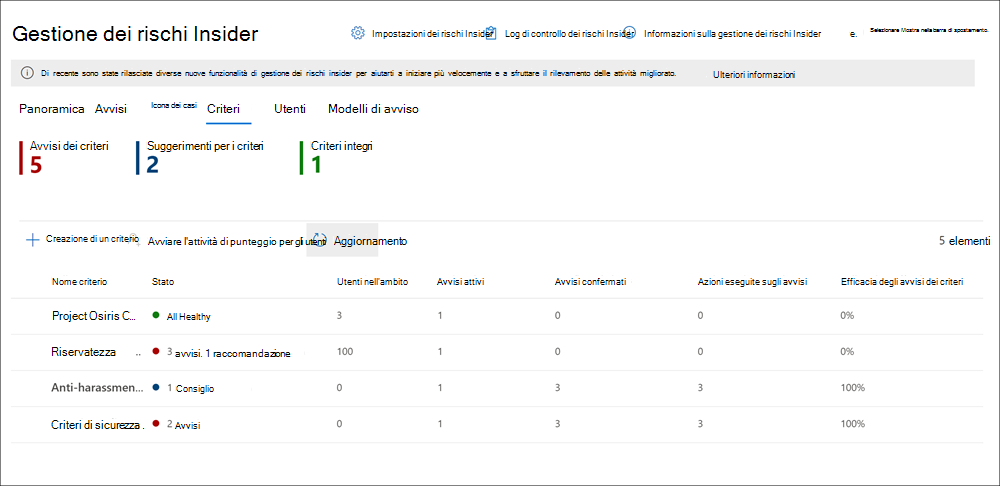

# Criteri di gestione dei rischi InsiderInsider risk management policies

I criteri di gestione dei rischi Insider determinano quali utenti sono nell'ambito e quali tipi di indicatori di rischio sono configurati per gli avvisi.Insider risk management policies determine which users are in-scope and which types of risk indicators are configured for alerts. È possibile creare rapidamente un criterio che si applica a tutti gli utenti dell'organizzazione o definire singoli utenti o gruppi per la gestione in un criterio.You can quickly create a policy that applies to all users in your organization or define individual users or groups for management in a policy. I criteri supportano le priorità dei contenuti per concentrare le condizioni dei criteri su Più o specifici Microsoft Teams, siti di SharePoint, tipi di riservatezza dei dati ed etichette dati.Policies support content priorities to focus policy conditions on multiple or specific Microsoft Teams, SharePoint sites, data sensitivity types, and data labels. Utilizzando i modelli, è possibile selezionare indicatori di rischio specifici e personalizzare le soglie degli eventi per gli indicatori dei criteri, personalizzando in modo efficace i punteggi dei rischi e il livello e la frequenza degli avvisi.Using templates, you can select specific risk indicators and customize event thresholds for policy indicators, effectively customizing risk scores and level and frequency of alerts. Inoltre, i punteggi di rischio e i rilevamenti di anomalie consentono di identificare le attività degli utenti di maggiore rilevanza o più insolite.Additionally, risk score boosters and anomaly detections help identify user activity that is of higher importance or more unusual. Le finestre dei criteri consentono di definire l'intervallo di tempo in cui applicare il criterio alle attività di avviso e vengono usate per determinare la durata del criterio dopo l'attivazione.Policies windows allow you to define the time frame to apply the policy to alert activities and are used to determine the duration of the policy once activated.

## Dashboard dei criteriPolicy dashboard

Il **dashboard dei** criteri consente di visualizzare rapidamente i criteri nell'organizzazione e lo stato corrente degli avvisi associati a ogni criterio.The **Policy dashboard** allows you to quickly see the policies in your organization and the current status of alerts associated with each policy.

- **Nome criterio:** il nome assegnato al criterio nella procedura guidata per i criteri.**Policy name**: The name assigned to the policy in the policy wizard.
- **Avvisi attivi**: numero di avvisi attivi per ogni criterio.**Active alerts**: The number of active alerts for each policy.
- **Avvisi confermati:** numero totale di avvisi generati dai criteri negli ultimi 365 giorni.**Confirmed alerts**: The total number of alerts the resulted in cases from the policy in the last 365 days.
- **Azioni eseguite sugli avvisi:** numero totale di avvisi confermati o ignorati negli ultimi 365 giorni.**Actions taken on alerts**: The total number of alerts that were confirmed or dismissed for the last 365 days.
- **Efficacia dei criteri**: percentuale determinata dagli avvisi confermati totali suddivisi per il numero totale di azioni eseguite sugli avvisi (ovvero la somma degli avvisi confermati o ignorati nell'ultimo anno).**Policy effectiveness**: The percentage determined by total confirmed alerts divided by total actions taken on alerts (which is the sum of alerts that were confirmed or dismissed over the past year).
- **Attivo**: stato del caso, *sì* o *no.***Active**: The status of the case, either *Yes* or *No*.

## Modelli dei criteriPolicy templates

I modelli di gestione dei rischi Insider sono condizioni dei criteri predefinite che definiscono i tipi di indicatori di rischio e il modello di punteggio dei rischi utilizzati dal criterio.Insider risk management templates are pre-defined policy conditions that define the types of risk indicators and risk scoring model used by the policy. A ogni criterio deve essere assegnato un modello nella procedura guidata di creazione dei criteri prima della creazione del criterio.Each policy must have a template assigned in the policy creation wizard before the policy is created. La gestione dei rischi Insider supporta fino a cinque criteri per ogni modello di criterio.Insider risk management supports up to five policies for each policy template. Quando si crea un nuovo criterio di rischio Insider con la procedura guidata dei criteri, è possibile scegliere tra uno dei modelli di criteri seguenti:When you create a new insider risk policy with the policy wizard, you'll choose from one of the following policy templates:

### Furto di dati da parte degli utentiData theft by departing users

Quando gli utenti lasciano l'organizzazione, esistono indicatori di rischio specifici in genere associati al furto di dati da parte degli utenti che lasciano l'organizzazione.When users leave your organization, there are specific risk indicators typically associated with data theft by departing users. Questo modello di criteri usa gli indicatori per il punteggio dei rischi e concentra il rilevamento e gli avvisi su questa area di rischio.This policy template uses indicators for risk scoring and focuses detection and alerts to this risk area. Il furto di dati per gli utenti in partenza può includere il download di file da SharePoint Online, la stampa di file e la copia dei dati nei servizi di messaggistica e archiviazione sul cloud personale in prossimità delle date di scadenza e delle remissioni dal lavoro.Data theft for departing users may include downloading files from SharePoint Online, printing files, and copying data to personal cloud messaging and storage services near their employment resignation and end dates. Questo modello inizia a segnare gli indicatori di rischio relativi a queste attività e il modo in cui sono correlati allo stato di impiego degli utenti.This template starts scoring for risk indicators relating to these activities and how they correlate with user employment status.

>[!IMPORTANT]
>Quando si utilizza questo modello, è necessario configurare un connettore risorse umane di Microsoft 365 per importare periodicamente le informazioni sulla data di chiusura e di chiusura per gli utenti dell'organizzazione.When using this template, you must configure a Microsoft 365 HR connector to periodically import resignation and termination date information for users in your organization. Per istruzioni [dettagliate](import-hr-data.md) sulla configurazione del connettore risorse umane di Microsoft 365 per l'organizzazione, vedere l'articolo Importare dati con il connettore risorse umane.See the [Import data with the HR connector](import-hr-data.md) article for step-by-step guidance to configure the Microsoft 365 HR connector for your organization.

### Perdite di dati generaliGeneral data leaks

La protezione dei dati e la prevenzione delle perdite di dati sono una sfida costante per la maggior parte delle organizzazioni, in particolare con la rapida crescita di nuovi dati creati da utenti, dispositivi e servizi.Protecting data and preventing data leaks is a constant challenge for most organizations, particularly with the rapid grow of new data created by users, devices, and services. Gli utenti sono autorizzati a creare, archiviare e condividere informazioni tra servizi e dispositivi che rendono la gestione delle perdite di dati sempre più complessa e difficile.Users are empowered to create, store, and share information across services and devices that make managing data leaks increasingly more complex and difficult. Le perdite di dati possono includere la sovrascrittura accidentale delle informazioni all'esterno dell'organizzazione o il furto di dati con intento dannoso.Data leaks can include accidental oversharing of information outside your organization or data theft with malicious intent. In combinazione con un criterio di prevenzione della perdita dei dati (DLP) assegnato, questo modello inizia a segnare rilevamenti in tempo reale di download sospetti di dati di SharePoint Online, condivisione di file e cartelle, stampa di file e copia dei dati nei servizi di archiviazione e messaggistica cloud personali.In conjunction with an assigned Data Loss Prevention (DLP) policy, this template starts scoring real-time detections of suspicious SharePoint Online data downloads, file and folder sharing, printing files, and copying data to personal cloud messaging and storage services.

Quando si utilizza un **modello di** perdita di dati, è necessario assegnare un criterio DLP per attivare gli indicatori nel criterio di rischio Insider per gli avvisi di gravità elevata nell'organizzazione.When using a **Data leaks** template, you must assign a DLP policy to trigger indicators in the insider risk policy for high severity alerts in your organization. Ogni volta che un avviso di gravità elevata viene generato da una regola dei criteri DLP viene aggiunto al log di controllo di Office 365, i criteri di rischio Insider creati con questo modello esaminano automaticamente l'avviso DLP di gravità elevata.Whenever a high severity alert is generated by a DLP policy rule is added to the Office 365 audit log, insider risk policies created with this template automatically examine the high severity DLP alert. Se l'avviso contiene un utente nell'ambito definito nel criterio di rischio Insider, l'avviso viene elaborato dal criterio di rischio Insider come nuovo avviso e assegnato un livello di gravità del rischio Insider e un punteggio di rischio.If the alert contains an in-scope user defined in the insider risk policy, the alert is processed by the insider risk policy as a new alert and assigned an insider risk severity and risk score. Questo criterio consente di valutare questo avviso nel contesto di altre attività incluse nel caso.This policy allows you to evaluate this alert in context with other activities included in the case.

#### Linee guida per i criteri per la perdita di datiData leaks policy guidelines

Quando si creano o si modificano i criteri DLP da utilizzare con i criteri di gestione dei rischi Insider, prendere in considerazione le linee guida seguenti:When creating or modifying DLP policies for use with insider risk management policies, consider the following guidelines:

- Assegnare priorità agli eventi di esfiltrazione dei dati ed essere selettivi quando si assegnano le impostazioni dei rapporti operazioni non consentite su *Alta* durante la configurazione delle regole nei criteri DLP. Prioritize data exfiltration events and be selective when assigning **Incident reports** settings to *High* when configuring rules in your DLP policies. Ad esempio, l'invio di documenti sensibili  a un noto partecipante deve essere un evento di esfiltrazione con livello di avviso elevato.For example, emailing sensitive documents to a known competitor should be a *High* alert level exfiltration event. L'assegnazione di  un livello  elevato nelle impostazioni dei rapporti operazioni non consentite in altre regole dei criteri DLP può aumentare il rumore nel flusso di lavoro degli avvisi per la gestione dei rischi Insider e rendere più difficile per gli investigatori e gli analisti dei dati valutare correttamente questi avvisi.Over-assigning the *High* level in the **Incident reports** settings in other DLP policy rules can increase the noise in the insider risk management alert workflow and make it more difficult for your data investigators and analysts to properly evaluate these alerts. Ad esempio, *l'assegnazione* di livelli di avviso elevati alle attività di negazione dell'accesso nei criteri DLP rende più difficile valutare il comportamento e le attività degli utenti veramente rischiose.For example, assigning *High* alert levels to access denial activities in DLP policies makes it more challenging to evaluate truly risky user behavior and activities.
- Assicurarsi di aver compreso e configurato correttamente gli utenti nell'ambito nei criteri di gestione dei rischi DLP e Insider.Make sure you understand and properly configure the in-scope users in both the DLP and insider risk management policies. Solo gli utenti definiti come nell'ambito dei  criteri di gestione dei rischi Insider che utilizzano il modello Perdite di dati avranno avvisi dei criteri DLP di gravità elevata elaborati.Only users defined as in-scope for insider risk management policies using the **Data leaks** template will have high severity DLP policy alerts processed. Inoltre, solo gli utenti definiti come nell'ambito in una regola per un avviso DLP di gravità elevata verranno esaminati dal criterio di gestione dei rischi Insider per essere considerati.Additionally, only users defined as in-scope in a rule for a high severity DLP alert will be examined by the insider risk management policy for consideration. È importante non configurare inconsapevolmente gli utenti nell'ambito dei criteri di rischio DLP e Insider in modo in conflitto.It is important that you don't unknowingly configure in-scope users in both your DLP and insider risk policies in a conflicting manner.

     Ad esempio, se l'ambito delle regole dei criteri DLP è solo agli  utenti del team di vendita e il criterio di rischio Insider creato dal modello Perdite di dati ha definito tutti gli utenti come nell'ambito, il criterio di rischio Insider eelaborare solo avvisi DLP di gravità elevata per gli utenti del team di vendita.For example, if your DLP policy rules are scoped to only users on the Sales Team and the insider risk policy created from the **Data leaks** template has defined all users as in-scope, the insider risk policy will only actually process high severity DLP alerts for the users on the Sales Team. Il criterio di rischio Insider non riceverà alcun avviso DLP ad alta priorità per l'elaborazione da parte degli utenti che non sono definiti nelle regole DLP in questo esempio.The insider risk policy won't receive any high priority DLP alerts for users to process that aren't defined in the DLP rules in this example. Viceversa, se il criterio di  gestione dei rischi Insider creato dai modelli di perdita di dati ha come ambito solo gli utenti del team vendite e il criterio DLP assegnato è assegnato a tutti gli utenti, il criterio di rischio Insider elaverà solo avvisi DLP di gravità elevata per i membri del team vendite.Conversely, if your insider risk management policy created from **Data leaks** templates is scoped to only users on the Sales Team and the assigned DLP policy is scoped to all users, the insider risk policy will only process high severity DLP alerts for members of the Sales Team. Il criterio di gestione dei rischi Insider ignorerà gli avvisi DLP di gravità elevata per tutti gli utenti non del team di vendita.The insider risk management policy will ignore high severity DLP alerts for all users not on the Sales Team.

- Verificare che **l'impostazione della** regola dei rapporti operazioni non consentite nel criterio DLP utilizzato per questo modello di gestione dei rischi Insider sia configurata per gli *avvisi* con livello di gravità elevato.Make sure the **Incident reports** rule setting in the DLP policy used for this insider risk management template is configured for *High* severity level alerts. Il *livello di* gravità elevato è che gli eventi di attivazione e gli  avvisi di gestione dei rischi Insider non verranno generati dalle regole nei criteri DLP con il campo Rapporti operazioni non consentite impostato su *Basso* o *Medio.*The *High* severity level is the triggering events and insider risk management alerts won't be generated from rules in DLP policies with the **Incident reports** field set at *Low* or *Medium*.

    

     >[!NOTE]
     >Quando si crea un nuovo criterio DLP utilizzando i modelli predefiniti, è necessario selezionare l'opzione Crea  o personalizza regole **DLP** avanzate per configurare l'impostazione dei rapporti operazioni non consentite per il livello di gravità elevato. When creating a new DLP policy using the built-in templates, you'll need to select the **Create or customize advanced DLP rules** option to configure the **Incident reports** setting for the *High* severity level.

A ogni criterio di gestione dei rischi Insider creato **dal** modello Perdite di dati può essere assegnato un solo criterio DLP.Each insider risk management policy created from the **Data leaks** template can only have one DLP policy assigned. Prendere in considerazione la creazione di un criterio DLP dedicato che combina le diverse attività che si desidera rilevare e agire come trigger di eventi per i criteri di rischio Insider che utilizzano il modello perdite **di** dati.Consider creating a dedicated DLP policy that combines the different activities you want to detect and act as triggering events for  insider risk policies that use the **Data leaks** template.

Vedere [l'articolo creare, testare e](create-test-tune-dlp-policy.md) ottimizzare un criterio DLP per istruzioni dettagliate per configurare i criteri DLP per l'organizzazione.See the [Create, test, and tune a DLP policy](create-test-tune-dlp-policy.md) article for step-by-step guidance to configure DLP policies for your organization.

### Perdite di dati per utenti con priorità (anteprima)Data leaks by priority users (preview)

La protezione dei dati e la prevenzione delle perdite di dati per gli utenti dell'organizzazione possono dipendere dalla posizione, dal livello di accesso alle informazioni riservate o dalla cronologia dei rischi.Protecting data and preventing data leaks for users in your organization may depend on their position, level of access to sensitive information, or risk history. Le perdite di dati possono includere la sovrascrittura accidentale di informazioni altamente riservate all'esterno dell'organizzazione o il furto di dati con intento dannoso.Data leaks can include accidental oversharing of highly sensitive information outside your organization or data theft with malicious intent. In combinazione con un criterio di prevenzione della perdita dei dati (DLP) assegnato, questo modello inizia a segnare rilevamenti in tempo reale di attività sospette e aumenta la probabilità di avvisi di rischio Insider e avvisi con livelli di gravità più elevati.In conjunction with an assigned Data Loss Prevention (DLP) policy, this template starts scoring real-time detections of suspicious activity and result in an increased likelihood of insider risk alerts and alerts with higher severity levels. Gli utenti con priorità sono definiti in [gruppi di utenti con](insider-risk-management-settings.md#priority-user-groups-preview) priorità configurati nell'area delle impostazioni di gestione dei rischi Insider.Priority users are defined in [priority user groups](insider-risk-management-settings.md#priority-user-groups-preview) configured in the insider risk management settings area.

Come per il modello **General data leaks,** è necessario assegnare un criterio DLP per attivare gli indicatori nel criterio di rischio Insider per gli avvisi di gravità elevata nell'organizzazione.As with the **General data leaks template**, you must assign a DLP policy to trigger indicators in the insider risk policy for high severity alerts in your organization. Segui le linee guida sui criteri per la perdita di dati sopra riportate quando crei un criterio usando questo modello.Follow the Data leaks policy guidelines above when creating a policy using this template. Inoltre, sarà necessario assegnare al criterio i gruppi di utenti con priorità creati in **Impostazioni** di gestione dei rischi  >    >  **Insider.**Additionally, you will need to assign priority user groups created in **Insider risk management** > **Settings** > **Priority user groups** to the policy.

### Perdite di dati da parte di utenti scontenti (anteprima)Data leaks by disgruntled users (preview)

Quando gli utenti sperimentano fattori di stress per l'impiego, potrebbero non essere scontenti e ciò può aumentare le probabilità di attività a rischio insider.When users experience employment stressors, they may become disgruntled which may increase the chances of insider risk activity. Questo modello inizia a segnare l'attività dell'utente quando viene identificato un indicatore associato a un dissenso.This template starts scoring user activity when an indicator associated with disgruntlement is identified. Ad esempio, notifiche sul miglioramento delle prestazioni, revisioni delle prestazioni scarse o modifiche allo stato del livello di processo.Examples include performance improvement notifications, poor performance reviews, or changes to job level status. Le perdite di dati per gli utenti scontenti possono includere il download di file da SharePoint Online e la copia dei dati nei servizi di messaggistica e archiviazione cloud personali in prossimità di eventi stressor di lavoro.Data leaks for disgruntled users may include downloading files from SharePoint Online and copying data to personal cloud messaging and storage services near employment stressor events.

Quando si utilizza questo modello, è necessario configurare anche un connettore risorse umane di Microsoft 365 per importare periodicamente notifiche sul miglioramento delle prestazioni, stato di revisione delle prestazioni scadente o informazioni sulle modifiche a livello di processo per gli utenti dell'organizzazione.When using this template, you must also configure a Microsoft 365 HR connector to periodically import performance improvement notifications, poor performance review status, or job level change information for users in your organization. Per istruzioni [dettagliate](import-hr-data.md) sulla configurazione del connettore risorse umane di Microsoft 365 per l'organizzazione, vedere l'articolo Importare dati con il connettore risorse umane.See the [Import data with the HR connector](import-hr-data.md) article for step-by-step guidance to configure the Microsoft 365 HR connector for your organization.

### Violazioni generali dei criteri di sicurezza (anteprima)General security policy violations (preview)

In molte organizzazioni, gli utenti hanno le autorizzazioni per installare software nei propri dispositivi o per modificare le impostazioni dei dispositivi per facilitare le attività.In many organizations, users have permissions to install software on their devices or to modify device settings to help with their tasks. Inavvertitamente o con intento dannoso, gli utenti possono installare malware o disabilitare importanti funzionalità di sicurezza che consentono di proteggere le informazioni nel dispositivo o nelle risorse di rete.Either inadvertently or with malicious intent, users may install malware or disable important security features that help protect information on their device or on your network resources. Questo modello di criteri usa gli avvisi di sicurezza di Microsoft Defender per Endpoint per iniziare a segnare queste attività e il rilevamento dello stato attivo e gli avvisi per questa area di rischio.This policy template uses security alerts from Microsoft Defender for Endpoint to start scoring these activities and focus detection and alerts to this risk area. Usa questo modello per fornire informazioni dettagliate sulle violazioni dei criteri di sicurezza in scenari in cui gli utenti potrebbero avere una cronologia delle violazioni dei criteri di sicurezza che potrebbero essere un indicatore di rischio Insider.Use this template to provide insights for security policy violations in scenarios when users may have a history of security policy violations that may be an indicator of insider risk.

Dovrai configurare Microsoft Defender per Endpoint nell'organizzazione e abilitare Defender per Endpoint per l'integrazione della gestione dei rischi Insider in Defender Security Center per importare gli avvisi di violazione della sicurezza.You'll need to have Microsoft Defender for Endpoint configured in your organization and enable Defender for Endpoint for insider risk management integration in the Defender Security Center to import security violation alerts. Per altre informazioni sulla configurazione di Defender per Endpoint per l'integrazione della gestione dei rischi Insider, vedi [Configurare le funzionalità avanzate in Defender per Endpoint.](https://docs.microsoft.com/windows/security/threat-protection/microsoft-defender-atp/advanced-features#share-endpoint-alerts-with-microsoft-compliance-center)For more information on configuring Defender for Endpoint for insider risk management integration, see [Configure advanced features in Defender for Endpoint](https://docs.microsoft.com/windows/security/threat-protection/microsoft-defender-atp/advanced-features#share-endpoint-alerts-with-microsoft-compliance-center).

### Violazioni dei criteri di sicurezza da parte degli utenti (anteprima)Security policy violations by departing users (preview)

L'abbandono degli utenti, indipendentemente dal fatto che si lascino in termini positivi o negativi, può essere un rischio maggiore per le violazioni dei criteri di sicurezza.Departing users, whether leaving on positive or negative terms, may be higher risks for security policy violations. Per evitare violazioni di sicurezza accidentali o dannose per gli utenti in partenza, questo modello di criteri usa Defender per gli avvisi endpoint per fornire informazioni dettagliate sulle attività correlate alla sicurezza.To help protect against inadvertent or malicious security violations for departing users, this policy template uses Defender for Endpoint alerts to provide insights into security-related activities. Queste attività includono l'installazione di malware o altre applicazioni potenzialmente dannose e la disabilitazione delle funzionalità di sicurezza nei dispositivi.These activities include the user installing malware or other potentially harmful applications and disabling security features on their devices. Gli indicatori dei criteri vengono attivati dopo che gli utenti hanno una data di disdetta o di chiusura importata dal connettore risorse umane di Microsoft 365 come evento di attivazione.Policy indicators are activated after users have a resignation or termination date imported from the Microsoft 365 HR Connector as a triggering event.

Quando si utilizza questo modello, è necessario configurare un connettore risorse umane di Microsoft 365 per importare periodicamente le informazioni sulla data di chiusura e di chiusura per gli utenti dell'organizzazione.When using this template, you must configure a Microsoft 365 HR connector to periodically import resignation and termination date information for users in your organization. Per istruzioni [dettagliate](import-hr-data.md) sulla configurazione del connettore risorse umane di Microsoft 365 per l'organizzazione, vedere l'articolo Importare dati con il connettore risorse umane.See the [Import data with the HR connector](import-hr-data.md) article for step-by-step guidance to configure the Microsoft 365 HR connector for your organization.

Dovrai configurare Microsoft Defender per Endpoint nell'organizzazione e abilitare Defender per Endpoint per l'integrazione della gestione dei rischi Insider in Defender Security Center per importare gli avvisi di violazione della sicurezza.You'll need to have Microsoft Defender for Endpoint configured in your organization and enable Defender for Endpoint for insider risk management integration in the Defender Security Center to import security violation alerts. Per altre informazioni sulla configurazione di Defender per Endpoint per l'integrazione della gestione dei rischi Insider, vedi [Configurare le funzionalità avanzate in Defender per Endpoint.](https://docs.microsoft.com/windows/security/threat-protection/microsoft-defender-atp/advanced-features#share-endpoint-alerts-with-microsoft-compliance-center)For more information on configuring Defender for Endpoint for insider risk management integration, see [Configure advanced features in Defender for Endpoint](https://docs.microsoft.com/windows/security/threat-protection/microsoft-defender-atp/advanced-features#share-endpoint-alerts-with-microsoft-compliance-center).

### Violazioni dei criteri di sicurezza da parte degli utenti con priorità (anteprima)Security policy violations by priority users (preview)

La protezione dalle violazioni della sicurezza per gli utenti dell'organizzazione può dipendere dalla posizione, dal livello di accesso alle informazioni riservate o dalla cronologia dei rischi.Protecting against security violations for users in your organization may depend on their position, level of access to sensitive information, or risk history. Poiché le violazioni di sicurezza in base alla priorità possono avere un impatto maggiore sulle aree critiche dell'organizzazione, questo modello di criteri inizia a segnare su questi indicatori e usa gli avvisi di Microsoft Defender for Endpoint per fornire informazioni approfondite sulle attività correlate alla sicurezza per questi utenti.Because security violations by priority users may have an outsized impact on your organization's critical areas, this policy template starts scoring on these indicators and uses Microsoft Defender for Endpoint alerts to provide insights into security-related activities for these users. Questi possono includere la priorità degli utenti nell'installazione di malware o altre applicazioni potenzialmente dannose e la disabilitazione delle funzionalità di sicurezza nei propri dispositivi.These may include the priority users installing malware or other potentially harmful applications and disabling security features on their devices. Gli utenti con priorità sono definiti in gruppi di utenti con priorità configurati nell'area delle impostazioni di gestione dei rischi Insider.Priority users are defined in priority user groups configured in the insider risk management settings area.

Dovrai configurare Microsoft Defender per Endpoint nell'organizzazione e abilitare Defender per Endpoint per l'integrazione della gestione dei rischi Insider in Defender Security Center per importare gli avvisi di violazione della sicurezza.You'll need to have Microsoft Defender for Endpoint configured in your organization and enable Defender for Endpoint for insider risk management integration in the Defender Security Center to import security violation alerts. Per altre informazioni sulla configurazione di Defender per Endpoint per l'integrazione della gestione dei rischi Insider, vedi [Configurare le funzionalità avanzate in Defender per Endpoint.](https://docs.microsoft.com/windows/security/threat-protection/microsoft-defender-atp/advanced-features#share-endpoint-alerts-with-microsoft-compliance-center)For more information on configuring Defender for Endpoint for insider risk management integration, see [Configure advanced features in Defender for Endpoint](https://docs.microsoft.com/windows/security/threat-protection/microsoft-defender-atp/advanced-features#share-endpoint-alerts-with-microsoft-compliance-center). Inoltre, sarà necessario assegnare al criterio i gruppi di utenti con priorità creati in **Impostazioni** di gestione dei rischi  >    >  **Insider.**Additionally, you will need to assign priority user groups created in **Insider risk management** > **Settings** > **Priority user groups** to the policy.

### Violazioni dei criteri di sicurezza da parte di utenti scontenti (anteprima)Security policy violations by disgruntled users (preview)

Gli utenti che provano stress per l'impiego possono essere a rischio maggiore per violazioni accidentali o dannose dei criteri di sicurezza.Users that experience employment stressors may be at a higher risk for inadvertent or malicious security policy violations. Questi stress possono includere l'utente che viene inserito in un piano di miglioramento delle prestazioni, lo stato di valutazione delle prestazioni scarse o l'abbassamento di livello dalla posizione corrente.These stressors may include the user being placed on a performance improvement plan, poor performance review status, or being demoted from their current position. Questo modello di criteri avvia il punteggio dei rischi in base a questi indicatori e attività associati a questi eventi per questi utenti.This policy template starts risk scoring based these indicators and activities associated with these events for these users.

Quando si utilizza questo modello, è necessario configurare anche un connettore risorse umane di Microsoft 365 per importare periodicamente notifiche sul miglioramento delle prestazioni, stato di revisione delle prestazioni scadente o informazioni sulle modifiche a livello di processo per gli utenti dell'organizzazione.When using this template, you must also configure a Microsoft 365 HR connector to periodically import performance improvement notifications, poor performance review status, or job level change information for users in your organization. Per istruzioni [dettagliate](import-hr-data.md) sulla configurazione del connettore risorse umane di Microsoft 365 per l'organizzazione, vedere l'articolo Importare dati con il connettore risorse umane.See the [Import data with the HR connector](import-hr-data.md) article for step-by-step guidance to configure the Microsoft 365 HR connector for your organization.

Dovrai anche configurare Microsoft Defender per Endpoint nell'organizzazione e abilitare Defender per Endpoint per l'integrazione della gestione dei rischi Insider in Defender Security Center per importare gli avvisi di violazione della sicurezza.You'll also need to have Microsoft Defender for Endpoint configured in your organization and enable Defender for Endpoint for insider risk management integration in the Defender Security Center to import security violation alerts. Per altre informazioni sulla configurazione di Defender per Endpoint per l'integrazione della gestione dei rischi Insider, vedi [Configurare le funzionalità avanzate in Defender per Endpoint.](https://docs.microsoft.com/windows/security/threat-protection/microsoft-defender-atp/advanced-features#share-endpoint-alerts-with-microsoft-compliance-center)For more information on configuring Defender for Endpoint for insider risk management integration, see [Configure advanced features in Defender for Endpoint](https://docs.microsoft.com/windows/security/threat-protection/microsoft-defender-atp/advanced-features#share-endpoint-alerts-with-microsoft-compliance-center).

### Prerequisiti dei modelli di criteri ed eventi di attivazionePolicy template prerequisites and triggering events

A seconda del modello scelto per un criterio di gestione dei rischi Insider, gli eventi di attivazione e i prerequisiti dei criteri variano.Depending on the template you choose for an insider risk management policy, the triggering events and policy prerequisites vary. L'attivazione degli eventi è un prerequisito che determina se un utente è attivo per un criterio di gestione dei rischi Insider.Triggering events are prerequisites that determine if a user is active for an insider risk management policy. Se un utente viene aggiunto a un criterio di gestione dei rischi Insider ma non ha un evento di attivazione, l'attività dell'utente non viene valutata dal criterio, a meno che non venga aggiunto manualmente nel dashboard degli utenti.If a user is added to an insider risk management policy but does not have a triggering event, the user activity is not evaluated by the policy unless they are manually added in the Users dashboard. I prerequisiti dei criteri sono elementi necessari in modo che i criteri ricevano i segnali o le attività necessari per valutare i rischi.Policy prerequisites are required items so that the policy receives the signals or activities necessary to evaluate risk.

Nella tabella seguente sono elencati gli eventi di attivazione e i prerequisiti per i criteri creati da ogni modello di criteri di gestione dei rischi Insider:The following table lists the triggering events and prerequisites for policies created from each insider risk management policy template:

| **Modello di criteri****Policy template** | **Attivazione di eventi per i criteri****Triggering events for policies** | **Prerequisiti****Prerequisites** |
| :------------------ | :--------------------------------- | :---------------- |
| Furto di dati da parte degli utentiData theft by departing users | Indicatore della data di disdetta o di chiusura dal connettore risorse umaneResignation or termination date indicator from HR connector | Connettore risorse umane di Microsoft 365 configurato per indicatori di data di chiusura e di dimissioniMicrosoft 365 HR connector configured for termination and resignation date indicators |
| Perdite di dati generaliGeneral data leaks | Attività dei criteri di perdita dei dati che crea un avviso di gravità elevataData leak policy activity that creates a High severity alert | Criterio DLP configurato per gli avvisi di gravità elevataDLP policy configured for High severity alerts |
| Perdite di dati per utenti con prioritàData leaks by priority users | Attività dei criteri di perdita dei dati che crea un avviso di gravità elevataData leak policy activity that creates a High severity alert | Criterio DLP configurato per gli avvisi di gravità elevataDLP policy configured for High severity alerts    Gruppi di utenti con priorità configurati nelle impostazioni dei rischi InsiderPriority user groups configured in insider risk settings |
| Perdite di dati da parte di utenti scontentiData leaks by disgruntled users | Indicatori di miglioramento delle prestazioni, prestazioni scarse o cambiamenti a livello di processo dal connettore risorse umanePerformance improvement, poor performance, or job level change indicators from HR connector | Connettore risorse umane di Microsoft 365 configurato per gli indicatori di disgruenzaMicrosoft 365 HR connector configured for disgruntlement indicators |
| Violazioni generali dei criteri di sicurezzaGeneral security policy violations | Evasione difensiva dei controlli di sicurezza o del software indesiderato rilevato da Microsoft Defender per EndpointDefensive evasion of security controls or unwanted software detected by Microsoft Defender for Endpoint | Sottoscrizione di Microsoft Defender for Endpoint attivaActive Microsoft Defender for Endpoint subscription    Integrazione di Microsoft Defender for Endpoint con il Centro conformità Microsoft 365 configuratoMicrosoft Defender for Endpoint integration with Microsoft 365 compliance center configured |
| Violazioni dei criteri di sicurezza da parte degli utentiSecurity policy violations by departing users | Indicatori di data di disdetta o di chiusura dal connettore risorse umaneResignation or termination date indicators from HR connector | Connettore risorse umane di Microsoft 365 configurato per indicatori di data di chiusura e di dimissioniMicrosoft 365 HR connector configured for termination and resignation date indicators    Sottoscrizione di Microsoft Defender for Endpoint attivaActive Microsoft Defender for Endpoint subscription    Integrazione di Microsoft Defender for Endpoint con il Centro conformità Microsoft 365 configuratoMicrosoft Defender for Endpoint integration with Microsoft 365 compliance center configured |
| Violazioni dei criteri di sicurezza da parte degli utenti con prioritàSecurity policy violations by priority users | Evasione difensiva dei controlli di sicurezza o del software indesiderato rilevato da Microsoft Defender per EndpointDefensive evasion of security controls or unwanted software detected by Microsoft Defender for Endpoint | Sottoscrizione di Microsoft Defender for Endpoint attivaActive Microsoft Defender for Endpoint subscription    Integrazione di Microsoft Defender for Endpoint con il Centro conformità Microsoft 365 configuratoMicrosoft Defender for Endpoint integration with Microsoft 365 compliance center configured    Gruppi di utenti con priorità configurati nelle impostazioni dei rischi InsiderPriority user groups configured in insider risk settings |
| Violazioni dei criteri di sicurezza da parte di un utente scontentoSecurity policy violations by disgruntled user | Indicatori di miglioramento delle prestazioni, prestazioni scarse o cambiamenti a livello di processo dal connettore risorse umanePerformance improvement, poor performance, or job level change indicators from HR connector | Connettore risorse umane di Microsoft 365 configurato per gli indicatori di disgruenzaMicrosoft 365 HR connector configured for disgruntlement indicators    Sottoscrizione di Microsoft Defender for Endpoint attivaActive Microsoft Defender for Endpoint subscription    Integrazione di Microsoft Defender for Endpoint con il Centro conformità Microsoft 365 configuratoMicrosoft Defender for Endpoint integration with Microsoft 365 compliance center configured |

## Assegnare priorità al contenuto nei criteriPrioritize content in policies

I criteri di gestione dei rischi Insider supportano la specifica di una priorità più alta per il contenuto a seconda della posizione di archiviazione o della modalità di classificazione.Insider risk management policies support specifying a higher priority for content depending where it is stored or how it is classified. Se si specifica il contenuto come priorità, aumenta il punteggio di rischio per qualsiasi attività associata, che a sua volta aumenta la probabilità di generare un avviso di gravità elevata.Specifying content as a priority increases the risk score for any associated activity, which in turn increases the chance of generating a high severity alert. Tuttavia, alcune attività non genereranno un avviso a meno che il contenuto correlato non contenga tipi di informazioni sensibili predefiniti o personalizzati o non sia stato specificato come priorità nel criterio.However, some activities won't generate an alert at all unless the related content contains built-in or custom sensitive info types or was specified as a priority in the policy.

Ad esempio, l'organizzazione dispone di un sito di SharePoint dedicato per un progetto estremamente riservato.For example, your organization has a dedicated SharePoint site for a highly confidential project. Le perdite di dati per le informazioni in questo sito di SharePoint potrebbero compromettere il progetto e avere un impatto significativo sul suo successo.Data leaks for information in this SharePoint site could compromise the project and would have a significant impact on its success. Assegnando la priorità a questo sito di SharePoint in un criterio di perdita di dati, i punteggi di rischio per le attività idonee vengono aumentati automaticamente.By prioritizing this SharePoint site in a Data leaks policy, risk scores for qualifying activities are automatically increased. Questa definizione di priorità aumenta la probabilità che queste attività generino un avviso di rischio Insider e aumentino il livello di gravità dell'avviso.This prioritization increases the likelihood that these activities generate an insider risk alert and raises the severity level for the alert.

Quando si crea un criterio di gestione dei rischi Insider nella procedura guidata dei criteri, è possibile scegliere tra le seguenti priorità:When you create an insider risk management policy in the policy wizard, you can choose from the following priorities:

- **Siti di SharePoint:** a tutte le attività associate a tutti i tipi di file nei siti di SharePoint definiti viene assegnato un punteggio di rischio maggiore.**SharePoint sites**: Any activity associated with all file types in defined SharePoint sites is assigned a higher risk score. 
- **Tipi di informazioni riservate:** a tutte le attività associate a contenuti che contengono tipi di [informazioni riservate](sensitive-information-type-entity-definitions.md) viene assegnato un punteggio di rischio maggiore.**Sensitive information types**: Any activity associated with content that contains [sensitive information types](sensitive-information-type-entity-definitions.md) are assigned a higher risk score.
- **Etichette di riservatezza:** a tutte le  attività associate al contenuto a cui sono applicate etichette di riservatezza specifiche viene assegnato un punteggio di rischio maggiore.**Sensitivity labels**: Any activity associated with content that has specific [sensitivity labels](sensitivity-labels.md) applied are assigned a higher risk score.

## Creare un nuovo criterioCreate a new policy

Per creare un nuovo criterio di gestione dei rischi Insider, si userà la procedura guidata dei criteri nella soluzione di gestione dei rischi **Insider** nel Centro conformità Microsoft 365.To create a new insider risk management policy, you'll use the policy wizard in **Insider risk management** solution in the Microsoft 365 compliance center.

Completare la procedura seguente per creare un nuovo criterio:Complete the following steps to create a new policy:

1. Nel Centro [conformità Microsoft 365](https://compliance.microsoft.com)passare a **Gestione dei rischi Insider** e selezionare la **scheda** Criteri.In the [Microsoft 365 compliance center](https://compliance.microsoft.com), go to **Insider risk management** and select the **Policies** tab.
2. Selezionare **Crea criterio** per aprire la procedura guidata per i criteriSelect **Create policy** to open the policy wizard
3. Nella pagina **Nuovi criteri di rischio Insider,** completare i campi seguenti:On the **New insider risk policy** page, complete the following fields:
    - **Nome (obbligatorio):** immettere un nome descrittivo per il criterio.**Name (required)**: Enter a friendly name for the policy.
    - **Descrizione (facoltativo):** immettere una descrizione per il criterio.**Description (optional)**: Enter a description for the policy.
    - **Scegliere il modello di criteri (obbligatorio):** selezionare uno dei modelli di [criteri](insider-risk-management-policies.md#policy-templates) per definire i tipi di indicatori di rischio monitorati dal criterio.**Choose policy template (required)**: Select one of the [policy templates](insider-risk-management-policies.md#policy-templates) to define the types of risk indicators are monitored by the policy.

    >[!IMPORTANT]
    >La maggior parte dei modelli di criteri dispone di prerequisiti che devono essere configurati per il criterio per generare avvisi pertinenti.Most policy templates have prerequisites that must be configured for the policy to generate relevant alerts. Se non sono stati configurati i prerequisiti dei criteri applicabili, vedere Introduzione alla [gestione dei rischi Insider.](insider-risk-management-configure.md#step-3-configure-prerequisites-for-templates)If you haven't configured the applicable policy prerequisites, see [Get started with insider risk management](insider-risk-management-configure.md#step-3-configure-prerequisites-for-templates).

4. Selezionare **Avanti** per continuare.Select **Next** to continue.
5. Nella pagina **Utenti**  selezionare Aggiungi utente  o gruppo o Scegli gruppi di utenti con priorità per definire quali utenti o gruppi di utenti con priorità sono inclusi nel criterio, a seconda del modello di criteri selezionato.On the **Users** page, select **Add user or group** or **Choose Priority user groups** to define which users or priority user groups are included in the policy, depending on the policy template you've selected. Selezionare la casella di controllo Tutti gli utenti e i gruppi **abilitati** alla posta elettronica, se applicabile (se non è stato selezionato un modello basato sull'utente con priorità).Select **All users and mail-enabled groups** checkbox if applicable (if you haven't selected a priority user-based template). Selezionare **Avanti** per continuare.Select **Next** to continue.
6. Nella pagina Specificare il contenuto di cui definire la priorità **(facoltativo)** è possibile assegnare le origini per definire la priorità per un aumento dei punteggi di rischio.On the **Specify what content to prioritize (optional)** page, you can assign the sources to prioritize for increased risk scores. Tuttavia, alcune attività non genereranno un avviso a meno che il contenuto correlato non contenga tipi di informazioni sensibili predefiniti o personalizzati o non sia stato specificato come priorità in questa pagina:However, some activities won't generate an alert at all unless the related content contains built-in or custom sensitive info types or was specified as a priority on this page:
    - **Siti di SharePoint:** selezionare **Aggiungi sito di SharePoint** e selezionare le organizzazioni di SharePoint di cui si desidera assegnare la priorità.**SharePoint sites**: Select **Add SharePoint site** and select the SharePoint organizations you want to prioritize. Ad esempio, *"group1@contoso.sharepoint.com/sites/group1"*.For example, *"group1@contoso.sharepoint.com/sites/group1"*.
    - **Tipo di informazioni sensibili:** seleziona **Aggiungi tipo di informazioni sensibili** e seleziona i tipi di riservatezza di cui vuoi definire la priorità.**Sensitive info type**: Select **Add sensitive info type** and select the sensitivity types you want to prioritize. Ad esempio, *"U.S. Bank Account Number"* e *"Credit Card Number"*.For example, *"U.S. Bank Account Number"* and *"Credit Card Number"*.
    - **Etichette di riservatezza:** selezionare **Aggiungi etichetta di riservatezza** e selezionare le etichette di cui si desidera definire la priorità.**Sensitivity labels**: Select **Add sensitivity label** and select the labels you want to prioritize. Ad esempio, *"Riservato"* *e "Segreto".*For example, *"Confidential"* and *"Secret"*.
7. Selezionare **Avanti** per continuare.Select **Next** to continue.
8. Nella pagina **Seleziona indicatori di** criteri  verranno visualizzati gli indicatori definiti come disponibili nella pagina Indicatori delle impostazioni di rischio   >  **insider.**On the **Select policy indicators** page, you'll see the [indicators](insider-risk-management-settings.md#indicators) that you've defined as available on the **Insider risk settings** > **Indicators** page. Se è stato selezionato *un* modello di perdita di dati all'inizio della procedura guidata, è necessario selezionare un criterio DLP nell'elenco a discesa dei criteri **DLP** per abilitare gli indicatori di attivazione per il criterio.If you selected a *Data leaks* template at the beginning of the wizard, you must select a DLP policy from the **DLP policy** dropdown list to enable triggering indicators for the policy. Selezionare gli indicatori che si desidera applicare al criterio.Select the indicators you want to apply to the policy. Se si preferisce non usare le impostazioni di soglia dei criteri predefiniti per questi indicatori, disabilitare le soglie predefinite consigliate da **Microsoft** e immettere i valori di soglia per ogni indicatore selezionato.If you prefer not to use the default policy threshold settings for these indicators, disable the **Use default thresholds recommended by Microsoft** and enter the threshold values for each selected indicator. Se è stato selezionato almeno  un indicatore di *Office* o dispositivo, selezionare gli indicatori del punteggio di **rischio in base** alle esigenze.If you've selected at least one *Office* or *Device* indicator, select the **Risk score boosters** as appropriate. I punteggi di rischio sono applicabili solo per gli indicatori selezionati.Risk score boosters are only applicable for selected indicators.

    >[!IMPORTANT]
    >Se non è possibile selezionare gli indicatori in questa pagina, sarà necessario selezionare gli indicatori che si desidera abilitare per tutti i criteri nella pagina Indicatori dei criteri delle impostazioni di gestione dei rischi  >    >   Insider.If indicators on this page can't be selected, you'll need to select the indicators you want to enable for all policies on the **Insider risk management** > **Settings** > **Policy indicators** page.

9. Selezionare **Avanti** per continuare.Select **Next** to continue.
10. Nella pagina **Intervallo di tempo dei** criteri, vedrai le condizioni della finestra di attivazione per il criterio nella pagina Impostazioni dei rischi **Insider** Intervallo di tempo   >  **dei** criteri.On the **Policy timeframes** page, you'll see the [activation window conditions](insider-risk-management-settings.md#policy-timeframes) for the policy that on the **Insider risk settings** > **Policy timeframes** page.
11. Selezionare **Avanti** per continuare.Select **Next** to continue.
12. Nella pagina **Revisione** esaminare le impostazioni scelte per il criterio.On the **Review** page, review the settings you've chosen for the policy. Selezionare **Modifica** per modificare uno qualsiasi dei valori dei criteri oppure selezionare **Invia** per creare e attivare il criterio.Select **Edit** to change any of the policy values or select **Submit** to create and activate the policy.

## Aggiornare un criterioUpdate a policy

Per aggiornare un criterio di gestione dei rischi Insider esistente, si userà la procedura guidata dei criteri nella soluzione di gestione dei rischi **Insider** nel Centro conformità Microsoft 365.To update an existing insider risk management policy, you'll use the policy wizard in **Insider risk management** solution in the Microsoft 365 compliance center.

Completare la procedura seguente per gestire un criterio esistente:Complete the following steps to manage an existing policy:

1. Nel Centro [conformità Microsoft 365](https://compliance.microsoft.com)passare a **Gestione dei rischi Insider** e selezionare la **scheda** Criteri.In the [Microsoft 365 compliance center](https://compliance.microsoft.com), go to **Insider risk management** and select the **Policies** tab.
2. Nel dashboard dei criteri selezionare il criterio che si desidera gestire.On the policy dashboard, select the policy you want to manage.
3. Nella pagina dei dettagli del criterio, selezionare **Modifica criterio**On the policy details page, select **Edit policy**
4. Nella procedura guidata dei criteri non è possibile modificare i campi seguenti:In the policy wizard, you cannot edit the following fields:
    - **Name**: Nome descrittivo per il criterio**Name**: The friendly name for the policy
    - **Scegliere il modello di** criteri: il modello utilizzato per definire i tipi di indicatori di rischio monitorati dal criterio.**Choose policy template**: The template used to define the types of risk indicators monitored by the policy.
5. Immettere una nuova descrizione per il criterio nel **campo Descrizione.**Enter a new description for the policy in the **Description** field. 
6. Selezionare **Avanti** per continuare.Select **Next** to continue.
7. Nella pagina **Utenti**  selezionare Aggiungi utente  o gruppo o Scegli gruppi di utenti con priorità per definire quali utenti o gruppi di utenti con priorità sono inclusi nel criterio, a seconda del modello di criteri selezionato.On the **Users** page, select **Add user or group** or **Choose Priority user groups** to define which users or priority user groups are included in the policy, depending on the policy template you've selected. Selezionare la casella di controllo Tutti gli utenti e i gruppi **abilitati** alla posta elettronica, se applicabile (se non è stato selezionato un modello basato sull'utente con priorità).Select **All users and mail-enabled groups** checkbox if applicable (if you haven't selected a priority user-based template). Selezionare **Avanti** per continuare.Select **Next** to continue.
8. Nella pagina Specificare il contenuto di cui definire la priorità **(facoltativo)** è possibile assegnare le origini per definire la priorità per un aumento dei punteggi di rischio.On the **Specify what content to prioritize (optional)** page, you can assign the sources to prioritize for increased risk scores. Tuttavia, alcune attività non genereranno un avviso a meno che il contenuto correlato non contenga tipi di informazioni sensibili predefiniti o personalizzati o non sia stato specificato come priorità in questa pagina:However, some activities won't generate an alert at all unless the related content contains built-in or custom sensitive info types or was specified as a priority on this page:
    - **Siti di SharePoint:** selezionare **Aggiungi sito di SharePoint** e selezionare le organizzazioni di SharePoint di cui si desidera assegnare la priorità.**SharePoint sites**: Select **Add SharePoint site** and select the SharePoint organizations you want to prioritize. Ad esempio, *"group1@contoso.sharepoint.com/sites/group1"*.For example, *"group1@contoso.sharepoint.com/sites/group1"*.
    - **Tipo di informazioni sensibili:** seleziona **Aggiungi tipo di informazioni sensibili** e seleziona i tipi di riservatezza di cui vuoi definire la priorità.**Sensitive info type**: Select **Add sensitive info type** and select the sensitivity types you want to prioritize. Ad esempio, *"U.S. Bank Account Number"* e *"Credit Card Number"*.For example, *"U.S. Bank Account Number"* and *"Credit Card Number"*.
    - **Etichette di riservatezza:** selezionare **Aggiungi etichetta di riservatezza** e selezionare le etichette di cui si desidera definire la priorità.**Sensitivity labels**: Select **Add sensitivity label** and select the labels you want to prioritize. Ad esempio, *"Riservato"* *e "Segreto".*For example, *"Confidential"* and *"Secret"*.
9. Selezionare **Avanti** per continuare.Select **Next** to continue.
10. Nella pagina **Seleziona indicatori di** criteri  verranno visualizzati gli indicatori definiti come disponibili nella pagina Indicatori delle impostazioni di rischio   >  **insider.**On the **Select policy indicators** page, you'll see the [indicators](insider-risk-management-settings.md#indicators) that you've defined as available on the **Insider risk settings** > **Indicators** page. Se è stato selezionato *un* modello di perdita di dati all'inizio della procedura guidata, è necessario selezionare un criterio DLP nell'elenco a discesa dei criteri **DLP** per abilitare gli indicatori di attivazione per il criterio.If you selected a *Data leaks* template at the beginning of the wizard, you must select a DLP policy from the **DLP policy** dropdown list to enable triggering indicators for the policy. Selezionare gli indicatori che si desidera applicare al criterio.Select the indicators you want to apply to the policy. Se si preferisce non usare le impostazioni di soglia dei criteri predefiniti per questi indicatori, disabilitare le soglie predefinite consigliate da **Microsoft** e immettere i valori di soglia per ogni indicatore selezionato.If you prefer not to use the default policy threshold settings for these indicators, disable the **Use default thresholds recommended by Microsoft** and enter the threshold values for each selected indicator. Se è stato selezionato almeno  un indicatore di *Office* o dispositivo, selezionare gli indicatori del punteggio di **rischio in base** alle esigenze.If you've selected at least one *Office* or *Device* indicator, select the **Risk score boosters** as appropriate. I punteggi di rischio sono applicabili solo per gli indicatori selezionati.Risk score boosters are only applicable for selected indicators.

    >[!IMPORTANT]
    >Se non è possibile selezionare gli indicatori in questa pagina, sarà necessario selezionare gli indicatori che si desidera abilitare per tutti i criteri nella pagina Indicatori dei criteri delle impostazioni di gestione dei rischi  >    >   Insider.If indicators on this page can't be selected, you'll need to select the indicators you want to enable for all policies on the **Insider risk management** > **Settings** > **Policy indicators** page.

11. Selezionare **Avanti** per continuare.Select **Next** to continue.
12. Nella pagina **Intervallo di tempo dei** criteri, vedrai le condizioni della finestra di attivazione per il criterio nella pagina Impostazioni dei rischi **Insider** Intervallo di tempo   >  **dei** criteri.On the **Policy timeframes** page, you'll see the [activation window conditions](insider-risk-management-settings.md#policy-timeframes) for the policy that on the **Insider risk settings** > **Policy timeframes** page.
13. Selezionare **Avanti** per continuare.Select **Next** to continue.
14. Nella pagina **Revisione** esaminare le impostazioni aggiornate per il criterio.On the **Review** page, review the settings you've updated for the policy. Selezionare **Modifica** per modificare uno qualsiasi dei valori dei criteri oppure **selezionare** Invia per aggiornare e attivare il criterio.Select **Edit** to change any of the policy values or select **Submit** to update and activate the policy.

## Eliminare un criterioDelete a policy

>[!NOTE]
>L'eliminazione di un criterio non elimina gli avvisi attivi o archiviati generati dal criterio.Deleting a policy does not delete active or archived alerts generated from the policy.

Per eliminare un criterio di gestione dei rischi Insider esistente, eseguire la procedura seguente:To delete an existing insider risk management policy, complete the following steps:

1. Nel Centro [conformità Microsoft 365](https://compliance.microsoft.com)passare a **Gestione dei rischi Insider** e selezionare la **scheda** Criteri.In the [Microsoft 365 compliance center](https://compliance.microsoft.com), go to **Insider risk management** and select the **Policies** tab.
2. Nel dashboard dei criteri selezionare il criterio che si desidera eliminare.On the policy dashboard, select the policy you want to delete.
3. Selezionare **Elimina sulla** barra degli strumenti del dashboard.Select **Delete** on the dashboard toolbar.
4. Nella finestra **di dialogo** Elimina selezionare **Sì** per eliminare il criterio oppure scegliere **Annulla** per chiudere la finestra di dialogo.On the **Delete** dialog, Select **Yes** to delete the policy, or select **Cancel** to close the dialog.
