# Introduzione alle impostazioni di gestione dei rischi insiderGet started with insider risk management settings

Le impostazioni di gestione dei rischi insider si applicano a tutti i criteri di gestione dei rischi insider, indipendentemente dal modello scelto durante la creazione di un criterio.Insider risk management settings apply to all insider risk management policies, regardless of the template you choose when creating a policy. Le impostazioni vengono configurate utilizzando il **controllo delle** impostazioni dei rischi Insider nella parte superiore di tutte le schede di gestione dei rischi insider.Settings are configured using the **Insider risk settings** control located at the top of all insider risk management tabs. Queste impostazioni controllano i componenti dei criteri per le aree seguenti:These settings control policy components for the following areas:

- PrivacyPrivacy
- IndicatoriIndicators
- Sequenze temporali dei criteriPolicy timelines
- Rilevamenti intelligentiIntelligent detections
- Esportare avvisi (anteprima)Export alerts (preview)
- Gruppi di utenti con priorità (anteprima)Priority user groups (preview)
- Asset fisici prioritari (anteprima)Priority physical assets (preview)
- Flussi automatici di Power (anteprima)Power Automate flows (preview)
- Microsoft Teams (anteprima)Microsoft Teams (preview)
- Analisi (anteprima)Analytics (preview)

Prima di iniziare e creare criteri di gestione dei rischi insider, è importante comprendere queste impostazioni e scegliere i livelli di impostazione migliori per le esigenze di conformità per l'organizzazione.Before you get started and create insider risk management policies, it's important to understand these settings and choose setting levels best for the compliance needs for your organization.

## PrivacyPrivacy

Proteggere la privacy degli utenti che hanno corrispondenze ai criteri è importante e può contribuire a promuovere l'obiettività nell'analisi e nell'analisi dei dati per gli avvisi di rischio insider.Protecting the privacy of users that have policy matches is important and can help promote objectivity in data investigation and analysis reviews for insider risk alerts. Per gli utenti con criteri di rischio insider, è possibile scegliere una delle impostazioni seguenti:For users with an insider risk policy match, you can choose one of the following settings:

- **Show anonymized versions of usernames**: I nomi degli utenti sono anonimi per impedire ad amministratori, investigatori e revisori di vedere chi è associato agli avvisi dei criteri.**Show anonymized versions of usernames**: Names of users are anonymized to prevent admins, data investigators, and reviewers from seeing who is associated with policy alerts. Ad esempio, un utente "Grace Taylor" verrebbe visualizzato con uno pseudonimo casuale, ad esempio "AnonIS8-988" in tutte le aree dell'esperienza di gestione dei rischi insider.For example, a user 'Grace Taylor' would appear with a randomized pseudonym such as 'AnonIS8-988' in all areas of the insider risk management experience. La scelta di questa impostazione consente di anonimizzare tutti gli utenti con corrispondenze di criteri correnti e precedenti e si applica a tutti i criteri.Choosing this setting anonymizes all users with current and past policy matches and applies to all policies. Le informazioni del profilo utente nell'avviso per i rischi insider e nei dettagli del caso non saranno disponibili quando si sceglie questa opzione.User profile information in the insider risk alert and case details will not be available when this option is chosen. Tuttavia, i nomi utente vengono visualizzati quando si aggiungono nuovi utenti ai criteri esistenti o quando si assegnano utenti a nuovi criteri.However, usernames are displayed when adding new users to existing policies or when assigning users to new policies. Se si sceglie di disattivare questa impostazione, verranno visualizzati i nomi utente per tutti gli utenti con corrispondenze di criteri correnti o precedenti.If you choose to turn off this setting, usernames will be displayed for all users that have current or past policy matches.
- **Non mostrare versioni anonime** dei nomi utente: i nomi utente vengono visualizzati per tutte le corrispondenze dei criteri correnti e precedenti per avvisi e casi.**Do not show anonymized versions of usernames**: Usernames are displayed for all current and past policy matches for alerts and cases. Le informazioni del profilo utente (nome, titolo, alias e organizzazione o reparto) vengono visualizzate per l'utente per tutti gli avvisi e i casi di gestione dei rischi insider.User profile information (the name, title, alias, and organization or department) is displayed for the user for all insider risk management alerts and cases.

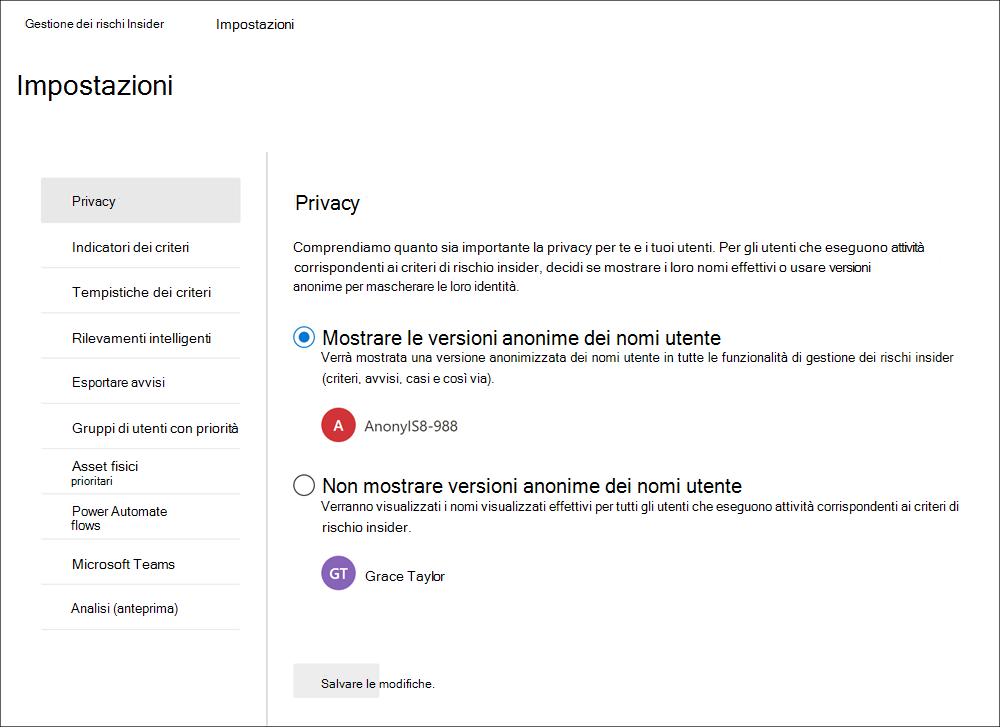

## IndicatoriIndicators

I modelli di criteri di rischio Insider definiscono il tipo di attività di rischio che si desidera rilevare e analizzare.Insider risk policy templates define the type of risk activities that you want to detect and investigate. Ogni modello di criteri si basa su indicatori specifici che corrispondono a trigger e attività di rischio specifici.Each policy template is based on specific indicators that correspond to specific triggers and risk activities. Tutti gli indicatori sono disabilitati per impostazione predefinita ed è necessario selezionare uno o più indicatori dei criteri prima di configurare un criterio di gestione dei rischi insider.All indicators are disabled by default, and you must select one or more policy indicators before configuring an insider risk management policy.

Gli avvisi vengono attivati dai criteri quando gli utenti eseguono attività correlate agli indicatori dei criteri che soddisfano una soglia necessaria.Alerts are triggered by policies when users perform activities related to policy indicators that meet a required threshold. La gestione dei rischi insider utilizza due tipi di indicatori:Insider risk management uses two types of indicators:

- **Triggering events**: Eventi che determinano se un utente è attivo in un criterio di gestione dei rischi insider.**Triggering events**: Events that determine if a user is active in an insider risk management policy. Se un utente viene aggiunto a un criterio di gestione dei rischi insider non dispone di un evento di attivazione, l'attività dell'utente non viene valutata dal criterio.If a user is added to an insider risk management policy does not have a triggering event, the user activity is not evaluated by the policy. Ad esempio, l'utente A viene  aggiunto a un criterio creato dal furto di dati allontanando il modello di criteri degli utenti e il criterio e il connettore risorse umane di Microsoft 365 sono configurati correttamente.For example, User A is added to a policy created from the *Data theft by departing users* policy template and the policy and Microsoft 365 HR connector are properly configured. Finché l'utente A non ha una data di terminazione segnalata dal connettore HR, le attività dell'utente A non vengono valutate da questo criterio di gestione dei rischi insider per i rischi.Until User A has a termination date reported by the HR connector, User A activities aren't evaluated by this insider risk management policy for risk. Un altro esempio di evento di attivazione è se un utente ha un *avviso* di criteri DLP di gravità elevata quando si utilizzano i criteri di *perdita di* dati.Another example of a triggering event is if a user has a *High* severity DLP policy alert when using *Data leaks* policies.
- **Indicatori dei criteri**: Indicatori inclusi nei criteri di gestione dei rischi insider utilizzati per determinare un punteggio di rischio per un utente nell'ambito.**Policy indicators**: Indicators included in insider risk management policies used to determine a risk score for an in-scope user. Questi indicatori di criteri vengono attivati solo dopo che si verifica un evento di attivazione per un utente.These policy indicators are only activated after a triggering event occurs for a user. Alcuni esempi di indicatori dei criteri sono quando un utente copia i dati nei servizi di archiviazione cloud personali o nei dispositivi di archiviazione portatili, se un account utente viene rimosso da Azure Active Directory o se un utente condivide file e cartelle interni con parti esterne non autorizzate.Some examples of policy indicators are when a user copies data to personal cloud storage services or portable storage devices, if a user account is removed from Azure Active Directory, or if a user shares internal files and folders with unauthorized external parties.

Gli indicatori dei criteri sono suddivisi nelle aree seguenti.Policy indicators are segmented into the following areas. Puoi scegliere gli indicatori per attivare e personalizzare i limiti degli eventi degli indicatori per ogni livello di indicatore quando crei un criterio di rischio insider:You can choose the indicators to activate and customize indicator event limits for each indicator level when creating an insider risk policy:

- **Indicatori di Office**: includono indicatori dei criteri per i siti di SharePoint, Microsoft Teams e la messaggistica di posta elettronica.**Office indicators**: These include policy indicators for SharePoint sites, Microsoft Teams, and email messaging.
- **Indicatori di dispositivo:** includono indicatori dei criteri per attività come la condivisione di file in rete o con dispositivi.**Device indicators**: These include policy indicators for activity such as sharing files over the network or with devices. Gli indicatori includono attività Microsoft Office file, file CSV (valori delimitati da virgole) e file PDF (formato di documento portatile).Indicators include activities involving Microsoft Office files, .csv (comma-separated values) files, and .pdf (portable document format) files. Se si **seleziona** Indicatori dispositivo , l'attività viene elaborata solo per i dispositivi con Windows 10 Build 1809 o versione successiva ed è necessario prima eseguire l'onboardboard dei dispositivi nel Centro conformità.If you select **Device indicators**, activity is processed only for devices with Windows 10 Build 1809 or higher and you must first onboard devices to the compliance center. Per altre informazioni sulla configurazione dei dispositivi per l'integrazione con i rischi insider, vedi la sezione Seguente Abilitare gli indicatori di dispositivo e i dispositivi [di onboarding](insider-risk-management-settings.md#OnboardDevices) in questo articolo.For more information on configuring devices for integration with insider risk, see the following [Enable device indicators and onboard devices](insider-risk-management-settings.md#OnboardDevices) section in this article.
- **Indicatore di violazione dei criteri** di sicurezza (anteprima): sono inclusi gli indicatori di Microsoft Defender for Endpoint correlati all'installazione di software non approvato o dannoso o all'esclusione dei controlli di sicurezza.**Security policy violation indicator (preview)**: These include indicators from Microsoft Defender for Endpoint related to unapproved or malicious software installation or bypassing security controls. Per ricevere avvisi nella gestione dei rischi insider, devi avere una licenza di Defender for Endpoint attiva e l'integrazione dei rischi insider abilitata.To receive alerts in insider risk management, you must have an active Defender for Endpoint license and insider risk integration enabled. Per altre informazioni sulla configurazione di Defender per Endpoint per l'integrazione della gestione dei rischi insider, vedi [Configurare le funzionalità avanzate in Microsoft Defender for Endpoint.](/windows/security/threat-protection/microsoft-defender-atp/advanced-features\#share-endpoint-alerts-with-microsoft-compliance-center)For more information on configuring Defender for Endpoint for insider risk management integration, see [Configure advanced features in Microsoft Defender for Endpoint](/windows/security/threat-protection/microsoft-defender-atp/advanced-features\#share-endpoint-alerts-with-microsoft-compliance-center).
- **Indicatori di accesso fisico (anteprima):** includono indicatori dei criteri per l'accesso fisico agli asset sensibili.**Physical access indicators (preview)**: These include policy indicators for physical access to sensitive assets. Ad esempio, i tentativi di accesso a un'area con restrizioni nei log di sistema di badging fisico possono essere condivisi con i criteri di gestione dei rischi insider.For example, attempted access to a restricted area in your physical badging system logs can be shared with insider risk management policies. Per ricevere questi tipi di avvisi nella gestione dei rischi insider, è necessario che gli asset fisici con priorità siano abilitati nella gestione dei rischi insider e che sia configurato il connettore dati di [badging](import-physical-badging-data.md) fisico.To receive these types of alerts in insider risk management, you must have priority physical assets enabled in insider risk management and the [Physical badging data connector](import-physical-badging-data.md) configured. Per ulteriori informazioni sulla configurazione dell'accesso fisico, vedere la sezione [Priorità di accesso fisico](#priority-physical-assets-preview) in questo articolo.To learn more about configuring physical access, see the [Priority physical access section](#priority-physical-assets-preview) in this article.
- **Indicatori di Microsoft Cloud App Security (anteprima):** includono gli indicatori dei criteri degli avvisi condivisi di Cloud App Security.**Microsoft Cloud App Security indicators (preview)**: These include policy indicators from shared alerts from Cloud App Security. Il rilevamento automatico delle anomalie in Cloud App Security inizia immediatamente a rilevare e raccogliere i risultati, individuando numerose anomalie comportamentali tra gli utenti e i computer e i dispositivi connessi alla rete.Automatically enabled anomaly detection in Cloud App Security immediately starts detecting and collating results, targeting numerous behavioral anomalies across your users and the machines and devices connected to your network. Per includere queste attività negli avvisi dei criteri di gestione dei rischi insider, selezionare uno o più indicatori in questa sezione.To include these activities in insider risk management policy alerts, select one or more indicators in this section. Per altre informazioni sull'analisi di Cloud App Security e sul rilevamento di anomalie, vedi Ottenere analisi comportamentali e [rilevamento di anomalie.](/cloud-app-security/anomaly-detection-policy)To learn more about Cloud App Security analytics and anomaly detection, see [Get behavioral analytics and anomaly detection](/cloud-app-security/anomaly-detection-policy).
- **Ripetitori del punteggio di rischio**: includono l'aumento del punteggio di rischio per attività insolite o violazioni dei criteri precedenti.**Risk score boosters**: These include raising the risk score for unusual activities or past policy violations. L'abilitazione dei ripetitori del punteggio di rischio aumenta i punteggi di rischio e la probabilità di avvisi per questi tipi di attività.Enabling risk score boosters increases risk scores and the likelihood of alerts for these types of activities. Per le attività insolite, i punteggi vengono aumentati se l'attività rilevata si discosta dal comportamento tipico dell'utente.For unusual activities, scores are boosted if the detected activity deviates from the user's typical behavior. Ad esempio, un aumento significativo dei download giornalieri di file.For example, a significant increase in daily file downloads. L'attività insolita viene presentata come un aumento percentuale (ad esempio, "100% rispetto all'attività normale") e inciderà in modo diverso sul punteggio di rischio a seconda dell'attività.Unusual activity is presented as an increase in percentage (for example, '100% above usual activity') and will impact the risk score differently depending on the activity. Per gli utenti con violazioni dei criteri precedenti, i punteggi vengono aumentati se un utente ha risolto più di un caso in precedenza come violazione dei criteri confermata.For users with previous policy violations, scores are boosted if a user had more than one case previously resolved as a confirmed policy violation. I ripetitori del punteggio di rischio possono essere selezionati solo se sono selezionati uno o più indicatori.Risk score boosters can only be selected if one or more indicators are selected.

In alcuni casi, è possibile limitare gli indicatori dei criteri di rischio insider applicati ai criteri di rischio insider nell'organizzazione.In some cases, you may want to limit the insider risk policy indicators that are applied to insider risk policies in your organization. Puoi disattivare gli indicatori dei criteri per aree specifiche disabilitandoli da tutti i criteri di rischio insider.You can turn off the policy indicators for specific areas by disabling them from all insider risk policies. Gli eventi di attivazione non possono essere modificati per i modelli di criteri di rischio insider.Triggering events cannot be modified for insider risk policy templates.

Per definire gli indicatori dei criteri di rischio insider abilitati in tutti i criteri di rischio insider, passare a **Impostazioni di** rischio Insider Indicatori e selezionare uno o più indicatori di  >   criteri.To define the insider risk policy indicators that are enabled in all insider risk policies, navigate to **Insider risk settings** > **Indicators** and select one or more policy indicators. Gli indicatori selezionati nella pagina Impostazioni indicatori non possono essere configurati singolarmente durante la creazione o la modifica di un criterio di rischio insider nella procedura guidata dei criteri.The indicators selected on the Indicators settings page cannot be individually configured when creating or editing an insider risk policy in the policy wizard.

>[!NOTE]
>La visualizzazione dei nuovi utenti aggiunti manualmente nel dashboard Utenti può richiedere **diverse ore.**It may take several hours for new manually-added users to appear in the **Users dashboard**. La visualizzazione delle attività per i 90 giorni precedenti per questi utenti può richiedere fino a 24 ore.Activities for the previous 90 days for these users may take up to 24 hours to display. Per visualizzare le attività per gli utenti aggiunti manualmente, selezionare l'utente nel **dashboard** Utenti e aprire la **scheda Attività** utente nel riquadro dei dettagli.To view activities for manually added users, select the user on the **Users dashboard** and open the **User activity** tab on the details pane.

### Abilitare gli indicatori di dispositivo e i dispositivi di onboardEnable device indicators and onboard devices

Per abilitare il monitoraggio delle attività di rischio nei dispositivi e includere indicatori dei criteri per queste attività, i dispositivi devono soddisfare i requisiti seguenti ed è necessario completare la procedura di onboarding seguente.To enable the monitoring of risk activities on devices and include policy indicators for these activities, your devices must meet the following requirements and you must complete the following onboarding steps.

#### Passaggio 1: Preparare gli endpointStep 1: Prepare your endpoints

Assicurati che i dispositivi Windows 10 che hai in programma di segnalare nella gestione dei rischi insider soddisfino questi requisiti.Make sure that the Windows 10 devices that you plan on reporting in insider risk management meet these requirements.

1. Deve eseguire Windows 10 x64 build 1809 o versione successiva e deve aver installato l'aggiornamento di [Windows 10 (OS Build 17763.1075)](https://support.microsoft.com/help/4537818/windows-10-update-kb4537818) dal 20 febbraio 2020.Must be running Windows 10 x64 build 1809 or later and must have installed the [Windows 10 update (OS Build 17763.1075)](https://support.microsoft.com/help/4537818/windows-10-update-kb4537818) from February 20, 2020.
2. Tutti i dispositivi devono essere [aggiunti ad Azure Active Directory (AAD)](/azure/active-directory/devices/concept-azure-ad-join) o aggiunto ad Azure AD ibrido.All devices must be [Azure Active Directory (AAD) joined](/azure/active-directory/devices/concept-azure-ad-join), or Hybrid Azure AD joined.
3. Installare il browser Microsoft Chromium Edge nel dispositivo endpoint per monitorare le azioni per l'attività di caricamento cloud.Install Microsoft Chromium Edge browser on the endpoint device to monitor actions for the cloud upload activity. Vedere [Scaricare il nuovo Microsoft Edge basato su Chromium](https://support.microsoft.com/help/4501095/download-the-new-microsoft-edge-based-on-chromium).See, [Download the new Microsoft Edge based on Chromium](https://support.microsoft.com/help/4501095/download-the-new-microsoft-edge-based-on-chromium).

#### Passaggio 2: Onboarding dei dispositiviStep 2: Onboarding devices

Devi abilitare il monitoraggio dei dispositivi e l'onboardboard degli endpoint prima di poter monitorare le attività di gestione dei rischi insider in un dispositivo.You must enable device monitoring and onboard your endpoints before you can monitor for insider risk management activities on a device. Entrambe le azioni vengono eseguite nel portale di conformità di Microsoft 365.Both actions are taken in the Microsoft 365 Compliance portal.

Quando vuoi eseguire l'onboarded dei dispositivi che non sono ancora stati onboarded, scaricherai lo script appropriato e distribuirai come descritto nei passaggi seguenti.When you want to onboard devices that haven't been onboarded yet, you'll download the appropriate script and deploy as outlined in the following steps.

Se i dispositivi sono già presenti in [Microsoft Defender per endpoint](/windows/security/threat-protection/), verranno visualizzati nell'elenco dei dispositivi gestiti.If you already have devices onboarded into [Microsoft Defender for Endpoint](/windows/security/threat-protection/), they will already appear in the managed devices list. Segui [passaggio 3: se hai dispositivi onboarded in Microsoft Defender for Endpoint](insider-risk-management-settings.md#OnboardStep3) nella sezione successiva.Follow [Step 3: If you have devices onboarded into Microsoft Defender for Endpoint](insider-risk-management-settings.md#OnboardStep3) in the next section.

In questo scenario di distribuzione eseguirai l'onboarded dei dispositivi che non sono stati ancora onboarded e vuoi solo monitorare le attività a rischio insider nei dispositivi Windows 10.In this deployment scenario, you'll onboard devices that have not been onboarded yet, and you just want to monitor insider risk activities on Windows 10 devices.

1. Aprire il [Centro conformità Microsoft](https://compliance.microsoft.com).Open the [Microsoft compliance center](https://compliance.microsoft.com).
2. Aprire la pagina delle impostazioni del Centro conformità e scegliere **Onboarding di dispositivi**.Open the Compliance Center settings page and choose **Onboard devices**.

   > [!NOTE]
   > Anche se in genere sono necessari circa 60 secondi perché l'onboarding dei dispositivi sia abilitato, attendere fino a 30 minuti prima di contattare il supporto tecnico Microsoft.While it usually takes about 60 seconds for device onboarding to be enabled, please allow up to 30 minutes before engaging with Microsoft support.

3. Scegliere **Gestione dispositivi** per aprire l'elenco **Dispositivi**.Choose **Device management** to open the **Devices** list. L'elenco sarà vuoto finché non si caricano dispositivi.The list will be empty until you onboard devices.
4. Scegliere **Onboarding** per avviare il processo di onboarding.Choose **Onboarding** to begin the onboarding process.
5. Scegli la modalità di distribuzione in questi altri dispositivi nell'elenco **Metodo di** distribuzione e quindi scarica **il pacchetto.**Choose the way you want to deploy to these more devices from the **Deployment method** list and then **download package**.
6. Seguire le procedure appropriate in [Strumenti e metodi di onboarding per i dispositivi Windows 10](/windows/security/threat-protection/microsoft-defender-atp/configure-endpoints).Follow the appropriate procedures in [Onboarding tools and methods for Windows 10 machines](/windows/security/threat-protection/microsoft-defender-atp/configure-endpoints). Questo collegamento porta a una pagina di destinazione in cui è possibile accedere alle procedure di Microsoft Defender per endpoint che corrispondono al pacchetto di distribuzione selezionato nel passaggio 5:This link takes you to a landing page where you can access Microsoft Defender for Endpoint procedures that match the deployment package you selected in step 5:
    - Onboarding di dispositivi Windows 10 con Criteri di gruppoOnboard Windows 10 machines using Group Policy
    - Onboarding di dispositivi Windows 10 con Microsoft Endpoint Configuration ManagerOnboard Windows machines using Microsoft Endpoint Configuration Manager
    - Onboarding di dispositivi Windows 10 con gli strumenti di Gestione dispositivi mobiliOnboard Windows 10 machines using Mobile Device Management tools
    - Onboarding di dispositivi Windows 10 con uno script localeOnboard Windows 10 machines using a local script
    - Onboarding di dispositivi VDI (Virtual Desktop Infrastructure) non persistenti.Onboard non-persistent virtual desktop infrastructure (VDI) machines.

Dopo aver eseguito l'onboarded dell'endpoint, dovrebbe essere visibile nell'elenco dei dispositivi e l'endpoint inizierà a segnalare i log delle attività di controllo alla gestione dei rischi insider.Once done and endpoint is onboarded, it should be visible in the devices list and the endpoint will start reporting audit activity logs to insider risk management.

> [!NOTE]
> Questa esperienza richiede la licenza.This experience is under license enforcement. Se non si ha la licenza necessaria, i dati non saranno visibili o accessibili.Without the required license, data will not be visible or accessible.

#### Passaggio 3: se i dispositivi sono stati onboarded in Microsoft Defender for EndpointStep 3: If you have devices onboarded into Microsoft Defender for Endpoint

Se Microsoft Defender for Endpoint è già distribuito e sono presenti report degli endpoint, tutti questi endpoint verranno visualizzati nell'elenco dei dispositivi gestiti.If Microsoft Defender for Endpoint is already deployed and there are endpoints reporting in, all these endpoints will appear in the managed devices list. Puoi continuare a eseguire l'onboarding di nuovi dispositivi nella gestione dei rischi insider per espandere la copertura usando la sezione [Passaggio 2: onboarding dei](insider-risk-management-settings.md#OnboardStep2) dispositivi.You can continue to onboard new devices into insider risk management to expand coverage by using the [Step 2: Onboarding devices](insider-risk-management-settings.md#OnboardStep2) section.

1. Aprire il [Centro conformità Microsoft](https://compliance.microsoft.com).Open the [Microsoft compliance center](https://compliance.microsoft.com).
2. Aprire la pagina delle impostazioni del Centro conformità e scegliere **Abilita monitoraggio dispositivi**.Open the Compliance Center settings page and choose **Enable device monitoring**.
3. Scegliere **Gestione dispositivi** per aprire l'elenco **Dispositivi**.Choose **Device management** to open the **Devices** list. Dovrebbe essere visualizzato l'elenco dei dispositivi che stanno già segnalando in Microsoft Defender per Endpoint.You should see the list of devices that are already reporting into Microsoft Defender for Endpoint.
4. Scegli **Onboarding** se devi eseguire l'onboarding di più dispositivi.Choose **Onboarding** if you need to onboard more devices.
5. Scegli la modalità di distribuzione in questi altri dispositivi nell'elenco **Metodo di** distribuzione e quindi **scarica pacchetto.**Choose the way you want to deploy to these more devices from the **Deployment method** list and then **Download package**.
6. Seguire le procedure appropriate in [Strumenti e metodi di onboarding per i dispositivi Windows 10](/windows/security/threat-protection/microsoft-defender-atp/configure-endpoints).Follow the appropriate procedures in [Onboarding tools and methods for Windows 10 machines](/windows/security/threat-protection/microsoft-defender-atp/configure-endpoints). Questo collegamento porta a una pagina di destinazione in cui è possibile accedere alle procedure di Microsoft Defender per endpoint che corrispondono al pacchetto di distribuzione selezionato nel passaggio 5:This link takes you to a landing page where you can access Microsoft Defender for Endpoint procedures that match the deployment package you selected in step 5:
    - Onboarding di dispositivi Windows 10 con Criteri di gruppoOnboard Windows 10 machines using Group Policy
    - Onboarding di dispositivi Windows 10 con Microsoft Endpoint Configuration ManagerOnboard Windows machines using Microsoft Endpoint Configuration Manager
    - Onboarding di dispositivi Windows 10 con gli strumenti di Gestione dispositivi mobiliOnboard Windows 10 machines using Mobile Device Management tools
    - Onboarding di dispositivi Windows 10 con uno script localeOnboard Windows 10 machines using a local script
    - Onboarding di dispositivi VDI (Virtual Desktop Infrastructure) non persistenti.Onboard non-persistent virtual desktop infrastructure (VDI) machines.

Dopo aver eseguito l'onboarded dell'endpoint, dovrebbe essere visibile nella tabella Dispositivi e l'endpoint inizierà a segnalare i log delle attività di controllo alla gestione dei rischi insider. Once done and endpoint is onboarded, it should be visible under the **Devices** table and the endpoint will start reporting audit activity logs to insider risk management.

> [!NOTE]
>Questa esperienza richiede la licenza.This experience is under license enforcement. Se non si ha la licenza necessaria, i dati non saranno visibili o accessibili.Without the required license, data will not be visible or accessible.

### Impostazioni livello indicatore (anteprima)Indicator level settings (preview)

Quando si crea un criterio nella procedura guidata dei criteri, è possibile configurare il modo in cui il numero giornaliero di eventi di rischio deve influenzare il punteggio di rischio per gli avvisi di rischio insider.When creating a policy in the policy wizard, you can configure how the daily number of risk events should influence the risk score for insider risk alerts. Queste impostazioni degli indicatori consentono di controllare il modo in cui il numero di occorrenze di eventi di rischio nell'organizzazione deve influire sul punteggio di rischio e quindi sulla gravità dell'avviso associata per questi eventi.These indicator settings help you control how the number of occurrences of risk events in your organization should affect the risk score, and so the associated alert severity, for these events. Se preferisci, puoi anche scegliere di mantenere i livelli di soglia degli eventi predefiniti consigliati da Microsoft per tutti gli indicatori abilitati.If you prefer, you can also choose to keep the default event threshold levels recommended by Microsoft for all enabled indicators.

Ad esempio, si decide di abilitare gli indicatori di SharePoint nelle impostazioni dei criteri di rischio insider e di impostare soglie personalizzate per gli eventi di SharePoint quando si configurano gli indicatori per un nuovo rischio insider Criteri di fuga *di* dati.For example, you decide to enable SharePoint indicators in the insider risk policy settings and to set custom thresholds for SharePoint events when configuring indicators for a new insider risk *Data leaks* policy. Durante la procedura guidata dei criteri di rischio insider, si configurano tre diversi livelli di eventi giornalieri per ogni indicatore di SharePoint per influenzare il punteggio di rischio per gli avvisi associati a questi eventi.While in the insider risk policy wizard, you configure three different daily event levels for each SharePoint indicator to influence the risk score for alerts associated with these events.

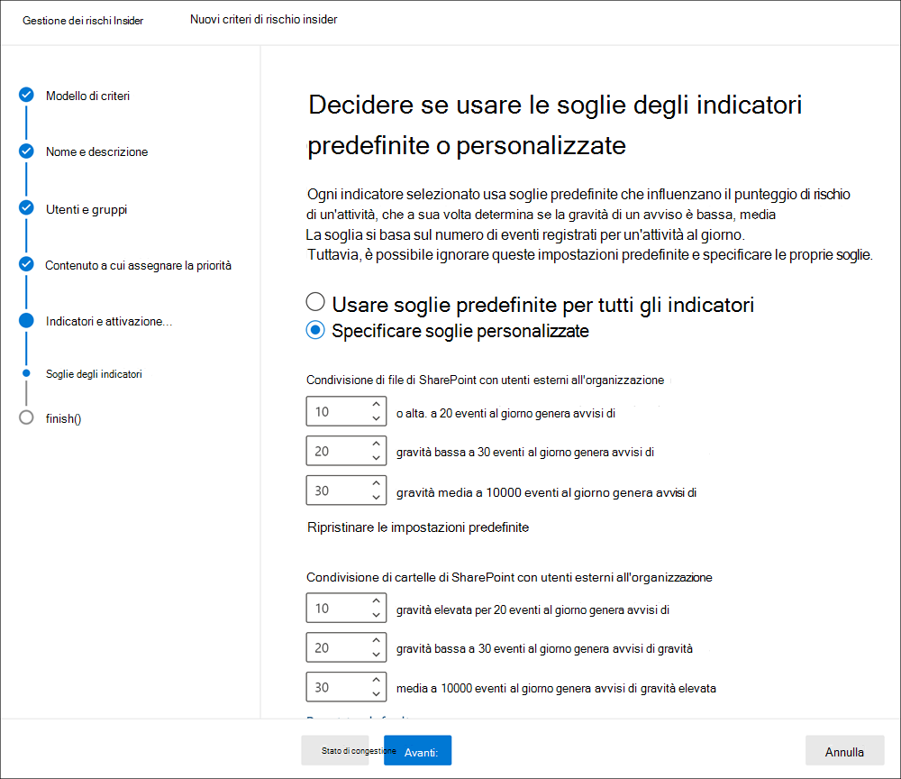

Per il primo livello di evento giornaliero, si imposta la soglia su *10* o più eventi al giorno per un impatto minore sul punteggio di rischio per gli eventi, *su 20* o più eventi al giorno per un impatto medio sul punteggio di rischio per gli eventi e *su 30* o più eventi al giorno un impatto maggiore sul punteggio di rischio per gli eventi.For the first daily event level, you set the threshold at *10 or more events per day* for a lower impact to the risk score for the events, *20 or more events per day* for a medium impact to the risk score for the events, and *30 or more events per day* a higher impact to the risk score for the events. Queste impostazioni in modo efficace significano:These settings effectively mean:

- Se sono presenti da 1 a 9 eventi di SharePoint che si verificano dopo l'attivazione dell'evento, i punteggi dei rischi hanno un impatto minimo e tendono a non generare un avviso.If there are 1-9 SharePoint events that take place after triggering event, risk scores are minimally impacted and would tend not to generate an alert.
- Se sono presenti 10-19 eventi di SharePoint che si verificano dopo un evento di attivazione, il punteggio di rischio è intrinsecamente inferiore e i livelli di gravità degli avvisi tendono a essere a un livello basso.If there are 10-19  SharePoint events that take place after a triggering event, the risk score is inherently lower and alert severity levels would tend to be at a low level.
- Se sono presenti 20-29 eventi di SharePoint che si verificano dopo un'attivazione, il punteggio di rischio è intrinsecamente superiore e i livelli di gravità degli avvisi tendono a essere di livello medio.If there are 20-29 SharePoint events that take place after a triggering, the risk score is inherently higher and alert severity levels would tend to be at a medium level.
- Se sono presenti 30 o più eventi di SharePoint che si verificano dopo un'attivazione, il punteggio di rischio è intrinsecamente superiore e i livelli di gravità degli avvisi tendono a essere di alto livello.If there are 30 or more SharePoint events that take place after a triggering, the risk score is inherently higher and alert severity levels would tend to be at a high level.

## Tempistiche dei criteriPolicy timeframes

I periodi di tempo dei criteri consentono di definire i periodi di revisione passati e futuri che vengono attivati dopo le corrispondenze dei criteri in base a eventi e attività per i modelli di criteri di gestione dei rischi insider.Policy timeframes allow you to define past and future review periods that are triggered after policy matches based on events and activities for the insider risk management policy templates. A seconda del modello di criteri scelto, sono disponibili i seguenti tempi per i criteri:Depending on the policy template you choose, the following policy timeframes are available:

- **Finestra di** attivazione: disponibile per  tutti i modelli di criteri, la finestra Attivazione è il numero definito di giorni che la finestra viene attivata dopo **un** evento di attivazione.**Activation window**: Available for all policy templates, the *Activation window* is the defined number of days that the window activates **after** a triggering event. La finestra viene attivata da 1 a 30 giorni dopo che si verifica un evento di attivazione per qualsiasi utente assegnato al criterio.The window activates for 1 to 30 days after a triggering event occurs for any user assigned to the policy. Ad esempio, hai configurato un criterio di gestione dei rischi insider e hai impostato la *finestra di attivazione* su 30 giorni.For example, you've configured an insider risk management policy and set the *Activation window* to 30 days. Sono trascorsi diversi mesi dalla configurazione del criterio e si verifica un evento di attivazione per uno degli utenti inclusi nel criterio.Several months have passed since you configured the policy, and a triggering event occurs for one of the users included in the policy. L'evento di attivazione attiva la *finestra di* attivazione e il criterio è attivo per tale utente per 30 giorni dopo l'evento di attivazione.The triggering event activates the *Activation window* and the policy is active for that user for 30 days after the triggering event occurred.
- **Rilevamento attività passate**: Disponibile per  tutti i modelli di criteri, il rilevamento delle attività passate è il numero definito di giorni in cui la finestra viene attivata **prima** di un evento di attivazione.**Past activity detection**: Available for all policy templates, the *Past activity detection* is the defined number of days that the window activates **before** a triggering event. La finestra viene attivata da 0 a 180 giorni prima che si verifichi un evento di attivazione per qualsiasi utente assegnato al criterio.The window activates for 0 to 180 days before a triggering event occurs for any user assigned to the policy. Ad esempio, hai configurato un criterio di gestione dei rischi insider e hai impostato *il rilevamento delle* attività passate su 90 giorni.For example, you've configured an insider risk management policy and set the *Past activity detection* to 90 days. Sono trascorsi diversi mesi dalla configurazione del criterio e si verifica un evento di attivazione per uno degli utenti inclusi nel criterio.Several months have passed since you configured the policy, and a triggering event occurs for one of the users included in the policy. L'evento di attivazione  attiva il rilevamento delle attività passate e il criterio raccoglie le attività storiche per tale utente per 90 giorni prima dell'evento di attivazione.The triggering event activates the *Past activity detection* and the policy gathers historic activities for that user for 90 days prior to the triggering event.

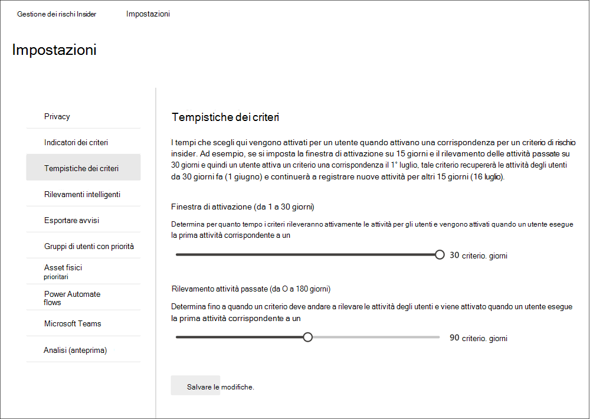

## Rilevamenti intelligentiIntelligent detections

Le impostazioni di rilevamento intelligente consentono di perfezionare il modo in cui i rilevamenti di attività rischiose vengono elaborati per gli avvisi.Intelligent detection settings help refine how the detections of risky activities are processed for alerts. In alcuni casi, potrebbe essere necessario definire i tipi di file da ignorare oppure applicare un livello di rilevamento per i file per definire una barra minima per gli avvisi.In certain circumstances, you may need to define file types to ignore, or you want to enforce a detection level for files to help define a minimum bar for alerts. Usa queste impostazioni per controllare il volume complessivo degli avvisi, le esclusioni dei tipi di file e i limiti del volume di file.Use these settings to control overall alert volume, file type exclusions, and file volume limits.

### Esclusioni di tipi di fileFile type exclusions

Per escludere tipi di file specifici da tutti i criteri di gestione dei rischi insider, immettere le estensioni dei tipi di file separate da virgole.To exclude specific file types from all insider risk management policy matching, enter file type extensions separated by commas. Ad esempio, per escludere determinati tipi di file musicali dalle corrispondenze dei criteri, è possibile immettere aac,mp3,wav,wma nel **campo Esclusioni tipi di** file.For example, to exclude certain types of music files from policy matches you may enter aac,mp3,wav,wma in the **File type exclusions** field. I file con queste estensioni verranno ignorati da tutti i criteri di gestione dei rischi insider.Files with these extensions will be ignored by all insider risk management policies.

### Soglia per attività insolite nei fileThreshold for unusual file activity

Per definire un livello minimo di file prima che gli avvisi attività siano riportati nei criteri di rischio insider, immettere il numero di file.To define a minimum file level before activity alerts are reported in insider risk policies, enter the number of files. Ad esempio, immettere "10" se non si desidera generare avvisi di rischio insider quando un utente scarica 10 file o meno, anche se i criteri considerano questa attività insolita.For example, you would enter '10' if you do not want to generate insider risk alerts when a user downloads 10 files or less, even if the policies consider this activity as unusual.

### Volume avvisoAlert volume

Alle attività degli utenti rilevate dai criteri di rischio insider viene assegnato un punteggio di rischio specifico, che a sua volta determina la gravità dell'avviso (bassa, media, alta).User activities detected by insider risk policies are assigned a specific risk score, which in turn determines the alert severity (low, medium, high). Per impostazione predefinita, verrà generata una determinata quantità di avvisi di gravità bassa, media e alta, ma è possibile aumentare o ridurre il volume in base alle proprie esigenze.By default, we'll generate a certain amount of low, medium, and high severity alerts, but you can increase or decrease the volume to suit your needs. Per modificare il volume di avvisi per tutti i criteri di gestione dei rischi insider, scegliere una delle impostazioni seguenti:To adjust the volume of alerts for all insider risk management policies, choose one of the following settings:

- **Meno avvisi:** verranno visualizzati tutti gli avvisi di gravità elevata, meno avvisi di gravità media e nessun avviso di gravità bassa.**Fewer alerts**: You'll see all high severity alerts, fewer medium severity alerts, and no low severity ones. Questo livello di impostazione significa che potresti perdere alcuni veri positivi.This setting level means you might miss some true positives.
- **Volume predefinito:** verranno visualizzati tutti gli avvisi di gravità elevata e una quantità bilanciata di avvisi di gravità media e bassa.**Default volume**: You'll see all high severity alerts and a balanced amount of medium and low severity alerts.
- **Altri avvisi:** verranno visualizzati tutti gli avvisi di gravità medio e alto e la maggior parte degli avvisi di gravità bassa.**More alerts**: You'll see all medium and high severity alerts and most low severity alerts. Questo livello di impostazione potrebbe causare più falsi positivi.This setting level might result in more false positives.

### Microsoft Defender for Endpoint (anteprima)Microsoft Defender for Endpoint (preview)

[Microsoft Defender for Endpoint è](/windows/security/threat-protection/microsoft-defender-atp/microsoft-defender-advanced-threat-protection) una piattaforma di sicurezza degli endpoint aziendale progettata per aiutare le reti aziendali a prevenire, rilevare, analizzare e rispondere alle minacce avanzate.[Microsoft Defender for Endpoint](/windows/security/threat-protection/microsoft-defender-atp/microsoft-defender-advanced-threat-protection) is an enterprise endpoint security platform designed to help enterprise networks prevent, detect, investigate, and respond to advanced threats. Per avere una migliore visibilità delle violazioni della sicurezza nell'organizzazione, puoi importare e filtrare Defender per gli avvisi endpoint per le attività utilizzate nei criteri creati dai modelli di criteri di violazione della sicurezza per la gestione dei rischi insider.To have better visibility of security violations in your organization, you can import and filter Defender for Endpoint alerts for activities used in policies created from insider risk management security violation policy templates.

A seconda dei tipi di segnali che ti interessano, puoi scegliere di importare gli avvisi nella gestione dei rischi insider in base allo stato di valutazione degli avvisi defender per endpoint.Depending on the types of signals you are interested in, you can choose to import alerts to insider risk management based on the Defender for Endpoint alert triage status. È possibile definire uno o più degli stati di triage degli avvisi seguenti nelle impostazioni globali da importare:You can define one or more of the following alert triage statuses in the global settings to import:

- UnknownUnknown
- NuovaNew
- In corsoIn progress
- RisoltiResolved

Gli avvisi di Defender per Endpoint vengono importati ogni giorno.Alerts from Defender for Endpoint are imported daily. A seconda dello stato di triage scelto, potresti visualizzare più attività utente per lo stesso avviso in cui lo stato della triage cambia in Defender for Endpoint.Depending on the triage status you choose, you may see multiple user activities for the same alert as the triage status changes in Defender for Endpoint.

Ad esempio, se si seleziona *Nuovo,* *In* corso e Risolto per questa impostazione, quando viene generato un avviso di Microsoft Defender per endpoint e lo stato è *Nuovo*, viene importata un'attività di avviso iniziale per l'utente a rischio insider. For example, if you select *New*, *In progress*, and *Resolved* for this setting, when a Microsoft Defender for Endpoint alert is generated and the status is *New*, an initial alert activity is imported for the user in insider risk. Quando lo stato di valutazione di Defender for Endpoint viene modificato *in In* corso, viene importata una seconda attività per questo avviso per l'utente a rischio insider.When the Defender for Endpoint triage status changes to *In progress*, a second activity for this alert is imported for the user in insider risk. Quando lo stato finale di valutazione defender per endpoint è impostato su *Risolto,* viene importata una terza attività per questo avviso per l'utente a rischio insider.When the final Defender for Endpoint triage status of *Resolved* is set, a third activity for this alert is imported for the user in insider risk. Questa funzionalità consente agli investigatori di seguire la progressione degli avvisi di Defender for Endpoint e di scegliere il livello di visibilità richiesto dall'indagine.This functionality allows investigators to follow the progression of the Defender for Endpoint alerts and choose the level of visibility that their investigation requires.

>[!IMPORTANT]
>Dovrai configurare Microsoft Defender for Endpoint nell'organizzazione e abilitare Defender for Endpoint per l'integrazione della gestione dei rischi insider nel Defender Security Center per importare gli avvisi di violazione della sicurezza.You'll need to have Microsoft Defender for Endpoint configured in your organization and enable Defender for Endpoint for insider risk management integration in the Defender Security Center to import security violation alerts. Per altre informazioni sulla configurazione di Defender per Endpoint per l'integrazione della gestione dei rischi insider, vedi [Configurare le funzionalità avanzate in Defender for Endpoint.](/windows/security/threat-protection/microsoft-defender-atp/advanced-features\#share-endpoint-alerts-with-microsoft-compliance-center)For more information on configuring Defender for Endpoint for insider risk management integration, see [Configure advanced features in Defender for Endpoint](/windows/security/threat-protection/microsoft-defender-atp/advanced-features\#share-endpoint-alerts-with-microsoft-compliance-center).

### Domini (anteprima)Domains (preview)

Le impostazioni del dominio consentono di definire i livelli di rischio per le attività in domini specifici.Domain settings help you define risk levels for activities to specific domains. Queste attività includono la condivisione di file, l'invio di messaggi di posta elettronica, il download o il caricamento di contenuto.These activities include sharing files, sending email messages, downloading, or uploading content. Specificando i domini in queste impostazioni, è possibile aumentare o ridurre il punteggio di rischio per l'attività che si svolge con questi domini.By specifying domains in these settings, you can increase or decrease the risk scoring for activity that takes place with these domains.

Utilizzare Aggiungi dominio per definire un dominio per ognuna delle impostazioni di dominio.Use Add domain to define a domain for each of the domain settings. È inoltre possibile utilizzare i caratteri jolly per soddisfare le varianti dei domini radice o dei sottodomini.Additionally, you can use wildcards to help match variations of root domains or subdomains. Ad esempio, per specificare sales.wingtiptoys.com e support.wingtiptoys.com, utilizzare la voce con caratteri jolly '\*.wingtiptoys.com' per associare questi sottodomini (e qualsiasi altro sottodominio allo stesso livello).For example, to specify sales.wingtiptoys.com and support.wingtiptoys.com, you use the wildcard entry '\*.wingtiptoys.com' to match these subdomains (and any other subdomain at the same level). Per specificare sottodomini a più livelli per un dominio radice, è necessario selezionare la casella di controllo Includi **sottodomini** a più livelli.To specify multi-level subdomains for a root domain, you must select the **Include Multi-Level Subdomains** checkbox.

Per ognuna delle seguenti impostazioni di dominio, è possibile immettere fino a 500 domini:For each of the following domain settings, you can enter up to 500 domains:

- **Domini non consentiti:** Se si specificano domini non consentiti, l'attività che si svolge con questi domini avrà *punteggi di* rischio più elevati.**Unallowed domains:** By specifying unallowed domains, activity that takes place with these domains will have *higher* risk scores. Alcuni esempi sono le attività che implicano la condivisione di contenuto con qualcuno (ad esempio l'invio di posta elettronica a un utente con un indirizzo gmail.com) e quando gli utenti scaricano contenuto in un dispositivo da uno di questi domini non consentiti.Some examples are activities involving sharing content with someone (such as sending email to someone with a gmail.com address) and when users download content to a device from one of these unallowed domains.
- **Domini consentiti:** Alcune attività correlate ai domini consentiti verranno ignorate dai criteri e non genereranno avvisi.**Allowed domains:** Certain activity related to allowed domains will be ignored by your policies and won't generate alerts. Queste attività includono:These activities include:

    - Posta elettronica inviata a domini esterniEmail sent to external domains
    - File, cartelle, siti condivisi con domini esterniFiles, folders, sites shared with external domains
    - File caricati in domini esterni (con il browser Microsoft Edge)Files uploaded to external domains (using Microsoft Edge browser)

    Specificando i domini consentiti nelle impostazioni, questa attività con questi domini viene trattata in modo analogo a come viene trattata l'attività interna dell'organizzazione.By specifying allowed domains in settings, this activity with these domains is treated similarly to how internal organization activity is treated. Ad esempio, i domini aggiunti qui e mappano le attività possono implicare la condivisione di contenuto con un utente esterno all'organizzazione (ad esempio l'invio di posta elettronica a un utente con un indirizzo gmail.com).For example, domains added here map to activities may involve sharing content with someone outside your organization (such as sending email to someone with a gmail.com address).

- **Domini di terze parti:** Se l'organizzazione usa domini di terze parti per scopi aziendali (ad esempio l'archiviazione cloud), includerli qui in modo da poter ricevere avvisi per le attività correlate all'indicatore di dispositivo Utilizzare un browser per scaricare contenuto da un sito di terze *parti.***Third party domains:** If your organization uses third-party domains for business purposes (such as cloud storage), include them here so you can receive alerts for activity related to the device indicator *Use a browser to download content from a third-party site*.

## Esportare avvisi (anteprima)Export alerts (preview)

Le informazioni sugli avvisi per la gestione dei rischi insider sono esportabili nei servizi siem (Security Information and Event Management) tramite lo schema dell'API di attività di gestione di [Office 365](/office/office-365-management-api/office-365-management-activity-api-schema#security-and-compliance-alerts-schema).Insider risk management alert information is exportable to security information and event management (SIEM) services via the [Office 365 Management Activity API schema](/office/office-365-management-api/office-365-management-activity-api-schema#security-and-compliance-alerts-schema). È possibile utilizzare le API delle attività di gestione di Office 365 per esportare le informazioni sugli avvisi in altre applicazioni che l'organizzazione può usare per gestire o aggregare le informazioni sui rischi insider.You can use the Office 365 Management Activity APIs to export alert information to other applications your organization may use to manage or aggregate insider risk information.

Per usare le API per esaminare le informazioni sugli avvisi per i rischi insider:To use the APIs to review insider risk alert information:

1. Abilitare il supporto dell'API attività di gestione di Office 365 in Impostazioni di gestione dei rischi **Insider**  >    >  **Esportare avvisi**.Enable Office 365 Management Activity API support in **Insider risk management** > **Settings** > **Export alerts**. Per impostazione predefinita, questa impostazione è disabilitata per l'organizzazione di Microsoft 365.By default, this setting is disabled for your Microsoft 365 organization.
2. Filtrare le attività di controllo comuni di Office 365 *in base a SecurityComplianceAlerts.*Filter the common Office 365 audit activities by *SecurityComplianceAlerts*.
3. Filtra *SecurityComplianceAlerts in* base alla *categoria InsiderRiskManagement.*Filter *SecurityComplianceAlerts* by the *InsiderRiskManagement* category.

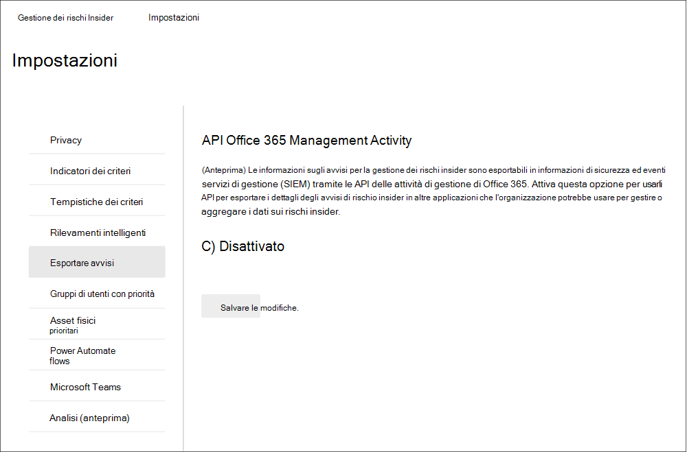

Le informazioni sugli avvisi contengono informazioni dello schema degli avvisi di sicurezza e conformità e dello schema comune dell'API di gestione di Office 365.Alert information contains information from the security and compliance alert schema and the Office 365 Management Activity API common schema.

I campi e i valori seguenti vengono esportati per gli avvisi di gestione dei rischi insider per lo schema di avviso sicurezza & conformità:The following fields and values are exported for insider risk management alerts for the Security & Compliance alert schema:

| **Parametro Alert****Alert parameter** | **Descrizione****Description** |
|:------------------|:----------------|
| AlertTypeAlertType | Il tipo dell'avviso è *Personalizzato.*Type of the alert is *Custom*.  |
| AlertIdAlertId | GUID dell'avviso.The GUID of the alert. Gli avvisi per la gestione dei rischi insider sono modificabili.Insider risk management alerts are mutable. Quando lo stato dell'avviso cambia, viene generato un nuovo registro con lo stesso AlertID.As alert status changes, a new log with the same AlertID is generated. Questo AlertID può essere usato per correlare gli aggiornamenti per un avviso.This AlertID can be used to correlate updates for an alert. |
| CategoryCategory | La categoria dell'avviso è *InsiderRiskManagement.*The category of the alert is *InsiderRiskManagement*. Questa categoria può essere usata per distinguere questi avvisi da altri avvisi di sicurezza & conformità.This category can be used to distinguish from these alerts from other Security & Compliance alerts. |
| CommentiComments | Commenti predefiniti per l'avviso.Default comments for the alert. I valori *sono Nuovo avviso* (registrato quando viene creato un avviso) e Avviso *aggiornato* (registrato quando è presente un aggiornamento di un avviso).Values are *New Alert* (logged when an alert is created) and *Alert Updated* (logged when there is an update to an alert). Utilizzare AlertID per correlare gli aggiornamenti per un avviso.Use the AlertID to correlate updates for an alert. |
| DatiData | I dati dell'avviso includono l'ID utente univoco, il nome dell'entità utente e la data e l'ora (UTC) quando l'utente è stato attivato in un criterio.The data for the alert, includes the unique user ID, user principal name, and date and time (UTC) when user was triggered into a policy. |
| NomeName | Nome dei criteri per i criteri di gestione dei rischi insider che hanno generato l'avviso.Policy name for insider risk management policy that generated the alert. |
| PolicyIdPolicyId | GUID del criterio di gestione dei rischi insider che ha attivato l'avviso.The GUID of the insider risk management policy that triggered the alert. |
| GravitàSeverity | Gravità dell'avviso.The severity of the alert. I valori *sono High,* *Medium* o *Low.*Values are *High*, *Medium*, or *Low*. |
| OrigineSource | Origine dell'avviso.The source of the alert. Il valore è *Office 365 Security & Compliance.*The value is *Office 365 Security & Compliance*. |
| StatoStatus | Stato dell'avviso.The status of the alert. I valori *sono Active* (*Needs Review* in insider risk), *Investigating* (*Confirmed* in insider risk), *Resolved* (*Resolved* in insider risk), *Dismissed* (*Dismissed* in insider risk).Values are *Active* (*Needs Review* in insider risk), *Investigating* (*Confirmed* in insider risk), *Resolved* (*Resolved* in insider risk), *Dismissed* (*Dismissed* in insider risk). |
| VersionVersion | Versione dello schema di avviso di sicurezza e conformità.The version of the security and compliance alert schema. |

I campi e i valori seguenti vengono esportati per gli avvisi di gestione dei rischi insider per lo schema comune dell'API di gestione di [Office 365.](/office/office-365-management-api/office-365-management-activity-api-schema#common-schema)The following fields and values are exported for insider risk management alerts for the [Office 365 Management Activity API common schema](/office/office-365-management-api/office-365-management-activity-api-schema#common-schema).

- UserIdUserId
- IdId
- RecordTypeRecordType
- CreationTimeCreationTime
- OperazioneOperation
- OrganizationIdOrganizationId
- UserTypeUserType
- UserKeyUserKey

## Gruppi di utenti con priorità (anteprima)Priority user groups (preview)

Gli utenti dell'organizzazione possono avere livelli di rischio diversi a seconda della posizione, del livello di accesso alle informazioni riservate o della cronologia dei rischi.Users in your organization may have different levels of risk depending on their position, level of access to sensitive information, or risk history. L'assegnazione delle priorità all'esame e al punteggio delle attività di questi utenti può aiutare a avvisare l'utente in caso di potenziali rischi che potrebbero avere conseguenze più elevate per l'organizzazione.Prioritizing the examination and scoring of the activities of these users can help alert you to potential risks that may have higher consequences for your organization. I gruppi di utenti con priorità nella gestione dei rischi insider consentono di definire gli utenti dell'organizzazione che necessitano di un'ispezione più stretta e di un punteggio di rischio più sensibile.Priority user groups in insider risk management help define the users in your organization that need closer inspection and more sensitive risk scoring. Insieme alle  violazioni dei criteri di  sicurezza da parte degli utenti con priorità e alle perdite di dati da parte dei modelli di criteri degli utenti con priorità, gli utenti aggiunti a un gruppo di utenti con priorità hanno una maggiore probabilità di avvisi di rischio insider e avvisi con livelli di gravità più elevati.Coupled with the *Security policy violations by priority users* and *Data leaks by priority users* policy templates, users added to a priority user group have an increased likelihood of insider risk alerts and alerts with higher severity levels.

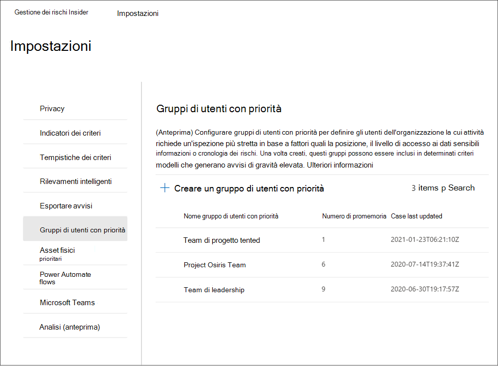

Ad esempio, è necessario proteggere da perdite di dati per un progetto estremamente riservato in cui gli utenti hanno accesso alle informazioni riservate.For example, you need to protect against data leaks for a highly confidential project where users have access to sensitive information. Si sceglie di creare *un gruppo di* utenti *con* priorità Utenti di progetto riservati per gli utenti dell'organizzazione che lavorano a questo progetto.You choose to create *Confidential Project* *Users* priority user group for users in your organization that work on this project. Utilizzando la procedura  guidata dei criteri e il modello di criteri Perdite di dati per utenti con priorità, è possibile creare un nuovo criterio e assegnare il gruppo utenti con priorità Utenti di *Project* riservati al criterio.Using the policy wizard and the *Data leaks by priority users* policy template, you create a new policy and assign the *Confidential Project Users* priority users group to the policy. Le attività esaminate dal criterio per i membri del gruppo di utenti con priorità Utenti di *progetto* riservati sono più sensibili ai rischi e le attività di questi utenti saranno più propense a generare un avviso e a ricevere avvisi con livelli di gravità più elevati.Activities examined by the policy for members of the *Confidential Project Users* priority user group are more sensitive to risk and activities by these users will be more likely to generate an alert and have alerts with higher severity levels.

### Creare un gruppo di utenti con prioritàCreate a priority user group

Per creare un nuovo gruppo di utenti con priorità, si utilizzerà l'impostazione dei controlli nella soluzione di gestione dei rischi **Insider** nel Centro conformità Microsoft 365.To create a new priority user group, you'll use setting controls in the **Insider risk management** solution in the Microsoft 365 compliance center. Per creare un gruppo di utenti con priorità, è necessario essere membri del gruppo di ruoli *Insider Risk Management* o Insider Risk Management *Admin.*To create a priority user group, you must be a member of the *Insider Risk Management* or *Insider Risk Management Admin* role group.

Completare la procedura seguente per creare un gruppo di utenti con priorità:Complete the following steps to create a priority user group:

1. Nel Centro [conformità Microsoft 365](https://compliance.microsoft.com)passare a Gestione dei rischi **Insider** e selezionare Impostazioni **rischio Insider.**In the [Microsoft 365 compliance center](https://compliance.microsoft.com), go to **Insider risk management** and select **Insider risk settings**.
2. Selezionare la **scheda Priorità gruppi di** utentiSelect the **Priority user groups** tab
3. Nella scheda **Gruppi di utenti con priorità** selezionare Crea gruppo di utenti con priorità **per** avviare la creazione guidata del gruppo.On the **Priority user groups** tab, select **Create priority user group** to start the group creation wizard.
4. Nella pagina **Definisci gruppo** completare i campi seguenti:On the **Define group** page, complete the following fields:
    - **Nome (obbligatorio):** immettere un nome descrittivo per il gruppo di utenti con priorità.**Name (required)**: Enter a friendly name for the priority user group. Non è possibile modificare il nome del gruppo di utenti con priorità dopo aver completato la procedura guidata.You can't change the name of the priority user group after you complete the wizard.
    - **Descrizione (facoltativo):** immettere una descrizione per il gruppo di utenti con priorità.**Description (optional)**: Enter a description for the priority user group.
5. Selezionare **Avanti** per continuare.Select **Next** to continue.
6. Nella pagina **Scegli** membri  selezionare Scegliere i membri da cercare e selezionare gli account  utente abilitati alla posta elettronica inclusi nel gruppo oppure selezionare la casella di controllo Seleziona tutto per aggiungere al gruppo tutti gli utenti dell'organizzazione.On the **Choose members** page, select **Choose members** to search and select which mail-enabled user accounts are included in the group or select the **Select all** checkbox to add all users in your organization to the group. Selezionare **Aggiungi** per continuare o **Annulla** per chiudere senza aggiungere utenti al gruppo.Select **Add** to continue or **Cancel** to close without adding any users to the group.
7. Selezionare **Avanti** per continuare.Select **Next** to continue.
8. Nella pagina **Revisione** esaminare le impostazioni scelte per il gruppo di utenti con priorità.On the **Review** page, review the settings you've chosen for the priority user group. Selezionare **Modifica** per modificare uno qualsiasi dei valori del gruppo oppure selezionare **Invia** per creare e attivare il gruppo di utenti con priorità.Select **Edit** to change any of the group values or select **Submit** to create and activate the priority user group.
9. Nella pagina di conferma, selezionare **Fatto per** uscire dalla procedura guidata.On the confirmation page, select **Done** to exit the wizard.

### Aggiornare un gruppo di utenti con prioritàUpdate a priority user group

Per aggiornare un gruppo di utenti con priorità esistente, si utilizzerà l'impostazione dei controlli nella soluzione di gestione dei rischi **Insider** nel Centro conformità Microsoft 365.To update an existing priority user group, you'll use setting controls in the **Insider risk management** solution in the Microsoft 365 compliance center. Per aggiornare un gruppo di utenti con priorità, è necessario essere membri del gruppo di ruoli *Insider Risk Management* o Insider Risk Management *Admin.*To update a priority user group, you must be a member of the *Insider Risk Management* or *Insider Risk Management Admin* role group.

Completare la procedura seguente per modificare un gruppo di utenti con priorità:Complete the following steps to edit a priority user group:

1. Nel Centro [conformità Microsoft 365](https://compliance.microsoft.com)passare a Gestione dei rischi **Insider** e selezionare Impostazioni **rischio Insider.**In the [Microsoft 365 compliance center](https://compliance.microsoft.com), go to **Insider risk management** and select **Insider risk settings**.
2. Selezionare la **scheda Priorità gruppi di** utentiSelect the **Priority user groups** tab
3. Selezionare il gruppo di utenti con priorità che si desidera modificare e selezionare **Modifica gruppo.**Select the priority user group you want to edit and select **Edit group**.
4. Nella pagina **Definisci gruppo** aggiornare il campo Descrizione, se necessario.On the **Define group** page, update the Description field if needed. Non è possibile aggiornare il nome del gruppo di utenti con priorità.You can't update the name of the priority user group. Selezionare **Avanti** per continuare.Select **Next** to continue.
5. Nella pagina **Scegli membri** aggiungere nuovi membri al gruppo utilizzando il **controllo Scegli** membri.On the **Choose members** page, add new members to the group using the **Choose members** control. Per rimuovere un utente dal gruppo, selezionare la "X" accanto all'utente che si desidera rimuovere.To remove a user from the group, select the 'X' next to the user you wish to remove. Selezionare **Avanti** per continuare.Select **Next** to continue.
6. Nella pagina **Revisione** esaminare le impostazioni di aggiornamento scelte per il gruppo di utenti con priorità.On the **Review** page, review the update settings you've chosen for the priority user group. Selezionare **Modifica** per modificare uno qualsiasi dei valori del gruppo o selezionare **Invia** per aggiornare il gruppo di utenti con priorità.Select **Edit** to change any of the group values or select **Submit** to update the priority user group.
7. Nella pagina di conferma, selezionare **Fatto per** uscire dalla procedura guidata.On the confirmation page, select **Done** to exit the wizard.

### Eliminare un gruppo di utenti con prioritàDelete a priority user group

Per eliminare un gruppo di utenti con priorità esistente, si utilizzerà l'impostazione dei controlli nella soluzione di gestione dei rischi **Insider** nel Centro conformità Microsoft 365.To delete an existing priority user group, you'll use setting controls in the **Insider risk management** solution in the Microsoft 365 compliance center. Per eliminare un gruppo di utenti con priorità, è necessario essere membri del gruppo di ruoli *Insider Risk Management* o Insider Risk Management *Admin.*To delete a priority user group, you must be a member of the *Insider Risk Management* or *Insider Risk Management Admin* role group.

>[!IMPORTANT]
>L'eliminazione di un gruppo di utenti con priorità lo rimuoverà da qualsiasi criterio attivo a cui è assegnato.Deleting a priority user group will remove it from any active policy to which it is assigned. Se si elimina un gruppo di utenti con priorità assegnato a un criterio attivo, il criterio non conterrà utenti nell'ambito e sarà effettivamente inattivo e non creerà avvisi.If you delete a priority user group that is assigned to an active policy, the policy will not contain any in-scope users and will effectively be idle and will not create alerts.

Completare la procedura seguente per eliminare un gruppo di utenti con priorità:Complete the following steps to delete a priority user group:

1. Nel Centro [conformità Microsoft 365](https://compliance.microsoft.com)passare a Gestione dei rischi **Insider** e selezionare Impostazioni **rischio Insider.**In the [Microsoft 365 compliance center](https://compliance.microsoft.com), go to **Insider risk management** and select **Insider risk settings**.
2. Selezionare la **scheda Priorità gruppi di** utentiSelect the **Priority user groups** tab
3. Selezionare il gruppo di utenti con priorità che si desidera modificare e scegliere **Elimina** dal menu dashboard.Select the priority user group you want to edit and select **Delete** from the dashboard menu.
4. Nella finestra **di dialogo** Elimina selezionare **Sì** per eliminare il gruppo di utenti con priorità oppure **scegliere Annulla** per tornare al dashboard.On the **Delete** dialog, select **Yes** to delete the priority user group or select **Cancel** to return to the dashboard.

## Asset fisici prioritari (anteprima)Priority physical assets (preview)

Identificare l'accesso alle risorse fisiche prioritarie e correlare l'attività di accesso agli eventi utente è un componente importante dell'infrastruttura di conformità.Identifying access to priority physical assets and correlating access activity to user events is an important component of your compliance infrastructure. Questi asset fisici rappresentano posizioni prioritarie nell'organizzazione, ad esempio edifici aziendali, data center o sale server.These physical assets represent priority locations in your organization, such as company buildings, data centers, or server rooms. Le attività a rischio insider possono essere associate agli utenti che lavorano in orari insoliti, tentando di accedere a queste aree sensibili o sicure non autorizzate e alle richieste di accesso ad aree di alto livello senza esigenze legittime.Insider risk activities may be associated with users working unusual hours, attempting to access these unauthorized sensitive or secure areas, and requests for access to high-level areas without legitimate needs.

Con gli asset fisici con priorità abilitati e il connettore dati di [badging](import-physical-badging-data.md) fisico configurato, la gestione dei rischi insider integra i segnali dei sistemi di controllo e accesso fisici con altre attività di rischio degli utenti.With priority physical assets enabled and the [Physical badging data connector](import-physical-badging-data.md) configured, insider risk management integrates signals from your physical control and access systems with other user risk activities. Esaminando i modelli di comportamento nei sistemi di accesso fisico e correlando queste attività con altri eventi di rischio insider, la gestione dei rischi insider può aiutare gli investigatori e gli analisti di conformità a prendere decisioni di risposta più informate per gli avvisi.By examining patterns of behavior across physical access systems and correlating these activities with other insider risk events, insider risk management can help compliance investigators and analysts make more informed response decisions for alerts. L'accesso alle risorse fisiche prioritarie viene ottenuto e identificato nelle informazioni dettagliate in modo diverso dall'accesso alle risorse non prioritarie.Access to priority physical assets are scored and identified in insights differently from access to non-priority assets.

Ad esempio, l'organizzazione ha un sistema di badging per gli utenti che monitora e approva l'accesso fisico alle normali aree di lavoro e ai progetti sensibili.For example, your organization has a badging system for users that monitors and approves physical access to normal working and sensitive project areas. Sono disponibili diversi utenti che lavorano a un progetto sensibile e questi utenti tornano in altre aree dell'organizzazione al termine del progetto.You have several users working on a sensitive project and these users will return to other areas of your organization when the project is completed. Quando il progetto riservato si avvicina al completamento, si desidera assicurarsi che il lavoro del progetto rimanga riservato e che l'accesso alle aree del progetto sia strettamente controllato.As the sensitive project nears completion, you want to make sure that the project work remains confidential and that access to the project areas is tightly controlled.

Si sceglie di abilitare il connettore dati di badging fisico in Microsoft 365 per importare le informazioni di accesso dal sistema di badging fisico e specificare asset fisici di priorità nella gestione dei rischi insider.You choose to enable the Physical badging data connector in Microsoft 365 to import access information from your physical badging system and specify priority physical assets in insider risk management. Importando le informazioni dal sistema di badging e correlando le informazioni di accesso fisico con altre attività di rischio identificate nella gestione dei rischi insider, si nota che uno degli utenti del progetto accede agli uffici del progetto dopo il normale orario di lavoro ed esporta anche grandi quantità di dati in un servizio di archiviazione cloud personale dalla normale area di lavoro.By importing information from your badging system and correlating physical access information with other risk activities identified in insider risk management, you notice that one of the users on the project is accessing the project offices after normal working hours and is also exporting large amounts of data to a personal cloud storage service from their normal work area. Questa attività di accesso fisico associata all'attività online può puntare a possibili furti di dati e gli investigatori e gli analisti di conformità possono intraprendere le azioni appropriate come determinato dalle circostanze per questo utente.This physical access activity associated with the online activity may point to possible data theft and compliance investigators and analysts can take appropriate actions as dictated by the circumstances for this user.

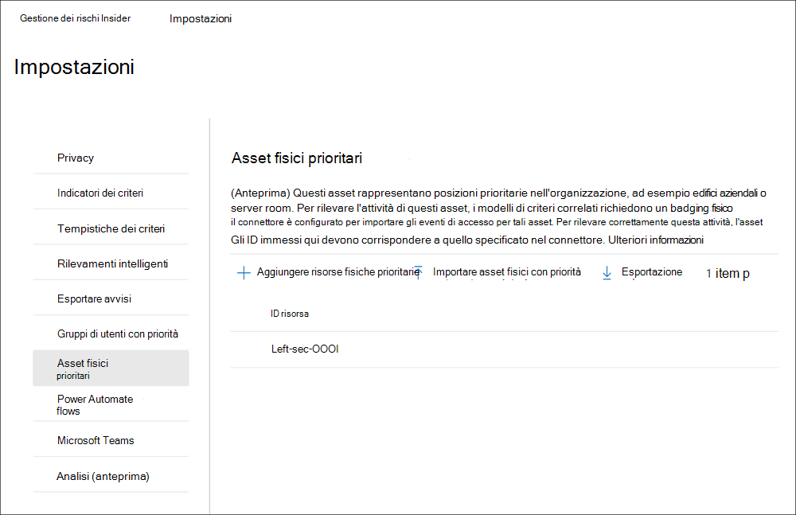

### Configurare asset fisici con prioritàConfigure priority physical assets

Per configurare gli asset fisici con priorità, si configurerà il connettore di badging fisico e si useranno i controlli delle impostazioni nella soluzione di gestione dei rischi **Insider** nel Centro conformità Microsoft 365.To configure priority physical assets, you'll configure the Physical badging connector and use setting controls in the **Insider risk management** solution in the Microsoft 365 compliance center. Per configurare gli asset fisici con priorità, è necessario essere membri del gruppo di ruoli *Insider Risk Management* o Insider Risk Management *Admin*.To configure priority physical assets, you must be a member of the *Insider Risk Management* or *Insider Risk Management Admin role group*.

Completare la procedura seguente per configurare gli asset fisici con priorità:Complete the following steps to configure priority physical assets:

1. Seguire i passaggi di configurazione per la gestione dei rischi insider [nell'articolo Introduzione alla gestione dei rischi](insider-risk-management-configure.md) insider.Follow the configuration steps for insider risk management in the [Getting started with insider risk management](insider-risk-management-configure.md) article. Nel passaggio 3, assicurarsi di configurare il connettore di badging fisico.In Step 3, make sure you configure the Physical badging connector.

    >[!IMPORTANT]
    >Per consentire ai criteri di gestione dei rischi insider di usare e correlare i dati del segnale relativi agli utenti in uscita e terminati con i dati degli eventi dalle piattaforme di controllo fisico e accesso, è necessario configurare anche il connettore HR di Microsoft 365.For insider risk management policies to use and correlate signal data related to departing and terminated users with event data from your physical control and access platforms, you must also configure the Microsoft 365 HR connector. Se si abilita il connettore di badging fisico senza abilitare il connettore HR di Microsoft 365, i criteri di gestione dei rischi insider eelaborare solo gli eventi per le attività di accesso fisico per gli utenti dell'organizzazione.If you enable the Physical badging connector without enabling the Microsoft 365 HR connector, insider risk management policies will only process events for physical access activities for users in your organization.

2. Nel Centro [conformità Microsoft 365](https://compliance.microsoft.com)passare a Gestione dei rischi **Insider** e selezionare Impostazioni **rischio Insider** Priorità Asset  >  **fisici.**In the [Microsoft 365 compliance center](https://compliance.microsoft.com), go to **Insider risk management** and select **Insider risk settings** > **Priority physical assets**.
3. Nella  pagina Risorse fisiche con priorità è possibile aggiungere manualmente gli ID risorsa fisica che si desidera monitorare per gli eventi degli asset importati dal connettore di badging fisico oppure importare un file CSV di tutti gli ID di asset fisici importati dal connettore di badging fisico: a) Per aggiungere manualmente gli ID delle risorse fisiche, scegliere **Aggiungi** risorse fisiche di priorità, immettere un ID risorsa fisica, quindi selezionare **Aggiungi**.On the **Priority physical assets** page, you can either manually add the physical asset IDs you want to monitor for the asset events imported by the Physical badging connector or import a .csv file of all physical assets IDs imported by the Physical badging connector: a) To manually add physical assets IDs, choose **Add priority physical assets**, enter a physical asset ID, then select **Add**. Immetti altri ID risorsa fisica e quindi seleziona Aggiungi asset fisici **di priorità** per salvare tutti gli asset immessi.Enter other physical asset IDs and then select **Add priority physical assets** to save all the assets entered.
    b) Per aggiungere un elenco di ID risorsa fisica da un file CSV, scegliere **Importa asset fisici con priorità**.b) To add a list of physical asset IDs from a .csv file, choose **Import priority physical assets**. Nella finestra di dialogo Esplora file seleziona il file CSV che vuoi importare, quindi seleziona **Apri.**From the file explorer dialog, select the .csv file you wish to import, then select **Open**. Gli ID risorsa fisica dei file CSV vengono aggiunti all'elenco.The physical asset IDs from the .csv files are added to the list.
4. Passare alla scheda **Indicatori dei** criteri in Impostazioni.Navigate to the **Policy indicators** tab in Settings.
5. Nella pagina **Indicatori criteri** passare alla sezione **Indicatori** di accesso fisico e selezionare la casella di controllo Accesso fisico dopo la chiusura o l'accesso non riuscito **all'asset sensibile.**On the **Policy indicators** page, navigate to the **Physical access indicators** section and select the checkbox for **Physical access after termination or failed access to sensitive asset**.
6. Selezionare **Salva** per configurare ed uscire.Select **Save** to configure and exit.

### Eliminare un asset fisico con prioritàDelete a priority physical asset

Per eliminare un asset fisico con priorità esistente, si utilizzerà l'impostazione dei controlli nella soluzione di gestione dei rischi Insider nel Centro conformità Microsoft 365.To delete an existing priority physical asset, you'll use setting controls in the Insider risk management solution in the Microsoft 365 compliance center. Per eliminare un asset fisico con priorità, è necessario essere membri del gruppo di ruoli Insider Risk Management o Insider Risk Management Admin.To delete a priority physical asset, you must be a member of the Insider Risk Management or Insider Risk Management Admin role group.

>[!IMPORTANT]
>L'eliminazione di un asset fisico di priorità lo rimuove dall'esame da qualsiasi criterio attivo in cui era incluso in precedenza.Deleting a priority physical asset removes it from examination by any active policy to which it was previously included. Gli avvisi generati dalle attività associate all'asset fisico con priorità non vengono eliminati.Alerts generated by activities associated with the priority physical asset aren't deleted.

Completare la procedura seguente per eliminare un asset fisico con priorità:Complete the following steps to delete a priority physical asset:

1. Nel Centro [conformità Microsoft 365](https://compliance.microsoft.com)passare a Gestione dei rischi **Insider** e selezionare Impostazioni **rischio Insider** Priorità Asset  >  **fisici.**In the [Microsoft 365 compliance center](https://compliance.microsoft.com), go to **Insider risk management** and select **Insider risk settings** > **Priority physical assets**.
2. Nella pagina **Priorità risorse fisiche** selezionare l'asset che si desidera eliminare.On the **Priority physical assets** page, select the asset you want to delete.
3. Scegliere **Elimina** dal menu azione per eliminare la risorsa.Select **Delete** on the action menu to delete the asset.

## Flussi automatici di Power (anteprima)Power Automate flows (preview)

[Microsoft Power Automate è](/power-automate/getting-started) un servizio di flusso di lavoro che automatizza le azioni tra applicazioni e servizi.[Microsoft Power Automate](/power-automate/getting-started) is a workflow service that automates actions across applications and services. Utilizzando i flussi dei modelli o creati manualmente, è possibile automatizzare le attività comuni associate a tali applicazioni e servizi.By using flows from templates or created manually, you can automate common tasks associated with these applications and services. Quando si abilita Power Automate flows per la gestione dei rischi insider, è possibile automatizzare attività importanti per casi e utenti.When you enable Power Automate flows for insider risk management, you can automate important tasks for cases and users. È possibile configurare i flussi di Power Automate per recuperare le informazioni su utenti, avvisi e casi e condividere queste informazioni con le parti interessate e altre applicazioni, nonché automatizzare le azioni nella gestione dei rischi insider, ad esempio la pubblicazione di note sul caso.You can configure Power Automate flows to retrieve user, alert, and case information and share this information with stakeholders and other applications, as well as automate actions in insider risk management, such as posting to case notes. I flussi di Power Automate sono applicabili ai casi e a qualsiasi utente nell'ambito di un criterio.Power Automate flows are applicable for cases and any user in scope for a policy.

I clienti con abbonamenti a Microsoft 365 che includono la gestione dei rischi insider non necessitano di licenze di Power Automate aggiuntive per usare i modelli di Power Automate power di gestione dei rischi insider consigliati.Customers with Microsoft 365 subscriptions that include insider risk management do not need additional Power Automate licenses to use the recommended insider risk management Power Automate templates. Questi modelli possono essere personalizzati per supportare l'organizzazione e coprire gli scenari di gestione dei rischi insider di base.These templates can be customized to support your organization and cover core insider risk management scenarios. Se si sceglie di usare le funzionalità di Power Automate premium in questi modelli, creare un modello personalizzato utilizzando il connettore di conformità di Microsoft 365 o utilizzare i modelli power automate per altre aree di conformità in Microsoft 365, potrebbero essere necessarie altre licenze di Power Automate.If you choose to use premium Power Automate features in these templates, create a custom template using the Microsoft 365 compliance connector, or use Power Automate templates for other compliance areas in Microsoft 365, you may need more Power Automate licenses.

I modelli power automate seguenti vengono forniti ai clienti per supportare l'automazione dei processi per gli utenti e i casi di gestione dei rischi insider:The following Power Automate templates are provided to customers to support process automation for insider risk management users and cases:

- **Informare** gli utenti quando vengono aggiunti a un criterio di rischio Insider: questo modello è per le organizzazioni con criteri interni, privacy o requisiti normativi che gli utenti devono ricevere una notifica quando sono soggetti a criteri di gestione dei rischi insider.**Notify users when they're added to an insider risk policy**: This template is for organizations that have internal policies, privacy, or regulatory requirements that users must be notified when they are subject to insider risk management policies. Quando questo flusso viene configurato e selezionato per un utente nella pagina degli utenti, agli utenti e ai relativi responsabili viene inviato un messaggio di posta elettronica quando l'utente viene aggiunto a un criterio di gestione dei rischi insider.When this flow is configured and selected for a user in the users page, users and their managers are sent an email message when the user is added to an insider risk management policy. Questo modello supporta inoltre l'aggiornamento di un elenco di SharePoint ospitato in un sito di SharePoint per tenere traccia dei dettagli del messaggio di notifica, ad esempio data/ora e destinatario del messaggio.This template also supports updating a SharePoint list hosted on a SharePoint site to help track notification message details like date/time and the message recipient. Se si è scelto di anonimizzare gli utenti in **Impostazioni** privacy, i flussi creati da questo modello non funzioneranno come previsto in modo che la privacy degli utenti sia mantenuta.If you've chosen to anonymize users in **Privacy settings**, flows created from this template will not function as intended so that user privacy is maintained. Power Automate flows using this template are available on the **Users dashboard.**Power Automate flows using this template are available on the **Users dashboard**.
- **Richiedere** informazioni alle risorse umane o aziendali su un utente in un caso di rischio insider: quando agiscono su un caso, gli analisti e gli investigatori del rischio insider potrebbero dover consultare le risorse umane o altri stakeholder per comprendere il contesto delle attività del caso.**Request information from HR or business about a user in an insider risk case**: When acting on a case, insider risk analysts and investigators may need to consult with HR or other stakeholders to understand the context of the case activities. Quando questo flusso è configurato e selezionato per un caso, analisti e investigatori inviano un messaggio di posta elettronica alle risorse umane e agli stakeholder aziendali configurati per questo flusso.When this flow is configured and selected for a case, analysts and investigators send an email message to HR and business stakeholders configured for this flow. A ogni destinatario viene inviato un messaggio con opzioni di risposta preconfigurato o personalizzabile.Each recipient is sent a message with pre-configured or customizable response options. Quando i destinatari selezionano un'opzione di risposta, la risposta viene registrata come nota del caso e include informazioni su destinatario e data/ora.When recipients select a response option, the response is recorded as a case note and includes recipient and date/time information. Se si è scelto di anonimizzare gli utenti in **Impostazioni** privacy, i flussi creati da questo modello non funzioneranno come previsto in modo che la privacy degli utenti sia mantenuta.If you've chosen to anonymize users in **Privacy settings**, flows created from this template will not function as intended so that user privacy is maintained. Power Automate flows using this template sono disponibili nel **dashboard Casi.**Power Automate flows using this template are available on the **Cases dashboard**.
- **Notificare al responsabile quando un utente** ha un avviso per i rischi insider: alcune organizzazioni potrebbero dover ricevere una notifica di gestione immediata quando un utente ha un avviso per la gestione dei rischi insider.**Notify manager when a user has an insider risk alert**: Some organizations may need to have immediate management notification when a user has an insider risk management alert. Quando questo flusso è configurato e selezionato, al responsabile del caso all'utente viene inviato un messaggio di posta elettronica con le informazioni seguenti su tutti gli avvisi caso:When this flow is configured and selected, the manager for the case user is sent an email message with the following information about all case alerts:
    - Criteri applicabili per l'avvisoApplicable policy for the alert
    - Data/ora dell'avvisoDate/Time of the alert
    - Livello di gravità dell'avvisoSeverity level of the alert

    Il flusso aggiorna automaticamente le note del caso che il messaggio è stato inviato e che il flusso è stato attivato.The flow automatically updates the case notes that the message was sent and that the flow was activated. Se si è scelto di anonimizzare gli utenti in **Impostazioni** privacy, i flussi creati da questo modello non funzioneranno come previsto in modo che la privacy degli utenti sia mantenuta.If you've chosen to anonymize users in **Privacy settings**, flows created from this template will not function as intended so that user privacy is maintained. Power Automate flows using this template sono disponibili nel **dashboard Casi.**Power Automate flows using this template are available on the **Cases dashboard**.

- **Aggiungere promemoria del calendario** per seguire un caso di rischio insider: questo modello consente agli investigatori e agli analisti del rischio di aggiungere promemoria del calendario per i casi al calendario di Outlook di Office 365.**Add calendar reminder to follow up on an insider risk case**: This template allows risk investigators and analysts to add calendar reminders for cases to their Office 365 Outlook calendar. Questo flusso elimina la necessità per gli utenti di uscire o uscire dal flusso di lavoro di gestione dei rischi insider durante l'elaborazione dei casi e la valutazione degli avvisi.This flow eliminates the need for users to exit or switch out of the insider risk management workflow when processing cases and triaging alerts. Quando questo flusso è configurato e selezionato, viene aggiunto un promemoria al calendario di Outlook di Office 365 per l'utente che esegue il flusso.When this flow is configured and selected, a reminder is added to Office 365 Outlook calendar for the user running the flow. Power Automate flows using this template sono disponibili nel **dashboard Casi.**Power Automate flows using this template are available on the **Cases dashboard**.
- Creare record per i casi di rischio insider **in ServiceNow**: questo modello è per le organizzazioni che desiderano utilizzare la soluzione ServiceNow per tenere traccia dei casi di gestione dei rischi insider.**Create record for insider risk case in ServiceNow**: This template is for organizations that want to use their ServiceNow solution to track insider risk management cases.  In un caso, gli analisti e gli investigatori del rischio insider possono creare un record per il caso in ServiceNow.When in a case, insider risk analysts and investigators can create a record for the case in ServiceNow. È possibile personalizzare questo modello per popolare i campi selezionati in ServiceNow in base alle esigenze dell'organizzazione.You can customize this template to populate selected fields in ServiceNow based on your organization's requirements. Power Automate flows using this template sono disponibili nel **dashboard Casi.**Power Automate flows using this template are available on the **Cases dashboard**. Per ulteriori informazioni sui campi ServiceNow disponibili, vedere l'articolo di [riferimento serviceNow Connector.](/connectors/service-now/)For more information on available ServiceNow fields, see the [ServiceNow Connector reference](/connectors/service-now/) article.

### Creare un flusso power automate da un modello di gestione dei rischi insiderCreate a Power Automate flow from insider risk management template

Per creare un flusso power automate da un modello di gestione dei rischi insider consigliato, si useranno i  controlli delle impostazioni nella soluzione di gestione dei  rischi **Insider** nel Centro conformità Microsoft 365 o nell'opzione Gestisci flussi automatici di alimentazione dal **controllo** Automatizza quando si lavora direttamente nei **dashboard** Casi o Utenti.To create a Power Automate flow from a recommended  insider risk management template, you'll use the settings controls in the **Insider risk management** solution in the Microsoft 365 compliance center or the **Manage Power Automate flows** option from the **Automate** control when working directly in the **Cases** or **Users dashboards**.

Per creare un flusso power automate nell'area delle impostazioni, devi essere membro del gruppo di ruoli *Insider Risk Management* o Insider Risk Management *Admin.*To create a Power Automate flow in the settings area, you must be a member of the *Insider Risk Management* or *Insider Risk Management Admin* role group. Per creare un flusso di  Power Automate con l'opzione Gestisci flussi automatici di alimentazione, è necessario essere membri di almeno un gruppo di ruoli di gestione dei rischi insider.To create a Power Automate flow with the **Manage Power Automate flows** option, you must be a member of at least one insider risk management role group.

Completare la procedura seguente per creare un flusso power automate da un modello di gestione dei rischi insider consigliato:Complete the following steps to create a Power Automate flow from a recommended insider risk management template:

1. Nel Centro [conformità Microsoft 365](https://compliance.microsoft.com/)passare a Gestione dei rischi **Insider** e selezionare Impostazioni **rischio Insider** Power  >  **Automate flows.**In the [Microsoft 365 compliance center](https://compliance.microsoft.com/), go to **Insider risk management** and select **Insider risk settings** > **Power Automate flows**. È inoltre possibile accedere dalle **pagine dei** **dashboard** Casi o Utenti scegliendo **Automatizza** gestione flussi automatici  >  **di risparmio energia.**You can also access from the **Cases** or **Users dashboards** pages by choosing **Automate** > **Manage Power Automate flows**.
2. Nella pagina **Flussi automatici** di alimentazione seleziona un modello consigliato nella sezione Modelli di gestione dei rischi **insider** che potresti piacerti nella pagina.On the **Power Automate flows** page, select a recommended template from the **Insider risk management templates you may like** section on the page.
3. Il flusso elenca le connessioni incorporate necessarie per il flusso e noterà se gli stati della connessione sono disponibili.The flow lists the embedded connections needed for the flow and will note if the connection statuses are available. Se necessario, aggiornare tutte le connessioni che non vengono visualizzate come disponibili.If needed, update any connections that aren't displayed as available. Selezionare **Continua.**Select **Continue**.
4. Per impostazione predefinita, i flussi consigliati sono preconfigurato con la gestione dei rischi insider consigliata e i campi dati del servizio Microsoft 365 necessari per completare l'attività assegnata per il flusso.By default, the recommended flows are pre-configured with the recommended insider risk management and Microsoft 365 service data fields required to complete the assigned task for the flow. Se necessario, personalizzare i componenti del flusso utilizzando il **controllo Mostra** opzioni avanzate e configurando le proprietà disponibili per il componente di flusso.If needed, customize the flow components by using the **Show advanced options** control and configuring the available properties for the flow component.
5. Se necessario, aggiungere altri passaggi al flusso selezionando il **pulsante Nuovo** passaggio.If needed, add any other steps to the flow by selecting the **New step** button. Nella maggior parte dei casi, questa operazione non deve essere necessaria per i modelli predefiniti consigliati.In most cases, this should not be needed for the recommended default templates.
6. Selezionare **Salva bozza** per salvare il flusso per ulteriori configurazioni oppure **selezionare Salva** per completare la configurazione per il flusso.Select **Save draft** to save the flow for further configuration or select **Save** to complete the configuration for the flow.
7. Selezionare **Chiudi** per tornare alla **pagina del flusso Power Automate.**Select **Close** to return to the **Power Automate flow** page. Il nuovo modello verrà elencato  come flusso nelle schede Flussi di lavoro ed è automaticamente disponibile dal controllo a discesa **Automate** quando si lavora con i casi di gestione dei rischi insider per l'utente che crea il flusso.The new template will be listed as a flow on the **My flows** tabs and is automatically available from the **Automate** dropdown control when working with insider risk management cases for the user creating the flow.

>[!IMPORTANT]
>Se altri utenti dell'organizzazione devono accedere al flusso, il flusso deve essere condiviso.If other users in your organization need access to the flow, the flow must be shared.

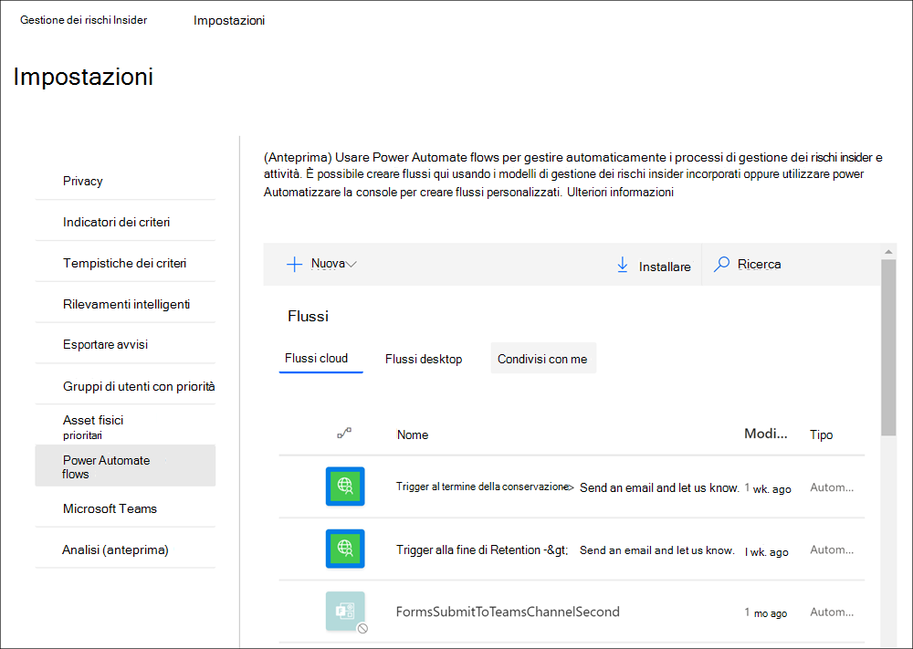

### Creare un flusso power automate personalizzato per la gestione dei rischi insiderCreate a custom Power Automate flow for insider risk management

Alcuni processi e flussi di lavoro per l'organizzazione potrebbero essere al di fuori dei modelli di flusso di gestione dei rischi insider consigliati e potrebbe essere necessario creare flussi di Power Automate personalizzati per le aree di gestione dei rischi insider.Some processes and workflows for your organization may be outside of the recommended insider risk management flow templates and you may have the need to create custom Power Automate flows for insider risk management areas. I flussi di Power Automate sono flessibili e supportano una personalizzazione estesa, ma è necessario eseguire alcuni passaggi per l'integrazione con le funzionalità di gestione dei rischi insider.Power Automate flows are flexible and support extensive customization, but there are steps that need to be taken to integrate with insider risk management features.

Completare la procedura seguente per creare un modello power automate personalizzato per la gestione dei rischi insider:Complete the following steps to create a custom Power Automate template for insider risk management:

1. Controllare la licenza del flusso **Power Automate:** per creare flussi di Power Automate personalizzati che utilizzano trigger di gestione dei rischi insider, è necessaria una licenza di Power Automate.**Check your Power Automate flow license**: To create customized Power Automate flows that use insider risk management triggers, you'll need a Power Automate license. I modelli di flusso di gestione dei rischi insider consigliati non richiedono licenze aggiuntive e sono inclusi come parte della licenza di gestione dei rischi insider.The recommended insider risk management flow templates do not require extra licensing and are included as part of your insider risk management license.
2. **Creare un flusso automatizzato:** creare un flusso che esegua una o più attività dopo che è stato attivato da un evento di gestione dei rischi insider.**Create an automated flow**: Create a flow that performs one or more tasks after it's triggered by an insider risk management event. Per informazioni dettagliate su come creare un flusso automatizzato, vedere [Create a flow in Power Automate.](/power-automate/get-started-logic-flow)For details on how to create an automated flow, see [Create a flow in Power Automate](/power-automate/get-started-logic-flow).
3. **Selezionare il connettore di conformità di Microsoft 365**: Cercare e selezionare il connettore di conformità di Microsoft 365.**Select the Microsoft 365 compliance connector**: Search for and select the Microsoft 365 compliance connector. Questo connettore consente azioni e trigger di gestione dei rischi insider.This connector enables insider risk management triggers and actions. Per ulteriori informazioni sui connettori, vedere [l'articolo panoramica di riferimento sui](/connectors/connector-reference/) connettori.For more information on connectors, see the [Connector reference overview](/connectors/connector-reference/) article.
4. **Scegliere i trigger di gestione dei rischi insider per il** flusso: la gestione dei rischi insider ha due trigger disponibili per i flussi personalizzati di Power Automate:**Choose insider risk management triggers for your flow**: Insider risk management has two triggers available for custom Power Automate flows:
    - **Per un caso di gestione dei rischi insider selezionato:** i flussi con questo trigger possono essere selezionati dalla pagina dashboard Dei casi di gestione dei rischi insider.**For a selected insider risk management case**: Flows with this trigger can be selected from the insider risk management Cases dashboard page.
    - **Per un utente selezionato per la gestione dei rischi** insider: i flussi con questo trigger possono essere selezionati dalla pagina Dashboard utenti per la gestione dei rischi insider.**For a selected insider risk management user**: Flows with this trigger can be selected from the insider risk management Users dashboard page.
5. Scegliere le azioni di gestione dei rischi insider per il flusso: è possibile scegliere tra diverse azioni per la gestione dei rischi insider da includere nel flusso personalizzato:Choose insider risk management actions for your flow: You can choose from several actions for insider risk management to include in your custom flow:
    - Ottenere un avviso per la gestione dei rischi insiderGet insider risk management alert
    - Ottenere un caso di gestione dei rischi insiderGet insider risk management case
    - Ottenere un utente insider per la gestione dei rischiGet insider risk management user
    - Ottenere avvisi per la gestione dei rischi insider per un casoGet insider risk management alerts for a case
    - Aggiungere una nota sul caso di gestione dei rischi insiderAdd insider risk management case note

### Condividere un flusso power automateShare a Power Automate flow

Per impostazione predefinita, i flussi di Power Automate creati da un utente sono disponibili solo per tale utente.By default, Power Automate flows created by a user are only available to that user. Per consentire ad altri utenti di gestione dei rischi insider di accedere e usare un flusso, il flusso deve essere condiviso dall'autore del flusso.For other insider risk management users to have access and use a flow, the flow must be shared by the flow creator. Per condividere un flusso, si useranno i controlli delle impostazioni nella soluzione di gestione  dei rischi **Insider** nel Centro conformità Microsoft 365 o nell'opzione Gestisci flussi automatici di alimentazione dal controllo Automatizza quando si lavora direttamente nelle pagine del **dashboard** Casi o Utenti. To share a flow, you'll use the settings controls in the **Insider risk management solution** in the Microsoft 365 compliance center or the **Manage Power Automate flows** option from the Automate control when working directly in the **Cases** or **Users dashboard** pages. Dopo aver condiviso un flusso, tutti gli utenti con cui è stato condiviso  possono accedere al flusso nell'elenco a discesa **Automatizza** controllo nei dashboard del caso **e dell'utente.**Once you have shared a flow, everyone who it has been shared with can access the flow in the **Automate** control dropdown in the **Case** and **User dashboards**.

Per condividere un flusso power automate nell'area delle impostazioni, devi essere membro del gruppo di ruoli *Insider Risk Management* o Insider Risk Management *Admin.*To share a Power Automate flow in the settings area, you must be a member of the *Insider Risk Management* or *Insider Risk Management Admin* role group. Per condividere un flusso di Power Automate con l'opzione Manage **Power Automate flows,** è necessario essere membri di almeno un gruppo di ruoli insider risk management.To share a Power Automate flow with the **Manage Power Automate flows** option, you must be a member of at least one insider risk management role group.

Completare la procedura seguente per condividere un flusso power automate:Complete the following steps to share a Power Automate flow:

1. Nel Centro [conformità Microsoft 365](htttps://compliance.microsoft.com)passare a Gestione dei rischi **Insider** e selezionare Impostazioni **rischio Insider** Power  >  **Automate flows.**In the [Microsoft 365 compliance center](htttps://compliance.microsoft.com), go to **Insider risk management** and select **Insider risk settings** > **Power Automate flows**. È inoltre possibile accedere dalle **pagine dei** **dashboard** Casi o Utenti scegliendo **Automatizza** gestione flussi automatici  >  **di risparmio energia.**You can also access from the **Cases** or **Users dashboards** pages by choosing **Automate** > **Manage Power Automate flows**.
2. Nella pagina **Flussi automatici di alimentazione** selezionare la scheda Flussi **del** team o **Flussi del** team.On the **Power Automate flows** page, select the **My flows** or **Team flows** tab.
3. Seleziona il flusso da condividere, quindi scegli **Condividi** dal menu delle opzioni del flusso.Select the flow to share, then select **Share** from the flow options menu.
4. Nella pagina di condivisione del flusso immettere il nome dell'utente o del gruppo che si desidera aggiungere come proprietario del flusso.On the flow sharing page, enter the name of the user or group you want to add as an owner for the flow.
5. Nella finestra **di dialogo Connessione** utilizzata selezionare **OK** per confermare che l'utente o il gruppo aggiunto avrà accesso completo al flusso.On the **Connection Used** dialog, select **OK** to acknowledge that the added user or group will have full access to the flow.

### Modificare un flusso di Power AutomateEdit a Power Automate flow

Per modificare un flusso, verranno utilizzati i controlli delle impostazioni nella soluzione di gestione  dei rischi **Insider** nel  Centro conformità Microsoft 365 o nell'opzione Gestisci flussi automatici di alimentazione dal controllo Automatizza quando si lavora direttamente nei **dashboard** Casi o Utenti. To edit a flow, you'll use the settings controls in the **Insider risk management** solution in the Microsoft 365 compliance center or the **Manage Power Automate flows** option from the **Automate** control when working directly in the **Cases** or **Users dashboards**.

Per modificare un flusso di Power Automate nell'area delle impostazioni, è necessario essere membri del gruppo di ruoli *Insider Risk Management* o Insider Risk Management *Admin.*To edit a Power Automate flow in the settings area, you must be a member of the *Insider Risk Management* or *Insider Risk Management Admin* role group. Per modificare un flusso di  Power Automate con l'opzione Gestisci flussi automatici di alimentazione, è necessario essere membri di almeno un gruppo di ruoli di gestione dei rischi insider.To edit a Power Automate flow with the **Manage Power Automate flows** option, you must be a member of at least one insider risk management role group.

Completare la procedura seguente per modificare un flusso di Power Automate:Complete the following steps to edit a Power Automate flow:

1. Nel Centro [conformità Microsoft 365](htttps://compliance.microsoft.com)passare a Gestione dei rischi **Insider** e selezionare Impostazioni **rischio Insider** Power  >  **Automate flows.**In the [Microsoft 365 compliance center](htttps://compliance.microsoft.com), go to **Insider risk management** and select **Insider risk settings** > **Power Automate flows**. È inoltre possibile accedere dalle **pagine dei** **dashboard** Casi o Utenti scegliendo **Automatizza** gestione flussi automatici  >  **di risparmio energia.**You can also access from the **Cases** or **Users dashboards** pages by choosing **Automate** > **Manage Power Automate flows**.
2. Nella pagina **Power Automate flows** selezionare un flusso da modificare e **scegliere Edit** dal menu flow control.On the **Power Automate flows** page, select a flow to edit and select **Edit** from the flow control menu.
3. Selezionare i **puntini di sospensione** Impostazioni per modificare l'impostazione di un componente di flusso o i puntini di  >   **sospensione**  >  **Elimina** per eliminare un componente di flusso.Select the **ellipsis** > **Settings** to change a flow component setting or **ellipsis** > **Delete** to delete a flow component.
4. Selezionare **Salva** e quindi **Chiudi per** completare la modifica del flusso.Select **Save** and then **Close** to complete editing the flow.

### Eliminare un flusso power automateDelete a Power Automate flow

Per eliminare un flusso, verranno utilizzati i controlli delle impostazioni nella soluzione di gestione  dei rischi **Insider** nel  Centro conformità Microsoft 365 o nell'opzione Gestisci flussi automatici di alimentazione dal controllo Automatizza quando si lavora direttamente nei **dashboard** Casi o Utenti. To delete a flow, you'll use the settings controls in the **Insider risk management** solution in the Microsoft 365 compliance center or the **Manage Power Automate flows** option from the **Automate** control when working directly in the **Cases** or **Users dashboards**. Quando un flusso viene eliminato, viene rimosso come opzione per tutti gli utenti.When a flow is deleted, it is removed as an option for all users.

Per eliminare un flusso power automate nell'area delle impostazioni, è necessario essere membri del gruppo di ruoli *Insider Risk Management* o Insider Risk Management *Admin.*To delete a Power Automate flow in the settings area, you must be a member of the *Insider Risk Management* or *Insider Risk Management Admin* role group. Per eliminare un flusso di  Power Automate con l'opzione Gestisci flussi automatici di alimentazione, è necessario essere membri di almeno un gruppo di ruoli di gestione dei rischi insider.To delete a Power Automate flow with the **Manage Power Automate flows** option, you must be a member of at least one insider risk management role group.

Completare la procedura seguente per eliminare un flusso di Power Automate:Complete the following steps to delete a Power Automate flow:

1. Nel Centro [conformità Microsoft 365](htttps://compliance.microsoft.com)passare a Gestione dei rischi **Insider** e selezionare Impostazioni **rischio Insider** Power  >  **Automate flows.**In the [Microsoft 365 compliance center](htttps://compliance.microsoft.com), go to **Insider risk management** and select **Insider risk settings** > **Power Automate flows**. È inoltre possibile accedere dalle **pagine dei** **dashboard** Casi o Utenti scegliendo **Automatizza** gestione flussi automatici  >  **di risparmio energia.**You can also access from the **Cases** or **Users dashboards** pages by choosing **Automate** > **Manage Power Automate flows**.
2. Nella pagina **Flussi di Power Automate** selezionare un flusso da eliminare e scegliere **Elimina** dal menu controllo di flusso.On the **Power Automate flows** page, select a flow to delete and select **Delete** from the flow control menu.
3. Nella finestra di dialogo di conferma dell'eliminazione, selezionare **Elimina** per rimuovere il flusso oppure **scegliere Annulla** per uscire dall'azione di eliminazione.On the deletion confirmation dialog, select **Delete** to remove the flow or select **Cancel** to exit the deletion action.

## Microsoft Teams (anteprima)Microsoft Teams (preview)

Gli analisti e gli investigatori della conformità possono facilmente usare Microsoft Teams per la collaborazione sui casi di gestione dei rischi insider.Compliance analysts and investigators can easily use Microsoft Teams for collaboration on insider risk management cases. Possono coordinarsi e comunicare con altri stakeholder di Microsoft Teams per:They can coordinate and communicate with other stakeholders in Microsoft Teams to:

- Coordinare ed esaminare le attività di risposta per i casi nei canali privati di TeamsCoordinate and review response activities for cases in private Teams channels
- Condividere e archiviare in modo sicuro file ed elementi di prova relativi a singoli casiSecurely share and store files and evidence related to individual cases
- Tenere traccia e rivedere le attività di risposta da parte di analisti e investigatoriTrack and review response activities by analysts and investigators

Dopo aver abilitato Microsoft Teams per la gestione dei rischi insider, viene creato un team dedicato di Microsoft Teams ogni volta che viene confermato un avviso e viene creato un caso.After Microsoft Teams is enabled for insider risk management, a dedicated Microsoft Teams team is created every time an alert is confirmed and a case is created. Per impostazione predefinita, il team include automaticamente tutti i membri dei gruppi di ruoli *Insider Risk Management,* *Insider Risk Management Analysts* e *Insider Risk Management Investigators* (fino a 100 utenti iniziali).By default, the team automatically includes all members of the *Insider Risk Management*, *Insider Risk Management Analysts*, and *Insider Risk Management Investigators* role groups (up to 100 initial users). È possibile aggiungere altri collaboratori dell'organizzazione al team dopo la creazione e in base alle esigenze.Additional organization contributors may be added to the team after it is created and as appropriate. Per i casi esistenti creati prima di abilitare Microsoft Teams, analisti e investigatori possono scegliere di creare un nuovo team di Microsoft Teams quando lavorano in un caso, se necessario.For existing cases created before enabling Microsoft Teams, analysts and investigators can choose to create a new Microsoft Teams team when working in a case if needed.  Dopo aver risolto il caso associato nella gestione dei rischi insider, il team viene automaticamente archiviato (spostato in nascosto e di sola lettura).Once you resolve the associated case in insider risk management, the team is automatically archived (moved to hidden and read-only).

Per ulteriori informazioni sull'utilizzo di team e canali in Microsoft Teams, vedere [Overview of teams and channels in Microsoft Teams.](/MicrosoftTeams/teams-channels-overview)For more information on how to use teams and channels in Microsoft Teams, see [Overview of teams and channels in Microsoft Teams](/MicrosoftTeams/teams-channels-overview).

L'abilitazione del supporto di Microsoft Teams per i casi è facile e veloce da configurare.Enabling Microsoft Teams support for cases is quick and easy to configure. Per abilitare Microsoft Teams per la gestione dei rischi insider, eseguire la procedura seguente:To enable Microsoft Teams for insider risk management, complete the following steps:

1. Nel Centro [conformità Microsoft 365](htttps://compliance.microsoft.com)passare a Insider **risk management** Insider  >  **risk settings**.In the [Microsoft 365 compliance center](htttps://compliance.microsoft.com), go to **Insider risk management** > **Insider risk settings**.
2. Selezionare la **scheda Microsoft Teams.**Select the **Microsoft Teams** tab.
3. Abilitare l'integrazione di Microsoft Teams per la gestione dei rischi insider.Enable Microsoft Teams integration for insider risk management.
4. Selezionare **Salva** per configurare ed uscire.Select **Save** to configure and exit.

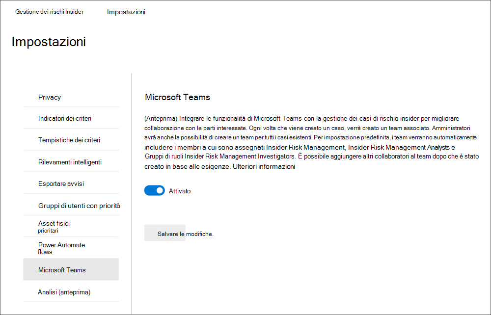

### Creare un team di Microsoft Teams per i casi esistentiCreate a Microsoft Teams team for existing cases

Se si abilita il supporto di Microsoft Teams per la gestione dei rischi insider dopo aver avuto casi esistenti, sarà necessario creare manualmente un team per ogni caso in base alle esigenze.If you enable Microsoft Teams support for insider risk management after you have existing cases, you'll need to manually create a team for each case as needed. Dopo aver abilitato il supporto di Microsoft Teams nelle impostazioni di gestione dei rischi insider, i nuovi casi creeranno automaticamente un nuovo team di Microsoft Teams.After enabling Microsoft Teams support in insider risk management settings, new cases will automatically create a new Microsoft Teams team.

Gli utenti devono disporre dell'autorizzazione per creare gruppi di Microsoft 365 nell'organizzazione per creare un team di Microsoft Teams da un caso.Users need permission to create Microsoft 365 groups in your organization to create a Microsoft Teams team from a case. Per ulteriori informazioni sulla gestione delle autorizzazioni per i gruppi di Microsoft 365, vedere [Manage who can create Microsoft 365 Groups.](../solutions/manage-creation-of-groups.md)For more information about managing permissions for Microsoft 365 Groups, see [Manage who can create Microsoft 365 Groups](../solutions/manage-creation-of-groups.md).

Per creare un team per un caso, userai il controllo Crea team Microsoft quando lavori direttamente in un caso esistente.To create a team for a case, you'll use the Create Microsoft Team control when working directly in an existing case. Completare la procedura seguente per creare un nuovo team:Complete the following steps to create a new team:

1. Nel Centro [conformità Microsoft 365](htttps://compliance.microsoft.com)passare a Casi di gestione dei rischi **Insider** e selezionare un  >   caso esistente.In the [Microsoft 365 compliance center](htttps://compliance.microsoft.com), go to **Insider risk management** > **Cases** and select an existing case.
2. Scegliere Crea Microsoft Team dal menu **azione del caso.**On the case action menu, select **Create Microsoft Team**.
3. Nel campo **Nome team** immettere un nome per il nuovo team di Microsoft Teams.In the **Team name** field, enter a name for the new Microsoft Teams team.
4. Seleziona **Crea team Microsoft** e quindi seleziona **Chiudi.**Select **Create Microsoft team** and then select **Close**.

A seconda del numero di utenti assegnati ai gruppi di ruoli di gestione dei rischi insider, potrebbero essere necessario 15 minuti per aggiungere tutti gli investigatori e gli analisti al team di Microsoft Teams per un caso.Depending on the number of users assigned to insider risk management role groups, it may take 15 minutes for all investigators and analysts to be added to the Microsoft Teams team for a case.

## Analisi (anteprima)Analytics (preview)

L'analisi dei rischi Insider consente di eseguire una valutazione dei potenziali rischi insider nell'organizzazione senza configurare criteri di rischio insider.Insider risk analytics enables you to conduct an evaluation of potential insider risks in your organization without configuring any insider risk policies. Questa valutazione può aiutare l'organizzazione a identificare le potenziali aree con un rischio maggiore per gli utenti e a determinare il tipo e l'ambito dei criteri di gestione dei rischi insider che è possibile configurare.This evaluation can help your organization identify potential areas of higher user risk and help determine the type and scope of insider risk management policies you may consider configuring. Le analisi analitiche offrono i vantaggi seguenti per l'organizzazione:Analytics scans offer the following advantages for your organization:

- Facile da configurare: per iniziare a usare le analisi analitiche, è possibile selezionare Esegui analisi quando richiesto dal suggerimento di analisi o passare > Impostazioni rischio Insider e abilitare l'analisi.Easy to configure: To get started with analytics scans, you can select Run scan when prompted by the analytics recommendation or go to Insider risk settings > Analytics tab and enable analytics.
- Requisiti minimi per la privacy: i risultati dell'analisi e le informazioni dettagliate vengono restituiti come attività degli utenti anonimi, i singoli nomi utente non sono identificabili dai revisori.Minimal privacy requirements: Scan results and insights are returned as anonymized user activity, individual user names are not identifiable by reviewers.
- Comprendere i potenziali rischi tramite informazioni approfondite consolidate: i risultati dell'analisi consentono di identificare rapidamente le potenziali aree di rischio per gli utenti e i criteri più utili per attenuare questi rischi.Understand potential risks through consolidated insights: Scan results can help you quickly identify potential risk areas for your users and which policy would be best to help mitigate these risks.

L'analisi analizza gli eventi di attività di rischio da diverse origini per identificare informazioni dettagliate sulle potenziali aree di rischio.Analytics scans for risk activity events from several sources to help identify insights into potential areas of risk. A seconda della configurazione corrente, l'analisi cerca le attività di rischio idonee nelle aree seguenti:Depending on your current configuration, analytics looks for qualifying risk activities in the following areas:

- Log di controllo di Microsoft 365: inclusa in tutte le analisi, questa è l'origine principale per identificare la maggior parte delle attività potenzialmente rischiose.Microsoft 365 audit logs: Included in all scans, this is the primary source for identifying most of the potentially risky activities.
- Exchange Online: incluso in tutte le analisi, l'attività di Exchange Online consente di identificare le attività in cui i dati negli allegati vengono inseriti tramite posta elettronica a contatti o servizi esterni.Exchange Online: Included in all scans, Exchange Online activity helps identify activities where data in attachments are emailed to external contacts or services.
- Azure Active Directory: incluso in tutte le analisi, la cronologia di Azure Active Directory consente di identificare le attività rischiose associate agli utenti con account utente eliminati.Azure Active Directory: Included in all scans, Azure Active Directory history helps identify risky activities associated with users with deleted user accounts.
- Connettore dati hr di Microsoft 365: se configurato, gli eventi del connettore HR consentono di identificare le attività rischiose associate agli utenti con date di chiusura imminenti o di dimissioni imminenti.Microsoft 365 HR data connector: If configured, HR connector events help identify risky activities associated with users that have resignation or upcoming termination dates.

Le informazioni analitiche delle analisi si basano sugli stessi segnali di attività di rischio usati dai criteri di gestione dei rischi insider e sui risultati dei report in base alle attività degli utenti singoli e sequenziali.Analytics insights from scans are based on the same risk activity signals used by insider risk management policies and report results based on both single and sequence user activities. Tuttavia, il punteggio di rischio per l'analisi si basa su un massimo di 30 giorni di attività, mentre i criteri di rischio insider usano l'attività quotidiana per ottenere informazioni dettagliate.However, the risk scoring for analytics is based on up to 30 days of activity while insider risk policies use daily activity for insights. Quando abiliti ed esegui l'analisi per la prima volta nell'organizzazione, vedrai i risultati dell'analisi per un giorno.When you first enable and run analytics in your organization, you'll see the scan results for one day. Se si lascia abilitata l'analisi, verranno visualizzati i risultati di ogni analisi giornaliera aggiunta ai report di analisi per un intervallo massimo dei 30 giorni di attività precedenti.If you leave analytics enabled, you'll see the results of each daily scan added to the insight reports for a maximum range of the previous 30 days of activity.

### Abilitare l'analisi e avviare l'analisiEnable analytics and start your scan

Per abilitare l'analisi dei rischi insider, è necessario essere membri del gruppo di ruoli Insider Risk Management, Insider Risk Management Admin o Microsoft 365 Global admin.To enable insider risk analytics, you must be a member of the Insider Risk Management, Insider Risk Management Admin or Microsoft 365 Global admin role group.
Completare la procedura seguente per abilitare l'analisi dei rischi insider:Complete the following steps to enable insider risk analytics:

1. Nel Centro [conformità Microsoft 365](htttps://compliance.microsoft.com)passare a **Gestione dei rischi Insider.**In the [Microsoft 365 compliance center](htttps://compliance.microsoft.com), go to **Insider risk management**.
2. Selezionare **Esegui analisi** nella scheda Analisi per i rischi insider **nella** scheda Panoramica della gestione dei rischi **insider.** In questo modo viene attivata l'analisi dell'analisi per l'organizzazione.Select **Run scan** on the **Scan for insider risks in your organization** card on the insider risk management **Overview** tab. This turns on analytics scanning for your organization. Puoi anche attivare l'analisi nell'organizzazione accedendo a Impostazioni dei rischi **Insider** Analisi e abilitando  >   **l'analisi dell'attività** utente del tenant per identificare potenziali rischi insider.You can also turn on scanning in your organization by navigating to **Insider risk settings** > **Analytics** and enabling **Scan your tenant's user activity to identify potential insider risks**.
3. Nel riquadro **Dei dettagli di** Analisi selezionare Esegui **analisi** per avviare l'analisi per l'organizzazione.On the **Analytics details** pane, select **Run scan** to start the scan for your organization. I risultati dell'analisi analitica possono richiedere fino a 24 ore prima che i dati analitici siano disponibili come report per la revisione.Analytics scan results may take up to 24 hours before insights are available as reports for review.

### Visualizzazione delle informazioni analitiche e creazione di nuovi criteriViewing analytics insights and creating new policies

Al termine della prima analisi analitica per l'organizzazione, è possibile visualizzare le informazioni dettagliate e i suggerimenti per le attività potenzialmente rischiose da parte degli utenti.After the first analytics scan is complete for your organization, you can view the insights and recommendations for potentially risky activities by your users. Le analisi giornaliere continueranno a meno che non si dissegni l'analisi per l'organizzazione.Daily scans will continue unless you turn off analytics for your organization. Per visualizzare i potenziali rischi per l'organizzazione, passare alla scheda **Panoramica** e selezionare **Visualizza** risultati nella scheda Analisi dei rischi **Insider (anteprima).**To view potential risks for your organization, go to the **Overview** tab and select **View results** on the **Insider risk analytics (preview)** card. Se l'analisi dell'organizzazione non è stata completata, verrà visualizzato un messaggio che indica che l'analisi è ancora attiva.If the scan for your organization isn't complete, you'll see a message that the scan is still active.

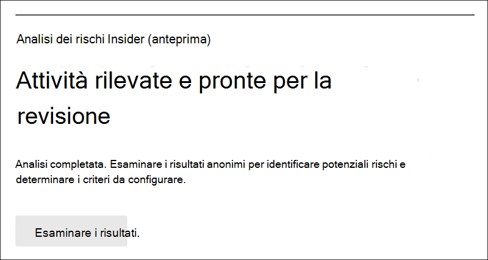

Per le analisi completate, vengono visualizzati i potenziali rischi individuati nell'organizzazione e informazioni dettagliate e suggerimenti per affrontare tali rischi.For completed scans, you'll see the potential risks discovered in your organization and insights and recommendations to address these risks. I rischi identificati e le informazioni dettagliate specifiche sono inclusi nei report raggruppati per area, il numero totale di utenti con rischi identificati, la percentuale di questi utenti con attività potenzialmente rischiose e un criterio di rischio insider consigliato per contribuire a mitigare questi rischi.Identified risks and specific insights are included in reports grouped by area, the total number of users with identified risks, the percentage of these users with potentially risky activities, and a recommended insider risk policy to help mitigate these risks. I report includono:The reports include:

- **Informazioni dettagliate sulle** perdite di dati : Attività per tutti gli utenti che possono includere la sovrascrittura accidentale di informazioni esterne all'organizzazione o perdite di dati da parte di utenti con intenti dannosi.**Data leaks insights**: Activities for all users that may include accidental oversharing of information outside your organization or data leaks by users with malicious intent.
- **Informazioni** dettagliate sul furto di dati : attività per utenti in partenza o utenti con account Azure Active Directory eliminati che possono includere la condivisione rischiosa di informazioni esterne all'organizzazione o il furto di dati da parte di utenti con intenti dannosi.**Data theft insights**: Activities for departing users or users with deleted Azure Active Directory accounts that may include risky sharing of information outside your organization or data theft by users with malicious intent.
- **Principali informazioni dettagliate sull'esfiltrazione**: attività di tutti gli utenti che possono includere la condivisione di dati all'esterno dell'organizzazione.**Top exfiltration insights**: Activities by all users that may include sharing data outside of your organization.

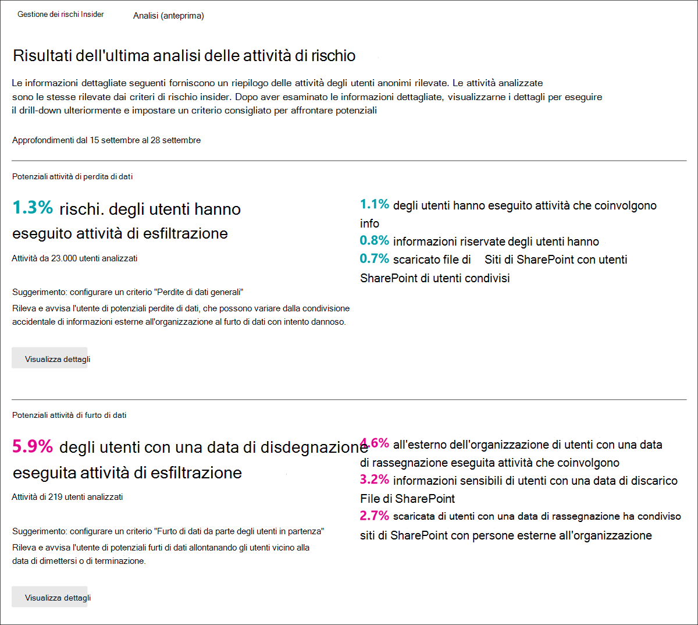

Per visualizzare ulteriori informazioni per una panoramica, selezionare **Visualizza dettagli** per visualizzare il riquadro dei dettagli per le informazioni dettagliate.To display more information for an insight, select **View details** to display the details pane for the insight. Il riquadro dei dettagli include i risultati completi delle  informazioni dettagliate, un suggerimento per i criteri di rischio insider e il pulsante Crea criterio per aiutarti rapidamente a creare i criteri consigliati.The details pane includes the complete insight results, an insider risk policy recommendation, and the **Create policy** button to quickly help you create the recommended policy. La selezione di Crea criterio consente di accedere alla procedura guidata dei criteri e di selezionare automaticamente il modello di criteri consigliato correlato alle informazioni dettagliate.Selecting Create policy takes you to the policy wizard and automatically selects the recommended policy template related to the insight. Ad esempio, se le  informazioni analitiche  sono relative all'attività di perdita di dati, il modello di criteri Perdite di dati generali verrà pre-selezionato nella procedura guidata per i criteri.For example, if the analytics insight is for *Data leak* activity, the *General data leaks* policy template will be pre-selected in the policy wizard for you.

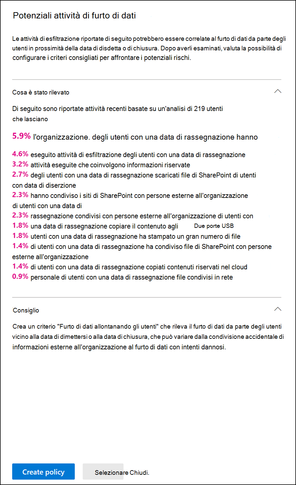

### Disattivare l'analisiTurn off analytics

Per disattivare l'analisi dei rischi insider, è necessario essere membri del gruppo di ruoli *Insider Risk Management,* *Insider Risk Management Admin* o Microsoft 365 Global *admin.*To turn off insider risk analytics, you must be a member of the *Insider Risk Management*, *Insider Risk Management Admin*, or Microsoft 365 *Global admin* role group. Dopo aver disabilitato l'analisi, i report analitici rimangono statici e non verranno aggiornati per i nuovi rischi.After you disable analytics, analytics insight reports will remain static and not be updated for new risks.

Completare la procedura seguente per disattivare l'analisi dei rischi insider:Complete the following steps to turn off insider risk analytics:

1. Nel Centro [conformità Microsoft 365](htttps://compliance.microsoft.com)passare a **Gestione dei rischi Insider.**In the [Microsoft 365 compliance center](htttps://compliance.microsoft.com), go to **Insider risk management**.
2. Seleziona **La pagina Analisi delle impostazioni dei rischi**  >  **Insider.**Select **Insider risk settings** > **Analytics** page.
3. Nella pagina **Analisi** disattivare Analizza **l'attività** utente del tenant per identificare potenziali rischi insider.On the **Analytics** page, turn off **Scan your tenant's user activity to identify potential insider risks**.