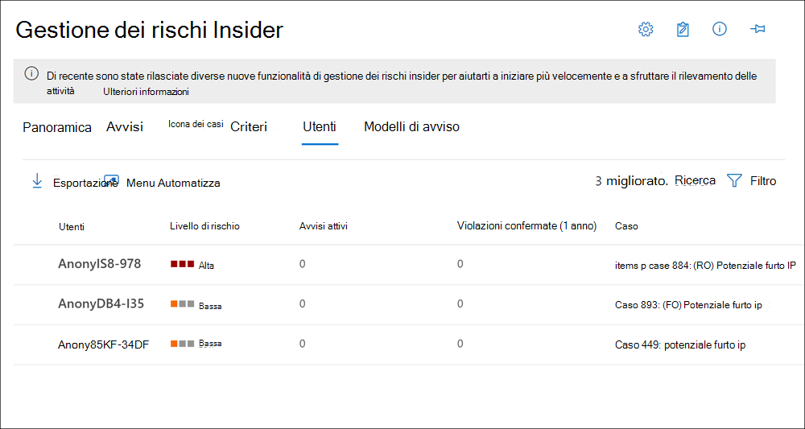

# Dashboard degli utenti di gestione dei rischi InsiderInsider risk management Users dashboard

Il **dashboard degli utenti** è uno strumento importante nel flusso di lavoro di gestione dei rischi Insider e aiuta gli investigatori e gli analisti a comprendere meglio le attività relative ai rischi.The **Users dashboard** is an important tool in the insider risk management workflow and helps investigators and analysts have a more complete understanding of risk activities. Questo dashboard offre visualizzazioni e funzionalità di gestione che soddisfano le esigenze amministrative tra i criteri di gestione dei rischi e la gestione dei rischi di insiderThis dashboard offers views and management features to meet administrative needs between the creating insider risk management policies and managing insider risk management cases.

Dopo aver aggiunto gli utenti ai criteri di gestione dei rischi Insider, i processi in background valutano automaticamente le attività utente per l' [attivazione degli indicatori](insider-risk-management-settings.md#indicators).After users are added to insider risk management policies, background processes are automatically evaluating user activities for [triggering indicators](insider-risk-management-settings.md#indicators). Dopo che sono presenti indicatori di attivazione, le attività degli utenti vengono assegnate ai punteggi dei rischi.After triggering indicators are present, user activities are assigned risk scores. Alcune di queste attività possono causare un avviso di rischio Insider, ma alcune attività potrebbero non essere in grado di raggiungere un livello di rischio minimo e non verrà creato un avviso di rischio Insider.Some of these activities may result in an insider risk alert, but some activities may not meet a minimum risk score level and an insider risk alert won't be created. Il **Dashboard utenti** consente di visualizzare gli utenti con questi tipi di indicatori e punteggi di rischio, nonché gli utenti che hanno avvisi di rischio attivi Insider.The **Users dashboard** allows you to view users with these types of indicators and risk scores, as well users that have active insider risk alerts.

È inoltre possibile che vi siano scenari in cui è necessario aggiungere temporaneamente gli utenti ai criteri di rischio Insider dopo che un evento insolito è stato segnalato all'esterno del flusso di lavoro di gestione dei rischi Insider.Additionally, there may be scenarios where you need to add temporarily users to insider risk policies after an unusual event is reported outside of the insider risk management workflow. Il **dashboard degli utenti** consente di aggiungere manualmente un utente a un criterio di rischio Insider per un determinato intervallo di tempo e di ignorare il requisito per un utente di avere un indicatore di attivazione.The **Users dashboard** allows you to manually add a user to an insider risk policy for a specific amount of time and bypass the requirement for a user to have a triggering indicator. Questi utenti vengono sempre visualizzati nel dashboard degli utenti quando vengono assegnati attivamente a un criterio.These users are always displayed in the Users dashboard when actively assigned to a policy.

Per ulteriori informazioni su come il dashboard degli utenti Visualizza gli utenti negli scenari seguenti:Learn more about how the Users dashboard displays users in the following scenarios:

- Utenti del dashboard con avvisi sui criteri di rischio Insider ActiveDashboard users with active insider risk policy alerts
- Utenti del dashboard con indicatori di attivazioneDashboard users with triggering indicators
- Gli utenti del dashboard sono stati aggiunti temporaneamente ai criteriDashboard users added temporarily to policies

## Utenti del dashboard con avvisi sui criteri di rischio Insider ActiveDashboard users with active insider risk policy alerts

Il **Dashboard utenti** Visualizza automaticamente tutti gli utenti con avvisi sui criteri di rischio Insider attivi.The **Users dashboard** automatically displays all users with active insider risk policy alerts. Questi utenti con avvisi dispongono sia di un indicatore di attivazione che di un punteggio di rischio di attività che soddisfa i requisiti per la creazione di un avviso di rischio Insider.These users with alerts have both a triggering indicator and an activity risk score that meets the requirements for creating an insider risk alert. Le attività per questi utenti vengono visualizzate selezionando l'utente nel **Dashboard utenti** e passando alla scheda **attività utente** .Activities for these users are viewed by selecting the user in the **Users dashboard** and navigating to the **User activity** tab.

## Utenti del dashboard con indicatori di attivazioneDashboard users with triggering indicators

Il **dashboard degli utenti** Visualizza automaticamente tutti gli utenti con indicatori di attivazione, ma che non hanno un punteggio di rischio di attività che potrebbe creare un avviso di rischio Insider.The **Users dashboard** automatically displays all users with triggering indicators, but that don't have an activity risk score that would create an insider risk alert. Ad esempio, un utente con una data di dimissioni segnalata viene visualizzato perché questo evento è un indicatore di attivazione ma non è un'attività che ha un punteggio di rischio.For example, a user with a reported resignation date is displayed because this event is a triggering indicator but isn't an activity that has a risk score. Le attività per questi utenti vengono visualizzate selezionando l'utente nel **Dashboard utenti** e passando alla scheda **attività utente** .Activities for these users are viewed by selecting the user in the **Users dashboard** and navigating to the **User activity** tab.

## Gli utenti del dashboard sono stati aggiunti temporaneamente ai criteriDashboard users added temporarily to policies

Il **dashboard degli utenti** consente di aggiungere temporaneamente gli utenti a un criterio di gestione dei rischi Insider esistente dopo un evento insolito al di fuori del flusso di lavoro di gestione dei rischi Insider.The **Users dashboard** allows you to temporarily add users to an existing insider risk management policy after an unusual event outside of the insider risk management workflow. L'aggiunta temporanea degli utenti è anche un modo per aggiungere gli utenti a un criterio di gestione dei rischi Insider per testare il criterio, anche se non è configurato un connettore obbligatorio.Temporarily adding users is also a way to add users to an insider risk management policy for testing the policy, even if a required connector isn't configured.

Quando un utente viene aggiunto manualmente a un criterio, le attività degli utenti per i 90 giorni precedenti vengono segnate e aggiunte alla sequenza temporale delle **attività dell'utente** .When a user is manually added to a policy, the user activities for the previous 90 days are scored and added to the **User activity** timeline. Ad esempio, un utente non presente nell'ambito di un criterio di rischio Insider e l'utente dispone di attività di perdita di dati segnalate al reparto legale dell'organizzazione.For example, a user not currently in-scope in an insider risk policy and the user has data leak activities reported to the legal department in your organization. Il reparto legale consiglia di configurare nuovi requisiti di monitoraggio a breve termine per l'utente.The legal department recommends that you configure new short-term monitoring requirements for the user. È possibile assegnare temporaneamente l'utente ai criteri di *perdita dei dati* per un periodo di tempo specificato (finestra di attivazione).You can temporarily assign the user to your *Data leaks* policy for a designated length of time (activation window). Tutti gli utenti aggiunti temporaneamente vengono visualizzati nel **dashboard degli utenti** perché i requisiti degli indicatori di trigger sono stati rinunziati.All users added temporarily are displayed in the **Users dashboard** because triggering indicator requirements are waived.

>[!NOTE]
>Potrebbe essere necessario diverse ore prima che i nuovi utenti aggiunti manualmente vengano visualizzati nel **dashboard degli utenti**.It may take several hours for new manually-added users to appear in the **Users dashboard**. Le attività per i 90 giorni precedenti per questi utenti possono richiedere fino a 24 ore per la visualizzazione.Activities for the previous 90 days for these users may take up to 24 hours to display. Per visualizzare le attività per gli utenti aggiunti manualmente, selezionare l'utente nel **Dashboard utenti** e aprire la scheda **attività utente** nel riquadro dei dettagli.To view activities for manually added users, select the user on the **Users dashboard** and open the **User activity** tab on the details pane.

L'utente viene automaticamente rimosso dal criterio Insider e dal **dashboard degli utenti** quando il tempo definito nella **finestra di attivazione** scade se:The user is automatically removed from the insider policy and the **Users dashboard** when the time defined in the **Activation window** expires if:

- l'utente non dispone di indicatori di attivazione o avvisi per i criteri di rischio Insider ethe user doesn't have any triggering indicators or insider risk policy alerts, and
- Se la durata della **finestra di attivazione** definita manualmente è più lunga rispetto alla durata della **finestra di attivazione** dei criteri globali.if the manually defined **Activation window** duration is longer than the global policy **Activation window** duration. 

L'impostazione della **finestra di attivazione** con la durata più lunga sostituisce sempre l'impostazione della **finestra di attivazione** con una durata più breve.The **Activation window** setting with the longest duration always overrides the **Activation window** setting with a shorter duration. Ad esempio, è stata configurata la **finestra di attivazione** sulla scheda **scadenze dei criteri** globali nelle impostazioni globali di gestione dei rischi Insider per 15 giorni, che viene applicata automaticamente a tutti i criteri di rischio Insider.For example, you've configured the **Activation window** on the global **Policy timeframes** tab in the insider risk management global settings for 15 days, which is automatically applied to all your insider risk policies. 

È possibile aggiungere temporaneamente un utente alle *perdite di dati* Insider Risk Policy e definire 30 giorni come la **finestra di attivazione** per questo utente.You temporarily add a user to your *Data leaks* insider risk policy and define 30 days as the **Activation window** for this user. L'impostazione della **finestra di attivazione** globale di 15 giorni viene ignorata definendo l'impostazione della finestra di **attivazione** di 30 giorni per l'utente temporaneamente aggiunto.The global **Activation window** setting of 15 days is overridden by defining the **Activation window** setting of 30 days for the temporarily added user. L'utente temporaneamente aggiunto rimarrà nel **dashboard degli utenti** e sarà nell'ambito del criterio per 30 giorni.The temporarily added user will remain in the **Users dashboard** and be in-scope for the policy for 30 days.

Nello scenario opposto, in cui l'impostazione della **finestra di attivazione** globale è più lunga **rispetto all'impostazione** definita per un utente temporaneamente aggiunto, l'impostazione della finestra di **attivazione** globale potrebbe ignorare l'impostazione della **finestra di attivazione** per l'utente temporaneamente aggiunto.In the opposite scenario where the global **Activation window** setting is longer than the **Activation window** setting defined for a temporarily added user, the global **Activation window** setting would override the **Activation window** setting for the temporarily added user. L'utente temporaneamente aggiunto rimarrà nel **dashboard degli utenti** e sarà nell'ambito del criterio per il numero di giorni definiti nelle impostazioni della finestra di **attivazione** globale.The temporarily added user will remain in the **Users dashboard** and be in-scope for the policy for the number of days defined in the global **Activation window** settings.

## Visualizzare le informazioni sull'utente nel dashboard degli utentiView user information on the Users dashboard

Ogni utente visualizzato nel **Dashboard utenti** dispone delle informazioni seguenti:Each user displayed in the **Users dashboard** has the following information:

- **Utenti**: il nome utente di un utente.**Users**: The username for a user. Questo campo è anonimi se l'impostazione di Anonymization globale per la gestione dei rischi Insider è abilitata.This field is anonymized if the global anonymization setting for insider risk management is enabled.
- **Livello di rischio**: il livello di rischio calcolato corrente dell'utente.**Risk level**: The current calculated risk level of the user. Questo punteggio viene calcolato ogni 24 ore e utilizza i punteggi dei rischi di avviso provenienti da tutti gli avvisi attivi associati all'utente.This score is calculated every 24 hours and uses the alert risk scores from all active alerts associated to the user. Per gli utenti con solo indicatori di attivazione, il livello di rischio è zero.For users with only triggering indicators, the risk level is zero.
- **Avvisi attivi**: il numero di avvisi attivi per tutti i criteri.**Active alerts**: The number of active alerts for all policies.
- **Violazioni confermate**: il numero di casi risolti come *violazioni dei criteri confermate* per l'utente.**Confirmed violations**: The number of cases resolved as *confirmed policy violation* for the user.
- **Caso**: il caso attivo corrente per l'utente.**Case**: The current active case for the user.

>[!NOTE]
>Il numero di utenti visualizzati nel **dashboard degli utenti** potrebbe essere limitato in alcuni casi, a seconda del volume degli avvisi attivi e dei criteri di corrispondenza.The number of users displayed on the **Users dashboard** may be limited in some instances, depending on the volume of active alerts and matching policies. Gli utenti con avvisi attivi vengono visualizzati nel **dashboard degli utenti** quando vengono generati gli avvisi e possono verificarsi casi rari in cui viene raggiunto il numero massimo di utenti visualizzati.Users with active alerts are displayed on the **Users dashboard** as the alerts are generated, and there may be rare cases when the maximum number of displayed users is reached. In questo caso, gli utenti con avvisi attivi che non vengono visualizzati verranno aggiunti al **dashboard degli utenti** , in quanto gli avvisi utente esistenti sono stati valutati.If this happens, users with active alerts who aren't displayed will be added to the **Users dashboard** as existing user alerts are triaged.

## Visualizzare i dettagli dell'utenteView user details

Per visualizzare ulteriori dettagli sull'attività di rischio per un utente, aprire il riquadro dei dettagli dell'utente facendo doppio clic su un utente nel **Dashboard utenti**.To view more details about risk activity for a user, open the user details pane by double-clicking a user in the **Users dashboard**. Nel riquadro dei dettagli, è possibile visualizzare le informazioni seguenti:On the details pane, you can view the following information:

- Scheda **profilo utente****User profile** tab
    - **Nome e titolo**: il nome e il titolo della posizione per l'utente da Azure Active Directory.**Name and title**: The name and position title for the user from Azure Active Directory. Questi campi utente saranno anonimi o vuoti se è abilitata l'impostazione Anonymization globale per la gestione dei rischi Insider.These user fields will be anonymized or empty if the global anonymization setting for insider risk management is enabled.
    - **Messaggio**di posta elettronica dell'utente: l'indirizzo di posta elettronica per l'utente.**User email**: The email address for the user.
    - **Alias**: l'alias di rete per l'utente.**Alias**: The network alias for the user.
    - **Organizzazione o reparto**: organizzazione o reparto dell'utente.**Organization or department**: The organization or department for the user.

- Scheda **attività utente****User activity** tab
    - **Cronologia delle attività degli utenti recenti**: elenca gli indicatori di attivazione e gli indicatori di rischio Insider per le attività degli utenti fino agli ultimi 180 giorni.**History of recent user activity**: Lists both triggering indicators and insider risk indicators for user activities up to the last 180 days. Vengono inoltre segnate tutte le attività pertinenti agli indicatori di rischio Insider, anche se le attività possono o meno generare un avviso di rischio Insider.All activities pertinent to insider risk indicators are also scored, though the activities may or may not have generated an insider risk alert. Gli esempi degli indicatori di attivazione possono essere una data di dimissioni o l'ultima data di lavoro pianificata per l'utente.Triggering indicator examples may be a resignation date or the last scheduled date of work for the user. Gli indicatori di rischio Insider sono attività determinate per avere un elemento di rischio e sono definite nei criteri in cui l'utente è incluso.Insider risk indicators are activities determined to have an element of risk and are defined in policies that the user is included in. Le attività relative a eventi e rischi sono elencate con l'elemento più recente elencato per primo.Event and risk activities are listed with the most recent item listed first.

## Aggiungere temporaneamente un utente a un criterioTemporarily add a user to a policy

Per aggiungere temporaneamente un utente a un criterio di gestione dei rischi Insider, si utilizzerà la scheda **utenti** nella soluzione di **gestione dei rischi Insider** nel centro conformità di Microsoft 365.To temporarily add a user to an insider risk management policy, you'll use the **Users** tab in the **Insider risk management** solution in the Microsoft 365 compliance center. Gli utenti hanno aggiunto manualmente il bypass dei requisiti degli indicatori di trigger per il criterio in cui vengono aggiunti e visualizzati nel **dashboard degli utenti**.Users added manually bypass triggering indicator requirements for the policy they are added to and are displayed in the **Users dashboard**. Per aggiungere definitivamente un utente a un criterio di gestione dei rischi Insider, è possibile utilizzare la procedura guidata per i criteri.To permanently add a user to an insider risk management policy, you'll use the policy wizard.

Completare la procedura seguente per aggiungere un utente a un criterio di rischio Insider esistente:Complete the following steps to add a user to an existing insider risk policy:

1. Nel [centro conformità di Microsoft 365](https://compliance.microsoft.com)accedere a **gestione dei rischi Insider** e selezionare la scheda **utenti** .In the [Microsoft 365 compliance center](https://compliance.microsoft.com), go to **Insider risk management** and select the **Users** tab.
2. Selezionare **Aggiungi un utente a un criterio** sulla barra degli strumenti.Select **Add a user to a policy** on the toolbar.
3. Nella finestra di dialogo **Aggiungi nuovo utente** , iniziare a digitare un nome utente nel campo **utente** .On the **Add a new user** dialog, start typing a user name in the **User** field. Selezionare l'utente che si desidera aggiungere a un criterio.Select the user you want to add to a policy.
4. Selezionare la freccia a discesa del campo **criterio** per visualizzare i criteri di gestione dei rischi Insider configurati.Select the dropdown arrow for the **Policy** field to display configured insider risk management policies. Selezionare il criterio a cui aggiungere l'utente.Select the policy to add the user to.
5. Utilizzare il controllo del dispositivo di scorrimento della **finestra di attivazione** per definire il periodo di tempo in cui l'utente è incluso in un criterio e visualizzato nel dashboard degli utenti.Use the **Activation window** slider control to define how long the user is included in a policy and displayed in the Users dashboard. L'ora specificata determina la durata del criterio attivo per l'utente e viene avviata quando viene generato il primo avviso o viene rilevato un indicatore di attivazione (come la corrispondenza di un criterio DLP).The time you specify determines how long the policy is active for this user and starts when the first alert is generated or a triggering indicator (like a DLP policy match) is detected. L'intervallo per la **finestra di attivazione** è compreso tra 5 e 30 giorni.The range for the **Activation window** is 5 to 30 days.
6. Selezionare **Aggiungi** e quindi **conferma** per aggiungere l'utente al criterio.Select **Add** and then **Confirm** to add the user to the policy.

>[!NOTE]
>Potrebbe essere necessario diverse ore prima che i nuovi utenti aggiunti manualmente vengano visualizzati nel **dashboard degli utenti**.It may take several hours for new manually-added users to appear in the **Users dashboard**. Le attività per i 90 giorni precedenti per questi utenti possono richiedere fino a 24 ore per la visualizzazione.Activities for the previous 90 days for these users may take up to 24 hours to display. Per visualizzare le attività per gli utenti aggiunti manualmente, selezionare l'utente nel **Dashboard utenti** e aprire la scheda **attività utente** nel riquadro dei dettagli.To view activities for manually added users, select the user on the **Users dashboard** and open the **User activity** tab on the details pane.
