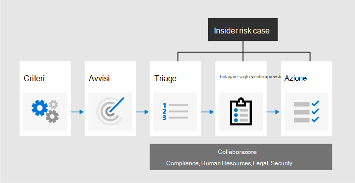
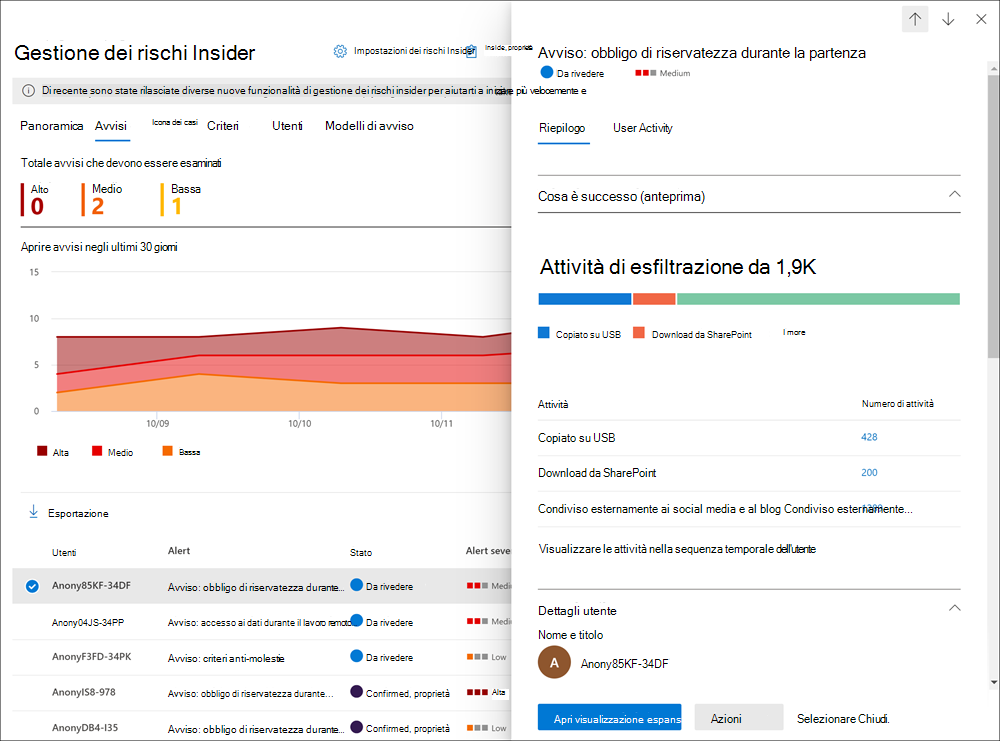
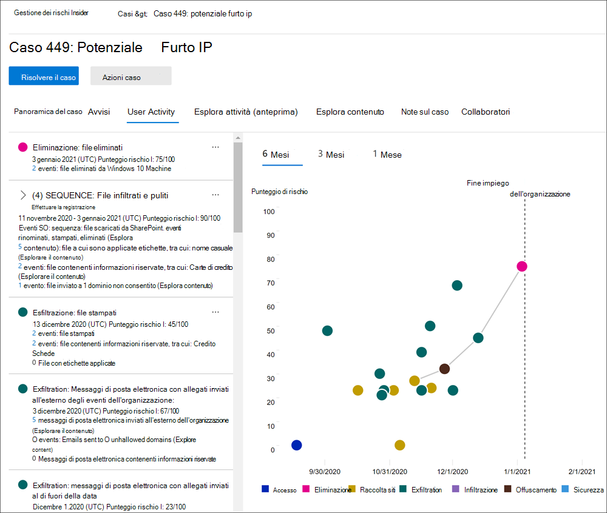

# Informazioni sulla gestione dei rischi insider in Microsoft 365Learn about insider risk management in Microsoft 365

La gestione dei rischi insider è una soluzione di conformità in Microsoft 365 che consente di ridurre al minimo i rischi interni consentendo di rilevare, analizzare e agire su attività dannose e involontarie nell'organizzazione.Insider risk management is a compliance solution in Microsoft 365 that helps minimize internal risks by enabling you to detect, investigate, and act on malicious and inadvertent activities in your organization. I criteri di rischio Insider consentono di definire i tipi di rischi da identificare e rilevare nell'organizzazione, inclusa l'azione sui casi e l'escalation dei casi a Microsoft Advanced eDiscovery se necessario.Insider risk policies allow you to define the types of risks to identify and detect in your organization, including acting on cases and escalating cases to Microsoft Advanced eDiscovery if needed. Gli analisti dei rischi nell'organizzazione possono intraprendere rapidamente azioni appropriate per assicurarsi che gli utenti siano conformi agli standard di conformità dell'organizzazione.Risk analysts in your organization can quickly take appropriate actions to make sure users are compliant with your organization's compliance standards.

Guarda il video seguente per scoprire in che modo la gestione dei rischi insider può aiutare l'organizzazione a prevenire, rilevare e contenere rischi, assegnando al tempo stesso la priorità ai valori, alla cultura e all'esperienza utente dell'organizzazione:Watch the video below to learn how insider risk management can help your organization prevent, detect, and contain risks while prioritizing your organization values, culture, and user experience:
 
 
>[!VIDEO https://www.microsoft.com/videoplayer/embed/RE4j9CN]

## Punti di rischio moderniModern risk pain points

Le attività di gestione e riduzione del rischio in un'organizzazione iniziano con la comprensione dei tipi di rischio riscontrati nei moderni ambienti di lavoro.Managing and minimizing risk in your organization starts with understanding the types of risks found in the modern workplace. Alcuni rischi sono guidati da eventi esterni e fattori esterni al controllo diretto.Some risks are driven by external events and factors that are outside of direct control. Altri rischi sono generati da eventi interni e attività utente che possono essere ridotte al minimo ed evitate.Other risks are driven by internal events and user activities that can be minimized and avoided. Alcuni esempi sono i rischi derivanti da comportamenti e azioni illegali, inappropriati, non autorizzati o non etici da parte degli utenti dell'organizzazione.Some examples are risks from illegal, inappropriate, unauthorized, or unethical behavior and actions by users in your organization. Questi comportamenti includono un'ampia gamma di rischi interni da parte degli utenti:These behaviors include a broad range of internal risks from users:

- Divulgazione di dati sensibili e fuga di datiLeaks of sensitive data and data spillage
- Violazioni della riservatezzaConfidentiality violations
- Furto della proprietà intellettualeIntellectual property (IP) theft
- FrodeFraud
- Insider tradingInsider trading
- Violazioni della conformità alle normativeRegulatory compliance violations

Gli utenti nell'ambiente di lavoro moderno hanno accesso alla creazione, alla gestione e alla condivisione dei dati in un'ampia gamma di piattaforme e servizi.Users in the modern workplace have access to create, manage, and share data across a broad spectrum of platforms and services. Nella maggior parte dei casi, le organizzazioni dispongono di risorse e strumenti limitati per identificare e ridurre i rischi a livello di organizzazione, oltre a soddisfare gli standard di privacy degli utenti.In most cases, organizations have limited resources and tools to identify and mitigate organization-wide risks while also meeting user privacy standards.

La gestione dei rischi insider usa l'intera gamma di indicatori di servizio e di terze parti per identificare, eseguire la valutazione e agire rapidamente sulle attività di rischio.Insider risk management uses the full breadth of service and 3rd-party indicators to help you quickly identify, triage, and act on risk activity. Utilizzando i log di Microsoft 365 e Microsoft Graph, la gestione dei rischi insider consente di definire criteri specifici per identificare gli indicatori di rischio.By using logs from Microsoft 365 and Microsoft Graph, insider risk management allows you to define specific policies to identify risk indicators. Questi criteri consentono di identificare le attività rischiose e di agire per attenuare tali rischi.These policies allow you to identify risky activities and to act to mitigate these risks.

La gestione dei rischi insider è centrata sui principi seguenti:Insider risk management is centered around the following principles:

- **Trasparenza:** bilanciare la privacy degli utenti rispetto ai rischi dell'organizzazione con l'architettura basata sulla privacy per progettazione.**Transparency**: Balance user privacy versus organization risk with privacy-by-design architecture.
- **Configurabile**: criteri configurabili in base a gruppi industriali, geografici e aziendali.**Configurable**: Configurable policies based on industry, geographical, and business groups.
- **Integrated**: flusso di lavoro integrato tra Microsoft 365 soluzioni di conformità.**Integrated**: Integrated workflow across Microsoft 365 compliance solutions.
- **Utilizzabile:** fornisce informazioni dettagliate per abilitare le notifiche dei revisori, le indagini sui dati e le indagini degli utenti.**Actionable**: Provides insights to enable reviewer notifications, data investigations, and user investigations.

## Identificazione dei rischi potenziali con l'analisi (anteprima)Identifying potential risks with analytics (preview)

L'analisi del rischio Insider consente di condurre una valutazione dei potenziali rischi insider nell'organizzazione senza configurare criteri di rischio Insider.Insider risk analytics enables you to conduct an evaluation of potential insider risks in your organization without configuring any insider risk policies. Questa valutazione può aiutare l'organizzazione a identificare le potenziali aree con rischio utente più elevato e a determinare il tipo e l'ambito dei criteri di gestione dei rischi Insider che può essere opportuno configurare.This evaluation can help your organization identify potential areas of higher user risk and help determine the type and scope of insider risk management policies you may consider configuring. Questa valutazione può anche aiutare a determinare le esigenze di ulteriori licenze o l'ottimizzazione futura dei criteri di rischio insider esistenti.This evaluation may also help you determine needs for additional licensing or future optimization of existing insider risk policies.

Per altre informazioni sull'analisi dei rischi insider, vedi Impostazioni di gestione dei rischi [insider: Analisi.](insider-risk-management-settings.md#analytics-preview)To learn more about insider risk analytics, see [Insider risk management settings: Analytics](insider-risk-management-settings.md#analytics-preview).

## Flusso di lavoroWorkflow

Il flusso di lavoro per la gestione dei rischi insider consente di identificare, analizzare e intervenire per affrontare i rischi interni nell'organizzazione.The insider risk management workflow helps you identify, investigate, and take action to address internal risks in your organization. Con i modelli di criteri mirati, la segnalazione completa delle attività nel servizio Microsoft 365 e gli strumenti di gestione di avvisi e casi, puoi usare informazioni dettagliate utili per identificare e agire rapidamente su comportamenti rischiosi.With focused policy templates, comprehensive activity signaling across the Microsoft 365 service, and alert and case management tools, you can use actionable insights to quickly identify and act on risky behavior.

L'identificazione e risoluzione delle attività di rischio interno e dei problemi di conformità con la gestione dei rischi Insider in Microsoft 365 si basa sul seguente flusso di lavoro:Identifying and resolving internal risk activities and compliance issues with insider risk management in Microsoft 365 uses the following workflow:

### CriteriPolicies

[I criteri di gestione dei](insider-risk-management-policies.md) rischi Insider vengono creati utilizzando modelli predefiniti e condizioni dei criteri che definiscono quali eventi di attivazione e indicatori di rischio vengono esaminati nell'organizzazione.[Insider risk management policies](insider-risk-management-policies.md) are created using pre-defined templates and policy conditions that define what triggering events and risk indicators are examined in your organization. Queste condizioni includono la modalità di utilizzo degli indicatori di rischio per gli avvisi, gli utenti inclusi nel criterio, la priorità dei servizi e il periodo di tempo di monitoraggio.These conditions include how risk indicators are used for alerts, what users are included in the policy, which services are prioritized, and the monitoring time period.

È possibile selezionare uno dei modelli di criteri seguenti per iniziare rapidamente a usare la gestione dei rischi insider:You can select from the following policy templates to quickly get started with insider risk management:

- [Furto di dati da parte di utenti che lasciano l'organizzazioneData theft by departing users](insider-risk-management-policies.md#data-theft-by-departing-users)
- [Fughe di dati generaliGeneral data leaks](insider-risk-management-policies.md#general-data-leaks)
- [Perdita di dati per utenti con priorità (anteprima)Data leaks by priority users (preview)](insider-risk-management-policies.md#data-leaks-by-priority-users-preview)
- [Perdite di dati da parte di utenti scontenti (anteprima)Data leaks by disgruntled users (preview)](insider-risk-management-policies.md#data-leaks-by-disgruntled-users-preview)
- [Violazioni dei criteri di sicurezza generali (anteprima)General security policy violations (preview)](insider-risk-management-policies.md#general-security-policy-violations-preview)
- [Violazioni dei criteri di sicurezza da parte di utenti che lasciano l'organizzazione (anteprima)Security policy violations by departing users (preview)](insider-risk-management-policies.md#security-policy-violations-by-departing-users-preview)
- [Violazioni dei criteri di sicurezza per utenti con priorità (anteprima)Security policy violations by priority users (preview)](insider-risk-management-policies.md#security-policy-violations-by-priority-users-preview)
- [Violazioni dei criteri di sicurezza da parte di utenti scontenti (anteprima)Security policy violations by disgruntled users (preview)](insider-risk-management-policies.md#security-policy-violations-by-disgruntled-users-preview)

### AvvisiAlerts

Gli avvisi vengono generati automaticamente dagli indicatori di rischio che soddisfano le condizioni dei criteri e vengono visualizzati nel [dashboard Avvisi.](insider-risk-management-alerts.md)Alerts are automatically generated by risk indicators that match policy conditions and are displayed in the [Alerts dashboard](insider-risk-management-alerts.md). Tale dashboard offre una vista rapida di tutti gli avvisi che necessitano di revisione, della loro creazione nel tempo e statistiche sugli avvisi dell'organizzazione.This dashboard enables a quick view of all alerts needing review, open alerts over time, and alert statistics for your organization. Tutti gli avvisi dei criteri vengono visualizzati con le informazioni seguenti per identificare rapidamente lo stato degli avvisi esistenti e dei nuovi avvisi che necessitano di azioni:All policy alerts are displayed with the following information to help you quickly identify the status of existing alerts and new alerts that need action:

- StatoStatus
- GravitàSeverity
- Tempo rilevatoTime detected
- CasoCase
- Stato del casoCase status

### TriageTriage

Le nuove attività utente che necessitano di analisi generano automaticamente avvisi a cui è assegnato lo *stato Revisione* esigenze.New user activities that need investigation automatically generate alerts that are assigned a *Needs review* status. I revisori possono identificare e rivedere, valutare e valutare rapidamente questi avvisi.Reviewers can quickly identify and review, evaluate, and triage these alerts.

Gli avvisi vengono risolti aprendo un nuovo caso, assegnando l'avviso a un caso già esistente oppure ignorandolo.Alerts are resolved by opening a new case, assigning the alert to an existing case, or dismissing the alert. Usando i filtri di avviso, è facile identificare rapidamente gli avvisi in base allo stato, alla gravità o al tempo rilevato.Using alert filters, it's easy to quickly identify alerts by status, severity, or time detected. Nell'ambito del processo di valutazione, i revisori possono visualizzare i dettagli dell'avviso per le attività identificate dal criterio, visualizzare le attività utente associate alla corrispondenza dei criteri, vedere la gravità dell'avviso ed esaminare le informazioni del profilo utente.As part of the triage process, reviewers can view alert details for the activities identified by the policy, view user activity associated with the policy match, see the severity of the alert, and review user profile information.

### InvestigareInvestigate

[I](insider-risk-management-cases.md) casi vengono creati per gli avvisi che richiedono una revisione e un'analisi più approfondite dei dettagli dell'attività e delle circostanze relative alla corrispondenza dei criteri.[Cases](insider-risk-management-cases.md) are created for alerts that require deeper review and investigation of the activity details and circumstances around the policy match. La **dashboard dei casi** offre una visione d'insieme di tutti i casi attivi, dei casi aperti nel tempo e delle relative statistiche dell'organizzazione.The **Case dashboard** provides an all-up view of all active cases, open cases over time, and case statistics for your organization. I revisori possono filtrare rapidamente i casi in base allo stato, alla data di apertura del caso e alla data dell'ultimo aggiornamento del caso.Reviewers can quickly filter cases by status, the date the case was opened, and the date the case was last updated.

Selezionando un caso in tale dashboard, si aprirà il caso per l'indagine e la revisione.Selecting a case on the case dashboard opens the case for investigation and review. Questo passaggio è il cuore del flusso di lavoro per la gestione dei rischi insider.This step is the heart of the insider risk management workflow. In quest'area le attività di rischio, le condizioni dei criteri, i dettagli degli avvisi e i dettagli degli utenti vengono sintetizzati in una visualizzazione integrata per i revisori.This area is where risk activities, policy conditions, alerts details, and user details are synthesized into an integrated view for reviewers. Gli strumenti di indagine principali in quest'area sono:The primary investigation tools in this area are:

- **Attività utente**: l'attività dell'utente viene visualizzata automaticamente in un grafico interattivo che traccia le attività nel tempo e in base al livello di rischio per le attività di rischio correnti o passate.**User activity**: User activity is automatically displayed in an interactive chart that plots activities over time and by risk level for current or past risk activities. I revisori possono filtrare e visualizzare rapidamente l'intera cronologia dei rischi per l'utente ed esaminare attività specifiche per ulteriori dettagli.Reviewers can quickly filter and view the entire risk history for the user and drill into specific activities for more details.
- **Esplora contenuto:** tutti i file di dati e i messaggi di posta elettronica associati alle attività di avviso vengono acquisiti e visualizzati automaticamente in Esplora contenuto.**Content explorer**: All data files and email messages associated with alert activities are automatically captured and displayed in the Content explorer. I revisori possono filtrare e visualizzare file e messaggi in base all'origine dati, al tipo di file, ai tag, alla conversazione e a molti altri attributi.Reviewers can filter and view files and messages by data source, file type, tags, conversation, and many more attributes.
- **Note caso:** i revisori possono fornire note per un caso nella sezione Note caso.**Case notes**: Reviewers can provide notes for a case in the Case Notes section. Questo elenco consolida tutte le note in una visualizzazione centrale e include le informazioni relative al revisore e alla data di invio.This list consolidates all notes in a central view and include reviewer and date submitted information.

Inoltre, il nuovo log di controllo [(anteprima)](insider-risk-management-audit-log.md) consente di rimanere informati sulle azioni intraprese sulle funzionalità di gestione dei rischi insider.Additionally, the new [Audit log (preview)](insider-risk-management-audit-log.md) enables you to stay informed of the actions that were taken on insider risk management features. Questa risorsa consente una revisione indipendente delle azioni intraprese dagli utenti assegnati a uno o più gruppi di ruoli di gestione dei rischi insider.This resource allows an independent review of the actions taken by users assigned to one or more insider risk management role groups.

### AzioneAction

Dopo l'analisi dei casi, i revisori possono agire rapidamente per risolvere il caso o collaborare con altre parti interessate al rischio nell'organizzazione.After cases are investigated, reviewers can quickly act to resolve the case or collaborate with other risk stakeholders in your organization. Se gli utenti violano accidentalmente o inavvertitamente le condizioni dei criteri, è possibile inviare all'utente un semplice promemoria dai modelli di avviso che è possibile personalizzare per l'organizzazione.If users accidentally or inadvertently violate policy conditions, a simple reminder notice can be sent to the user from notice templates you can customize for your organization. Questi avvisi possono essere utilizzati come semplici promemoria o possono indirizzare l'utente a corsi di aggiornamento o indicazioni per evitare comportamenti futuri rischiosi.These notices may serve as simple reminders or may direct the user to refresher training or guidance to help prevent future risky behavior. Per ulteriori informazioni, consultare la sezione [Modelli di notifica per la gestione dei rischi Insider](insider-risk-management-notices.md).For more information, see [Insider risk management notice templates](insider-risk-management-notices.md).

Nelle situazioni più gravi potrebbe essere necessario condividere le informazioni sul caso di gestione dei rischi insider con altri revisori o servizi dell'organizzazione.In the more serious situations, you may need to share the insider risk management case information with other reviewers or services in your organization. La gestione dei rischi insider è strettamente integrata con altre Microsoft 365 di conformità per facilitare la risoluzione dei rischi end-to-end.Insider risk management is tightly integrated with other Microsoft 365 compliance solutions to help you with end-to-end risk resolution.

- **Advanced eDiscovery**: l'escalation di un caso di indagine consente di trasferire i dati e la gestione del caso Advanced eDiscovery in Microsoft 365.**Advanced eDiscovery**: Escalating a case for investigation allows you to transfer data and management of the case to Advanced eDiscovery in Microsoft 365. La soluzione Advanced eDiscovery offre un flusso di lavoro end-to-end per conservare, raccogliere, rivedere, analizzare ed esportare contenuti rilevanti per le indagini interne ed esterne dell'organizzazione.Advanced eDiscovery provides an end-to-end workflow to preserve, collect, review, analyze, and export content that's responsive to your organization's internal and external investigations. Consente ai team legali di gestire l'intero flusso di lavoro per le notifiche di blocco a fini giudiziari.It allows legal teams to manage the entire legal hold notification workflow. Per maggiori informazioni sui casi di Advanced eDiscovery, consultare la [Panoramica di Advanced eDiscovery in Microsoft 365](overview-ediscovery-20.md).To learn more about Advanced eDiscovery cases, see [Overview of Advanced eDiscovery in Microsoft 365](overview-ediscovery-20.md).
- integrazione delle API di gestione di **Office 365 (anteprima):** la gestione dei rischi Insider supporta l'esportazione delle informazioni sugli avvisi nei servizi siem (Security Information and Event Management) tramite le API di Office 365 Management.**Office 365 Management APIs integration (preview)**: Insider risk management supports exporting alert information to security information and event management (SIEM) services via the Office 365 Management APIs. L'accesso alle informazioni sugli avvisi nella piattaforma più adatto ai processi di rischio dell'organizzazione offre maggiore flessibilità nell'agire sulle attività a rischio.Having access to alert information in the platform the best fits your organization's risk processes gives you more flexibility in how to act on risk activities. Per altre informazioni sull'esportazione delle informazioni sugli avvisi con Office 365 Management API, vedi [Esportare avvisi.](insider-risk-management-settings.md#export-alerts-preview)To learn more about exporting alert information with Office 365 Management APIs, see [Export alerts](insider-risk-management-settings.md#export-alerts-preview).

> [!NOTE]
> Grazie per il feedback e il supporto durante l'anteprima del connettore ServiceNow.Thank you for your feedback and support during the preview of the ServiceNow connector. Abbiamo deciso di terminare l'anteprima del connettore ServiceNow e interrompere il supporto nella gestione dei rischi insider il 30 novembre 2020.We've decided to end the preview of ServiceNow connector and discontinue support in insider risk management on November 30, 2020. Stiamo valutando attivamente metodi alternativi per fornire ai clienti l'integrazione di ServiceNow nella gestione dei rischi insider.We are actively evaluating alternative methods to provide customers with ServiceNow integration in insider risk management.

## ScenariScenarios

La gestione dei rischi insider consente di rilevare, analizzare e intervenire per ridurre i rischi interni nell'organizzazione in diversi scenari comuni:Insider risk management can help you detect, investigate, and take action to mitigate internal risks in your organization in several common scenarios:

### Furto di dati da parte di utenti che lasciano l'organizzazioneData theft by departing users

Quando gli utenti lasciano un'organizzazione, volontariamente o come risultato della risoluzione, spesso vi sono dubbi legittimi che i dati aziendali, dei clienti e degli utenti siano a rischio.When users leave an organization, either voluntarily or as the result of termination, there is often legitimate concerns that company, customer, and user data are at risk. Gli utenti possono presupporre che i dati del progetto non siano proprietari oppure potrebbero essere tentati di prendere i dati aziendali per ottenere profitti personali e violare i criteri aziendali e gli standard legali.Users may innocently assume that project data isn't proprietary, or they may be tempted to take company data for personal gain and in violation of company policy and legal standards. I criteri di gestione  dei rischi insider che utilizzano il modello di criteri Furto di dati usurpando gli utenti rilevano automaticamente le attività in genere associate a questo tipo di furto.Insider risk management policies that use the [Data theft by departing users](insider-risk-management-policies.md#policy-templates) policy template automatically detect activities typically associated with this type of theft. Con questo criterio, riceverai automaticamente avvisi per le attività sospette associate al furto di dati allontanando gli utenti in modo da poter intraprendere azioni investigative appropriate.With this policy, you'll automatically receive alerts for suspicious activities associated with data theft by departing users so you can take appropriate investigative actions. Per questo modello di Microsoft 365 è necessaria la configurazione di un [connettore per](import-hr-data.md) le risorse umane per l'organizzazione.Configuring a [Microsoft 365 HR connector](import-hr-data.md) for your organization is required for this policy template.

### Perdita intenzionale o involontaria di informazioni riservate o riservateIntentional or unintentional leak of sensitive or confidential information

Nella maggior parte dei casi, gli utenti cercano di gestire correttamente le informazioni riservate o riservate.In most cases, users try their best to properly handle sensitive or confidential information. Tuttavia, a volte gli utenti possono commettere errori e le informazioni vengono condivise accidentalmente all'esterno dell'organizzazione o in violazione dei criteri di protezione delle informazioni.But occasionally users may make mistakes and information is accidentally shared outside your organization or in violation of your information protection policies. In altre circostanze, gli utenti possono intenzionalmente perdere o condividere informazioni riservate e riservate con intenti dannosi e per potenziali guadagni personali.In other circumstances, users may intentionally leak or share sensitive and confidential information with malicious intent and for potential personal gain. I criteri di gestione dei rischi insider creati utilizzando i modelli di criteri perdite di dati rilevano automaticamente le attività in genere associate alla condivisione di informazioni riservate o riservate:Insider risk management policies created using the following Data leaks policy templates automatically detect activities typically associated with sharing sensitive or confidential information:

- [Fughe di dati generaliGeneral data leaks](insider-risk-management-policies.md#general-data-leaks)
- [Perdita di dati per utenti con priorità (anteprima)Data leaks by priority users (preview)](insider-risk-management-policies.md#data-leaks-by-priority-users-preview)
- [Perdite di dati da parte di utenti scontenti (anteprima)Data leaks by disgruntled users (preview)](insider-risk-management-policies.md#data-leaks-by-disgruntled-users-preview)

## Violazioni intenzionali o involontarie dei criteri di sicurezza (anteprima)Intentional or unintentional security policy violations (preview)

Gli utenti hanno in genere un ampio livello di controllo quando gestiscono i propri dispositivi nell'ambiente di lavoro moderno.Users typically have a large degree of control when managing their devices in the modern workplace. Questo controllo può includere le autorizzazioni per installare o disinstallare le applicazioni necessarie per le prestazioni dei propri compiti o la possibilità di disabilitare temporaneamente le funzionalità di sicurezza del dispositivo.This control may include permissions to install or uninstall applications needed in the performance of their duties or the ability to temporarily disable device security features. Se questa attività è accidentale, accidentale o dannosa, questo comportamento può rappresentare un rischio per l'organizzazione ed è importante identificare e agire per ridurre al minimo.Whether this activity is inadvertent, accidental, or malicious, this conduct can pose risk to your organization and is important to identify and act to minimize. Per consentire l'identità di queste attività di sicurezza rischiose, i modelli di violazione dei criteri di sicurezza della gestione dei rischi insider seguenti segnano gli indicatori di rischio per la sicurezza e utilizzano Gli avvisi di Microsoft Defender for Endpoint per fornire informazioni dettagliate per le attività correlate alla sicurezza:To help identity these risky security activities, the following insider risk management security policy violation templates scores security risk indicators and uses Microsoft Defender for Endpoint alerts to provide insights for security-related activities:

- [Violazioni dei criteri di sicurezza generali (anteprima)General security policy violations (preview)](insider-risk-management-policies.md#general-security-policy-violations-preview)
- [Violazioni dei criteri di sicurezza da parte di utenti che lasciano l'organizzazione (anteprima)Security policy violations by departing users (preview)](insider-risk-management-policies.md#security-policy-violations-by-departing-users-preview)
- [Violazioni dei criteri di sicurezza per utenti con priorità (anteprima)Security policy violations by priority users (preview)](insider-risk-management-policies.md#security-policy-violations-by-priority-users-preview)
- [Violazioni dei criteri di sicurezza da parte di utenti scontenti (anteprima)Security policy violations by disgruntled users (preview)](insider-risk-management-policies.md#security-policy-violations-by-disgruntled-users-preview)

## Criteri per gli utenti in base alla posizione, al livello di accesso o alla cronologia dei rischi (anteprima)Policies for users based on position, access level, or risk history (preview)

Gli utenti dell'organizzazione possono avere livelli di rischio diversi a seconda della posizione, del livello di accesso alle informazioni riservate o della cronologia dei rischi.Users in your organization may have different levels of risk depending on their position, level of access to sensitive information, or risk history. Questa struttura può includere membri del team dirigenziale dell'organizzazione, amministratori IT con privilegi di accesso alla rete e dati estesi o utenti con una cronologia passata di attività rischiose.This structure may include members of your organization's executive leadership team, IT administrators that have extensive data and network access privileges, or users with a past history of risky activities. In questi casi, un'ispezione più approfondita e un punteggio di rischio più aggressivo sono importanti per consentire la visualizzazione di avvisi per indagini e azioni rapide.In these circumstances, closer inspection and more aggressive risk scoring are important to help surface alerts for investigation and quick action. Per identificare le attività rischiose per questi tipi di utenti, è possibile creare gruppi di utenti con priorità e creare criteri dai modelli di criteri seguenti:To help identify risky activities for these types of users, you can create priority user groups and create policies from the following policy templates:

- [Violazioni dei criteri di sicurezza per utenti con priorità (anteprima)Security policy violations by priority users (preview)](insider-risk-management-policies.md#security-policy-violations-by-priority-users-preview)
- [Perdita di dati per utenti con priorità (anteprima)Data leaks by priority users (preview)](insider-risk-management-policies.md#data-leaks-by-priority-users-preview)

## Azioni e comportamenti da parte di utenti scontenti (anteprima)Actions and behaviors by disgruntled users (preview)

Gli eventi di stress per l'impiego possono influire sul comportamento degli utenti in diversi modi correlati ai rischi insider.Employment stresses events can impact user behavior in several ways that relate to insider risks. Questi stress possono essere una revisione delle prestazioni scarsa, un abbassamento di livello della posizione o il posizionamento dell'utente in un piano di revisione delle prestazioni.These stressors may be a poor performance review, a position demotion, or the user being placement on a performance review plan. Sebbene la maggior parte degli utenti non risponda in modo dannoso a questi eventi, lo stress di queste azioni può comportare l'esecuzione di azioni che in genere potrebbero non prendere in considerazione in circostanze normali.Though most users do not respond maliciously to these events, the stress of these actions may result in some users to take actions they may not normally consider during normal circumstances. Per facilitare l'identità di questi tipi di attività rischiose, i modelli di criteri di gestione dei rischi insider seguenti utilizzano il connettore risorse umane di Microsoft 365 e iniziano a segnare indicatori di rischio relativi a comportamenti che possono verificarsi in prossimità di eventi di stress da lavoro:To help identity these types risky activities, the following insider risk management policy templates use the Microsoft 365 HR connector and starts scoring risk indicators relating to behaviors that may occur near employment stressor events:

- [Perdite di dati da parte di utenti scontenti (anteprima)Data leaks by disgruntled users (preview)](insider-risk-management-policies.md#data-leaks-by-disgruntled-users-preview)
- [Violazioni dei criteri di sicurezza da parte di utenti scontenti (anteprima)Security policy violations by disgruntled users (preview)](insider-risk-management-policies.md#security-policy-violations-by-disgruntled-users-preview)

## Pronti per iniziare?Ready to get started?

- Per [informazioni su come preparare l'abilitazione](insider-risk-management-plan.md) dei criteri di gestione dei rischi insider nell'organizzazione, vedere Plan for insider risk management.See [Plan for insider risk management](insider-risk-management-plan.md) for how to prepare to enable insider risk management policies in your organization.
- Vedi [Introduzione alle impostazioni di gestione dei rischi insider](insider-risk-management-settings.md) per configurare le impostazioni globali per i criteri di rischio insider.See [Get started with insider risk management settings](insider-risk-management-settings.md) to configure global settings for insider risk policies.
- Vedi [Introduzione alla gestione dei rischi insider](insider-risk-management-configure.md) per configurare i prerequisiti, creare criteri e iniziare a ricevere avvisi.See [Get started with insider risk management](insider-risk-management-configure.md) to configure prerequisites, create policies, and start receiving alerts.
