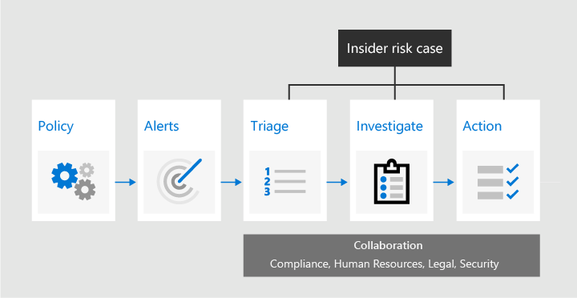

# Gestione dei rischi insider in Microsoft 365 (anteprima)

La gestione dei rischi Insider è una soluzione a rischio interno in Microsoft 365 che consente di ridurre al minimo i rischi interni, consentendo di rilevare, indagare ed eseguire azioni sulle attività a rischio nell'organizzazione. I criteri personalizzati consentono di rilevare e intervenire sulle attività di rischio dannose e involontarie nell'organizzazione, inclusi i casi di escalation ad altre soluzioni di analisi di Microsoft 365, se necessario. Gli analisti di rischio nell'organizzazione possono rapidamente prendere le azioni appropriate per assicurarsi che gli utenti siano conformi agli standard di conformità dell'organizzazione.

Guardare il video seguente per informazioni su come la gestione dei rischi Insider può aiutare l'organizzazione a prevenire, rilevare e contenere i rischi durante la definizione di priorità per i valori dell'organizzazione, la cultura e l'esperienza dipendente:
 
 
>[!VIDEO https://www.microsoft.com/videoplayer/embed/RE4j9CN]

## Punti di dolore ai rischi moderni

La gestione e la riduzione dei rischi all'interno dell'organizzazione iniziano con la comprensione dei tipi di rischi riscontrati nei luoghi di lavoro moderni. Alcuni rischi sono basati su eventi e fattori esterni e sono al di fuori del controllo diretto. Altri rischi sono basati su eventi interni e attività dei dipendenti che possono essere eliminati ed evitati. Alcuni esempi sono i rischi derivanti da comportamenti illegali, inadeguati, non autorizzati o non etici e dalle azioni da parte di dipendenti e Manager. Tali comportamenti includono una vasta gamma di rischi interni provenienti dai dipendenti:

- Perdite di dati sensibili e fuoriuscita di dati
- Violazioni della riservatezza
- Furto di proprietà intellettuale (IP)
- Frodi
- Insider Trading
- Violazioni della conformità alle normative

Gli impiegati del posto di lavoro moderno hanno accesso alla creazione, gestione e condivisione dei dati in un ampio spettro di piattaforme e servizi. Nella maggior parte dei casi, le organizzazioni dispongono di risorse e strumenti limitati per identificare e mitigare i rischi a livello di organizzazione, ma anche per soddisfare gli standard sulla privacy dei dipendenti.

La gestione dei rischi insider in Microsoft 365 utilizza l'intera gamma di indicatori di servizio e di terze parti che consentono di identificare rapidamente, valutare e intraprendere azioni sull'attività di rischio. Utilizzando i log di Office 365 e Microsoft Graph, Insider Risk Management consente di definire criteri specifici per identificare gli indicatori di rischio. Questi criteri consentono di identificare le attività rischiose e di intervenire per attenuare tali rischi.

La gestione dei rischi Insider è incentrata sui seguenti principi:

- **Trasparenza**: bilanciare la privacy dei dipendenti rispetto ai rischi dell'organizzazione con l'architettura privacy-by-Design.
- **Configurabile**: criteri configurabili basati su gruppi industriali, geografici e aziendali.
- **Integrated**: workflow integrato tra le soluzioni di conformità di Microsoft 365.
- **Azione**: fornisce informazioni per abilitare le notifiche dei dipendenti, le indagini sui dati e le indagini sui dipendenti.

## Flusso di lavoro

La gestione dei rischi Insider aiuta a identificare, indagare ed intervenire per risolvere i rischi interni nell'organizzazione. Con i modelli di criteri focalizzati, la segnalazione di attività complete su tutto il servizio Microsoft 365 e un flusso di lavoro flessibile, è possibile utilizzare informazioni utili per identificare e risolvere rapidamente i comportamenti a rischio.

L'identificazione e la risoluzione delle attività a rischio interno e i problemi di conformità con la gestione dei rischi insider in Microsoft 365 utilizzano il flusso di lavoro seguente:

### Generali

I criteri di gestione dei rischi Insider vengono creati utilizzando modelli predefiniti e condizioni di criteri che definiscono gli indicatori di rischio esaminati nelle aree di funzionalità di Microsoft 365. Queste condizioni includono la modalità di utilizzo degli indicatori per gli avvisi, gli utenti inclusi nel criterio, quali sono le priorità dei servizi e il periodo di tempo di monitoraggio.

È possibile scegliere tra i seguenti [modelli di criteri](insider-risk-management-policies.md#policy-templates) per iniziare rapidamente a utilizzare la gestione dei rischi Insider:

- Furto dei dati del dipendente in partenza
- Perdite di dati
- Lingua offensiva nella comunicazione

Per ulteriori informazioni, vedere [criteri di gestione dei rischi Insider](insider-risk-management-policies.md).

### Avvisi

Gli avvisi vengono generati automaticamente da indicatori di rischio che soddisfano le condizioni dei criteri e vengono visualizzati nel **Dashboard avvisi**. Questo dashboard consente di visualizzare rapidamente tutti gli avvisi che richiedono la revisione, gli avvisi aperti nel tempo e le statistiche di avviso per la propria organizzazione. Tutti gli avvisi dei criteri vengono visualizzati con le informazioni associate che consentono di identificare rapidamente lo stato corrente degli avvisi esistenti e dei nuovi avvisi che richiedono un'azione:

- Stato
- Gravità
- Tempo rilevato
- Caso
- Stato del caso

Per ulteriori informazioni, vedere [avvisi sulla gestione dei rischi Insider](insider-risk-management-alerts.md).

### Triage

Le nuove attività che richiedono l'analisi generano automaticamente gli avvisi a cui è stato assegnato lo stato di *revisione dei requisiti* . I revisori possono identificare rapidamente gli avvisi e scorrere ciascuno di essi per la valutazione e la valutazione. 

Gli avvisi vengono risolti aprendo un nuovo caso, assegnando l'avviso a un caso esistente o ignorando l'avviso. Utilizzando i filtri di avviso, è facile identificare rapidamente gli avvisi in base allo stato, alla gravità o al tempo rilevato. Nell'ambito del processo di valutazione, i revisori possono visualizzare i dettagli degli avvisi per la corrispondenza dei criteri, visualizzare le attività degli utenti associati alla corrispondenza, vedere la gravità dell'avviso e verificare le informazioni sui profili utente.

### Analizzare

I casi vengono creati per gli avvisi che richiedono una revisione e un'analisi approfondita dei dettagli e delle circostanze attorno alla corrispondenza dei criteri. Il **Dashboard del caso** fornisce una visualizzazione all-up di tutti i casi attivi, dei casi aperti nel tempo e delle statistiche del caso per l'organizzazione. I revisori possono filtrare rapidamente i casi in base allo stato, la data in cui è stato aperto il caso e la data in cui è stato aggiornato l'ultimo caso.

Se si seleziona un caso nel dashboard del caso, verrà aperta la causa per l'analisi e la revisione. Questo passaggio è il fulcro del flusso di lavoro di gestione dei rischi Insider. Questa è l'area in cui gli indicatori di attività di rischio, le condizioni dei criteri, i dettagli degli avvisi e i dettagli dei dipendenti vengono sintetizzati in una visualizzazione integrata per i revisori. Gli strumenti principali di indagine in questo campo sono:

- **Attività utente**: l'attività dell'utente viene visualizzata automaticamente in un grafico interattivo che traccia le attività a rischio nel tempo e a livello di rischio per le attività di rischio correnti o precedenti. I revisori possono rapidamente filtrare e visualizzare l'intera cronologia dei rischi per il dipendente e analizzare attività specifiche per ulteriori dettagli.
- **Content Explorer**: tutti i file di dati e i messaggi di posta elettronica associati alle attività relative ai rischi di avviso vengono acquisiti e visualizzati automaticamente nell'Esplora contenuto. I revisori possono filtrare e visualizzare i file e i messaggi in base all'origine dati, al tipo di file, ai tag, alla conversazione e a molti altri attributi.
- **Note di caso**: i revisori forniscono note per un caso nella sezione case Notes. Questo elenco consolida tutte le note in una visualizzazione centrale e include reviewer e informazioni presentate dalla data.

Per ulteriori informazioni, vedere [casi di gestione dei rischi Insider](insider-risk-management-cases.md).

### Azione

Dopo aver esaminato i casi, i revisori possono intervenire rapidamente per risolvere il caso o collaborare con altre parti interessate del rischio nell'organizzazione. Quando i dipendenti violano accidentalmente o inavvertitamente le condizioni dei criteri, è possibile inviare un semplice avviso di sollecito al dipendente dai modelli di avviso che è possibile configurare per l'organizzazione. Questi avvisi possono essere utili come promemoria semplici oppure possono indirizzare il dipendente alla formazione o alle indicazioni di aggiornamento per evitare future comportamenti a rischio. Per ulteriori informazioni, vedere [modelli di avviso per la gestione dei rischi Insider](insider-risk-management-notices.md).

Nelle situazioni più gravi, potrebbe essere necessario condividere le informazioni sui casi di gestione dei rischi Insider con altri revisori nell'organizzazione. La gestione dei rischi Insider è strettamente integrata con altre funzionalità di conformità di Microsoft 365 che consentono di risolvere i rischi end-to-end. L'escalation di un caso di indagine consente di trasferire i dati e la gestione del caso in Advanced eDiscovery in Microsoft 365. Advanced eDiscovery offre un flusso di lavoro end-to-end per conservare, raccogliere, rivedere, analizzare ed esportare contenuti rispondenti alle indagini interne ed esterne dell'organizzazione. Consente ai team legali di gestire l'intero flusso di lavoro di notifica della conservazione legale. Per ulteriori informazioni sui casi di eDiscovery avanzati, vedere [Overview of Advanced eDiscovery in Microsoft 365](overview-ediscovery-20.md).

## Scenari

La gestione dei rischi Insider può aiutare a rilevare, indagare ed intervenire per attenuare i rischi interni nell'organizzazione in diversi scenari comuni:

### Furto dei dati da parte dei dipendenti

Quando i dipendenti lasciano un'organizzazione, volontariamente o come risultato di una terminazione, è spesso lecito ritenere che la società, i clienti e i dati dei dipendenti siano a rischio. I dipendenti possono accettare innocentemente che i dati del progetto non siano proprietari o che possano essere tentati di prendere i dati dell'azienda per ottenere un guadagno personale e violare la politica aziendale e gli standard giuridici. I criteri di gestione dei rischi Insider che utilizzano il modello dei criteri per il [furto di dati in partenza](insider-risk-management-policies.md#policy-templates) rilevano automaticamente le attività tipicamente associate a questo tipo di furto. Con questo criterio, verranno visualizzati automaticamente gli avvisi per le attività sospette associate al furto dei dipendenti in modo che sia possibile eseguire azioni investigative appropriate. Per questo modello di criteri è necessaria la configurazione di un [connettore Microsoft 365 HR](import-hr-data.md) per l'organizzazione.

### Perdita intenzionale o involontaria di informazioni sensibili o riservate

Nella maggior parte dei casi, i dipendenti fanno del loro meglio per gestire in modo appropriato informazioni riservate o sensibili. Tuttavia, a volte, i dipendenti commettono errori e le informazioni vengono condivise accidentalmente all'esterno dell'organizzazione o in violazione dei criteri di protezione delle informazioni. A volte, i dipendenti possono intenzionalmente infiltrazioni o condividere informazioni sensibili e riservate con intenti dolosi e potenziali guadagni personali. I criteri di gestione dei rischi Insider creati utilizzando il modello di criteri per le [perdite di dati](insider-risk-management-policies.md#policy-templates) consentono di rilevare automaticamente le attività tipicamente associate alla condivisione di informazioni riservate Per questo modello di criteri è necessario configurare almeno un [criterio DLP (Microsoft 365 Data Loss Protection)](create-test-tune-dlp-policy.md) per l'organizzazione.

### Azioni e comportamenti che violano i criteri aziendali

Le comunicazioni da dipendente a dipendente sono spesso un'origine di violazioni involontarie o dannose dei criteri aziendali. Tali violazioni possono includere il linguaggio offensivo, le minacce e il cyber-bullismo tra i dipendenti. Questo tipo di attività contribuisce a un ambiente di lavoro ostile e può provocare azioni legali nei confronti di entrambi i dipendenti e l'organizzazione più grande. Insider Risk Management utilizza nuovi classificatori Microsoft 365 incorporati e la [lingua offensiva nel modello di criteri di posta elettronica](insider-risk-management-policies.md#policy-templates) . Questi classificatori e modelli consentono la configurazione rapida di un criterio per rilevare automaticamente e avvisare l'utente di questo tipo di comportamento.

## Pronti per iniziare?

È possibile configurare la gestione dei rischi Insider per la propria organizzazione? Vedere [Introduzione alla gestione dei rischi Insider](insider-risk-management-configure.md) per configurare i prerequisiti, creare criteri e iniziare a ricevere avvisi.
