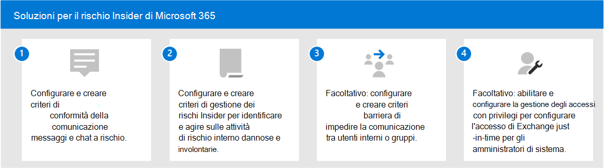

# Soluzioni per i rischi Insider in Microsoft 365

I rischi insider sono una delle principali preoccupazioni dei professionisti della sicurezza e della conformità nell'ambiente di lavoro moderno. Gli studi del settore hanno dimostrato che i rischi insider sono spesso associati a eventi o attività utente specifici. La protezione dell'organizzazione da questi rischi può essere difficile da identificare e da mitigare. I rischi insider includono vulnerabilità in un'ampia gamma di aree e possono causare problemi importanti per l'organizzazione, dalla perdita di proprietà intellettuale alle molestie sul luogo di lavoro e altro ancora. Nella figura seguente vengono illustrati i rischi insider comuni:

Le funzionalità di prevenzione dei rischi di Microsoft 365 sono progettate e integrate per i prodotti e le soluzioni a rischio insider. Queste soluzioni funzionano insieme e utilizzano indicatori di servizi avanzati e di terze parti per identificare, eseguire il triage e agire rapidamente sulle attività di rischio. La maggior parte delle soluzioni offre un flusso di lavoro completo di rilevamento, avviso e correzione che gli analisti e gli investigatori dei dati possono usare per agire rapidamente e ridurre al minimo questi rischi.

| Icona Rischio | Rischi | Conformità delle comunicazioni | Gestione dei rischi Insider | Barriere informative | Gestione accessi con privilegi |
| :---- | :-------- | :--------------------------- | :-------------------------- |:-------------------------| :--------------------------------|
| | Perdita di dati |  |  |  |  |
| | Violazioni di riservatezza |  |  |  |  |
| | Furto IP |  |  |  |  |
| | Violenza sul luogo di lavoro |  |  |  |  |
| | Frode |  |  |  |  |
| | Violazioni dei criteri |  |  |  |  |
| | Insider trading |  |  |  |  |
| | Conflitti di interesse |  |  |  |  |
| | Perdite di dati sensibili |  |  |  |  |
| | Molestie sul luogo di lavoro |  |  |  |  |
| | Violazioni della sicurezza |  |  |  |  |
| | Violazioni di conformità normative |  |  |  |  |

## Soluzioni per il rischio Insider di Microsoft 365

Per proteggere l'organizzazione da rischi insider, usare queste funzionalità e funzionalità di Microsoft 365.

### Conformità delle comunicazioni

La conformità delle comunicazioni consente di ridurre al minimo i rischi di comunicazione consentendo di rilevare, acquisire e agire su messaggi inappropriati nell'organizzazione. La conformità delle comunicazioni è disponibile nelle sottoscrizioni seguenti:

- Abbonamento a Microsoft 365 E5 (versione di valutazione o a pagamento)
- Abbonamento a Microsoft 365 E3 + componente aggiuntivo Conformità Microsoft 365 E5
- Abbonamento a Microsoft 365 E3 + componente aggiuntivo Microsoft 365 E5 Insider Risk Management
- Abbonamento a Microsoft 365 A5 (versione di valutazione o a pagamento)
- Abbonamento a Microsoft 365 A3 + componente aggiuntivo Conformità microsoft 365 A5
- Abbonamento a Microsoft 365 A3 + componente aggiuntivo Microsoft 365 A5 Insider Risk Management
- Abbonamento a Microsoft 365 G5 (versione di valutazione o a pagamento)
- Abbonamento a Microsoft 365 G5 + componente aggiuntivo Conformità Microsoft 365 G5
- Abbonamento a Microsoft 365 G5 + componente aggiuntivo Microsoft 365 G5 Insider Risk Management
- Abbonamento a Office 365 Enterprise E5 (versione di valutazione o a pagamento)
- Abbonamento a Office 365 A5 (versione di valutazione o a pagamento)
- Abbonamento a Office 365 Enterprise E3 + componente aggiuntivo Conformità avanzata di Office 365 (non più disponibile per le nuove sottoscrizioni)

### Gestione dei rischi Insider

La gestione dei rischi insider consente di ridurre al minimo i rischi interni consentendo di rilevare, analizzare e agire su attività dannose e involontarie nell'organizzazione.

La gestione dei rischi Insider è disponibile nelle sottoscrizioni seguenti:

- Abbonamento a Microsoft 365 E5 (versione di valutazione o a pagamento)
- Abbonamento a Microsoft 365 E3 + componente aggiuntivo Conformità Microsoft 365 E5
- Abbonamento a Microsoft 365 E3 + componente aggiuntivo Microsoft 365 E5 Insider Risk Management
- Abbonamento a Microsoft 365 A5 (versione di valutazione o a pagamento)
- Abbonamento a Microsoft 365 A3 + componente aggiuntivo Conformità microsoft 365 A5
- Abbonamento a Microsoft 365 A3 + componente aggiuntivo Microsoft 365 A5 Insider Risk Management
- Abbonamento a Microsoft 365 G5 (versione di valutazione o a pagamento)
- Abbonamento a Microsoft 365 G3 + componente aggiuntivo Conformità Microsoft 365 G5
- Abbonamento a Microsoft 365 G3 + componente aggiuntivo Microsoft 365 G5 Insider Risk Management
- Abbonamento a Office 365 E3 + Enterprise Mobility and Security E3 + componente aggiuntivo Conformità Microsoft 365 E5

### Barriere informative

Le barriere alle informazioni consentono di limitare la comunicazione e la collaborazione tra due gruppi interni per evitare che si verifichi un conflitto di interesse nell'organizzazione.

Le barriere di informazione sono disponibili nelle sottoscrizioni seguenti:

- Abbonamento a Microsoft 365 E5 (versione di valutazione o a pagamento)
- Abbonamento a Microsoft 365 A5 (versione di valutazione o a pagamento)
- Abbonamento a Office 365 Enterprise E5 (versione di valutazione o a pagamento)
- Abbonamento a Office 365 A5 (versione di valutazione o a pagamento)
- Componente aggiuntivo Conformità avanzata di Office 365 (non più disponibile per le nuove sottoscrizioni)
- Abbonamento a Microsoft 365 E3 + componente aggiuntivo Conformità Microsoft 365 E5
- Abbonamento a Microsoft 365 E3 + componente aggiuntivo Microsoft 365 E5 Insider Risk Management
- Abbonamento a Microsoft 365 A3 + componente aggiuntivo Conformità microsoft 365 A5
- Abbonamento a Microsoft 365 A3 + componente aggiuntivo Microsoft 365 A5 Insider Risk Management

### Gestione accessi con privilegi

La gestione degli accessi privilegiati consente il controllo granulare dell'accesso sulle attività di amministrazione di Exchange Online con privilegi in Office 365. Può aiutare a proteggere l'organizzazione da violazioni che utilizzano account di amministratore con privilegi esistenti con accesso permanente ai dati sensibili o l'accesso alle impostazioni di configurazione critiche.

La gestione degli accessi con privilegi è disponibile nelle sottoscrizioni seguenti:

- Abbonamento a Microsoft 365 E5 (versione di valutazione o a pagamento)
- Abbonamento a Microsoft 365 A5 (versione di valutazione o a pagamento)
- Abbonamento a Office 365 Enterprise E5 (versione di valutazione o a pagamento)
- Abbonamento a Office 365 A5 (versione di valutazione o a pagamento)
- Abbonamento a Microsoft 365 E3 + componente aggiuntivo Conformità Microsoft 365 E5
- Abbonamento a Microsoft 365 E3 + componente aggiuntivo Microsoft 365 E5 Information Protection and Governance
- Abbonamento a Microsoft 365 A3 + componente aggiuntivo Conformità microsoft 365 A5
- Abbonamento a Microsoft 365 A3 + componente aggiuntivo Microsoft 365 A5 Information Protection and Governance

## Distribuire soluzioni di rischio Insider di Microsoft 365

Per proteggere l'organizzazione da rischi insider, configurare e distribuire le soluzioni Microsoft 365 seguenti:

1. Configurare e creare criteri [di conformità delle comunicazioni](communication-compliance-solution-overview.md).
2. Configurare e creare [criteri di gestione dei rischi insider](insider-risk-management-solution-overview.md).
3. Facoltativo: configurare e creare [criteri di barriera delle informazioni.](information-barriers-solution-overview.md)
4. Facoltativo: abilitare e configurare [la gestione degli accessi con privilegi.](privileged-access-management-solution-overview.md)

## Illustrazioni con esempi

Per pianificare una strategia integrata per l'implementazione delle funzionalità di rischio insider di Microsoft 365, scaricare il set di illustrazioni sulle funzionalità di conformità e protezione delle informazioni di *Microsoft 365.* Per le funzionalità di rischio insider, vedere le pagine dell'illustrazione dell'architettura 5-7. Queste illustrazioni possono essere personalizzate.

| Elemento | Descrizione |
|:-----|:------------|
|   [Download in formato PDF](https://download.microsoft.com/download/3/a/6/3a6ab1a3-feb0-4ee2-8e77-62415a772e53/m365-compliance-illustrations.pdf) \| [Download come Visio](https://download.microsoft.com/download/3/a/6/3a6ab1a3-feb0-4ee2-8e77-62415a772e53/m365-compliance-illustrations.vsdx)     Aggiornamento ottobre 2020|Include: <ul><li>  Protezione dell’informazione e prevenzione della perdita dei dati di Microsoft</li><li>Criteri di conservazione ed etichette di conservazione. </li><li>Barriere informative</li><li>Conformità delle comunicazioni</li><li>Gestione dei rischi Insider</li><li>Gestione dei dati di terze parti</li>|

## Formazione

La formazione degli amministratori e del team di conformità nelle nozioni di base per ogni soluzione di rischio insider può aiutare l'organizzazione a iniziare più rapidamente con le attività di distribuzione e implementazione. 

Microsoft 365 fornisce le risorse seguenti per informare e formare questi utenti nell'organizzazione:

| Soluzione/area | Risorse |
|:------------------|:--------------|
| Gestire i rischi insider in Microsoft 365 |[Percorso di apprendimento completo](/learn/paths/m365-compliance-insider)   Questo percorso di apprendimento include tutti i singoli moduli della soluzione per la conformità delle comunicazioni, la gestione dei rischi insider, le barriere alle informazioni e la gestione degli accessi privilegiati. Selezionare questo percorso di apprendimento per completare tutti i moduli. |
| Conformità delle comunicazioni | [Modulo di apprendimento: Preparare la conformità delle comunicazioni in Microsoft 365](/learn/modules/m365-compliance-insider-prepare-communication-compliance)   Questo modulo consente di apprendere le nozioni di base su come identificare e correggere le violazioni dei criteri di code-of-conduct con la conformità delle comunicazioni, di coprire i prerequisiti necessari prima di creare i criteri di conformità delle comunicazioni e di conoscere i tipi di modelli di criteri predefiniti predefiniti nella conformità delle comunicazioni. |
| Gestione dei rischi Insider | [Modulo di apprendimento: Gestione dei rischi insider in Microsoft 365](/learn/modules/m365-compliance-insider-manage-insider-risk)   Questo modulo consente di scoprire in che modo la gestione dei rischi insider in Microsoft 365 può aiutare a prevenire, rilevare e contenere rischi interni in un'organizzazione, informazioni sui tipi di modelli di criteri predefiniti predefiniti, comprendere i prerequisiti di base necessari prima di creare criteri di rischio insider e illustra i tipi di azioni che è possibile eseguire sui casi di gestione dei rischi insider. |
| Barriere informative | [Modulo di apprendimento: Pianificare le barriere in fatto di informazioni](/learn/modules/m365-compliance-insider-plan-information-barriers)   Questo modulo consente di scoprire in che modo i criteri di barriera delle informazioni possono aiutare l'organizzazione a mantenere la conformità agli standard e alle normative del settore pertinenti, elenca i tipi di situazioni in cui sono applicabili le barriere alle informazioni, spiega il processo di creazione di un criterio di barriera delle informazioni e spiega come risolvere i problemi imprevisti dopo l'applicazione delle barriere alle informazioni. |
| Gestione accessi con privilegi | [Modulo di apprendimento: implementare la gestione degli accessi con privilegi](/learn/modules/m365-compliance-insider-implement-privileged-access-management)   Questo modulo consente di comprendere la differenza tra la gestione degli accessi con privilegi e la gestione delle identità con privilegi, di comprendere il flusso del processo di gestione degli accessi con privilegi e di comprendere le nozioni di base su come configurare e abilitare la gestione degli accessi con privilegi. |
