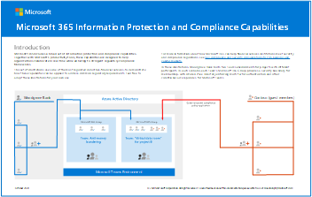

# Soluzioni di rischio insider in Microsoft 365Insider risk solutions in Microsoft 365

I rischi Insider sono una delle principali preoccupazioni dei professionisti del settore della sicurezza e della conformità nei luoghi di lavoro moderni.Insider risks are one of the top concerns of security and compliance professionals in the modern workplace. Gli studi del settore hanno dimostrato che spesso i rischi Insider sono associati a attività o eventi utente specifici.Industry studies have shown that insider risks are often associated with specific user events or activities. La protezione dell'organizzazione da tali rischi può essere difficile da identificare e da limitare.Protecting your organization against these risks can be challenging to identify and difficult to mitigate. I rischi Insider includono vulnerabilità in una varietà di aree e possono causare problemi principali per la propria organizzazione, dalla perdita della proprietà intellettuale alle molestie sul posto di lavoro e altro ancora.Insider risks include vulnerabilities in a variety of areas and can cause major problems for your organization, ranging from the loss of intellectual property to workplace harassment, and more. Nella figura seguente vengono illustrati i rischi comuni di Insider:The following figure outlines common insider risks:

Le funzionalità di prevenzione dei rischi di Microsoft 365 sono progettate e integrate con i prodotti e le soluzioni di rischio Insider.Microsoft 365 risk prevention features are designed and built-in to our insider risk products and solutions. Queste soluzioni cooperano e utilizzano indicatori avanzati di terze parti per identificare rapidamente, valutare e agire sull'attività di rischio.These solutions work together and use advanced service and 3rd-party indicators to help you quickly identify, triage, and act on risk activity. La maggior parte delle soluzioni offre un flusso di lavoro di rilevamento, avviso e correzione completo per gli analisti e gli investigatori dei dati da utilizzare per agire rapidamente e minimizzare tali rischi.Most solutions offer a comprehensive detection, alert, and remediation workflow for your data analysts and investigators to use to quickly act on and minimize these risks.

| | RischiRisks | Conformità delle comunicazioniCommunication compliance | Gestione dei rischi InsiderInsider risk management | Barriere informativeInformation barriers | Gestione accessi con privilegiPrivileged access management |
| :---- | :-------- | :--------------------------- | :-------------------------- |:-------------------------| :--------------------------------|
| | Versamento dei datiData spillage |  |  |  |  |
| | Violazioni della riservatezzaConfidentiality violations |  |  |  |  |
| | Furto IPIP theft |  |  |  |  |
| | Violenze sul posto di lavoroWorkplace violence |  |  |  |  |
| | FrodiFraud |  |  |  |  |
| | Violazioni dei criteriPolicy violations |  |  |  |  |
| | Insider TradingInsider trading |  |  |  |  |
| | Conflitti di interesseConflicts of interest |  |  |  |  |
| | Perdite di dati sensibiliSensitive data leaks |  |  |  |  |
| | Molestie sul posto di lavoroWorkplace harassment |  |  |  |  |
| | Violazioni della sicurezzaSecurity violations |  |  |  |  |
| | Violazioni della conformità alle normativeRegulatory compliance violations |  |  |  |  |

## Soluzioni per il rischio Insider di Microsoft 365Microsoft 365 insider risk solutions

Per proteggere l'organizzazione da rischi Insider, utilizzare le funzionalità e le funzionalità di Microsoft 365.To help protect your organization against insider risks, use these Microsoft 365 capabilities and features.

| Soluzione/funzionalitàSolution/capabilities | DescrizioneDescription | LicenzeLicensing |
| :------------------------ | :-------------- | :------------ |
| Conformità delle comunicazioniCommunication compliance | La conformità alla comunicazione consente di ridurre al minimo i rischi di comunicazione contribuendo a rilevare, acquisire e agire su messaggi inopportuni nell'organizzazione.Communication compliance helps minimize communication risks by helping you detect, capture, and act on inappropriate messages in your organization. | Microsoft 365 E5Microsoft 365 E5   Microsoft 365 E3 Subscription + Microsoft 365 E5 Insider Risk Management componente aggiuntivoMicrosoft 365 E3 subscription + Microsoft 365 E5 Insider Risk Management add-on   Sottoscrizione Microsoft 365 E3 + il componente aggiuntivo Microsoft 365 E5 ComplianceMicrosoft 365 E3 subscription + the Microsoft 365 E5 Compliance add-on |
| Gestione dei rischi InsiderInsider risk management | La gestione dei rischi insider consente di ridurre al minimo i rischi interni, consentendo di rilevare, indagare e agire su attività dannose e involontarie nell'organizzazione.Insider risk management helps minimize internal risks by enabling you to detect, investigate, and act on malicious and inadvertent activities in your organization. | Microsoft 365 E5Microsoft 365 E5   Microsoft 365 E3 Subscription + Microsoft 365 E5 Insider Risk Management componente aggiuntivoMicrosoft 365 E3 subscription + Microsoft 365 E5 Insider Risk Management add-on   Sottoscrizione Microsoft 365 E3 + il componente aggiuntivo Microsoft 365 E5 ComplianceMicrosoft 365 E3 subscription + the Microsoft 365 E5 Compliance add-on |
| Barriere informativeInformation barriers | Gli ostacoli alle informazioni consentono di limitare la comunicazione e la collaborazione tra due gruppi interni per evitare che si verifichi un conflitto di interessi nell'organizzazione.Information barriers allow you to restrict communication and collaboration between two internal groups to avoid a conflict of interest from occurring in your organization.  | Microsoft 365 E5/A5Microsoft 365 E5/A5   Office 365 E5/A5Office 365 E5/A5   Office 365 Advanced ComplianceOffice 365 Advanced Compliance   Conformità E5/A5 di Microsoft 365Microsoft 365 Compliance E5/A5   Microsoft 365 gestione dei rischi InsiderMicrosoft 365 Insider Risk Management |
| Gestione accessi con privilegiPrivileged access management | La gestione degli accessi con privilegi consente il controllo di accesso granulare sulle attività amministrative di Exchange Online privilegiate in Office 365.Privileged access management allows granular access control over privileged Exchange Online admin tasks in Office 365. Può aiutare a proteggere l'organizzazione da violazioni che utilizzano account amministratore privilegiati esistenti con accesso permanente ai dati sensibili o accesso alle impostazioni di configurazione critiche.It can help protect your organization from breaches that use existing privileged admin accounts with standing access to sensitive data or access to critical configuration settings. | Microsoft 365 E5/A5Microsoft 365 E5/A5   Office 365 E5/A5Office 365 E5/A5   Conformità Microsoft 365 E5/A5Microsoft 365 E5/A5 Compliance   Microsoft 365 E5/A5 Information Protection and GovernanceMicrosoft 365 E5/A5 Information Protection and Governance |

## Distribuire le soluzioni di rischio di Microsoft 365 InsiderDeploy Microsoft 365 insider risk solutions

Per proteggere l'organizzazione da rischi Insider, configurare e distribuire le soluzioni Microsoft 365 seguenti:To help protect your organization against insider risks, set up and deploy the following Microsoft 365 solutions:

1. Configurare e creare [criteri di conformità della comunicazione](communication-compliance-solution-overview.md).Configure and create [communication compliance policies](communication-compliance-solution-overview.md).
2. Configurare e creare [criteri di gestione dei rischi Insider](insider-risk-management-solution-overview.md).Configure and create [insider risk management policies](insider-risk-management-solution-overview.md).
3. Facoltativo: configurare e creare [criteri barriera informativi](information-barriers-solution-overview.md).Optional: Configure and create [information barrier policies](information-barriers-solution-overview.md).
4. Facoltativo: abilitare e configurare la [gestione degli accessi con privilegi](privileged-access-management-solution-overview.md).Optional: Enable and configure [privileged access management](privileged-access-management-solution-overview.md).

## Illustrazioni con esempiIllustrations with examples

Per semplificare la pianificazione di una strategia integrata per l'implementazione delle funzionalità di rischio Insider di Microsoft 365, scaricare il set di illustrazioni di *microsoft 365 Information Protection and Compliance capabilities* .To help you plan an integrated strategy for implementing Microsoft 365 insider risk capabilities, download the *Microsoft 365 information protection and compliance capabilities* set of illustrations. Per le funzionalità di rischio Insider, vedere l'argomento relativo all'illustrazione dell'architettura 5-7.For insider risk capabilities, see the architecture illustration topics 5-7. Queste illustrazioni possono essere personalizzate.Feel free to adapt these illustrations for your own use.

| ElementoItem | DescrizioneDescription |
|:-----|:------------|
|   [Scarica come PDF](https://download.microsoft.com/download/3/a/6/3a6ab1a3-feb0-4ee2-8e77-62415a772e53/m365-compliance-illustrations.pdf) \| [Scaricare come Visio](https://download.microsoft.com/download/3/a/6/3a6ab1a3-feb0-4ee2-8e77-62415a772e53/m365-compliance-illustrations.vsdx)  [Download as a PDF](https://download.microsoft.com/download/3/a/6/3a6ab1a3-feb0-4ee2-8e77-62415a772e53/m365-compliance-illustrations.pdf)  \| [Download as a Visio](https://download.microsoft.com/download/3/a/6/3a6ab1a3-feb0-4ee2-8e77-62415a772e53/m365-compliance-illustrations.vsdx)   Aggiornato il 2020 ottobreUpdated October 2020|IncludeIncludes: <ul><li>  Protezione dell’informazione e prevenzione della perdita dei dati di MicrosoftMicrosoft information protection and data loss prevention</li><li>Criteri di conservazione ed etichette di conservazione.Retention policies and retention labels </li><li>Barriere informativeInformation barriers</li><li>Conformità delle comunicazioniCommunication compliance</li><li>Gestione dei rischi InsiderInsider risk management</li><li>Gestione dei dati di terze partiThird-party data ingestion</li>|

## FormazioneTraining

La formazione degli amministratori e del team di conformità nelle nozioni di base per ogni soluzione di rischio Insider può aiutare l'organizzazione a iniziare più rapidamente con gli sforzi di distribuzione e implementazione.Training your administrators and compliance team in the basics for each insider risk solution can help your organization get started more quickly with your deployment and implementation efforts. 

Microsoft 365 fornisce le risorse seguenti per informare e formare tali utenti nell'organizzazione:Microsoft 365 provides the following resources to help inform and train these users in your organization:

| Soluzione/areaSolution/Area | RisorseResources |
|:------------------|:--------------|
| Gestione dei rischi insider in Microsoft 365Manage insider risk in Microsoft 365 |[Percorso di apprendimento completoComplete learning path](/learn/paths/m365-compliance-insider)   Questo percorso di apprendimento include tutti i singoli moduli di soluzione per la conformità della comunicazione, la gestione dei rischi di informazioni privilegiate, barriere informative e gestione degli accessiThis learning path includes all the individual solution modules for communication compliance, insider risk management, information barriers, and privileged access management. Selezionare questo percorso di apprendimento per completare tutti i moduli.Select this learning path to complete all the modules. |
| Conformità delle comunicazioniCommunication compliance | [Modulo di apprendimento: preparare la conformità della comunicazione in Microsoft 365Learning module: Prepare communication compliance in Microsoft 365](/learn/modules/m365-compliance-insider-prepare-communication-compliance)   Questo modulo consente di apprendere le nozioni di base su come identificare e correggere le violazioni dei criteri del codice di condotta con la conformità della comunicazione, coprire i prerequisiti necessari prima di creare criteri di conformità della comunicazione e conoscere i tipi di modelli di criteri predefiniti e predefiniti in conformità alla comunicazione.This module helps you learn the basics on how to identify and remediate code-of-conduct policy violations with communication compliance, cover the prerequisites needed before creating communication compliance policies, and learn about the types of built-in, pre-defined policy templates in communication compliance. |
| Gestione dei rischi InsiderInsider risk management | [Modulo di apprendimento: gestione dei rischi insider in Microsoft 365Learning module: Insider risk management in Microsoft 365](/learn/modules/m365-compliance-insider-manage-insider-risk)   Questo modulo consente di scoprire come la gestione dei rischi insider in Microsoft 365 può contribuire a prevenire, rilevare e contenere rischi interni in un'organizzazione, conoscere i tipi di modelli di criteri predefiniti, comprendere i prerequisiti di base necessari prima di creare criteri di rischio Insider e illustrare i tipi di azioni che è possibile intraprendere sui casi di gestione dei rischi Insider.This module helps you learn how insider risk management in Microsoft 365 can help prevent, detect, and contain internal risks in an organization, learn about the types of built-in, pre-defined policy templates, understand the basic prerequisites needed before creating insider risk policies, and explains the types of actions you can take on insider risk management cases. |
| Barriere informativeInformation barriers | [Modulo di apprendimento: pianificazione delle barriere informativeLearning module: Plan for information barriers](/learn/modules/m365-compliance-insider-plan-information-barriers)   Questo modulo consente di scoprire come i criteri di barriera delle informazioni possono aiutare l'organizzazione a mantenere la conformità con gli standard e i regolamenti del settore rilevanti, di elencare i tipi di situazioni in cui le barriere informative sarebbero applicabili, di spiegare il processo di creazione di un criterio barriera informativo e di spiegare come risolvere i problemi imprevisti dopo che sono state applicate le barriereThis module helps you learn how information barrier policies can help your organization maintain compliance with relevant industry standards and regulations, lists the types of situations when information barriers would be applicable, helps explain the process of creating an information barrier policy, and helps explain how to troubleshoot unexpected issues after information barriers are in place. |
| Gestione accessi con privilegiPrivileged access management | [Modulo di apprendimento: implementare la gestione degli accessi con privilegiLearning module: Implement privileged access management](/learn/modules/m365-compliance-insider-implement-privileged-access-management)   Questo modulo consente di comprendere la differenza tra la gestione degli accessi privilegiati e la gestione delle identità privilegiate, comprendere il flusso di processo di gestione degli accessi con privilegi e comprendere le nozioni di base su come configurare e abilitare la gestione degli accessiThis module helps you understand the difference between privileged access management and privileged identity management, understand the privileged access management process flow, and understand the basics of how to configure and enable privileged access management. |
