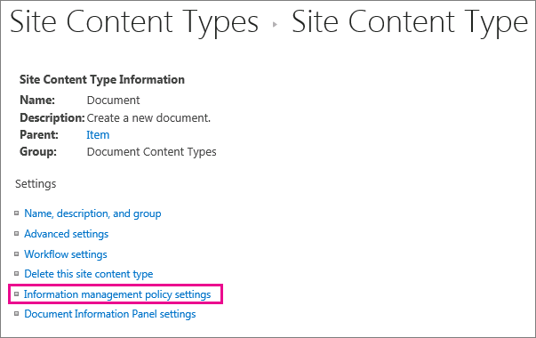

# Introduzione ai criteri di gestione delle informazioniIntroduction to information management policies

An information management policy is a set of rules for a type of content.An information management policy is a set of rules for a type of content. Information management policies enable organizations to control and track things like how long content is retained or what actions users can take with that content.Information management policies enable organizations to control and track things like how long content is retained or what actions users can take with that content. Information management policies can help organizations comply with legal or governmental regulations, or they can simply enforce internal business processes.Information management policies can help organizations comply with legal or governmental regulations, or they can simply enforce internal business processes. 
  
Si supponga, ad esempio, che un'organizzazione sia tenuta a rispettare alcune norme statali in base alle quali è necessario dimostrare che le relazioni finanziarie vengono sottoposte a controlli appropriati. In questo caso, potrà creare uno o più criteri di gestione delle informazioni per controllare azioni specifiche eseguite durante il processo di creazione e approvazione per tutti i documenti correlati alle archiviazioni delle informazioni finanziarie.For example, an organization that must follow government regulations requiring that they demonstrate "adequate controls" of their financial statements might create one or more information management policies that audit specific actions in the authoring and approval process for all documents related to financial filings.
  
Per informazioni e procedure, vedere [Creare e applicare criteri di gestione delle informazioni](create-info-mgmt-policies.md).For how-to information, see [Create and apply information management policies](create-info-mgmt-policies.md).
  
## Caratteristiche dei criteri di gestione delle informazioniFeatures of information management policies

Esistono quattro categorie di base di caratteristiche dei criteri predefinite che le organizzazioni possono usare singolarmente o in combinazione per la gestione di contenuti e processi.There are four basic categories of predefined policy features that organizations can use individually or in combination to manage content and processes. 
  

  
The Auditing policy feature helps organizations analyze how their content management systems are used by logging events and operations that are performed on documents and list items.The Auditing policy feature helps organizations analyze how their content management systems are used by logging events and operations that are performed on documents and list items. You can configure the Auditing policy feature to log events such as when a document or item is edited, viewed, checked in, checked out, deleted, or has its permissions changed.You can configure the Auditing policy feature to log events such as when a document or item is edited, viewed, checked in, checked out, deleted, or has its permissions changed. All of the audit information is stored in a single audit log on the server, and site administrators can run reports on it.All of the audit information is stored in a single audit log on the server, and site administrators can run reports on it. 
  
The Expiration policy feature helps organizations delete or remove out-of-date content from their sites in a consistent, trackable way.The Expiration policy feature helps organizations delete or remove out-of-date content from their sites in a consistent, trackable way. This helps you manage both the cost and risk associated with retaining out-of-date content.This helps you manage both the cost and risk associated with retaining out-of-date content. You can configure an Expiration policy to specify that certain types of content expire on a particular date or within a period of time after the document was created or last modified.You can configure an Expiration policy to specify that certain types of content expire on a particular date or within a period of time after the document was created or last modified.
  
Organizations can also create and deploy custom policy features to meet specific needs.Organizations can also create and deploy custom policy features to meet specific needs. For example, a manufacturing organization might want to define an information management policy for all draft product-design specification documents that prohibits users from printing copies of these documents on nonsecure printers.For example, a manufacturing organization might want to define an information management policy for all draft product-design specification documents that prohibits users from printing copies of these documents on nonsecure printers. To define this kind of information management policy, you can create and deploy a Printing Restriction policy feature that can be added to the relevant information management policy for the product design specification content type.To define this kind of information management policy, you can create and deploy a Printing Restriction policy feature that can be added to the relevant information management policy for the product design specification content type.
  
## Posizioni dei criteri di gestione delle informazioniLocations to use an information management policy

To implement an information management policy, you must add it to a list, library, or content type in a site.To implement an information management policy, you must add it to a list, library, or content type in a site. The location where you create or add an information management policy affects how broadly the policy applies or how broadly it can be used.The location where you create or add an information management policy affects how broadly the policy applies or how broadly it can be used. You can:You can:
  
 **Create a site collection policy and then add this policy to a content type, list, or library** You can create a site collection policy in the Policies list in the top-level site of a site collection.**Create a site collection policy and then add this policy to a content type, list, or library** You can create a site collection policy in the Policies list in the top-level site of a site collection. After you create a site collection policy, you can export it so that administrators of other site collections can import it into their Policies list.After you create a site collection policy, you can export it so that administrators of other site collections can import it into their Policies list. Creating an exportable site collection policy enables you to standardize the information management policies across the sites in your organization.Creating an exportable site collection policy enables you to standardize the information management policies across the sites in your organization. 
  
When you add a site collection policy to a site content type, and an instance of that site content type is added to a list or library, the owner of that list or library cannot modify the site collection policy for the list or library.When you add a site collection policy to a site content type, and an instance of that site content type is added to a list or library, the owner of that list or library cannot modify the site collection policy for the list or library. Adding a site collection policy to a site content type is a good way to ensure that site collection policies are enforced at each level of your site hierarchy.Adding a site collection policy to a site content type is a good way to ensure that site collection policies are enforced at each level of your site hierarchy.
  

  
 **Create an information management policy for a site content type in the top-level site's Site Content Type Gallery, and then add that content type to one or more lists or libraries** You can also create an information management policy directly for a site content type and then associate an instance of that site content type with multiple lists or libraries.**Create an information management policy for a site content type in the top-level site's Site Content Type Gallery, and then add that content type to one or more lists or libraries** You can also create an information management policy directly for a site content type and then associate an instance of that site content type with multiple lists or libraries. If you create an information management policy this way, every item in the site collection of that content type or a content type that inherits from that content type has the policy.If you create an information management policy this way, every item in the site collection of that content type or a content type that inherits from that content type has the policy. However, if you create an information management policy directly for a site content type, it is more difficult to reuse this information management policy in other site collections, because policies that are created this way cannot be exported.However, if you create an information management policy directly for a site content type, it is more difficult to reuse this information management policy in other site collections, because policies that are created this way cannot be exported. 
  

  

  
Note To control which policies are used in a site collection, site collection administrators can disable the ability to set policy features directly on a content type.Note To control which policies are used in a site collection, site collection administrators can disable the ability to set policy features directly on a content type. When this restriction is in effect, users who create content types are limited to selecting policies from the site collection Policies list.When this restriction is in effect, users who create content types are limited to selecting policies from the site collection Policies list.
  
 **Create an information management policy for a list or library** If your organization needs to apply a specific information management policy to a very limited set of content, you can create an information management policy that applies only to an individual list or library.**Create an information management policy for a list or library** If your organization needs to apply a specific information management policy to a very limited set of content, you can create an information management policy that applies only to an individual list or library. This method of creating an information management policy is the least flexible, because the policy applies only to one location, and it cannot be exported or reused for other locations.This method of creating an information management policy is the least flexible, because the policy applies only to one location, and it cannot be exported or reused for other locations. However, sometimes you may need to create unique information management policies with limited applicability to address specific situations.However, sometimes you may need to create unique information management policies with limited applicability to address specific situations. 
  

  
NoteNotes 
  
You can create an information management policy for a list or library only if that list or library does not support multiple content types.You can create an information management policy for a list or library only if that list or library does not support multiple content types. If a list or library supports multiple content types, you need to define an information management policy for each individual list content type that is associated with that list or library.If a list or library supports multiple content types, you need to define an information management policy for each individual list content type that is associated with that list or library. (Instances of a site content type that are associated with a specific list or library are known as list content types.)(Instances of a site content type that are associated with a specific list or library are known as list content types.)
  
To control which policies are used in a site collection, site collection administrators can disable the ability to set policy features directly on a list or library.To control which policies are used in a site collection, site collection administrators can disable the ability to set policy features directly on a list or library. When this restriction is in effect, users who manage lists or libraries are limited to selecting policies from the site collection Policies list.When this restriction is in effect, users who manage lists or libraries are limited to selecting policies from the site collection Policies list.
  
[Per criterio di gestione delle informazioni si intende un set di regole per un tipo di contenuto. I criteri di gestione delle informazioni consentono alle organizzazioni di controllare e registrare, ad esempio, il periodo di conservazione del contenuto e le azioni che gli utenti possono eseguire sul contenuto. I criteri di gestione delle informazioni possono essere utili per consentire alle organizzazioni di applicare la conformità con le norme statali o legali o semplicemente i processi aziendali interni.Si supponga, ad esempio, che un'organizzazione sia tenuta a rispettare alcune norme statali in base alle quali è necessario dimostrare che le relazioni finanziarie vengono sottoposte a controlli appropriati. In questo caso, potrà creare uno o più criteri di gestione delle informazioni per controllare azioni specifiche eseguite durante il processo di creazione e approvazione per tutti i documenti correlati alle archiviazioni delle informazioni finanziarie.Per informazioni e procedure, vedere Creare e applicare criteri di gestione delle informazioni.An information management policy is a set of rules for a type of content. Information management policies enable organizations to control and track things like how long content is retained or what actions users can take with that content. Information management policies can help organizations comply with legal or governmental regulations, or they can simply enforce internal business processes. For example, an organization that must follow government regulations requiring that they demonstrate "adequate controls" of their financial statements might create one or more information management policies that audit specific actions in the authoring and approval process for all documents related to financial filings.For how-to information, see Create and apply information management policies.](intro-to-info-mgmt-policies.md#__top)
  

