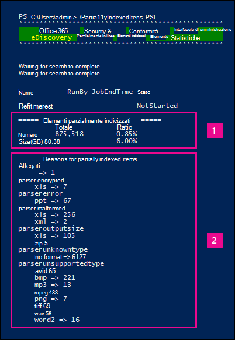

# <a name="investigating-partially-indexed-items-in-ediscovery"></a><span data-ttu-id="01d0e-103">Analisi degli elementi parzialmente indicizzati in eDiscovery</span><span class="sxs-lookup"><span data-stu-id="01d0e-103">Investigating partially indexed items in eDiscovery</span></span>

<span data-ttu-id="01d0e-104">Una ricerca eDiscovery eseguita dal Centro conformità Microsoft 365 include automaticamente elementi parzialmente indicizzati nei risultati di ricerca stimati quando si esegue una ricerca.</span><span class="sxs-lookup"><span data-stu-id="01d0e-104">An eDiscovery search that you run from the Microsoft 365 compliance center automatically includes partially indexed items in the estimated search results when you run a search.</span></span> <span data-ttu-id="01d0e-105">Gli elementi parzialmente indicizzati sono Exchange di cassette postali e documenti nei siti SharePoint e OneDrive for Business che per qualche motivo non sono stati completamente indicizzati per la ricerca.</span><span class="sxs-lookup"><span data-stu-id="01d0e-105">Partially indexed items are Exchange mailbox items and documents on SharePoint and OneDrive for Business sites that for some reason weren't completely indexed for search.</span></span> <span data-ttu-id="01d0e-106">La maggior parte dei messaggi di posta elettronica e dei documenti del sito viene indicizzata correttamente perché rientrano nei limiti di indicizzazione [per i messaggi di posta elettronica.](limits-for-content-search.md#indexing-limits-for-email-messages)</span><span class="sxs-lookup"><span data-stu-id="01d0e-106">Most email messages and site documents are successfully indexed because they fall within the [Indexing limits for email messages](limits-for-content-search.md#indexing-limits-for-email-messages).</span></span> <span data-ttu-id="01d0e-107">Tuttavia, alcuni elementi potrebbero superare questi limiti di indicizzazione e verranno parzialmente indicizzati.</span><span class="sxs-lookup"><span data-stu-id="01d0e-107">However, some items may exceed these indexing limits, and will be partially indexed.</span></span> <span data-ttu-id="01d0e-108">Ecco altri motivi per cui gli elementi non possono essere indicizzati per la ricerca e vengono restituiti come elementi parzialmente indicizzati quando si esegue una ricerca eDiscovery:</span><span class="sxs-lookup"><span data-stu-id="01d0e-108">Here are other reasons why items can't be indexed for search and are returned as partially indexed items when you run an eDiscovery search:</span></span>
  
- <span data-ttu-id="01d0e-109">I messaggi di posta elettronica dispongono di un file allegato senza un gestore valido, ad esempio file di immagine. questa è la causa più comune degli elementi di posta elettronica parzialmente indicizzati.</span><span class="sxs-lookup"><span data-stu-id="01d0e-109">Email messages have an attached file without a valid handler, such as image files; this is the most common cause of partially indexed email items.</span></span>

- <span data-ttu-id="01d0e-110">Troppi file allegati a un messaggio di posta elettronica.</span><span class="sxs-lookup"><span data-stu-id="01d0e-110">Too many files attached to an email message.</span></span>

- <span data-ttu-id="01d0e-111">Un file allegato a un messaggio di posta elettronica è troppo grande.</span><span class="sxs-lookup"><span data-stu-id="01d0e-111">A file attached to an email message is too large.</span></span>

- <span data-ttu-id="01d0e-112">Il tipo di file è supportato per l'indicizzazione ma si è verificato un errore di indicizzazione per un file specifico.</span><span class="sxs-lookup"><span data-stu-id="01d0e-112">The file type is supported for indexing but an indexing error occurred for a specific file.</span></span>

<span data-ttu-id="01d0e-113">Anche se varia, la maggior parte delle organizzazioni ha meno dell'1% del contenuto in base al volume e meno del 12% del contenuto in base alle dimensioni parzialmente indicizzate.</span><span class="sxs-lookup"><span data-stu-id="01d0e-113">Although it varies, most organizations customers have less than 1% of content by volume and less than 12% of content by size that is partially indexed.</span></span> <span data-ttu-id="01d0e-114">Il motivo della differenza tra volume e dimensioni è che i file di dimensioni maggiori hanno una probabilità maggiore di contenere contenuto che non può essere indicizzato completamente.</span><span class="sxs-lookup"><span data-stu-id="01d0e-114">The reason for the difference between the volume versus size is that larger files have a higher probability of containing content that can't be completely indexed.</span></span>
  
## <a name="why-does-the-partially-indexed-item-count-change-for-a-search"></a><span data-ttu-id="01d0e-115">Perché il conteggio degli elementi parzialmente indicizzati cambia per una ricerca?</span><span class="sxs-lookup"><span data-stu-id="01d0e-115">Why does the partially indexed item count change for a search?</span></span>

<span data-ttu-id="01d0e-116">Dopo aver eseguito una ricerca eDiscovery, il numero totale e le dimensioni degli elementi parzialmente indicizzati nelle posizioni in cui è stata eseguita la ricerca sono elencati nelle statistiche dei risultati della ricerca visualizzate nelle statistiche dettagliate per la ricerca.</span><span class="sxs-lookup"><span data-stu-id="01d0e-116">After you run an eDiscovery search, the total number and size of partially indexed items in the locations that were searched are listed in the search result statistics that are displayed in the detailed statistics for the search.</span></span> <span data-ttu-id="01d0e-117">Si noti che questi  *elementi sono denominati elementi non indicizzati*  nelle statistiche di ricerca.</span><span class="sxs-lookup"><span data-stu-id="01d0e-117">Note these are called  *unindexed items*  in the search statistics.</span></span> <span data-ttu-id="01d0e-118">Ecco alcuni aspetti che influiranno sul numero di elementi parzialmente indicizzati restituiti nei risultati della ricerca:</span><span class="sxs-lookup"><span data-stu-id="01d0e-118">Here are a few things that will affect the number of partially indexed items that are returned in the search results:</span></span>
  
- <span data-ttu-id="01d0e-119">Se un elemento è parzialmente indicizzato e corrisponde alla query di ricerca, viene incluso sia nel conteggio (e nelle dimensioni) degli elementi dei risultati di ricerca che negli elementi parzialmente indicizzati.</span><span class="sxs-lookup"><span data-stu-id="01d0e-119">If an item is partially indexed and matches the search query, it's included in both the count (and size) of search result items and partially indexed items.</span></span> <span data-ttu-id="01d0e-120">Tuttavia, quando i risultati della stessa ricerca vengono esportati, l'elemento viene incluso solo con il set di risultati della ricerca. non è incluso come elemento parzialmente indicizzato.</span><span class="sxs-lookup"><span data-stu-id="01d0e-120">However, when the results of that same search are exported, the item is included only with set of search results; it's not included as a partially indexed item.</span></span>

- <span data-ttu-id="01d0e-121">Gli elementi parzialmente indicizzati che si trovano nei  siti di SharePoint e OneDrive non sono inclusi nella stima degli elementi parzialmente indicizzati visualizzati nelle statistiche dettagliate per la ricerca.</span><span class="sxs-lookup"><span data-stu-id="01d0e-121">Partially indexed items located in SharePoint and OneDrive sites *are not* included in the estimate of partially indexed items that's displayed in the detailed statistics for the search.</span></span> <span data-ttu-id="01d0e-122">Tuttavia, gli elementi parzialmente indicizzati possono essere esportati quando si esportano i risultati di una ricerca eDiscovery.</span><span class="sxs-lookup"><span data-stu-id="01d0e-122">However, partially indexed items can be exported when you export the results of an eDiscovery search.</span></span> <span data-ttu-id="01d0e-123">Se ad esempio si esemplino solo siti di ricerca, il numero stimato di elementi parzialmente indicizzati sarà zero.</span><span class="sxs-lookup"><span data-stu-id="01d0e-123">For example, if you only search sites, the estimated number partially indexed items will be zero.</span></span>
  
## <a name="calculating-the-ratio-of-partially-indexed-items-in-your-organization"></a><span data-ttu-id="01d0e-124">Calcolo del rapporto tra gli elementi parzialmente indicizzati nell'organizzazione</span><span class="sxs-lookup"><span data-stu-id="01d0e-124">Calculating the ratio of partially indexed items in your organization</span></span>

<span data-ttu-id="01d0e-125">Per comprendere l'esposizione dell'organizzazione a elementi parzialmente indicizzati, è possibile eseguire una ricerca di tutto il contenuto in tutte le cassette postali (utilizzando una query con parole chiave vuota).</span><span class="sxs-lookup"><span data-stu-id="01d0e-125">To understand your organization's exposure to partially indexed items, you can run a search for all content in all mailboxes (by using a blank keyword query).</span></span> <span data-ttu-id="01d0e-126">Nell'esempio seguente sono presenti 1.629.904 (146,46 GB) elementi completamente indicizzati e 10.025 (10,27 GB) elementi parzialmente indicizzati.</span><span class="sxs-lookup"><span data-stu-id="01d0e-126">In the following example, there are 1,629,904 (146.46 GB) fully indexed items and 10,025 (10.27 GB) partially indexed items.</span></span>
  

  
<span data-ttu-id="01d0e-128">È possibile determinare la percentuale di elementi parzialmente indicizzati utilizzando i calcoli seguenti.</span><span class="sxs-lookup"><span data-stu-id="01d0e-128">You can determine the percentage of partially indexed items by using the following calculations.</span></span>
  
 <span data-ttu-id="01d0e-129">**Per calcolare il rapporto degli elementi parzialmente indicizzati nell'organizzazione:**</span><span class="sxs-lookup"><span data-stu-id="01d0e-129">**To calculate the ratio of partially indexed items in your organization:**</span></span>

`(Total number of partially indexed items/Total number of items) x 100`

`(10025/1629904) x 100 = 0.62%`

<span data-ttu-id="01d0e-130">Utilizzando i risultati della ricerca dell'esempio precedente, lo 0,62% di tutti gli elementi delle cassette postali viene parzialmente indicizzato.</span><span class="sxs-lookup"><span data-stu-id="01d0e-130">By using the search results from the previous example, 0.62% of all mailboxes items are partially indexed.</span></span>
  
 <span data-ttu-id="01d0e-131">**Per calcolare la percentuale delle dimensioni degli elementi parzialmente indicizzati nell'organizzazione:**</span><span class="sxs-lookup"><span data-stu-id="01d0e-131">**To calculate the percentage of the size of partially indexed items in your organization:**</span></span>

`(Size of all partially indexed items/Size of all items) x 100`

`(10.27 GB/146.46 MB) x 100 = 7.0%`

<span data-ttu-id="01d0e-132">Nell'esempio precedente, pertanto, il 7% delle dimensioni totali degli elementi delle cassette postali deriva da elementi parzialmente indicizzati.</span><span class="sxs-lookup"><span data-stu-id="01d0e-132">So in the previous example, 7% of the total size of mailbox items are from partially indexed items.</span></span> <span data-ttu-id="01d0e-133">Come indicato in precedenza, la maggior parte delle organizzazioni ha meno dell'1% del contenuto in base al volume e meno del 12% del contenuto per dimensioni parzialmente indicizzate.</span><span class="sxs-lookup"><span data-stu-id="01d0e-133">As previously stated, most organizations customers have less than 1% of content by volume and less than 12% of content by size that is partially indexed.</span></span>

## <a name="working-with-partially-indexed-items"></a><span data-ttu-id="01d0e-134">Utilizzo di elementi parzialmente indicizzati</span><span class="sxs-lookup"><span data-stu-id="01d0e-134">Working with partially indexed items</span></span>

<span data-ttu-id="01d0e-135">Nei casi in cui è necessario esaminare parzialmente gli elementi per verificare che non contengano informazioni rilevanti, è possibile esportare un [report](export-a-content-search-report.md) di ricerca del contenuto contenente informazioni sugli elementi parzialmente indicizzati.</span><span class="sxs-lookup"><span data-stu-id="01d0e-135">In cases when you need to examine partially items to validate that they don't contain relevant information, you can [export a content search report](export-a-content-search-report.md) that contains information about partially indexed items.</span></span> <span data-ttu-id="01d0e-136">Quando si esporta un report di ricerca contenuto, assicurarsi di scegliere una delle opzioni di esportazione che include elementi parzialmente indicizzati.</span><span class="sxs-lookup"><span data-stu-id="01d0e-136">When you export a content search report, be sure to choose one of the export options that includes partially indexed items.</span></span>
  

  
<span data-ttu-id="01d0e-138">Quando si esportano i risultati della ricerca di eDiscovery o un report di ricerca utilizzando una di queste opzioni, l'esportazione include un report denominato Non indicizzato Items.csv.</span><span class="sxs-lookup"><span data-stu-id="01d0e-138">When you export eDiscovery search results or a search report using one of these options, the export includes a report named Unindexed Items.csv.</span></span> <span data-ttu-id="01d0e-139">Questo report include la maggior parte delle stesse informazioni del file ResultsLog.csv; Tuttavia, il file di Items.csv non indicizzato include anche due campi correlati a elementi parzialmente indicizzati: **Tag** di errore e **Proprietà errore.**</span><span class="sxs-lookup"><span data-stu-id="01d0e-139">This report includes most of the same information as the ResultsLog.csv file; however, the Unindexed Items.csv file also includes two fields related to partially indexed items: **Error Tags** and **Error Properties**.</span></span> <span data-ttu-id="01d0e-140">Questi campi contengono informazioni sull'errore di indicizzazione per ogni elemento parzialmente indicizzato.</span><span class="sxs-lookup"><span data-stu-id="01d0e-140">These fields contain information about the indexing error for each partially indexed item.</span></span> <span data-ttu-id="01d0e-141">L'utilizzo delle informazioni contenute in questi due campi consente di determinare se l'errore di indicizzazione per un particolare impatto sull'indagine.</span><span class="sxs-lookup"><span data-stu-id="01d0e-141">Using the information in these two fields can help you determine whether or not the indexing error for a particular impacts your investigation.</span></span> <span data-ttu-id="01d0e-142">In caso contrario, è possibile eseguire una ricerca mirata ed esportare messaggi di posta elettronica specifici e documenti di SharePoint o OneDrive in modo da poterli esaminare per determinare se sono rilevanti per l'indagine.</span><span class="sxs-lookup"><span data-stu-id="01d0e-142">If it does, you can perform a targeted search and retrieve and export specific email messages and SharePoint or OneDrive documents so that you can examine them to determine if they're relevant to your investigation.</span></span> <span data-ttu-id="01d0e-143">Per istruzioni dettagliate, vedere [Prepare a CSV file for a targeted search in Office 365](csv-file-for-an-id-list-content-search.md).</span><span class="sxs-lookup"><span data-stu-id="01d0e-143">For step-by-step instructions, see [Prepare a CSV file for a targeted search in Office 365](csv-file-for-an-id-list-content-search.md).</span></span>

> [!NOTE]
> <span data-ttu-id="01d0e-144">Il file di Items.csv contiene anche campi denominati **Tipo di errore** e Messaggio di **errore.**</span><span class="sxs-lookup"><span data-stu-id="01d0e-144">The Unindexed Items.csv file also contains fields named **Error Type** and **Error Message**.</span></span> <span data-ttu-id="01d0e-145">Si tratta di campi legacy che contengono informazioni simili a quelle contenute nei campi **Tag** errore e **Proprietà** errore, ma con informazioni meno dettagliate.</span><span class="sxs-lookup"><span data-stu-id="01d0e-145">These are legacy fields that contain information that is similar to the information in the **Error Tags** and **Error Properties** fields, but with less detailed information.</span></span> <span data-ttu-id="01d0e-146">È possibile ignorare questi campi legacy.</span><span class="sxs-lookup"><span data-stu-id="01d0e-146">You can safely ignore these legacy fields.</span></span>
  
## <a name="errors-related-to-partially-indexed-items"></a><span data-ttu-id="01d0e-147">Errori correlati a elementi parzialmente indicizzati</span><span class="sxs-lookup"><span data-stu-id="01d0e-147">Errors related to partially indexed items</span></span>

<span data-ttu-id="01d0e-148">I tag di errore sono formati da due informazioni, l'errore e il tipo di file.</span><span class="sxs-lookup"><span data-stu-id="01d0e-148">Error tags are made up of two pieces of information, the error and the file type.</span></span> <span data-ttu-id="01d0e-149">Ad esempio, in questa coppia errore/tipo di file:</span><span class="sxs-lookup"><span data-stu-id="01d0e-149">For example, in this error/file-type pair:</span></span>

```text
 parseroutputsize_xls
```

 <span data-ttu-id="01d0e-150">`parseroutputsize` è l'errore `xls` ed è il tipo di file in cui si è verificato l'errore.</span><span class="sxs-lookup"><span data-stu-id="01d0e-150">`parseroutputsize` is the error and `xls` is the file type of the file the error occurred on.</span></span> <span data-ttu-id="01d0e-151">Nei casi in cui il tipo di file non è stato riconosciuto o il tipo di file non è stato applicato all'errore, il valore verrà visualizzato al posto `noformat` del tipo di file.</span><span class="sxs-lookup"><span data-stu-id="01d0e-151">In cases where the file type wasn't recognized or the file type didn't apply to the error, you will see the value `noformat` in place of the file type.</span></span>
  
<span data-ttu-id="01d0e-152">Di seguito è riportato un elenco degli errori di indicizzazione e una descrizione della possibile causa dell'errore.</span><span class="sxs-lookup"><span data-stu-id="01d0e-152">The following is a list of indexing errors and a description of the possible cause of the error.</span></span>
  
| <span data-ttu-id="01d0e-153">Tag di errore</span><span class="sxs-lookup"><span data-stu-id="01d0e-153">Error tag</span></span> | <span data-ttu-id="01d0e-154">Descrizione</span><span class="sxs-lookup"><span data-stu-id="01d0e-154">Description</span></span> |
|:-----|:-----|
| `attachmentcount` <br/> |<span data-ttu-id="01d0e-155">Un messaggio di posta elettronica contiene troppi allegati e alcuni di questi allegati non sono stati elaborati.</span><span class="sxs-lookup"><span data-stu-id="01d0e-155">An email message had too many attachments, and some of these attachments weren't processed.</span></span>  <br/> |
| `attachmentdepth` <br/> |<span data-ttu-id="01d0e-156">Il parser del contenuto e il parser del documento hanno trovato troppi livelli di allegati annidati all'interno di altri allegati.</span><span class="sxs-lookup"><span data-stu-id="01d0e-156">The content retriever and document parser found too many levels of attachments nested inside other attachments.</span></span> <span data-ttu-id="01d0e-157">Alcuni di questi allegati non sono stati elaborati.</span><span class="sxs-lookup"><span data-stu-id="01d0e-157">Some of these attachments were not processed.</span></span>  <br/> |
| `attachmentrms` <br/> |<span data-ttu-id="01d0e-158">Decodifica di un allegato non riuscita perché protetta da RMS.</span><span class="sxs-lookup"><span data-stu-id="01d0e-158">An attachment failed decoding because it was RMS-protected.</span></span>  <br/> |
| `attachmentsize` <br/> |<span data-ttu-id="01d0e-159">Un file allegato a un messaggio di posta elettronica è troppo grande e non può essere elaborato.</span><span class="sxs-lookup"><span data-stu-id="01d0e-159">A file attached to an email message was too large and couldn't be processed.</span></span>  <br/> |
| `indexingtruncated` <br/> |<span data-ttu-id="01d0e-160">Quando si scrive il messaggio di posta elettronica elaborato nell'indice, una delle proprietà indicizzabili è troppo grande ed è stata troncata.</span><span class="sxs-lookup"><span data-stu-id="01d0e-160">When writing the processed email message to the index, one of the indexable properties was too large and was truncated.</span></span> <span data-ttu-id="01d0e-161">Le proprietà troncate sono elencate nel campo Proprietà errore.</span><span class="sxs-lookup"><span data-stu-id="01d0e-161">The truncated properties are listed in Error Properties field.</span></span>  <br/> |
| `invalidunicode` <br/> |<span data-ttu-id="01d0e-162">Un messaggio di posta elettronica contiene testo che non è stato possibile elaborare come Unicode valido.</span><span class="sxs-lookup"><span data-stu-id="01d0e-162">An email message contained text that couldn't be processed as valid Unicode.</span></span> <span data-ttu-id="01d0e-163">L'indicizzazione per questo elemento potrebbe essere incompleta.</span><span class="sxs-lookup"><span data-stu-id="01d0e-163">Indexing for this item may be incomplete.</span></span>  <br/> |
| `parserencrypted` <br/> |<span data-ttu-id="01d0e-164">Il contenuto dell'allegato o del messaggio di posta elettronica è crittografato e Microsoft 365 non è stato possibile decodificare il contenuto.</span><span class="sxs-lookup"><span data-stu-id="01d0e-164">The content of attachment or email message is encrypted, and Microsoft 365 couldn't decode the content.</span></span>  <br/> |
| `parsererror` <br/> |<span data-ttu-id="01d0e-165">Si è verificato un errore sconosciuto durante l'analisi.</span><span class="sxs-lookup"><span data-stu-id="01d0e-165">An unknown error occurred during parsing.</span></span> <span data-ttu-id="01d0e-166">Ciò in genere è il risultato di un bug software o di un arresto anomalo del servizio.</span><span class="sxs-lookup"><span data-stu-id="01d0e-166">This typically results from a software bug or a service crash.</span></span>  <br/> |
| `parserinputsize` <br/> |<span data-ttu-id="01d0e-167">Un allegato era troppo grande per essere gestito dal parser e l'analisi dell'allegato non è stata completata o non è stata completata.</span><span class="sxs-lookup"><span data-stu-id="01d0e-167">An attachment was too large for the parser to handle, and the parsing of that attachment didn't happen or wasn't completed.</span></span>  <br/> |
| `parsermalformed` <br/> |<span data-ttu-id="01d0e-168">Un allegato non è valido e non può essere gestito dal parser.</span><span class="sxs-lookup"><span data-stu-id="01d0e-168">An attachment was malformed and couldn't be handled by the parser.</span></span> <span data-ttu-id="01d0e-169">Questo risultato può essere dovuto a vecchi formati di file, file creati da software incompatibile o virus che fingono di essere qualcosa di diverso da quello richiesto.</span><span class="sxs-lookup"><span data-stu-id="01d0e-169">This result can be due to old file formats, files created by incompatible software, or viruses pretending to be something other than claimed.</span></span>  <br/> |
| `parseroutputsize` <br/> |<span data-ttu-id="01d0e-170">L'output dell'analisi di un allegato era troppo grande e doveva essere troncato.</span><span class="sxs-lookup"><span data-stu-id="01d0e-170">The output from the parsing of an attachment was too large and had to be truncated.</span></span>  <br/> |
| `parserunknowntype` <br/> |<span data-ttu-id="01d0e-171">Un allegato aveva un tipo di file Microsoft 365 non è stato rilevato.</span><span class="sxs-lookup"><span data-stu-id="01d0e-171">An attachment had a file type that Microsoft 365 couldn't detect.</span></span>  <br/> |
| `parserunsupportedtype` <br/> |<span data-ttu-id="01d0e-172">Un allegato aveva un tipo di file Office 365 possibile rilevare, ma l'analisi di tale tipo di file non è supportata.</span><span class="sxs-lookup"><span data-stu-id="01d0e-172">An attachment had a file type that Office 365 could detect, but parsing that file type isn't supported.</span></span>  <br/> |
| `propertytoobig` <br/> |<span data-ttu-id="01d0e-173">Il valore di una proprietà di posta elettronica in Exchange Store era troppo grande per essere recuperato e non è stato possibile elaborare il messaggio.</span><span class="sxs-lookup"><span data-stu-id="01d0e-173">The value of an email property in Exchange Store was too large to be retrieved and the message couldn't be processed.</span></span> <span data-ttu-id="01d0e-174">Ciò accade in genere solo alla proprietà body di un messaggio di posta elettronica.</span><span class="sxs-lookup"><span data-stu-id="01d0e-174">This typically only happens to the body property of an email message.</span></span>  <br/> |
| `retrieverrms` <br/> |<span data-ttu-id="01d0e-175">Impossibile decodificare un messaggio protetto con RMS.</span><span class="sxs-lookup"><span data-stu-id="01d0e-175">The content retriever failed to decode an RMS-protected message.</span></span>  <br/> |
| `wordbreakertruncated` <br/> |<span data-ttu-id="01d0e-176">Troppe parole sono state identificate nel documento durante l'indicizzazione.</span><span class="sxs-lookup"><span data-stu-id="01d0e-176">Too many words were identified in the document during indexing.</span></span> <span data-ttu-id="01d0e-177">L'elaborazione della proprietà è stata interrotta al raggiungimento del limite e la proprietà viene troncata.</span><span class="sxs-lookup"><span data-stu-id="01d0e-177">Processing of the property stopped when reaching the limit, and the property is truncated.</span></span>  <br/> |

<span data-ttu-id="01d0e-178">I campi di errore descrivono i campi interessati dall'errore di elaborazione elencato nel campo Tag errore.</span><span class="sxs-lookup"><span data-stu-id="01d0e-178">Error fields describe which fields are affected by the processing error listed in the Error Tags field.</span></span> <span data-ttu-id="01d0e-179">Se si esegue una ricerca in una proprietà come o , gli errori nel corpo del messaggio non influiscono sui  `subject`  `participants` risultati della ricerca.</span><span class="sxs-lookup"><span data-stu-id="01d0e-179">If you're searching a property such as  `subject` or  `participants`, errors in the body of the message won't impact the results of your search.</span></span> <span data-ttu-id="01d0e-180">Ciò può essere utile per determinare esattamente quali elementi parzialmente indicizzati potrebbe essere necessario analizzare ulteriormente.</span><span class="sxs-lookup"><span data-stu-id="01d0e-180">This can be useful when determining exactly which partially indexed items you might need to further investigate.</span></span>
  
## <a name="using-a-powershell-script-to-determine-your-organizations-exposure-to-partially-indexed-email-items"></a><span data-ttu-id="01d0e-181">Utilizzo di uno script di PowerShell per determinare l'esposizione dell'organizzazione agli elementi di posta elettronica parzialmente indicizzati</span><span class="sxs-lookup"><span data-stu-id="01d0e-181">Using a PowerShell script to determine your organization's exposure to partially indexed email items</span></span>

<span data-ttu-id="01d0e-182">La procedura seguente illustra come eseguire uno script di PowerShell che cerca tutti gli elementi in tutte le cassette postali di Exchange e quindi genera un rapporto sul rapporto tra gli elementi di posta elettronica parzialmente indicizzati dell'organizzazione (per numero e dimensioni) e visualizza il numero di elementi (e il relativo tipo di file) per ogni errore di indicizzazione che si verifica.</span><span class="sxs-lookup"><span data-stu-id="01d0e-182">The following steps show you how to run a PowerShell script that searches for all items in all Exchange mailboxes, and then generates a report about your organization's ratio of partially indexed email items (by count and by size) and displays the number of items (and their file type) for each indexing error that occurs.</span></span> <span data-ttu-id="01d0e-183">Utilizzare le descrizioni dei tag di errore nella sezione precedente per identificare l'errore di indicizzazione.</span><span class="sxs-lookup"><span data-stu-id="01d0e-183">Use the error tag descriptions in the previous section to identify the indexing error.</span></span>
  
1. <span data-ttu-id="01d0e-184">Salvare il testo seguente in un file Windows PowerShell script utilizzando un suffisso di nome file .ps1; ad `PartiallyIndexedItems.ps1` esempio.</span><span class="sxs-lookup"><span data-stu-id="01d0e-184">Save the following text to a Windows PowerShell script file by using a filename suffix of .ps1; for example, `PartiallyIndexedItems.ps1`.</span></span>

   ```powershell
     write-host "**************************************************"
     write-host "     Security & Compliance Center      " -foregroundColor yellow -backgroundcolor darkgreen
     write-host "   eDiscovery Partially Indexed Item Statistics   " -foregroundColor yellow -backgroundcolor darkgreen
     write-host "**************************************************"
     " " 
     # Create a search with Error Tags Refinders enabled
     Remove-ComplianceSearch "RefinerTest" -Confirm:$false -ErrorAction 'SilentlyContinue'
     New-ComplianceSearch -Name "RefinerTest" -ContentMatchQuery "size>0" -RefinerNames ErrorTags -ExchangeLocation ALL
     Start-ComplianceSearch "RefinerTest"
     # Loop while search is in progress
     do{
         Write-host "Waiting for search to complete..."
         Start-Sleep -s 5
         $complianceSearch = Get-ComplianceSearch "RefinerTest"
     }while ($complianceSearch.Status -ne 'Completed')
     $refiners = $complianceSearch.Refiners | ConvertFrom-Json
     $errorTagProperties = $refiners.Entries | Get-Member -MemberType NoteProperty
     $partiallyIndexedRatio = $complianceSearch.UnindexedItems / $complianceSearch.Items
     $partiallyIndexedSizeRatio = $complianceSearch.UnindexedSize / $complianceSearch.Size
     " "
     "===== Partially indexed items ====="
     "         Total          Ratio"
     "Count    {0:N0}{1:P2}" -f $complianceSearch.Items.ToString("N0").PadRight(15, " "), $partiallyIndexedRatio
     "Size(GB) {0:N2}{1:P2}" -f ($complianceSearch.Size / 1GB).ToString("N2").PadRight(15, " "), $partiallyIndexedSizeRatio
     " "
     Write-Host ===== Reasons for partially indexed items =====
     foreach($errorTagProperty in $errorTagProperties)
     {
         $name = $refiners.Entries.($errorTagProperty.Name).Name
         $count = $refiners.Entries.($errorTagProperty.Name).TotalCount
         $frag = $name.Split("{_}")
         $errorTag = $frag[0]
         $fileType = $frag[1]
         if ($errorTag -ne $lastErrorTag)
         {
             $errorTag
         }
         "    " + $fileType + " => " + $count
         $lastErrorTag = $errorTag
     }
   ```

2. <span data-ttu-id="01d0e-185">[Connettersi a PowerShell in Centro sicurezza e conformità](/powershell/exchange/exchange-online-powershell).</span><span class="sxs-lookup"><span data-stu-id="01d0e-185">[Connect to Security & Compliance Center PowerShell](/powershell/exchange/exchange-online-powershell).</span></span>

3. <span data-ttu-id="01d0e-186">In PowerShell & Centro sicurezza e conformità passare alla cartella in cui è stato salvato lo script nel passaggio 1, quindi eseguire lo script. Per esempio:</span><span class="sxs-lookup"><span data-stu-id="01d0e-186">In Security & Compliance Center PowerShell, go to the folder where you saved the script in step 1, and then run the script; for example:</span></span>

   ```powershell
   .\PartiallyIndexedItems.ps1
   ```

<span data-ttu-id="01d0e-187">Ecco un esempio di output restituito dallo script.</span><span class="sxs-lookup"><span data-stu-id="01d0e-187">Here's an example fo the output returned by the script.</span></span>
  


> [!NOTE]
> <span data-ttu-id="01d0e-189">Tenere presente quanto segue:</span><span class="sxs-lookup"><span data-stu-id="01d0e-189">Note the following:</span></span>
>  
> - <span data-ttu-id="01d0e-190">Il numero totale e le dimensioni degli elementi di posta elettronica e il rapporto tra gli elementi di posta elettronica parzialmente indicizzati dell'organizzazione (in base al conteggio e alle dimensioni).</span><span class="sxs-lookup"><span data-stu-id="01d0e-190">The total number and size of email items, and your organization's ratio of partially indexed email items (by count and by size).</span></span>
> 
> - <span data-ttu-id="01d0e-191">Tag di errore elenco e tipi di file corrispondenti per i quali si è verificato l'errore.</span><span class="sxs-lookup"><span data-stu-id="01d0e-191">A list error tags and the corresponding file types for which the error occurred.</span></span>
  
## <a name="see-also"></a><span data-ttu-id="01d0e-192">Vedere anche</span><span class="sxs-lookup"><span data-stu-id="01d0e-192">See also</span></span>

[<span data-ttu-id="01d0e-193">Elementi parzialmente indicizzati in eDiscovery</span><span class="sxs-lookup"><span data-stu-id="01d0e-193">Partially indexed items in eDiscovery</span></span>](partially-indexed-items-in-content-search.md)