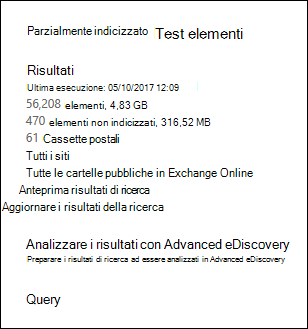
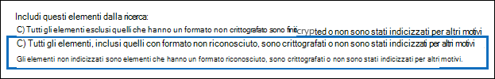

# <a name="investigating-partially-indexed-items-in-ediscovery"></a>Analisi degli elementi parzialmente indicizzati in eDiscovery

Una ricerca eDiscovery eseguita dal Centro conformità Microsoft 365 include automaticamente gli elementi parzialmente indicizzati nei risultati di ricerca stimati quando si esegue una ricerca. Gli elementi parzialmente indicizzati sono elementi e documenti delle cassette postali di Exchange nei siti di SharePoint e OneDrive for Business che per qualche motivo non sono stati completamente indicizzati per la ricerca. La maggior parte dei messaggi di posta elettronica e dei documenti del sito viene indicizzata correttamente perché rientrano nei limiti di [indicizzazione per i messaggi di posta elettronica.](limits-for-content-search.md#indexing-limits-for-email-messages) Tuttavia, alcuni elementi potrebbero superare questi limiti di indicizzazione e verranno parzialmente indicizzati. Ecco altri motivi per cui gli elementi non possono essere indicizzati per la ricerca e vengono restituiti come elementi parzialmente indicizzati quando si esegue una ricerca eDiscovery:
  
- I messaggi di posta elettronica dispongono di un file allegato senza un gestore valido, ad esempio file di immagine. questa è la causa più comune degli elementi di posta elettronica parzialmente indicizzati.

- Troppi file allegati a un messaggio di posta elettronica.

- Un file allegato a un messaggio di posta elettronica è troppo grande.

- Il tipo di file è supportato per l'indicizzazione ma si è verificato un errore di indicizzazione per un file specifico.

Sebbene vari, la maggior parte delle organizzazioni ha meno dell'1% del contenuto in base al volume e meno del 12% del contenuto in base alle dimensioni parzialmente indicizzate. Il motivo della differenza tra volume e dimensioni è che i file di dimensioni maggiori hanno una probabilità maggiore di contenere contenuto che non può essere completamente indicizzato.
  
## <a name="why-does-the-partially-indexed-item-count-change-for-a-search"></a>Perché il conteggio degli elementi parzialmente indicizzati cambia per una ricerca?

Dopo aver eseguito una ricerca eDiscovery, il numero totale e le dimensioni degli elementi parzialmente indicizzati nelle posizioni in cui è stata eseguita la ricerca vengono elencati nelle statistiche dei risultati della ricerca visualizzate nelle statistiche dettagliate per la ricerca. Si noti che questi elementi  *sono denominati elementi non indicizzati*  nelle statistiche di ricerca. Ecco alcuni aspetti che influiranno sul numero di elementi parzialmente indicizzati restituiti nei risultati della ricerca:
  
- Se un elemento è parzialmente indicizzato e corrisponde alla query di ricerca, viene incluso sia nel conteggio (e nelle dimensioni) degli elementi dei risultati della ricerca che negli elementi parzialmente indicizzati. Tuttavia, quando i risultati della stessa ricerca vengono esportati, l'elemento viene incluso solo con un set di risultati della ricerca. non è incluso come elemento parzialmente indicizzato.

- Se si specifica un intervallo di date per una query di ricerca,includendolo nella query con parole chiave o utilizzando una condizione, qualsiasi elemento parzialmente indicizzato che non corrisponde all'intervallo di date non viene incluso nel conteggio degli elementi parzialmente indicizzati. Gli elementi parzialmente indicizzati che rientrano nell'intervallo di date vengono inclusi nel conteggio degli elementi indicizzati.

  > [!NOTE]
  > Gli elementi parzialmente indicizzati che si  trovano nei siti di SharePoint e OneDrive non sono inclusi nella stima degli elementi parzialmente indicizzati visualizzati nelle statistiche dettagliate per la ricerca. Tuttavia, gli elementi parzialmente indicizzati possono essere esportati quando si esportano i risultati di una ricerca eDiscovery. Se ad esempio si esemplino solo i siti di ricerca, il numero stimato di elementi parzialmente indicizzati sarà zero.
  
## <a name="calculating-the-ratio-of-partially-indexed-items-in-your-organization"></a>Calcolo del rapporto di elementi parzialmente indicizzati nell'organizzazione

Per comprendere l'esposizione dell'organizzazione a elementi parzialmente indicizzati, è possibile eseguire una ricerca di tutto il contenuto in tutte le cassette postali (utilizzando una query con parole chiave vuota). Nell'esempio seguente sono presenti 56.208 (4.830 MB) elementi completamente indicizzati e 470 (316 MB) elementi parzialmente indicizzati.
  

  
È possibile determinare la percentuale di elementi parzialmente indicizzati utilizzando i calcoli seguenti.
  
 **Per calcolare il rapporto degli elementi parzialmente indicizzati nell'organizzazione:**

`(Total number of partially indexed items/Total number of items) x 100`

`(470/56,208) x 100 = 0.84%`

Utilizzando i risultati della ricerca dell'esempio precedente, l'84% di tutti gli elementi delle cassette postali viene parzialmente indicizzato.
  
 **Per calcolare la percentuale delle dimensioni degli elementi parzialmente indicizzati nell'organizzazione:**

`(Size of all partially indexed items/Size of all items) x 100`

`(316 MB/4830 MB) x 100 = 6.54%`

Nell'esempio precedente, pertanto, il 6,54% delle dimensioni totali degli elementi della cassetta postale deriva da elementi parzialmente indicizzati. Come indicato in precedenza, la maggior parte dei clienti delle organizzazioni ha meno dell'1% del contenuto in base al volume e meno del 12% del contenuto in base alle dimensioni parzialmente indicizzate.

## <a name="working-with-partially-indexed-items"></a>Utilizzo di elementi parzialmente indicizzati

Nei casi in cui è necessario esaminare parzialmente gli elementi per verificare che non contengano informazioni pertinenti, è possibile esportare un [report](export-a-content-search-report.md) di ricerca di contenuto contenente informazioni sugli elementi parzialmente indicizzati. Quando si esporta un report di ricerca di contenuto, assicurarsi di scegliere una delle opzioni di esportazione che includono elementi parzialmente indicizzati.
  

  
Quando si esportano i risultati della ricerca eDiscovery o un report di ricerca utilizzando una di queste opzioni, l'esportazione include un report denominato Items.csv. Questo report include la maggior parte delle stesse informazioni del file ResultsLog.csv; Tuttavia, il file non Items.csv include anche due campi correlati agli elementi parzialmente indicizzati: **Tag di** errore e **Proprietà errore.** Questi campi contengono informazioni sull'errore di indicizzazione per ogni elemento parzialmente indicizzato. L'utilizzo delle informazioni in questi due campi consente di determinare se l'errore di indicizzazione per un particolare impatto sull'indagine. In caso contrario, è possibile eseguire una ricerca mirata ed esportare messaggi di posta elettronica specifici e documenti di SharePoint o OneDrive in modo da poterli esaminare per determinare se sono rilevanti per l'indagine. Per istruzioni dettagliate, vedere Preparare un [file CSV per una ricerca mirata in Office 365.](csv-file-for-an-id-list-content-search.md)

> [!NOTE]
> Il file di Items.csv contiene anche campi denominati **Tipo di errore** e Messaggio di **errore.** Si tratta di campi legacy che contengono informazioni  simili  alle informazioni contenute nei campi Tag errore e Proprietà errore, ma con informazioni meno dettagliate. È possibile ignorare questi campi legacy.
  
## <a name="errors-related-to-partially-indexed-items"></a>Errori relativi agli elementi parzialmente indicizzati

I tag di errore sono formati da due informazioni, l'errore e il tipo di file. Ad esempio, in questa coppia errore/tipo di file:

```text
 parseroutputsize_xls
```

 `parseroutputsize` è l'errore `xls` ed è il tipo di file in cui si è verificato l'errore. Nei casi in cui il tipo di file non è stato riconosciuto o il tipo di file non è stato applicato all'errore, verrà visualizzato il valore al posto `noformat` del tipo di file.
  
Di seguito è riportato un elenco degli errori di indicizzazione e una descrizione della possibile causa dell'errore.
  
| Tag di errore | Descrizione |
|:-----|:-----|
| `attachmentcount` <br/> |Un messaggio di posta elettronica contiene troppi allegati e alcuni di questi allegati non sono stati elaborati.  <br/> |
| `attachmentdepth` <br/> |Il parser del contenuto e il parser del documento hanno trovato troppi livelli di allegati annidati all'interno di altri allegati. Alcuni di questi allegati non sono stati elaborati.  <br/> |
| `attachmentrms` <br/> |Decodifica di un allegato non riuscita perché protetta da RMS.  <br/> |
| `attachmentsize` <br/> |Un file allegato a un messaggio di posta elettronica è troppo grande e non può essere elaborato.  <br/> |
| `indexingtruncated` <br/> |Durante la scrittura del messaggio di posta elettronica elaborato nell'indice, una delle proprietà indicizzabili era troppo grande ed è stata troncata. Le proprietà troncate sono elencate nel campo Proprietà errore.  <br/> |
| `invalidunicode` <br/> |Un messaggio di posta elettronica conteneva testo che non è stato possibile elaborare come Unicode valido. L'indicizzazione per questo elemento potrebbe essere incompleta.  <br/> |
| `parserencrypted` <br/> |Il contenuto dell'allegato o del messaggio di posta elettronica è crittografato e Microsoft 365 non è stato in grado di decodificare il contenuto.  <br/> |
| `parsererror` <br/> |Si è verificato un errore sconosciuto durante l'analisi. Ciò in genere è il risultato di un bug software o di un arresto anomalo del servizio.  <br/> |
| `parserinputsize` <br/> |Un allegato era troppo grande per essere gestito dal parser e l'analisi dell'allegato non è stata completata o non è stata completata.  <br/> |
| `parsermalformed` <br/> |Un allegato non è valido e non può essere gestito dal parser. Questo risultato può essere dovuto a vecchi formati di file, file creati da software incompatibile o virus che fingono di essere qualcosa di diverso da quello richiesto.  <br/> |
| `parseroutputsize` <br/> |L'output dell'analisi di un allegato era troppo grande e doveva essere troncato.  <br/> |
| `parserunknowntype` <br/> |Un allegato aveva un tipo di file che Non è stato possibile rilevare in Microsoft 365.  <br/> |
| `parserunsupportedtype` <br/> |Un allegato aveva un tipo di file che Office 365 è in grado di rilevare, ma l'analisi di tale tipo di file non è supportata.  <br/> |
| `propertytoobig` <br/> |Il valore di una proprietà di posta elettronica nell'archivio di Exchange era troppo grande per essere recuperato e non è stato possibile elaborare il messaggio. Ciò si verifica in genere solo per la proprietà corpo di un messaggio di posta elettronica.  <br/> |
| `retrieverrms` <br/> |Il servizio di recupero contenuto non è riuscito a decodificare un messaggio protetto da RMS.  <br/> |
| `wordbreakertruncated` <br/> |Troppe parole identificate nel documento durante l'indicizzazione. L'elaborazione della proprietà è stata interrotta al raggiungimento del limite e la proprietà viene troncata.  <br/> |

I campi di errore descrivono i campi interessati dall'errore di elaborazione elencato nel campo Tag errore. Se si esegue una ricerca in una proprietà come o , gli errori nel corpo del messaggio non inciderà sui  `subject`  `participants` risultati della ricerca. Ciò può risultare utile per determinare esattamente quali elementi parzialmente indicizzati potrebbe essere necessario analizzare ulteriormente.
  
## <a name="using-a-powershell-script-to-determine-your-organizations-exposure-to-partially-indexed-email-items"></a>Uso di uno script di PowerShell per determinare l'esposizione dell'organizzazione a elementi di posta elettronica parzialmente indicizzati

I passaggi seguenti illustrano come eseguire uno script di PowerShell che cerca tutti gli elementi in tutte le cassette postali di Exchange e quindi genera un rapporto sul rapporto dell'organizzazione di elementi di posta elettronica parzialmente indicizzati (per numero e dimensioni) e visualizza il numero di elementi (e il relativo tipo di file) per ogni errore di indicizzazione che si verifica. Utilizzare le descrizioni dei tag di errore nella sezione precedente per identificare l'errore di indicizzazione.
  
1. Salvare il testo seguente in un file Windows PowerShell script utilizzando il suffisso del nome file ps1. ad esempio `PartiallyIndexedItems.ps1` .

   ```powershell
     write-host "**************************************************"
     write-host "     Security & Compliance Center      " -foregroundColor yellow -backgroundcolor darkgreen
     write-host "   eDiscovery Partially Indexed Item Statistics   " -foregroundColor yellow -backgroundcolor darkgreen
     write-host "**************************************************"
     " " 
     # Create a search with Error Tags Refinders enabled
     Remove-ComplianceSearch "RefinerTest" -Confirm:$false -ErrorAction 'SilentlyContinue'
     New-ComplianceSearch -Name "RefinerTest" -ContentMatchQuery "size>0" -RefinerNames ErrorTags -ExchangeLocation ALL
     Start-ComplianceSearch "RefinerTest"
     # Loop while search is in progress
     do{
         Write-host "Waiting for search to complete..."
         Start-Sleep -s 5
         $complianceSearch = Get-ComplianceSearch "RefinerTest"
     }while ($complianceSearch.Status -ne 'Completed')
     $refiners = $complianceSearch.Refiners | ConvertFrom-Json
     $errorTagProperties = $refiners.Entries | Get-Member -MemberType NoteProperty
     $partiallyIndexedRatio = $complianceSearch.UnindexedItems / $complianceSearch.Items
     $partiallyIndexedSizeRatio = $complianceSearch.UnindexedSize / $complianceSearch.Size
     " "
     "===== Partially indexed items ====="
     "         Total          Ratio"
     "Count    {0:N0}{1:P2}" -f $complianceSearch.Items.ToString("N0").PadRight(15, " "), $partiallyIndexedRatio
     "Size(GB) {0:N2}{1:P2}" -f ($complianceSearch.Size / 1GB).ToString("N2").PadRight(15, " "), $partiallyIndexedSizeRatio
     " "
     Write-Host ===== Reasons for partially indexed items =====
     foreach($errorTagProperty in $errorTagProperties)
     {
         $name = $refiners.Entries.($errorTagProperty.Name).Name
         $count = $refiners.Entries.($errorTagProperty.Name).TotalCount
         $frag = $name.Split("{_}")
         $errorTag = $frag[0]
         $fileType = $frag[1]
         if ($errorTag -ne $lastErrorTag)
         {
             $errorTag
         }
         "    " + $fileType + " => " + $count
         $lastErrorTag = $errorTag
     }
   ```

2. [Connettersi a PowerShell in Centro sicurezza e conformità](https://go.microsoft.com/fwlink/p/?linkid=627084).

3. In PowerShell & Centro sicurezza e conformità passare alla cartella in cui è stato salvato lo script nel passaggio 1, quindi eseguire lo script. Per esempio:

   ```powershell
   .\PartiallyIndexedItems.ps1
   ```

Ecco un esempio dell'output restituito dallo script.
  


> [!NOTE]
> Tenere presente quanto segue:
>  
> - Il numero totale e le dimensioni degli elementi di posta elettronica e il rapporto tra gli elementi di posta elettronica parzialmente indicizzati dell'organizzazione (in base al numero e alle dimensioni).
> 
> - Un elenco di tag di errore e i tipi di file corrispondenti per i quali si è verificato l'errore.
  
## <a name="see-also"></a>Vedere anche

[Elementi parzialmente indicizzati in eDiscovery](partially-indexed-items-in-content-search.md)
