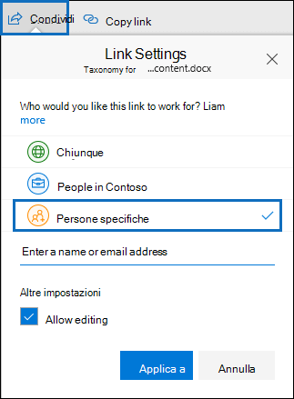

# <a name="keyword-queries-and-search-conditions-for-content-search-and-ediscovery"></a>Query con parole chiave e condizioni di ricerca per Ricerca contenuto ed eDiscovery

In questo argomento vengono descritte le proprietà di posta elettronica e documento che è possibile cercare negli elementi di posta elettronica in Exchange Online e i documenti archiviati nei siti di SharePoint e OneDrive for Business utilizzando la funzionalità Ricerca contenuto nel Centro conformità Microsoft 365. È inoltre possibile utilizzare i cmdlet **\* -ComplianceSearch** in PowerShell & Centro sicurezza e conformità per cercare queste proprietà. Nell'argomento vengono inoltre descritte le seguenti informazioni:
  
- Utilizzo di operatori di ricerca booleani, condizioni di ricerca e altre tecniche di query di ricerca per perfezionare i risultati della ricerca.

- Ricerca di tipi di dati sensibili e tipi di dati sensibili personalizzati in SharePoint e OneDrive for Business.

- Ricerca di contenuto del sito condiviso con utenti esterni all'organizzazione

Per istruzioni dettagliate su come creare una ricerca di contenuto, vedere [Ricerca contenuto.](content-search.md)

> [!NOTE]
> Ricerca contenuto nel Centro conformità Microsoft 365 e i cmdlet **\* -ComplianceSearch** corrispondenti in PowerShell per Centro sicurezza & conformità usano Keyword Query Language (KQL). Per informazioni più dettagliate, vedere Riferimento [alla sintassi keyword query language.](https://go.microsoft.com/fwlink/?LinkId=269603) 
  
## <a name="searchable-email-properties"></a>Proprietà di posta elettronica disponibili per la ricerca

Nella tabella seguente sono elencate le proprietà dei messaggi di posta elettronica che è possibile cercare utilizzando la funzionalità Ricerca contenuto nel Centro conformità Microsoft 365 o utilizzando il cmdlet **New-ComplianceSearch** o **Set-ComplianceSearch.** La tabella include un esempio della sintassi  _property:value_ per ogni proprietà e una descrizione dei risultati della ricerca restituiti dagli esempi. È possibile digitare queste  `property:value` coppie nella casella delle parole chiave per una ricerca di contenuto. 

> [!NOTE]
> Durante la ricerca delle proprietà di posta elettronica, non è possibile cercare gli elementi in cui la proprietà specificata è vuota o vuota. Ad esempio, l'utilizzo della coppia *property:value* **dell'oggetto:""** per cercare i messaggi di posta elettronica con una riga dell'oggetto vuota restituirà zero risultati. Questo vale anche per la ricerca di proprietà del sito e del contatto.
  
| Proprietà | Descrizione proprietà | Esempi | Risultati di ricerca restituiti dagli esempi |
|:-----|:-----|:-----|:-----|
|AttachmentNames|I nomi dei file allegati a un messaggio di posta elettronica.|`attachmentnames:annualreport.ppt`  <br/> `attachmentnames:annual*` <br/> `attachmentnames:.pptx` |Messaggi che contengono un file allegato denominato annualreport.ppt. Nel secondo esempio, utilizzando il carattere jolly si ottengono dei messaggi contenenti la parola "annual" nel nome file di un allegato. Nel terzo esempio vengono restituiti tutti gli allegati con estensione pptx.|
|Ccn|Campo Ccn di un messaggio di posta elettronica. <sup>1</sup>|`bcc:pilarp@contoso.com`  <br/> `bcc:pilarp`  <br/> `bcc:"Pilar Pinilla"`|Tutti gli esempi restituiscono messaggi contenenti Pilar Pinilla nel campo Bcc (Ccn).|
|Categoria| Le categorie da cercare. Le categorie possono essere definite dagli utenti utilizzando Outlook o Outlook sul Web (in precedenza noto come Outlook Web App). I valori possibili sono i seguenti:  <br/><br/>  blu  <br/>  verde  <br/>  arancione  <br/>  viola  <br/>  rosso  <br/>  giallo|`category:"Red Category"`|I messaggi ai quali è stata assegnata la categoria di colore rosso nelle cassette postali di origine. |
|Cc|Campo Cc di un messaggio di posta elettronica. <sup>1</sup>|`cc:pilarp@contoso.com`  <br/> `cc:"Pilar Pinilla"`|In entrambi gli esempi, i messaggi con Pilar Pinilla specificato nel campo Cc.|
|Folderid|ID cartella (GUID) di una cartella specifica della cassetta postale. Se si utilizza questa proprietà, assicurarsi di cercare nella cassetta postale in cui si trova la cartella specificata. Verrà cercata solo la cartella specificata. Le sottocartelle nella cartella non verranno cercate. Per cercare le sottocartelle, è necessario utilizzare la proprietà Folderid per la sottocartella in cui si desidera eseguire la ricerca.  <br/> Per ulteriori informazioni sulla ricerca della proprietà Folderid e sull'utilizzo di uno script per ottenere gli ID cartella per una cassetta postale specifica, vedere [Use Content Search for targeted collections.](use-content-search-for-targeted-collections.md)|`folderid:4D6DD7F943C29041A65787E30F02AD1F00000000013A0000`  <br/> `folderid:2370FB455F82FC44BE31397F47B632A70000000001160000 AND participants:garthf@contoso.com`|Nel primo esempio vengono restituiti tutti gli elementi nella cartella della cassetta postale specificata. Nel secondo esempio vengono restituiti tutti gli elementi nella cartella della cassetta postale specificata inviati o ricevuti da garthf@contoso.com.|
|Da|Il mittente di un messaggio di posta elettronica. <sup>1</sup>|`from:pilarp@contoso.com`  <br/> `from:contoso.com`|I messaggi inviati dall'utente specificato o da un dominio specificato.|
|HasAttachment|Indica se un messaggio contiene un allegato. Utilizzare i valori **true** o **false.**|`from:pilar@contoso.com AND hasattachment:true`|Messaggi inviati dall'utente specificato con allegati.|
|Priorità|La priorità di un messaggio di posta elettronica, che può essere specificata dall'utente al momento dell'invio di un messaggio. Per impostazione predefinita, i messaggi vengono inviati con una priorità normale, a meno che il mittente non imposti la priorità **high** (alta) o **low** (bassa).|`importance:high`  <br/> `importance:medium`  <br/> `importance:low`|I messaggi contrassegnati con priorità alta, media o bassa.|
|IsRead|Indica se i messaggi sono stati letti. Utilizzare i valori **true** o **false.**|`isread:true`  <br/> `isread:false`|Nel primo esempio vengono restituiti i messaggi con la proprietà IsRead impostata su **True.** Nel secondo esempio vengono restituiti i messaggi con la proprietà IsRead impostata su **False.**|
|Itemclass|Utilizzare questa proprietà per cercare tipi di dati di terze parti specifici importati dall'organizzazione in Office 365. Utilizzare la sintassi seguente per questa proprietà:  `itemclass:ipm.externaldata.<third-party data type>*`|`itemclass:ipm.externaldata.Facebook* AND subject:contoso`  <br/> `itemclass:ipm.externaldata.Twitter* AND from:"Ann Beebe" AND "Northwind Traders"`|Nel primo esempio vengono restituiti gli elementi di Facebook che contengono la parola "contoso" nella proprietà Subject. Nel secondo esempio vengono restituiti gli elementi di Twitter pubblicati da Ann Beebe e contenenti la frase parola chiave "Northwind Traders".  <br/> Per un elenco completo dei valori da utilizzare per i tipi di dati di terze parti per la proprietà ItemClass, vedere Usare Ricerca contenuto per cercare dati di terze parti importati [in Office 365.](use-content-search-to-search-third-party-data-that-was-imported.md)|
|Tipo| Tipo di messaggio di posta elettronica da cercare. Valori possibili:  <br/>  contatti  <br/>  docs  <br/>  e-mail  <br/>  externaldata  <br/>  fax  <br/>  im  <br/>  journal  <br/>  riunioni  <br/>  microsoftteams (restituisce elementi da chat, riunioni e chiamate in Microsoft Teams)  <br/>  note  <br/>  post  <br/>  rssfeeds  <br/>  attività  <br/>  segreteria telefonica|`kind:email`  <br/> `kind:email OR kind:im OR kind:voicemail`  <br/> `kind:externaldata`|Nel primo esempio vengono restituiti i messaggi di posta elettronica che soddisfano i criteri di ricerca. Nel secondo esempio vengono restituiti i messaggi di posta elettronica, le conversazioni di messaggistica istantanea (incluse le conversazioni e le chat di Skype for Business in Microsoft Teams) e i messaggi vocali che soddisfano i criteri di ricerca. Nel terzo esempio vengono restituiti gli elementi importati nelle cassette postali di Microsoft 365 da origini dati di terze parti, ad esempio Twitter, Facebook e Cisco Jabber, che soddisfano i criteri di ricerca. Per ulteriori informazioni, vedere [Archiviazione di dati di terze parti in Office 365.](https://www.microsoft.com/?ref=go)|
|Partecipanti|Tutti i campi degli utenti in un messaggio di posta elettronica. Questi campi sono From, To, Cc e Bcc.<sup>1</sup>|`participants:garthf@contoso.com`  <br/> `participants:contoso.com`|I messaggi inviati da o a garthf@contoso.com. Il secondo esempio restituisce tutti i messaggi inviati da o a un utente nel dominio contoso.com.|
|Ricevuto|La data in cui un messaggio di posta elettronica viene ricevuto da un destinatario.|`received:04/15/2016`  <br/> `received>=01/01/2016 AND received<=03/31/2016`|Messaggi ricevuti il 15 aprile 2016. Nel secondo esempio vengono restituiti tutti i messaggi ricevuti tra il 1° gennaio 2016 e il 31 marzo 2016.|
|Destinatari|Tutti i campi del destinatario in un messaggio di posta elettronica. Questi campi sono A, Cc e Ccn.<sup>1</sup>|`recipients:garthf@contoso.com`  <br/> `recipients:contoso.com`|I messaggi inviati a garthf@contoso.com. Il secondo esempio restituisce i messaggi inviati ai destinatari nel dominio contoso.com.|
|Inviato|La data in cui un messaggio di posta elettronica viene inviato dal mittente.|`sent:07/01/2016`  <br/> `sent>=06/01/2016 AND sent<=07/01/2016`|I messaggi inviati in una data specifica o entro l'intervallo di date specificato.|
|Dimensioni|Le dimensioni di un elemento, in byte.|`size>26214400`  <br/> `size:1..1048567`|Messaggi di dimensioni superiori a 25? MB. Il secondo esempio restituisce i messaggi di dimensioni comprese tra 1 e 1.048.567 byte (1 MB).|
|Oggetto|Il testo nella riga dell'oggetto di un messaggio di posta elettronica.  <br/> **Nota:** Quando si utilizza la proprietà Subject in una query, la ricerca restituisce tutti i messaggi in cui la riga dell'oggetto contiene il testo che si sta cercando. In altre parole, la query non restituisce solo i messaggi con una corrispondenza esatta. Ad esempio, se si cerca , i risultati includeranno i messaggi con l'oggetto  `subject:"Quarterly Financials"` "Quarterly Financials 2018".|`subject:"Quarterly Financials"`  <br/> `subject:northwind`|Messaggi che contengono la frase "Quarterly Financials" in qualsiasi punto del testo della riga dell'oggetto. Il secondo esempio restituisce tutti i messaggi che contengono la parola northwind nella riga dell'oggetto.|
|A|Campo A di un messaggio di posta elettronica. <sup>1</sup>|`to:annb@contoso.com`  <br/> `to:annb ` <br/> `to:"Ann Beebe"`|Tutti gli esempi restituiscono i messaggi in cui è specificato l'utente Ann Beebe nella riga To: (A:).|
|||||
   
> [!NOTE]
> <sup>1</sup> Per il valore di una proprietà del destinatario, è possibile utilizzare l'indirizzo di posta elettronica (denominato anche nome dell'entità utente o UPN), il nome visualizzato o l'alias per specificare un utente.  Ad esempio, è possibile usare annb@contoso.com, annb o "Ann Beebe" per specificare l'utente Ann Beebe.

### <a name="recipient-expansion"></a>Espansione dei destinatari

Quando si esegue una ricerca in una delle proprietà del destinatario (Da, A, Cc, Ccn, Partecipanti e Destinatari), Microsoft 365 tenta di espandere l'identità di ogni utente cercandoli in Azure Active Directory (Azure AD).  Se l'utente viene trovato in Azure AD, la query viene espansa per includere l'indirizzo di posta elettronica dell'utente (o UPN), l'alias, il nome visualizzato e LegacyExchangeDN. Ad esempio, una query, ad `participants:ronnie@contoso.com` esempio, si espande in `participants:ronnie@contoso.com OR participants:ronnie OR participants:"Ronald Nelson" OR participants:"<LegacyExchangeDN>"` .

Per impedire l'espansione dei destinatari, aggiungere un carattere jolly (asterisco) alla fine dell'indirizzo di posta elettronica e utilizzare un nome di dominio ridotto. Ad esempio, `participants:"ronnie@contoso*"` assicurarsi di racchiudere l'indirizzo di posta elettronica tra virgolette doppie.

Tuttavia, tenere presente che se si impedisce l'espansione dei destinatari nella query di ricerca, gli elementi pertinenti potrebbero non essere restituiti nei risultati della ricerca. I messaggi di posta elettronica in Exchange possono essere salvati con formati di testo diversi nei campi dei destinatari. L'espansione dei destinatari ha lo scopo di attenuare questo problema tramite la restituzione di messaggi che potrebbero contenere formati di testo diversi. Pertanto, se si impedisce l'espansione dei destinatari, la query di ricerca potrebbe non restituire tutti gli elementi che potrebbero essere rilevanti per l'indagine.

> [!NOTE]
> Se è necessario esaminare o ridurre gli elementi restituiti da una query di ricerca a causa dell'espansione dei destinatari, è consigliabile utilizzare Advanced eDiscovery. È possibile cercare i messaggi (sfruttando l'espansione del destinatario), aggiungerli a un insieme di recensioni e quindi utilizzare query o filtri impostati per rivedere o limitare i risultati. Per ulteriori informazioni, vedere [Raccogliere dati per un caso](collecting-data-for-ediscovery.md) ed eseguire query sui dati in un insieme da [rivedere.](review-set-search.md)

## <a name="searchable-site-properties"></a>Proprietà dei siti disponibili per la ricerca

Nella tabella seguente sono elencate alcune delle proprietà di SharePoint e OneDrive for Business che è possibile cercare utilizzando la funzionalità Ricerca contenuto nel Centro sicurezza & conformità o utilizzando il cmdlet **New-ComplianceSearch** o **Set-ComplianceSearch.** La tabella include un esempio della sintassi  _property:value_ per ogni proprietà e una descrizione dei risultati della ricerca restituiti dagli esempi. 
  
Per un elenco completo delle proprietà di SharePoint in cui è possibile eseguire ricerche, vedere Panoramica delle proprietà sottoposte a ricerca per indicizzazione [e gestite in SharePoint.](https://go.microsoft.com/fwlink/p/?LinkId=331599) È possibile eseguire ricerche  nelle proprietà contrassegnate con **Sì** nella colonna Queryable. 
  
| Proprietà | Descrizione proprietà | Esempio | Risultati di ricerca restituiti dagli esempi |
|:-----|:-----|:-----|:-----|
|Author|Il campo dell'autore dei documenti di Office, che persiste se un documento viene copiato. Ad esempio, se un utente crea un documento e lo invia tramite posta elettronica a un altro utente che lo carica in SharePoint, il documento manterrà comunque l'autore originale. Assicurarsi di utilizzare il nome visualizzato dell'utente per questa proprietà.|`author:"Garth Fort"`|Tutti i documenti creati da Garth Fort.|
|ContentType|Tipo di contenuto di SharePoint di un elemento, ad esempio Elemento, Documento o Video.|`contenttype:document`|Vengono restituiti tutti i documenti.|
|Creato|La data di creazione di un elemento.|`created>=06/01/2016`|Tutti gli elementi creati il 1° giugno 2016 o dopo il 1° giugno 2016.|
|CreatedBy|L'utente che ha creato o caricato un elemento. Assicurarsi di utilizzare il nome visualizzato dell'utente per questa proprietà.|`createdby:"Garth Fort"`|Tutti gli elementi creati o caricati da Garth Fort.|
|DetectedLanguage|La lingua di un elemento.|`detectedlanguage:english`|Tutti gli elementi in lingua inglese.|
|DocumentLink|Percorso (URL) di una cartella specifica in un sito di SharePoint o OneDrive for Business. Se si utilizza questa proprietà, assicurarsi di eseguire la ricerca nel sito in cui si trova la cartella specificata.  <br/> Per restituire gli elementi che si trovano in sottocartelle della cartella specificata per la proprietà documentlink, è necessario aggiungere / all'URL della cartella \* specificata, ad esempio  `documentlink: "https://contoso.sharepoint.com/Shared Documents/*"`  <br/> <br/>Per ulteriori informazioni sulla ricerca della proprietà documentlink e sull'utilizzo di uno script per ottenere gli URL documentlink per le cartelle in un sito specifico, vedere [Use Content Search for targeted collections.](use-content-search-for-targeted-collections.md)|`documentlink:"https://contoso-my.sharepoint.com/personal/garthf_contoso_com/Documents/Private"`  <br/> `documentlink:"https://contoso-my.sharepoint.com/personal/garthf_contoso_com/Documents/Shared with Everyone/*" AND filename:confidential`|Nel primo esempio vengono restituiti tutti gli elementi nella cartella OneDrive for Business specificata. Nel secondo esempio vengono restituiti i documenti nella cartella del sito specificata (e in tutte le sottocartelle) che contengono la parola "confidential" nel nome del file.|
|FileExtension|L'estensione di un file; ad esempio docx, one, pptx o xlsx.|`fileextension:xlsx`|Tutti i file di Excel (Excel 2007 e versioni successive)|
|FileName|Il nome di un file.|`filename:"marketing plan"`  <br/> `filename:estimate`|Il primo esempio restituisce i file con la frase esatta "marketing plan" nel titolo. Il secondo esempio restituisce i file con la parola "estimate" nel nome file.|
|LastModifiedTime|La data dell'ultima modifica di un elemento.|`lastmodifiedtime>=05/01/2016`  <br/> `lastmodifiedtime>=05/10/2016 AND lastmodifiedtime<=06/1/2016`|Nel primo esempio vengono restituiti gli elementi modificati il 1° maggio 2016 o dopo il 1° maggio 2016. Nel secondo esempio vengono restituiti gli elementi modificati tra il 1° maggio 2016 e il 1° giugno 2016.|
|ModifiedBy|L'autore dell'ultima modifica di un elemento. Assicurarsi di utilizzare il nome visualizzato dell'utente per questa proprietà.|`modifiedby:"Garth Fort"`|Tutti gli elementi in cui l’ultima modifica è stata apportata da Garth Fort.|
|Percorso|Percorso (URL) di un sito specifico in un sito di SharePoint o OneDrive for Business.  <br/> Per restituire gli elementi che si trovano in cartelle del sito specificato per la proprietà path, è necessario aggiungere / all'URL del sito \* specificato, ad esempio  `path: "https://contoso.sharepoint.com/Shared Documents/*"`  <br/> <br/> **Nota:** L'uso della proprietà per eseguire ricerche nei percorsi di OneDrive non restituirà file multimediali, ad esempio file con estensione  `Path` png, tiff o wav, nei risultati della ricerca. Usare una proprietà del sito diversa nella query di ricerca per cercare i file multimediali nelle cartelle di OneDrive. <br/>|`path:"https://contoso-my.sharepoint.com/personal/garthf_contoso_com/"`  <br/> `path:"https://contoso-my.sharepoint.com/personal/garthf_contoso_com/*" AND filename:confidential`|Nel primo esempio vengono restituiti tutti gli elementi nel sito di OneDrive for Business specificato. Nel secondo esempio vengono restituiti i documenti nel sito specificato (e nelle cartelle del sito) che contengono la parola "confidential" nel nome del file.|
|SharedWithUsersOWSUser|Documenti condivisi con l'utente specificato e visualizzati nella pagina Condivisi con **l'utente** corrente nel sito OneDrive for Business dell'utente. Si tratta di documenti che sono stati esplicitamente condivisi con l'utente specificato da altre persone dell'organizzazione. Quando si esportano documenti che corrispondono a una query di ricerca che utilizza la proprietà SharedWithUsersOWSUser, i documenti vengono esportati dal percorso del contenuto originale della persona che ha condiviso il documento con l'utente specificato. Per ulteriori informazioni, vedere [Ricerca di contenuto del sito condiviso all'interno dell'organizzazione.](#searching-for-site-content-shared-within-your-organization)|`sharedwithusersowsuser:garthf`  <br/> `sharedwithusersowsuser:"garthf@contoso.com"`|Entrambi gli esempi restituiscono tutti i documenti interni che sono stati esplicitamente condivisi con Garth Fort e che vengono visualizzati nella pagina Condivisi con **me** nell'account OneDrive for Business di Garth Fort.|
|Sito|L'URL di un sito o di un gruppo di siti nell'organizzazione.|`site:"https://contoso-my.sharepoint.com"`  <br/> `site:"https://contoso.sharepoint.com/sites/teams"`|Nel primo esempio vengono restituiti gli elementi dai siti di OneDrive for Business per tutti gli utenti dell'organizzazione. Il secondo esempio restituisce gli elementi di tutti i siti dei team.|
|Dimensioni|Le dimensioni di un elemento, in byte.|`size>=1`  <br/> `size:1..10000`|Il primo esempio restituisce gli elementi di dimensioni maggiori di 1 byte. Il secondo esempio restituisce gli elementi di dimensioni comprese tra 1 e 10.000 byte.|
|Titolo|Il titolo del documento. La proprietà Title è un tipo di metadati specificato nei Microsoft Office documenti. È diverso dal nome del file del documento.|`title:"communication plan"`|Qualsiasi documento contenente la frase "communication plan" nella proprietà di metadati Title di un documento di Office.|
|||||

## <a name="searchable-contact-properties"></a>Proprietà dei contatti disponibili per la ricerca

Nella tabella seguente sono elencate le proprietà dei contatti indicizzate che è possibile cercare tramite Ricerca contenuto. Si tratta delle proprietà disponibili per la configurazione degli utenti per i contatti (detti anche contatti personali) che si trovano nella rubrica personale della cassetta postale di un utente. Per cercare i contatti, è possibile selezionare le cassette postali in cui eseguire la ricerca e quindi utilizzare una o più proprietà di contatto nella query con parole chiave.
  
> [!TIP]
> Per cercare valori contenenti spazi o caratteri speciali, utilizzare le virgolette doppie (" ") per contenere la frase. ad esempio `businessaddress:"123 Main Street"` .
  
| Proprietà | Descrizione proprietà |
|:-----|:-----|
|BusinessAddress|Indirizzo nella **proprietà Indirizzo** aziendale. La proprietà è anche denominata **Indirizzo** di lavoro nella pagina delle proprietà del contatto.|
|BusinessPhone|Il numero di telefono in una qualsiasi delle **proprietà del numero** di telefono dell'ufficio.|
|CompanyName|Nome nella **proprietà Company.**|
|Reparto|Nome nella **proprietà Department.**|
|DisplayName|Nome visualizzato del contatto. Si tratta del nome nella **proprietà Nome** completo del contatto.|
|EmailAddress|L'indirizzo di qualsiasi proprietà dell'indirizzo di posta elettronica per il contatto. Gli utenti possono aggiungere più indirizzi di posta elettronica per un contatto. L'utilizzo di questa proprietà restituisce i contatti che corrispondono a uno qualsiasi degli indirizzi di posta elettronica del contatto.|
|FileAs|La **proprietà File** as. Questa proprietà viene utilizzata per specificare la modalità di elenco del contatto nell'elenco contatti dell'utente. Ad esempio, un contatto potrebbe essere elencato come *Nome, Cognome* o *Cognome,Nome.*|
|GivenName|Nome nella **proprietà Nome.**|
|HomeAddress|L'indirizzo in una qualsiasi delle **proprietà dell'indirizzo** dell'abitazione.|
|HomePhone|Il numero di telefono in una qualsiasi delle **proprietà del numero** di telefono dell'abitazione.|
|IMAddress|La proprietà dell'indirizzo di messaggistica istantanea, che in genere è un indirizzo di posta elettronica utilizzato per la messaggistica istantanea.|
|MiddleName|Nome nella **proprietà Secondo** nome.|
|MobilePhone|Numero di telefono nella **proprietà Numero** di telefono cellulare.|
|Nickname|Nome nella proprietà **Nickname.**|
|OfficeLocation|Valore nella proprietà **della** posizione di **Office o** Office.|
|OtherAddress|Valore della proprietà **Other** address.|
|Cognome|Nome nella **proprietà Cognome.**|
|Titolo|Titolo nella proprietà **Posizione** lavorativa.|
|||||

## <a name="searchable-sensitive-data-types"></a>Tipi di dati sensibili disponibili per la ricerca

È possibile utilizzare gli strumenti di ricerca eDiscovery nel Centro conformità Microsoft 365 per cercare dati sensibili, ad esempio numeri di carta di credito o numeri di previdenza sociale, archiviati nei documenti nei siti di SharePoint e OneDrive for Business. A tale scopo, è possibile utilizzare la proprietà e il nome (o ID) di un tipo `SensitiveType` di informazioni riservate in una query con parole chiave. Ad esempio, la query `SensitiveType:"Credit Card Number"` restituisce i documenti che contengono un numero di carta di credito. La query  `SensitiveType:"U.S. Social Security Number (SSN)"` restituisce i documenti che contengono un numero di previdenza sociale statunitense.

Per visualizzare un elenco dei tipi di informazioni riservate  che è possibile cercare, passare a Classificazioni dei dati Tipi di informazioni sensibili nel Centro conformità \>  Microsoft 365. In or you can use the **Get-DlpSensitiveInformationType** cmdlet in Security & Compliance Center PowerShell to display a list of sensitive information types.
  
Per ulteriori informazioni sulla creazione di query utilizzando la proprietà, vedere Creare una query per trovare dati `SensitiveType` [sensibili archiviati nei siti.](form-a-query-to-find-sensitive-data-stored-on-sites.md)

### <a name="limitations-for-searching-sensitive-data-types"></a>Limitazioni per la ricerca di tipi di dati sensibili

- Per cercare tipi di informazioni sensibili personalizzati, è necessario specificare l'ID del tipo di informazioni riservate nella `SensitiveType` proprietà. L'utilizzo del nome di un tipo di informazioni sensibili personalizzato (come illustrato nell'esempio per i tipi di informazioni riservate predefiniti nella sezione precedente) non restituirà alcun risultato. Usare la **colonna Autore** nella pagina **Tipi** di informazioni sensibili nel Centro conformità (o la proprietà **Publisher** in PowerShell) per distinguere tra i tipi di informazioni riservate predefiniti e personalizzati. I tipi di dati sensibili predefiniti hanno un valore `Microsoft Corporation` per la **proprietà Publisher.**

  Per visualizzare il nome e l'ID per i tipi di dati sensibili personalizzati nell'organizzazione, eseguire il comando seguente in PowerShell per Centro sicurezza & conformità:

  ```powershell
  Get-DlpSensitiveInformationType | Where-Object {$_.Publisher -ne "Microsoft Corporation"} | FT Name,Id
  ```

  È quindi possibile utilizzare l'ID nella proprietà di ricerca per restituire documenti contenenti il tipo di dati sensibili `SensitiveType` personalizzato, ad esempio `SensitiveType:7e13277e-6b04-3b68-94ed-1aeb9d47de37`
  
- Non è possibile utilizzare i tipi di informazioni riservate e la proprietà di ricerca per cercare dati sensibili in locale nelle cassette postali `SensitiveType` di Exchange Online. Tuttavia, è possibile utilizzare i criteri di prevenzione della perdita dei dati (DLP) per proteggere i dati di posta elettronica sensibili in transito. Per ulteriori informazioni, vedere [Overview of data loss prevention policies](data-loss-prevention-policies.md) and Search for and find personal [data.](search-for-and-find-personal-data.md)
  
## <a name="search-operators"></a>Operatori di ricerca

Gli operatori di ricerca booleani, ad esempio **AND**, **OR** e **NOT,** consentono di definire ricerche più precise includendo o escludendo parole specifiche nella query di ricerca. Altre tecniche, ad esempio l'utilizzo di operatori di proprietà (ad esempio o ), virgolette, parentesi e caratteri jolly, consentono di perfezionare `>=` `..` una query di ricerca. Nella tabella seguente vengono elencati gli operatori che è possibile utilizzare per circoscrivere o ampliare i risultati della ricerca. 
  
| Operatore | Usage | Descrizione |
|:-----|:-----|:-----|
|E|keyword1 AND keyword2|Restituisce gli elementi che includono tutte le parole chiave o le espressioni  `property:value` specificate. Ad esempio, restituirebbe tutti i messaggi inviati da Ann Beebe che contenevano la  `from:"Ann Beebe" AND subject:northwind` parola northwind nella riga dell'oggetto. <sup>2</sup>|
|+|keyword1 + keyword2 + keyword3|Restituisce gli elementi che *contengono o* che contengono `keyword2` anche `keyword3`  `keyword1` .   Di conseguenza, questo esempio equivale alla  `(keyword2 OR keyword3) AND keyword1` query.  <br/> La `keyword1 + keyword2` query, con uno spazio dopo il **+** simbolo, non corrisponde all'utilizzo dell'operatore **AND.** Questa query equivale a restituire  `"keyword1 + keyword2"` gli elementi con la fase  `"keyword1 + keyword2"` esatta.|
|OPPURE|keyword1 OR keyword2|Restituisce gli elementi che includono una o più parole chiave o espressioni  `property:value` specificate. <sup>2</sup>|
|NOT|keyword1 NOT keyword2  <br/> NOT from:"Ann Beebe"  <br/> NOT kind:im|Esclude gli elementi specificati da una parola chiave o da  `property:value` un'espressione. Nel secondo esempio vengono esclusi i messaggi inviati da Ann Beebe. Nel terzo esempio vengono escluse le conversazioni di messaggistica istantanea, ad esempio le conversazioni di Skype for Business salvate nella cartella della cassetta postale Cronologia conversazioni. <sup>2</sup>|
|-|keyword1 -keyword2|Equivale all'operatore **NOT**. Pertanto, questa query restituisce gli elementi che  `keyword1` contengono ed escludono gli elementi che contengono  `keyword2` .|
|NEAR|keyword1 NEAR(n) keyword2|Restituisce gli elementi con parole che sono una accanto all'altra, dove n equivale al numero delle parole separate. Ad esempio, `best NEAR(5) worst` restituisce qualsiasi elemento in cui la parola "peggiore" è entro cinque parole da "migliore". Se non viene specificato alcun numero, la distanza predefinita è di otto parole. <sup>2</sup>|
|:|property:value|I due punti (:) nella sintassi specifica che il valore della proprietà da cercare  `property:value` contiene il valore specificato. Ad esempio,  `recipients:garthf@contoso.com` restituisce qualsiasi messaggio inviato a garthf@contoso.com.|
|=|property=value|Uguale all'operatore **:** .|
|\<|valore della \< proprietà|Indica che la proprietà da cercare è inferiore al valore specificato.  <sup>1</sup>|
|\>|valore della \> proprietà|Indica che la proprietà in cui viene ricercata è maggiore del valore specificato. <sup>1</sup>|
|\<=|property \< =value|Indica che la proprietà da cercare è minore o uguale a un valore specifico. <sup>1</sup>|
|\>=|property \> =value|Indica che la proprietà da cercare è maggiore o uguale a un valore specifico. <sup>1</sup>|
|..|property:value1.. value2|Indica che la proprietà da cercare è maggiore o uguale a value1 e minore o uguale a value2. <sup>1</sup>|
|"  "|"fair value"  <br/> subject:"Quarterly Financials"|Utilizzare le virgolette doppie (" ") per cercare una frase o un termine esatto nelle query di ricerca e nelle parole  `property:value` chiave.|
|\*|cat\*  <br/> subject:set\*|Le ricerche con caratteri jolly con prefisso (dove l'asterisco è posizionato alla fine di una parola) corrispondono a zero o più caratteri nelle parole chiave o nelle  `property:value` query. Ad esempio, restituisce i documenti che contengono il set di parole, l'impostazione e l'impostazione (e altre parole che iniziano con  `title:set*` "set") nel titolo del documento.  <br/><br/> **Nota:** È possibile utilizzare solo le ricerche con caratteri jolly come prefisso. ad esempio **cat _ o \* *_* set \* *_. Le ricerche suffisso (_* \* cat** ), infix searches (**c \* t**) e le ricerche sottostringhe (**\* cat \***) non sono supportate.|
|(  )| (fair OR free) AND (from:contoso.com)  <br/>  (IPO OR initial) AND (stock OR shares)  <br/>  (quarterly financials)|Le parentesi raggruppano frasi  `property:value` booleane, elementi e parole chiave. Ad esempio,  `(quarterly financials)` restituisce gli elementi che contengono le parole trimestrali e finanziari.|
|||||
   
> [!NOTE]
> <sup>1</sup> Utilizzare questo operatore per le proprietà con valori numerici o di data.<br/> <sup>2 Gli</sup> operatori di ricerca booleani devono essere maiuscoli. ad esempio **AND.** Se si utilizza un operatore minuscolo, ad esempio **e**, verrà considerato come parola chiave nella query di ricerca. 
  
## <a name="search-conditions"></a>Condizioni di ricerca

È possibile aggiungere condizioni a una query di ricerca per restringere una ricerca e restituire un set di risultati più perfezionato. Ogni condizione aggiunge una clausola alla query di ricerca KQL creata ed eseguita all'avvio della ricerca.
  
[Condizioni per le proprietà comuni ](#conditions-for-common-properties)

[Condizioni per le proprietà della posta](#conditions-for-mail-properties)

[Condizioni per le proprietà dei documenti](#conditions-for-document-properties)

[Operatori utilizzati con condizioni](#operators-used-with-conditions)

[Linee guida per l'uso di condizioni](#guidelines-for-using-conditions)

[Esempi](#examples-of-using-conditions-in-search-queries)
  
### <a name="conditions-for-common-properties"></a>Condizioni per le proprietà comuni

Creare una condizione utilizzando le proprietà comuni quando si cercano cassette postali e siti nella stessa ricerca. Nella tabella seguente sono elencate le proprietà disponibili da utilizzare per l'aggiunta di una condizione.
  
| Condizione | Descrizione |
|:-----|:-----|
|Data|Per la posta elettronica, la data di un messaggio ricevuto da un destinatario o inviato da un mittente. Per i documenti, data dell'ultima modifica di un documento.|
|Mittente/Autore|Per la posta elettronica, l'utente che ha inviato un messaggio. Per i documenti, l'utente menzionato nel campo dell'autore dei documenti di Office. È possibile digitare più nomi, separati da virgole. Due o più valori sono collegati logicamente dall'operatore **OR**.|
|Dimensioni (in byte)|Per la posta elettronica e i documenti, la dimensione dell'elemento (in byte).|
|Oggetto/Titolo|Per la posta elettronica, il testo nella riga dell'oggetto di un messaggio. Per i documenti, il titolo del documento. Come descritto in precedenza, la proprietà Title è un metadati specificati Microsoft Office documenti. È possibile digitare il nome di più di un oggetto/titolo, separati da virgole. Due o più valori sono collegati logicamente dall'operatore **OR**.|
|Etichetta di conformità|Sia per la posta elettronica che per i documenti, le etichette di conservazione assegnate ai messaggi e ai documenti automaticamente dai criteri di etichetta automatica o dalle etichette di conservazione assegnate manualmente dagli utenti. Le etichette di conservazione vengono utilizzate per classificare la posta elettronica e i documenti per la governance delle informazioni e applicare regole di conservazione in base alle impostazioni definite dall'etichetta. È possibile digitare parte del nome dell'etichetta di conservazione e utilizzare un carattere jolly o digitare il nome completo dell'etichetta. Per ulteriori informazioni sulle etichette di conservazione, vedere [Informazioni sui criteri di conservazione e sulle etichette di conservazione.](retention.md)|
|||
  
### <a name="conditions-for-mail-properties"></a>Condizioni per le proprietà della posta

Creare una condizione utilizzando le proprietà della posta quando si effettuano ricerche in cassette postali o cartelle pubbliche. Nella tabella seguente vengono elencate le proprietà della posta elettronica che è possibile utilizzare per una condizione. Queste proprietà sono un sottoinsieme delle proprietà di posta elettronica descritte in precedenza. Queste descrizioni vengono ripetute per comodità.
  
| Condizione | Descrizione |
|:-----|:-----|
|Tipo di messaggio| Il tipo di messaggio da cercare. Corrisponde alla proprietà della posta elettronica Kind (Tipo). Valori possibili:  <br/><br/>  contatti  <br/>  docs  <br/>  e-mail  <br/>  externaldata  <br/>  fax  <br/>  im  <br/>  journal  <br/>  riunioni  <br/>  microsoftteams  <br/>  note  <br/>  post  <br/>  rssfeeds  <br/>  attività  <br/>  segreteria telefonica|
|Partecipanti|Tutti i campi degli utenti in un messaggio di posta elettronica. Questi campi sono From, To, Cc e Bcc.|
|Tipo|Proprietà della classe messaggio per un elemento di posta elettronica. Si tratta della stessa proprietà della proprietà di posta elettronica ItemClass. È anche una condizione multivalore. Per selezionare più classi messaggio, tenere premuto **CTRL** e quindi fare clic su due o più classi messaggio nell'elenco a discesa che si desidera aggiungere alla condizione. Ogni classe messaggio selezionata nell'elenco verrà collegata logicamente dall'operatore **OR** nella query di ricerca corrispondente.  <br/> Per un elenco delle classi messaggio (e dell'ID classe messaggio corrispondente) utilizzate  da Exchange e che è possibile selezionare nell'elenco delle classi messaggio, vedere Tipi di elemento e [classi messaggio.](https://go.microsoft.com/fwlink/?linkid=848143)|
|Ricevuto|La data in cui un messaggio di posta elettronica viene ricevuto da un destinatario. Corrisponde alla proprietà della posta elettronica Received (Ricevuto).|
|Destinatari|Tutti i campi del destinatario in un messaggio di posta elettronica. Questi campi sono A, Cc e Ccn.|
|Mittente|Il mittente di un messaggio di posta elettronica.|
|Inviato|La data in cui un messaggio di posta elettronica viene inviato dal mittente. Corrisponde alla proprietà della posta elettronica Sent (Inviato).|
|Oggetto|Il testo nella riga dell'oggetto di un messaggio di posta elettronica.|
|A|Destinatario di un messaggio di posta elettronica nel campo A.|
|||
  
### <a name="conditions-for-document-properties"></a>Condizioni per le proprietà dei documenti

Creare una condizione usando le proprietà dei documenti durante la ricerca di documenti nei siti di SharePoint e OneDrive for Business. Nella tabella seguente vengono elencate le proprietà dei documenti che è possibile utilizzare per una condizione. Queste proprietà sono un sottoinsieme delle proprietà del sito descritte in precedenza. Queste descrizioni vengono ripetute per comodità.
  
| Condizione | Descrizione |
|:-----|:-----|
|Author|Il campo dell'autore dei documenti di Office, che persiste se un documento viene copiato. Ad esempio, se un utente crea un documento e lo invia tramite posta elettronica a un altro utente che lo carica in SharePoint, il documento manterrà comunque l'autore originale.|
|Titolo|Il titolo del documento. La proprietà Title è rappresentata dai metadati specificati nei documenti di Office. È diverso dal nome del file del documento.|
|Creato|La data di creazione di un documento.|
|Data ultima modifica|La data dell'ultima modifica di un documento.|
|Tipo file|L'estensione di un file; ad esempio docx, one, pptx o xlsx. Corrisponde alla proprietà dei siti FileExtension.|
|||
  
### <a name="operators-used-with-conditions"></a>Operatori utilizzati con condizioni

Quando si aggiunge una condizione, è possibile selezionare un operatore pertinente al tipo di proprietà per la condizione. Nella tabella seguente vengono descritti gli operatori utilizzati con condizioni e ne vengono elencati gli equivalenti utilizzati nella query di ricerca.
  
| Operatore | Equivalente nella query | Descrizione |
|:-----|:-----|:-----|
|Dopo|`property>date`|Utilizzato con condizioni relative alla data. Restituisce gli elementi che sono stati inviati, ricevuti o modificati dopo la data specificata. |
|Prima|`property<date`|Utilizzato con condizioni relative alla data. Restituisce gli elementi che sono stati inviati, ricevuti o modificati prima della data specificata.|
|Between|`date..date`|Utilizzato con condizioni relative alla data e alla dimensione. Se utilizzato con una condizione relativa alla data, restituisce gli elementi che sono stati inviati, ricevuti o modificati entro l'intervallo di date specificato. Se utilizzato con una condizione relativa alla dimensione, restituisce gli elementi di dimensioni comprese nell'intervallo specificato.|
|Contains any of|`(property:value) OR (property:value)`|Utilizzato con condizioni per le proprietà che specificano un valore di stringa. Restituisce gli elementi che contengono una parte qualsiasi di uno o più valori di stringa specificati.|
|Doesn't contain any of|`-property:value`  <br/> `NOT property:value`|Utilizzato con condizioni per le proprietà che specificano un valore di stringa. Restituisce gli elementi che non contengono parti del valore di stringa specificato.|
|Doesn't equal any of|`-property=value`  <br/> `NOT property=value`|Utilizzato con condizioni per le proprietà che specificano un valore di stringa. Restituisce gli elementi che non contengono la stringa specificata.|
|Uguale a|`size=value`|Restituisce gli elementi uguali alle dimensioni specificate. <sup>1</sup>|
|Equals any of|`(property=value) OR (property=value)`|Utilizzato con condizioni per le proprietà che specificano un valore di stringa. Restituisce gli elementi che corrispondono esattamente a uno o più valori di stringa specificati.|
|Maggiore|`size>value`|Restituisce gli elementi in cui la proprietà specificata è maggiore del valore specificato. <sup>1</sup>|
|Greater or equal|`size>=value`|Restituisce gli elementi in cui la proprietà specificata è maggiore o uguale al valore specificato. <sup>1</sup>|
|Minore|`size<value`|Restituisce gli elementi maggiori o uguali al valore specifico. <sup>1</sup>|
|Less or equal|`size<=value`|Restituisce gli elementi maggiori o uguali al valore specifico. <sup>1</sup>|
|Not equal|`size<>value`|Restituisce gli elementi che non sono uguali alle dimensioni specificate. <sup>1</sup>|
|||
   
> [!NOTE]
> <sup>1</sup> Questo operatore è disponibile solo per le condizioni che utilizzano la proprietà Size. 
  
### <a name="guidelines-for-using-conditions"></a>Linee guida per l'uso di condizioni

Tenere presente quanto segue quando si utilizzano le condizioni di ricerca.
  
- Una condizione è collegata logicamente alla query con parola chiave (specificata nella relativa casella) dall'operatore **AND**. Ciò significa che, per essere inclusi nei risultati, gli elementi devono soddisfare sia la query con parola chiave, sia la condizione. Ecco come le condizioni consentono di circoscrivere i risultati. 
    
- Se si aggiungono due o più condizioni univoche a una query di ricerca (condizioni che specificano proprietà diverse), tali condizioni vengono collegate logicamente dall'operatore **AND.** Ciò significa che vengono restituiti solo gli elementi che soddisfano tutte le condizioni (oltre alle query con parole chiave). 
    
- Se si aggiunge più di una condizione per la stessa proprietà, tali condizioni vengono collegate logicamente dall'operatore **OR**. Ciò significa che vengono restituiti gli elementi che soddisfano la query con parola chiave e una delle condizioni. Pertanto, i gruppi con le stesse condizioni vengono collegati tra loro dall'operatore **OR**, quindi gli insiemi di condizioni univoche vengono collegati dall'operatore **AND**. 
    
- Se si aggiungono più valori (separati da virgole o punti e virgola) a una singola condizione, tali valori vengono collegati dall'operatore **OR.** Ciò significa che gli elementi vengono restituiti se contengono uno dei valori specificati per la proprietà nella condizione. 
    
- La query di ricerca creata utilizzando la casella delle  parole chiave e le condizioni viene visualizzata nel riquadro dei dettagli della ricerca selezionata nella pagina Di ricerca. In una query, tutti gli elementi a destra della notazione indicano  `(c:c)` le condizioni aggiunte alla query. 
    
- Le condizioni aggiungono solo le proprietà alla query di ricerca, non gli operatori. Questo è il motivo per cui la query visualizzata nel riquadro dei dettagli non mostra gli operatori a destra della  `(c:c)` notazione. KQL aggiunge gli operatori logici (in base alle regole illustrate in precedenza) quando viene eseguita la query. 
    
- È possibile utilizzare il controllo di trascinamento della selezione per rieseguire la sequenza dell'ordine delle condizioni. Fare clic sul controllo per una condizione e spostarlo verso l'alto o verso il basso.
    
- Come descritto in precedenza, alcune proprietà delle condizioni consentono di digitare più valori. I valori sono collegati logicamente dall'operatore **OR**. Ne consegue che la stessa logica dispone di più istanze della stessa condizione, ognuna con un singolo valore. Le illustrazioni seguenti mostrano un esempio di una singola condizione con più valori e un esempio di più condizioni (per la stessa proprietà) con un singolo valore. Entrambi gli esempi hanno come risultato la stessa query:  `(filetype:docx) OR (filetype:pptx) OR (filetype:xlsx)`
    
    
  
    
  
> [!TIP]
> Se una condizione accetta più valori, è consigliabile utilizzare una singola condizione e specificare più valori (separati da virgole o punti e virgola). Ciò garantisce che la logica di query che viene applicata corrisponda a quella desiderata. 
  
### <a name="examples-of-using-conditions-in-search-queries"></a>Esempi

Negli esempi seguenti viene illustrata la versione basata su GUI di una query di ricerca con condizioni, la sintassi della query di ricerca visualizzata nel riquadro dei dettagli della ricerca selezionata (restituita anche dal cmdlet **Get-ComplianceSearch)** e la logica della query KQL corrispondente. 
  
#### <a name="example-1"></a>Esempio 1

In questo esempio vengono restituiti i documenti nei siti di SharePoint e OneDrive for Business che contengono un numero di carta di credito e sono stati modificati per l'ultima volta prima del 1° gennaio 2016.
  
 **GUI**
  

  
 **Sintassi della query di ricerca**
  
 `SensitiveType:"Credit Card Number"(c:c)(lastmodifiedtime<2016-01-01)`
  
 **Logica della query di ricerca**
  
 `SensitiveType:"Credit Card Number" AND (lastmodifiedtime<2016-01-01)`
  
#### <a name="example-2"></a>Esempio 2

In questo esempio vengono restituiti i documenti o gli elementi della posta elettronica che contengono la parola chiave "report", che sono stati inviati o creati prima del 1° aprile 2015 e che contengono la parola "northwind" nel campo dell'oggetto dei messaggi di posta elettronica o nella proprietà del titolo dei documenti. La query esclude le pagine Web che soddisfano gli altri criteri della ricerca. 
  
 **GUI**
  

  
 **Sintassi della query di ricerca**
  
 `report(c:c)(date<2016-04-01)(subjecttitle:"northwind")(-filetype:aspx)`
  
 **Logica della query di ricerca**
  
 `report AND (date<2016-04-01) AND (subjecttitle:"northwind") NOT (filetype:aspx)`
  
#### <a name="example-3"></a>Esempio 3

In questo esempio vengono restituiti i messaggi di posta elettronica o le riunioni del calendario inviate tra l'1/12/2016 e il 30/11/2016 e che contengono parole che iniziano con "phone" o "smartphone".
  
 **GUI**
  

  
 **Sintassi della query di ricerca**
  
 `phone* OR smartphone*(c:c)(sent=2016-12-01..2016-11-30)(kind="email")(kind="meetings")`
  
 **Logica della query di ricerca**
  
 `phone* OR smartphone* AND (sent=2016-12-01..2016-11-30) AND ((kind="email") OR (kind="meetings"))`
  
## <a name="special-characters"></a>Caratteri speciali

Alcuni caratteri speciali non sono inclusi nell'indice di ricerca e pertanto non sono disponibili per la ricerca. Sono inclusi anche i caratteri speciali che rappresentano gli operatori di ricerca nella query di ricerca. Ecco un elenco di caratteri speciali che vengono sostituiti da uno spazio nella query di ricerca effettiva o che causano un errore di ricerca.

`+ - = : ! @ # % ^ & ; _ / ? ( ) [ ] { }`

## <a name="searching-for-site-content-shared-with-external-users"></a>Ricerca di contenuti dei siti condivisi con utenti esterni

È inoltre possibile utilizzare la funzionalità Ricerca contenuto nel Centro sicurezza & e conformità per cercare i documenti archiviati nei siti di SharePoint e OneDrive for Business condivisi con persone esterne all'organizzazione. Ciò consente di identificare informazioni proprietarie o sensibili condivise all'esterno dell'organizzazione. A tale scopo, è possibile utilizzare  `ViewableByExternalUsers` la proprietà in una query con parole chiave. Questa proprietà restituisce documenti o siti condivisi con utenti esterni utilizzando uno dei metodi di condivisione seguenti: 
  
- Invito alla condivisione che richiede agli utenti di accedere all'organizzazione come utente autenticato.
    
- Un collegamento guest anonimo, che consente a chiunque abbia questo collegamento di accedere alla risorsa senza dover essere autenticato.
    
Ecco alcuni esempi:
  
- La query restituisce tutti gli elementi che sono stati condivisi con persone esterne  `ViewableByExternalUsers:true AND SensitiveType:"Credit Card Number"` all'organizzazione e contengono un numero di carta di credito. 
    
- La query restituisce un elenco di documenti in tutti i siti del team dell'organizzazione che  `ViewableByExternalUsers:true AND ContentType:document AND site:"https://contoso.sharepoint.com/Sites/Teams"` sono stati condivisi con utenti esterni. 
    
> [!TIP]
> Una query di ricerca, ad esempio, potrebbe restituire molti  `ViewableByExternalUsers:true AND ContentType:document` file aspx nei risultati della ricerca. Per eliminare questi o altri tipi di file, è possibile utilizzare la proprietà per  `FileExtension` escludere tipi di file specifici, ad esempio  `ViewableByExternalUsers:true AND ContentType:document NOT FileExtension:aspx` . 
  
Cosa viene considerato contenuto condiviso con persone esterne all'organizzazione? Documenti nei siti di SharePoint e OneDrive for Business dell'organizzazione condivisi inviando un invito alla condivisione o condivisi in posizioni pubbliche. Le attività utente seguenti, ad esempio, comportano contenuto visualizzabile dagli utenti esterni:
  
- Un utente condivide un file o una cartella con una persona esterna all'organizzazione.
    
- Un utente crea e invia un collegamento a un file condiviso a una persona esterna all'organizzazione. Questo collegamento consente all'utente esterno di visualizzare (o modificare) il file.
    
- Un utente invia un invito alla condivisione o un collegamento guest a una persona esterna all'organizzazione per visualizzare (o modificare) un file condiviso.
    
### <a name="issues-using-the-viewablebyexternalusers-property"></a>Problemi relativi all'utilizzo della proprietà ViewableByExternalUsers

Anche se la proprietà rappresenta lo stato di condivisione di un documento o di un sito con utenti esterni, esistono alcune avvertenze sull'operazione che questa proprietà esegue e  `ViewableByExternalUsers` non riflette. Negli scenari seguenti il valore della proprietà non verrà aggiornato e i risultati di una query di ricerca di contenuto che utilizza questa proprietà potrebbero non essere  `ViewableByExternalUsers` accurati. 
  
- Modifiche ai criteri di condivisione, ad esempio la disattivazione della condivisione esterna per un sito o per l'organizzazione. La proprietà mostrerà comunque i documenti condivisi in precedenza come accessibili esternamente anche se l'accesso esterno potrebbe essere stato revocato.
    
- Modifiche all'appartenenza ai gruppi, ad esempio l'aggiunta o la rimozione di utenti esterni ai gruppi di Microsoft 365 o ai gruppi di sicurezza di Microsoft 365. La proprietà non verrà aggiornata automaticamente per gli elementi a cui il gruppo ha accesso.
    
- Invio di inviti alla condivisione a utenti esterni in cui il destinatario non ha accettato l'invito e pertanto non ha ancora accesso al contenuto.
    
In questi scenari, la proprietà non rifletterà lo stato di condivisione corrente fino a quando il sito o la raccolta documenti non viene nuovamente ricercata per indicizzazione  `ViewableByExternalUsers` e reindicizzazione. 

## <a name="searching-for-site-content-shared-within-your-organization"></a>Ricerca di contenuto del sito condiviso all'interno dell'organizzazione

Come spiegato in precedenza, è possibile utilizzare la proprietà in modo da cercare i documenti che sono stati condivisi tra gli utenti  `SharedWithUsersOWSUser` dell'organizzazione. Quando un utente condivide un file (o una cartella) con un altro utente all'interno dell'organizzazione, viene visualizzato un collegamento al file condiviso nella pagina Condivisi con **me** nell'account OneDrive for Business della persona con cui è stato condiviso il file. Ad esempio, per cercare i documenti che sono stati condivisi con Sara Davis, è possibile utilizzare la  `SharedWithUsersOWSUser:"sarad@contoso.com"` query. Se si esportano i risultati di questa ricerca, verranno scaricati i documenti originali, che si trovano nel percorso del contenuto della persona che ha condiviso i documenti con Sara.
  
I documenti devono essere condivisi in modo esplicito con un utente specifico per essere restituiti nei risultati di ricerca quando si utilizza la  `SharedWithUsersOWSUser` proprietà. Ad esempio, quando una persona condivide un documento nel proprio account OneDrive, ha la possibilità di condividerlo con chiunque (all'interno o all'esterno dell'organizzazione), condividerlo solo con persone interne all'organizzazione o condividerlo con una persona specifica. Ecco uno screenshot della **finestra** Condividi in OneDrive, che mostra le tre opzioni di condivisione. 
  

  
Solo i documenti condivisi utilizzando la terza opzione (condivisa con utenti **specifici)** verranno restituiti da una query di ricerca che utilizza la  `SharedWithUsersOWSUser` proprietà. 

## <a name="searching-for-skype-for-business-conversations"></a>Ricerca di conversazioni di Skype for Business

È possibile utilizzare la query con parole chiave seguente per cercare in modo specifico il contenuto nelle conversazioni di Skype for Business:

```powershell
kind:im
```

La query di ricerca precedente restituisce anche chat da Microsoft Teams. Per evitare questo problema, è possibile restringere i risultati della ricerca in modo da includere solo le conversazioni di Skype for Business utilizzando la query con parole chiave seguente:

```powershell
kind:im AND subject:conversation
```

La query con parole chiave precedente esclude le chat in Microsoft Teams perché le conversazioni di Skype for Business vengono salvate come messaggi di posta elettronica con una riga Oggetto che inizia con la parola "Conversazione".

Per cercare conversazioni di Skype for Business che si sono verificate entro un intervallo di date specifico, utilizzare la query con parole chiave seguente:

```powershell
kind:im AND subject:conversation AND (received=startdate..enddate)
```

## <a name="search-tips-and-tricks"></a>Suggerimenti pratici per la ricerca

- Per le ricerche con parole chiave non viene eseguita la distinzione tra maiuscole e minuscole. Ad esempio, **cat** e **CAT** restituiscono gli stessi risultati. 

- Gli operatori **booleani AND**, **OR**, **NOT** e **NEAR** devono essere maiuscoli. 

- Uno spazio tra due parole chiave o due `property:value` espressioni è uguale all'utilizzo di **AND.** Ad esempio,  `from:"Sara Davis" subject:reorganization` restituisce tutti i messaggi inviati da Sara Davis che contengono la parola riorganizzazione nella riga dell'oggetto. 

- Utilizzare una sintassi che corrisponda al `property:value` formato. I valori non fanno distinzione tra maiuscole e minuscole e non possono avere uno spazio dopo l'operatore. Se è presente uno spazio, il valore previsto sarà una ricerca full-text. Ad `to: pilarp` esempio, cerca "pilarp" come parola chiave, anziché per i messaggi inviati a pilarp. 

- Quando si cerca una proprietà relativa al destinatario, come To (A), From (Da), Cc (Cc) o Recipients (Destinatari), è possibile utilizzare un indirizzo SMTP, un alias o un nome visualizzato per denotare un destinatario. Ad esempio, è possibile utilizzare pilarp@contoso.com, pilarp o "Pilar Pinilla".

- È possibile utilizzare solo le ricerche con caratteri jolly come prefisso. ad esempio **cat _ o \* *_* set \* *_. Le ricerche suffisso (_* \* cat**), infix searches (**c \* t**) e le ricerche sottostringhe (**\* cat \***) non sono supportate.

- Quando si esegue una ricerca in una proprietà, utilizzare le virgolette doppie (" ") se il valore di ricerca è costituito da più parole. Ad esempio, restituisce i messaggi che contengono budget nella riga dell'oggetto e che contengono D1 in qualsiasi punto del messaggio o in una `subject:budget Q1` qualsiasi delle proprietà del messaggio.   `subject:"budget Q1"`L'utilizzo restituisce tutti i messaggi che contengono il budget **D1** in qualsiasi punto della riga dell'oggetto.

- Per escludere i contenuti contrassegnati con un determinato valore della proprietà dai risultati della ricerca, inserire un segno meno (-) prima del nome della proprietà. Ad esempio, `-from:"Sara Davis"` esclude tutti i messaggi inviati da Sara Davis.

- È possibile esportare gli elementi in base al tipo di messaggio. Ad esempio, per esportare conversazioni e chat Skype in Microsoft Teams, utilizzare la `kind:im` sintassi. Per restituire solo i messaggi di posta elettronica, utilizzare `kind:email` . Per restituire chat, riunioni e chiamate in Microsoft Teams, utilizzare `kind:microsoftteams` .
