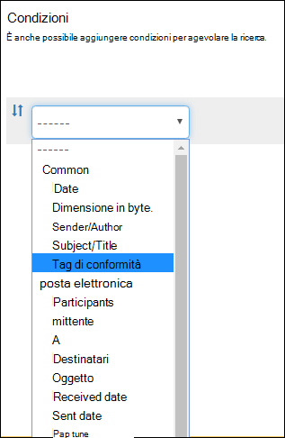

# Informazioni sulle etichette di conservazione

>*[Indicazioni per l'assegnazione di licenze di Microsoft 365 per sicurezza e conformità](https://aka.ms/ComplianceSD).*

All'interno dell'organizzazione sono probabilmente presenti tipi di contenuto diversi, sui quali occorre eseguire azioni differenti per garantire la conformità alle normative di settore e ai criteri interni. Ad esempio, possono essere presenti:
  
- Moduli fiscali che devono essere **conservati** per un periodo di tempo minimo. 
    
- Materiali per la stampa che devono essere **eliminati definitivamente** dopo un determinato periodo di tempo. 
    
- Ricerche competitive che devono essere **conservate** e in seguito **eliminate definitivamente**. 
    
- Permessi di lavoro che devono essere **classificati come record** in modo che non sia possibile modificarli o eliminarli. 
    
In tutti questi casi, le etichette di conservazione aiutano a identificare le azioni corrette da eseguire per ogni contenuto. Con le etichette di conservazione è possibile classificare i dati all'interno dell'organizzazione a scopi di governance e applicare regole di conservazione in base alla classificazione.
  
Con le etichette di conservazione è possibile:
  
- **Permettere agli utenti dell'organizzazione di applicare manualmente un’etichetta di conservazione** a contenuti in Outlook sul web, Outlook 2010 e versioni successive, OneDrive, SharePoint e gruppi di Microsoft 365. Spesso gli utenti sono quelli che conoscono meglio il tipo di contenuto che stanno usando, per cui sono in grado di classificarlo e applicare i criteri appropriati. 
    
- **Applicare automaticamente etichette di conservazione al contenuto** se soddisfa specifiche condizioni, ad esempio se include: 
    
    - Tipi specifici di informazioni riservate.
    
    - Parole chiave specifiche che corrispondono a una query creata.
    
    - Criteri di corrispondenza per un classificatore sottoponibile a training.
    
  La possibilità di applicare automaticamente etichette di conservazione al contenuto è importante perché:
    
     - Non è necessario formare gli utenti su tutte le classificazioni.
    
     - Non è necessario affidarsi solo agli utenti per la classificazione corretta di tutto il contenuto.
    
   - Gli utenti non hanno più bisogno di conoscere i criteri di governance dai dati e possono concentrarsi sul loro lavoro.

- **Applicare un'etichetta di conservazione predefinita a una raccolta documenti, una cartella o un set di documenti** in SharePoint, in modo che i documenti archiviati in quella posizione ereditino l'etichetta di conservazione predefinita.

Inoltre, le etichette di conservazione supportano la [gestione dei record](records-management.md) per messaggi di posta elettronica e documenti tra app e servizi Microsoft 365. È possibile usare un'etichetta di conservazione per classificare un contenuto come record. In questo caso, non è possibile modificare o rimuovere l'etichetta e il contenuto non può essere modificato o eliminato. 

Non sono previsti limiti rispetto al numero di etichette di conservazione supportate per un tenant. Tuttavia, 10.000 è il numero massimo di criteri supportati per un tenant, inclusi i criteri che applicano le etichette (criteri per le etichette di conservazione e per le etichette di conservazione applicate automaticamente) e i criteri di conservazione.

## Funzionamento delle etichette di conservazione con i criteri per le etichette di conservazione

Rendere disponibili le etichette di conservazione per gli utenti dell'organizzazione in modo che possano classificare il contenuto è un processo in due passaggi: 

1. Creare le etichette di conservazione

2. Pubblicare le etichette di conservazione usando un criterio di etichetta di conservazione
  

  
Le etichette di conservazione sono blocchi predefiniti indipendenti e riutilizzabili che vengono inclusi in uno o più criteri di etichetta di conservazione. Lo scopo principale di un criterio di etichetta di conservazione è raggruppare un set di tali etichette e specificare le posizioni in cui si vuole che vengano visualizzate.
  

  
1. Quando si pubblicano etichette di conservazione, vengono incluse in criteri di etichetta di conservazione. I nomi delle etichette di conservazione non sono modificabili, il che significa che non è possibile cambiarli dopo che sono stati creati.

2. Una singola etichetta di conservazione può essere inclusa in molti criteri di etichetta di conservazione.

3. Una singola posizione può anche essere inclusa in molti criteri di etichetta di conservazione.
    
3. I criteri di etichetta di conservazione specificano le posizioni di pubblicazione delle etichette di conservazione.
    
## Solo un'etichetta di conservazione alla volta

È importante tenere presente che a contenuti come un messaggio di posta elettronica o un documento è possibile assegnare una sola etichetta di conservazione alla volta:
  
- Per le etichette di conservazione assegnate manualmente dagli utenti finali, è possibile rimuovere o cambiare l'etichetta di conservazione assegnata.
    
- Se al contenuto è assegnata un'etichetta applicata automaticamente, questa può essere sostituita da un'etichetta di conservazione assegnata manualmente da un utente finale.
    
- Se al contenuto è assegnata un'etichetta di conservazione applicata manualmente da un utente finale, questa non può essere sostituita da un'etichetta di conservazione applicata automaticamente.
    
- Se sono presenti più regole che assegnano automaticamente un'etichetta e il contenuto soddisfa le condizioni di più regole, viene assegnata l'etichetta di conservazione della regola meno recente.
    
Per capire come e perché è stata applicata un'etichetta di conservazione anziché un'altra, è utile comprendere la differenza tra assegnare esplicitamente un'etichetta un'etichetta assegnata in modo implicito:

- Le etichette assegnate manualmente vengono assegnate in modo esplicito
- Le etichette applicate automaticamente vengono assegnate in modo implicito

Un'etichetta di conservazione assegnata in modo esplicito ha la precedenza su un'etichetta di conservazione assegnata in modo implicito. Per altre informazioni, vedere la sezione [Precedenza nei principi di conservazione](#the-principles-of-retention-or-what-takes-precedence) in questa pagina.

## Criteri per le etichette di conservazione e posizioni

È possibile pubblicare tipi di etichette di conservazione differenti in posizioni diverse, a seconda dell'azione eseguita dall'etichetta di conservazione.
  
|**Se l'etichetta di conservazione è...**|**Il criterio di etichetta può essere applicato a…**|
|:-----|:-----|
|Pubblicata agli utenti finali    |Exchange, SharePoint, OneDrive, gruppi di Microsoft 365    |
|Applicata automaticamente in base ai tipi di informazioni riservate    |Exchange (solo a tutte le cassette postali), SharePoint, OneDrive    |
|Applicata automaticamente in base a una query    |Exchange, SharePoint, OneDrive, gruppi di Microsoft 365    |
   
Le etichette di conservazione applicate automaticamente in Exchange (sia per le query che per i tipi di informazioni riservate) vengono applicate solo ai messaggi appena inviati (dati in transito), non a tutti gli elementi attualmente nella cassetta postale (dati archiviati). Inoltre, le etichette di conservazione applicate automaticamente per i tipi di informazioni riservate possono essere applicate solo a tutte le cassette postali, non a cassette postali specifiche.
  
Le cartelle pubbliche di Exchange, Skype e le chat e i messaggi di canale di Teams non supportano le etichette di conservazione.

## In che modo le etichette di conservazione applicano i criteri di conservazione

Le etichette di conservazione possono applicare esattamente le stesse azioni di conservazione di un criterio di conservazione, ovvero conservare e poi eliminare, solo conservare oppure solo eliminare. È possibile usare le etichette di conservazione per implementare un piano di archiviazione avanzato che identifichi specifici file per impostazioni di conservazione diverse. Per altre informazioni sul funzionamento della conservazione, vedere [Informazioni sui criteri di conservazione](retention-policies.md).

Inoltre, un'etichetta di conservazione ha due opzioni di conservazione che sono disponibili solo in un'etichetta di conservazione e non in un criterio di conservazione. Con un'etichetta di conservazione, è possibile:
  
- Attivare una revisione per l'eliminazione alla fine del periodo di conservazione, in modo che venga impostata una revisione obbligatoria dei documenti di SharePoint e OneDrive prima che vengano eliminati. Per altre informazioni, vedere [Revisioni per l'eliminazione](disposition.md#disposition-reviews).
    
- Iniziare il periodo di conservazione dal momento in cui il contenuto è stato etichettato invece che in base all'età o alla data dell'ultima modifica. Quando si utilizza questa opzione:
    - questa opzione si applica solo al contenuto di siti di SharePoint e account di OneDrive. Per la posta elettronica di Exchange il periodo di conservazione è sempre basato sulla data di invio o ricezione del messaggio.
    - Non è possibile cambiare il periodo di conservazione dopo aver salvato l'etichetta.
    

Un'altra differenza importante è che quando si applica un'etichetta di conservazione anziché un criterio di conservazione ai file in SharePoint e l'etichetta è configurata per la conservazione del contenuto, gli utenti non possono eliminare il file mentre è in vigore il periodo di conservazione. Gli utenti possono eliminare il contenuto quando la stessa etichetta è applicata ai file di OneDrive e ai messaggi di posta elettronica, a meno che l'etichetta non contrassegni il contenuto come record.

## Posizioni in cui è possibile visualizzare le etichette di conservazione pubblicate agli utenti finali

Se l'etichetta di conservazione verrà assegnata al contenuto dagli utenti finali, è possibile pubblicarla in:
  
- Outlook e Outlook sul Web
    
- OneDrive
    
- SharePoint
    
- Gruppi di Microsoft 365 (sia nel sito del gruppo che nella cassetta postale del gruppo in Outlook sul web)
    
Le sezioni seguenti descrivono il modo in cui le etichette vengono visualizzate dagli utenti dell'organizzazione in app diverse.
  

### Outlook

Per assegnare un'etichetta a un elemento nel client desktop di Outlook, selezionare l'elemento. Nella scheda **Home** della barra multifunzione fare clic su **Assegna criterio** e quindi scegliere l'etichetta di conservazione. 
  

  
È anche possibile fare clic con il pulsante destro del mouse su un elemento, scegliere **Assegna criterio** dal menu di scelta rapida e quindi scegliere l'etichetta di conservazione. 

Dopo l'applicazione dell'etichetta di conservazione, è possibile visualizzarla insieme all'azione che esegue nella parte superiore dell'elemento. Se a un messaggio di posta elettronica viene applicata un'etichetta di conservazione che ha un periodo di conservazione associato, con una rapida occhiata si conoscerà la data di scadenza del messaggio di posta elettronica.
  
È anche possibile applicare etichette di conservazione a cartelle. In questo caso:
  
- Tutti gli elementi nella cartella ricevono automaticamente la stessa etichetta di conservazione, **tranne** gli elementi ai quali è stata applicata esplicitamente un'etichetta di conservazione. Gli elementi etichettati esplicitamente mantengono l'etichetta di conservazione esistente. Per altre informazioni, vedere la sezione[ Precedenza nei principi di conservazione](#the-principles-of-retention-or-what-takes-precedence) in questa pagina. 
    
- Se si modifica o si rimuove l'etichetta di conservazione predefinita per una cartella, l'etichetta viene modificata o rimossa anche da tutti gli elementi nella cartella **tranne** che dagli elementi con etichette di conservazione assegnate esplicitamente. 
    
- Se si sposta un elemento con un'etichetta di conservazione predefinita da una cartella a un'altra cartella con un'etichetta di conservazione predefinita diversa, l'elemento riceverà la nuova etichetta di conservazione predefinita.
    
- Se si sposta un elemento con un'etichetta di conservazione predefinita da una cartella a un'altra cartella senza alcuna etichetta di conservazione predefinita, l’etichetta di conservazione precedente è rimossa.

### Outlook sul Web

Per assegnare un'etichetta a un elemento in Outlook sul web, fare clic con il pulsante destro del mouse sull'elemento\> **Assegna criteri** \> scegliere l'etichetta di conservazione. 
  

  
Una volta applicata, l'etichetta di conservazione può essere visualizzata insieme all'azione che esegue nella parte superiore dell'elemento. Se un messaggio di posta elettronica viene classificato ed è associato a un periodo di conservazione, con una rapida occhiata se ne conoscerà la data di scadenza.
  

  
Come in Outlook sul Web, è anche possibile applicare etichette di conservazione a cartelle. 

### OneDrive e SharePoint

Per assegnare un'etichetta a un documento (inclusi i file di OneNote) in OneDrive o SharePoint, selezionare l'elemento \> nell'angolo in alto a destra, scegliere **Apri il riquadro dei dettagli** \> **Applica etichetta di conservazione** \>scegliere l'etichetta di conservazione. 
  
È possibile applicare un'etichetta di conservazione anche a un set di cartelle o di documenti e si può impostare un'[etichetta di conservazione predefinita per una raccolta documenti](#applying-a-default-retention-label-to-all-content-in-a-sharepoint-library-folder-or-document-set).
  

  
Dopo l'applicazione di un'etichetta di conservazione a un elemento, è possibile visualizzarla nel riquadro dei dettagli quando l'elemento viene selezionato.
  

  
Per SharePoint, ma non per OneDrive, è possibile creare una visualizzazione della raccolta che contenga la colonna **Etichette** o la colonna **L'elemento è un record**. Questa visualizzazione consente di vedere a colpo d'occhio le etichette di conservazione assegnate a tutti gli elementi e quali elementi sono record. Si noti, tuttavia, che non è possibile filtrare la visualizzazione per la colonna **L'elemento è un record**. Per istruzioni su come aggiungere colonne, vedere [Mostrare o nascondere le colonne in un elenco o in una raccolta](https://support.microsoft.com/it-IT/office/show-or-hide-columns-in-a-list-or-library-b820db0d-9e3e-4ff9-8b8b-0b2dbefa87e2).

### Gruppi di Microsoft 365

Quando si pubblicano etichette di conservazione nei gruppi di Microsoft 365 ([in precedenza gruppi di Office 365](https://techcommunity.microsoft.com/t5/microsoft-365-blog/office-365-groups-will-become-microsoft-365-groups/ba-p/1303601)), le etichette vengono visualizzate sia nel sito del gruppo che nella cassetta postale del gruppo in Outlook sul Web. L'esperienza di applicazione di un'etichetta di conservazione al contenuto è identica a quella per posta elettronica e documenti.

Per conservare il contenuto di un gruppo di Microsoft 365, è necessario usare il percorso dei **gruppi di Office 365**. Anche se un gruppo di Office 365 ha una cassetta postale di Exchange, un criterio di conservazione che include l'intero percorso di Exchange non includerà il contenuto nelle cassette postali del gruppo di Office 365.

Inoltre, non è possibile usare il percorso di Exchange per includere o escludere una specifica cassetta postale del gruppo. Anche se il percorso di Exchange consente inizialmente di selezionare una cassetta postale del gruppo, provando a salvare il criterio di conservazione si riceverà un messaggio di errore che segnala che "RemoteGroupMailbox" non è una selezione valida per il percorso di Exchange.
  
Prima di tutto, creare e configurare le etichette di riservatezza che si vogliono rendere disponibili per le app e gli altri servizi. Ad esempio, le etichette che gli utenti possono vedere e applicare dalle app di Office. 

Quindi, creare uno o più criteri di etichetta contenenti le etichette e le impostazioni dei criteri configurate. È il criterio di etichetta che pubblica le etichette e le impostazioni per gli utenti e i percorsi scelti.

## Applicazione automatica di un'etichetta di conservazione in base alle condizioni

Una delle funzionalità più efficaci delle etichette di conservazione è la possibilità di applicarle automaticamente al contenuto che soddisfa determinate condizioni. In questo caso, gli utenti dell'organizzazione non dovranno applicare le etichette di conservazione. Microsoft 365 lo farà automaticamente.
  

  
Le etichette di conservazione applicate automaticamente sono potenti perché:
  
- Non è necessario formare gli utenti su tutte le classificazioni.
    
- Non è necessario affidarsi solo agli utenti per la classificazione corretta di tutto il contenuto.
    
- Gli utenti non hanno più bisogno di conoscere i criteri di governance dai dati e possono concentrarsi sul loro lavoro.
    
È possibile scegliere di applicare automaticamente etichette di conservazione al contenuto quando questo contiene:
  
- [Tipi specifici di informazioni riservate.](create-retention-labels.md#auto-apply-labels-to-content-with-specific-types-of-sensitive-information)
    
- [Parole chiave specifiche che corrispondono a una query creata.](create-retention-labels.md#auto-apply-labels-to-content-with-keywords-or-searchable-properties)

- [Una corrispondenza per classificatori sottoponibili a training](create-retention-labels.md#auto-apply-labels-to-content-by-using-trainable-classifiers)
    

> [!TIP]
> Vedere [Gestire il ciclo di vita dei documenti di SharePoint con le etichette di conservazione](auto-apply-retention-labels-scenario.md) per uno scenario dettagliato sull'uso delle proprietà gestite in SharePoint per applicare automaticamente etichette di conservazione e implementare la conservazione basata su eventi.

## Applicazione di un'etichetta di conservazione predefinita a tutto il contenuto in una raccolta, una cartella o un set di documenti di SharePoint

Oltre a permettere agli utenti di applicare un'etichetta di conservazione a singoli documenti, è anche possibile applicare un'etichetta di conservazione predefinita a una raccolta, una cartella o un set di documenti di SharePoint, in modo che tutti i documenti in quella posizione ricevano l'etichetta di conservazione predefinita.
  
Per una raccolta documenti, questa operazione si esegue nella pagina **Impostazioni raccolta** corrispondente. Quando si sceglie l'etichetta di conservazione predefinita, è anche possibile scegliere di applicarla a elementi esistenti nella raccolta. 
  
Ad esempio, se si ha un tag per il materiale di marketing e si sa che una specifica raccolta documenti contiene solo quel tipo di contenuto, è possibile impostare il tag Materiali marketing come predefinito per tutti i documenti nella raccolta.
  

  
Se si applica un'etichetta di conservazione predefinita agli elementi esistenti nella raccolta, nella cartella o nel set di documenti:
  
- Tutti gli elementi nella raccolta, nella cartella o nel set di documenti ricevono automaticamente la stessa etichetta di conservazione, **tranne** gli elementi ai quali è stata applicata esplicitamente un'etichetta di conservazione, come i record. Gli elementi etichettati esplicitamente mantengono l'etichetta esistente. Per altre informazioni, vedere la sezione [Precedenza nei principi di conservazione](#the-principles-of-retention-or-what-takes-precedence) più avanti.
    
- Se si modifica o si rimuove l'etichetta di conservazione predefinita per una raccolta, una cartella o un set di documenti, l'etichetta viene modificata o rimossa anche da tutti gli elementi nella raccolta, nella cartella o nel set di documenti **tranne** che dagli elementi con etichette di conservazione esplicite, come i record.
    
- Se si sposta un elemento con un'etichetta di conservazione predefinita da una raccolta di siti, una raccolta, una cartella o un set di documenti a un'altra raccolta di siti, raccolta, cartella o set di documenti con un’etichetta diversa, l'elemento mantiene l'etichetta di conservazione predefinita esistente anche se la nuova posizione ne ha una diversa. Se l'elemento non ha un'etichetta prima dello spostamento, verrà applicata l'etichetta di conservazione predefinita della nuova posizione.

**Record:** se si applica un'etichetta di record predefinita a una raccolta, a una cartella o a un set di documenti, viene applicata un'etichetta di record a tutti i singoli elementi presenti in quelle posizioni. Quando si sposta un nuovo elemento in un percorso con un'etichetta di record, tale elemento viene contrassegnato come record. Se però si cambia l'etichetta di conservazione predefinita in un'etichetta che non dichiara il contenuto come record, non viene rimossa l'etichetta di record dai singoli elementi, ma ognuno di essi mantiene la propria etichetta di record. Solo un amministratore della raccolta siti può rimuovere o modificare esplicitamente l'etichetta di conservazione degli elementi record.

Per altre informazioni sulle etichette di conservazione che dichiarano il contenuto come record, vedere [Informazioni sui record](records.md).

## Applicazione di un'etichetta di conservazione alla posta elettronica mediante regole

In Outlook è possibile creare regole per applicare un'etichetta di conservazione o criteri di conservazione.
  
Ad esempio, si può creare una regola che applica un'etichetta di conservazione specifica a tutti i messaggi inviati a o da un particolare gruppo di distribuzione.
  
Per creare una regola, fare clic su un elemento\> **Regole** \> **Crea regola** \> **Opzioni avanzate** \> **Creazione guidata regole** \> **Applica i criteri di conservazione.**.
  

  
## Classificazione del contenuto senza applicazione di azioni

Quando si crea un'etichetta di conservazione, è possibile farlo senza attivare criteri di conservazione o altre azioni. In questo caso, si può usare un'etichetta di conservazione semplicemente come etichetta di testo, senza applicare azioni.
  
Ad esempio, si può creare un'etichetta di conservazione denominata "Rivedere in un secondo momento" senza azioni e quindi applicarla automaticamente a contenuto con tipi di informazioni riservate o a contenuto in cui vengono eseguite query.
  

  
## Uso di etichette di conservazione per la gestione dei record
    
È possibile usare le etichette di conservazione per dichiarare il contenuto come record. Questo permette di implementare un'unica strategia di gestione dei record coerente in Microsoft 365. Per altre informazioni, vedere [Informazioni sui record](records.md).
  
## Uso di un'etichetta di conservazione come condizione nei criteri di prevenzione della perdita dei dati

Un'etichetta di conservazione può applicare azioni di conservazione sul contenuto. Inoltre, è possibile usare un'etichetta di conservazione come condizione in un criterio di prevenzione della perdita dei dati (DLP), e il criterio DLP può applicare altre azioni, come la limitazione dell'accesso, sui contenuti che includono un'etichetta di conservazione specifica. 
  
Per altre informazioni, vedere [Uso di un'etichetta di conservazione come condizione nei criteri di prevenzione della perdita dei dati](data-loss-prevention-policies.md#using-a-retention-label-as-a-condition-in-a-dlp-policy).
  

## Precedenza nei principi di conservazione

È possibile, o addirittura probabile, che al contenuto siano applicati più criteri di conservazione con azioni (conservare, eliminare o entrambi) e periodi di conservazione diversi. Quali sono i criteri che hanno la precedenza? Al livello più alto, un contenuto che viene conservato in base a un particolare criterio non può essere eliminato definitivamente da un altro criterio.
  

  
Per comprendere in che modo le diverse etichette con azioni di conservazione vengono applicate al contenuto, tenere presente questi principi di conservazione:
  
1. **La conservazione prevale sull'eliminazione.** Si supponga di avere un criterio di conservazione che indica di eliminare la posta elettronica di Exchange dopo tre anni e un altro criterio di conservazione che indica di conservare la posta elettronica di Exchange per cinque anni e quindi eliminarla. Il contenuto che supera i tre anni verrà eliminato e nascosto agli utenti, ma comunque conservato nella cartella Elementi ripristinabili fino a raggiungere i cinque anni, quando verrà eliminato definitivamente. 
    
2. **Prevale il periodo di conservazione più lungo.** Se un contenuto è soggetto a più criteri di conservazione, verrà mantenuto fino al termine del periodo di conservazione più lungo. 
    
3. **L'inclusione esplicita prevale sull'inclusione implicita.** Questo significa che: 
    
    1. Se un utente assegna manualmente un'etichetta di conservazione con impostazioni di conservazione a un elemento, ad esempio un messaggio di posta elettronica di Exchange o un documento di OneDrive, l'etichetta di conservazione ha la precedenza sui criteri assegnati a livello di sito o di cassetta postale e su un'etichetta di conservazione predefinita assegnata tramite la raccolta documenti. Ad esempio, se l'etichetta di conservazione esplicita indica di conservare per dieci anni, ma i criteri di conservazione assegnati dal sito indicano di conservare solo per cinque anni, l'etichetta di conservazione ha la precedenza. Le etichette di conservazione applicate automaticamente sono considerate implicite e non esplicite, perché vengono applicate automaticamente da Microsoft 365.
    
    2. Se un criterio di conservazione include una posizione specifica, ad esempio la cassetta postale o l'account di OneDrive di un particolare utente, il criterio ha la precedenza su un altro criterio di conservazione applicato alle cassette postali o agli account di OneDrive di tutti gli utenti, ma che non include specificamente la cassetta postale di quell'utente.
    
4. **Prevale il periodo di eliminazione più breve.** Analogamente, se un contenuto è soggetto a più criteri di eliminazione (senza conservazione), verrà eliminato alla fine del periodo di conservazione più breve. 
    
I principi di conservazione funzionano come un flusso di risoluzione di conflitti dall'alto verso il basso: se le regole applicate da tutti i criteri o le etichette sono le stesse in un determinato livello, il flusso si sposta verso il basso al livello successivo per determinare la priorità di applicazione di ogni regola.
  
Infine, un criterio di conservazione o un'etichetta di conservazione non può eliminare definitivamente qualsiasi contenuto che si trovi in stato di blocco per eDiscovery. Quando il blocco viene rilasciato, il contenuto torna idoneo per il processo di pulizia descritto in precedenza.

### Precedenza per l'etichettatura automatica con i classificatori sottoponibili a training

Tutte le etichette di conservazione configurate per i classificatori sottoponibili a training vengono valutate contemporaneamente. Se un elemento viene rilevato da più classificatori sottoponibili a training, vengono usati i criteri seguenti per determinare quale etichetta di conservazione applicare:

1. Le etichette di conservazione configurate per la conservazione o per la conservazione e poi l’eliminazione hanno una priorità maggiore rispetto alle etichette di conservazione configurate solo per l'eliminazione.

2. Per le etichette di conservazione configurate per la conservazione o per la conservazione e poi l’eliminazione, prevale l’etichetta di conservazione configurata per il periodo di conservazione più lungo.

3. Per le etichette di conservazione configurate solo per l'eliminazione, prevale l'etichetta di conservazione configurata per il periodo più breve.

4. Le etichette di conservazione con la stessa azione e lo stesso periodo producono una selezione di etichette di conservazione non deterministica.

## Monitorare le etichette di conservazione

Dopo aver pubblicato o applicato automaticamente le etichette di conservazione, è consigliabile verificare che vengano applicate al contenuto come previsto. Per monitorare le etichette di conservazione:
  
- **Explorer attività etichette**. Con Explorer attività etichette (esempio nell'immagine di seguito), è possibile cercare e visualizzare rapidamente le attività relative alle etichette per tutto il contenuto di SharePoint e OneDrive degli ultimi 30 giorni. Per altre informazioni, vedere [Visualizzare le attività delle etichette per i documenti](view-label-activity-for-documents.md).

- Pagina **Analisi delle etichette**. Nel centro conformità Microsoft 365 e nel centro sicurezza Microsoft 365 è possibile visualizzare rapidamente le etichette di conservazione principali e dove vengono applicate. È possibile anche visualizzare tutto il contenuto con una specifica etichetta di conservazione. Per altre informazioni vedere [Visualizzare l'uso delle etichette con Analisi delle etichette](label-analytics.md).
    
- **Report sulla governance dei dati**. Con questi report, è possibile visualizzare rapidamente le attività e le tendenze relative alle etichette per tutto il contenuto di Exchange, SharePoint e OneDrive degli ultimi 90 giorni. Per altre informazioni, vedere [Visualizzare i report sulla governance dei dati](view-the-data-governance-reports.md).
    

## Uso di Ricerca contenuto per trovare tutto il contenuto a cui è applicata una specifica etichetta di conservazione

Dopo l'assegnazione automatica o manuale di etichette di conservazione al contenuto, è possibile usare Ricerca contenuto per trovare tutto il contenuto che ha una specifica etichetta di conservazione.
  
Quando si crea una ricerca di contenuto, scegliere la condizione **Tag di conformità**, quindi immettere il nome completo dell'etichetta di conservazione o parte di esso e usare un carattere jolly. Per altre informazioni, vedere [Query con parola chiave e condizioni di ricerca per la ricerca di contenuto](keyword-queries-and-search-conditions.md).
  

  
## Usare le etichette di conservazione anziché funzionalità precedenti

Le etichette di conservazione possono facilmente essere rese disponibili per un'intera organizzazione e il relativo contenuto in Microsoft 365, compresi Exchange, SharePoint, OneDrive e gruppi di Microsoft 365. Se è necessario conservare o eliminare i contenuti oppure gestire i record in una posizione qualsiasi di Microsoft 365, è consigliabile usare le etichette di conservazione.
  
Per conservare o eliminare il contenuto o gestire i record in Microsoft 365 esistono già altre funzionalità, che continueranno a funzionare insieme alle etichette di conservazione. Anche se ci sono istanze in cui l'implementazione delle etichette di conservazione è diversa rispetto alle funzionalità precedenti, l'evoluzione delle etichette di conservazione determinerà il futuro della gestione dei record in Microsoft 365. In futuro, quindi, per la governance dei dati si consiglia di usare le etichette di conservazione invece delle funzionalità precedenti indicate di seguito.
  
### Exchange Online

- [Tag di conservazione e criteri di conservazione](https://go.microsoft.com/fwlink/?linkid=846125), noti anche come [gestione record di messaggistica (MRM)](https://go.microsoft.com/fwlink/?linkid=846126) (solo eliminazione) 
    
### SharePoint e OneDrive

- [Configurare la gestione dei record sul posto](https://support.office.com/article/7707a878-780c-4be6-9cb0-9718ecde050a) (conservazione) 
    
- [Introduzione al Centro record](https://support.office.com/article/bae6ca5a-7b19-40e0-b433-e3613a747c2c) (conservazione) 
    
- [Criteri di gestione delle informazioni ](intro-to-info-mgmt-policies.md) (solo eliminazione) 
    
## Passaggi successivi

Se si è pronti per creare e pubblicare etichette di conservazione, vedere [Creare, pubblicare e applicare automaticamente etichette di conservazione](create-retention-labels.md).
