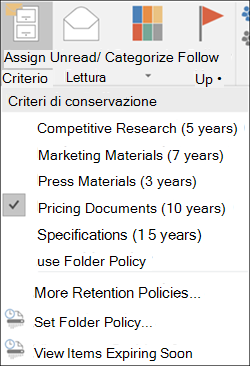
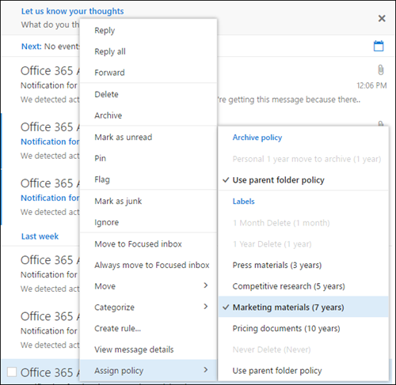
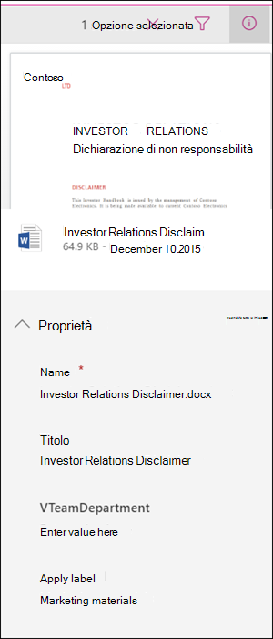
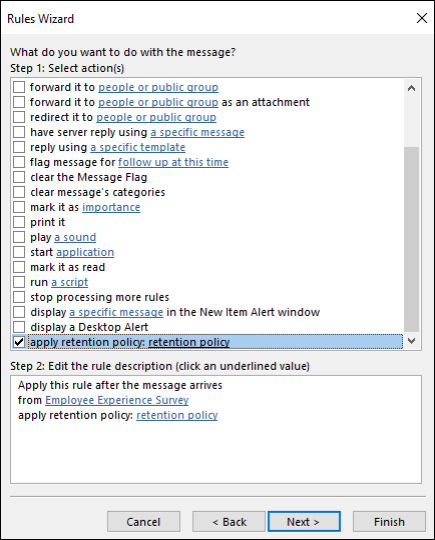
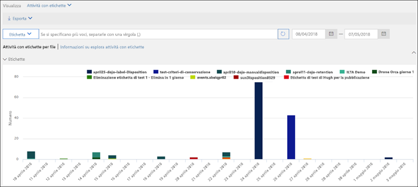
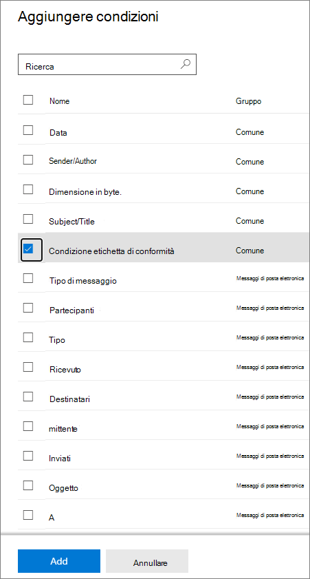

# Informazioni sulle etichette di conservazioneLearn about retention labels

>*[Indicazioni per l'assegnazione di licenze di Microsoft 365 per sicurezza e conformità](https://aka.ms/ComplianceSD).**[Microsoft 365 licensing guidance for security & compliance](https://aka.ms/ComplianceSD).*

Across your organization, you probably have different types of content that require different actions taken on them in order to comply with industry regulations and internal policies.Across your organization, you probably have different types of content that require different actions taken on them in order to comply with industry regulations and internal policies. For example, you might have:For example, you might have:
  
- Moduli fiscali che devono essere **conservati** per un periodo di tempo minimo.Tax forms that need to be **retained** for a minimum period of time. 
    
- Materiali per la stampa che devono essere **eliminati definitivamente** dopo un determinato periodo di tempo.Press materials that need to be **permanently deleted** when they reach a certain age. 
    
- Ricerche competitive che devono essere **conservate** e in seguito **eliminate definitivamente**.Competitive research that needs to be both **retained** and then **permanently deleted**. 
    
- Permessi di lavoro che devono essere **classificati come record** in modo che non sia possibile modificarli o eliminarli.Work visas that must be **marked as a record** so that they can't be edited or deleted. 
    
In all of these cases, retention labels can help you take the right actions on the right content.In all of these cases, retention labels can help you take the right actions on the right content. With retention labels, you can classify data across your organization for governance, and enforce retention rules based on that classification.With retention labels, you can classify data across your organization for governance, and enforce retention rules based on that classification.
  
Con le etichette di conservazione è possibile:With retention labels, you can:
  
- **Enable people in your organization to apply a retention label manually** to content in Outlook on the web, Outlook 2010 and later, OneDrive, SharePoint, and Microsoft 365 Groups.**Enable people in your organization to apply a retention label manually** to content in Outlook on the web, Outlook 2010 and later, OneDrive, SharePoint, and Microsoft 365 Groups. Users often know best what type of content they're working with, so they can classify it and have the appropriate policy applied.Users often know best what type of content they're working with, so they can classify it and have the appropriate policy applied. 
    
- **Applicare automaticamente etichette di conservazione al contenuto** se soddisfa specifiche condizioni, ad esempio se include:**Apply retention labels to content automatically** if it matches specific conditions, such as when the content contains: 
    
    - Tipi specifici di informazioni riservate.Specific types of sensitive information.
    
    - Parole chiave specifiche che corrispondono a una query creata.Specific keywords that match a query you create.
    
    - Criteri di corrispondenza per un classificatore sottoponibile a training.Pattern matches for a trainable classifier.
    
  La possibilità di applicare automaticamente etichette di conservazione al contenuto è importante perché:The ability to apply retention labels to content automatically is important because:
    
     - Non è necessario formare gli utenti su tutte le classificazioni.You don't need to train your users on all of your classifications.
    
     - Non è necessario affidarsi solo agli utenti per la classificazione corretta di tutto il contenuto.You don't need to rely on users to classify all content correctly.
    
   - Gli utenti non hanno più bisogno di conoscere i criteri di governance dai dati e possono concentrarsi sul loro lavoro.Users no longer need to know about data governance policies - they can instead focus on their work.

- **Applicare un'etichetta di conservazione predefinita a una raccolta documenti, una cartella o un set di documenti** in SharePoint, in modo che i documenti archiviati in quella posizione ereditino l'etichetta di conservazione predefinita.**Apply a default retention label to a document library, folder, or document set** in SharePoint, so that all documents that are stored in that location inherit the default retention label.

Inoltre, le etichette di conservazione supportano la [gestione dei record](records-management.md) per messaggi di posta elettronica e documenti tra app e servizi Microsoft 365.Additionally, retention labels support [records management](records-management.md) for email and documents across Microsoft 365 apps and services. È possibile usare un'etichetta di conservazione per classificare un contenuto come record.You can use a retention label to classify content as a record. Quando si procede in questo modo e il contenuto rimane in Microsoft 365, non è possibile modificare o rimuovere l'etichetta e il contenuto non può essere modificato o eliminato.When this happens and the content remains in Microsoft 365, the label can't be changed or removed, and the content can't be edited or deleted. 

Se il contenuto viene spostato al di fuori di Microsoft 365, le [etichette di conservazione](sensitivity-labels.md), a differenza delle etichette di riservatezza, non vengono mantenute.Retention labels, unlike [sensitivity labels](sensitivity-labels.md), do not persist if the content is moved outside Microsoft 365.

Non sono previsti limiti rispetto al numero di etichette di conservazione supportate per un tenant.There is no limit to the number of retention labels that are supported for a tenant. Tuttavia, 10.000 è il numero massimo di criteri supportati per un tenant, inclusi i criteri che applicano le etichette (criteri per le etichette di conservazione e per le etichette di conservazione applicate automaticamente) e i criteri di conservazione.However, 10,000 is the maximum number of policies that are supported for a tenant and these include the policies that apply the labels (retention label policies and auto-apply retention policies), as well as retention policies.

## Funzionamento delle etichette di conservazione con i criteri per le etichette di conservazioneHow retention labels work with retention label policies

Rendere disponibili le etichette di conservazione per gli utenti dell'organizzazione in modo che possano classificare il contenuto è un processo in due passaggi:Making retention labels available to people in your organization so that they can classify content is a two-step process: 

1. Creare le etichette di conservazioneCreate the retention labels

2. Pubblicare le etichette di conservazione usando un criterio di etichetta di conservazionePublish the retention labels by using a retention label policy
  

  
Le etichette di conservazione sono blocchi predefiniti indipendenti e riutilizzabili che vengono inclusi in uno o più criteri di etichetta di conservazione.Retention labels are independent, reusable building blocks that are included in one or more retention label policies. Lo scopo principale di un criterio di etichetta di conservazione è raggruppare un set di tali etichette e specificare le posizioni in cui si vuole che vengano visualizzate.The primary purpose of a retention label policy is to group a set of retention labels and specify the locations where you want those labels to appear.
  

  
1. Quando si pubblicano etichette di conservazione, vengono incluse in criteri di etichetta di conservazione.When you publish retention labels, they're included in a retention label policy. I nomi delle etichette di conservazione non sono modificabili, il che significa che non è possibile cambiarli dopo che sono stati creati.Retention label names are immutable, which means that they cannot be edited after they're created.

2. Una singola etichetta di conservazione può essere inclusa in molti criteri di etichetta di conservazione.A single retention label can be included in many retention label policies.

3. Una singola posizione può anche essere inclusa in molti criteri di etichetta di conservazione.A single location can also be included in many retention label policies.
    
3. I criteri di etichetta di conservazione specificano le posizioni di pubblicazione delle etichette di conservazione.Retention label policies specify the locations to publish the retention labels.
    
## Solo un'etichetta di conservazione alla voltaOnly one retention label at a time

È importante tenere presente che a contenuti come un messaggio di posta elettronica o un documento è possibile assegnare una sola etichetta di conservazione alla volta:It's important to know that content like an email or document can have only a single retention label assigned to it at a time:
  
- Per le etichette di conservazione assegnate manualmente dagli utenti finali, è possibile rimuovere o cambiare l'etichetta di conservazione assegnata.For retention labels assigned manually by end users, people can remove or change the retention label that's assigned.
    
- Se al contenuto è assegnata un'etichetta applicata automaticamente, questa può essere sostituita da un'etichetta di conservazione assegnata manualmente da un utente finale.If content has an auto-apply label assigned, an auto-apply label can be replaced by a retention label assigned manually by an end user.
    
- Se al contenuto è assegnata un'etichetta di conservazione applicata manualmente da un utente finale, questa non può essere sostituita da un'etichetta di conservazione applicata automaticamente.If content has a retention label assigned manually by an end user, an auto-apply label cannot replace the manually assigned retention label.
    
- Se sono presenti più regole che assegnano automaticamente un'etichetta e il contenuto soddisfa le condizioni di più regole, viene assegnata l'etichetta di conservazione della regola meno recente.If there are multiple rules that assign an auto-apply label and content meets the conditions of multiple rules, the retention label for the oldest rule is assigned.
    
Per capire come e perché è stata applicata un'etichetta di conservazione anziché un'altra, è utile comprendere la differenza tra assegnare esplicitamente un'etichetta un'etichetta assegnata in modo implicito:To understand how and why one retention label is applied rather than another, it's helpful to understand the difference between explicitly assign a label, and implicitly assigned a label:

- Le etichette assegnate manualmente vengono assegnate in modo esplicitoManually assigned labels are explicitly assigned
- Le etichette applicate automaticamente vengono assegnate in modo implicitoAutomatically applied labels are implicitly assigned

Un'etichetta di conservazione assegnata in modo esplicito ha la precedenza su un'etichetta di conservazione assegnata in modo implicito.An explicitly assigned retention label takes precedence over an implicitly assigned retention label. Per altre informazioni, vedere la sezione [Precedenza nei principi di conservazione](#the-principles-of-retention-or-what-takes-precedence) in questa pagina.For more information, see the [The principles of retention, or what takes precedence?](#the-principles-of-retention-or-what-takes-precedence) section on this page.

## Criteri per le etichette di conservazione e posizioniRetention label policies and locations

È possibile pubblicare tipi di etichette di conservazione differenti in posizioni diverse, a seconda dell'azione eseguita dall'etichetta di conservazione.Different types of retention labels can be published to different locations, depending on what the retention label does.
  
|**Se l'etichetta di conservazione è...****If the retention label is…**|**Il criterio di etichetta può essere applicato a…****Then the label policy can be applied to…**|
|:-----|:-----|
|Pubblicata agli utenti finaliPublished to end users    |Exchange, SharePoint, OneDrive, gruppi di Microsoft 365Exchange, SharePoint, OneDrive, Microsoft 365 Groups    |
|Applicata automaticamente in base ai tipi di informazioni riservateAuto-applied based on sensitive information types    |Exchange (solo a tutte le cassette postali), SharePoint, OneDriveExchange (all mailboxes only), SharePoint, OneDrive    |
|Applicata automaticamente in base a una queryAuto-applied based on a query    |Exchange, SharePoint, OneDrive, gruppi di Microsoft 365Exchange, SharePoint, OneDrive, Microsoft 365 Groups    |
   
Le etichette di conservazione applicate automaticamente in Exchange (sia per le query che per i tipi di informazioni riservate) vengono applicate solo ai messaggi appena inviati (dati in transito), non a tutti gli elementi attualmente nella cassetta postale (dati archiviati).In Exchange, auto-apply retention labels (for both queries and sensitive information types) are applied only to messages newly sent (data in transit), not to all items currently in the mailbox (data at rest). Inoltre, le etichette di conservazione applicate automaticamente per i tipi di informazioni riservate possono essere applicate solo a tutte le cassette postali, non a cassette postali specifiche.Also, auto-apply retention labels for sensitive information types can apply only to all mailboxes; you can't select the specific mailboxes.
  
Le cartelle pubbliche di Exchange, Skype e le chat e i messaggi di canale di Teams non supportano le etichette di conservazione.Exchange public folders, Skype, and Teams channel messages and chats do not support retention labels.

## In che modo le etichette di conservazione applicano i criteri di conservazioneHow retention labels enforce retention

Le etichette di conservazione possono applicare esattamente le stesse azioni di conservazione di un criterio di conservazione, ovvero conservare e poi eliminare, solo conservare oppure solo eliminare.Retention labels can enforce the same retention actions that a retention policy can - retain and then delete, or retain-only, or delete-only. È possibile usare le etichette di conservazione per implementare un piano di archiviazione avanzato che identifichi specifici file per impostazioni di conservazione diverse.You can use retention labels to implement a sophisticated file plan that identifies specific files for different retention settings. Per altre informazioni sul funzionamento della conservazione, vedere [Informazioni sui criteri di conservazione](retention-policies.md).For more information about how retention works, see [Learn about retention policies](retention-policies.md).

In addition, a retention label has two retention options that are available only in a retention label and not in a retention policy.In addition, a retention label has two retention options that are available only in a retention label and not in a retention policy. With a retention label, you can:With a retention label, you can:
  
- Attivare una revisione per l'eliminazione alla fine del periodo di conservazione, in modo che venga impostata una revisione obbligatoria dei documenti di SharePoint e OneDrive prima che vengano eliminati.Trigger a disposition review at the end of the retention period, so that SharePoint and OneDrive documents must be reviewed before they can be deleted. Per altre informazioni, vedere [Revisioni per l'eliminazione](disposition.md#disposition-reviews).For more information, see [Disposition reviews](disposition.md#disposition-reviews).
    
- Iniziare il periodo di conservazione dal momento in cui il contenuto è stato etichettato invece che in base all'età o alla data dell'ultima modifica.Start the retention period from when the content was labeled, instead of the age of the content or when it was last modified. Quando si utilizza questa opzione:When you use this option:
    - questa opzione si applica solo al contenuto di siti di SharePoint e account di OneDrive.It applies only to content in SharePoint sites and OneDrive accounts. Per la posta elettronica di Exchange il periodo di conservazione è sempre basato sulla data di invio o ricezione del messaggio.For Exchange email, the retention period is always based on the date when the message was sent or received.
    - Non è possibile cambiare il periodo di conservazione dopo aver salvato l'etichetta.You can't change the retention period after the label is saved.
    

Un'altra differenza importante è che quando si applica un'etichetta di conservazione anziché un criterio di conservazione ai file in SharePoint e l'etichetta è configurata per la conservazione del contenuto, gli utenti non possono eliminare il file mentre è in vigore il periodo di conservazione.Another important difference is that when you apply a retention label rather than a retention policy to files in SharePoint, and the label is configured to retain content, users can't delete the file while the retention period is enforced. Gli utenti possono eliminare il contenuto quando la stessa etichetta è applicata ai file di OneDrive e ai messaggi di posta elettronica, a meno che l'etichetta non contrassegni il contenuto come record.Users can delete content when the same label is applied to files in OneDrive and to emails, unless the label marks the content as a record.

## Posizioni in cui è possibile visualizzare le etichette di conservazione pubblicate agli utenti finaliWhere published retention labels can appear to end users

Se l'etichetta di conservazione verrà assegnata al contenuto dagli utenti finali, è possibile pubblicarla in:If your retention label will be assigned to content by end users, you can publish it to:
  
- Outlook e Outlook sul WebOutlook and Outlook on the web
    
- OneDriveOneDrive
    
- SharePointSharePoint
    
- Gruppi di Microsoft 365 (sia nel sito del gruppo che nella cassetta postale del gruppo in Outlook sul web)Microsoft 365 groups (both the group site and group mailbox in Outlook on the web)
    
Le sezioni seguenti descrivono il modo in cui le etichette vengono visualizzate dagli utenti dell'organizzazione in app diverse.The sections that follow explain how labels appear in different apps to people in your organization.
  

### OutlookOutlook

Per assegnare un'etichetta a un elemento nel client desktop di Outlook, selezionare l'elemento.To label an item in the Outlook desktop client, select the item. Nella scheda **Home** della barra multifunzione fare clic su **Assegna criterio** e quindi scegliere l'etichetta di conservazione.On the **Home** tab on the ribbon, click **Assign Policy**, and then choose the retention label. 
  

  
È anche possibile fare clic con il pulsante destro del mouse su un elemento, scegliere **Assegna criterio** dal menu di scelta rapida e quindi scegliere l'etichetta di conservazione.You can also right-click an item, click **Assign Policy** in the context menu, and then choose the retention label. 

Dopo l'applicazione dell'etichetta di conservazione, è possibile visualizzarla insieme all'azione che esegue nella parte superiore dell'elemento.After the retention label is applied, you can view that retention label and what action it takes at the top of the item. Se a un messaggio di posta elettronica viene applicata un'etichetta di conservazione che ha un periodo di conservazione associato, con una rapida occhiata si conoscerà la data di scadenza del messaggio di posta elettronica.If an email has a retention label applied that has an associated retention period, you can see at a glance when the email expires.
  
È anche possibile applicare etichette di conservazione a cartelle. In questo caso:You can also apply retention labels to folders, in which case:
  
- Tutti gli elementi nella cartella ricevono automaticamente la stessa etichetta di conservazione, **tranne** gli elementi ai quali è stata applicata esplicitamente un'etichetta di conservazione.All items in the folder automatically get the same retention label, **except** for items that have had a retention label applied explicitly to them. Gli elementi etichettati esplicitamente mantengono l'etichetta di conservazione esistente.Explicitly labeled items keep their existing retention label. Per altre informazioni, vedere la sezione[ Precedenza nei principi di conservazione](#the-principles-of-retention-or-what-takes-precedence) in questa pagina.For more information, see [The principles of retention, or what takes precedence?](#the-principles-of-retention-or-what-takes-precedence) section on this page. 
    
- Se si modifica o si rimuove l'etichetta di conservazione predefinita per una cartella, l'etichetta viene modificata o rimossa anche da tutti gli elementi nella cartella **tranne** che dagli elementi con etichette di conservazione assegnate esplicitamente.If you change or remove the default retention label for a folder, the retention label's also changed or removed for all items in the folder, **except** items with explicitly assigned retention labels. 
    
- Se si sposta un elemento con un'etichetta di conservazione predefinita da una cartella a un'altra cartella con un'etichetta di conservazione predefinita diversa, l'elemento riceverà la nuova etichetta di conservazione predefinita.If you move an item with a default retention label from one folder to another folder with a different default retention label, the item gets the new default retention label.
    
- Se si sposta un elemento con un'etichetta di conservazione predefinita da una cartella a un'altra cartella senza alcuna etichetta di conservazione predefinita, l’etichetta di conservazione precedente è rimossa.If you move an item with a default retention label from one folder to another folder with no default retention label, the old default retention label is removed.

### Outlook sul WebOutlook on the web

Per assegnare un'etichetta a un elemento in Outlook sul web, fare clic con il pulsante destro del mouse sull'elemento\> **Assegna criteri** \> scegliere l'etichetta di conservazione.To label an item in Outlook on the web, right-click the item \> **Assign policy** \> choose the retention label. 
  

  
After the retention label is applied, you can view that retention label and what action it takes at the top of the item.After the retention label is applied, you can view that retention label and what action it takes at the top of the item. If an email is classified and has an associated retention period, you can know at a glance when the email will expire.If an email is classified and has an associated retention period, you can know at a glance when the email will expire.
  

  
Come in Outlook sul Web, è anche possibile applicare etichette di conservazione a cartelle.As with Outlook on the web, you can also apply retention labels to folders. 

### OneDrive e SharePointOneDrive and SharePoint

Per assegnare un'etichetta a un documento (inclusi i file di OneNote) in OneDrive o SharePoint, selezionare l'elemento \> nell'angolo in alto a destra, scegliere **Apri il riquadro dei dettagli** \> **Applica etichetta di conservazione** \>scegliere l'etichetta di conservazione.To label a document (including OneNote files) in OneDrive or SharePoint, select the item \> in the upper-right corner, choose **Open the details pane** \> **Apply retention label** \> choose the retention label. 
  
È possibile applicare un'etichetta di conservazione anche a un set di cartelle o di documenti e si può impostare un'[etichetta di conservazione predefinita per una raccolta documenti](#applying-a-default-retention-label-to-all-content-in-a-sharepoint-library-folder-or-document-set).You can also apply a retention label to a folder or document set, and you can set a [default retention label for a document library](#applying-a-default-retention-label-to-all-content-in-a-sharepoint-library-folder-or-document-set).
  

  
Dopo l'applicazione di un'etichetta di conservazione a un elemento, è possibile visualizzarla nel riquadro dei dettagli quando l'elemento viene selezionato.After a retention label is applied to an item, you can view it in the details pane when that item's selected.
  

  
Per SharePoint, ma non per OneDrive, è possibile creare una visualizzazione della raccolta che contenga la colonna **Etichette** o la colonna **L'elemento è un record**.For SharePoint, but not OneDrive, you can create a view of the library that contains the **Labels** column or **Item is a Record** column. Questa visualizzazione consente di vedere a colpo d'occhio le etichette di conservazione assegnate a tutti gli elementi e quali elementi sono record.This view lets you see at a glance the retention labels assigned to all items and which items are records. Si noti, tuttavia, che non è possibile filtrare la visualizzazione per la colonna **L'elemento è un record**.Note, however, that you can't filter the view by the **Item is a Record** column. Per istruzioni su come aggiungere colonne, vedere [Mostrare o nascondere le colonne in un elenco o in una raccolta](https://support.microsoft.com/it-IT/office/show-or-hide-columns-in-a-list-or-library-b820db0d-9e3e-4ff9-8b8b-0b2dbefa87e2).For instructions how to add columns, see [Show or hide columns in a list or library](https://support.microsoft.com/it-IT/office/show-or-hide-columns-in-a-list-or-library-b820db0d-9e3e-4ff9-8b8b-0b2dbefa87e2).

### Gruppi di Microsoft 365Microsoft 365 groups

Quando si pubblicano etichette di conservazione nei gruppi di Microsoft 365 ([in precedenza gruppi di Office 365](https://techcommunity.microsoft.com/t5/microsoft-365-blog/office-365-groups-will-become-microsoft-365-groups/ba-p/1303601)), le etichette vengono visualizzate sia nel sito del gruppo che nella cassetta postale del gruppo in Outlook sul Web.When you publish retention labels to Microsoft 365 groups ([formerly Office 365 groups](https://techcommunity.microsoft.com/t5/microsoft-365-blog/office-365-groups-will-become-microsoft-365-groups/ba-p/1303601)), the retention labels appear in both the group site and group mailbox in Outlook on the web. L'esperienza di applicazione di un'etichetta di conservazione al contenuto è identica a quella per posta elettronica e documenti.The experience of applying a retention label to content is identical to that for email and documents.

Per conservare il contenuto di un gruppo di Microsoft 365, è necessario usare il percorso dei **gruppi di Office 365**.To retain content for a Microsoft 365 group, use the **Office 365 groups** location. Anche se un gruppo di Office 365 ha una cassetta postale di Exchange, un criterio di conservazione che include l'intero percorso di Exchange non includerà il contenuto nelle cassette postali del gruppo di Office 365.Even though a Microsoft 365 group has an Exchange mailbox, a retention policy that includes the entire Exchange location won't include content in Microsoft 365 group mailboxes.

Inoltre, non è possibile usare il percorso di Exchange per includere o escludere una specifica cassetta postale del gruppo.In addition, it's not possible to use the Exchange location to include or exclude a specific group mailbox. Anche se il percorso di Exchange consente inizialmente di selezionare una cassetta postale del gruppo, provando a salvare il criterio di conservazione si riceverà un messaggio di errore che segnala che "RemoteGroupMailbox" non è una selezione valida per il percorso di Exchange.Although the Exchange location initially allows a group mailbox to be selected, when you try to save the retention policy, you receive an error that "RemoteGroupMailbox" is not a valid selection for the Exchange location.
  
Prima di tutto, creare e configurare le etichette di riservatezza che si vogliono rendere disponibili per le app e gli altri servizi.First, create and configure the sensitivity labels that you want to make available for apps and other services. Ad esempio, le etichette che gli utenti possono vedere e applicare dalle app di Office.For example, the labels you want users to see and apply from Office apps. 

Quindi, creare uno o più criteri di etichetta contenenti le etichette e le impostazioni dei criteri configurate.Then, create one or more label policies that contain the labels and policy settings that you configure. È il criterio di etichetta che pubblica le etichette e le impostazioni per gli utenti e i percorsi scelti.It's the label policy that publishes the labels and settings for your chosen users and locations.

## Applicazione automatica di un'etichetta di conservazione in base alle condizioniApplying a retention label automatically based on conditions

Una delle funzionalità più efficaci delle etichette di conservazione è la possibilità di applicarle automaticamente al contenuto che soddisfa determinate condizioni.One of the most powerful features of retention labels is the ability to apply them automatically to content that matches certain conditions. In questo caso, gli utenti dell'organizzazione non dovranno applicare le etichette di conservazione.In this case, people in your organization don't need to apply the retention labels. Microsoft 365 lo farà automaticamente.Microsoft 365 does the work for them.
  

  
Le etichette di conservazione applicate automaticamente sono potenti perché:Auto-applying retention labels are powerful because:
  
- Non è necessario formare gli utenti su tutte le classificazioni.You don't need to train your users on all of your classifications.
    
- Non è necessario affidarsi solo agli utenti per la classificazione corretta di tutto il contenuto.You don't need to rely on users to classify all content correctly.
    
- Gli utenti non hanno più bisogno di conoscere i criteri di governance dai dati e possono concentrarsi sul loro lavoro.Users no longer need to know about data governance policies - they can focus on their work.
    
È possibile scegliere di applicare automaticamente etichette di conservazione al contenuto quando questo contiene:You can choose to apply retention labels to content automatically when that content contains:
  
- [Tipi specifici di informazioni riservate.Specific types of sensitive information](create-retention-labels.md#auto-apply-labels-to-content-with-specific-types-of-sensitive-information)
    
- [Parole chiave specifiche che corrispondono a una query creata.Specific keywords that match a query you create](create-retention-labels.md#auto-apply-labels-to-content-with-keywords-or-searchable-properties)

- [Una corrispondenza per classificatori sottoponibili a trainingA match for trainable classifiers](create-retention-labels.md#auto-apply-labels-to-content-by-using-trainable-classifiers)
    

> [!TIP]
> Vedere [Gestire il ciclo di vita dei documenti di SharePoint con le etichette di conservazione](auto-apply-retention-labels-scenario.md) per uno scenario dettagliato sull'uso delle proprietà gestite in SharePoint per applicare automaticamente etichette di conservazione e implementare la conservazione basata su eventi.See [Manage the lifecycle of SharePoint documents with retention labels](auto-apply-retention-labels-scenario.md) for a detailed scenario about using managed properties in SharePoint to auto-apply retention labels and implement event-driven retention.

## Applicazione di un'etichetta di conservazione predefinita a tutto il contenuto in una raccolta, una cartella o un set di documenti di SharePointApplying a default retention label to all content in a SharePoint library, folder, or document set

Oltre a permettere agli utenti di applicare un'etichetta di conservazione a singoli documenti, è anche possibile applicare un'etichetta di conservazione predefinita a una raccolta, una cartella o un set di documenti di SharePoint, in modo che tutti i documenti in quella posizione ricevano l'etichetta di conservazione predefinita.In addition to enabling people to apply a retention label to individual documents, you can also apply a default retention label to a SharePoint library, folder, or document set, so that all documents in that location get the default retention label.
  
Per una raccolta documenti, questa operazione si esegue nella pagina **Impostazioni raccolta** corrispondente.For a document library, this is done on the **Library settings** page for a document library. Quando si sceglie l'etichetta di conservazione predefinita, è anche possibile scegliere di applicarla a elementi esistenti nella raccolta.When you choose the default retention label, you can also choose to apply it to existing items in the library. 
  
Ad esempio, se si ha un tag per il materiale di marketing e si sa che una specifica raccolta documenti contiene solo quel tipo di contenuto, è possibile impostare il tag Materiali marketing come predefinito per tutti i documenti nella raccolta.For example, if you have a tag for marketing materials, and you know a specific document library contains only that type of content, you can make the Marketing Materials tag the default for all documents in that library.
  

  
Se si applica un'etichetta di conservazione predefinita agli elementi esistenti nella raccolta, nella cartella o nel set di documenti:If you apply a default retention label to existing items in the library, folder, or document set:
  
- Tutti gli elementi nella raccolta, nella cartella o nel set di documenti ricevono automaticamente la stessa etichetta di conservazione, **tranne** gli elementi ai quali è stata applicata esplicitamente un'etichetta di conservazione, come i record.All items in the library, folder, or document set automatically get the same retention label, **except** for items that have had a retention label applied explicitly to them (such as records). Gli elementi etichettati esplicitamente mantengono l'etichetta esistente.Explicitly labeled items keep their existing label. Per altre informazioni, vedere la sezione [Precedenza nei principi di conservazione](#the-principles-of-retention-or-what-takes-precedence) più avanti.For more information, see the below section on [The principles of retention, or what takes precedence](#the-principles-of-retention-or-what-takes-precedence).
    
- Se si modifica o si rimuove l'etichetta di conservazione predefinita per una raccolta, una cartella o un set di documenti, l'etichetta viene modificata o rimossa anche da tutti gli elementi nella raccolta, nella cartella o nel set di documenti **tranne** che dagli elementi con etichette di conservazione esplicite, come i record.If you change or remove the default retention label for a library, folder, or document set, the retention label is also changed or removed for all items in the library, folder, or document set, **except** items with explicit retention labels (such as records).
    
- Se si sposta un elemento con un'etichetta di conservazione predefinita da una raccolta di siti, una raccolta, una cartella o un set di documenti a un'altra raccolta di siti, raccolta, cartella o set di documenti con un’etichetta diversa, l'elemento mantiene l'etichetta di conservazione predefinita esistente anche se la nuova posizione ne ha una diversa.If you move an item with a default retention label from one site collection, library, folder, or document set to another site collection, library, folder, or document set that has a different label, the item keeps its existing default retention label, even if the new location has a different default retention label. Se l'elemento non ha un'etichetta prima dello spostamento, verrà applicata l'etichetta di conservazione predefinita della nuova posizione.If the item does not have a label before moving, it will take on the default retention label of the new location.

**Record:** se si applica un'etichetta di record predefinita a una raccolta, a una cartella o a un set di documenti, viene applicata un'etichetta di record a tutti i singoli elementi presenti in quelle posizioni.**Records:** If you apply a default record label to a library, folder, or document set, then a record label is applied to all the individual items within those locations. Quando si sposta un nuovo elemento in un percorso con un'etichetta di record, tale elemento viene contrassegnato come record.When you move a new item into a location with a record label, that item is labeled a record. Se però si cambia l'etichetta di conservazione predefinita in un'etichetta che non dichiara il contenuto come record, non viene rimossa l'etichetta di record dai singoli elementi, ma ognuno di essi mantiene la propria etichetta di record.However, if you change the default retention label to a label that doesn't declare content as a record, that action does not remove the record label from the individual items; those items retain their record label. Solo un amministratore della raccolta siti può rimuovere o modificare esplicitamente l'etichetta di conservazione degli elementi record.Only a site collection admin can explicitly remove or change the retention label of record items.

Per altre informazioni sulle etichette di conservazione che dichiarano il contenuto come record, vedere [Informazioni sui record](records.md).For more information about retention labels that declare content as a record, see [Learn about records](records.md).

## Applicazione di un'etichetta di conservazione alla posta elettronica mediante regoleApplying a retention label to email by using rules

In Outlook è possibile creare regole per applicare un'etichetta di conservazione o criteri di conservazione.In Outlook, you can create rules to apply a retention label or retention policy.
  
Ad esempio, si può creare una regola che applica un'etichetta di conservazione specifica a tutti i messaggi inviati a o da un particolare gruppo di distribuzione.For example, you can create a rule that applies a specific retention label to all messages sent to or from a specific distribution group.
  
Per creare una regola, fare clic su un elemento\> **Regole** \> **Crea regola** \> **Opzioni avanzate** \> **Creazione guidata regole** \> **Applica i criteri di conservazione.**.To create a rule, right-click an item \> **Rules** \> **Create Rule** \> **Advanced Options** \> **Rules Wizard** \> **apply retention policy**.
  

  
## Classificazione del contenuto senza applicazione di azioniClassifying content without applying any actions

Quando si crea un'etichetta di conservazione, è possibile farlo senza attivare criteri di conservazione o altre azioni.When you create a retention label, you can do so without turning on any retention or other actions. In questo caso, si può usare un'etichetta di conservazione semplicemente come etichetta di testo, senza applicare azioni.In this case, you can use a retention label simply as a text label, without enforcing any actions.
  
Ad esempio, si può creare un'etichetta di conservazione denominata "Rivedere in un secondo momento" senza azioni e quindi applicarla automaticamente a contenuto con tipi di informazioni riservate o a contenuto in cui vengono eseguite query.For example, you can create a retention label named "Review later" with no actions, and then auto-apply that retention label to content with sensitive information types or queried content.
  

  
## Uso di etichette di conservazione per la gestione dei recordUsing retention labels for records management
    
È possibile usare le etichette di conservazione per dichiarare il contenuto come record.You can use retention labels to declare content as a record. Questo permette di implementare un'unica strategia di gestione dei record coerente in Microsoft 365.This lets you implement a single, consistent records-management strategy across Microsoft 365. Per altre informazioni, vedere [Informazioni sui record](records.md).For more information, see [Learn about records](records.md).
  
## Uso di un'etichetta di conservazione come condizione nei criteri di prevenzione della perdita dei datiUsing a retention label as a condition in a DLP policy

A retention label can enforce retention actions on content.A retention label can enforce retention actions on content. In addition, you can use a retention label as a condition in a data loss prevention (DLP) policy, and the DLP policy can enforce other actions, such as restricting access, on content that contains a specific label.In addition, you can use a retention label as a condition in a data loss prevention (DLP) policy, and the DLP policy can enforce other actions, such as restricting access, on content that contains a specific label. 
  
Per altre informazioni, vedere [Uso di un'etichetta di conservazione come condizione nei criteri di prevenzione della perdita dei dati](data-loss-prevention-policies.md#using-a-retention-label-as-a-condition-in-a-dlp-policy).For more information, see [Using a retention label as a condition in a DLP policy](data-loss-prevention-policies.md#using-a-retention-label-as-a-condition-in-a-dlp-policy).
  

## Precedenza nei principi di conservazioneThe principles of retention, or what takes precedence?

It's possible or even likely that content might have several retention policies applied to it, each with a different action (retain, delete, or both) and retention period.It's possible or even likely that content might have several retention policies applied to it, each with a different action (retain, delete, or both) and retention period. What takes precedence?What takes precedence? At the highest level, rest assured that content being retained by one policy can't be permanently deleted by another policy.At the highest level, rest assured that content being retained by one policy can't be permanently deleted by another policy.
  

  
Per comprendere in che modo le diverse etichette con azioni di conservazione vengono applicate al contenuto, tenere presente questi principi di conservazione:To understand how different labels with retention actions are applied to content, keep these principles of retention in mind:
  
1. **Retention wins over deletion.****Retention wins over deletion.** Suppose that one retention policy says to delete Exchange email after three years, but another retention policy says to retain Exchange email for five years and then delete it.Suppose that one retention policy says to delete Exchange email after three years, but another retention policy says to retain Exchange email for five years and then delete it. Any content that reaches three years old will be deleted and hidden from the users' view, but still retained in the Recoverable Items folder until the content reaches five years old, when it will be permanently deleted.Any content that reaches three years old will be deleted and hidden from the users' view, but still retained in the Recoverable Items folder until the content reaches five years old, when it will be permanently deleted. 
    
2. **The longest retention period wins.****The longest retention period wins.** If content's subject to multiple policies that retain content, it will be retained until the end of the longest retention period.If content's subject to multiple policies that retain content, it will be retained until the end of the longest retention period. 
    
3. **Explicit inclusion wins over implicit inclusion.****Explicit inclusion wins over implicit inclusion.** This means:This means: 
    
    1. Se un utente assegna manualmente un'etichetta di conservazione con impostazioni di conservazione a un elemento, ad esempio un messaggio di posta elettronica di Exchange o un documento di OneDrive, l'etichetta di conservazione ha la precedenza sui criteri assegnati a livello di sito o di cassetta postale e su un'etichetta di conservazione predefinita assegnata tramite la raccolta documenti.If a retention label with retention settings is manually assigned by a user to an item, such as an Exchange email or OneDrive document, that retention label takes precedence over both a policy assigned at the site or mailbox level and a default retention label assigned by the document library. Ad esempio, se l'etichetta di conservazione esplicita indica di conservare per dieci anni, ma i criteri di conservazione assegnati dal sito indicano di conservare solo per cinque anni, l'etichetta di conservazione ha la precedenza.For example, if the explicit retention label says to retain for 10 years, but the retention policy assigned to the site says to retain for only five years, the retention label takes precedence. Le etichette di conservazione applicate automaticamente sono considerate implicite e non esplicite, perché vengono applicate automaticamente da Microsoft 365.Auto-applied retention labels are considered implicit, not explicit, because they're applied automatically by Microsoft 365.
    
    2. Se un criterio di conservazione include una posizione specifica, ad esempio la cassetta postale o l'account di OneDrive di un particolare utente, il criterio ha la precedenza su un altro criterio di conservazione applicato alle cassette postali o agli account di OneDrive di tutti gli utenti, ma che non include specificamente la cassetta postale di quell'utente.If a retention policy includes a specific location, such as a specific user's mailbox or OneDrive account, that policy takes precedence over another retention policy that applies to all users' mailboxes or OneDrive accounts but doesn't specifically include that user's mailbox.
    
4. **The shortest deletion period wins.****The shortest deletion period wins.** Similarly, if content's subject to multiple policies that delete content (with no retention), it will be deleted at the end of the shortest retention period.Similarly, if content's subject to multiple policies that delete content (with no retention), it will be deleted at the end of the shortest retention period. 
    
I principi di conservazione funzionano come un flusso di risoluzione di conflitti dall'alto verso il basso: se le regole applicate da tutti i criteri o le etichette sono le stesse in un determinato livello, il flusso si sposta verso il basso al livello successivo per determinare la priorità di applicazione di ogni regola.Understand that the principles of retention work as a tie-breaking flow from top to bottom: If the rules applied by all policies or labels are the same at one level, the flow moves down to the next level to determine precedence for which rule is applied.
  
Infine, un criterio di conservazione o un'etichetta di conservazione non può eliminare definitivamente qualsiasi contenuto che si trovi in stato di blocco per eDiscovery.Finally, a retention policy or retention label cannot permanently delete any content that's on hold for eDiscovery. Quando il blocco viene rilasciato, il contenuto torna idoneo per il processo di pulizia descritto in precedenza.When the hold is released, the content again becomes eligible for the cleanup process described above.

### Precedenza per l'etichettatura automatica con i classificatori sottoponibili a trainingPrecedence for auto-labeling with trainable classifiers

Tutte le etichette di conservazione configurate per i classificatori sottoponibili a training vengono valutate contemporaneamente.All retention labels that are configured for trainable classifiers are evaluated simultaneously. Se un elemento viene rilevato da più classificatori sottoponibili a training, vengono usati i criteri seguenti per determinare quale etichetta di conservazione applicare:If an item is detected by more than one trainable classifier, the following criteria is used to determine which retention label to apply:

1. Le etichette di conservazione configurate per la conservazione o per la conservazione e poi l’eliminazione hanno una priorità maggiore rispetto alle etichette di conservazione configurate solo per l'eliminazione.Retention labels configured for retain-only or retain and then delete have a higher priority over retention labels that are configured for delete-only.

2. Per le etichette di conservazione configurate per la conservazione o per la conservazione e poi l’eliminazione, prevale l’etichetta di conservazione configurata per il periodo di conservazione più lungo.For retention labels that are configured for retain-only or retain and then delete, the retention label that is configured for the longest retention period wins.

3. Per le etichette di conservazione configurate solo per l'eliminazione, prevale l'etichetta di conservazione configurata per il periodo più breve.For retention labels that are configured for delete-only, the retention label that has been configured for the shortest period wins.

4. Le etichette di conservazione con la stessa azione e lo stesso periodo producono una selezione di etichette di conservazione non deterministica.Retention labels with the same action and the same period result in a retention label selection that is non-deterministic.

## Monitorare le etichette di conservazioneMonitor retention labels

Dopo aver pubblicato o applicato automaticamente le etichette di conservazione, è consigliabile verificare che vengano applicate al contenuto come previsto.After you publish or auto-apply your retention labels, you'll want to verify that they're being applied to content as you intended. Per monitorare le etichette di conservazione:To monitor your retention labels:
  
- **Explorer attività etichette**.**Label Activity Explorer**. Con Explorer attività etichette (esempio nell'immagine di seguito), è possibile cercare e visualizzare rapidamente le attività relative alle etichette per tutto il contenuto di SharePoint e OneDrive degli ultimi 30 giorni.With the explorer (example in the next picture), you can quickly search and view retention label activity for all content across SharePoint and OneDrive over the past 30 days. Per altre informazioni, vedere [Visualizzare le attività delle etichette per i documenti](view-label-activity-for-documents.md).For more information, see [View label activity for documents](view-label-activity-for-documents.md).

- Pagina **Analisi delle etichette**.**Label analytics** page. Nel centro conformità Microsoft 365 e nel centro sicurezza Microsoft 365 è possibile visualizzare rapidamente le etichette di conservazione principali e dove vengono applicate.In the Microsoft 365 compliance center and Microsoft 365 security center, you can quickly view your top retention labels and where they're applied. È possibile anche visualizzare tutto il contenuto con una specifica etichetta di conservazione.You can also view all content with a specific retention label. Per altre informazioni vedere [Visualizzare l'uso delle etichette con Analisi delle etichette](label-analytics.md).For more information, see [View label usage with label analytics](label-analytics.md).
    
- **Report sulla governance dei dati**.**Data governance reports**. Con questi report, è possibile visualizzare rapidamente le attività e le tendenze relative alle etichette per tutto il contenuto di Exchange, SharePoint e OneDrive degli ultimi 90 giorni.With these reports, you can quickly view retention label trends and activity for all content across Exchange, SharePoint, and OneDrive over the past 90 days. Per altre informazioni, vedere [Visualizzare i report sulla governance dei dati](view-the-data-governance-reports.md).For more information, see [View the data governance reports](view-the-data-governance-reports.md).
    

## Uso di Ricerca contenuto per trovare tutto il contenuto a cui è applicata una specifica etichetta di conservazioneUsing Content Search to find all content with a specific retention label applied to it

Dopo l'assegnazione automatica o manuale di etichette di conservazione al contenuto, è possibile usare Ricerca contenuto per trovare tutto il contenuto che ha una specifica etichetta di conservazione.After retention labels are assigned to content, either by users or auto-applied, you can use content search to find all content that's classified with a specific retention label.
  
Quando si crea una ricerca di contenuto, scegliere la condizione **Etichetta di conformità**, quindi immettere il nome completo dell'etichetta di conservazione o parte di esso e usare un carattere jolly.When you create a content search, choose the **Compliance label** condition, and then enter the complete retention label name or part of the label name and use a wildcard. Per altre informazioni, vedere [Query con parola chiave e condizioni di ricerca per la ricerca di contenuto](keyword-queries-and-search-conditions.md).For more information, see [Keyword queries and search conditions for Content Search](keyword-queries-and-search-conditions.md).
  

  
## Usare le etichette di conservazione anziché funzionalità precedentiUse retention labels instead of older features

Le etichette di conservazione possono facilmente essere rese disponibili per un'intera organizzazione e il relativo contenuto in Microsoft 365, compresi Exchange, SharePoint, OneDrive e gruppi di Microsoft 365.Retention labels can easily be made available to an entire organization and its content across Microsoft 365, including Exchange, SharePoint, OneDrive, and Microsoft 365 groups. Se è necessario conservare o eliminare i contenuti oppure gestire i record in una posizione qualsiasi di Microsoft 365, è consigliabile usare le etichette di conservazione.If you need to retain or delete content, or manage records anywhere in Microsoft 365, we recommend that you use retention labels.
  
Per conservare o eliminare il contenuto o gestire i record in Microsoft 365 esistono già altre funzionalità,There are several other features that have previously been used to retain or delete content or to manage records in Microsoft 365. che continueranno a funzionare insieme alle etichette di conservazione.These features will continue to work side by side with retention labels. Anche se ci sono istanze in cui l'implementazione delle etichette di conservazione è diversa rispetto alle funzionalità precedenti, l'evoluzione delle etichette di conservazione determinerà il futuro della gestione dei record in Microsoft 365.While there are instances where the implementation of retention labels differs from previous features, the evolution of retention labels will drive the future of records management across Microsoft 365. In futuro, quindi, per la governance dei dati si consiglia di usare le etichette di conservazione invece delle funzionalità precedenti indicate di seguito.Therefore, moving forward, for data governance, we recommend that you use retention labels instead of the following older features.
  
### Exchange OnlineExchange Online

- [Tag di conservazione e criteri di conservazione](https://go.microsoft.com/fwlink/?linkid=846125), noti anche come [gestione record di messaggistica (MRM)](https://go.microsoft.com/fwlink/?linkid=846126) (solo eliminazione)[Retention tags and retention policies](https://go.microsoft.com/fwlink/?linkid=846125), also known as [messaging records management (MRM)](https://go.microsoft.com/fwlink/?linkid=846126) (deletion only) 
    
### SharePoint e OneDriveSharePoint and OneDrive

- [Configurare la gestione dei record sul posto](https://support.office.com/article/7707a878-780c-4be6-9cb0-9718ecde050a) (conservazione)[Configuring in place records management](https://support.office.com/article/7707a878-780c-4be6-9cb0-9718ecde050a) (retention) 
    
- [Introduzione al Centro record](https://support.office.com/article/bae6ca5a-7b19-40e0-b433-e3613a747c2c) (conservazione)[Introduction to the Records Center](https://support.office.com/article/bae6ca5a-7b19-40e0-b433-e3613a747c2c) (retention) 
    
- [Criteri di gestione delle informazioni ](intro-to-info-mgmt-policies.md) (solo eliminazione)[Information management policies](intro-to-info-mgmt-policies.md) (deletion only) 
    
## Passaggi successiviNext steps

Se si è pronti per creare e pubblicare etichette di conservazione, vedere [Creare, pubblicare e applicare automaticamente etichette di conservazione](create-retention-labels.md).If you are ready to create and publish retention labels, see [Create, publish, and auto-apply retention labels](create-retention-labels.md).
