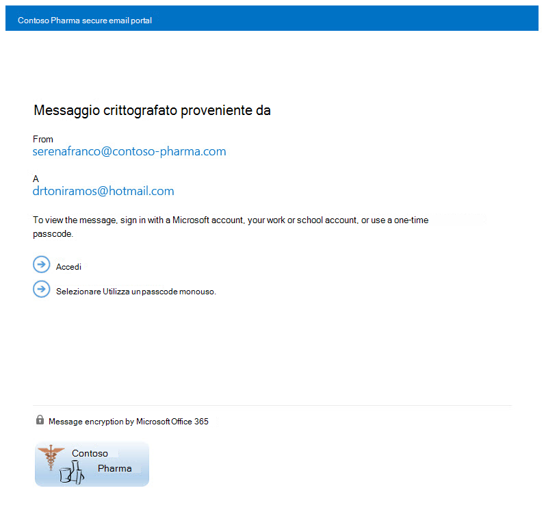

# <a name="legacy-information-for-office-365-message-encryption"></a>Informazioni legacy per Office 365 Message Encryption

Se l'organizzazione non è stata ancora spostata nelle nuove funzionalità OME, ma è già stata distribuita OME, le informazioni contenute in questo articolo si applicano all'organizzazione. Microsoft consiglia di effettuare un piano per passare alle nuove funzionalità OME non appena è ragionevole per la propria organizzazione. Per istruzioni, vedere [configurare le nuove funzionalità di crittografia dei messaggi di Office 365 basate su Azure Information Protection](set-up-new-message-encryption-capabilities.md). Per ulteriori informazioni sul funzionamento delle nuove funzionalità, vedere [crittografia dei messaggi di Office 365](ome.md). Il resto di questo articolo si riferisce al comportamento OME prima del rilascio delle nuove funzionalità OME.
  
Con la crittografia dei messaggi di Office 365, l'organizzazione può inviare e ricevere messaggi di posta elettronica crittografati tra utenti all'interno e all'esterno dell'organizzazione. La crittografia dei messaggi di Office 365 è compatibile con Outlook.com, Yahoo, Gmail e altri servizi di posta elettronica. La crittografia dei messaggi di posta elettronica consente di verificare che solo i destinatari previsti possano visualizzare il contenuto del messaggio.
  
Ecco alcuni esempi:
  
- Un dipendente di banca invia istruzioni sulla carta di credito ai clienti

- Un rappresentante della compagnia assicurativa fornisce informazioni sui criteri ai clienti

- Un broker di mutui richiede informazioni finanziarie da un cliente per una domanda di prestito

- Un provider di servizi sanitari invia informazioni sull'assistenza sanitaria ai pazienti

- Un avvocato invia informazioni riservate a un cliente o a un altro avvocato

## <a name="how-office-365-message-encryption-works-without-the-new-capabilities"></a>Funzionamento della crittografia dei messaggi di Office 365 senza le nuove funzionalità

La crittografia dei messaggi di Office 365 è un servizio online basato su Microsoft Azure Rights Management (Azure RMS). Con Azure RMS, gli amministratori possono definire le regole del flusso di posta per determinare le condizioni per la crittografia. Ad esempio, una regola può richiedere la crittografia di tutti i messaggi indirizzati a un destinatario specifico.
  
Guardare questo breve video per vedere come funziona la crittografia dei messaggi di Office 365 senza le nuove funzionalità.
  
> [!VIDEO https://www.microsoft.com/videoplayer/embed/c55540e7-f7f0-42f5-b254-4b2d2fbb1d63?autoplay=false]
  
Quando un utente invia un messaggio di posta elettronica in Exchange Online che corrisponde a una regola di crittografia, il messaggio viene inviato con un allegato HTML. Il destinatario apre l'allegato HTML e segue le istruzioni per visualizzare il messaggio crittografato sul portale di crittografia dei messaggi di Office 365. Il destinatario può scegliere di visualizzare il messaggio accedendo con un account Microsoft o un lavoro o una scuola associati a Office 365 oppure utilizzando un codice Pass una tantum. Tali opzioni garantiscono che solo il destinatario specificato sia in grado di visualizzare il messaggio crittografato. Questo processo è molto diverso per le nuove funzionalità OME.
  
Nel seguente diagramma viene riepilogata la procedura di crittografia e decrittografia di un messaggio di posta elettronica.
  

  
Per ulteriori informazioni, vedere [informazioni sul servizio per la crittografia dei messaggi di Office 365 legacy prima del rilascio delle nuove funzionalità ome](legacy-information-for-message-encryption.md#LegacyServiceInfo).
  
## <a name="defining-mail-flow-rules-for-office-365-message-encryption-that-dont-use-the-new-ome-capabilities"></a>Definizione delle regole del flusso di posta per la crittografia dei messaggi di Office 365 che non utilizzano le nuove funzionalità OME

Per abilitare la crittografia dei messaggi di Office 365 senza le nuove funzionalità, gli amministratori di Exchange Online e Exchange Online Protection definiscono le regole del flusso di posta di Exchange. Queste regole determinano in quali condizioni devono essere crittografati i messaggi di posta elettronica, nonché le condizioni per la rimozione della crittografia dei messaggi. Quando viene impostata un'azione di crittografia per una regola, il servizio esegue l'azione su tutti i messaggi che soddisfano le condizioni della regola prima di inviare i messaggi.

Le regole del flusso di posta sono flessibili, consentendo di combinare condizioni in modo da poter soddisfare requisiti di sicurezza specifici in una singola regola. Ad esempio, è possibile creare una regola per crittografare tutti i messaggi che contengono parole chiave specificate e che sono indirizzati a destinatari esterni. La crittografia dei messaggi di Office 365 crittografa anche le risposte provenienti da destinatari di messaggi di posta elettronica crittografati ed è possibile creare una regola che decripta tali risposte come vantaggio per gli utenti di posta elettronica. In questo modo, gli utenti dell'organizzazione non dovranno accedere al portale di crittografia per visualizzare le risposte.
  
Per ulteriori informazioni su come creare regole del flusso di posta di Exchange, vedere [definire le regole per la crittografia dei messaggi di Office 365](define-mail-flow-rules-to-encrypt-email.md).
  
### <a name="use-the-eac-to-create-a-mail-flow-rule-for-encrypting-email-messages-without-the-new-ome-capabilities"></a>Utilizzo dell'interfaccia di amministrazione di Exchange per creare una regola del flusso di posta per la crittografia dei messaggi di posta elettronica senza le nuove funzionalità OME

1. In un Web browser, utilizzando un account aziendale o dell'Istituto di istruzione a cui sono state concesse le autorizzazioni di amministratore globale, [accedere a Office 365](https://support.office.com/article/b9582171-fd1f-4284-9846-bdd72bb28426#ID0EAABAAA=Web_browser).

2. Scegliere il riquadro **amministratore** .

3. Nell'interfaccia di amministrazione di Microsoft 365 fare clic su interfaccia di **Amministrazione** di \> **Exchange**.

4. Nell'interfaccia di amministrazione di Exchange, andare a regole del **flusso di posta** \>  e selezionare **nuova** nuova  \> **creare una nuova regola**. Per ulteriori informazioni sull'utilizzo di EAC, vedere interfaccia [di amministrazione di Exchange in Exchange Online](https://docs.microsoft.com/exchange/exchange-admin-center).

5. In **nome** Digitare un nome per la regola, ad esempio crittografare la posta per DrToniRamos@hotmail.com.

6. In **Applica questa regola se** selezionare una condizione e, se necessario, immettere un valore. Ad esempio, per crittografare i messaggi indirizzati a DrToniRamos@hotmail.com:

   1. In **Applica questa regola se**, selezionare **il destinatario è**.

   2. Selezionare un nome esistente dall'elenco dei contatti o digitare un nuovo indirizzo di posta elettronica nella casella **Controlla nomi**.

      - Per selezionare un nome esistente, selezionarlo dall'elenco e quindi fare clic su **OK**.

      - Per immettere un nuovo nome, digitare un indirizzo di posta elettronica nella casella **Controlla nomi** e quindi fare clic su **Controlla nomi** \> **OK**.

7. Per aggiungere altre condizioni, scegliere **altre opzioni** , quindi fare clic su **Aggiungi condizione** e selezionare dall'elenco.

   Ad esempio, per applicare la regola solo se il destinatario si trova all'esterno dell'organizzazione, selezionare **Aggiungi condizione** e quindi selezionare **il destinatario è esterno/interno** all' \> **esterno dell'organizzazione** \> **OK**.

8. Per abilitare la crittografia senza utilizzare le nuove funzionalità ome, **fare quanto segue**, selezionare **modifica la sicurezza dei messaggi** \> **applicare la versione precedente di ome** e quindi fare clic su **Salva**.

   Se viene visualizzato un messaggio di errore che non è abilitato per la gestione delle licenze IRM, non viene utilizzata la funzionalità OME legacy.

9. Optional Scegliere **Add Action** per specificare un'altra azione.

### <a name="use-exchange-online-powershell-to-create-a-mail-flow-rule-for-encrypting-email-messages-without-the-new-ome-capabilities"></a>Utilizzare PowerShell di Exchange Online per creare una regola del flusso di posta per la crittografia dei messaggi di posta elettronica senza le nuove funzionalità OME

1. Connettersi a PowerShell di Exchange Online. Per ulteriori informazioni, vedere [Connessione a Exchange Online PowerShell](https://docs.microsoft.com/powershell/exchange/connect-to-exchange-online-powershell).

2. Creare una regola utilizzando il cmdlet **New-TransportRule** e impostare il parametro _ApplyOME_ su `$true` .

   In questo esempio si presuppone che tutti i messaggi di posta elettronica inviati a DrToniRamos@hotmail.com debbano essere crittografati.

   ```powershell
   New-TransportRule -Name "Encrypt rule for Dr Toni Ramos" -SentTo "DrToniRamos@hotmail.com" -SentToScope "NotinOrganization" -ApplyOME $true
   ```

   In cui

   - Il nome univoco della nuova regola è "crittografare la regola per la Dott. ssa Toni Ramos".
   - Il parametro _SentTo_ consente di specificare i destinatari dei messaggi (identificati per nome, indirizzo di posta elettronica, nome distinto e così via). In questo esempio, il destinatario è identificato dall'indirizzo di posta elettronica "DrToniRamos@hotmail.com".
   - Il parametro _SentToScope_ consente di specificare la posizione dei destinatari del messaggio. In questo esempio, la cassetta postale del destinatario si trova in Hotmail e non fa parte dell'organizzazione, quindi `NotInOrganization` viene utilizzato il valore.

   Per informazioni dettagliate su sintassi e parametri, vedere [New-TransportRule](https://docs.microsoft.com/powershell/module/exchange/New-TransportRule).

### <a name="remove-encryption-from-email-replies-encrypted-without-the-new-ome-capabilities"></a>Rimuovere la crittografia dalle risposte di posta elettronica crittografate senza le nuove funzionalità OME

Quando gli utenti di posta elettronica inviano messaggi crittografati, i relativi destinatari possono rispondere con risposte crittografate. È possibile creare regole del flusso di posta per rimuovere automaticamente la crittografia dalle risposte in modo che gli utenti di posta elettronica nell'organizzazione non debbano accedere al portale di crittografia per visualizzarli. È possibile utilizzare l'interfaccia di amministrazione di Exchange o i cmdlet di Windows PowerShell per definire queste regole. È possibile decrittografare i messaggi inviati dall'interno dell'organizzazione o i messaggi che rispondono ai messaggi inviati dall'interno dell'organizzazione. Non è possibile decrittografare i messaggi crittografati provenienti dall'esterno dell'organizzazione.

#### <a name="use-the-eac-to-create-a-rule-for-removing-encryption-from-email-replies-encrypted-without-the-new-ome-capabilities"></a>Utilizzo dell'interfaccia di amministrazione di Exchange per creare una regola per la rimozione della crittografia dalle risposte di posta elettronica crittografate senza le nuove funzionalità OME

1. In un Web browser, utilizzando un account aziendale o dell'Istituto di istruzione a cui sono state concesse le autorizzazioni di amministratore, [accedere a Office 365](https://support.office.com/article/b9582171-fd1f-4284-9846-bdd72bb28426#ID0EAABAAA=Web_browser).

2. Scegliere il riquadro **amministratore** .

3. Nell'interfaccia di amministrazione di Microsoft 365 fare clic su interfaccia di **Amministrazione** di \> **Exchange**.

4. Nell'interfaccia di amministrazione di Exchange, andare a regole del **flusso di posta** \>  e selezionare **nuova** nuova  \> **creare una nuova regola**. Per ulteriori informazioni sull'utilizzo di EAC, vedere interfaccia [di amministrazione di Exchange in Exchange Online](https://docs.microsoft.com/exchange/exchange-admin-center).

5. In **nome** Digitare un nome per la regola, ad esempio Rimuovi la crittografia dalla posta in arrivo.

6. In **applica questa regola se** si selezionano le condizioni in cui la crittografia deve essere rimossa dai messaggi, ad esempio **il destinatario si trova** \> **all'interno dell'organizzazione**.

7. In **effettuare le seguenti operazioni**, selezionare **modifica la sicurezza dei messaggi** \> **rimuovere la versione precedente di ome**.

8. Selezionare **Salva**.

#### <a name="use-exchange-online-powershell-to-create-a-rule-to-remove-encryption-from-email-replies-encrypted-without-the-new-ome-capabilities"></a>Utilizzo di PowerShell di Exchange Online per creare una regola per rimuovere la crittografia dalle risposte di posta elettronica crittografate senza le nuove funzionalità OME

1. Connettersi a PowerShell di Exchange Online. Per ulteriori informazioni, vedere [Connessione a Exchange Online PowerShell](https://docs.microsoft.com/powershell/exchange/connect-to-exchange-online-powershell).

2. Creare una regola utilizzando il cmdlet **New-TransportRule** e impostare il parametro _RemoveOME_ su `$true` .

   In questo esempio viene rimossa la crittografia da tutti i messaggi inviati ai destinatari nell'organizzazione.

   ```powershell
   New-TransportRule -Name "Remove encryption from incoming mail" -SentToScope "InOrganization" -RemoveOME $true
   ```

   In cui

   - Il nome univoco della nuova regola è "Rimuovi crittografia dalla posta in arrivo".
   - Il parametro _SentToScope_ consente di specificare la posizione dei destinatari del messaggio. In questo esempio viene utilizzato il valore Value `InOrganization` , che indica uno dei seguenti valori:
     - Il destinatario è una cassetta postale, un utente di posta, un gruppo o una cartella pubblica abilitata all'utilizzo della posta nell'organizzazione.
     - L'indirizzo di posta elettronica del destinatario si trova in un dominio accettato configurato come dominio autorevole o come dominio di inoltro interno nell'organizzazione _e_ il messaggio è stato inviato o ricevuto tramite una connessione autenticata.

Per informazioni dettagliate su sintassi e parametri, vedere [New-TransportRule](https://docs.microsoft.com/powershell/module/exchange/New-TransportRule).

## <a name="sending-viewing-and-replying-to-messages-encrypted-without-the-new-capabilities"></a>Invio, visualizzazione e risposta ai messaggi crittografati senza le nuove funzionalità

Con la crittografia dei messaggi di Office 365, i messaggi di posta elettronica vengono crittografati automaticamente, in base alle regole definite dall'amministratore. Un messaggio di posta elettronica in cui viene inserito un messaggi crittografato arriva nella posta in arrivo del destinatario con un file HTML allegato.
  
I destinatari seguono le istruzioni del messaggio per aprire l'allegato e eseguire l'autenticazione utilizzando un account Microsoft o un lavoro o una scuola associati a Office 365. Se i destinatari non dispongono di un account, è possibile creare un account Microsoft che consentirà di accedere per visualizzare il messaggio crittografato. In alternativa, i destinatari possono scegliere di ottenere un codice Pass una tantum per visualizzare il messaggio. Dopo aver eseguito l'accesso o l'utilizzo di un codice Pass una tantum, i destinatari possono visualizzare il messaggio decrittografato e inviare una risposta crittografata.
  
## <a name="customize-encrypted-messages-with-office-365-message-encryption"></a>Personalizzare i messaggi crittografati con la crittografia dei messaggi di Office 365

In qualità di amministratore di Exchange Online e Exchange Online Protection, è possibile personalizzare i messaggi crittografati. Ad esempio, è possibile aggiungere il marchio e il logo della società, specificare un'introduzione e aggiungere testo di dichiarazione di non responsabilità nei messaggi crittografati e nel portale in cui i destinatari visualizzano i messaggi crittografati. Utilizzando i cmdlet Windows PowerShell, è possibile personalizzare i seguenti aspetti dell'esperienza di visualizzazione per i destinatari dei messaggi di posta elettronica crittografati:

- Testo introduttivo del messaggio di posta elettronica contenente il messaggio crittografato

- Testo della dichiarazione di non responsabilità del messaggio di posta elettronica contenente il messaggio crittografato

- Testo portale che apparirà nel messaggio di visualizzazione del portale

- Logo che verrà visualizzato nel messaggio di posta elettronica e nel portale di visualizzazione

È anche possibile ripristinare l'aspetto predefinito in qualsiasi momento.
  
Nel seguente esempio viene illustrato un logo personalizzato per ContosoPharma nell'allegato di posta elettronica:
  

  
**Per personalizzare i messaggi di posta elettronica di crittografia e il portale di crittografia con il marchio dell'organizzazione**
  
1. Connettersi a Exchange Online tramite Remote PowerShell, come descritto in [Connect to Exchange Online using Remote PowerShell](https://docs.microsoft.com/powershell/exchange/connect-to-exchange-online-powershell).

2. Utilizzare il cmdlet Set-OMEConfiguration come descritto di seguito: [set-OMEConfiguration](https://technet.microsoft.com/3ef0aec0-ce28-411d-abe8-7236f082af1b) oppure utilizzare la seguente tabella per istruzioni.

   **Opzioni di personalizzazione della crittografia**

**Per personalizzare questa funzionalità dell'esperienza di crittografia**|**Utilizzare questi comandi di Windows PowerShell**|
|:-----|:-----|
|Testo predefinito che accompagna i messaggi di posta elettronica crittografati  <br/> Il testo predefinito viene visualizzato sopra le istruzioni per la visualizzazione di messaggi crittografati  <br/> | `Set-OMEConfiguration -Identity <OMEConfigurationIdParameter> -EmailText "<string of up to 1024 characters>"` <br/> **Esempio:** `Set-OMEConfiguration -Identity "OME Configuration" -EmailText "Encrypted message from ContosoPharma secure messaging system"` <br/> |
|dichiarazione di non responsabilità nella posta elettronica che contiene il messaggio crittografato  <br/> | `Set-OMEConfiguration -Identity <OMEConfigurationIdParameter> DisclaimerText "<your disclaimer statement, string of up to 1024 characters>"` <br/> **Esempio:** `Set-OMEConfiguration -Identity "OME Configuration" -DisclaimerText "This message is confidential for the use of the addressee only"` <br/> |
|testo visualizzato nella parte superiore del portale di visualizzazione del messaggio crittografato  <br/> | `Set-OMEConfiguration -Identity <OMEConfigurationIdParameter> -PortalText "<text for your portal, string of up to 128 characters>"` <br/> **Esempio:** `Set-OMEConfiguration -Identity "OME Configuration" -PortalText "ContosoPharma secure email portal"` <br/> |
|Logo  <br/> | `Set-OMEConfiguration -Identity <OMEConfigurationIdParameter> -Image <Byte[]>` <br/> **Esempio:** `Set-OMEConfiguration -Identity "OME configuration" -Image (Get-Content "C:\Temp\contosologo.png" -Encoding byte)` <br/> Formati di file supportati: png, jpg, bmp o tiff  <br/> Dimensione ottimale relativa al file del logo: inferiore a 40 KB  <br/> Dimensioni ottimali relative all'immagine del logo: 170x70 pixel  <br/> |

**Per rimuovere le personalizzazioni di marca dai messaggi di posta elettronica di crittografia e il portale di crittografia**
  
1. Connettersi a Exchange Online tramite Remote PowerShell, come descritto in [Connect to Exchange Online using Remote PowerShell](https://technet.microsoft.com/library/jj984289%28v=exchg.150%29.aspx).

2. Utilizzare il cmdlet Set-OMEConfiguration come descritto di seguito: [set-OMEConfiguration](https://technet.microsoft.com/3ef0aec0-ce28-411d-abe8-7236f082af1b). Per rimuovere le personalizzazioni personalizzate dell'organizzazione dai valori DisclaimerText, EmailText e PortalText, impostare il valore su una stringa vuota  `""` . Per tutti i valori di immagine, ad esempio logo, impostare il valore su  `"$null"` .

   **Opzioni di personalizzazione della crittografia**

|**Per ripristinare il testo e l'immagine predefiniti per questa funzionalità dell'esperienza di crittografia**|**Utilizzare questi comandi di Windows PowerShell**|
|:-----|:-----|
|Testo predefinito che accompagna i messaggi di posta elettronica crittografati  <br/> Il testo predefinito viene visualizzato sopra le istruzioni per la visualizzazione di messaggi crittografati  <br/> | `Set-OMEConfiguration -Identity <OMEConfigurationIdParameter> -EmailText "<empty string>"` <br/> **Esempio:** `Set-OMEConfiguration -Identity "OME Configuration" -EmailText ""` <br/> |
|dichiarazione di non responsabilità nella posta elettronica che contiene il messaggio crittografato  <br/> | `Set-OMEConfiguration -Identity <OMEConfigurationIdParameter> DisclaimerText "<empty string>"` <br/> **Esempio:** `Set-OMEConfiguration -Identity "OME Configuration" -DisclaimerText ""` <br/> |
|testo visualizzato nella parte superiore del portale di visualizzazione del messaggio crittografato  <br/> | `Set-OMEConfiguration -Identity <OMEConfigurationIdParameter> -PortalText "<empty string>"` <br/> **Esempio ripristinando il valore predefinito:**`Set-OMEConfiguration -Identity "OME Configuration" -PortalText ""` <br/> |
|Logo  <br/> | `Set-OMEConfiguration -Identity <OMEConfigurationIdParameter> -Image <"$null">` <br/> **Esempio ripristinando il valore predefinito:**`Set-OMEConfiguration -Identity "OME configuration" -Image $null` <br/> |

## <a name="service-information-for-legacy-office-365-message-encryption-prior-to-the-release-of-the-new-ome-capabilities"></a>Informazioni sul servizio per la crittografia dei messaggi di Office 365 legacy prima del rilascio delle nuove funzionalità OME
<a name="LegacyServiceInfo"> </a>

La tabella seguente fornisce informazioni tecniche per il servizio di crittografia dei messaggi di Office 365 prima del rilascio delle nuove funzionalità OME.
  
|**Dettagli servizio**|**Descrizione**|
|:-----|:-----|
|Requisiti dei dispositivi client  <br/> |I messaggi crittografati possono essere visualizzati su tutti i dispositivi client, purché l'allegato HTML possa essere aperto in un browser moderno che supporta Post per i moduli.  <br/> |
|Algoritmo di crittografia e conformità FIPS (Federal Information Processing Standards)  <br/> |La crittografia dei messaggi di Office 365 utilizza le stesse chiavi di crittografia di Windows Azure Information Rights Management (IRM) e supporta Modalità crittografia 2 (chiave a 2 K per RSA e chiave a 256 bit per sistemi SHA-1). Per ulteriori informazioni sulle modalità di crittografia IRM sottostanti, vedere [modalità di crittografia ad RMS](https://technet.microsoft.com/library/hh867439%28WS.10%29.aspx).  <br/> |
|Tipi di messaggi supportati  <br/> |La crittografia messaggi di Office 365 è supportata soltanto per gli elementi con ID classe messaggio pari a **IPM.Note**. Per ulteriori informazioni, vedere [tipi di elementi e classi di messaggi](https://msdn.microsoft.com/library/office/ff861573.aspx).  <br/> |
|Limiti di dimensione dei messaggi  <br/> |Crittografia dei messaggi di Office 365 è in grado di crittografare messaggi con dimensioni fino a 25 megabyte. Per ulteriori informazioni sui limiti relativi alle dimensioni dei messaggi, vedere [limiti di Exchange Online](https://technet.microsoft.com/library/exchange-online-limits.aspx).  <br/> |
|Criteri di conservazione della posta elettronica di Exchange Online  <br/> |Exchange Online non archivia i messaggi crittografati.  <br/> |
|Supporto linguistico per la crittografia dei messaggi di Office 365  <br/> | La crittografia dei messaggi di Office 365 supporta le lingue di Microsoft 365, come indicato di seguito:  <br/>  I messaggi di posta elettronica in arrivo e i file HTML allegati vengono localizzati in base alle impostazioni della lingua del mittente.  <br/>  Il portale di visualizzazione viene localizzato in base alle impostazioni del browser del destinatario.  <br/>  Il corpo (contenuto) del messaggio crittografato non è localizzato.  <br/> |
|Informazioni sulla privacy per il Portale OME e l'app visualizzatore OME  <br/> |[Office 365 Messaging Encryption Portal privacy statement](https://privacy.microsoft.com/privacystatement) fornisce informazioni dettagliate sulle azioni effettuate da Microsoft con le informazioni private fornite dagli utenti.  <br/> |

## <a name="frequently-asked-questions-about-legacy-ome"></a>Domande frequenti su OME legacy
<a name="LegacyServiceInfo"> </a>

Hai domande sulla crittografia dei messaggi di Office 365? Di seguito sono riportate alcune risposte. Se non si riesce a trovare ciò che è necessario, consultare [Microsoft Tech community forums for Office 365](https://techcommunity.microsoft.com/t5/Office-365/ct-p/Office365).
  
 **D. Gli utenti inviano messaggi di posta elettronica crittografati ai destinatari esterni all'organizzazione. Per leggere e rispondere ai messaggi di posta elettronica crittografati con la crittografia dei messaggi di Office 365, è necessario eseguire altre attività ai destinatari esterni.**
  
I destinatari esterni all'organizzazione che ricevono i messaggi crittografati da Microsoft 365 possono visualizzarli in uno dei due modi seguenti:
  
- Tramite l'accesso con un account Microsoft o un account aziendale o dell'Istituto di istruzione associato a Office 365.

- Utilizzando un codice pass monouso.

 **D. I messaggi crittografati di Microsoft 365 sono archiviati nel cloud o nei server Microsoft?**
  
No, i messaggi crittografati vengono mantenuti nel sistema di posta elettronica del destinatario e quando il destinatario apre il messaggio, viene temporaneamente inviato per la visualizzazione sui server Microsoft. I messaggi non vengono archiviati.
  
 **D. È possibile personalizzare i messaggi di posta elettronica crittografati con il proprio marchio?**
  
Sì. È possibile utilizzare i cmdlet di Windows PowerShell per personalizzare il testo personalizzato che viene visualizzato nella parte superiore dei messaggi di posta elettronica crittografati, il testo della Dichiarazione di non responsabilità e il logo che si desidera utilizzare per il messaggio di posta elettronica e il portale di crittografia. Questa funzionalità è ora disponibile in OMEv2. Per i dettagli, vedere [Add branding to encrypted messages](add-your-organization-brand-to-encrypted-messages.md).
  
 **D. Il servizio richiede una licenza per ogni utente dell'organizzazione?**
  
È necessario disporre di una licenza per ogni utente dell'organizzazione che invia messaggi di posta elettronica crittografati.
  
 **D. I destinatari esterni hanno bisogno di sottoscrizioni?**
  
No, i destinatari esterni non necessitano di una sottoscrizione per leggere o rispondere ai messaggi crittografati.
  
 **D. In che modo la crittografia dei messaggi di Office 365 è diversa da Rights Management Services (RMS)?**
  
RMS fornisce le funzionalità di protezione dei diritti di informazioni per i messaggi di posta elettronica interni di un'organizzazione fornendo modelli incorporati, ad esempio: non inoltrare e riservare la società. La crittografia dei messaggi di Office 365 supporta la crittografia dei messaggi di posta elettronica che vengono inviati ai destinatari esterni e interni.
  
 **D. In che modo la crittografia dei messaggi di Office 365 è diversa da S/MIME?**
  
S/MIME rappresenta una tecnologia di crittografia sul lato client e necessita di una complessa gestione del certificato e di pubblicazione dell'infrastruttura. La crittografia dei messaggi di Office 365 utilizza le regole del flusso di posta (note anche come regole di trasporto) e non dipende dalla pubblicazione dei certificati.
  
 **D. È possibile leggere i messaggi crittografati su dispositivi mobili?**
  
Sì, è possibile visualizzare i messaggi su Android e iOS scaricando le app del Visualizzatore OME da Google Play Store e dall'Apple App Store. Aprire l'allegato in formato HTML nell'app Visualizzatore Crittografia messaggi di Office 365 e attenersi alle istruzioni per aprire il messaggio crittografato. Per quanto riguarda altri dispositivi mobili, è possibile aprire l'allegato in formato HTML fin tanto che il client di posta elettronica supporta Post per i form.
  
 **D. I messaggi di risposta e i messaggi inoltrati vengono crittografati?**
  
Sì. I messaggi di risposta vengono crittografati per tutta la durata del thread.
  
 **D. La crittografia dei messaggi di Office 365 fornisce la localizzazione?**
  
Il contenuto della posta elettronica in arrivo viene localizzata in base alle impostazioni di posta elettronica del mittente. Il portale di visualizzazione viene localizzato in base alle impostazioni del browser del destinatario. Tuttavia, il corpo (contenuto) del messaggio crittografato non viene localizzato.
  
 **D. Quale metodo di crittografia viene utilizzato per la crittografia dei messaggi di Office 365?**
  
La crittografia dei messaggi di Office 365 utilizza Rights Management Services (RMS) come infrastruttura di crittografia. Il metodo di crittografia utilizzato dipende da dove ottieni le chiavi RMS utilizzate per crittografare e decrittografare messaggi.
  
- Se si utilizza Microsoft Azure RMS per ottenere le chiavi, viene utilizzata la modalità di crittografia 2. La Modalità di crittografia 2 è un'implementazione di crittografia AD RMS aggiornata e migliorata. Questa supporta RSA 2048 per la crittografia e firma e SHA-256 per firma.

- Se si utilizza Active Directory (AD) RMS per ottenere le chiavi, viene utilizzata la Modalità di crittografia 1 o la Modalità di crittografia 2. Il metodo utilizzato dipende dalla distribuzione Active directory (AD) RMS. La Modalità di crittografia 1 è l'implementazione di crittografia AD RMS originale. Questa supporta RSA 1024 per la crittografia e firma e SHA-1 per firma. Questa modalità continua ad essere supportata da tutte le versioni correnti di RMS.

Per ulteriori informazioni, vedere [modalità di crittografia ad RMS](https://go.microsoft.com/fwlink/p/?LinkId=398616).
  
**D. Perché alcuni messaggi crittografati dicono di essere provenienti da** Office365@messaging.microsoft.com?
  
Quando una risposta crittografata viene inviata dal portale di crittografia oppure tramite l'app Visualizzatore Crittografia messaggi di Office 365, l'indirizzo del messaggio di posta elettronica da inviare è impostato su Office365@messaging.microsoft.com perché il messaggio crittografato viene inviato tramite un endpoint di Microsoft. In questo modo si evita che i messaggi crittografati vengano contrassegnati come posta indesiderata. Il nome visualizzato nel messaggio di posta elettronica e l'indirizzo all'interno del portale di crittografia non vengono modificati a causa di questa etichetta. Inoltre, tale etichetta si applica solo ai messaggi inviati tramite il portale, non tramite altri client di posta elettronica.
  
 **D. Sono un Sottoscrittore di Exchange Hosted Encryption (EHE). Dove è possibile ottenere ulteriori informazioni sull'aggiornamento alla crittografia dei messaggi di Office 365?**
  
Si è provveduto all'aggiornamento al servizio di crittografia dei messaggi di Office 365 per tutti gli utenti di EHE. Per ulteriori informazioni, visitare il [Centro aggiornamenti di Exchange Hosted Encryption](https://go.microsoft.com/fwlink/p/?LinkID=511077).
  
 **D. È necessario aprire tutti gli URL, gli indirizzi IP o le porte del firewall dell'organizzazione per supportare la crittografia dei messaggi di Office 365?**
  
Sì. È necessario aggiungere URL per Exchange Online all'elenco Consenti per l'organizzazione per abilitare l'autenticazione per i messaggi crittografati tramite la crittografia dei messaggi di Office 365. Per un elenco degli URL di Exchange Online, vedere [URL e intervalli di indirizzi IP di Microsoft 365](https://docs.microsoft.com/microsoft-365/enterprise/urls-and-ip-address-ranges).
  
 **D. A quanti destinatari è possibile inviare un messaggio crittografato di Microsoft 365?**
  
Il limite del destinatario è 500 destinatari per messaggio oppure, se combinato dopo l'espansione della lista di distribuzione, 11.980 caratteri del messaggio in campo **a** , a seconda di quale verrà prima.
  
 **D. È possibile revocare un messaggio inviato a un particolare destinatario?**
  
No. Non è possibile revocare un messaggio a una persona specifica dopo che è stata inviata.
  
 **D. Posso visualizzare un report dei messaggi crittografati che sono stati ricevuti e letti?**
  
Non è presente un rapporto che indica se è stato visualizzato un messaggio crittografato, ma sono disponibili report di Microsoft 365 che è possibile utilizzare per determinare il numero di messaggi che corrispondono a una regola del flusso di posta specifica (nota anche come regola di trasporto), ad esempio.
  
 **D. Come vengono utilizzate da Microsoft le informazioni fornite tramite il Portale OME e l'app visualizzatore OME?**
  
L'informativa [sulla privacy di Office 365 Messaging Encryption Portal](https://privacy.microsoft.com/privacystatement) fornisce informazioni dettagliate su ciò che Microsoft fa e non fa con le informazioni private.

**D. Cosa si può fare se non si riceve il codice Pass una tantum dopo averlo richiesto?**

Controllare innanzitutto la cartella posta indesiderata o posta indesiderata nel client di posta elettronica. Le impostazioni di DKIM e DMARC per l'organizzazione potrebbero causare la filtraggio della posta indesiderata.

Successivamente, verificare la quarantena nel centro sicurezza & conformità. Spesso, i messaggi che contengono un codice di passaggio una tantum, in particolare i primi ricevuti dall'organizzazione, finiscono in quarantena.
