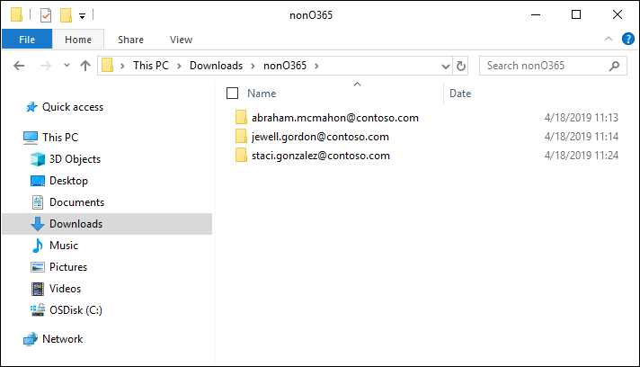
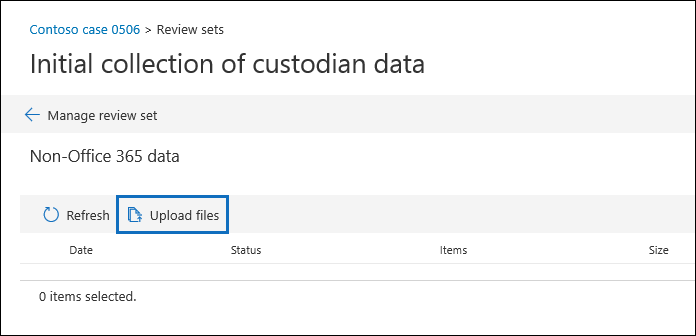
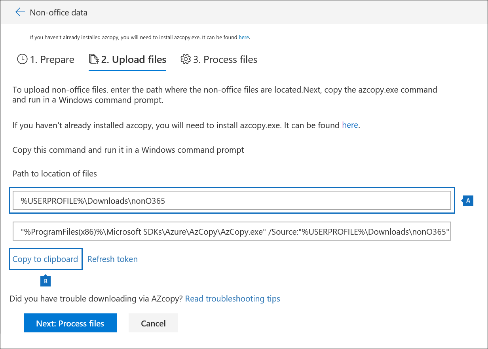

# Caricare dati non Microsoft 365 in un set di RevisioneLoad non-Microsoft 365 data into a review set

Non tutti i documenti che devono essere analizzati in Advanced eDiscovery si trovano in Microsoft 365.Not all documents that you need to analyze in Advanced eDiscovery are located in Microsoft 365. Con la caratteristica di importazione di dati non Microsoft 365 in Advanced eDiscovery, è possibile caricare i documenti che non sono presenti in Microsoft 365 in un set di revisione.With the non-Microsoft 365 data import feature in Advanced eDiscovery, you can upload documents that aren't located in Microsoft 365 to a review set. In questo articolo viene illustrato come portare i documenti non Microsoft 365 in Advanced eDiscovery per l'analisi.This article shows you how to bring your non-Microsoft 365 documents into Advanced eDiscovery for analysis.

## Prima di iniziareBefore you begin

Se si utilizza la funzionalità carica non Microsoft 365 descritta in questo articolo, è necessario disporre di quanto segue:Using the upload non-Microsoft 365 feature described in this article requires that you have the following:

- A tutti i depositari ai quali si desidera associare il contenuto non Microsoft 365 deve essere assegnata la licenza appropriata.All custodians that you want to associate non-Microsoft 365 content to must be assigned the appropriate license. Per ulteriori informazioni, vedere [Introduzione a Advanced eDiscovery](get-started-with-advanced-ediscovery.md#step-1-verify-and-assign-appropriate-licenses).For more information, see [Get started with Advanced eDiscovery](get-started-with-advanced-ediscovery.md#step-1-verify-and-assign-appropriate-licenses).

- Un caso avanzato di eDiscovery esistente.An existing Advanced eDiscovery case.

- I depositari devono essere aggiunti al caso prima di poter caricare e associare ai dati non Microsoft 365.Custodians must be added to the case before you can upload and associate the non-Microsoft 365 data to them.

- I dati non Microsoft 365 devono essere un tipo di file supportato da Advanced eDiscovery.Non-Microsoft 365 data must be a file type that's supported by Advanced eDiscovery. Per ulteriori informazioni, vedere [tipi di file supportati in Advanced eDiscovery](supported-filetypes-ediscovery20.md).For more information, see [Supported file types in Advanced eDiscovery](supported-filetypes-ediscovery20.md).

- Tutti i file caricati in un set di revisione devono trovarsi in cartelle, in cui ogni cartella è associata a un determinato custode.All files that are uploaded to a review set must be located in folders, where each folder is associated with a specific custodian. I nomi di queste cartelle devono utilizzare il formato di denominazione seguente: *alias@domainname*.The names for these folders must use the following naming format: *alias@domainname*. Il alias@domainname deve essere l'alias e il dominio Microsoft 365 dell'utente.The alias@domainname must be the user's Microsoft 365 alias and domain. È possibile raccogliere tutte le cartelle di alias@domainname in una cartella radice.You can collect all the alias@domainname folders in a root folder. La cartella radice può contenere solo le cartelle alias@domainname.The root folder can only contain the alias@domainname folders. I file allentati nella cartella radice non sono supportati.Loose files in the root folder aren't supported.

   La struttura di cartelle per i dati non Microsoft 365 che si desidera caricare sarebbe simile all'esempio seguente:The folder structure for the non-Microsoft 365 data that you want to upload would be similar to the following example:

   - c:\nonO365\abraham.mcmahon@contoso.comc:\nonO365\abraham.mcmahon@contoso.com
   - c:\nonO365\jewell.gordon@contoso.comc:\nonO365\jewell.gordon@contoso.com
   - c:\nonO365\staci.gonzalez@contoso.comc:\nonO365\staci.gonzalez@contoso.com

   Dove abraham.mcmahon@contoso.com, jewell.gordon@contoso.com e staci.gonzalez@contoso.com sono gli indirizzi SMTP dei depositari nel caso.Where abraham.mcmahon@contoso.com, jewell.gordon@contoso.com, and staci.gonzalez@contoso.com are the SMTP addresses of custodians in the case.

   

- Un account assegnato al gruppo di ruoli eDiscovery Manager (e aggiunto come amministratore di eDiscovery).An account that is assigned to the eDiscovery Manager role group (and added as eDiscovery Administrator).

- Lo strumento AzCopy v 8.1 è installato in un computer che ha accesso alla struttura di cartelle di contenuto non Microsoft 365.The AzCopy v8.1 tool installed on a computer that has access to the non-Microsoft 365 content folder structure. Per installare AzCopy, vedere [Transfer Data with the AzCopy v 8.1 in Windows](https://docs.microsoft.com/previous-versions/azure/storage/storage-use-azcopy).To install AzCopy, see [Transfer data with the AzCopy v8.1 on Windows](https://docs.microsoft.com/previous-versions/azure/storage/storage-use-azcopy). Assicurarsi di installare AzCopy nel percorso predefinito, che è **% ProgramFiles (x86)% \ Microsoft SDKs\Azure\AzCopy**.Be sure to install AzCopy in the default location, which is **%ProgramFiles(x86)%\Microsoft SDKs\Azure\AzCopy**. È necessario utilizzare AzCopy v 8.1.You must use AzCopy v8.1. Le altre versioni di AzCopy potrebbero non funzionare quando si caricano dati non Microsoft 365 in Advanced eDiscovery.Other versions of AzCopy may not work when loading non-Microsoft 365 data in Advanced eDiscovery.

## Caricare contenuto non Microsoft 365 in Advanced eDiscoveryUpload non-Microsoft 365 content into Advanced eDiscovery

1. In qualità di Manager di eDiscovery o amministratore di eDiscovery, aprire Advanced eDiscovery e passare al caso in cui verranno caricati i dati non Microsoft 365.As an eDiscovery Manager or eDiscovery Administrator, open Advanced eDiscovery, and go to the case that the non-Microsoft 365 data will be uploaded to.  

2. Fare clic su **Revisione set**e quindi selezionare il set di revisione in cui caricare i dati non Microsoft 365.Click **Review sets**, and then select the review set to upload the non-Microsoft 365 data to.  Se non si dispone di un set di recensioni, è possibile crearne uno.If you don't have a review set, you can create one. 
 
3. Nel set di verifica fare clic su **Gestisci Revisione set**e quindi su **Visualizza caricamenti** nel riquadro **dati non Microsoft 365** .In the review set, click **Manage review set**, and then click **View uploads** on the **Non-Microsoft 365 data** tile.

4. Fare clic su **Carica file** per avviare l'importazione guidata dati.Click **Upload files** to start the data import wizard.

   

   Il primo passaggio della procedura guidata consente di preparare una posizione di archiviazione di Azure protetta fornita da Microsoft per il caricamento dei file.The first step in the wizard prepares a secure Microsoft-provided Azure Storage location to upload the files to.  Al termine della preparazione, il pulsante **Avanti: carica file** diventa attivo.When the preparation is completed, the **Next: Upload files** button becomes active.

   
 
5. Fare clic su **Avanti: carica file**.Click **Next: Upload files**.

6. Nella pagina **Carica file** eseguire le operazioni seguenti:On the **Upload files** page, do the following:

   

   a.a. Nella casella **percorso della posizione dei file** verificare o digitare il percorso della cartella principale in cui sono stati archiviati i dati non Microsoft 365 che si desidera caricare.In the **Path to location of files** box, verify or type the location of the root folder where you've stored the non-Microsoft 365 data you want to upload. Ad esempio, per il percorso dei file di esempio visualizzati nella **sezione prima di iniziare**, è necessario digitare **%USERPROFILE\Downloads\nonO365**.For example, for the location of the example files shown in the **Before you begin section**, you would type **%USERPROFILE\Downloads\nonO365**. Se si specifica la posizione corretta, il comando AzCopy visualizzato nella casella sotto il percorso viene aggiornato correttamente.Providing the correct location ensures the AzCopy command displayed in box under the path is properly updated.

   b.b. Fare clic su **copia negli Appunti** per copiare il comando visualizzato nella casella.Click **Copy to clipboard** to copy the command that is displayed in the box.

7. Avviare un prompt dei comandi di Windows, incollare il comando copiato nel passaggio precedente e quindi premere **invio** per avviare il comando AzCopy.Start a Windows command prompt, paste the command that you copied in the previous step, and then press **Enter** to start the AzCopy command.  Dopo aver avviato il comando, i file non Microsoft 365 verranno caricati nel percorso di archiviazione di Azure preparato nel passaggio 4.After you start the command, the non-Microsoft 365 files will be uploaded to the Azure Storage location that was prepared in step 4.

   

   > [!NOTE]
   > Come indicato in precedenza, è necessario utilizzare AzCopy v 8.1 per utilizzare correttamente il comando fornito nella pagina **Carica file** .As previously stated, you must use AzCopy v8.1 to successfully use the command that's provided on the **Upload files** page. Se il comando AzCopy fornito ha esito negativo, vedere [risolvere i problemi relativi a AzCopy in Advanced eDiscovery](troubleshooting-azcopy.md).If the supplied AzCopy command fails, please see [Troubleshoot AzCopy in Advanced eDiscovery](troubleshooting-azcopy.md).

8. Tornare al centro sicurezza & conformità e fare clic su **Avanti: elabora file** nella procedura guidata.Go back to the Security & Compliance Center, and click **Next: Process files** in the wizard.  In questo modo viene avviata l'elaborazione, l'estrazione del testo e l'indicizzazione dei file non Microsoft 365 caricati nel percorso di archiviazione di Azure.This initiates processing, text extraction, and indexing of the non-Microsoft 365 files that were uploaded to the Azure Storage location.  

9. Controllare lo stato di avanzamento dell'elaborazione dei file nella pagina dei **file di processo** o nella scheda **processi** visualizzando un processo denominato **aggiunta di dati non Microsoft 365 a un set di revisione**.Track the progress of processing the files on the **Process files** page or on the **Jobs** tab by viewing a job named **Adding non-Microsoft 365 data to a review set**.  Al termine del processo, i nuovi file saranno disponibili nel set di revisione.After the job is finished, the new files will be available in the review set.

   

10. Al termine dell'elaborazione, è possibile chiudere la procedura guidata.After the processing is finished, you can close the wizard.
