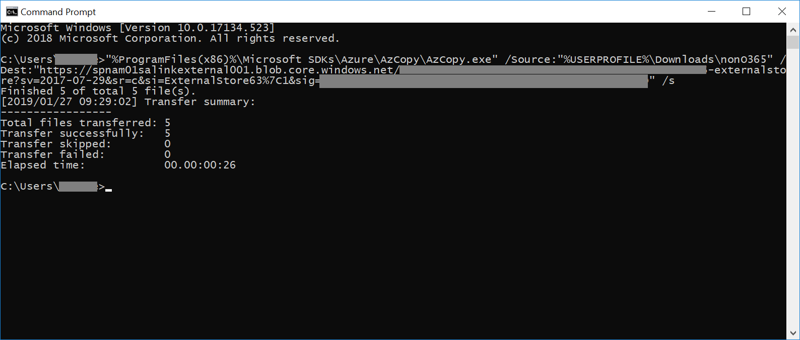

# Caricare i dati non di Office 365 in EvidenceLoad non-Office 365 data into evidence

Non tutti i documenti che potrebbe essere necessario analizzare in un'indagine dati saranno disponibili in Office 365.Not all documents that you may need to analyze in a data investigation will be located in Office 365. Con la funzionalità di importazione di contenuto non Office 365 è possibile caricare documenti che non risiedono in Office 365 in elementi di prova in modo che possano essere analizzati in un'analisi dei dati.With the Non-Office 365 content import feature you can upload documents that don't live in Office 365 into evidence so they can be analyzed in a data investigation.

>[!Note]
>Per l'analisi dei dati è necessario un Office 365 E3 con il componente aggiuntivo per la conformità avanzato o un abbonamento E5 per l'organizzazione.Data investigation requires an Office 365 E3 with the Advanced Compliance add-on or an E5 subscription for your organization. Se non si dispone di tale piano e si desidera provare Advanced eDiscovery, è possibile iscriversi per una versione di valutazione di Office 365 Enterprise E5.If you don't have that plan and want to try Advanced eDiscovery, you can sign up for a trial of Office 365 Enterprise E5.

## Informazioni preliminariBefore you begin

Se si utilizza la funzionalità carica non Office 365 come descritto in questa procedura, è necessario disporre di:Using the upload Non-Office 365 feature as described in this procedure requires that you have:

- Un Office 365 E3 con un componente aggiuntivo di conformità avanzato o un abbonamento E5.An Office 365 E3 with Advanced Compliance add-on or E5 subscription.

- Tutti i depositari il cui contenuto non Office 365 verrà caricato devono avere E3 con licenze di componenti aggiuntivi o E5 con Advanced Compliance.All custodians whose non-Office 365 content will be uploaded must have E3 with Advanced Compliance add-on or E5 licenses.

- Un caso di eDiscovery esistente.An existing eDiscovery case.

- Tutti i file per il caricamento raccolti in cartelle in cui è presente una cartella per ogni custode e il nome delle cartelle è in questo formato *alias@domainname*.All the files for uploading gathered into folders where there is one folder per custodian and the folders' name is in this format *alias@domainname*. I *alias@domainname* devono essere utenti di Office 365 alias e Domain.The *alias@domainname* must be users Office 365 alias and domain. È possibile raccogliere tutte le cartelle di *alias@domainname* in una cartella radice.You can collect all the *alias@domainname* folders into a root folder. La cartella radice può contenere solo le cartelle *alias@domainname* , non devono essere presenti file liberi nella cartella radice.The root folder can only contain the *alias@domainname* folders, there must be no loose files in the root folder.

- Un account che sia uno eDiscovery Manager o eDiscovery Administrator Microsoft Azure Storage Tools installato su un computer che ha accesso alla struttura di cartelle di contenuto non Office 365.An account that is either an eDiscovery Manager or eDiscovery Administrator Microsoft Azure Storage Tools installed on a computer that has access to the non-Office 365 content folder structure.

- Installare AzCopy, operazione che è possibile eseguire da qui:https://docs.microsoft.com/azure/storage/common/storage-use-azcopyInstall AzCopy, which you can do from here: https://docs.microsoft.com/azure/storage/common/storage-use-azcopy

## Caricare il contenuto non Office 365 in un'indagine sui datiUpload non-Office 365 content in to a data investigation

1. Aprire \* \* \* \* indagini sui dati \* \*, quindi l'analisi in cui verranno caricati i dati non di Office 365.Open \*\*\*\*Data Investigations\*\*, then the investigation that the non-Office 365 data will be uploaded to.  Fare clic sulla scheda **Evidence** , quindi selezionare il set di prove su cui si desidera caricare i dati non di Office 365.Click the **Evidence** tab, then select the evidence set you wish to load the Non-Office 365 data to.  Se non è stato ancora creato un set di prove, è possibile farlo adesso.If you have not already created an evidence set, you can do so now.  Infine, fare clic su **Gestisci elementi di prova** e quindi **Visualizza i caricamenti** nella sezione dati non di Office 365Finally, click **Manage evidence** then **View uploads** in the Non-Office 365 data section

2. Fare clic sul pulsante **Carica file** per avviare l'importazione guidata dati non di Office 365.Click the **Upload files** button to start the Non-Office 365 data import wizard.

3. Il primo passaggio della procedura guidata consente di preparare semplicemente un BLOB di Azure sicuro per i file da caricare.The first step in the wizard simply prepares a secure Azure blob for the files to be uploaded.  Al termine della preparazione, fare clic sul pulsante **Avanti: carica file** .After the preparation is complete, click the **Next: Upload files** button.

 
4. Nel passaggio **file di caricamento** specificare il **percorso dei file**, in cui si trovano i dati non di Office 365 pianificati per l'importazione.In the **Upload files** step, specify the **Path to location of files**, this is where the Non-Office 365 data you plan on importing is located.  L'impostazione del percorso corretto garantisce che il comando AzCopy sia stato aggiornato correttamente.Setting the correct location ensures the AzCopy command is properly updated.

> [!NOTE]
> Se AzCopy non è ancora stato installato, è possibile eseguire questa operazione da qui:https://docs.microsoft.com/azure/storage/common/storage-use-azcopyIf you have not already installed AzCopy, you can do this from here: https://docs.microsoft.com/azure/storage/common/storage-use-azcopy

5. Copiare il comando predefinito facendo clic sul collegamento **copia in Appunti** .Copy the predefined command by clicking the **Copy to clipboard** link. Avviare un prompt dei comandi di Windows, incollare il comando e premere INVIO.Start a windows command prompt, paste the command and press enter.  I file verranno caricati nell'archiviazione BLOB di Azure sicura per il passaggio successivo.The files will be uploaded to the secure Azure blob storage for the next step.

6. Infine, tornare alla conformità & di sicurezza e fare clic sul pulsante **Avanti: elabora file** .Finally, return back to the Security & Compliance and click the **Next: Process files** button.  Questo avvia l'elaborazione, l'estrazione del testo e l'indicizzazione dei file caricati.This initiates processing, text extraction, and indexing of the uploaded files.  È possibile tenere conto dello stato di avanzamento dell'elaborazione qui o nella scheda **processi** .  Una volta completati, i nuovi file sono disponibili nel set di evidenze.You can track the progress of processing here or in the **Jobs** tab.  Once completed, the new files are available in the evidence set.  Al termine dell'elaborazione, è possibile chiudere la procedura guidata.After processing is complete, you can dismiss the wizard.

