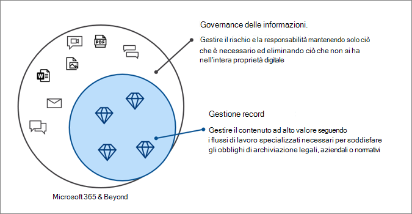

# Governance delle informazioni Microsoft in Microsoft 365

>*[Indicazioni per l'assegnazione di licenze di Microsoft 365 per sicurezza e conformità](https://aka.ms/ComplianceSD).*

Usare le funzionalità di Governance delle informazioni Microsoft, a volte abbreviato in MIG, per gestire i dati in base ai requisiti di conformità o normativi.

Si vuole proteggere i propri dati? Vedere [Microsoft Information Protection in Microsoft 365](information-protection.md).

## Governance delle informazioni

Per conservare ciò di cui si ha bisogno ed eliminare ciò che non serve:
 
|Funzionalità|Che problemi risolve?|Per iniziare|
|:------|:------------|:--------------------|:-----------------------------|
|[Criteri di conservazione ed etichette di conservazione](retention.md)| Conservare o eliminare i contenuti con la gestione dei criteri e un flusso di lavoro di eliminazione per messaggi di posta elettronica, documenti, messaggi istantanei e altro ancora   Scenario di esempio: [Applicare automaticamente un'etichetta di conservazione al contenuto](apply-retention-labels-automatically.md) | [Informazioni sui criteri e sulle etichette di conservazione](get-started-with-retention.md)|
|[Servizio di importazione](importing-pst-files-to-office-365.md)| Importare file PST in blocco nelle cassette postali di Exchange Online per conservare e cercare i messaggi di posta elettronica per i requisiti di conformità o normativi | [Usare il caricamento in rete per importare file PST dell'organizzazione in Microsoft 365](use-network-upload-to-import-pst-files.md)|
|[Archiviare i dati di terze parti](archiving-third-party-data.md)| Importare, archiviare e applicare soluzioni di conformità a dati di terze parti da piattaforme di social media, di messaggistica istantanea e di collaborazione per documenti| [Connettori di terze parti](archiving-third-party-data.md#third-party-data-connectors)|
|[Cassette postali inattive](inactive-mailboxes-in-office-365.md)| Conservare il contenuto delle cassette postali dopo che i dipendenti lasciano l'organizzazione | [Creare e gestire le cassette postali inattive](create-and-manage-inactive-mailboxes.md)|

## Gestione dei record

Per gestire contenuti di valore elevato per obblighi legali, aziendali o normativi:

|Funzionalità|Che problemi risolve?|Per iniziare|
|:------|:------------|---------------------|:----------------------------|
|[Gestione record](records-management.md)| Un'unica soluzione per la posta elettronica e i documenti che incorpora pianificazione e requisiti di conservazione in un piano di archiviazione che supporta l'intero ciclo di vita del contenuto con dichiarazioni, conservazione ed eliminazione dei record   Scenario di esempio: [Eliminazione dei record](disposition.md#disposition-of-records)|[Introduzione alla gestione dei record](get-started-with-records-management.md) |

