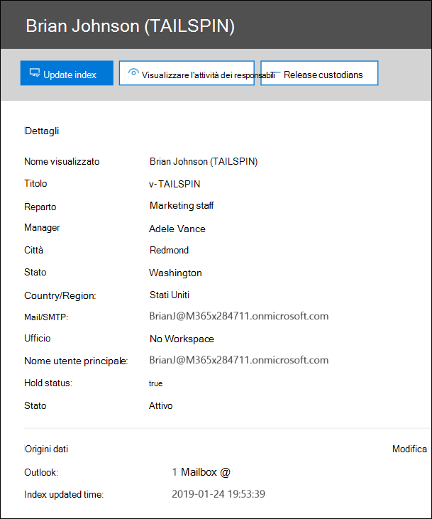
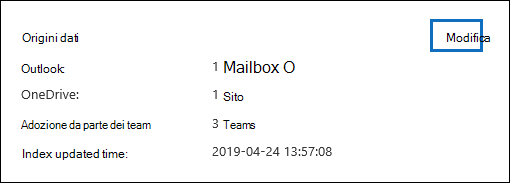
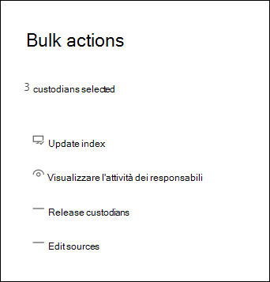

# Gestire i responsabile in un caso di Advanced eDiscovery

La pagina Responsabile nella scheda **Origini** di un caso di Advanced eDiscovery contiene un elenco di tutti i responsabile che sono stati aggiunti al caso. Dopo aver aggiunto i responsabile a un caso, i dettagli relativi a ogni responsabile vengono raccolti automaticamente da Azure Active Directory e sono visualizzabili in Advanced eDiscovery.

## Visualizzare i dettagli del responsabile

Per visualizzare i dettagli relativi a un responsabile, fare clic sul responsabile nell'elenco nella **scheda Responsabile.** Viene visualizzata una pagina a comparsa contenente le informazioni seguenti sul responsabile:

- Informazioni di contatto

  - **Nome visualizzato** - Nome visualizzato nella rubrica del responsabile. Si tratta in genere della combinazione del nome del responsabile, del secondo nome e del cognome.
  
   - **Mail/SMTP** - Indirizzo SMTP primario per il responsabile, ad esempio, brianj@contoso.onmicrosoft.com. Viene elencato anche il nome dell'entità utente (UPN) del responsabile.

  - **Titolo** - Posizione del responsabile.

  - **Reparto** - Nome del reparto in cui lavora il responsabile.

  - **Manager:** il responsabile del responsabile. Il responsabile designato riceverà tutte le comunicazioni di escalation per questo responsabile.
  
- Informazioni sulle posizioni

  - **Città** - Città in cui si trova il responsabile.

  - **Stato** - Stato o provincia nell'indirizzo del responsabile.

  - **Paese-** Paese/area geografica in cui si trova il responsabile.

  - **Office** - Sede dell'ufficio nel luogo di lavoro del responsabile.

- Informazioni sul caso

  - **Stato blocco** - Indica se il responsabile è stato messo in attesa. 

  - **Stato comunicazione:** indica se al responsabile è stato emesso un avviso di blocco. Se al responsabile è stato emesso un avviso, il valore di questa proprietà è **Published.** Se al responsabile non è stato emesso un avviso, lo stato **è Non pubblicato.** 

  - **Status:** lo stato del responsabile all'interno del caso. Lo stato **Attivo** indica che il responsabile fa parte del caso. Se un responsabile viene rilasciato da un caso, lo stato viene modificato in **Rilasciato.** 

- Origini dati e informazioni di indicizzazione

    - **Origini dati:** mostra il conteggio e il tipo di origini dati (cassette postali, siti e Teams) associate al responsabile e che fanno parte del caso.

    - **Ora aggiornamento indice** - Indica l'ora e la data dell'ultimo processo di indicizzazione avanzato attivato. Questa proprietà indicherà anche quando è in corso il processo di indicizzazione avanzato.

## Modificare un responsabile

Con l'avanzamento del tuo caso, potresti scoprire che potrebbero esserci origini dati aggiuntive rilevanti per un responsabile specifico & tuo caso. In altri scenari, è possibile rimuovere determinate origini dati che sono state esaminate e considerate non rilevanti.

Per aggiornare le origini dati associate a un responsabile:

1. Accedere a  **eDiscovery > Advanced eDiscovery** e aprire il caso.
  
2. Fare clic **sulla scheda** Origini.
  
3. Nella pagina **Custodians** seleziona un responsabile nell'elenco e fai clic **su Edit** nella pagina a comparsa.

    
  
4. Fare **clic sulla scheda Scegli origini** dati per modificare le impostazioni per la cassetta postale di Exchange e l'account onedrive del responsabile, fare clic su Scegli origini **dati.**
  
5. Fare clic **sulla scheda Seleziona origini** dati aggiuntive per aggiungere o rimuovere le cassette postali di Teams, SharePoint o Exchange associate al responsabile. 

    Per ulteriori informazioni sulle origini dati associate a un responsabile, vedere [Aggiungere i responsabile a un caso.](add-custodians-to-case.md) 
  
6. Fare **clic su Place custodial holds** per abilitare o disabilitare il blocco per il responsabile.

## Re-index custodian data

Nella maggior parte dei flussi di lavoro di eDiscovery per indagini legali, un sottoinsieme dei dati di un responsabile viene cercato dopo che il responsabile viene aggiunto a un caso legale. A causa di file di dimensioni molto grandi o di possibili danneggiamenti dei dati, alcuni elementi nelle origini dati associate a un responsabile possono essere parzialmente indicizzati. Utilizzando la [funzionalità di indicizzazione](indexing-custodian-data.md) avanzata in Advanced eDiscovery, la maggior parte degli elementi indicizzati parzialmente può essere automaticamente corretti tramite la nuova indicizzazione di questi elementi su richiesta.

Quando un responsabile viene aggiunto a un caso, i dati che si trovano nelle origini dati associate al responsabile vengono automaticamente indicizzati (tramite il processo di indicizzazione avanzato). Ciò significa che puoi lasciare i dati sul posto invece di doverli scaricare e correggere e quindi cercarli offline. Tuttavia, durante il ciclo di vita di un caso legale nuove origini dati potrebbero essere associate a un responsabile. In questo caso, è possibile indicizzare nuovamente i dati del responsabile rieseguono il processo di indicizzazione avanzata per correggere eventuali elementi parzialmente indicizzati e aggiornare l'indice per i dati del responsabile.

Per attivare il processo di re-indicizzazione per risolvere gli elementi parzialmente indicizzati:

1. Accedere a  **eDiscovery > Advanced eDiscovery** e aprire il caso.

2. Fare clic **sulla scheda** Origini.

3. Nella pagina **Responsabile selezionare un** responsabile i cui dati devono essere reindicizzati.

4. Nella pagina a comparsa fare clic su **Aggiorna indice.**

   Verrà visualizzata una finestra di dialogo che conferma la creazione del processo di indicizzazione.

La re-indicizzazione dei dati dei depositario è un processo di lunga durata; il processo corrispondente creato è denominato **Re-indexing custodian data.** È possibile tenere traccia  dello stato nella scheda Processi o nella scheda **Responsabile** monitorando lo stato nella colonna **Stato processo di** indicizzazione.

Per altre informazioni, vedere:

- [Gestire gli errori di elaborazione](processing-data-for-case.md)

- [Gestire processi](managing-jobs-ediscovery20.md)

## Rilasciare un responsabile da un caso

Un responsabile viene rilasciato in situazioni in cui un caso è chiuso, il responsabile non è più obbligato a conservare il contenuto di un caso o quando il responsabile viene considerato non più rilevante per il caso. 

Se si rilascia un responsabile dopo la pubblicazione di un avviso di blocco, al responsabile verrà inviato un avviso di rilascio. Vengono inoltre rimosse le eventuali esenzioni alle origini dati associate al responsabile. Se al responsabile è stata inviata un'esenzione invisibile all'utente, in cui non sono state emesse notifiche di blocco a seguito di un'esenzione legale, non verrà inviata alcuna notifica di rilascio, ma le eventuali esenzioni per le origini dati associate a tale responsabile verranno rimosse.

Per rilasciare un responsabile: 

1. Accedere a  **eDiscovery > Advanced eDiscovery** e aprire il caso.

2. Fare clic **sulla scheda** Origini.

3. Nella pagina **Custodians** selezionare il responsabile che verrà rilasciato dal caso.

4. Nella pagina a comparsa fare clic su **Rilascia responsabile.**

   Viene visualizzata una pagina di avviso in cui viene spiegato che se viene applicata un'esenzione a un'origine dati associata al responsabile, l'esenzione verrà rimossa e che qualsiasi altro blocco associato a un altro caso di Advanced eDiscovery verrà comunque applicato. Ciò include altri tipi di funzionalità di conservazione e conservazione (ad esempio un criterio di conservazione di Microsoft 365).

5. Fare **clic** su Sì per confermare che si desidera rilasciare il responsabile. 

    Lo stato di questo utente nella scheda **Custodians** è impostato su **Rilasciato** e lo stato di blocco nella pagina a comparsa è impostato su  **False.** 

> [!NOTE]
> Un responsabile potrebbe essere coinvolto contemporaneamente in diversi casi legali. Quando un responsabile viene rilasciato da un caso, i blocchi e le notifiche per altre questioni non saranno influenzati.

## Modifica in blocco dei responsabile

Puoi usare l'editor di massa per modificare più responsabile contemporaneamente. A tale scopo, è sufficiente selezionare due o più responsabile nella scheda **Custodians** per visualizzare l'editor in blocco e quindi fare clic su una delle attività.

