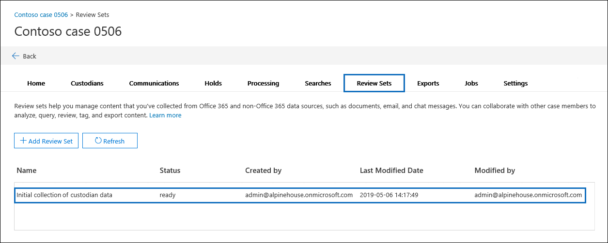

# Gestire i set di recensioni in Advanced eDiscoveryManage review sets in Advanced eDiscovery

I set di revisioni sono un set statico di documenti in cui è possibile analizzare, eseguire query, visualizzare, contrassegnare ed esportare i dati in un caso.Review sets are a static set of documents where you can analyze, query, view, tag, and export data in a case. Per ulteriori informazioni sull'esecuzione di queste attività, vedere:For more information about performing these tasks, see:

- [Analizzare i dati in un insieme da rivedereAnalyze data in a review set](analyzing-data-in-review-set.md)

- [Eseguire query sui dati in un insieme da rivedereQuery the data in a review set](review-set-search.md)

- [Visualizzare i documenti in un insieme da rivedereView documents in a review set](view-documents-in-review-set.md)

- [Contrassegnare i documenti in un insieme da rivedereTag documents in a review set](tagging-documents.md)

- [Esportare i dati del casoExport case data](exporting-data-ediscover20.md)

## Creare un set di recensioniCreate a review set

I set di recensioni possono essere creati nella **scheda Review sets facendo** clic su + Add review **set.**Review sets can be created on the **Review sets** tab by clicking **+ Add review set**.

Nella pagina Aggiungi riquadro a comparsa **dell'insieme** di recensioni digitare un nome per il set di recensioni e quindi fare clic su **Salva.**On the **Add review set** flyout page, type a name for the review set and then click **Save**. Il nuovo insieme di recensioni viene visualizzato nell'elenco della **scheda Insiemi di** revisioni.The new review set is displayed in the list on the **Review sets** tab.

Esistono tre modi diversi per aggiungere dati a un insieme da rivedere in un caso di Advanced eDiscovery.There are three different ways to add data to a review set in an Advanced eDiscovery case.

1. [Aggiungere i risultati della ricerca a un insieme da rivedereAdd search results to a review set](add-data-to-review-set.md)

2. [Caricare dati non Di Microsoft 365 in un insieme da rivedereLoad non-Microsoft 365 data into a review set](load-non-Office-365-data-into-a-review-set.md)

3. [Aggiungere dati a un set di recensioni da un altro set di recensioniAdd data to a review set from another review set](add-data-to-review-set-from-another-review-set.md)
