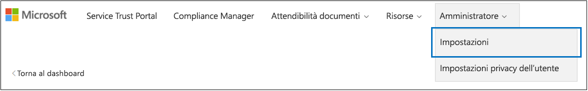
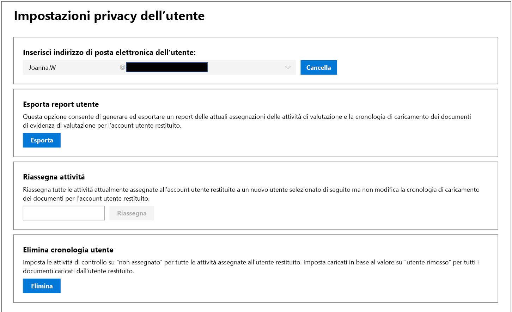

# Microsoft Compliance Manager (classico)

> [!NOTE]
> Questa documentazione descrive una versione precedente del prodotto. È *vivamente sconsigliato l'uso di questa versione di Compliance Manager*. **Se si usa la versione di anteprima corrente di Compliance Manager, consultare la [documentazione di Compliance Manager (anteprima)](working-with-compliance-manager.md).**

 *Compliance Manager non è disponibile in Office 365 gestito da 21Vianet, Office 365 Germany, Office 365 U.S. Government Community High (GCC High) o Office 365 Dipartimento della Difesa.*
  
Compliance Manager è uno strumento di valutazione dei rischi basato sul flusso di lavoro in Microsoft [Service Trust Portal](https://docs.microsoft.com/microsoft-365/compliance/get-started-with-service-trust-portal), che consente di tenere traccia, assegnare e verificare le attività di conformità dell'organizzazione correlate a Microsoft Professional Services e a servizi cloud Microsoft, come Microsoft Office 365, Microsoft Dynamics 365 e Microsoft Azure. 

Compliance Manager:
  
- Combina le informazioni dettagliate fornite da Microsoft ai revisori e ai regolatori come parte di vari audit di terze parti dei servizi cloud Microsoft in relazione a vari standard (ad esempio, ISO 27001, ISO 27018 e NIST) e le informazioni che Microsoft elabora internamente per la conformità alle normative (come HIPAA e il Regolamento generale sulla protezione dei dati dell'UE o GDPR) con la propria autovalutazione della conformità dell'organizzazione a questi standard e normative.
    
- Consente di assegnare, monitorare e registrare le attività correlate alla valutazione, che consentono all'organizzazione di superare gli ostacoli riscontrati dai team e di raggiungere gli obiettivi di conformità.
    
- Fornisce un punteggio di conformità che consente di monitorare i progressi e dare la priorità ai controlli che aiuteranno a ridurre l'esposizione al rischio dell'organizzazione.
    
- Fornisce un archivio sicuro per poter caricare e gestire le evidenze e altri elementi correlati per le attività di conformità.
    
- Produce report dettagliati in Microsoft Excel che documentano le attività di conformità eseguite da Microsoft e dall'organizzazione, da fornire ai revisori, alle autorità di regolamentazione e ad altre parti interessate della conformità.

Per una breve demo di Compliance Manager, guardare questo video su [Compliance Manager](https://www.youtube.com/watch?v=r1vs8NdSXKQ).

    
> [!IMPORTANT]
> Compliance Manager is a dashboard that provides a summary of your data protection and compliance stature and recommendations to improve data protection and compliance. The Customer Actions provided in Compliance Manager are recommendations; it is up to each organization to evaluate the effectiveness of these recommendations in their respective regulatory environment prior to implementation. Recommendations found in Compliance Manager should not be interpreted as a guarantee of compliance.

    
## Che cos'è il Compliance Manager?

Compliance Manager is a workflow-based risk assessment tool designed to help you manage regulatory compliance within the shared responsibility model of the cloud. Compliance Manager provides you with a dashboard view of standards and regulations and assessments that contain Microsoft's control implementation details and test results and customer control implementation guidance and tracking for your organization to enter. Compliance Manager provides certification assessment control definitions, guidance on implementation and testing of controls, risk-weighted scoring of controls, role-based access management, and an in-place control action assignment workflow to track control implementation, testing status and evidence management. Compliance Manager optimizes compliance workload by enabling customers to logically group assessments together and apply assessment control testing to identical or related controls, reducing the duplication of effort that might otherwise be required to satisfy identical control requirements across different certifications.

## Valutazioni in Compliance Manager

The core component of Compliance Manager is called an *Assessment*. An Assessment is an assessment of a Microsoft service against a certification standard or data protection regulation (such as ISO 27001:2013, and the GDPR). Assessments help you to discern your organization's data protection and compliance posture against the selected industry standard for the selected Microsoft cloud service. Assessments are completed by the implementation of the controls that map to the certification standard being assessed. 
  
La struttura di una valutazione si basa sulla responsabilità condivisa tra Microsoft e l'organizzazione per valutare i rischi relativi alla sicurezza e alla conformità nel cloud e per implementare le misure di protezione dei dati specificate da uno standard di conformità, uno standard di protezione dei dati, una normativa o una legge.
  
Una valutazione è costituita da diversi componenti:
  
- **Servizi in ambito**: ogni valutazione si applica a un set di servizi Microsoft, elencati nella sezione relativa ai servizi cloud in ambito. 
    
- **Microsoft-Managed Controls** - For each cloud service, Microsoft implements and manages a set of  *controls*  as part of Microsoft's compliance with various standards and regulations. These controls are organized into  *control families*  that align with the structure from the corresponding certification or regulation that the Assessment is aligned to. For each Microsoft-managed control, Compliance Manager provides details about how Microsoft implemented the control, along with how and when that implementation was tested and validated by an independent third-party auditor. 
    
    Di seguito viene riportato un esempio di tre controlli gestiti da Microsoft nella famiglia **Protezione** da una valutazione di Office 365 e del GDPR. 

    
  
  a. Specifies the following information from the certification or regulation that maps to the Microsoft-managed control.

  - **ID di controllo**: il numero della sezione o dell'articolo della certificazione o delle normative associati al controllo.
    
  - **Titolo**: il titolo della certificazione o della normativa corrispondenti.
    
  - **ID dell'articolo**: questo campo è incluso solo per le valutazioni GDPR, poiché specifica il numero dell'articolo GDPR corrispondente.
    
  - **Descrizione**: il testo dello standard o della normativa associati al controllo gestito da Microsoft selezionato.

  b. The Compliance Score for the control, which indicates the level of risk (due to non-compliance or control failure) associated with each Microsoft-managed control. See [Understanding the Compliance Score](#understanding-the-compliance-score) for more information. Note that Compliance Scores are rated from 1 to 10 and are color-coded. Yellow indicates low risk controls, orange indicates medium-risk controls, and red indicated high-risk controls. 
    
  c. Information about the implementation status of a control, the date the control was tested, who performed the test, and the test result.
    
  d. For each control, you can click **More** to see additional information, including details about Microsoft's implementation of the control and details about how the control was tested and validated by an independent third-party auditor. 
    
- **Customer-Managed Controls** - This is the collection of controls that are managed by your organization. Your organization is responsible for implementing these controls as part of your compliance process for a given standard or regulation. Customer-managed controls are also organized into control families for the corresponding certification or regulation. Use the customer-managed controls to implement the recommended actions suggested by Microsoft as part of your compliance activities. Your organization can use the prescriptive guidance and recommended Customer Actions in each customer-managed control to manage the implementation and assessment process for that control.
    
    Customer-managed controls in Assessments also have built-in workflow management functionality that you can use to manage and track your organization's progress towards completing the Assessment. For example, a Compliance Officer in your organization can assign an Action Item to an IT admin who has the responsibility and necessary permissions to perform the actions that are recommended for the control. When that work is complete, the IT admin can upload evidence of their implementation tasks (for example, screenshots of configuration or policy settings) and then assign the Action Item back to the Compliance Officer to evaluate the collected evidence, test the implementation of the control, and record the implementation date and test results in Compliance Manager. For more information, see the [Managing the assessment process](#managing-the-assessment-process) section in the article. 
  
## Autorizzazioni e controllo dell'accesso basato sui ruoli

Compliance Manager usa un modello di autorizzazione di controllo dell'accesso basato sui ruoli. Solo agli utenti a cui è stato assegnato il ruolo utente è consentito di accedere a Compliance Manager e le azioni consentite da ogni utente sono limitate in base al tipo di ruolo.
  
Si noti che non esiste più un ruolo predefinito **Accesso guest**. A ogni utente deve essere assegnato un ruolo per poter accedere e lavorare in Compliance Manager.
  
The following table describes each Compliance Manager permission and what it allows the user do. The table also indicates the role that each permission is assigned to.
  
||**Compliance Manager - Lettore**|**Compliance Manager - Collaboratore**|**Compliance Manager - Valutatore**|**Compliance Manager - Amministratore**|**Amministratore del portale**|
|:-----|:-----|:-----|:-----|:-----|:-----|
|**Lettura dati**: gli utenti possono leggere i dati, ma non modificarli.    |             |             |             |             |            |
|**Modifica dati**: gli utenti possono modificare tutti i campi, tranne i campi Risultato del test e Data del test.    ||            |             |             |             |
|**Modifica risultati del test**: gli utenti possono modificare i campi Risultato del test e Data del test.    ||  |             |             |             |
|**Gestione valutazioni**: gli utenti possono creare, archiviare ed eliminare le valutazioni.    |||  |             |             |
|**Manage users** - Users can add other users in their organization to the Reader, Contributor, Assessor, and Administrator roles. Only those users with the Global Administrator role in your organization can add or remove users from the Portal Admin role.    ||||  |             |
   
## Comprendere il punteggio di conformità

Nella dashboard, Compliance Manager visualizza un punteggio totale per la valutazione di Office 365 nell'angolo in alto a destra del riquadro. Si tratta del punteggio di conformità totale per la valutazione ed equivale alla somma dei punti ricevuti per la valutazione di ogni controllo contrassegnato come implementato e testato nella valutazione. Quando si aggiunge una valutazione, si vedrà che il Punteggio di conformità è già in fase di completamento, perché i punti per i controlli gestiti da Microsoft che sono stati implementati da Microsoft e testati da terzi indipendenti sono già stati applicati.
  

  
I punti rimanenti derivano dalla valutazione del controllo del cliente e dall'implementazione e dalla verifica dei controlli gestiti dal cliente, ciascuno con un valore specifico che contribuisce al punteggio complessivo di conformità. 
  
Ogni valutazione mostra un punteggio di conformità basato sul rischio che agevola la valutazione del livello di rischio (per mancata conformità o insuccesso di un controllo) associato a ogni controllo (inclusi sia i controlli gestiti da Microsoft che i controlli gestiti dal cliente) in una valutazione. A ogni controllo gestito dal cliente viene assegnato un numero di punti (denominato *classificazione di gravità) su una scala da 1 a 10, in cui vengono assegnati più punti per i controlli associati a un fattore di rischio maggiore in caso di insuccesso del controllo e meno punti per i controlli a basso rischio. 
  
Ad esempio, il controllo di valutazione per User Access Management mostrato in basso è classificato con un fattore di rischio molto alto, quindi il punteggio assegnato è 10.
  

  
 Per fare un confronto, il controllo di valutazione per User Access Management mostrato in basso è classificato con un fattore di rischio inferiore, quindi il punteggio assegnato è 3. 
  

  
The Compliance Manager assigns a default severity ranking to each control. Risk rankings are calculated based on the following criteria:
  
- Se un controllo impedisce il verificarsi di incidenti (classificazione più alta), rileva gli incidenti accaduti o corregge l'impatto di un incidente (classificazione più bassa). In termini di classificazione di gravità, a un controllo obbligatorio che impedisce una minaccia viene assegnato il numero massimo di punti, mentre ai controlli rilevatori o correttivi (indipendentemente dal fatto che siano obbligatori o discrezionali) viene assegnato il numero minimo di punti.
    
- Se un controllo (dopo che è stato implementato) è obbligatorio e quindi non può essere bypassato dagli utenti (ad esempio, gli utenti devono reimpostare la propria password e soddisfare i requisiti di lunghezza e caratteri della password) o a discrezione dell'utente e può essere bypassato dagli utenti (ad esempio, in caso di regole aziendali che richiedono agli utenti di bloccare i propri schermi quando si allontanano dalla propria postazione).
    
- Controls related to risks to data confidentiality, integrity, and availability, whether these risks come from internal or external threats, and whether the threat is malicious or accidental. For example, controls that would help prevent an external attacker from breaching that network and gaining access to personally identifiable information would be assigned more points than a control related to preventing an employee from accidentally mis-configuring a network router setting that results in a network outage).
    
- Rischi connessi a driver legali e esterni, come contratti, regolamenti e impegni pubblici, per ciascun controllo.
    
The displayed Compliance Score values for the control are applied  *in their entirety*  to the Total Compliance Score on a pass/fail basis--either the control is implemented and passes the subsequent assessment test or it does not; there is no partial credit for a partial implementation. Only when the control has its **Implementation Status** set to **Implemented** or **Alternative Implementation** and the **Test Result** is set to **Passed** are the assigned points added to the Total Compliance Score. 
  
E soprattutto, il punteggio di conformità consente di stabilire priorità in merito ai controlli su cui concentrarsi per l'implementazione indicando quali controlli hanno un rischio potenziale più alto in caso di insuccesso. Oltre alla definizione delle priorità basata sui rischi, quando i controlli della valutazione sono correlati ad altri controlli (all'interno della stessa valutazione o in un'altra valutazione nello stesso gruppo), il corretto completamento di un singolo controllo può snellire significativamente la procedura grazie alla sincronizzazione dei risultati dei test di controllo.
  
Nell'immagine seguente, ad esempio, si può notare che Office 365 - valutazione GDPR è valutato al 46% con 51 valutazioni di controllo su 111 completate, per un punteggio di conformità totale di 289 su 600 possibili.
  

  
Nella valutazione, il controllo GDPR 7.5.5 è correlato a 5 altri controlli (7.4.1, 7.4.3, 7.4.4, 7.4.8,.7.4.9), ognuno con un punteggio di 6 o 8 per la classificazione di gravità del rischio da moderata a molto elevata. Usando il filtro delle valutazioni sono stati selezionati e resi visibili tutti questi controlli nella visualizzazione di valutazione e, come si può vedere di seguito, nessuno di essi è stato valutato. 
  
 As those 6 controls are related, the completion of any one them will result in a synchronization of those test results across the related controls within this assessment (just as it will for any related controls in an assessment that is in the same assessment grouping). Upon completion of the implementation and testing of GDPR control 7.5.5, the control detail area refreshes to show that all 6 controls have been assessed, with a corresponding increase in the number of assessed controls to 57 and 51% assessed, and a change in total Compliance Score of +40. 
  

  
Questa finestra di dialogo di aggiornamento di conferma verrà visualizzata se si sta per modificare lo stato di implementazione di un controllo correlato con impatto sugli altri controlli correlati.
  

  
> [!NOTE]
> Currently, only Assessments for Office 365 cloud services include a Compliance Score. Assessments for Azure and Dynamics show an assessment status. 

## Metodologia del punteggio di conformità

Il punteggio di conformità, come Microsoft Secure Score, è simile ad altri sistemi di punteggio basati sul comportamento; l'attività dell'organizzazione può aumentare il punteggio di conformità svolgendo attività correlate alla protezione dei dati, alla privacy e alla sicurezza.
  
> [!NOTE]
> The Compliance Score does not express an absolute measure of organizational compliance with any particular standard or regulation. It expresses the extent to which you have adopted controls which can reduce the risks to personal data and individual privacy. No service can guarantee that you are compliant with a standard or regulation, and the Compliance Score should not be interpreted as a guarantee in any way. 
  
Assessments in Compliance Manager are based on the shared responsibility model for cloud computing. In the shared responsibility model, Microsoft and each customer share responsibility for the protection of the customer's data when that data is stored in our cloud.
  
Come illustrato nella valutazione GDPR di Office 365 seguente, Microsoft e i clienti sono responsabili dell'esecuzione di una serie di azioni ideate per soddisfare i requisiti dello standard o della normativa in fase di valutazione. Per razionalizzare e comprendere le esigenze. Le azioni in un'ampia gamma di standard e normative, Compliance Manager considera tutte le normative e gli standard come se fossero framework di controllo. Quindi, le azioni eseguite da Microsoft e dai clienti per ogni valutazione includono l'implementazione e la convalida di vari controlli.
  

  
Di seguito viene indicato il flusso di lavoro di base per un'azione tipica:
  
1. The Compliance, Risk, Privacy, and/or Data Protection Officer of an organization assigns the task to someone in the organization to implement a control. That person could be:

    - Il proprietario di un criterio di business
    
    - Un implementatore IT
    
    - Un'altra persona dell'organizzazione responsabile dell'esecuzione dell'attività
    
2. That individual performs the tasks necessary to implement the control, uploads evidence of implementation into Compliance Manager, and marks the control(s) tied to the Action as implemented. Once these tasks are completed, they assign the Action to an Assessor for validation. Assessors can be:
    
    - Valutatori interni che eseguono la convalida dei controlli all'interno di un'organizzazione
    
    - Valutatori esterni che esaminano, verificano e certificano la conformità, come le organizzazioni di terze parti indipendenti che controllano i servizi cloud di Microsoft
    
3. Il valutatore convalida il controllo, esamina le evidenze e contrassegna il controllo/i controlli come valutati e i risultati della valutazione (ad esempio, se il controllo è stato superato).
    
Quando tutti i controlli associati a una valutazione sono stati valutati, la valutazione è completata.
  
Every Assessment in Compliance Manager comes pre-loaded with information that provides details about the Actions taken by Microsoft to satisfy the requirements of the controls for which Microsoft is responsible. This information includes details about how Microsoft has implemented each control and how and when Microsoft's implementation was assessed and verified by a third-party auditor. For this reason, the Microsoft Managed Controls for each Assessment are marked as Assessed, and the Compliance Score for the Assessment reflects this.
  
Each Assessment includes a total Compliance Score based on the shared responsibility model. Microsoft's implementation and testing of controls for Office 365 contributes a portion of the total possible points associated with a GDPR assessment. As the customer implements and tests each of the customer Actions, the Compliance Score for the Assessment will increase by the value assigned to the control. 
  
 ### Metodologia del punteggio basata sul rischio
  
Compliance Manager uses a risk-based scoring methodology with a scale from 1-10 that assigns a higher value to controls that represent a higher risk in the event the control fails or is non-compliant. The scoring system used by Compliance Score is based on several key factors, such as:
  
- Essenza del controllo
    
- Il livello di rischio del controllo in base al tipo di minacce
    
- I driver esterni per il controllo
    

  
 ### Essenza del controllo
  
L'essenza del controllo dipende dalla natura del controllo: obbligatorio o a discrezione dell'utente e preventivo, investigativo o correttivo.
  
 ### Obbligatorio o a discrezione dell'utente
  
 *Mandatory controls*  are controls that cannot be bypassed either intentionally or accidentally. An example of a common mandatory control is a centrally-managed password policy that sets requirements for password length, complexity, and expiration. Users must comply with these requirements in order to access the system. 
  
 *Discretionary controls*  rely upon users to understand policy and act accordingly. For example, a policy requiring users to lock their computer when they leave it is a discretionary control because it relies on the user. 
  
 ### Preventivo, investigativo o correttivo
  
 *Preventative controls*  are those that prevent specific risks. For example, protecting information at rest using encryption is a preventative control against attacks, breaches, etc. Separation of duties is a preventative control to manage conflict of interest and to guard against fraud. 
  
 *Detective controls*  are those that actively monitor systems to identify irregular conditions or behaviors that represent risk or that can be used to detect intrusions or determine if a breach has occurred. System access auditing and privileged administrative actions auditing are types of detective monitoring controls; regulatory compliance audits are a type of detective control used to find process issues. 
  
 *Corrective controls*  are those that try to keep the adverse effects of a security incident to a minimum, take corrective action to reduce the immediate effect, and reverse the damage, if possible. Privacy incident response is a corrective control to limit damage and restore systems to an operational state after a breach. 
  
Valutando ciascun controllo utilizzando questi fattori, viene determinata l'essenza del controllo e viene assegnato un valore relativo al rischio che rappresenta.
  
 **Minaccia**
  
| | | |
|:-----|:-----|:-----|
||**Obbligatorio**   |**A discrezione dell'utente**   |
|**Preventivo**   |Rischio elevato    |Rischio medio    |
|**Investigativo**   |Rischio medio    |Basso rischio    |
|**Correttivo**   |Rischio medio    |Basso rischio    |
   
La minaccia si riferisce a tutto ciò che rappresenta un rischio per lo standard di sicurezza fondamentale, universalmente accettato, noto come CIA (Confidentiality, Integrity e Availability) o triade della sicurezza dei dati: riservatezza, integrità e disponibilità:
  
- Riservatezza significa che le informazioni possono essere lette e comprese solo da parti attendibili e autorizzate.
    
- Integrità significa che le informazioni non sono state modificate o eliminate da parti non autorizzate.
    
- Disponibilità significa che le informazioni sono facilmente accessibili con un elevato livello di qualità del servizio.
    
A failure of any of these characteristics is considered a compromise of the system as a whole. Threats can come from both internal and external sources, and an actor's intent can be accidental or malicious. These factors are estimated in a threat matrix that assigns threat levels of either High, Moderate, or Low to each combination of scenarios.

| |**Interno** | |**Esterno** | | | |
|:-----|:-----|:-----|:-----|:-----|:-----|:-----|
||*Dannoso* |*Accidentale* |*Dannoso* |*Accidentale* |||
|**Riservatezza** |(H, M o L)    |(H, M o L)    |(H, M o L)    |(H, M o L)|
|**Integrità** |(H, M o L)    |(H, M o L)    |(H, M o L)    |(H, M o L)|
|**Disponibilità** |(H, M o L)    |(H, M o L)    |(H, M o L)    |(H, M o L)|
   
 **Driver esterni**
  
|**Contratti**|**Normative**|**Impegni pubblici**|
|:-----|:-----|:-----|
|(H, M o L)    |(H, M o L)    |(H, M o L)    |
   
Fattori esterni come regolamenti, contratti e impegni pubblici applicabili possono influenzare i controlli ideati per proteggere e prevenire la violazione dei dati e a ciascuno di questi fattori sono assegnati valori di rischio alto, moderato o basso.
  
Il numero stimato di occorrenze di questi valori di rischio alto, moderato o basso nei 15 possibili scenari di rischio rappresentati in CIA/minaccia e driver esterni/legali sono combinati per fornire una ponderazione del rischio, che considera la probabilità e il numero di occorrenze del rischio ad un dato valore significativa e viene preso in considerazione quando si calcola il livello di gravità del controllo.
  
In base al livello di gravità del controllo, a quest'ultimo viene assegnato il valore del punteggio di conformità, un numero compreso tra 1 (basso) e 10 (alto), raggruppato nelle seguenti categorie di rischio:
  
|**Livello di rischio**|**Valore del controllo**|
|:-----|:-----|
|Basso    |1-3    |
|Moderato    |6    |
|Alto    |8    |
|Grave    |10    |
   
Assegnando delle priorità ai controlli di valutazione con i valori più elevati del punteggio di conformità, l'organizzazione si concentra sugli elementi di rischio più elevato e riceve un feedback positivo proporzionalmente più elevato sotto forma di più punti aggiunti al punteggio totale di conformità per la valutazione di ciascuna valutazione di controllo completata.
  
### Riepilogo sulla metodologia di assegnazione del punteggio
  
The Compliance Score is a core component of the way that Compliance Manager helps organizations understand and manage their compliance. The Compliance Score for an assessment is an expression of the company's compliance with a given standard or regulation as a number, where the higher the score (up to the maximum number of points allocated for the Assessment), the better the company's compliance posture. Understanding the compliance scoring methodology in which assessment controls are assigned risk severity values between 1- 10 (low to high), and how completed control assessments add to the total compliance score is crucial to organizations for prioritizing their actions.

## Raggruppamento delle valutazioni

Quando si crea una nuova valutazione, viene chiesto di creare un gruppo a cui assegnare la valutazione oppure di assegnare la valutazione a un gruppo esistente. I gruppi consentono di organizzare le valutazioni in modo logico e condividere le informazioni e le attività del flusso di lavoro comuni tra le valutazioni che hanno controlli gestiti dal cliente uguali o correlati.
  
For example, you could group Assessments by year or teams, departments, or agencies within your organization or group them by year. Here are some examples of groups and the Assessments they might contain.
  
- Valutazioni GDPR - 2018
    
  - Office 365 ed EMS
    
  - Azure e GDPR
    
  - Dynamics e GDPR
    
- Valutazioni Azure - 2018
    
  - Azure e GDPR
    
  - Azure e ISO 27001:2013
    
  - Azure e ISO 27018:2014
    
- Sicurezza dei dati e valutazione della privacy
    
  - Office 365 e ISO 27001:2013
    
  - Office 365 e ISO 27018:2014
    
  - Azure e ISO 27001:2013
    
  - Azure e ISO 27018:2014
    
> [!TIP]
> È consigliabile determinare una strategia di raggruppamento per l'organizzazione prima di aggiungere nuove valutazioni. 
  
Questi sono i requisiti per il raggruppamento delle valutazioni:
  
- I nomi dei gruppi (noti anche come ID gruppo) devono essere univoci all'interno dell'organizzazione. 
    
- Groups can contain Assessments for the same certification/regulation, but each group can only contain one Assessment for a specific cloud service/certification pair. For example, a group can't contain two Assessments for Office 365 and GDPR. Similarly, a group can contain multiple Assessments for the same cloud service as long as the corresponding certification/regulation for each one is different.
    
Dopo l'aggiunta di una valutazione a un gruppo di valutazioni, il gruppo non può essere modificato. È possibile rinominare il gruppo di valutazioni, modificando così il nome del gruppo per tutte le valutazioni associate al gruppo. È possibile creare una valutazione e un nuovo gruppo di valutazioni, quindi copiare le informazioni da una valutazione esistente, creando così un duplicato della valutazione in un gruppo di valutazione diverso in modo facile e veloce. L'archiviazione di una valutazione interrompe la relazione tra la valutazione e il gruppo di valutazione. Qualsiasi ulteriore aggiornamento ad altre valutazioni correlate non viene più riflesso nella valutazione archiviata.
  
Come indicato in precedenza, un vantaggio importante dell'uso dei gruppi è che, quando due diverse valutazioni nello stesso gruppo condividono lo stesso controllo gestito dal cliente (e quindi le azioni cliente sarebbero le stesse per ogni controllo), il completamento dei dettagli dell'implementazione, delle informazioni sul test e dello stato del controllo in una valutazione viene sincronizzato con lo stesso controllo in altre valutazioni del gruppo. In altre parole, se le valutazioni condividono lo stesso controllo e si trovano nello stesso gruppo, è sufficiente gestire il processo di valutazione per il controllo in una sola verifica. I risultati del controllo verranno sincronizzati automaticamente con altre valutazioni. Ad esempio, ISO 27001 e ISO 27018 hanno entrambi un controllo relativo ai criteri per le password. Se lo stato di test per il controllo è impostato su "Superato" in una valutazione, il controllo è aggiornato (e contrassegnato come "Superato") nell'altra valutazione.
  
Per un esempio, si prendano questi due controlli delle valutazioni correlati, ognuno associato alla crittografia dei dati su reti pubbliche, controllo 6.10.1.2 in Office 365, valutazione GDPR e controllo SC-13 in Office 365, valutazione NIST 800-53. Sono controlli correlati di valutazione, in due valutazioni diverse, entrambe nel gruppo predefinito. Inizialmente, nessuna valutazione ha completato le valutazioni di controllo dei clienti, come visualizzato nella dashboard di Gestore conformità che mostra le due valutazioni.
  

  
Selezionando la valutazione **Office 365 - GDPR** e utilizzando i controlli di filtro per visualizzare il controllo GDPR 6.10.1.2, si noterà che il controllo NIST 800-53 SC-13 è elencato come controllo correlato.
  

  
 In questa sezione viene indicato il completamento dell'implementazione e di verifica del controllo GDPR 6.10.1.2. 
  

  
Passando al controllo correlato nella valutazione raggruppata, vediamo che NIST 800-53 SC-13 è stato contrassegnato come completato con la stessa data e ora, senza ulteriori implementazioni o test.
  

  
Tornando al dashboard, si noti che ogni valutazione ha una valutazione del controllo completata e che il punteggio di conformità totale per ogni valutazione è aumentato di 8 (il valore del punteggio di conformità del controllo condiviso).
  

## Funzioni amministrative

Funzioni amministrative specifiche sono disponibili solo per l'account dell'amministratore del tenant e sono visibili solo quando si accede come amministratore globale.
  
> [!NOTE]
> The Access to Restricted Documents permission in the drop-down list will allow administrators to give users access to restricted documents that Microsoft shares on the Service Trust Portal. The Restricted Documents feature isn't available, but is coming soon. 
  
### Assegnazione di ruoli Compliance Manager agli utenti

Each Compliance Manager role has slightly different permissions. You can view the permissions assigned to each role, see which users are in which roles, and add or remove users from that role through the Service Trust Portal by selecting the **Admin** menu item, and then choosing **Settings**. 
  

  
Per aggiungere o rimuovere utenti da ruoli Compliance Manager.
  
1. Passare a [https://servicetrust.microsoft.com](https://servicetrust.microsoft.com).
    
2. Accedere con l'account di amministratore globale di Azure Active Directory.
    
3. Sulla barra dei menu superiore del Service Trust Portal, fare clic su **Amministratore** e quindi scegliere **Impostazioni**. 
    
4. Nell'elenco a discesa **Seleziona ruolo**, fare clic sul ruolo da gestire. 
    
5. Gli utenti aggiunti a ciascun ruolo sono aggiunti nella pagina **Seleziona ruolo**. 
    
6. To add users to this role, click **Add**. In the **Add Users** dialog, click the user field. You can scroll through the list of available users or begin typing the user name to filter the list based on your search term. Click the user to add that account to the **Add Users** list to be provisioned with that role. If you would like to add multiple users concurrently, begin typing a user name to filter the list, and then click the user to add to the list. Click **Save** to provision the selected role to these users. 
    
    
  
7. Per rimuovere utenti da questo ruolo, selezionare gli utenti e fare clic su **Elimina**. 
    
    
 
## Impostazioni di privacy dell'utente

Certain regulations require that an organization must be able to delete user history data. To enable this, Compliance Manager provides the **User Privacy Settings** functions, that allow administrators to: 
  
- [Cercare un utente](#search-for-a-user)

- [Esportare un report di cronologia dei dati dell'account](#export-a-report-of-account-data-history)

- [Riassegnare attività](#reassign-action-items)

- [Eliminare la cronologia dei dati dell'utente](#delete-user-data-history)
    

  
### Cercare un utente

Cercare un account utente:
  
1. Immettere l'indirizzo di posta elettronica dell'utente digitando l'alias, ovvero le informazioni a sinistra del simbolo @, e scegliendo il nome di dominio dall'elenco dei suffissi di dominio sulla destra. Se si tratta di un tenant con più domini registrati, è possibile controllare il suffisso del nome di dominio dell'indirizzo di posta elettronica per assicurarsi che sia corretto.
    
2. Dopo aver immesso correttamente il nome utente, fare clic su **Cerca**. 
    
3. If the user account is not found, the error message 'User not found' will be displayed on the page. Check the user's email address information, make corrections as necessary and click **Search** to try again. 
    
4. Se viene rilevato l'account utente, il testo del pulsante cambia da **Cerca** a **Cancella**, che indica che l'account utente restituito è il contesto operativo per le funzioni aggiuntive che verranno visualizzate di seguito e che l'esecuzione di tali funzioni si applicherà a questo account utente. 
    
5. Per cancellare i risultati e cercare un altro utente, fare clic su **Cancella**. 
    
### Esportare un report di cronologia dei dati dell'account

Dopo aver individuato l'account utente, si può generare un report delle dipendenze collegate all'account. Queste informazioni consentono di riassegnare le attività aperte o di garantire l'accesso a prove già caricate. 
  
 Per generare ed esportare un report:
  
1. Fare clic su **Esporta** per generare e scaricare un report delle attività di controllo di Compliance Manager attualmente assegnate all'account utente restituito e l'elenco dei documenti caricati dall'utente. Se non ci sono azioni assegnate o documenti caricati, un messaggio di errore indicherà che non ci sono dati per l'utente. 
    
2. Il report viene scaricato sullo sfondo della finestra del browser attiva - se non si visualizza il popup di download, controllare la cronologia dei download del browser.
    
3. Aprire il documento per visualizzare i dati del report.
    
> [!NOTE]
> This is not a historical report that retains and displays state changes to action item assignment history. The generated report is a snapshot of the control action items assigned at the time that the report is run (date and time stamp written into the report). For instance, any subsequent reassignment of action items will result in different snapshot report data if this report is generated again for the same user. 
  
### Riassegnare attività

This function enables an organization to remove any active or outstanding dependencies on the user account by reassigning all action item ownership (which includes both active and completed action items) from the returned user account to a new user selected below. This action does not change document upload history for the returned user account. 
  
 Per riassegnare attività a un altro utente:
  
1. Fare clic sulla casella di input per cercare e selezionare un altro utente all'interno dell'organizzazione a cui devono essere assegnate le attività dell'utente restituito.
    
2. Selezionare **Sostituisci** per riassegnare tutte le attività di controllo dall'utente restituito all'utente appena selezionato. 
    
3. Viene visualizzata una finestra di dialogo di conferma che indica "Tutte le attività di controllo verranno riassegnate dall'utente corrente all'utente selezionato. Questa azione non può essere annullata. Continuare?
    
4. Per continuare, fare clic su **OK**, in caso contrario, fare clic su **Annulla**. 
    
> [!NOTE]
> All action items (both active and completed) will be assigned to the newly selected user. However, this action does not affect the document upload history; any documents uploaded by the previously assigned user will still show the date/time and name of the previously assigned user. 
  
Changing the document upload history to remove the previously assigned user will have to be done as a manual process. In that case, the administrator will need to:
  
1. Aprire il report esportazione scaricato in precedenza.
  
2. Individuare e selezionare l'attività di controllo desiderata.
  
3. Fare clic su **Gestione documenti** per passare all'archivio delle evidenze per il controllo. 
  
4. Scaricare il documento.
  
5. Eliminare il documento nell'archivio delle evidenze.
  
6. Re-upload the document. The document will now have a new upload date, time and Uploaded By username. 
  
### Eliminare la cronologia dei dati dell'utente

This sets control action items to 'unassigned' for all action items assigned to the returned user. This also sets uploaded by value to 'user removed' for any documents uploaded by the returned user
  
 Per eliminare l'attività dell'account utente e la cronologia di caricamento dei documenti:
  
1. Fare clic su **Elimina**. 

    A confirmation dialog will be displayed, stating "This will remove all control action item assignments and the document upload history for the selected user. This action cannot be undone. Are you sure you want to continue?"
    
3. Per continuare, fare clic su **OK**, in caso contrario, fare clic su **Annulla**. 
  
## Uso di Compliance Manager

Compliance Manager fornisce gli strumenti per assegnare, monitorare e registrare le attività correlate alla valutazione e consente all'organizzazione di superare le barriere riscontrate dai team e di raggiungere gli obiettivi di conformità.
  

## Accesso a Compliance Manager

You access Compliance Manager from the Service Trust Portal. Anyone with a Microsoft account or Azure Active Directory organizational account can access Compliance Manager.
  

  
1. Passare a [https://servicetrust.microsoft.com](https://servicetrust.microsoft.com/).
    
2. Accedere con utente di Azure Active Directory (Azure AD).
    
3. Selezionare **Compliance Manger** dal Service Trust Portal. 
    
4. When the Non-Disclosure Agreement is displayed, read it, and then click **Agree** to continue. You'll only have to do this once, and then the Compliance Manager dashboard is displayed. 

    Per iniziare, sono stati aggiunti le valutazioni seguenti per impostazione predefinita:
    
    
    
5. Fare clic sull' **Guida** per visualizzare una breve presentazione di Compliance Manager. 
  
## Visualizzazione delle attività

Gestore conformità fornisce una visualizzazione semplice di tutte le attività di valutazione dei controlli assegnate e consente di intervenire in modo facile e tempestivo. È possibile visualizzare tutte le attività o selezionare quelle che corrispondono a una determinata certificazione facendo clic sulla scheda associata alla valutazione desiderata. Ad esempio, nell'immagine seguente, la scheda GDPR è selezionata e mostra i controlli correlati alla valutazione GDPR.
  

  
Per visualizzare le attività:
  
1. Passare al dashboard di Compliance Manager
    
2. Facendo clic sul collegamento **Attività**, la pagina verrà aggiornata per mostrare le attività assegnate all'utente. 
    
    By default, all action items are shown. If you have action items across multiple certifications, the names of the certifications will be listed in tabs across the top of the assessment control. To see the action items for a specific certification, click that tab.

## Aggiungere una valutazione

Per aggiungere una valutazione a Compliance Manager:
  
1. Nel dashboard di Compliance Manager, fare clic sull' **Aggiungi valutazione**. 
    
2. In the **Add an Assessment** window, you can create a new group to add the Assessment to or you can add it to an existing group (the built-in group is named "Initial Group".) Depending on the option you choose, either type the name of a new group or select an existing group from the drop-down list. For more information, see [Grouping Assessments](#grouping-assessments).
    
    Se si crea un gruppo, è anche possibile copiare informazioni da un gruppo esistente nella nuova valutazione. Ciò significa che le informazioni aggiunte ai campi Dettagli sull'implementazione e Piano di test e risposta del management dei controlli gestiti dal cliente dalle valutazioni nel gruppo da cui si copia vengono copiate negli stessi controlli (o nei controlli correlati) gestiti dal cliente nella nuova valutazione. Se si aggiunge una nuova valutazione a un gruppo esistente, le informazioni comuni dalle valutazioni in tale gruppo verranno copiate nella nuova valutazione. Per altre informazioni, vedere [Copia di informazioni da valutazioni esistenti](#copying-information-from-existing-assessments).
    
3. Fare clic su **Avanti** e procedere come segue:
    
    a. Nell'elenco a discesa **Seleziona un prodotto** scegliere un servizio cloud Microsoft per la verifica della conformità. 
    
    b. Nell'elenco **Seleziona una certificazione** scegliere una certificazione rispetto alla quale verificare il servizio cloud selezionato. 
    
4. Fare clic su **Aggiungere al dashboard** per creare la valutazione. La valutazione verrà aggiunta al dashboard di Compliance Manager come nuova sezione alla fine dell'elenco di quelle esistenti. 
    
    La **sezione di valutazione** sul dashboard di Compliance Manager visualizza il gruppo di valutazione, il nome della valutazione (creato automaticamente come combinazione del nome del servizio e della certificazione selezionati), la data di creazione e l'ultima modifica, il punteggio di conformità totale (che è la somma di tutti i valori di rischio del controllo assegnati che sono stati implementati, testati e superati) e gli indicatori di avanzamento in basso che mostrano il numero di controlli che sono stati valutati. 
    
5. Fare clic sul nome della valutazione per aprirla e visualizzarne i dettagli.
    
6. Scegliere il menu **Azioni** per visualizzare le attività assegnate, rinominare il gruppo di valutazione, esportare il report di valutazione o archiviare la valutazione. 
    
    

## Copiare le informazioni da valutazioni esistenti

Come spiegato in precedenza, quando si crea un gruppo di valutazioni, è possibile copiare informazioni dalle valutazioni in un gruppo esistente alla nuova valutazione nel nuovo gruppo. In questo modo, le attività di valutazione e test già completate possono essere applicate agli stessi controlli gestiti dal cliente nella nuova valutazione. Se ad esempio si ha un gruppo con tutte le valutazioni correlate al GDPR all'interno dell'organizzazione, è possibile copiare le informazioni comuni dall'attività di valutazione esistente quando si aggiunge una nuova valutazione al gruppo.
  
È possibile copiare le informazioni seguenti dal cliente a una nuova valutazione:
  
- Assessment Users. An Assessment user is a user who the control is assigned to.
    
- Stato, data e risultati del test.
    
- Dettagli dell'implementazione e informazioni del piano.
    
Analogamente vengono sincronizzate le informazioni dai controlli gestiti dal cliente condivisi all'interno dello stesso gruppo di valutazioni. Vengono sincronizzate anche le informazioni dai controlli gestiti dal cliente correlati all'interno della stessa valutazione.

## Visualizzazione delle valutazioni

1. Individuare la sezione di valutazione corrispondente alla valutazione da visualizzare, quindi fare clic sul nome della valutazione per aprirla e visualizzare i controlli gestiti da Microsoft e dai clienti associati alla valutazione, insieme a un elenco dei servizi cloud che rientrano nell'ambito della valutazione.  Di seguito viene riportato un esempio di valutazione per Office 365 e GDPR.
    
    
  
1. Questa sezione mostra le informazioni di riepilogo della valutazione, incluso il nome del gruppo di valutazione, del prodotto, della valutazione e il numero di controlli di valutazione
    
2. This section shows the Assessment Filter controls. For a more detailed explanation of how to use the Assessment Filter controls see the [Managing the assessment process](#managing-the-assessment-process) section. 
    
3. Questa sezione mostra i singoli servizi cloud che rientrano nell'ambito della valutazione.
    
4. Questa sezione contiene i controlli gestiti da Microsoft. I controlli correlati sono organizzati per gruppo di controlli. Fare clic su un gruppo di controlli per espanderlo e visualizzare i singoli controlli.
    
5. Questa sezione contiene i controlli gestiti del cliente, anch'essi organizzati per gruppo di controlli. Fare clic su un gruppo di controlli per espanderlo e visualizzare i singoli controlli.
    
6. Visualizza il numero totale di controlli inclusi nel gruppo di controlli e quanti di questi controlli sono stati valutati. Una funzionalità chiave della Gestione della Conformità consiste nel tenere traccia dell'avanzamento della valutazione dei controlli gestiti dal cliente da parte dell'organizzazione. Per altre informazioni, vedere la sezione[Informazioni sul punteggio di conformità](#understanding-the-compliance-score). 

## Gestire il processo di valutazione

L'autore di una valutazione è inizialmente l'unico utente della valutazione. Per ogni controllo gestito del cliente è possibile assegnare un'azione a una persona dell'organizzazione in modo che diventi un utente della valutazione, che può eseguire le azioni cliente consigliate e raccogliere e caricare le prova. Quando si assegna un'attività, è possibile decidere di inviare un messaggio di posta elettronica alla persona in cui sono forniti dettagli come le azioni cliente consigliate e la priorità dell'attività. La notifica tramite posta elettronica include un collegamento al dashboard **Attività**, in cui sono elencate tutte le attività assegnate a quella persona. 
  
Di seguito viene riportato un elenco delle attività che è possibile eseguire utilizzando le funzionalità del flusso di lavoro di Compliance Manager.
  

  
1. **Utilizzare le opzioni filtro per trovare controlli di valutazione specifici** - Compliance Manager offre **opzioni filtro**, che forniscono all'utente criteri di selezione altamente dettagliati per la visualizzazione dei controlli di valutazione e lo aiutano a individuare con precisione aree specifiche di conformità. 
    
    Fare clic sull'icona a forma di imbuto sul lato destro della pagina per visualizzare o nascondere i controlli **Opzioni filtro**. Questi controlli consentono di specificare i criteri di filtro. Solo i controlli delle valutazioni che soddisfano i criteri specificati verranno visualizzati. 
  
    - **Articoli**: filtra in base al nome dell'articolo e restituisce i controlli delle valutazioni associati all'articolo specificato. Ad esempio, se si digita "Articolo (5)", viene restituito un elenco di articoli il cui nome include la stringa digitata, ad esempio Articolo (5)(1)(a), Articolo (5)(1)(b), Articolo (5)(1)(c) e così via. Se si seleziona articolo (5) (1) (c) verranno restituiti i controlli associati all'articolo (5) (1) (c). Si tratta di un campo a selezione multipla che usa un operatore OR con più valori. Ad esempio, se si seleziona Articolo (5)(1)(a) e si aggiunge Articolo (5)(1)(c), il filtro restituisce i controlli associati all'Articolo (5)(1)(a) oppure all'Articolo (5)(1)(c). 
    
      
  
    - **Controlli**: restituisce l'elenco dei controlli i cui nomi si adattano al filtro, ad esempio, digitando 7.3 restituisce un elenco di selezione di elementi come 7.3.1, 7.3.4, 7.3.5, ecc. Questo campo di selezione multipla utilizza un operatore OR con più valori: ad esempio, se si seleziona 7.3.1 e si aggiunge 7.3.4, il filtro restituisce i controlli associati a 7.3.1 o a 7.3.4 
    
      
  
    - **Utenti assegnati**: restituisce l'elenco dei controlli assegnati all'utente selezionato. 
    
    - **Stato**: restituisce l'elenco dei controlli con lo stato selezionato. 
    
    - **Risultato del test**: restituisce l'elenco dei controlli con il risultato del test selezionato. 
    
    As you apply filter conditions, the view of applicable controls will change to correspond to your filter conditions. Expand the control family sections to show the control details below. 
    
    
  
2. If after selecting the desired filters no results are shown, that means there are no controls that correspond to the specified filter conditions. For instance, if you select a particular **Assigned User** and then choose a **Control** name that does correspond to the control assigned to that user, no assessments will be shown in the page below. 
    
3. **Assign an Action Item to a user** - You can assign an Action Item to a person to implement the requirements of a certification/regulation, or to test, verify, and document your organization's implementation requirements. When you assign an Action Item, you can choose to send an email to the person that contains details including the recommended Customer Actions and the Action Item priority. You can also unassign or reassign an Action Item to a different person. 
    
4. **Gestire documenti**I controlli gestiti dal cliente includono anche un punto in cui gestire i documenti correlati all'esecuzione delle attività di implementazione e per l'esecuzione di attività di test e convalida. Chiunque abbia le autorizzazioni per modificare i dati in Compliance Manager può caricare documenti facendo clic su **Gestisci documenti**. Dopo avere caricato un documento, è possibile fare clic su **Gestisci documenti** per visualizzare e scaricare i file. 
    
5. **Fornire dettagli di implementazione e test**: ogni controllo gestito dal cliente ha un campo modificabile in cui gli utenti possono aggiungere dettagli di implementazione che documentano le misure adottate dalla propria organizzazione per soddisfare i requisiti della certificazione/regolamento e per convalidare e documentare il modo in cui la propria organizzazione soddisfa tali requisiti.
    
6. **Set Status** - Set the Status for each item as part of the assessment process. Available status values are **Implemented**, **Alternative Implementation**, **Planned**, and **Not in Scope**. 
    
7. **Immettere i dati del test e il risultato del test**La persona con il ruolo di Esperto di Compliance Manager può verificare che siano stati eseguiti test adeguati, rivedere i dettagli di implementazione, il piano di test, i risultati del test e tutte le prove caricate, quindi impostare Data del test e Risultato del test. I valori disponibili per il risultato del test sono **Superato**, **Non superato - Rischio basso**, **Non superato - Rischio medio**, e**Non superato - Rischio alto**. 

## Gestione delle attività

Le persone coinvolte nel processo di valutazione all'interno dell'organizzazione possono usare il Responsabile Conformità per esaminare i controlli gestiti dal cliente da tutte le valutazioni di cui sono utenti. Quando un utente accede a Responsabile Conformità e apre la dashboard **Azioni**, viene visualizzato un elenco delle attività assegnate all'utente stesso. In base al ruolo di Compliance Manager assegnatogli, l'utente può fornire dettagli relativi all'implementazione o al test, aggiornare lo stato o assegnare attività. 
  
As certification controls are generally implemented by one person and tested by another, the control action item can be initially assigned to one person for implementation, and once that is complete, that person can reassign the control action item to the next person for control testing and uploading of evidence. This assignment/reassignment of control actions can be performed by any users who have a Compliance Manager role with sufficient permissions, allowing for central management of control assignments, or decentralized routing of control action items, from implementer to tester as appropriate.
  
Per assegnare un'attività:
  
1. Individuare la sezione di valutazione sul dashboard di Compliance Manager per l'assegnazione su cui si desidera operare e fare clic sul nome della valutazione per passare alla pagina dei dettagli della valutazione.
    
2. È possibile fare clic su **Filtro** e usare i controlli di filtro per individuare il controllo di valutazione specifico da assegnare o 
    
3. scorrere fino alla sezione dei controlli gestiti dai clienti, espandere la famiglia di controllo e scorrere l'elenco di controllo fino a quando non viene individuato il controllo di valutazione da assegnare
    
4. Nella colonna **Utente assegnato**, fare clic su **Assegna**. 
    
5. In the Assign Action Item dialog box, click the **Assign To** field to populate the list of users to whom the action can be assigned. You can scroll through the list to find the target user or start typing in the field to search for the username. 
    
6. Selezionare l'utente per assegnare l'attività.
    
7. Se si desidera inviare una notifica e-mail all'utente, assicurarsi che la casella di controllo **Invia e-mail di notifica** sia selezionata. 
    
8. Digitare eventuali appunti da mostrare a tale utente e fare clic su **Assegna**. 
 
    L'utente riceverà una notifica dell'assegnazione dell'attività e le eventuali note fornite.
    
The notes that are associated with the action item are persisted in the notes section, available for the next time the action item is assigned. These notes are not read-only, can be edited, replaced or removed by the person assigning the action item.

## Esportazione delle informazioni da una valutazione

È possibile esportare una valutazione in un file di Excel che può essere esaminato dagli stakeholder per la conformità all'interno dell'organizzazione e consegnato a revisori ed enti normativi. Questo report di valutazione fornisce un quadro della valutazione alla data e ora di creazione del report e contiene i dettagli sia dei controlli gestiti da Microsoft che di quelli gestiti dal cliente per la valutazione, tra cui lo stato di implementazione dei controlli, la data e i risultati dei test dei controlli e i collegamenti ai documenti di prova caricati. Si consiglia di esportare il report di valutazione prima di archiviare una valutazione perché le valutazioni archiviate non conservano i collegamenti ai documenti caricati.
  
Per esportare un report sulla valutazione:
  
- Nel dashboard di Compliance Manager, fare clic su **Azioni** nella sezione di valutazione che si desidera esportare, quindi **Esporta in Excel**

  Oppure
    
- Se si sta visualizzando la pagina dei dettagli, fare clic sul pulsante **Esporta in Excel** nell'angolo superiore destro della pagina sopra il punteggio di conformità della valutazione.
    
The assessment report will be downloaded in your browser session. If you don't see a popup informing you of this, you may wish to check your browser's downloads folder.

## Archiviazione della valutazione

When you have completed an Assessment and no longer need it for compliance purposes, you can archive it. When an Assessment is archived, it is removed from Assessments dashboard.
  
> [!NOTE]
> When an Assessment is Archived, it cannot be 'unarchived' or restored to a read-write in progress state. Please note that Archived Assessments do not retain their links to uploaded evidence documents, so it is highly recommended that you perform an Export of the Assessment before archiving it, as the exported assessment report will contain links to the evidence documents, enabling you to continue to access them. 
  
Per archiviare una valutazione:
  
1. Nella sezione del dashboard della valutazione, fare clic su **Azioni**. 
    
2. Selezionare **Archivia valutazione**. 
 
    Viene visualizzata la finestra di dialogo **Archivia valutazioni** che chiede di confermare se si desidera archiviare la valutazione.
    
4. Per continuare con l'archiviazione, fare clic su **Archivia**, in caso contrario fare clic su **Annulla**. 
    
Per visualizzare le valutazioni archiviate:
  
1. Nel dashboard di Compliance Manager, selezionare la casella di controllo **Mostra archiviati**. 
    
    Le valutazioni archiviate appariranno in una sezione nuovamente visibile sotto il resto delle valutazioni attive in una barra con titolo **Valutazioni archiviate**.
    
3. Fare clic sul nome della valutazione che si desidera visualizzare.
    
Durante la visualizzazione di una valutazione archiviata, nessuno dei controlli normalmente modificabili (ad esempio l'implementazione, i risultati del test) sarà attivo e il pulsante **Documenti gestiti** non sarà disponibile.

## Uso della ricerca

  
Click the magnifying glass in the upper right-hand corner of the page by to expand the Search input field, enter your search terms and press Enter. The Search control will appear, with the search term in the search pane input field, and search results will appear beneath.
  
By default, Search returns Document results, and you can use the Filter By dropdown lists to refine the list of documents displayed, to add or remove search results from view. You can use multiple filter attributes at the same time to narrow the returned documents to specific cloud services, categories of compliance or security practices, regions of the world, or industries. Click the document name link to download the document.
  

  
Fare clic sul collegamento di Compliance Manager per visualizzare i risultati della ricerca per i controlli di valutazione di Compliance Manager. I risultati della ricerca nell'elenco visualizzata la data di creazione della valutazione, il nome della valutazione del raggruppamento, il servizio cloud applicabile, e se i controlli sono gestiti da Microsoft o dai clienti.
  

  
> [!NOTE]
> Report e documenti di Service Trust Portal possono essere scaricati per almeno 12 mesi dalla pubblicazione o finché non diventa disponibile una nuova versione del documento. 
 
## Supporto alla localizzazione

Service Trust Portal enables you to view the page content in different languages. To change the page language, simply click on the globe icon in the lower left corner of the page and select the language of your choice. 
  

## Log delle modifiche per i controlli gestiti dai clienti

Compliance Manager è progettato per essere aggiornato regolarmente per stare al passo con le modifiche apportate ai requisiti normativi e ai servizi cloud. Tali aggiornamenti includono le modifiche ai controlli gestiti dal cliente. È disponibile un log delle modifiche che consente di comprendere l'impatto delle modifiche, inclusi i dettagli del contenuto aggiunto o modificato e indicazioni per stabilire gli effetti delle modifiche sulle valutazioni esistenti. Generalmente, esistono due tipi di modifiche:
  
- A **Major** change is a significant change to a Customer Action, such as the addition or removal of a control or specific numbered steps, or a change in the guidance around responsibilities, recommendations, or evidence. For Major changes, we recommend that you re-evaluate your implementation and/or assessment of the affected control.
    
- A **Minor** change is an insignificant change to a Customer Actions, such as fixing a typo or formatting issues, or updating or correcting hyperlinks. Minor changes generally do not require the control to be re-evaluated; however, we do recommend that you review the updated Customer Action.
  
### Controlli gestiti dai clienti - Log delle modifiche di luglio 2018

|**ID di controllo**|**Valutazione**|**Tipo di modifica**|**Descrizione della modifica**|**Azioni consigliate per i clienti**|
|:-----|:-----|:-----|:-----|:-----|:-----|:-----|:-----|:-----|
|45 C.F.R. § 164.308(a)(7)(ii)(A)  |Office 365: HIPAA|Principale|Controllo HITECH aggiunto alla valutazione HIPAA per Office 365 |Esaminare il controllo aggiunto e le azioni del cliente raccomandate  |
|45 C.F.R.  164.312(a)(6)(ii)|Office 365: HIPAA|Principale|Controllo HITECH aggiunto alla valutazione HIPAA per Office 365|Esaminare il controllo aggiunto e le azioni del cliente raccomandate |
45 C.F.R. § 164.312(c)(1)| Office 365: HIPAA|Principale| Controllo HITECH aggiunto alla valutazione HIPAA per Office 365 |Esaminare il controllo aggiunto e le azioni del cliente raccomandate  |
45 C.F.R.  § 164.316(b)(2)(iii)| Office 365: HIPAA|Principale|Controllo HITECH aggiunto alla valutazione HIPAA per Office 365|Esaminare il controllo aggiunto e le azioni del cliente raccomandate |
|

### Controlli gestiti dai clienti - Log delle modifiche di aprile 2018

|**GDPR**|**HIPAA**|**ISO 27001**|**ISO 27018**|**NIST 800-53**|**NIST 800-171**|**Tipo di modifica**|**Descrizione della modifica**|**Azioni consigliate per i clienti**|
|:-----|:-----|:-----|:-----|:-----|:-----|:-----|:-----|:-----|
|6.13.2    |||C.16.1.1    |||Principale    |In precedenza numerato come 6.12.1.1.    Aggiunti dettagli agli elementi consigliati.    |Valutare nuovamente il controllo: esaminare le indicazioni aggiornate nelle azioni del cliente e seguire la procedura consigliata per l'implementazione e la valutazione del controllo.    |
||||||3.1.6    |Principale    |Aggiunti alla Guida i passaggi che includono l'abilitazione del controllo e la ricerca nei log di controllo.    |Esaminare gli elementi consigliati aggiornati nelle azioni del cliente.    |
|6.8.2    |||A.10.2    |||Principale    |In precedenza numerato come 6.7.2.9.    Guida aggiornata con ulteriori consigli e attività.    |Valutare nuovamente il controllo: esaminare le indicazioni aggiornate nelle azioni del cliente e seguire la procedura consigliata per l'implementazione e la valutazione del controllo.    |
|6.6.4    |45 C.F.R. § 164.312(a)(2)(i)              45 C.F.R. § 164.312(d)    |A.9.4.2    ||IA-2    |3.5.1    |Principale    |In precedenza numerato come 6.5.2.3.    Guida aggiornata con ulteriori consigli e attività.    |Valutare nuovamente il controllo: esaminare le indicazioni aggiornate nelle azioni del cliente e seguire la procedura consigliata per l'implementazione e la valutazione del controllo.    |
|6.13.1    |45 C.F.R. § 164.308(a)(1)(i)    |A.16.1    |C.16.1    |IR-4(a)    |3.6.1    |Principale    |In precedenza numerato come 6.12.1.    Guida aggiornata con ulteriori consigli e attività.    |Valutare nuovamente il controllo: esaminare le indicazioni aggiornate nelle azioni del cliente e seguire la procedura consigliata per l'implementazione e la valutazione del controllo.    |
|6.7    ||||||Principale    |In precedenza numerato come 6.6.1.1.    Guida aggiornata con ulteriori consigli e attività.    |Valutare nuovamente il controllo: esaminare le indicazioni aggiornate nelle azioni del cliente e seguire la procedura consigliata per l'implementazione e la valutazione del controllo.    |
|6.6.5    |||A.10.8    |IA-3    |3.5.2    |Principale    |In precedenza numerato come 6.5.4.2.    Guida aggiornata con ulteriori consigli e attività.    |Valutare nuovamente il controllo: esaminare le indicazioni aggiornate nelle azioni del cliente e seguire la procedura consigliata per l'implementazione e la valutazione del controllo.    |
|6.15.1    ||||||Principale    |In precedenza numerato come 6.14.1.3.    Guida aggiornata con ulteriori consigli e attività.    |Valutare nuovamente il controllo: esaminare le indicazioni aggiornate nelle azioni del cliente e seguire la procedura consigliata per l'implementazione e la valutazione del controllo.    |
|||||AC-2(h)(2)    ||Secondaria    |Aggiunto un collegamento per attivare il pannello Controllo.    |Nessuna operazione necessaria.    |
|||||AC-2(7)(b)    ||Secondaria    |Aggiunto un collegamento per attivare il pannello Controllo.    |Nessuna operazione necessaria.    |
|||||AC-2(h)(1)    ||Secondaria    |Aggiunto un collegamento per attivare il pannello Controllo.    |Nessuna operazione necessaria.    |
||45 C.F.R. § 164.308(a)(5)(ii)(C)    |||AC-2(g)    ||Secondaria    |Aggiunto un collegamento per attivare il pannello Controllo.    |Nessuna operazione necessaria.    |
|||||AC-2(12)    ||Secondaria    |Aggiunto un collegamento per attivare il pannello Controllo.    |Nessuna operazione necessaria.    |
||45 C.F.R. § 164.312(b)    |A.12.4.3    ||AU-2(d)    ||Secondaria    |Aggiunto un collegamento per attivare il pannello Controllo.    |Nessuna operazione necessaria.    |
|||||AC-2(4)    ||Secondaria    |Aggiunto un collegamento per attivare il pannello Controllo.    |Nessuna operazione necessaria.    |
||||||3.1.7    |Secondaria    |Aggiunto un collegamento per attivare il pannello Controllo.    |Nessuna operazione necessaria.    |
|||A.16.1.7    |C.12.4.2, parte 2    |||Secondaria    |Aggiunto un collegamento per attivare il pannello Controllo.    |Nessuna operazione necessaria.    |
|||||AC-2(h)(3)    ||Secondaria    |Aggiunto un collegamento per attivare il pannello Controllo.    |Nessuna operazione necessaria.    |
|||A.12.4.2    ||||Secondaria    |Aggiunto un collegamento per attivare il pannello Controllo.    |Nessuna operazione necessaria.    |
|||A.7.2.8    ||||Secondaria    |Aggiunti collegamenti al pannello Ricerca contenuto e al portale DSR.    |Nessuna operazione necessaria.    |
||45 C.F.R. § 164.308(a)(3)(ii)(C)    |||||Secondaria    |Aggiunti collegamenti per abilitare il pannello Controllo e per gli argomenti di supporto per il ruolo di amministratore di Office 365.    |Nessuna operazione necessaria.    |
|5.2.1    ||||||Secondaria    |In precedenza numerato come 5.2.2.    Chiarimento sulle responsabilità del cliente all'interno della Guida.    |Esaminare gli elementi consigliati aggiornati nelle azioni del cliente.    |
|6.11.1    |45 C.F.R. § 164.312(e)(2)(ii)    |A.10.1.1          A.10.1.2          A.18.1.5    |C.10.1.1    |SC-13    |3.13.11    |Secondaria    |In precedenza numerato come 6.10.1.2.    Errore di ortografia corretto.    |Nessuna operazione necessaria.    |
|7.5.1    ||||||Secondaria    |In precedenza numerato come A.7.4.1.    Errore di ortografia corretto.    |Nessuna operazione necessaria.    |
|||A.8.2.3    |||3.1.3    |Secondaria    |Rimossa frase non necessaria.    |Nessuna operazione necessaria.    |
||45 C.F.R. § 164.308(a)(4)(i)    |A.6.1.2    ||AC-5(a)    |3.1.2          3.1.4    |Secondaria    |Guida aggiornata con ulteriori consigli e attività.    |Esaminare gli elementi consigliati aggiornati nelle azioni del cliente.    |
||45 C.F.R. § 164.308(a)(7)(ii)(E)    |||RA-2(a)    ||Secondaria    |Aggiornato il collegamento all'argomento della Guida relativo al servizio di importazione per usare FWLink.    |Nessuna operazione necessaria.    |
|

### Modifica riferimento all'ID di controllo per la valutazione GDPR - Log delle modifiche di febbraio 2018 

|**ID di controllo precedente (anteprima di novembre 2017)**|**Nuovo ID di controllo (versione di febbraio 2018 GA)**|
|:-----|:-----|
|5.2.2    |5.2.1    |
|5.2.3    |5.2.2    |
|5.2.4    |5.2.3    |
|6.1.1.1    |6.2    |
|6.10.1.2    |6.11.1    |
|6.10.2.5    |6.11.2    |
|6.11.1.2    |6.12    |
|6.12.1    |6.13.1    |
|6.12.1.1    |6.13.2    |
|6.12.1.5    |6.13.3    |
|6.14.1.3    |6.15.1    |
|6.14.2.1    |6.15.2    |
|6.14.2.3    |6.15.3    |
|6.2.1.1    |6.3    |
|6.3.2.2    |6.4    |
|6.4.3.1    |6.5.2    |
|6.4.3.2    |6.8.1    |
|6.4.3.3    |6.5.3    |
|6.5.2    |6.6.1    |
|6.5.2.1    |6.6.2    |
|6.5.2.2    |6.6.3    |
|6.5.2.3    |6.6.4    |
|6.5.4.2    |6.6.5    |
|6.6.1.1    |6.7      |
|6.7.2.7    |6.8.1    |
|6.7.2.9    |6.8.2    |
|6.8.1.4    |6.9.1    |
|6.8.4.1    |6.9.3    |
|6.8.4.2    |6.9.4    |
|6.9.2.1    |6.10.1   |
|6.9.2.3    |6.10.2   |
|A.7.1.1    |7.2.1    |
|A.7.1.2    |7.2.2    |
|A.7.1.3    |7.2.3    |
|A.7.1.4    |7.2.4    |
|A.7.1.5    |7.2.5    |
|A.7.1.6    |7.2.6    |
|A.7.1.7    |7.2.7    |
|A.7.2.1    |7.3.1    |
|A.7.2.10   |7.3.9    |
|A.7.2.11   |7.3.10   |
|A.7.2.2    |7.3.2    |
|A.7.2.3    |7.3.3    |
|A.7.2.4    |7.3.4    |
|A.7.2.5    |7.3.5    |
|A.7.2.6    |7.3.6    |
|A.7.2.7    |7.3.7    |
|A.7.2.8    |7.3.8    |
|A.7.3.1    |7.4.1    |
|A.7.3.10   |7.4.10   |
|A.7.3.2    |7.4.2    |
|A.7.3.3    |7.4.3    |
|A.7.3.4    |7.4.4    |
|A.7.3.5    |7.4.5    |
|A.7.3.6    |7.4.6    |
|A.7.3.7    |7.4.7    |
|A.7.3.8    |7.4.8    |
|A.7.3.9    |7.4.9    |
|A.7.4.1    |7.5.1    |
|A.7.4.2    |7.5.2    |
|A.7.4.3    |7.5.3    |
|A.7.4.4    |7.5.4    |
|A.7.4.5    |7.5.5    |
|B.8.1.1    |8.2.1    |
|B.8.1.2    |8.2.2    |
|B.8.1.3    |8.2.3    |
|B.8.1.4    |8.2.4    |
|B.8.1.5    |8.2.5    |
|B.8.1.6    |8.2.6    |
|B.8.2.1    |8.3.1    |
|B.8.3.1    |8.4.1    |
|B.8.3.2    |8.4.2    |
|B.8.3.3    |8.4.3    |
|B.8.4.1    |8.5.1    |
|B.8.4.2    |8.5.2    |
|B.8.4.3    |8.5.4    |
|B.8.4.4    |8.5.5    |
|B.8.4.5    |8.5.3    |
|B.8.4.6    |8.5.6    |
|B.8.4.7    |8.5.7    |
|B.8.4.8    |8.5.8    |
|
   
## Vedere anche

- [Guida interattiva a Gestore conformità](https://content.cloudguides.com/guides/Compliance%20Manager)

- [Annuncio della disponibilità generale di Compliance Manager](https://techcommunity.microsoft.com/t5/Security-Privacy-and-Compliance/Announcing-Compliance-Manager-general-availability/ba-p/161922)

- [Microsoft 365 offre una strategia di protezione delle informazioni per facilitare la conformità al GDPR](https://blogs.office.com/2018/02/22/microsoft-365-provides-an-information-protection-strategy-to-help-with-the-gdpr)
