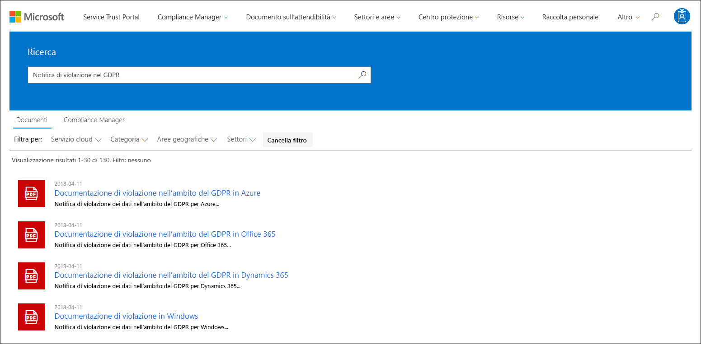

# Microsoft Compliance Manager (classico)Microsoft Compliance Manager (Classic)

> [!NOTE]
> Questa documentazione descrive una versione precedente del prodotto.This documentation describes a previous version of this product. È sconsigliato usare questa versione di Compliance Manager, mentre invece è consigliato usare il nuovo [punteggio di conformità Microsoft](compliance-score.md).Users are strongly discouraged from using this version of Compliance Manager and instead encouraged to use the new [Microsoft Compliance Score](compliance-score.md).

 *Compliance Manager non è disponibile in Office 365 gestito da 21Vianet, Office 365 Germany, Office 365 U.S. Government Community High (GCC High) o Office 365 Dipartimento della Difesa.**Compliance Manager isn't available in Office 365 operated by 21Vianet, Office 365 Germany, Office 365 U.S. Government Community High (GCC High), or Office 365 Department of Defense.*
  
Compliance Manager è uno strumento di valutazione dei rischi basato sul flusso di lavoro in Microsoft [Service Trust Portal](https://docs.microsoft.com/microsoft-365/compliance/get-started-with-service-trust-portal), che consente di tenere traccia, assegnare e verificare le attività di conformità dell'organizzazione correlate a Microsoft Professional Services e a servizi cloud Microsoft, come Microsoft Office 365, Microsoft Dynamics 365 e Microsoft Azure.Compliance Manager, a workflow-based risk assessment tool in the Microsoft [Service Trust Portal](https://docs.microsoft.com/microsoft-365/compliance/get-started-with-service-trust-portal), enables you to track, assign, and verify your organization's regulatory compliance activities related to Microsoft Professional Services and Microsoft cloud services, such as Microsoft Office 365, Microsoft Dynamics 365, and Microsoft Azure. 

Compliance Manager:Compliance Manager:
  
- Combina le informazioni dettagliate fornite da Microsoft ai revisori e ai regolatori come parte di vari audit di terze parti dei servizi cloud Microsoft in relazione a vari standard (ad esempio, ISO 27001, ISO 27018 e NIST) e le informazioni che Microsoft elabora internamente per la conformità alle normative (come HIPAA e il Regolamento generale sulla protezione dei dati dell'UE o GDPR) con la propria autovalutazione della conformità dell'organizzazione a questi standard e normative.Combines the detailed information provided by Microsoft to auditors and regulators as part of various third-party audits of Microsoft 's cloud services against various standards (for example, ISO 27001, ISO 27018, and NIST) and information that Microsoft compiles internally for its compliance with regulations (such as HIPAA and the EU General Data Protection Regulation, or GDPR) with your own self-assessment of your organization's compliance with these standards and regulations.
    
- Consente di assegnare, monitorare e registrare le attività correlate alla valutazione, che consentono all'organizzazione di superare gli ostacoli riscontrati dai team e di raggiungere gli obiettivi di conformità.Enables you to assign, track, and record compliance and assessment-related activities, which can help your organization cross team barriers to achieve your organization's compliance goals.
    
- Fornisce un punteggio di conformità che consente di monitorare i progressi e dare la priorità ai controlli che aiuteranno a ridurre l'esposizione al rischio dell'organizzazione.Provides a Compliance Score to help you track your progress and prioritize the auditing controls that will help reduce your organization's exposure to risk.
    
- Fornisce un archivio sicuro per poter caricare e gestire le evidenze e altri elementi correlati per le attività di conformità.Provides a secure repository for you to upload and manage evidence and other artifacts related to your compliance activities.
    
- Produce report dettagliati in Microsoft Excel che documentano le attività di conformità eseguite da Microsoft e dall'organizzazione, da fornire ai revisori, alle autorità di regolamentazione e ad altre parti interessate della conformità.Produces richly detailed reports in Microsoft Excel that document the compliance activities performed by Microsoft and your organization, which can be provided to auditors, regulators, and other compliance stakeholders.

Per una breve demo di Compliance Manager, guardare questo video su [Compliance Manager](https://www.youtube.com/watch?v=r1vs8NdSXKQ).For a brief demo of Compliance Manager, see this [Compliance Manager](https://www.youtube.com/watch?v=r1vs8NdSXKQ) video.

    
> [!IMPORTANT]
> Compliance Manager is a dashboard that provides a summary of your data protection and compliance stature and recommendations to improve data protection and compliance.Compliance Manager is a dashboard that provides a summary of your data protection and compliance stature and recommendations to improve data protection and compliance. The Customer Actions provided in Compliance Manager are recommendations; it is up to each organization to evaluate the effectiveness of these recommendations in their respective regulatory environment prior to implementation.The Customer Actions provided in Compliance Manager are recommendations; it is up to each organization to evaluate the effectiveness of these recommendations in their respective regulatory environment prior to implementation. Recommendations found in Compliance Manager should not be interpreted as a guarantee of compliance.Recommendations found in Compliance Manager should not be interpreted as a guarantee of compliance.

    
## Che cos'è il Compliance Manager?What is Compliance Manager?

Compliance Manager is a workflow-based risk assessment tool designed to help you manage regulatory compliance within the shared responsibility model of the cloud.Compliance Manager is a workflow-based risk assessment tool designed to help you manage regulatory compliance within the shared responsibility model of the cloud. Compliance Manager provides you with a dashboard view of standards and regulations and assessments that contain Microsoft's control implementation details and test results and customer control implementation guidance and tracking for your organization to enter.Compliance Manager provides you with a dashboard view of standards and regulations and assessments that contain Microsoft's control implementation details and test results and customer control implementation guidance and tracking for your organization to enter. Compliance Manager provides certification assessment control definitions, guidance on implementation and testing of controls, risk-weighted scoring of controls, role-based access management, and an in-place control action assignment workflow to track control implementation, testing status and evidence management.Compliance Manager provides certification assessment control definitions, guidance on implementation and testing of controls, risk-weighted scoring of controls, role-based access management, and an in-place control action assignment workflow to track control implementation, testing status and evidence management. Compliance Manager optimizes compliance workload by enabling customers to logically group assessments together and apply assessment control testing to identical or related controls, reducing the duplication of effort that might otherwise be required to satisfy identical control requirements across different certifications.Compliance Manager optimizes compliance workload by enabling customers to logically group assessments together and apply assessment control testing to identical or related controls, reducing the duplication of effort that might otherwise be required to satisfy identical control requirements across different certifications.

## Valutazioni in Compliance ManagerAssessments in Compliance Manager

The core component of Compliance Manager is called an *Assessment*.The core component of Compliance Manager is called an *Assessment*. An Assessment is an assessment of a Microsoft service against a certification standard or data protection regulation (such as ISO 27001:2013, and the GDPR).An Assessment is an assessment of a Microsoft service against a certification standard or data protection regulation (such as ISO 27001:2013, and the GDPR). Assessments help you to discern your organization's data protection and compliance posture against the selected industry standard for the selected Microsoft cloud service.Assessments help you to discern your organization's data protection and compliance posture against the selected industry standard for the selected Microsoft cloud service. Assessments are completed by the implementation of the controls that map to the certification standard being assessed.Assessments are completed by the implementation of the controls that map to the certification standard being assessed. 
  
La struttura di una valutazione si basa sulla responsabilità condivisa tra Microsoft e l'organizzazione per valutare i rischi relativi alla sicurezza e alla conformità nel cloud e per implementare le misure di protezione dei dati specificate da uno standard di conformità, uno standard di protezione dei dati, una normativa o una legge.The structure of an Assessment is based on the responsibility that is shared between Microsoft and your organization for assessing security and compliance risks in the cloud and for implementing the data protection safeguards specified by a compliance standard, a data protection standard, a regulation, or a law.
  
Una valutazione è costituita da diversi componenti:An Assessment is made of several components, which are:
  
- **Servizi in ambito**: ogni valutazione si applica a un set di servizi Microsoft, elencati nella sezione relativa ai servizi cloud in ambito.**In-Scope Services** - Each assessment applies to a specific set of Microsoft services, which are listed in the In-Scope Cloud Services section. 
    
- **Microsoft-Managed Controls** - For each cloud service, Microsoft implements and manages a set of  *controls*  as part of Microsoft's compliance with various standards and regulations.**Microsoft-Managed Controls** - For each cloud service, Microsoft implements and manages a set of  *controls*  as part of Microsoft's compliance with various standards and regulations. These controls are organized into  *control families*  that align with the structure from the corresponding certification or regulation that the Assessment is aligned to.These controls are organized into  *control families*  that align with the structure from the corresponding certification or regulation that the Assessment is aligned to. For each Microsoft-managed control, Compliance Manager provides details about how Microsoft implemented the control, along with how and when that implementation was tested and validated by an independent third-party auditor.For each Microsoft-managed control, Compliance Manager provides details about how Microsoft implemented the control, along with how and when that implementation was tested and validated by an independent third-party auditor. 
    
    Di seguito viene riportato un esempio di tre controlli gestiti da Microsoft nella famiglia **Protezione** da una valutazione di Office 365 e del GDPR.Here's an example of three Microsoft-managed controls in the **Security** control family from an Assessment of Office 365 and the GDPR. 

    
  
  a.a. Specifies the following information from the certification or regulation that maps to the Microsoft-managed control.Specifies the following information from the certification or regulation that maps to the Microsoft-managed control.

  - **ID di controllo**: il numero della sezione o dell'articolo della certificazione o delle normative associati al controllo.**Control ID** - The section or article number from the certification or regulation that the control maps to.
    
  - **Titolo**: il titolo della certificazione o della normativa corrispondenti.**Title** - The title from the corresponding certification or regulation.
    
  - **ID dell'articolo**: questo campo è incluso solo per le valutazioni GDPR, poiché specifica il numero dell'articolo GDPR corrispondente.**Article ID** - This field is included only for GDPR assessments, as it specifies the corresponding GDPR article number.
    
  - **Descrizione**: il testo dello standard o della normativa associati al controllo gestito da Microsoft selezionato.**Description** - Text of the standard or regulation that maps to the selected Microsoft-managed control.

  b.b. The Compliance Score for the control, which indicates the level of risk (due to non-compliance or control failure) associated with each Microsoft-managed control.The Compliance Score for the control, which indicates the level of risk (due to non-compliance or control failure) associated with each Microsoft-managed control. See [Understanding the Compliance Score](#understanding-the-compliance-score) for more information.See [Understanding the Compliance Score](#understanding-the-compliance-score) for more information. Note that Compliance Scores are rated from 1 to 10 and are color-coded.Note that Compliance Scores are rated from 1 to 10 and are color-coded. Yellow indicates low risk controls, orange indicates medium-risk controls, and red indicated high-risk controls.Yellow indicates low risk controls, orange indicates medium-risk controls, and red indicated high-risk controls. 
    
  c.c. Information about the implementation status of a control, the date the control was tested, who performed the test, and the test result.Information about the implementation status of a control, the date the control was tested, who performed the test, and the test result.
    
  d.d. For each control, you can click **More** to see additional information, including details about Microsoft's implementation of the control and details about how the control was tested and validated by an independent third-party auditor.For each control, you can click **More** to see additional information, including details about Microsoft's implementation of the control and details about how the control was tested and validated by an independent third-party auditor. 
    
- **Customer-Managed Controls** - This is the collection of controls that are managed by your organization.**Customer-Managed Controls** - This is the collection of controls that are managed by your organization. Your organization is responsible for implementing these controls as part of your compliance process for a given standard or regulation.Your organization is responsible for implementing these controls as part of your compliance process for a given standard or regulation. Customer-managed controls are also organized into control families for the corresponding certification or regulation.Customer-managed controls are also organized into control families for the corresponding certification or regulation. Use the customer-managed controls to implement the recommended actions suggested by Microsoft as part of your compliance activities.Use the customer-managed controls to implement the recommended actions suggested by Microsoft as part of your compliance activities. Your organization can use the prescriptive guidance and recommended Customer Actions in each customer-managed control to manage the implementation and assessment process for that control.Your organization can use the prescriptive guidance and recommended Customer Actions in each customer-managed control to manage the implementation and assessment process for that control.
    
    Customer-managed controls in Assessments also have built-in workflow management functionality that you can use to manage and track your organization's progress towards completing the Assessment.Customer-managed controls in Assessments also have built-in workflow management functionality that you can use to manage and track your organization's progress towards completing the Assessment. For example, a Compliance Officer in your organization can assign an Action Item to an IT admin who has the responsibility and necessary permissions to perform the actions that are recommended for the control.For example, a Compliance Officer in your organization can assign an Action Item to an IT admin who has the responsibility and necessary permissions to perform the actions that are recommended for the control. When that work is complete, the IT admin can upload evidence of their implementation tasks (for example, screenshots of configuration or policy settings) and then assign the Action Item back to the Compliance Officer to evaluate the collected evidence, test the implementation of the control, and record the implementation date and test results in Compliance Manager.When that work is complete, the IT admin can upload evidence of their implementation tasks (for example, screenshots of configuration or policy settings) and then assign the Action Item back to the Compliance Officer to evaluate the collected evidence, test the implementation of the control, and record the implementation date and test results in Compliance Manager. For more information, see the [Managing the assessment process](#managing-the-assessment-process) section in the article.For more information, see the [Managing the assessment process](#managing-the-assessment-process) section in the article. 
  
## Autorizzazioni e controllo dell'accesso basato sui ruoliPermissions and role-based access control

Compliance Manager usa un modello di autorizzazione di controllo dell'accesso basato sui ruoli.Compliance Manager uses a role-based access control permission model. Solo agli utenti a cui è stato assegnato il ruolo utente è consentito di accedere a Compliance Manager e le azioni consentite da ogni utente sono limitate in base al tipo di ruolo.Only users who are assigned a user role may access Compliance Manager, and the actions allowed by each user are restricted by role type.
  
Si noti che non esiste più un ruolo predefinito **Accesso guest**.Note that there is no longer a default **Guest access** role. A ogni utente deve essere assegnato un ruolo per poter accedere e lavorare in Compliance Manager.Each user must be assigned a role in order to access and work within Compliance Manager.
  
The following table describes each Compliance Manager permission and what it allows the user do.The following table describes each Compliance Manager permission and what it allows the user do. The table also indicates the role that each permission is assigned to.The table also indicates the role that each permission is assigned to.
  
||**Compliance Manager - Lettore****Compliance Manager Reader**|**Compliance Manager - Collaboratore****Compliance Manager Contributor**|**Compliance Manager - Valutatore****Compliance Manager Assessor**|**Compliance Manager - Amministratore****Compliance Manager Administrator**|**Amministratore del portale****Portal Admin**|
|:-----|:-----|:-----|:-----|:-----|:-----|
|**Lettura dati**: gli utenti possono leggere i dati, ma non modificarli.**Read data** - Users can read but not edit data.    |             |             |             |             |            |
|**Modifica dati**: gli utenti possono modificare tutti i campi, tranne i campi Risultato del test e Data del test.**Edit data** - Users can edit all fields, except the Test Result and Test Date fields.    ||            |             |             |             |
|**Modifica risultati del test**: gli utenti possono modificare i campi Risultato del test e Data del test.**Edit test results** - Users can edit the Test Result and Test Date fields.    ||  |             |             |             |
|**Gestione valutazioni**: gli utenti possono creare, archiviare ed eliminare le valutazioni.**Manage assessments** - Users can create, archive, and delete Assessments.    |||  |             |             |
|**Manage users** - Users can add other users in their organization to the Reader, Contributor, Assessor, and Administrator roles.**Manage users** - Users can add other users in their organization to the Reader, Contributor, Assessor, and Administrator roles. Only those users with the Global Administrator role in your organization can add or remove users from the Portal Admin role.Only those users with the Global Administrator role in your organization can add or remove users from the Portal Admin role.    ||||  |             |
   
## Comprendere il punteggio di conformitàUnderstanding the Compliance Score

Nella dashboard, Compliance Manager visualizza un punteggio totale per la valutazione di Office 365 nell'angolo in alto a destra del riquadro.On the Dashboard, Compliance Manager displays a total score for Office 365 assessments in the upper right-hand corner of the tile. Si tratta del punteggio di conformità totale per la valutazione ed equivale alla somma dei punti ricevuti per la valutazione di ogni controllo contrassegnato come implementato e testato nella valutazione.This is the overall total Compliance Score for the Assessment, and is the accumulation of points received for each control assessment that has been marked as Implemented and Tested in the Assessment. Quando si aggiunge una valutazione, si vedrà che il Punteggio di conformità è già in fase di completamento, perché i punti per i controlli gestiti da Microsoft che sono stati implementati da Microsoft e testati da terzi indipendenti sono già stati applicati.When adding an Assessment, you will see that the Compliance Score is already on the way towards completion because the points for the Microsoft-managed controls that have been implemented by Microsoft and tested by independent third parties are already applied.
  

  
I punti rimanenti derivano dalla valutazione del controllo del cliente e dall'implementazione e dalla verifica dei controlli gestiti dal cliente, ciascuno con un valore specifico che contribuisce al punteggio complessivo di conformità.The remaining points come from the successful customer control assessment, from the implementation and testing of the customer-managed controls, each of which has a specific value that contributes to the overall compliance score. 
  
Ogni valutazione mostra un punteggio di conformità basato sul rischio che agevola la valutazione del livello di rischio (per mancata conformità o insuccesso di un controllo) associato a ogni controllo (inclusi sia i controlli gestiti da Microsoft che i controlli gestiti dal cliente) in una valutazione.Each Assessment displays a risk-based Compliance Score to help you assess the level of risk (due to non-compliance or control failure) associated with each control (including both Microsoft managed and customer-managed controls) in an Assessment. A ogni controllo gestito dal cliente viene assegnato un numero di punti (denominato \*classificazione di gravità) su una scala da 1 a 10, in cui vengono assegnati più punti per i controlli associati a un fattore di rischio maggiore in caso di insuccesso del controllo e meno punti per i controlli a basso rischio.Each customer-managed control is assigned a possible number of points (called a  \*severity ranking) on a scale from 1 to 10, where more points are awarded for controls associated with a higher risk factor if the control fails, and fewer points are awarded for lower-risk controls. 
  
Ad esempio, il controllo di valutazione per User Access Management mostrato in basso è classificato con un fattore di rischio molto alto, quindi il punteggio assegnato è 10.For example, the User Access Management assessment control shown below has a very high severity risk ranking, and displays an assigned value of 10.
  

  
 Per fare un confronto, il controllo di valutazione per User Access Management mostrato in basso è classificato con un fattore di rischio inferiore, quindi il punteggio assegnato è 3.By comparison, the Information Backup assessment control shown below has a lower severity risk ranking, and displays an assigned value of 3. 
  

  
The Compliance Manager assigns a default severity ranking to each control.The Compliance Manager assigns a default severity ranking to each control. Risk rankings are calculated based on the following criteria:Risk rankings are calculated based on the following criteria:
  
- Se un controllo impedisce il verificarsi di eventi imprevisti (classificazione più alta), rileva gli eventi imprevisti accaduti o corregge l'impatto di un evento imprevisto (classificazione più bassa).Whether a control prevents incidents from happening (highest ranking), detects incidents that have happened, or corrects the impact of an incident (lowest ranking). In termini di classificazione di gravità, a un controllo obbligatorio che impedisce una minaccia viene assegnato il numero massimo di punti, mentre ai controlli rilevatori o correttivi (indipendentemente dal fatto che siano obbligatori o discrezionali) viene assegnato il numero minimo di punti.In terms of severity ranking, a mandatory control that prevents a threat is assigned the highest number of points; controls that are detective or corrective (regardless of whether they're mandatory or discretionary) are assigned the lowest number of points.
    
- Se un controllo (dopo che è stato implementato) è obbligatorio e quindi non può essere bypassato dagli utenti (ad esempio, gli utenti devono reimpostare la propria password e soddisfare i requisiti di lunghezza e caratteri della password) o a discrezione dell'utente e può essere bypassato dagli utenti (ad esempio, in caso di regole aziendali che richiedono agli utenti di bloccare i propri schermi quando si allontanano dalla propria postazione).Whether a control (after it's been implemented) is mandatory and therefore can't be by-passed by users (for example, users having to reset their password and meet password length and character requirements) or discretionary and can be by-passed by users (for example, business rules that require users to lock their screens when their computers are unattended).
    
- Controls related to risks to data confidentiality, integrity, and availability, whether these risks come from internal or external threats, and whether the threat is malicious or accidental.Controls related to risks to data confidentiality, integrity, and availability, whether these risks come from internal or external threats, and whether the threat is malicious or accidental. For example, controls that would help prevent an external attacker from breaching that network and gaining access to personally identifiable information would be assigned more points than a control related to preventing an employee from accidentally mis-configuring a network router setting that results in a network outage).For example, controls that would help prevent an external attacker from breaching that network and gaining access to personally identifiable information would be assigned more points than a control related to preventing an employee from accidentally mis-configuring a network router setting that results in a network outage).
    
- Rischi connessi a driver legali e esterni, come contratti, regolamenti e impegni pubblici, per ciascun controllo.Risks related to legal and external drivers, such as contracts, regulations, and public commitments, for each control.
    
The displayed Compliance Score values for the control are applied  *in their entirety*  to the Total Compliance Score on a pass/fail basis--either the control is implemented and passes the subsequent assessment test or it does not; there is no partial credit for a partial implementation.The displayed Compliance Score values for the control are applied  *in their entirety*  to the Total Compliance Score on a pass/fail basis--either the control is implemented and passes the subsequent assessment test or it does not; there is no partial credit for a partial implementation. Only when the control has its **Implementation Status** set to **Implemented** or **Alternative Implementation** and the **Test Result** is set to **Passed** are the assigned points added to the Total Compliance Score.Only when the control has its **Implementation Status** set to **Implemented** or **Alternative Implementation** and the **Test Result** is set to **Passed** are the assigned points added to the Total Compliance Score. 
  
E soprattutto, il punteggio di conformità consente di stabilire priorità in merito ai controlli su cui concentrarsi per l'implementazione indicando quali controlli hanno un rischio potenziale più alto in caso di insuccesso.Most importantly, the Compliance Score can help you prioritize which controls to focus on for implementation by indicating which controls that have a higher potential risk if there is a failure related to a control. Oltre alla definizione delle priorità basata sui rischi, quando i controlli della valutazione sono correlati ad altri controlli (all'interno della stessa valutazione o in un'altra valutazione nello stesso gruppo), il corretto completamento di un singolo controllo può snellire significativamente la procedura grazie alla sincronizzazione dei risultati dei test di controllo.In addition to risk-based prioritization, when assessment controls are related to other controls (either within the same assessment or in another assessment in the same assessment grouping), completing a single control successfully can result in a significant reduction of effort based on the synchronization of control test results.
  
Nell'immagine seguente, ad esempio, si può notare che Office 365 - valutazione GDPR è valutato al 46% con 51 valutazioni di controllo su 111 completate, per un punteggio di conformità totale di 289 su 600 possibili.For example, in the image below we see that the Office 365 - GDPR Assessment is currently 46% assessed, with 51 of 111 control assessments completed for a Total Compliance score of 289 out of a possible 600.
  

  
Nella valutazione, il controllo GDPR 7.5.5 è correlato a 5 altri controlli (7.4.1, 7.4.3, 7.4.4, 7.4.8,.7.4.9), ognuno con un punteggio di 6 o 8 per la classificazione di gravità del rischio da moderata a molto elevata.Within the assessment GDPR control 7.5.5 is related to 5 other controls (7.4.1, 7.4.3, 7.4.4, 7.4.8, and 7.4.9) each with a moderate to high severity risk rating score of 6 or 8). Usando il filtro delle valutazioni sono stati selezionati e resi visibili tutti questi controlli nella visualizzazione di valutazione e, come si può vedere di seguito, nessuno di essi è stato valutato.Using the assessment filter, we have selected all of these controls, making them visible in the assessment view, and can see below that none of them have been assessed. 
  
 As those 6 controls are related, the completion of any one them will result in a synchronization of those test results across the related controls within this assessment (just as it will for any related controls in an assessment that is in the same assessment grouping).As those 6 controls are related, the completion of any one them will result in a synchronization of those test results across the related controls within this assessment (just as it will for any related controls in an assessment that is in the same assessment grouping). Upon completion of the implementation and testing of GDPR control 7.5.5, the control detail area refreshes to show that all 6 controls have been assessed, with a corresponding increase in the number of assessed controls to 57 and 51% assessed, and a change in total Compliance Score of +40.Upon completion of the implementation and testing of GDPR control 7.5.5, the control detail area refreshes to show that all 6 controls have been assessed, with a corresponding increase in the number of assessed controls to 57 and 51% assessed, and a change in total Compliance Score of +40. 
  

  
Questa finestra di dialogo di aggiornamento di conferma verrà visualizzata se si sta per modificare lo stato di implementazione di un controllo correlato con impatto sugli altri controlli correlati.This confirmation update dialog box will appear if you are about to change the Implementation Status of a related control in a way that will impact the other related controls.
  

  
> [!NOTE]
> Currently, only Assessments for Office 365 cloud services include a Compliance Score.Currently, only Assessments for Office 365 cloud services include a Compliance Score. Assessments for Azure and Dynamics show an assessment status.Assessments for Azure and Dynamics show an assessment status. 

## Metodologia del punteggio di conformitàCompliance Score methodology

Il punteggio di conformità, come Microsoft Secure Score, è simile ad altri sistemi di punteggio basati sul comportamento; l'attività dell'organizzazione può aumentare il punteggio di conformità svolgendo attività correlate alla protezione dei dati, alla privacy e alla sicurezza.The Compliance Score, like the Microsoft Secure Score, is similar to other behavior-based scoring systems; your organization's activity can increase its Compliance Score by performing activities related to data protection, privacy, and security.
  
> [!NOTE]
> The Compliance Score does not express an absolute measure of organizational compliance with any particular standard or regulation.The Compliance Score does not express an absolute measure of organizational compliance with any particular standard or regulation. It expresses the extent to which you have adopted controls which can reduce the risks to personal data and individual privacy.It expresses the extent to which you have adopted controls which can reduce the risks to personal data and individual privacy. No service can guarantee that you are compliant with a standard or regulation, and the Compliance Score should not be interpreted as a guarantee in any way.No service can guarantee that you are compliant with a standard or regulation, and the Compliance Score should not be interpreted as a guarantee in any way. 
  
Assessments in Compliance Manager are based on the shared responsibility model for cloud computing.Assessments in Compliance Manager are based on the shared responsibility model for cloud computing. In the shared responsibility model, Microsoft and each customer share responsibility for the protection of the customer's data when that data is stored in our cloud.In the shared responsibility model, Microsoft and each customer share responsibility for the protection of the customer's data when that data is stored in our cloud.
  
Come illustrato nella valutazione GDPR di Office 365 seguente, Microsoft e i clienti sono responsabili dell'esecuzione di una serie di azioni ideate per soddisfare i requisiti dello standard o della normativa in fase di valutazione.As shown in the Office 365 GDPR Assessment below, Microsoft and customers are each responsible for performing a variety of Actions that are designed to satisfy the requirements of the standard or regulation being assessed. Per razionalizzare e comprendere le esigenze.To rationalize and understand the required. Le azioni in un'ampia gamma di standard e normative, Compliance Manager considera tutte le normative e gli standard come se fossero framework di controllo.Actions across a variety of standards and regulations, Compliance Manager treats all standards and regulations as if they were control frameworks. Quindi, le azioni eseguite da Microsoft e dai clienti per ogni valutazione includono l'implementazione e la convalida di vari controlli.Thus, the Actions performed by Microsoft and by customers for each Assessment involve the implementation and validation of various controls.
  

  
Di seguito viene indicato il flusso di lavoro di base per un'azione tipica:Here's the basic workflow for a typical Action:
  
1. The Compliance, Risk, Privacy, and/or Data Protection Officer of an organization assigns the task to someone in the organization to implement a control.The Compliance, Risk, Privacy, and/or Data Protection Officer of an organization assigns the task to someone in the organization to implement a control. That person could be:That person could be:

    - Il proprietario di un criterio di businessA business policy owner
    
    - Un implementatore ITAn IT implementer
    
    - Un'altra persona dell'organizzazione responsabile dell'esecuzione dell'attivitàAnother individual in the organization who has responsibility for performing the task
    
2. That individual performs the tasks necessary to implement the control, uploads evidence of implementation into Compliance Manager, and marks the control(s) tied to the Action as implemented.That individual performs the tasks necessary to implement the control, uploads evidence of implementation into Compliance Manager, and marks the control(s) tied to the Action as implemented. Once these tasks are completed, they assign the Action to an Assessor for validation.Once these tasks are completed, they assign the Action to an Assessor for validation. Assessors can be:Assessors can be:
    
    - Valutatori interni che eseguono la convalida dei controlli all'interno di un'organizzazioneInternal assessors that perform validation of controls within an organization
    
    - Valutatori esterni che esaminano, verificano e certificano la conformità, come le organizzazioni di terze parti indipendenti che controllano i servizi cloud di MicrosoftExternal assessors that examine, verify, and certify compliance, such as the third-party independent organizations that audit Microsoft's cloud services
    
3. Il valutatore convalida il controllo, esamina le evidenze e contrassegna il controllo/i controlli come valutati e i risultati della valutazione (ad esempio, se il controllo è stato superato).The Assessor validates the control and examines the evidence and marks the control(s) as assessed and the results of the assessment (e.g., passed).
    
Quando tutti i controlli associati a una valutazione sono stati valutati, la valutazione è completata.Once all the controls associated with an Assessment have been assessed, the Assessment is considered completed.
  
Every Assessment in Compliance Manager comes pre-loaded with information that provides details about the Actions taken by Microsoft to satisfy the requirements of the controls for which Microsoft is responsible.Every Assessment in Compliance Manager comes pre-loaded with information that provides details about the Actions taken by Microsoft to satisfy the requirements of the controls for which Microsoft is responsible. This information includes details about how Microsoft has implemented each control and how and when Microsoft's implementation was assessed and verified by a third-party auditor.This information includes details about how Microsoft has implemented each control and how and when Microsoft's implementation was assessed and verified by a third-party auditor. For this reason, the Microsoft Managed Controls for each Assessment are marked as Assessed, and the Compliance Score for the Assessment reflects this.For this reason, the Microsoft Managed Controls for each Assessment are marked as Assessed, and the Compliance Score for the Assessment reflects this.
  
Each Assessment includes a total Compliance Score based on the shared responsibility model.Each Assessment includes a total Compliance Score based on the shared responsibility model. Microsoft's implementation and testing of controls for Office 365 contributes a portion of the total possible points associated with a GDPR assessment.Microsoft's implementation and testing of controls for Office 365 contributes a portion of the total possible points associated with a GDPR assessment. As the customer implements and tests each of the customer Actions, the Compliance Score for the Assessment will increase by the value assigned to the control.As the customer implements and tests each of the customer Actions, the Compliance Score for the Assessment will increase by the value assigned to the control. 
  
 ### Metodologia del punteggio basata sul rischioRisk-based scoring methodology
  
Compliance Manager uses a risk-based scoring methodology with a scale from 1-10 that assigns a higher value to controls that represent a higher risk in the event the control fails or is non-compliant.Compliance Manager uses a risk-based scoring methodology with a scale from 1-10 that assigns a higher value to controls that represent a higher risk in the event the control fails or is non-compliant. The scoring system used by Compliance Score is based on several key factors, such as:The scoring system used by Compliance Score is based on several key factors, such as:
  
- Essenza del controlloThe essence of the control
    
- Il livello di rischio del controllo in base al tipo di minacceThe level of risk of the control based on the kinds of threats
    
- I driver esterni per il controlloThe external drivers for the control
    

  
 ### Essenza del controlloEssence of the control
  
L'essenza del controllo dipende dalla natura del controllo: obbligatorio o a discrezione dell'utente e preventivo, investigativo o correttivo.The essence of the control is based on whether the control is Mandatory or Discretionary, and whether it is Preventative, Detective, or Corrective.
  
 ### Obbligatorio o a discrezione dell'utenteMandatory or discretionary
  
 *Mandatory controls*  are controls that cannot be bypassed either intentionally or accidentally.*Mandatory controls*  are controls that cannot be bypassed either intentionally or accidentally. An example of a common mandatory control is a centrally-managed password policy that sets requirements for password length, complexity, and expiration.An example of a common mandatory control is a centrally-managed password policy that sets requirements for password length, complexity, and expiration. Users must comply with these requirements in order to access the system.Users must comply with these requirements in order to access the system. 
  
 *Discretionary controls*  rely upon users to understand policy and act accordingly.*Discretionary controls*  rely upon users to understand policy and act accordingly. For example, a policy requiring users to lock their computer when they leave it is a discretionary control because it relies on the user.For example, a policy requiring users to lock their computer when they leave it is a discretionary control because it relies on the user. 
  
 ### Preventivo, investigativo o correttivoPreventative, detective, or corrective
  
 *Preventative controls*  are those that prevent specific risks.*Preventative controls*  are those that prevent specific risks. For example, protecting information at rest using encryption is a preventative control against attacks, breaches, etc. Separation of duties is a preventative control to manage conflict of interest and to guard against fraud.For example, protecting information at rest using encryption is a preventative control against attacks, breaches, etc. Separation of duties is a preventative control to manage conflict of interest and to guard against fraud. 
  
 *Detective controls*  are those that actively monitor systems to identify irregular conditions or behaviors that represent risk or that can be used to detect intrusions or determine if a breach has occurred.*Detective controls*  are those that actively monitor systems to identify irregular conditions or behaviors that represent risk or that can be used to detect intrusions or determine if a breach has occurred. System access auditing and privileged administrative actions auditing are types of detective monitoring controls; regulatory compliance audits are a type of detective control used to find process issues.System access auditing and privileged administrative actions auditing are types of detective monitoring controls; regulatory compliance audits are a type of detective control used to find process issues. 
  
 *Corrective controls*  are those that try to keep the adverse effects of a security incident to a minimum, take corrective action to reduce the immediate effect, and reverse the damage, if possible.*Corrective controls*  are those that try to keep the adverse effects of a security incident to a minimum, take corrective action to reduce the immediate effect, and reverse the damage, if possible. Privacy incident response is a corrective control to limit damage and restore systems to an operational state after a breach.Privacy incident response is a corrective control to limit damage and restore systems to an operational state after a breach. 
  
Valutando ciascun controllo utilizzando questi fattori, viene determinata l'essenza del controllo e viene assegnato un valore relativo al rischio che rappresenta.By evaluating each control using these factors, we determine the essence of the control and assign it a value relative to the risk that it represents.
  
 **Minaccia****Threat**
  
||||
|:-----|:-----|:-----|
||**Obbligatorio****Mandatory**   |**A discrezione dell'utente****Discretionary**   |
|**Preventivo****Preventative**   |Rischio elevatoHigh risk    |Rischio medioMedium risk    |
|**Investigativo****Detective**   |Rischio medioMedium risk    |Basso rischioLow risk    |
|**Correttivo****Corrective**   |Rischio medioMedium risk    |Basso rischioLow risk    |
   
La minaccia si riferisce a tutto ciò che rappresenta un rischio per lo standard di sicurezza fondamentale, universalmente accettato, noto come CIA (Confidentiality, Integrity e Availability) o triade della sicurezza dei dati: riservatezza, integrità e disponibilità:Threat refers to anything that poses a risk to the fundamental, universally-accepted security standard known as the CIA triad for data: Confidentiality, Integrity, and Availability:
  
- Riservatezza significa che le informazioni possono essere lette e comprese solo da parti attendibili e autorizzate.Confidentiality means that information can be read and understood only by trusted, authorized parties.
    
- Integrità significa che le informazioni non sono state modificate o eliminate da parti non autorizzate.Integrity means that information has not been modified or destroyed by unauthorized parties.
    
- Disponibilità significa che le informazioni sono facilmente accessibili con un elevato livello di qualità del servizio.Availability means that information can be accessed readily with a high level of quality of service.
    
A failure of any of these characteristics is considered a compromise of the system as a whole.A failure of any of these characteristics is considered a compromise of the system as a whole. Threats can come from both internal and external sources, and an actor's intent can be accidental or malicious.Threats can come from both internal and external sources, and an actor's intent can be accidental or malicious. These factors are estimated in a threat matrix that assigns threat levels of either High, Moderate, or Low to each combination of scenarios.These factors are estimated in a threat matrix that assigns threat levels of either High, Moderate, or Low to each combination of scenarios.

||**Interno****Internal** ||**Esterno****External** ||||
|:-----|:-----|:-----|:-----|:-----|:-----|:-----|
||*Dannoso**Malicious* |*Accidentale**Accidental* |*Dannoso**Malicious* |*Accidentale**Accidental* |||
|**Riservatezza****Confidentiality** |(H, M o L)(H, M, or L)    |(H, M o L)(H, M, or L)    |(H, M o L)(H, M, or L)    |(H, M o L)(H, M, or L)|
|**Integrità****Integrity** |(H, M o L)(H, M, or L)    |(H, M o L)(H, M, or L)    |(H, M o L)(H, M, or L)    |(H, M o L)(H, M, or L)|
|**Disponibilità****Availability** |(H, M o L)(H, M, or L)    |(H, M o L)(H, M, or L)    |(H, M o L)(H, M, or L)    |(H, M o L)(H, M, or L)|
   
 **Driver esterni****External drivers**
  
|**Contratti****Contracts**|**Normative****Regulations**|**Impegni pubblici****Public commitments**|
|:-----|:-----|:-----|
|(H, M o L)(H, M, or L)    |(H, M o L)(H, M, or L)    |(H, M o L)(H, M, or L)    |
   
Fattori esterni come regolamenti, contratti e impegni pubblici applicabili possono influenzare i controlli ideati per proteggere e prevenire la violazione dei dati e a ciascuno di questi fattori sono assegnati valori di rischio alto, moderato o basso.External factors such as applicable regulations, contracts, and public commitments can influence controls designed to protect data and prevent data breaches, and each of these factors are assigned risk values or High, Moderate or Low.
  
Il numero stimato di occorrenze di questi valori di rischio alto, moderato o basso nei 15 possibili scenari di rischio rappresentati in CIA/minaccia e driver esterni/legali sono combinati per fornire una ponderazione del rischio, che considera la probabilità e il numero di occorrenze del rischio ad un dato valore significativa e viene preso in considerazione quando si calcola il livello di gravità del controllo.The estimated number of occurrences of these risk values of High, Moderate, or Low across the 15 possible risk scenarios represented in the CIA/Threat and Legal/External Drivers are combined to provide a risk weighting, which considers the likelihood and number of occurrences of risks at a given value as significant and is taken into consideration when calculating the severity ranking of the control.
  
In base al livello di gravità del controllo, a quest'ultimo viene assegnato il valore del punteggio di conformità, un numero compreso tra 1 (basso) e 10 (alto), raggruppato nelle seguenti categorie di rischio:Based on the control's severity ranking, the control is assigned its compliance score value, a number between 1 (low) and 10 (high), grouped into the following categories of risk:
  
|**Livello di rischio****Risk level**|**Valore del controllo****Control value**|
|:-----|:-----|
|BassoLow    |1-31-3    |
|ModeratoModerate    |66    |
|AltoHigh    |88    |
|GraveSevere    |1010    |
   
Assegnando delle priorità ai controlli di valutazione con i valori più elevati del punteggio di conformità, l'organizzazione si concentra sugli elementi di rischio più elevato e riceve un feedback positivo proporzionalmente più elevato sotto forma di più punti aggiunti al punteggio totale di conformità per la valutazione di ciascuna valutazione di controllo completata.By prioritizing assessment controls with the highest compliance score values, the organization will be concentrating on the highest risk items and receive proportionally higher positive feedback in the form of more points added to the total compliance score for the assessment for each control assessment completed.
  
### Riepilogo sulla metodologia di assegnazione del punteggioSummary of scoring methodology
  
The Compliance Score is a core component of the way that Compliance Manager helps organizations understand and manage their compliance.The Compliance Score is a core component of the way that Compliance Manager helps organizations understand and manage their compliance. The Compliance Score for an assessment is an expression of the company's compliance with a given standard or regulation as a number, where the higher the score (up to the maximum number of points allocated for the Assessment), the better the company's compliance posture.The Compliance Score for an assessment is an expression of the company's compliance with a given standard or regulation as a number, where the higher the score (up to the maximum number of points allocated for the Assessment), the better the company's compliance posture. Understanding the compliance scoring methodology in which assessment controls are assigned risk severity values between 1- 10 (low to high), and how completed control assessments add to the total compliance score is crucial to organizations for prioritizing their actions.Understanding the compliance scoring methodology in which assessment controls are assigned risk severity values between 1- 10 (low to high), and how completed control assessments add to the total compliance score is crucial to organizations for prioritizing their actions.

## Raggruppamento delle valutazioniGrouping Assessments

Quando si crea una nuova valutazione, viene chiesto di creare un gruppo a cui assegnare la valutazione oppure di assegnare la valutazione a un gruppo esistente.When you create a new Assessment, you're prompted to create a group to assign the Assessment to or assign the Assessment to an existing group. I gruppi consentono di organizzare le valutazioni in modo logico e condividere le informazioni e le attività del flusso di lavoro comuni tra le valutazioni che hanno controlli gestiti dal cliente uguali o correlati.Groups allow you to logically organize Assessments and share common information and workflow tasks between Assessments that have the same or related customer-managed controls.
  
For example, you could group Assessments by year or teams, departments, or agencies within your organization or group them by year.For example, you could group Assessments by year or teams, departments, or agencies within your organization or group them by year. Here are some examples of groups and the Assessments they might contain.Here are some examples of groups and the Assessments they might contain.
  
- Valutazioni GDPR - 2018GDPR Assessments — 2018
    
  - Office 365 ed EMSOffice 365 + GDPR
    
  - Azure e GDPRAzure + GDPR
    
  - Dynamics e GDPRDynamics + GDPR
    
- Valutazioni Azure - 2018Azure Assessments — 2018
    
  - Azure e GDPRAzure + GDPR
    
  - Azure e ISO 27001:2013Azure + ISO 27001:2013
    
  - Azure e ISO 27018:2014Azure + ISO 27018:2014
    
- Sicurezza dei dati e valutazione della privacyData Security and Privacy Assessments
    
  - Office 365 e ISO 27001:2013Office 365 + ISO 27001:2013
    
  - Office 365 e ISO 27018:2014Office 365 + ISO 27018:2014
    
  - Azure e ISO 27001:2013Azure + ISO 27001:2013
    
  - Azure e ISO 27018:2014Azure + ISO 27018:2014
    
> [!TIP]
> È consigliabile determinare una strategia di raggruppamento per l'organizzazione prima di aggiungere nuove valutazioni.We recommend that your determine a grouping strategy for your organization before adding new assessments. 
  
Questi sono i requisiti per il raggruppamento delle valutazioni:These are the requirements for grouping Assessments:
  
- I nomi dei gruppi (noti anche come ID gruppo) devono essere univoci all'interno dell'organizzazione.Group names (also called  \*Group IDs) must be unique within your organization. 
    
- Groups can contain Assessments for the same certification/regulation, but each group can only contain one Assessment for a specific cloud service/certification pair.Groups can contain Assessments for the same certification/regulation, but each group can only contain one Assessment for a specific cloud service/certification pair. For example, a group can't contain two Assessments for Office 365 and GDPR.For example, a group can't contain two Assessments for Office 365 and GDPR. Similarly, a group can contain multiple Assessments for the same cloud service as long as the corresponding certification/regulation for each one is different.Similarly, a group can contain multiple Assessments for the same cloud service as long as the corresponding certification/regulation for each one is different.
    
Dopo l'aggiunta di una valutazione a un gruppo di valutazioni, il gruppo non può essere modificato.Once an assessment has been added to an assessment grouping, the grouping cannot be changed. È possibile rinominare il gruppo di valutazioni, modificando così il nome del gruppo per tutte le valutazioni associate al gruppo.You can rename the assessment group, which changes the name of the assessment grouping for all of the assessments associated with that group. È possibile creare una valutazione e un nuovo gruppo di valutazioni, quindi copiare le informazioni da una valutazione esistente, creando così un duplicato della valutazione in un gruppo di valutazione diverso in modo facile e veloce.You can create an assessment and a new assessment group and copy information from an existing assessment, which effectively creates a duplicate of that assessment in a different assessment group. L'archiviazione di una valutazione interrompe la relazione tra la valutazione e il gruppo di valutazione.Archiving an assessment breaks the relationship between that assessment and the assessment group. Qualsiasi ulteriore aggiornamento ad altre valutazioni correlate non viene più riflesso nella valutazione archiviata.Any further updates to other related assessments are no longer reflected in the archived assessment.
  
Come indicato in precedenza, un vantaggio importante dell'uso dei gruppi è che, quando due diverse valutazioni nello stesso gruppo condividono lo stesso controllo gestito dal cliente (e quindi le azioni cliente sarebbero le stesse per ogni controllo), il completamento dei dettagli dell'implementazione, delle informazioni sul test e dello stato del controllo in una valutazione viene sincronizzato con lo stesso controllo in altre valutazioni del gruppo.As previous explained, one key advantage of using groups is that when two different Assessments in the same group share the same customer-managed control (and therefore the customer actions would be the same for each control), then the completion of implementation details, testing information, and status for the control in one Assessment would be synchronized to the same control in any other Assessment in the group. In altre parole, se le valutazioni condividono lo stesso controllo e si trovano nello stesso gruppo, è sufficiente gestire il processo di valutazione per il controllo in una sola verifica.In other words, if Assessments share the same control and those Assessments are in the same group, you'd only have to manage the assessment process for the control in one Assessment. I risultati del controllo verranno sincronizzati automaticamente con altre valutazioni.The results for that control will be automatically synchronized to other Assessments. Ad esempio, ISO 27001 e ISO 27018 hanno entrambi un controllo relativo ai criteri per le password.For example, ISO 27001 and ISO 27018 both have a control related to password policies. Se lo stato di test per il controllo è impostato su "Superato" in una valutazione, il controllo è aggiornato (e contrassegnato come "Superato") nell'altra valutazione.If the Test Status for the control is set to "Passed" in one Assessment, the control is updated (and marked as "Passed") in the other Assessment, as long as both assessments are part of the same Assessment Group.
  
Per un esempio, si prendano questi due controlli delle valutazioni correlati, ognuno associato alla crittografia dei dati su reti pubbliche, controllo 6.10.1.2 in Office 365, valutazione GDPR e controllo SC-13 in Office 365, valutazione NIST 800-53.As an example of this, consider these two related assessment controls, each having to do with encryption of data on public networks, control 6.10.1.2 in the Office 365 — GDPR assessment, and control SC-13 in the Office 365 — NIST 800-53 assessment. Sono controlli correlati di valutazione, in due valutazioni diverse, entrambe nel gruppo predefinito.These are related assessment controls, in two different assessments, both in the Default Group. Inizialmente, nessuna valutazione ha completato le valutazioni di controllo dei clienti, come visualizzato nella dashboard di Gestore conformità che mostra le due valutazioni.Initially, neither assessment has completed any customer control assessments, as is displayed on the Compliance Manager Dashboard that shows these two Assessments.
  

  
Selezionando la valutazione **Office 365 - GDPR** e utilizzando i controlli di filtro per visualizzare il controllo GDPR 6.10.1.2, si noterà che il controllo NIST 800-53 SC-13 è elencato come controllo correlato.By clicking the **Office 365 — GDPR** assessment, and using the filter controls to view GDPR control 6.10.1.2, we see that NIST 800-53 control SC-13 is listed as a related control.
  

  
 In questa sezione viene indicato il completamento dell'implementazione e di verifica del controllo GDPR 6.10.1.2.Here we show the completion of the implementation and testing of GDPR control 6.10.1.2. 
  

  
Passando al controllo correlato nella valutazione raggruppata, vediamo che NIST 800-53 SC-13 è stato contrassegnato come completato con la stessa data e ora, senza ulteriori implementazioni o test.By navigating to the related control in the grouped assessment, we see that NIST 800-53 SC-13 has also been marked as completed with the same date and time, with no additional implementation or testing effort.
  

  
Tornando al dashboard, si noti che ogni valutazione ha una valutazione del controllo completata e che il punteggio di conformità totale per ogni valutazione è aumentato di 8 (il valore del punteggio di conformità del controllo condiviso).Back at the Dashboard, we can see that each assessment has one control assessment completed and that the total Compliance Score for each assessment has increased by 8 (the compliance score value of that shared control).
  

## Funzioni amministrativeAdministrative functions

Funzioni amministrative specifiche sono disponibili solo per l'account dell'amministratore del tenant e sono visibili solo quando si accede come amministratore globale.There are specific administrative functions that are only available to the tenant administrator account, and will only be visible when logged in as a global administrator.
  
> [!NOTE]
> The Access to Restricted Documents permission in the drop-down list will allow administrators to give users access to restricted documents that Microsoft shares on the Service Trust Portal.The Access to Restricted Documents permission in the drop-down list will allow administrators to give users access to restricted documents that Microsoft shares on the Service Trust Portal. The Restricted Documents feature isn't available, but is coming soon.The Restricted Documents feature isn't available, but is coming soon. 
  
### Assegnazione di ruoli Compliance Manager agli utentiAssigning Compliance Manager roles to users

Each Compliance Manager role has slightly different permissions.Each Compliance Manager role has slightly different permissions. You can view the permissions assigned to each role, see which users are in which roles, and add or remove users from that role through the Service Trust Portal by selecting the **Admin** menu item, and then choosing **Settings**.You can view the permissions assigned to each role, see which users are in which roles, and add or remove users from that role through the Service Trust Portal by selecting the **Admin** menu item, and then choosing **Settings**. 
  

  
Per aggiungere o rimuovere utenti da ruoli Compliance Manager.To add or remove users from Compliance Manager roles.
  
1. Passare a [https://servicetrust.microsoft.com](https://servicetrust.microsoft.com).Go to [https://servicetrust.microsoft.com](https://servicetrust.microsoft.com).
    
2. Accedere con l'account di amministratore globale di Azure Active Directory.Sign in with your Azure Active Directory global administrator account.
    
3. Sulla barra dei menu superiore del Service Trust Portal, fare clic su **Amministratore** e quindi scegliere **Impostazioni**.On the Service Trust Portal top menu bar, click **Admin** and then choose **Settings**. 
    
4. Nell'elenco a discesa **Seleziona ruolo**, fare clic sul ruolo da gestire.In the **Select Role** drop-down list, click the role that you want to manage. 
    
5. Gli utenti aggiunti a ciascun ruolo sono aggiunti nella pagina **Seleziona ruolo**.Users added to each role are listed on the **Select Role** page. 
    
6. To add users to this role, click **Add**.To add users to this role, click **Add**. In the **Add Users** dialog, click the user field.In the **Add Users** dialog, click the user field. You can scroll through the list of available users or begin typing the user name to filter the list based on your search term.You can scroll through the list of available users or begin typing the user name to filter the list based on your search term. Click the user to add that account to the **Add Users** list to be provisioned with that role.Click the user to add that account to the **Add Users** list to be provisioned with that role. If you would like to add multiple users concurrently, begin typing a user name to filter the list, and then click the user to add to the list.If you would like to add multiple users concurrently, begin typing a user name to filter the list, and then click the user to add to the list. Click **Save** to provision the selected role to these users.Click **Save** to provision the selected role to these users. 
    
    
  
7. Per rimuovere utenti da questo ruolo, selezionare gli utenti e fare clic su **Elimina**.To remove users from this role, select the user(s) and click **Delete**. 
    
    
 
## Impostazioni di privacy dell'utenteUser Privacy settings

Certain regulations require that an organization must be able to delete user history data.Certain regulations require that an organization must be able to delete user history data. To enable this, Compliance Manager provides the **User Privacy Settings** functions, that allow administrators to:To enable this, Compliance Manager provides the **User Privacy Settings** functions, that allow administrators to: 
  
- [Cercare un utenteSearch for a user](#search-for-a-user)

- [Esportare un report di cronologia dei dati dell'accountExport a report of account data history](#export-a-report-of-account-data-history)

- [Riassegnare attivitàReassign action items](#reassign-action-items)

- [Eliminare la cronologia dei dati dell'utenteDelete user data history](#delete-user-data-history)
    

  
### Cercare un utenteSearch for a user

Cercare un account utente:To search for a user account:
  
1. Immettere l'indirizzo di posta elettronica dell'utente digitando l'alias, ovvero le informazioni a sinistra del simbolo @, e scegliendo il nome di dominio dall'elenco dei suffissi di dominio sulla destra.Enter the user email address by typing in the alias (the information to the left of the @ symbol) and choosing the domain name by clicking the domain suffix list on the right. Se si tratta di un tenant con più domini registrati, è possibile controllare il suffisso del nome di dominio dell'indirizzo di posta elettronica per assicurarsi che sia corretto.If this is tenant with multiple registered domains, you can double check the email address domain name suffix to ensure that it is correct.
    
2. Dopo aver immesso correttamente il nome utente, fare clic su **Cerca**.When you have the username correctly entered, click **Search**. 
    
3. If the user account is not found, the error message 'User not found' will be displayed on the page.If the user account is not found, the error message 'User not found' will be displayed on the page. Check the user's email address information, make corrections as necessary and click **Search** to try again.Check the user's email address information, make corrections as necessary and click **Search** to try again. 
    
4. Se viene rilevato l'account utente, il testo del pulsante cambia da **Cerca** a **Cancella**, che indica che l'account utente restituito è il contesto operativo per le funzioni aggiuntive che verranno visualizzate di seguito e che l'esecuzione di tali funzioni si applicherà a questo account utente.If user account is found, the text of the button changes from **Search** to **Clear**, which indicates that the returned user account is the operating context for the additional functions that will be displayed below, that running those functions will apply to this user account. 
    
5. Per cancellare i risultati e cercare un altro utente, fare clic su **Cancella**.To clear search results and search for a different user, click **Clear**. 
    
### Esportare un report di cronologia dei dati dell'accountExport a report of account data history

Dopo aver individuato l'account utente, si può generare un report delle dipendenze collegate all'account.Once the user account has been identified, you may wish to generate a report of dependencies that exist linked to this account. Queste informazioni consentono di riassegnare le attività aperte o di garantire l'accesso a prove già caricate.This information allows you to reassign open action items or ensure access to previously uploaded evidence. 
  
 Per generare ed esportare un report:To generate and export a report:
  
1. Fare clic su **Esporta** per generare e scaricare un report delle attività di controllo di Compliance Manager attualmente assegnate all'account utente restituito e l'elenco dei documenti caricati dall'utente.Click **Export** to generate and download a report of the Compliance Manager control action items currently assigned to the returned user account and the list of documents uploaded by that user. Se non ci sono azioni assegnate o documenti caricati, un messaggio di errore indicherà che non ci sono dati per l'utente.If there are no assigned actions or uploaded documents, an error message will state "No data for this user". 
    
2. Il report viene scaricato sullo sfondo della finestra del browser attiva - se non si visualizza il popup di download, controllare la cronologia dei download del browser.The report downloads in the background of the active browser window — if you don't see a download popup you want to check your browser download history.
    
3. Aprire il documento per visualizzare i dati del report.Open the document to review the report data.
    
> [!NOTE]
> This is not a historical report that retains and displays state changes to action item assignment history.This is not a historical report that retains and displays state changes to action item assignment history. The generated report is a snapshot of the control action items assigned at the time that the report is run (date and time stamp written into the report).The generated report is a snapshot of the control action items assigned at the time that the report is run (date and time stamp written into the report). For instance, any subsequent reassignment of action items will result in different snapshot report data if this report is generated again for the same user.For instance, any subsequent reassignment of action items will result in different snapshot report data if this report is generated again for the same user. 
  
### Riassegnare attivitàReassign action items

This function enables an organization to remove any active or outstanding dependencies on the user account by reassigning all action item ownership (which includes both active and completed action items) from the returned user account to a new user selected below.This function enables an organization to remove any active or outstanding dependencies on the user account by reassigning all action item ownership (which includes both active and completed action items) from the returned user account to a new user selected below. This action does not change document upload history for the returned user account.This action does not change document upload history for the returned user account. 
  
 Per riassegnare attività a un altro utente:To reassign action items to another user:
  
1. Fare clic sulla casella di input per cercare e selezionare un altro utente all'interno dell'organizzazione a cui devono essere assegnate le attività dell'utente restituito.Click the input box to browse for and select another user within the organization to whom the returned user's action items should be assigned.
    
2. Selezionare **Sostituisci** per riassegnare tutte le attività di controllo dall'utente restituito all'utente appena selezionato.Select **Replace** to reassign all control action items from the returned user to the newly selected user. 
    
3. Viene visualizzata una finestra di dialogo di conferma che indica "Tutte le attività di controllo verranno riassegnate dall'utente corrente all'utente selezionato.A confirmation dialog box appears stating "This will reassign all control action items from the current user to the selected user. Questa azione non può essere annullata.This action cannot be undone. Continuare?Are you sure you want to continue?"
    
4. Per continuare, fare clic su **OK**, in caso contrario, fare clic su **Annulla**.To continue click **OK**, otherwise click **Cancel**. 
    
> [!NOTE]
> All action items (both active and completed) will be assigned to the newly selected user.All action items (both active and completed) will be assigned to the newly selected user. However, this action does not affect the document upload history; any documents uploaded by the previously assigned user will still show the date/time and name of the previously assigned user.However, this action does not affect the document upload history; any documents uploaded by the previously assigned user will still show the date/time and name of the previously assigned user. 
  
Changing the document upload history to remove the previously assigned user will have to be done as a manual process.Changing the document upload history to remove the previously assigned user will have to be done as a manual process. In that case, the administrator will need to:In that case, the administrator will need to:
  
1. Aprire il report esportazione scaricato in precedenza.Open the previously downloaded Export report.
  
2. Individuare e selezionare l'attività di controllo desiderata.Identify and navigate to the desired control action item.
  
3. Fare clic su **Gestione documenti** per passare all'archivio delle evidenze per il controllo.Click **Manage Documents** to navigate to the evidence repository for that control. 
  
4. Scaricare il documento.Download the document.
  
5. Eliminare il documento nell'archivio delle evidenze.Delete the document in the evidence repository.
  
6. Re-upload the document.Re-upload the document. The document will now have a new upload date, time and Uploaded By username.The document will now have a new upload date, time and Uploaded By username. 
  
### Eliminare la cronologia dei dati dell'utenteDelete user data history

This sets control action items to 'unassigned' for all action items assigned to the returned user.This sets control action items to 'unassigned' for all action items assigned to the returned user. This also sets uploaded by value to 'user removed' for any documents uploaded by the returned userThis also sets uploaded by value to 'user removed' for any documents uploaded by the returned user
  
 Per eliminare l'attività dell'account utente e la cronologia di caricamento dei documenti:To delete the user account action item and document upload history:
  
1. Fare clic su **Elimina**.Click **Delete**. 

    A confirmation dialog will be displayed, stating "This will remove all control action item assignments and the document upload history for the selected user.A confirmation dialog will be displayed, stating "This will remove all control action item assignments and the document upload history for the selected user. This action cannot be undone.This action cannot be undone. Are you sure you want to continue?"Are you sure you want to continue?"
    
3. Per continuare, fare clic su **OK**, in caso contrario, fare clic su **Annulla**.To continue click **OK**, otherwise click **Cancel**. 
  
## Uso di Compliance ManagerUsing Compliance Manager

Compliance Manager fornisce gli strumenti per assegnare, monitorare e registrare le attività correlate alla valutazione e consente all'organizzazione di superare le barriere riscontrate dai team e di raggiungere gli obiettivi di conformità.Compliance Manager provides you with tools to assign, track, and record compliance and assessment-related activities, and to help your organization cross team barriers to achieve your organization's compliance goals.
  

## Accesso a Compliance ManagerAccessing Compliance Manager

You access Compliance Manager from the Service Trust Portal.You access Compliance Manager from the Service Trust Portal. Anyone with a Microsoft account or Azure Active Directory organizational account can access Compliance Manager.Anyone with a Microsoft account or Azure Active Directory organizational account can access Compliance Manager.
  

  
1. Passare a [https://servicetrust.microsoft.com](https://servicetrust.microsoft.com/).Go to [https://servicetrust.microsoft.com](https://servicetrust.microsoft.com/).
    
2. Accedere con utente di Azure Active Directory (Azure AD).Sign in with your Azure Active Directory (Azure AD) user account.
    
3. Selezionare **Compliance Manger** dal Service Trust Portal.In the Service Trust Portal, click **Compliance Manager**. 
    
4. When the Non-Disclosure Agreement is displayed, read it, and then click **Agree** to continue.When the Non-Disclosure Agreement is displayed, read it, and then click **Agree** to continue. You'll only have to do this once, and then the Compliance Manager dashboard is displayed.You'll only have to do this once, and then the Compliance Manager dashboard is displayed. 

    Per iniziare, sono stati aggiunti le valutazioni seguenti per impostazione predefinita:To get you started, we've added the following Assessments by default:
    
    
    
5. Fare clic sull' **Guida** per visualizzare una breve presentazione di Compliance Manager.Click  **Help** to take a short tour of Compliance Manager. 
  
## Visualizzazione delle attivitàViewing action items

Gestore conformità fornisce una visualizzazione semplice di tutte le attività di valutazione dei controlli assegnate e consente di intervenire in modo facile e tempestivo.Compliance Manager provides a convenient view of all your assigned control assessment action items, enabling you to quickly and easily take action on them. È possibile visualizzare tutte le attività o selezionare quelle che corrispondono a una determinata certificazione facendo clic sulla scheda associata alla valutazione desiderata.You can view all action items or select the action items that correspond with a specific certification by clicking the tab associated with that assessment. Ad esempio, nell'immagine seguente, la scheda GDPR è selezionata e mostra i controlli correlati alla valutazione GDPR.For instance, in the image below, the GDPR tab has been selected, showing controls that related to the GDPR assessment.
  

  
Per visualizzare le attività:To view your action items:
  
1. Passare al dashboard di Compliance ManagerGo to the Compliance Manager dashboard
    
2. Facendo clic sul collegamento **Attività**, la pagina verrà aggiornata per mostrare le attività assegnate all'utente.Click the **Action Items** link, and the page will refresh to show the action items that have been assigned to you. 
    
    By default, all action items are shown.By default, all action items are shown. If you have action items across multiple certifications, the names of the certifications will be listed in tabs across the top of the assessment control.If you have action items across multiple certifications, the names of the certifications will be listed in tabs across the top of the assessment control. To see the action items for a specific certification, click that tab.To see the action items for a specific certification, click that tab.

## Aggiungere una valutazioneAdding an Assessment

Per aggiungere una valutazione a Compliance Manager:To add an Assessment to Compliance Manager:
  
1. Nel dashboard di Compliance Manager, fare clic sull' **Aggiungi valutazione**.In the Compliance Manager dashboard, click  **Add Assessment**. 
    
2. In the **Add an Assessment** window, you can create a new group to add the Assessment to or you can add it to an existing group (the built-in group is named "Initial Group".) Depending on the option you choose, either type the name of a new group or select an existing group from the drop-down list.In the **Add an Assessment** window, you can create a new group to add the Assessment to or you can add it to an existing group (the built-in group is named "Initial Group".) Depending on the option you choose, either type the name of a new group or select an existing group from the drop-down list. For more information, see [Grouping Assessments](#grouping-assessments).For more information, see [Grouping Assessments](#grouping-assessments).
    
    Se si crea un gruppo, è anche possibile copiare informazioni da un gruppo esistente nella nuova valutazione.If you create a group, you also have the option to copy information from an existing group to the new Assessment. Ciò significa che le informazioni aggiunte ai campi Dettagli sull'implementazione e Piano di test e risposta del management dei controlli gestiti dal cliente dalle valutazioni nel gruppo da cui si copia vengono copiate negli stessi controlli (o nei controlli correlati) gestiti dal cliente nella nuova valutazione.That means any information that was added to the Implementation Details and Test Plan and Management Response fields of customer-managed controls from Assessments in the group that you're copying from are copied to the same (or related) customer-managed controls in the new Assessment. Se si aggiunge una nuova valutazione a un gruppo esistente, le informazioni comuni dalle valutazioni in tale gruppo verranno copiate nella nuova valutazione.If you're adding a new Assessment to an existing group, common information from Assessments in that group will be copied to the new Assessment. Per altre informazioni, vedere [Copia di informazioni da valutazioni esistenti](#copying-information-from-existing-assessments).For more information, see [Copying information from existing Assessments](#copying-information-from-existing-assessments).
    
3. Fare clic su **Avanti** e procedere come segue:Click **Next**, and do the following:
    
    a.a. Nell'elenco a discesa **Seleziona un prodotto** scegliere un servizio cloud Microsoft per la verifica della conformità.Choose a Microsoft cloud service to assess for compliance from the **Select a product** drop-down list. 
    
    b.b. Nell'elenco **Seleziona una certificazione** scegliere una certificazione rispetto alla quale verificare il servizio cloud selezionato.Choose a certification to assess the selected cloud service against from the **Select a certification** drop-down list. 
    
4. Fare clic su **Aggiungere al dashboard** per creare la valutazione. La valutazione verrà aggiunta al dashboard di Compliance Manager come nuova sezione alla fine dell'elenco di quelle esistenti.Click **Add to Dashboard** to create the Assessment; the assessment will be added to the Compliance Manager dashboard as a new tile at the end of the list of existing tiles. 
    
    La **sezione di valutazione** sul dashboard di Compliance Manager visualizza il gruppo di valutazione, il nome della valutazione (creato automaticamente come combinazione del nome del servizio e della certificazione selezionati), la data di creazione e l'ultima modifica, il punteggio di conformità totale (che è la somma di tutti i valori di rischio del controllo assegnati che sono stati implementati, testati e superati) e gli indicatori di avanzamento in basso che mostrano il numero di controlli che sono stati valutati.The **Assessment Tile** on the Compliance Manager dashboard, displays the assessment grouping, the name of the assessment (automatically created as a combination of the Service name and the certification selected), the date it was created and when it was last modified, the Total Compliance Score (which is the sum of all of the assigned control risk values that have been implemented, tested, and passed), and progress indicators along the bottom that show the number of controls that have been assessed. 
    
5. Fare clic sul nome della valutazione per aprirla e visualizzarne i dettagli.Click the Assessment name to open it, and view the details of the Assessment.
    
6. Scegliere il menu **Azioni** per visualizzare le attività assegnate, rinominare il gruppo di valutazione, esportare il report di valutazione o archiviare la valutazione.Click the **Actions** menu to view your assigned action items, rename the assessment group, export the assessment report, or archive the assessment. 
    
    

## Copiare le informazioni da valutazioni esistentiCopying information from existing Assessments

Come spiegato in precedenza, quando si crea un gruppo di valutazioni, è possibile copiare informazioni dalle valutazioni in un gruppo esistente alla nuova valutazione nel nuovo gruppo.As previously explained, when you create an assessment group, you have the option to copy information from Assessments in an existing group to the new Assessment in the new group. In questo modo, le attività di valutazione e test già completate possono essere applicate agli stessi controlli gestiti dal cliente nella nuova valutazione.This allows you to apply the assessment and testing work that's been completed to the same customer-managed controls in the new Assessment. Se ad esempio si ha un gruppo con tutte le valutazioni correlate al GDPR all'interno dell'organizzazione, è possibile copiare le informazioni comuni dall'attività di valutazione esistente quando si aggiunge una nuova valutazione al gruppo.For example, if you have a group for all GDPR-related Assessments in your organization, you can copy common information from existing assessment work when add a new Assessment to the group.
  
È possibile copiare le informazioni seguenti dal cliente a una nuova valutazione:You can copy the following information from customer to a new Assessment:
  
- Assessment Users.Assessment Users. An Assessment user is a user who the control is assigned to.An Assessment user is a user who the control is assigned to.
    
- Stato, data e risultati del test.Status, Test Date, and Test Results.
    
- Dettagli dell'implementazione e informazioni del piano.Implementation details and test plan information.
    
Analogamente vengono sincronizzate le informazioni dai controlli gestiti dal cliente condivisi all'interno dello stesso gruppo di valutazioni.Similarly, information from shared customer-managed controls within the same Assessment group is synchronized. Vengono sincronizzate anche le informazioni dai controlli gestiti dal cliente correlati all'interno della stessa valutazione.And information in related customer-managed controls within the same Assessment is also synchronized.

## Visualizzazione delle valutazioniViewing Assessments

1. Individuare la sezione di valutazione corrispondente alla valutazione da visualizzare, quindi fare clic sul nome della valutazione per aprirla e visualizzare i controlli gestiti da Microsoft e dai clienti associati alla valutazione, insieme a un elenco dei servizi cloud che rientrano nell'ambito della valutazione. Locate the Assessment Tile corresponding to the assessment you wish to view, then click the assessment name to open it and view the Microsoft and customer-managed controls associated with the Assessment, along with a list of the cloud services that are in-scope for the Assessment. Di seguito viene riportato un esempio di valutazione per Office 365 e GDPR.Here's an example of the Assessment for Office 365 and GDPR.
    
    
  
1. Questa sezione mostra le informazioni di riepilogo della valutazione, incluso il nome del gruppo di valutazione, del prodotto, della valutazione e il numero di controlli di valutazioneThis section shows the Assessment summary information, including the name of the Assessment Grouping, Product, Assessment name, number of Assess controls
    
2. This section shows the Assessment Filter controls.This section shows the Assessment Filter controls. For a more detailed explanation of how to use the Assessment Filter controls see the [Managing the assessment process](#managing-the-assessment-process) section.For a more detailed explanation of how to use the Assessment Filter controls see the [Managing the assessment process](#managing-the-assessment-process) section. 
    
3. Questa sezione mostra i singoli servizi cloud che rientrano nell'ambito della valutazione.This section shows the individual cloud services that are in-scope for the assessment.
    
4. Questa sezione contiene i controlli gestiti da Microsoft.This section contains Microsoft-managed controls. I controlli correlati sono organizzati per gruppo di controlli.Related controls are organized by control family. Fare clic su un gruppo di controlli per espanderlo e visualizzare i singoli controlli.Click a control family to expand it and display individual controls.
    
5. Questa sezione contiene i controlli gestiti del cliente, anch'essi organizzati per gruppo di controlli.This section contains customer-managed controls, which are also organized by control family. Fare clic su un gruppo di controlli per espanderlo e visualizzare i singoli controlli.Click a control family to expand it and display individual controls.
    
6. Visualizza il numero totale di controlli inclusi nel gruppo di controlli e quanti di questi controlli sono stati valutati.Displays the total number of controls in the control family, and how many of those controls have been assessed. Una funzionalità chiave della Gestione della Conformità consiste nel tenere traccia dell'avanzamento della valutazione dei controlli gestiti dal cliente da parte dell'organizzazione.A key capability of Compliance Manager is tracking your organization's progress on assessing the customer-managed controls. Per altre informazioni, vedere la sezione[Informazioni sul punteggio di conformità](#understanding-the-compliance-score).For more information, see the [Understanding the Compliance Score](#understanding-the-compliance-score) section. 

## Gestire il processo di valutazioneManaging the assessment process

L'autore di una valutazione è inizialmente l'unico utente della valutazione.The creator of an Assessment is initially the only Assessment User. Per ogni controllo gestito del cliente è possibile assegnare un'azione a una persona dell'organizzazione in modo che diventi un utente della valutazione, che può eseguire le azioni cliente consigliate e raccogliere e caricare le prova.For each customer-managed control, you can assign an Action Item to a person in your organization so that person becomes an Assessment User who can perform the recommended Customer Actions, and gather and upload evidence. Quando si assegna un'attività, è possibile decidere di inviare un messaggio di posta elettronica alla persona in cui sono forniti dettagli come le azioni cliente consigliate e la priorità dell'attività.When you assign an Action Item, you can choose to send an email to the person that contains details including the recommended Customer Actions and the Action Item priority. La notifica tramite posta elettronica include un collegamento al dashboard **Attività**, in cui sono elencate tutte le attività assegnate a quella persona.The email notification includes a link to the **Action Items** dashboard, which lists all Action Items assigned to that person. 
  
Di seguito viene riportato un elenco delle attività che è possibile eseguire utilizzando le funzionalità del flusso di lavoro di Compliance Manager.Here's a list of tasks that you can perform using the workflow features of Compliance Manager.
  

  
1. **Utilizzare le opzioni filtro per trovare controlli di valutazione specifici** - Compliance Manager offre **opzioni filtro**, che forniscono all'utente criteri di selezione altamente dettagliati per la visualizzazione dei controlli di valutazione e lo aiutano a individuare con precisione aree specifiche di conformità.**Use the Filter Options to find specific assessment controls** - Compliance Manager provides **Filter Options**, giving you highly granular selection criteria for displaying assessment controls, helping you to precisely target specific areas of your compliance efforts. 
    
    Fare clic sull'icona a forma di imbuto sul lato destro della pagina per visualizzare o nascondere i controlli **Opzioni filtro**.Click the funnel icon on the right-hand side of the page to show or hide the **Filter Options** controls. Questi controlli consentono di specificare i criteri di filtro. Solo i controlli delle valutazioni che soddisfano i criteri specificati verranno visualizzati.These controls allow you to specify filter criteria, and only the assessment controls that fit those criteria will be displayed below. 
  
    - **Articoli**: filtra in base al nome dell'articolo e restituisce i controlli delle valutazioni associati all'articolo specificato.**Articles** - filters on the article name and returns the assessment controls associated to that article. Ad esempio, se si digita "Articolo (5)", viene restituito un elenco di articoli il cui nome include la stringa digitata, ad esempio Articolo (5)(1)(a), Articolo (5)(1)(b), Articolo (5)(1)(c) e così via. Se si seleziona articolo (5) (1) (c) verranno restituiti i controlli associati all'articolo (5) (1) (c).For instance, typing in "Article (5)" returns a selection list of articles whose name includes that string, i.e. Article (5)(1)(a), Article (5)(1)(b), Article (5)(1)(c), etc. Selecting Article (5)(1)(c) will return the controls associated with Article (5)(1)(c). Si tratta di un campo a selezione multipla che usa un operatore OR con più valori. Ad esempio, se si seleziona Articolo (5)(1)(a) e si aggiunge Articolo (5)(1)(c), il filtro restituisce i controlli associati all'Articolo (5)(1)(a) oppure all'Articolo (5)(1)(c).This is multiselect field that uses an OR operator with multiple values — for instance, if you select Article (5)(1)(a) and then add Article (5)(1)(c), the filter will return controls associated with either Article (5)(1)(a) or Article (5)(1)(c). 
    
      
  
    - **Controlli**: restituisce l'elenco dei controlli i cui nomi si adattano al filtro, ad esempio, digitando 7.3 restituisce un elenco di selezione di elementi come 7.3.1, 7.3.4, 7.3.5, ecc. Questo campo di selezione multipla utilizza un operatore OR con più valori: ad esempio, se si seleziona 7.3.1 e si aggiunge 7.3.4, il filtro restituisce i controlli associati a 7.3.1 o a 7.3.4**Controls** - returns the list of controls whose names fit the filter, i.e. typing in 7.3 returns a selection list of items like 7.3.1, 7.3.4, 7.3.5, etc. This is multiselect field that uses an OR operator with multiple values — for instance, if you select 7.3.1 and then add 7.3.4, the filter returns controls associated with either 7.3.1 or 7.3.4. 
    
      
  
    - **Utenti assegnati**: restituisce l'elenco dei controlli assegnati all'utente selezionato.**Assigned Users** - returns the list of controls who are assigned to the selected user. 
    
    - **Stato**: restituisce l'elenco dei controlli con lo stato selezionato.**Status** - returns the list of controls with the selected status. 
    
    - **Risultato del test**: restituisce l'elenco dei controlli con il risultato del test selezionato.**Test Result** - returns the list of controls with the selected test result. 
    
    As you apply filter conditions, the view of applicable controls will change to correspond to your filter conditions.As you apply filter conditions, the view of applicable controls will change to correspond to your filter conditions. Expand the control family sections to show the control details below.Expand the control family sections to show the control details below. 
    
    
  
2. If after selecting the desired filters no results are shown, that means there are no controls that correspond to the specified filter conditions.If after selecting the desired filters no results are shown, that means there are no controls that correspond to the specified filter conditions. For instance, if you select a particular **Assigned User** and then choose a **Control** name that does correspond to the control assigned to that user, no assessments will be shown in the page below.For instance, if you select a particular **Assigned User** and then choose a **Control** name that does correspond to the control assigned to that user, no assessments will be shown in the page below. 
    
3. **Assign an Action Item to a user** - You can assign an Action Item to a person to implement the requirements of a certification/regulation, or to test, verify, and document your organization's implementation requirements.**Assign an Action Item to a user** - You can assign an Action Item to a person to implement the requirements of a certification/regulation, or to test, verify, and document your organization's implementation requirements. When you assign an Action Item, you can choose to send an email to the person that contains details including the recommended Customer Actions and the Action Item priority.When you assign an Action Item, you can choose to send an email to the person that contains details including the recommended Customer Actions and the Action Item priority. You can also unassign or reassign an Action Item to a different person.You can also unassign or reassign an Action Item to a different person. 
    
4. **Gestire documenti**I controlli gestiti dal cliente includono anche un punto in cui gestire i documenti correlati all'esecuzione delle attività di implementazione e per l'esecuzione di attività di test e convalida.**Manage documents** - Customer-managed controls also have a place to manage documents that are related to performing implementation tasks and for performing testing and validation tasks. Chiunque abbia le autorizzazioni per modificare i dati in Compliance Manager può caricare documenti facendo clic su **Gestisci documenti**.Anyone with permissions to edit data in Compliance Manager can upload documents by clicking **Manage Documents**. Dopo avere caricato un documento, è possibile fare clic su **Gestisci documenti** per visualizzare e scaricare i file.After a documented has been uploaded, you can click **Manage Documents** to view and download files. 
    
5. **Fornire dettagli di implementazione e test**: ogni controllo gestito dal cliente ha un campo modificabile in cui gli utenti possono aggiungere dettagli di implementazione che documentano le misure adottate dalla propria organizzazione per soddisfare i requisiti della certificazione/regolamento e per convalidare e documentare il modo in cui la propria organizzazione soddisfa tali requisiti.**Provide implementation and testing details** - Every customer-managed control has an editable field where users can add implementation details that document the steps taken by your organization to meet the requirements of the certification/regulation, and to validate and document how your organization meets those requirements.
    
6. **Set Status** - Set the Status for each item as part of the assessment process.**Set Status** - Set the Status for each item as part of the assessment process. Available status values are **Implemented**, **Alternative Implementation**, **Planned**, and **Not in Scope**.Available status values are **Implemented**, **Alternative Implementation**, **Planned**, and **Not in Scope**. 
    
7. **Immettere i dati del test e il risultato del test**La persona con il ruolo di Esperto di Compliance Manager può verificare che siano stati eseguiti test adeguati, rivedere i dettagli di implementazione, il piano di test, i risultati del test e tutte le prove caricate, quindi impostare Data del test e Risultato del test.**Enter test date and test result** - The person with the Compliance Manager Assessor role can verify that proper testing performed, review the implementation details, test plan, test results, and any uploaded evidence, and then set the Test Date and Test Result. I valori disponibili per il risultato del test sono **Superato**, **Non superato - Rischio basso**, **Non superato - Rischio medio**, e**Non superato - Rischio alto**.Available test result values are **Passed**, **Failed-Low Risk**, **Failed-Medium Risk**, and **Failed-High Risk**. 

## Gestione delle attivitàManaging action items

Le persone coinvolte nel processo di valutazione all'interno dell'organizzazione possono usare il Responsabile Conformità per esaminare i controlli gestiti dal cliente da tutte le valutazioni di cui sono utenti.The people involved in the assessment process in your organization can use Compliance Manager to review the customer-managed controls from all Assessments for which they are users. Quando un utente accede a Responsabile Conformità e apre la dashboard **Azioni**, viene visualizzato un elenco delle attività assegnate all'utente stesso.When a user signs in to Compliance Manager and opens the **Action Items** dashboard, a list of Action Items assigned to them is displayed. In base al ruolo di Compliance Manager assegnatogli, l'utente può fornire dettagli relativi all'implementazione o al test, aggiornare lo stato o assegnare attività.Depending on the Compliance Manager role assigned to the user, they can provide implementation or test details, update the Status, or assign Action Items. 
  
As certification controls are generally implemented by one person and tested by another, the control action item can be initially assigned to one person for implementation, and once that is complete, that person can reassign the control action item to the next person for control testing and uploading of evidence.As certification controls are generally implemented by one person and tested by another, the control action item can be initially assigned to one person for implementation, and once that is complete, that person can reassign the control action item to the next person for control testing and uploading of evidence. This assignment/reassignment of control actions can be performed by any users who have a Compliance Manager role with sufficient permissions, allowing for central management of control assignments, or decentralized routing of control action items, from implementer to tester as appropriate.This assignment/reassignment of control actions can be performed by any users who have a Compliance Manager role with sufficient permissions, allowing for central management of control assignments, or decentralized routing of control action items, from implementer to tester as appropriate.
  
Per assegnare un'attività:To assign an action item:
  
1. Individuare la sezione di valutazione sul dashboard di Compliance Manager per l'assegnazione su cui si desidera operare e fare clic sul nome della valutazione per passare alla pagina dei dettagli della valutazione.On the Compliance Manager dashboard, locate the assessment tile of the assessment you wish to work with and click on the name of the assessment to go to the assessment details page.
    
2. È possibile fare clic su **Filtro** e usare i controlli di filtro per individuare il controllo di valutazione specifico da assegnare oYou can click **Filter** and use the filter controls to find the specific assessment control you wish to assign, or 
    
3. scorrere fino alla sezione dei controlli gestiti dai clienti, espandere la famiglia di controllo e scorrere l'elenco di controllo fino a quando non viene individuato il controllo di valutazione da assegnareScroll down to the Customer-Managed Controls section, expand the control family, and scroll through the list of control until you have located the assessment control to be assigned
    
4. Nella colonna **Utente assegnato**, fare clic su **Assegna**.Under the **Assigned User** column, click **Assign**. 
    
5. In the Assign Action Item dialog box, click the **Assign To** field to populate the list of users to whom the action can be assigned.In the Assign Action Item dialog box, click the **Assign To** field to populate the list of users to whom the action can be assigned. You can scroll through the list to find the target user or start typing in the field to search for the username.You can scroll through the list to find the target user or start typing in the field to search for the username. 
    
6. Selezionare l'utente per assegnare l'attività.Click the user to assign them this action item.
    
7. Se si desidera inviare una notifica e-mail all'utente, assicurarsi che la casella di controllo **Invia e-mail di notifica** sia selezionata.If you wish to send an email notification to the user notifying them, ensure that the **Send Email Notification** checkbox is checked. 
    
8. Digitare eventuali appunti da mostrare a tale utente e fare clic su **Assegna**.Type any notes you wish to be displayed to that user and click **Assign**. 
 
    L'utente riceverà una notifica dell'assegnazione dell'attività e le eventuali note fornite.The user will receive notification of their action item assignment and any notes you have provided.
    
The notes that are associated with the action item are persisted in the notes section, available for the next time the action item is assigned.The notes that are associated with the action item are persisted in the notes section, available for the next time the action item is assigned. These notes are not read-only, can be edited, replaced or removed by the person assigning the action item.These notes are not read-only, can be edited, replaced or removed by the person assigning the action item.

## Esportazione delle informazioni da una valutazioneExporting information from an Assessment

È possibile esportare una valutazione in un file di Excel che può essere esaminato dagli stakeholder per la conformità all'interno dell'organizzazione e consegnato a revisori ed enti normativi.You can export an Assessment to an Excel file, which can be reviewed by compliance stakeholders in your organization, and provided to auditors and regulators. Questo report di valutazione fornisce un quadro della valutazione alla data e ora di creazione del report e contiene i dettagli sia dei controlli gestiti da Microsoft che di quelli gestiti dal cliente per la valutazione, tra cui lo stato di implementazione dei controlli, la data e i risultati dei test dei controlli e i collegamenti ai documenti di prova caricati.This assessment report is a snapshot of the assessment as of the date and time that the report is created, and it contains the details of both the Microsoft-managed controls and the customer-managed controls for that assessment, including control implementation status, control test date and test results, and provides links to the uploaded evidence documents. Si consiglia di esportare il report di valutazione prima di archiviare una valutazione perché le valutazioni archiviate non conservano i collegamenti ai documenti caricati.It is recommended that you export the assessment report prior to archiving an assessment, as archived assessments do not retain their links to uploaded documents.
  
Per esportare un report sulla valutazione:To export an Assessment report:
  
- Nel dashboard di Compliance Manager, fare clic su **Azioni** nella sezione di valutazione che si desidera esportare, quindi **Esporta in Excel**On the Compliance Manager dashboard, click **Actions** on the tile of the assessment you wish to export, and then choose **Export to Excel**

  OppureOr
    
- Se si sta visualizzando la pagina dei dettagli, fare clic sul pulsante **Esporta in Excel** nell'angolo superiore destro della pagina sopra il punteggio di conformità della valutazione.If you are viewing the Assessment details page, click on the **Export to Excel** button, which is located in the upper right-hand corner of the page above the assessment's Compliance Score.
    
The assessment report will be downloaded in your browser session.The assessment report will be downloaded in your browser session. If you don't see a popup informing you of this, you may wish to check your browser's downloads folder.If you don't see a popup informing you of this, you may wish to check your browser's downloads folder.

## Archiviazione della valutazioneArchiving an Assessment

When you have completed an Assessment and no longer need it for compliance purposes, you can archive it.When you have completed an Assessment and no longer need it for compliance purposes, you can archive it. When an Assessment is archived, it is removed from Assessments dashboard.When an Assessment is archived, it is removed from Assessments dashboard.
  
> [!NOTE]
> When an Assessment is Archived, it cannot be 'unarchived' or restored to a read-write in progress state.When an Assessment is Archived, it cannot be 'unarchived' or restored to a read-write in progress state. Please note that Archived Assessments do not retain their links to uploaded evidence documents, so it is highly recommended that you perform an Export of the Assessment before archiving it, as the exported assessment report will contain links to the evidence documents, enabling you to continue to access them.Please note that Archived Assessments do not retain their links to uploaded evidence documents, so it is highly recommended that you perform an Export of the Assessment before archiving it, as the exported assessment report will contain links to the evidence documents, enabling you to continue to access them. 
  
Per archiviare una valutazione:To archive an assessment:
  
1. Nella sezione del dashboard della valutazione, fare clic su **Azioni**.On the dashboard tile of the desired assessment, click **Actions**. 
    
2. Selezionare **Archivia valutazione**.Select **Archive Assessment**. 
 
    Viene visualizzata la finestra di dialogo **Archivia valutazioni** che chiede di confermare se si desidera archiviare la valutazione.The **Archive Assessments** dialog is displayed, asking you to confirm that you want to archive the assessment.
    
4. Per continuare con l'archiviazione, fare clic su **Archivia**, in caso contrario fare clic su **Annulla**.To continue with archiving, click **Archive**, or else click **Cancel**. 
    
Per visualizzare le valutazioni archiviate:To view archived Assessments:
  
1. Nel dashboard di Compliance Manager, selezionare la casella di controllo **Mostra archiviati**.On the Compliance Manager dashboard, check the **Show Archived** checkbox. 
    
    Le valutazioni archiviate appariranno in una sezione nuovamente visibile sotto il resto delle valutazioni attive in una barra con titolo **Valutazioni archiviate**.The archived assessments will appear in a newly visible section below the rest of the active assessments under a bar titled **Archived Assessments**.
    
3. Fare clic sul nome della valutazione che si desidera visualizzare.Click the name of the assessment you wish to view.
    
Durante la visualizzazione di una valutazione archiviata, nessuno dei controlli normalmente modificabili (ad esempio l'implementazione, i risultati del test) sarà attivo e il pulsante **Documenti gestiti** non sarà disponibile.When viewing an archived assessment, none of the normally editable controls (i.e. Implementation, Test Results) will be active, and the **Managed Documents** button will be absent.

## Uso della ricercaUsing search

  
Click the magnifying glass in the upper right-hand corner of the page by to expand the Search input field, enter your search terms and press Enter.Click the magnifying glass in the upper right-hand corner of the page by to expand the Search input field, enter your search terms and press Enter. The Search control will appear, with the search term in the search pane input field, and search results will appear beneath.The Search control will appear, with the search term in the search pane input field, and search results will appear beneath.
  
By default, Search returns Document results, and you can use the Filter By dropdown lists to refine the list of documents displayed, to add or remove search results from view.By default, Search returns Document results, and you can use the Filter By dropdown lists to refine the list of documents displayed, to add or remove search results from view. You can use multiple filter attributes at the same time to narrow the returned documents to specific cloud services, categories of compliance or security practices, regions of the world, or industries.You can use multiple filter attributes at the same time to narrow the returned documents to specific cloud services, categories of compliance or security practices, regions of the world, or industries. Click the document name link to download the document.Click the document name link to download the document.
  

  
Fare clic sul collegamento di Compliance Manager per visualizzare i risultati della ricerca per i controlli di valutazione di Compliance Manager.Click on the Compliance Manager link to display Search results for Compliance Manager assessment controls. I risultati della ricerca nell'elenco visualizzata la data di creazione della valutazione, il nome della valutazione del raggruppamento, il servizio cloud applicabile, e se i controlli sono gestiti da Microsoft o dai clienti.The listed search results show the date the assessment was created, the name of the assessment grouping, the applicable cloud service, and whether the controls are Microsoft or Customer Managed.
  

  
> [!NOTE]
> Report e documenti di Service Trust Portal possono essere scaricati per almeno 12 mesi dalla pubblicazione o finché non diventa disponibile una nuova versione del documento.Service Trust Portal reports and documents are available to download for at least twelve months after publishing or until a new version of document becomes available. 
 
## Supporto alla localizzazioneLocalization support

Service Trust Portal enables you to view the page content in different languages.Service Trust Portal enables you to view the page content in different languages. To change the page language, simply click on the globe icon in the lower left corner of the page and select the language of your choice.To change the page language, simply click on the globe icon in the lower left corner of the page and select the language of your choice. 
  

## Log delle modifiche per i controlli gestiti dai clientiChange log for Customer-Managed Controls

Compliance Manager è progettato per essere aggiornato regolarmente per stare al passo con le modifiche apportate ai requisiti normativi e ai servizi cloud.Compliance Manager is designed to be regularly updated to keep pace with changes in regulatory requirements, as well as changes in our cloud services. Tali aggiornamenti includono le modifiche ai controlli gestiti dal cliente.These updates include changes to the Customer-Managed Controls. È disponibile un log delle modifiche che consente di comprendere l'impatto delle modifiche, inclusi i dettagli del contenuto aggiunto o modificato e indicazioni per stabilire gli effetti delle modifiche sulle valutazioni esistenti.A Change Log is provided to help you understand the impact of these changes, including the details of the content being added or changed, and guidance as to what effect the changes have on existing Assessments. Generalmente, esistono due tipi di modifiche:Generally, there are two types of changes:
  
- A **Major** change is a significant change to a Customer Action, such as the addition or removal of a control or specific numbered steps, or a change in the guidance around responsibilities, recommendations, or evidence.A **Major** change is a significant change to a Customer Action, such as the addition or removal of a control or specific numbered steps, or a change in the guidance around responsibilities, recommendations, or evidence. For Major changes, we recommend that you re-evaluate your implementation and/or assessment of the affected control.For Major changes, we recommend that you re-evaluate your implementation and/or assessment of the affected control.
    
- A **Minor** change is an insignificant change to a Customer Actions, such as fixing a typo or formatting issues, or updating or correcting hyperlinks.A **Minor** change is an insignificant change to a Customer Actions, such as fixing a typo or formatting issues, or updating or correcting hyperlinks. Minor changes generally do not require the control to be re-evaluated; however, we do recommend that you review the updated Customer Action.Minor changes generally do not require the control to be re-evaluated; however, we do recommend that you review the updated Customer Action.
  
### Controlli gestiti dai clienti - Log delle modifiche di luglio 2018Customer-managed controls - Change Log for July 2018

|**ID di controllo****Control ID**|**Valutazione****Assessment**|**Tipo di modifica****Type of change**|**Descrizione della modifica****Description of change**|**Azioni consigliate per i clienti****Recommended actions for customers**|
|:-----|:-----|:-----|:-----|:-----|:-----|:-----|:-----|:-----|
|45 C.F.R.45 C.F.R. § 164.308(a)(7)(ii)(A)§ 164.308(a)(7)(ii)(A)  |Office 365: HIPAAOffice 365: HIPAA|PrincipaleMajor|Controllo HITECH aggiunto alla valutazione HIPAA per Office 365Added HITECH control to HIPAA Assessment for Office 365 |Esaminare il controllo aggiunto e le azioni del cliente raccomandateReview the added control and recommended Customer Actions  |
|45 C.F.R.45 C.F.R.  164.312(a)(6)(ii)164.312(a)(6)(ii)|Office 365: HIPAAOffice 365: HIPAA|PrincipaleMajor|Controllo HITECH aggiunto alla valutazione HIPAA per Office 365Added HITECH control to HIPAA Assessment for Office 365|Esaminare il controllo aggiunto e le azioni del cliente raccomandateReview the added control and recommended Customer Actions |
45 C.F.R.45 C.F.R. § 164.312(c)(1)§ 164.312(c)(1)| Office 365: HIPAAOffice 365: HIPAA|PrincipaleMajor| Controllo HITECH aggiunto alla valutazione HIPAA per Office 365Added HITECH control to HIPAA Assessment for Office 365 |Esaminare il controllo aggiunto e le azioni del cliente raccomandateReview the added control and recommended Customer Actions  |
45 C.F.R.45 C.F.R.  § 164.316(b)(2)(iii)§ 164.316(b)(2)(iii)| Office 365: HIPAAOffice 365: HIPAA|PrincipaleMajor|Controllo HITECH aggiunto alla valutazione HIPAA per Office 365Added HITECH control to HIPAA Assessment for Office 365|Esaminare il controllo aggiunto e le azioni del cliente raccomandateReview the added control and recommended Customer Actions |
|

### Controlli gestiti dai clienti - Log delle modifiche di aprile 2018Customer-managed controls - Change Log for April 2018

|**GDPR****GDPR**|**HIPAA****HIPAA**|**ISO 27001****ISO 27001**|**ISO 27018****ISO 27018**|**NIST 800-53****NIST 800-53**|**NIST 800-171****NIST 800-171**|**Tipo di modifica****Type of change**|**Descrizione della modifica****Description of change**|**Azioni consigliate per i clienti****Recommended actions for customers**|
|:-----|:-----|:-----|:-----|:-----|:-----|:-----|:-----|:-----|
|6.13.26.13.2    |||C.16.1.1C.16.1.1    |||PrincipaleMajor    |In precedenza numerato come 6.12.1.1.Previously numbered as 6.12.1.1.    Aggiunti dettagli agli elementi consigliati.Added details to recommendations.    |Valutare nuovamente il controllo: esaminare le indicazioni aggiornate nelle azioni del cliente e seguire la procedura consigliata per l'implementazione e la valutazione del controllo.Re-assess the control: Review the updated guidance in the Customer Actions and follow the recommended steps for implementing and assessing the control.    |
||||||3.1.63.1.6    |PrincipaleMajor    |Aggiunti alla Guida i passaggi che includono l'abilitazione del controllo e la ricerca nei log di controllo.Added steps to guidance that include enabling auditing and searching audit logs.    |Esaminare gli elementi consigliati aggiornati nelle azioni del cliente.Review the updated recommendations in the Customer Actions.    |
|6.8.26.8.2    |||A.10.2A.10.2    |||PrincipaleMajor    |In precedenza numerato come 6.7.2.9.Previously numbered as 6.7.2.9.    Guida aggiornata con ulteriori consigli e attività.Updated guidance with additional recommendations and action items.    |Valutare nuovamente il controllo: esaminare le indicazioni aggiornate nelle azioni del cliente e seguire la procedura consigliata per l'implementazione e la valutazione del controllo.Re-assess the control: Review the updated guidance in the Customer Actions and follow the recommended steps for implementing and assessing the control.    |
|6.6.46.6.4    |45 C.F.R.45 C.F.R. § 164.312(a)(2)(i)§ 164.312(a)(2)(i)              45 C.F.R.45 C.F.R. § 164.312(d)§ 164.312(d)    |A.9.4.2A.9.4.2    ||IA-2IA-2    |3.5.13.5.1    |PrincipaleMajor    |In precedenza numerato come 6.5.2.3.Previously numbered as 6.5.2.3.    Guida aggiornata con ulteriori consigli e attività.Updated guidance with additional recommendations and action items.    |Valutare nuovamente il controllo: esaminare le indicazioni aggiornate nelle azioni del cliente e seguire la procedura consigliata per l'implementazione e la valutazione del controllo.Re-assess the control: Review the updated guidance in the Customer Actions and follow the recommended steps for implementing and assessing the control.    |
|6.13.16.13.1    |45 C.F.R.45 C.F.R. § 164.308(a)(1)(i)§ 164.308(a)(1)(i)    |A.16.1A.16.1    |C.16.1C.16.1    |IR-4(a)IR-4(a)    |3.6.13.6.1    |PrincipaleMajor    |In precedenza numerato come 6.12.1.Previously numbered as 6.12.1.    Guida aggiornata con ulteriori consigli e attività.Updated guidance with additional recommendations and action items.    |Valutare nuovamente il controllo: esaminare le indicazioni aggiornate nelle azioni del cliente e seguire la procedura consigliata per l'implementazione e la valutazione del controllo.Re-assess the control: Review the updated guidance in the Customer Actions and follow the recommended steps for implementing and assessing the control.    |
|6.76.7    ||||||PrincipaleMajor    |In precedenza numerato come 6.6.1.1.Previously numbered as 6.6.1.1.    Guida aggiornata con ulteriori consigli e attività.Updated guidance with additional recommendations and action items.    |Valutare nuovamente il controllo: esaminare le indicazioni aggiornate nelle azioni del cliente e seguire la procedura consigliata per l'implementazione e la valutazione del controllo.Re-assess the control: Review the updated guidance in the Customer Actions and follow the recommended steps for implementing and assessing the control.    |
|6.6.56.6.5    |||A.10.8A.10.8    |IA-3IA-3    |3.5.23.5.2    |PrincipaleMajor    |In precedenza numerato come 6.5.4.2.Previously numbered as 6.5.4.2.    Guida aggiornata con ulteriori consigli e attività.Updated guidance with additional recommendations and action items.    |Valutare nuovamente il controllo: esaminare le indicazioni aggiornate nelle azioni del cliente e seguire la procedura consigliata per l'implementazione e la valutazione del controllo.Re-assess the control: Review the updated guidance in the Customer Actions and follow the recommended steps for implementing and assessing the control.    |
|6.15.16.15.1    ||||||PrincipaleMajor    |In precedenza numerato come 6.14.1.3.Previously numbered as 6.14.1.3.    Guida aggiornata con ulteriori consigli e attività.Updated guidance with additional recommendations and action items.    |Valutare nuovamente il controllo: esaminare le indicazioni aggiornate nelle azioni del cliente e seguire la procedura consigliata per l'implementazione e la valutazione del controllo.Re-assess the control: Review the updated guidance in the Customer Actions and follow the recommended steps for implementing and assessing the control.    |
|||||AC-2(h)(2)AC-2(h)(2)    ||SecondariaMinor    |Aggiunto un collegamento per attivare il pannello Controllo.Added link to Enable Auditing blade.    |Nessuna operazione necessaria.No action necessary.    |
|||||AC-2(7)(b)AC-2(7)(b)    ||SecondariaMinor    |Aggiunto un collegamento per attivare il pannello Controllo.Added link to Enable Auditing blade.    |Nessuna operazione necessaria.No action necessary.    |
|||||AC-2(h)(1)AC-2(h)(1)    ||SecondariaMinor    |Aggiunto un collegamento per attivare il pannello Controllo.Added link to Enable Auditing blade.    |Nessuna operazione necessaria.No action necessary.    |
||45 C.F.R.45 C.F.R. § 164.308(a)(5)(ii)(C)§ 164.308(a)(5)(ii)(C)    |||AC-2(g)AC-2(g)    ||SecondariaMinor    |Aggiunto un collegamento per attivare il pannello Controllo.Added link to Enable Auditing blade.    |Nessuna operazione necessaria.No action necessary.    |
|||||AC-2(12)AC-2(12)    ||SecondariaMinor    |Aggiunto un collegamento per attivare il pannello Controllo.Added link to Enable Auditing blade.    |Nessuna operazione necessaria.No action necessary.    |
||45 C.F.R.45 C.F.R. § 164.312(b)§ 164.312(b)    |A.12.4.3A.12.4.3    ||AU-2(d)AU-2(d)    ||SecondariaMinor    |Aggiunto un collegamento per attivare il pannello Controllo.Added link to Enable Auditing blade.    |Nessuna operazione necessaria.No action necessary.    |
|||||AC-2(4)AC-2(4)    ||SecondariaMinor    |Aggiunto un collegamento per attivare il pannello Controllo.Added link to Enable Auditing blade.    |Nessuna operazione necessaria.No action necessary.    |
||||||3.1.73.1.7    |SecondariaMinor    |Aggiunto un collegamento per attivare il pannello Controllo.Added link to Enable Auditing blade.    |Nessuna operazione necessaria.No action necessary.    |
|||A.16.1.7A.16.1.7    |C.12.4.2, parte 2C.12.4.2, Part 2    |||SecondariaMinor    |Aggiunto un collegamento per attivare il pannello Controllo.Added link to Enable Auditing blade.    |Nessuna operazione necessaria.No action necessary.    |
|||||AC-2(h)(3)AC-2(h)(3)    ||SecondariaMinor    |Aggiunto un collegamento per attivare il pannello Controllo.Added link to Enable Auditing blade.    |Nessuna operazione necessaria.No action necessary.    |
|||A.12.4.2A.12.4.2    ||||SecondariaMinor    |Aggiunto un collegamento per attivare il pannello Controllo.Added link to Enable Auditing blade.    |Nessuna operazione necessaria.No action necessary.    |
|||A.7.2.8A.7.2.8    ||||SecondariaMinor    |Aggiunti collegamenti al pannello Ricerca contenuto e al portale DSR.Added links to Content Search blade and to DSR portal.    |Nessuna operazione necessaria.No action necessary.    |
||45 C.F.R.45 C.F.R. § 164.308(a)(3)(ii)(C)§ 164.308(a)(3)(ii)(C)    |||||SecondariaMinor    |Aggiunti collegamenti per abilitare il pannello Controllo e per gli argomenti di supporto per il ruolo di amministratore di Office 365.Added links to Enable Auditing blade and to Office 365 admin role support topics.    |Nessuna operazione necessaria.No action necessary.    |
|5.2.15.2.1    ||||||SecondariaMinor    |In precedenza numerato come 5.2.2.Previously numbered as 5.2.2.    Chiarimento sulle responsabilità del cliente all'interno della Guida.Clarified customer responsibilities within guidance.    |Esaminare gli elementi consigliati aggiornati nelle azioni del cliente.Review the updated recommendations in the Customer Actions.    |
|6.11.16.11.1    |45 C.F.R.45 C.F.R. § 164.312(e)(2)(ii)§ 164.312(e)(2)(ii)    |A.10.1.1          A.10.1.2          A.18.1.5A.10.1.1          A.10.1.2          A.18.1.5    |C.10.1.1C.10.1.1    |SC-13SC-13    |3.13.113.13.11    |SecondariaMinor    |In precedenza numerato come 6.10.1.2.Previously numbered as 6.10.1.2.    Errore di ortografia corretto.Fixed typo.    |Nessuna operazione necessaria.No action necessary.    |
|7.5.17.5.1    ||||||SecondariaMinor    |In precedenza numerato come A.7.4.1.Previously numbered as A.7.4.1.    Errore di ortografia corretto.Fixed typo.    |Nessuna operazione necessaria.No action necessary.    |
|||A.8.2.3A.8.2.3    |||3.1.33.1.3    |SecondariaMinor    |Rimossa frase non necessaria.Removed extra unnecessary sentence.    |Nessuna operazione necessaria.No action necessary.    |
||45 C.F.R.45 C.F.R. § 164.308(a)(4)(i)§ 164.308(a)(4)(i)    |A.6.1.2A.6.1.2    ||AC-5(a)AC-5(a)    |3.1.2          3.1.43.1.2          3.1.4    |SecondariaMinor    |Guida aggiornata con ulteriori consigli e attività.Updated guidance with additional recommendations and action items.    |Esaminare gli elementi consigliati aggiornati nelle azioni del cliente.Review the updated recommendations in the Customer Actions.    |
||45 C.F.R.45 C.F.R. § 164.308(a)(7)(ii)(E)§ 164.308(a)(7)(ii)(E)    |||RA-2(a)RA-2(a)    ||SecondariaMinor    |Aggiornato il collegamento all'argomento della Guida relativo al servizio di importazione per usare FWLink.Updated import service help topic link to use FWLink.    |Nessuna operazione necessaria.No action necessary.    |
|

### Modifica riferimento all'ID di controllo per la valutazione GDPR - Log delle modifiche di febbraio 2018GDPR Assessment Control ID Change Reference - Change Log for February 2018 

|**ID di controllo precedente (anteprima di novembre 2017)****Previous Control ID (November 2017 Preview)**|**Nuovo ID di controllo (versione di febbraio 2018 GA)****New Control ID (February 2018 GA release)**|
|:-----|:-----|
|5.2.25.2.2    |5.2.15.2.1    |
|5.2.35.2.3    |5.2.25.2.2    |
|5.2.45.2.4    |5.2.35.2.3    |
|6.1.1.16.1.1.1    |6.26.2    |
|6.10.1.26.10.1.2    |6.11.16.11.1    |
|6.10.2.56.10.2.5    |6.11.26.11.2    |
|6.11.1.26.11.1.2    |6.126.12    |
|6.12.16.12.1    |6.13.16.13.1    |
|6.12.1.16.12.1.1    |6.13.26.13.2    |
|6.12.1.56.12.1.5    |6.13.36.13.3    |
|6.14.1.36.14.1.3    |6.15.16.15.1    |
|6.14.2.16.14.2.1    |6.15.26.15.2    |
|6.14.2.36.14.2.3    |6.15.36.15.3    |
|6.2.1.16.2.1.1    |6.36.3    |
|6.3.2.26.3.2.2    |6.46.4    |
|6.4.3.16.4.3.1    |6.5.26.5.2    |
|6.4.3.26.4.3.2    |6.8.16.8.1    |
|6.4.3.36.4.3.3    |6.5.36.5.3    |
|6.5.26.5.2    |6.6.16.6.1    |
|6.5.2.16.5.2.1    |6.6.26.6.2    |
|6.5.2.26.5.2.2    |6.6.36.6.3    |
|6.5.2.36.5.2.3    |6.6.46.6.4    |
|6.5.4.26.5.4.2    |6.6.56.6.5    |
|6.6.1.16.6.1.1    |6.76.7      |
|6.7.2.76.7.2.7    |6.8.16.8.1    |
|6.7.2.96.7.2.9    |6.8.26.8.2    |
|6.8.1.46.8.1.4    |6.9.16.9.1    |
|6.8.4.16.8.4.1    |6.9.36.9.3    |
|6.8.4.26.8.4.2    |6.9.46.9.4    |
|6.9.2.16.9.2.1    |6.10.16.10.1   |
|6.9.2.36.9.2.3    |6.10.26.10.2   |
|A.7.1.1A.7.1.1    |7.2.17.2.1    |
|A.7.1.2A.7.1.2    |7.2.27.2.2    |
|A.7.1.3A.7.1.3    |7.2.37.2.3    |
|A.7.1.4A.7.1.4    |7.2.47.2.4    |
|A.7.1.5A.7.1.5    |7.2.57.2.5    |
|A.7.1.6A.7.1.6    |7.2.67.2.6    |
|A.7.1.7A.7.1.7    |7.2.77.2.7    |
|A.7.2.1A.7.2.1    |7.3.17.3.1    |
|A.7.2.10A.7.2.10   |7.3.97.3.9    |
|A.7.2.11A.7.2.11   |7.3.107.3.10   |
|A.7.2.2A.7.2.2    |7.3.27.3.2    |
|A.7.2.3A.7.2.3    |7.3.37.3.3    |
|A.7.2.4A.7.2.4    |7.3.47.3.4    |
|A.7.2.5A.7.2.5    |7.3.57.3.5    |
|A.7.2.6A.7.2.6    |7.3.67.3.6    |
|A.7.2.7A.7.2.7    |7.3.77.3.7    |
|A.7.2.8A.7.2.8    |7.3.87.3.8    |
|A.7.3.1A.7.3.1    |7.4.17.4.1    |
|A.7.3.10A.7.3.10   |7.4.107.4.10   |
|A.7.3.2A.7.3.2    |7.4.27.4.2    |
|A.7.3.3A.7.3.3    |7.4.37.4.3    |
|A.7.3.4A.7.3.4    |7.4.47.4.4    |
|A.7.3.5A.7.3.5    |7.4.57.4.5    |
|A.7.3.6A.7.3.6    |7.4.67.4.6    |
|A.7.3.7A.7.3.7    |7.4.77.4.7    |
|A.7.3.8A.7.3.8    |7.4.87.4.8    |
|A.7.3.9A.7.3.9    |7.4.97.4.9    |
|A.7.4.1A.7.4.1    |7.5.17.5.1    |
|A.7.4.2A.7.4.2    |7.5.27.5.2    |
|A.7.4.3A.7.4.3    |7.5.37.5.3    |
|A.7.4.4A.7.4.4    |7.5.47.5.4    |
|A.7.4.5A.7.4.5    |7.5.57.5.5    |
|B.8.1.1B.8.1.1    |8.2.18.2.1    |
|B.8.1.2B.8.1.2    |8.2.28.2.2    |
|B.8.1.3B.8.1.3    |8.2.38.2.3    |
|B.8.1.4B.8.1.4    |8.2.48.2.4    |
|B.8.1.5B.8.1.5    |8.2.58.2.5    |
|B.8.1.6B.8.1.6    |8.2.68.2.6    |
|B.8.2.1B.8.2.1    |8.3.18.3.1    |
|B.8.3.1B.8.3.1    |8.4.18.4.1    |
|B.8.3.2B.8.3.2    |8.4.28.4.2    |
|B.8.3.3B.8.3.3    |8.4.38.4.3    |
|B.8.4.1B.8.4.1    |8.5.18.5.1    |
|B.8.4.2B.8.4.2    |8.5.28.5.2    |
|B.8.4.3B.8.4.3    |8.5.48.5.4    |
|B.8.4.4B.8.4.4    |8.5.58.5.5    |
|B.8.4.5B.8.4.5    |8.5.38.5.3    |
|B.8.4.6B.8.4.6    |8.5.68.5.6    |
|B.8.4.7B.8.4.7    |8.5.78.5.7    |
|B.8.4.8B.8.4.8    |8.5.88.5.8    |
|
   
## Vedere ancheSee also

- [Guida interattiva a Gestore conformitàCompliance Manager Interactive guide](https://content.cloudguides.com/guides/Compliance%20Manager)

- [Annuncio della disponibilità generale di Compliance ManagerAnnouncing Compliance Manager general availability](https://techcommunity.microsoft.com/t5/Security-Privacy-and-Compliance/Announcing-Compliance-Manager-general-availability/ba-p/161922)

- [Microsoft 365 offre una strategia di protezione delle informazioni per facilitare la conformità al GDPRMicrosoft 365 provides an information protection strategy to help with the GDPR](https://blogs.office.com/2018/02/22/microsoft-365-provides-an-information-protection-strategy-to-help-with-the-gdpr)
