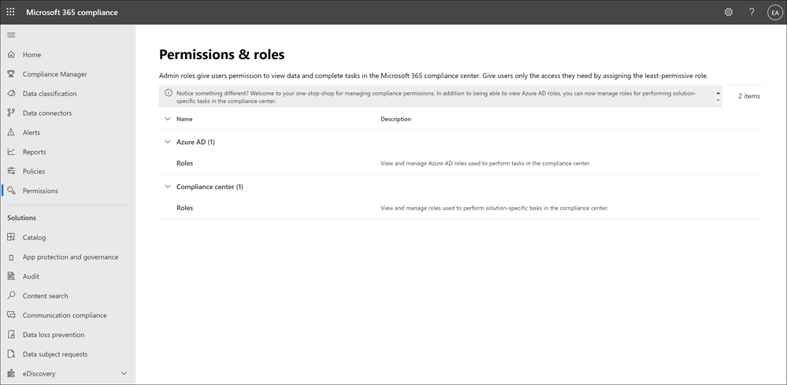

# Autorizzazioni nel Centro Microsoft 365 conformitàPermissions in the Microsoft 365 compliance center

Il Microsoft 365 conformità è stato aggiornato di recente e ora supporta la gestione diretta delle autorizzazioni per gli utenti che eseguono attività di conformità in Microsoft 365.The Microsoft 365 compliance center has been recently updated and now supports directly  managing permissions for users who perform compliance tasks in Microsoft 365. Questo aggiornamento significa che non sarà più necessario utilizzare il Centro sicurezza & Office 365 conformità per gestire le autorizzazioni per le soluzioni di conformità.This update means you'll no longer have to use the Office 365 Security & Compliance Center to manage permissions for compliance solutions. Utilizzando la  nuova pagina Autorizzazioni nel Centro conformità di Microsoft 365, è possibile gestire le autorizzazioni per gli utenti per le attività di conformità in funzionalità come la gestione dei dispositivi, la prevenzione della perdita dei dati, eDiscovery, la gestione dei rischi insider, la conservazione e molti altri.Using the new **Permissions** page in the Microsoft 365 compliance center, you can manage permissions to users for compliance tasks in features like device management, data loss prevention, eDiscovery, insider risk management, retention, and many others. Gli utenti possono eseguire solo le attività di conformità a cui si concede esplicitamente l'accesso.Users can perform only the compliance tasks that you explicitly grant them access to.

Per visualizzare la scheda Autorizzazioni nel Centro conformità Microsoft 365, gli utenti devono essere  un amministratore globale o disporre  del ruolo Gestione ruoli (un ruolo viene assegnato solo al gruppo di ruoli Gestione organizzazione). To view the **Permissions** tab in the Microsoft 365 compliance center, users need to be a global administrator or need to be assigned the *Role Management* role (a role is assigned only to the *Organization Management* role group). Il *ruolo Gestione ruoli* consente agli utenti di visualizzare, creare e modificare gruppi di ruoli.The *Role Management* role allows users to view, create, and modify role groups.

Le autorizzazioni nel Microsoft 365 conformità si basano sul modello di autorizzazioni RBAC (Role-Based Access Control).Permissions in the Microsoft 365 compliance center are based on the role-based access control (RBAC) permissions model. RBAC è lo stesso modello di autorizzazioni utilizzato dalla maggior parte dei servizi Microsoft 365, quindi se si ha familiarità con la struttura delle autorizzazioni in questi servizi, la concessione delle autorizzazioni nel Centro conformità di Microsoft 365 sarà familiare.RBAC is the same permissions model that's used by most Microsoft 365 services, so if you're familiar with the permission structure in these services, granting permissions in the Microsoft 365 compliance center will be familiar. È importante ricordare che le autorizzazioni gestite nel centro Microsoft 365 conformità non coprono la gestione di tutte le autorizzazioni necessarie in ogni singolo servizio.It's important to remember that the permissions managed in the Microsoft 365 compliance center don't cover the management of all the permissions needed in each individual service. Sarà comunque necessario gestire determinate autorizzazioni specifiche del servizio nell'interfaccia di amministrazione per il servizio specifico.You'll still need to manage certain service-specific permissions in the admin center for the specific service. Ad esempio, se è necessario assegnare le autorizzazioni per l'archiviazione, il controllo e i criteri di conservazione, è necessario gestire queste autorizzazioni nell'interfaccia di amministrazione di Exchange.For example, if you need to assign permissions for archiving, auditing, and retention policies, you'll need to manage these permissions in the Exchange admin center.

## Relazione tra membri, ruoli e gruppi di ruoliRelationship of members, roles, and role groups

Un ruolo concede le autorizzazioni per eseguire un set di attività. ad esempio, il ruolo Gestione casi consente agli utenti di utilizzare i casi di eDiscovery.A role grants permissions to do a set of tasks; for example, the Case Management role lets users work with eDiscovery cases.

Un gruppo di ruoli è un set di ruoli che consentono agli utenti di eseguire le proprie attività nelle soluzioni di conformità nel centro Microsoft 365 conformità.A role group is a set of roles that enable users do their jobs across compliance solutions the Microsoft 365 compliance center. Ad esempio, aggiungendo utenti al gruppo di ruoli *Insider Risk Management,* amministratori, analisti, investigatori e revisori designati vengono configurati per le autorizzazioni necessarie per la gestione dei rischi insider in un singolo gruppo.For example, by adding users to the *Insider Risk Management* role group, designated administrators, analysts, investigators, and auditors are configured for the necessary insider risk management permissions in a single group. Il Microsoft 365 conformità include gruppi di ruoli predefiniti per attività e funzioni per ogni soluzione di conformità a cui sarà necessario assegnare gli utenti.The Microsoft 365 compliance center includes default role groups for tasks and functions for each compliance solution that you'll need to assign people to. In genere, è consigliabile aggiungere semplicemente singoli utenti come membri ai gruppi di ruoli di conformità predefiniti in base alle esigenze.Generally, we recommend simply adding individual users as members to the default compliance role groups as needed.

## Autorizzazioni necessarie per usare le funzionalità nel Centro Microsoft 365 conformitàPermissions needed to use features in the Microsoft 365 compliance center

Per visualizzare tutti i gruppi di ruoli predefiniti disponibili nel Centro conformità Microsoft 365 e i ruoli assegnati ai gruppi di ruoli per impostazione predefinita, vedere autorizzazioni nel Centro sicurezza [& conformità.](/microsoft-365/security/office-365-security/permissions-in-the-security-and-compliance-center)To view all of the default role groups that are available in the Microsoft 365 compliance center and the roles that are assigned to the role groups by default, see the [Permissions in the Security & Compliance Center](/microsoft-365/security/office-365-security/permissions-in-the-security-and-compliance-center).

La gestione delle autorizzazioni nel Microsoft 365 conformità consente agli utenti di accedere solo alle funzionalità di conformità disponibili nel Centro Microsoft 365 conformità.Managing permissions in the Microsoft 365 compliance center only gives users access to the compliance features that are available within the Microsoft 365 compliance center. Se si desidera concedere autorizzazioni ad altre funzionalità non presenti nel Centro conformità Microsoft 365, ad esempio le regole del flusso di posta di Exchange (note anche come regole di trasporto), è necessario utilizzare l'interfaccia di amministrazione di Exchange.If you want to grant permissions to other features that aren't in the Microsoft 365 compliance center, such as Exchange mail flow rules (also known as transport rules), you'll need to use the Exchange admin center.

## Ruoli di Azure nel Centro Microsoft 365 conformitàAzure roles in the Microsoft 365 compliance center

I ruoli visualizzati nella sezione **Ruoli di Azure AD** della pagina Autorizzazioni del Centro Microsoft 365 conformità sono Azure Active Directory  >   ruoli. The roles that appear in the **Azure AD** > **Roles** section of the Microsoft 365 compliance center **Permissions** page are Azure Active Directory roles. Tali ruoli sono progettati per uniformarsi alle funzioni lavorative nel gruppo IT della propria organizzazione, semplificando quindi l'assegnazione di autorizzazioni necessarie per svolgere il lavoro.These roles are designed to align with job functions in your organization's IT group, making it easy to give a person all the permissions necessary to get their job done. È possibile visualizzare gli utenti attualmente assegnati a ogni ruolo selezionando un ruolo di amministratore e visualizzando i dettagli del pannello dei ruoli.You can view the users currently assigned to each role by selecting an Admin role and viewing the role panel details. Per gestire i membri di un ruolo di Azure AD, selezionare Gestisci membri in Azure AD.To manage members of an Azure AD role, select Manage members in Azure AD. Questa scelta reindirizza l'utente al portale di gestione di Azure.This choice redirects you to the Azure management portal.

|RuoloRole|DescrizioneDescription|
|:---|:----------|
|**Amministratore globale****Global administrator**|Ha accesso a tutte le funzionalità amministrative presenti in ogni servizio di Microsoft 365.Access to all administrative features in all Microsoft 365 services. Solo gli amministratori globali possono assegnare altri ruoli di amministratore.Only global administrators can assign other administrator roles. Per altre informazioni, vedere [Amministratore globale / Amministratore aziendale](/azure/active-directory/roles/permissions-reference#global-administrator--company-administrator).For more information, see [Global Administrator / Company Administrator](/azure/active-directory/roles/permissions-reference#global-administrator--company-administrator).|
|**Amministratore dati di conformità****Compliance data administrator**|Tiene traccia dei dati dell'organizzazione su Microsoft 365, si assicura che siano protetti e ottiene informazioni dettagliate su eventuali problemi, in modo da attenuarne i rischi.Keep track of your organization's data across Microsoft 365, make sure it's protected, and get insights into any issues to help mitigate risks. Per ulteriori informazioni, vedere [Amministratore dati di conformità](/azure/active-directory/roles/permissions-reference#compliance-data-administrator).For more information, see [Compliance Data Administrator](/azure/active-directory/roles/permissions-reference#compliance-data-administrator).|
|**Amministratore di conformità****Compliance administrator**|Aiuta l'organizzazione a rimanere conforme ai requisiti normativi, gestire i casi di eDiscovery e mantenere i criteri di governance dei dati nelle posizioni, identità e app di Microsoft 365.Help your organization stay compliant with any regulatory requirements, manage eDiscovery cases, and maintain data governance policies across Microsoft 365 locations, identities, and apps. Per ulteriori informazioni, vedere [Amministratore di conformità](/azure/active-directory/roles/permissions-reference#compliance-administrator).For more information, see [Compliance Administrator](/azure/active-directory/roles/permissions-reference#compliance-administrator).|
|**Operatore della sicurezza****Security operator**|Può visualizzare, analizzare e rispondere alle minacce attive a utenti, dispositivi e contenuti di Microsoft 365.View, investigate, and respond to active threats to your Microsoft 365 users, devices, and content. Per altre informazioni, vedere [Operatore della sicurezza](/azure/active-directory/roles/permissions-reference#security-operator).For more information, see [Security Operator](/azure/active-directory/roles/permissions-reference#security-operator).|
|**Ruolo con autorizzazioni di lettura per la sicurezza****Security reader**|Può visualizzare, analizzare e rispondere alle minacce attive a utenti, dispositivi e contenuti di Microsoft 365 ma, a differenza del ruolo di Operatore della sicurezza, non ha le autorizzazioni necessarie per intervenire.View and investigate active threats to your Microsoft 365 users, devices, and content, but (unlike the Security operator) they do not have permissions to respond by taking action. Per altre informazioni, vedere [Ruolo con autorizzazioni di lettura per la sicurezza](/azure/active-directory/roles/permissions-reference#security-reader).For more information, see [Security Reader](/azure/active-directory/roles/permissions-reference#security-reader).|
|**Amministratore della sicurezza****Security administrator**|Può controllare la sicurezza complessiva dell'organizzazione gestendo i criteri di sicurezza, esaminando l'analisi e i report della sicurezza nei prodotti di Microsoft 365 e tenendosi informato sul panorama delle minacce.Control your organization's overall security by managing security policies, reviewing security analytics and reports across Microsoft 365 products, and staying up-to-speed on the threat landscape. Per altre informazioni, vedere [Amministratore di sicurezza](/azure/active-directory/roles/permissions-reference#security-administrator).For more information, see [Security Administrator](/azure/active-directory/roles/permissions-reference#security-administrator).|
|**Ruolo con autorizzazioni di lettura globali****Global reader**|La versione di sola lettura del ruolo **Amministratore globale**.The read-only version of the **Global administrator** role. Può visualizzare tutte le impostazioni e le informazioni amministrative in Microsoft 365.View all settings and administrative information across Microsoft 365. Per altre informazioni, vedere [Ruolo con autorizzazioni di lettura globali](/azure/active-directory/roles/permissions-reference#global-reader).For more information, see [Global Reader](/azure/active-directory/roles/permissions-reference#global-reader).|
|**Amministratore della simulazione di attacco****Attack simulation administrator**|Creare e gestire tutti gli aspetti della creazione della simulazione di attacco, dell'avvio/pianificazione di una simulazione e della revisione dei risultati della simulazione.Create and manage all aspects of attack simulation creation, launch/scheduling of a simulation, and the review of simulation results. Per ulteriori informazioni, vedere [Attack Simulation Administrator.](/azure/active-directory/roles/permissions-reference#attack-simulation-administrator)For more information, see [Attack Simulation Administrator](/azure/active-directory/roles/permissions-reference#attack-simulation-administrator).|
|**Autore payload di attacco****Attack payload author**|Crea payload di attacco ma non avviali o pianificali.Create attack payloads but not actually launch or schedule them. Per ulteriori informazioni, vedere [Autore payload di attacco.](/azure/active-directory/roles/permissions-reference#attack-payload-author)For more information, see [Attack Payload Author](/azure/active-directory/roles/permissions-reference#attack-payload-author).|
|

## Aggiungere utenti a un gruppo di ruoli di conformitàAdd users to a compliance role group

Completare la procedura seguente per aggiungere utenti a un gruppo di ruoli di conformità:Complete the following steps to add users to a compliance role group:

1. Accedere all'area delle autorizzazioni del [Centro Microsoft 365 conformità](https://compliance.microsoft.com/permissions) usando le credenziali per un account amministratore nell'organizzazione Microsoft 365 aziendale.Sign into the permissions area of the [Microsoft 365 compliance center](https://compliance.microsoft.com/permissions) using credentials for an admin account in your Microsoft 365 organization.
2. Nel Centro Microsoft 365 conformità passare a **Autorizzazioni**.In the Microsoft 365 compliance center, go to **Permissions**. Selezionare il collegamento per visualizzare e gestire i ruoli di conformità in Microsoft 365.Select the link to view and manage compliance roles in Microsoft 365.
3. Espandere la **sezione Centro conformità** e selezionare **Ruoli**.Expand the **Compliance center** section and select **Roles**.
4. Nella pagina **Ruoli centro conformità** selezionare un gruppo di ruoli di conformità a cui si desidera aggiungere utenti, quindi selezionare Modifica gruppo **di** ruoli nel riquadro dei dettagli.On the **Compliance center roles** page, select a compliance role group you want to add users to, then select **Edit role group** on the details pane.
5. Selezionare **Scegli membri** nel riquadro di spostamento sinistro, quindi selezionare **Modifica.**Select **Choose members** from the left navigation pane, then select **Edit**.
6. Selezionare **Aggiungi** e quindi selezionare la casella di controllo per tutti gli utenti che si desidera aggiungere al gruppo di ruoli.Select **Add** and then select the checkbox for all users you want to add to the role group.
7. Selezionare **Aggiungi**, quindi **Fine**.Select **Add**, then select **Done**.
8. Selezionare **Salva** per aggiungere gli utenti al gruppo di ruoli.Select **Save** to add the users to the role group. Selezionare **Chiudi** per completare la procedura.Select **Close** to complete the steps.

## Rimuovere utenti da un gruppo di ruoli di conformitàRemove users from a compliance role group

Completare la procedura seguente per rimuovere gli utenti da un gruppo di ruoli di conformità:Complete the following steps to remove users from a compliance role group:

1. Accedere all'area delle autorizzazioni del [Centro Microsoft 365 conformità](https://compliance.microsoft.com/permissions) usando le credenziali per un account amministratore nell'organizzazione Microsoft 365 aziendale.Sign into the permissions area of the [Microsoft 365 compliance center](https://compliance.microsoft.com/permissions) using credentials for an admin account in your Microsoft 365 organization.
2. Nel Centro Microsoft 365 conformità passare a **Autorizzazioni**.In the Microsoft 365 compliance center, go to **Permissions**. Selezionare il collegamento per visualizzare e gestire i ruoli di conformità in Microsoft 365.Select the link to view and manage compliance roles in Microsoft 365.
3. Espandere la sezione Centro conformità e selezionare **Ruoli**.Expand the Compliance center section and select **Roles**.
4. Nella pagina **Ruoli centro** conformità selezionare un gruppo di ruoli di conformità da cui si desidera rimuovere gli utenti, quindi selezionare Modifica gruppo **di ruoli** nel riquadro dei dettagli.On the **Compliance center roles** page, select a compliance role group you want to remove users from, then select **Edit role group** on the details pane.
5. Selezionare **Scegli membri** nel riquadro di spostamento sinistro, quindi selezionare **Modifica.**Select **Choose members** from the left navigation pane, then select **Edit**.
6. Selezionare **Rimuovi** e quindi selezionare la casella di controllo per tutti gli utenti che si desidera rimuovere dal gruppo di ruoli.Select **Remove** and then select the checkbox for all users you want to remove from the role group.
7. Selezionare **Rimuovi** e quindi **Fare clic su Fine.**Select **Remove**, then select **Done**.
8. Selezionare **Salva** per rimuovere gli utenti dal gruppo di ruoli.Select **Save** to remove the users from the role group. Selezionare **Chiudi** per completare la procedura.Select **Close** to complete the steps.
