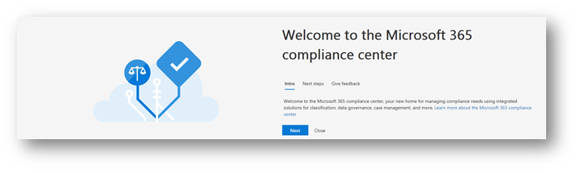
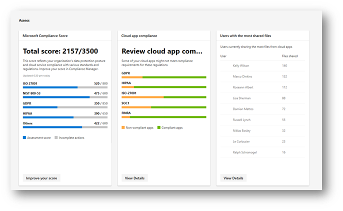
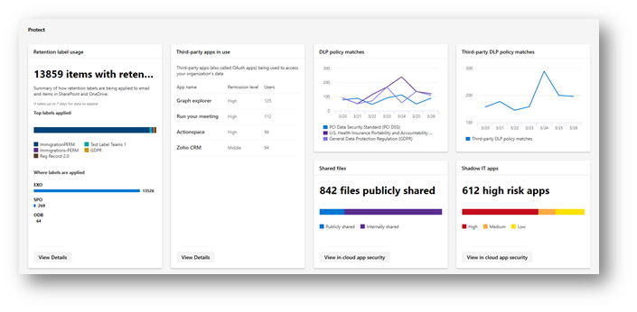
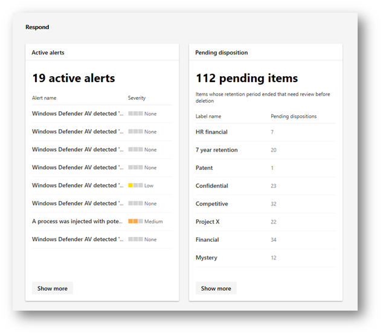
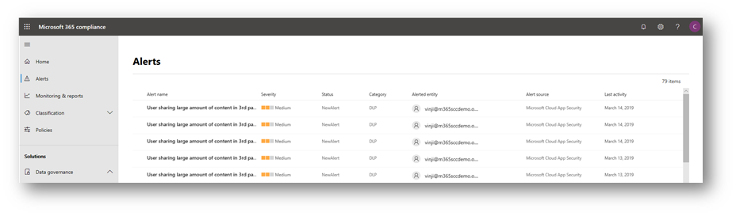
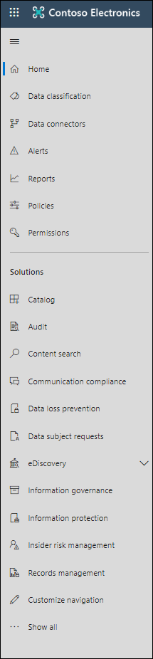
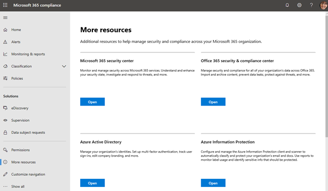

# Panoramica del nuovo centro conformità Microsoft 365Overview of the all-new Microsoft 365 compliance center

## PanoramicaOverview

Se si è interessati alla postura di conformità dell'organizzazione, sarà possibile amare il nuovo [centro conformità Microsoft 365](https://compliance.microsoft.com).If you're interested in your organization's compliance posture, you're going to love the new [Microsoft 365 compliance center](https://compliance.microsoft.com). Microsoft 365 Compliance Center consente di accedere facilmente ai dati e agli strumenti necessari per gestire le esigenze di conformità dell'organizzazione.The Microsoft 365 compliance center provides easy access to the data and tools you need to manage to your organization's compliance needs. 

Leggere questo articolo per acquisire familiarità con il centro conformità Microsoft 365, [come ottenerlo](#how-do-i-get-this), le [domande frequenti](#frequently-asked-questions)e i [passaggi successivi](#next-steps).Read this article to get acquainted with the Microsoft 365 compliance center, [how to get it](#how-do-i-get-this), [frequently asked questions](#frequently-asked-questions), and your [next steps](#next-steps).

## Conformità a Microsoft 365 ComplianceWelcome to Microsoft 365 compliance

Quando si passa al centro conformità Microsoft 365 per la prima volta, viene visualizzato il messaggio di benvenuto seguente:When you go to your Microsoft 365 compliance center for the first time, you'll be greeted with the following welcome message:

Il banner di benvenuto fornisce alcuni suggerimenti su come iniziare, con i passaggi successivi e un invito a darci un feedback.The welcome banner gives you some pointers on how to get started, with next steps and an invitation for you to give us feedback.

## La sezione valutazioneThe Assess section

La sezione **valutazione** nella Home page Visualizza a colpo d'occhio la modalità di esecuzione dell'organizzazione in relazione alla [protezione dei dati e alla conformità](protect-access-to-data-and-services.md).The **Assess** section on the home page shows you at a glance how your organization is doing with respect to [data protection and compliance](protect-access-to-data-and-services.md).

Da qui, è possibile accedere alla scheda Punteggio di conformità di Microsoft, che porta a [Compliance Manager](meet-data-protection-and-regulatory-reqs-using-microsoft-cloud.md), in cui è possibile rivedere o modificare le configurazioni e potenzialmente migliorare il Punteggio di conformità globale.From here, you can go to the Microsoft Compliance Score card, which leads you to [Compliance Manager](meet-data-protection-and-regulatory-reqs-using-microsoft-cloud.md), where you can review or edit your configurations and potentially improve your overall compliance score.

Verranno visualizzate altre schede, ad esempio una che mostra la conformità dell'app cloud dell'organizzazione e un'altra che mostra i dati relativi agli utenti con file condivisi, con collegamenti a [cloud app Security](https://docs.microsoft.com/cloud-app-security/) o altri strumenti in cui è possibile esplorare i dati.You'll see additional cards, such as one showing your organization's cloud app compliance, and another showing data about users with shared files, with links to [Cloud App Security](https://docs.microsoft.com/cloud-app-security/) or other tools where you can explore data.

## Sezione ProtectThe Protect section

La sezione **Proteggi** nella Home page contiene schede che forniscono informazioni di alto livello sulle [etichette](labels.md), la prevenzione della [perdita di dati (DLP)](data-loss-prevention-policies.md), le app di terze parti in uso, i file condivisi, le applicazioni it Shadow e così via.The **Protect** section on the home page contains cards that provide you with high-level information about [labels](labels.md), [data loss prevention (DLP)](data-loss-prevention-policies.md), third-party apps in use, shared files, shadow IT apps, and so on. 

Ogni scheda ha un collegamento a un report o informazioni aggiuntive in cui è possibile ottenere ulteriori dettagli.Each card has a link to a report or additional information where you can learn more.

## La sezione RispondiThe Respond section

La sezione **Rispondi** nella Home Page consente di visualizzare gli [avvisi](/security/office-365-security/alerts.md) e le [disposizioni in sospeso](disposition-reviews.md) che si desidera esaminare e potenzialmente agire.The **Respond** section on the home page surfaces [alerts](/security/office-365-security/alerts.md) and [pending dispositions](disposition-reviews.md) that you'll want to review and potentially act upon.

Le schede, ad esempio la scheda [avvisi attivi](/security/office-365-security/alerts.md) , includono un collegamento a una pagina in cui è possibile visualizzare informazioni più dettagliate, ad esempio la gravità, lo stato, la categoria e altro ancora.Cards, such as the [Active alerts](/security/office-365-security/alerts.md) card, include a link to a page where you can view more detailed information, such as Severity, Status, Category, and more.

 

## Semplificazione della navigazione verso caratteristiche e funzionalità di conformitàEasy navigation to more compliance features and capabilities

Oltre ai collegamenti nelle schede nella Home page, è disponibile un riquadro di spostamento a sinistra dello schermo che consente di accedere facilmente agli [avvisi](/security/office-365-security/alerts.md), ai [report](reports-in-security-and-compliance.md), ai [criteri](alert-policies.md), alle soluzioni di conformità e altro ancora.In addition to links in cards on the home page, you'll find a navigation pane on the left side of the screen that gives you easy access to your [alerts](/security/office-365-security/alerts.md), [reports](reports-in-security-and-compliance.md), [policies](alert-policies.md), compliance solutions, and more. 

|  |  |
|---------|---------|
|  |   Passare a **avvisi** per visualizzare e risolvere gli [avvisi](/security/office-365-security/alerts.md)Go to **Alerts** to view and resolve [alerts](/security/office-365-security/alerts.md)  Visitare i **report** per visualizzare i dati relativi all' [utilizzo e alla conservazione delle etichette](sensitivity-labels.md), alle [corrispondenze e alle sostituzioni dei criteri DLP](view-the-dlp-reports.md), ai [file condivisi](https://docs.microsoft.com/cloud-app-security/file-filters), alle [app di terze parti in uso](https://docs.microsoft.com/cloud-app-security/discovered-apps)e altro ancora.Visit **Reports** to view data about [label usage and retention](sensitivity-labels.md), [DLP policy matches and overrides](view-the-dlp-reports.md), [shared files](https://docs.microsoft.com/cloud-app-security/file-filters), [third-party apps in use](https://docs.microsoft.com/cloud-app-security/discovered-apps), and more.  Espandere la sezione **classificazione** per accedere alle [etichette](labels.md), ai [criteri di etichetta](sensitivity-labels.md#what-label-policies-can-do), ai tipi di [informazioni riservate](what-the-sensitive-information-types-look-for.md)e all' [analisi](view-label-activity-for-documents.md)delle etichette.Expand the **Classification** section to access your [labels](labels.md), [label policies](sensitivity-labels.md#what-label-policies-can-do), [sensitive information types](what-the-sensitive-information-types-look-for.md), and [label analytics](view-label-activity-for-documents.md).  Andare a **criteri** per visualizzare gli [avvisi](/security/office-365-security/alerts.md) e per accedere ai criteri di [conservazione](retention-policies.md) e [DLP](data-loss-prevention-policies.md) .Go to **Policies** to view [alerts](/security/office-365-security/alerts.md) and to access your [DLP](data-loss-prevention-policies.md) and [retention](retention-policies.md) policies.   Utilizzare i collegamenti nella sezione **Solutions** per accedere alle soluzioni di conformità dell'organizzazione.Use the links in the **Solutions** section to access your organization's compliance solutions. Queste funzionalità sono:These include:  [Disposizioni sulla governance dei dati >Data governance > Dispositions](disposition-reviews.md) [eDiscoveryeDiscovery](overview-ediscovery-20.md) [SupervisioneSupervision](supervision-policies.md) [Indagini sui datiData investigations](overview-data-investigations.md) [Richieste dell'interessatoData subject requests](manage-gdpr-data-subject-requests-with-the-dsr-case-tool.md)        |

## Come si ottiene questo?How do I get this?

- Se non si dispone già del nuovo centro conformità di Microsoft 365, lo si avrà al più presto.If you don't have the new Microsoft 365 compliance center already, you will have it soon. Il [nuovo centro conformità Microsoft 365](/security/office-365-security/microsoft-security-and-compliance.md#microsoft-365-compliance-center) sarà generalmente disponibile.The [new Microsoft 365 compliance center](/security/office-365-security/microsoft-security-and-compliance.md#microsoft-365-compliance-center) will be generally available now.

- Per visitare il centro conformità di Microsoft 365, come amministratore globale o amministratori della conformità, accedere [https://compliance.microsoft.com](https://compliance.microsoft.com) a e accedere.To visit the Microsoft 365 compliance center, as a global administrator or compliance administrator, go to [https://compliance.microsoft.com](https://compliance.microsoft.com) and sign in. 

- Per ulteriori informazioni sui requisiti, vedere [licenze e autorizzazioni richieste](/security/office-365-security/microsoft-security-and-compliance.md#required-licenses-and-permissions).To learn more about requirements, see [Required licenses and permissions](/security/office-365-security/microsoft-security-and-compliance.md#required-licenses-and-permissions).

## Domande frequentiFrequently asked questions

### Perché sono state apportate al centro sicurezza & conformità di Office 365 per eseguire alcune attività, ad esempio la definizione di determinati criteri?Why am I taken to the Office 365 Security & Compliance Center to perform some tasks, such as defining certain policies?

È ancora in corso lo sviluppo del centro conformità Microsoft 365 e verranno aggiunte altre funzionalità e soluzioni nei prossimi mesi.We are still developing the Microsoft 365 compliance center, and we'll be adding more functionality and solutions over the coming months. Nel frattempo, sono presenti alcune attività che devono essere eseguite nel centro[https://protection.office.com](https://protection.office.com)sicurezza & conformità di Office 365.In the meantime, there are some tasks that must be performed in the Office 365 Security & Compliance Center ([https://protection.office.com](https://protection.office.com)). In questi casi, l'utente verrà indirizzato automaticamente al percorso in cui è possibile eseguire l'attività, ad esempio la creazione o la modifica di un criterio di supervisione.In those cases, you'll be directed automatically to the location where you can perform the task at hand, such as creating or editing a supervision policy.

### Perché non viene ancora visualizzato il nuovo centro conformità di Microsoft 365?Why don't I see the new Microsoft 365 compliance center yet?

Prima di tutto, assicurarsi di avere le [licenze e le autorizzazioni](/security/office-365-security/microsoft-security-and-compliance.md#required-licenses-and-permissions)appropriate.First, make sure you have the appropriate [licenses and permissions](/security/office-365-security/microsoft-security-and-compliance.md#required-licenses-and-permissions). Accedere quindi a [https://compliance.microsoft.com](https://compliance.microsoft.com).Then, sign in at [https://compliance.microsoft.com](https://compliance.microsoft.com). Se il nuovo centro conformità non è ancora disponibile, lo sarà presto.If you don't see the new compliance center yet, you will have it soon.

### Alcune delle funzionalità di conformità non sono disponibili nel centro conformità di Microsoft 365.Some of my compliance features are not available in the Microsoft 365 compliance center. What do I do?What do I do?

È ancora in aggiunta la funzionalità al centro conformità Microsoft 365.We are still adding functionality to the Microsoft 365 compliance center. Se non si riesce a trovare un elemento, ad esempio la ricerca del registro di controllo, utilizzare il centro[https://protection.office.com](https://protection.office.com)sicurezza & Compliance di Office 365.If you can't find something, such as audit log search, use the Office 365 Security & Compliance Center ([https://protection.office.com](https://protection.office.com)). Le configurazioni verranno salvate nel centro conformità & sicurezza di Office 365 e nel nuovo centro conformità di Microsoft 365 automaticamente.Your configurations will be saved in both the existing Office 365 Security & Compliance Center and in the new Microsoft 365 compliance center automatically.

Per accedere al centro conformità di Microsoft 365, nel riquadro di spostamento a sinistra dello schermo, scegliere **altre risorse**e quindi in **Centro protezione & conformità di Office 365**scegliere **Apri**.To go there, in the Microsoft 365 compliance center, in the navigation pane on the left side of the screen, choose **More resources**, and then, under **Office 365 security & compliance center**, choose **Open**.

## Passaggi successiviNext steps

- **Esaminare il Punteggio di conformità di Microsoft**e utilizzare Compliance Manager per migliorare il punteggio.**Review your Microsoft Compliance Score**, and use Compliance Manager to improve your score. Per ulteriori informazioni, vedere [utilizzare Compliance Manager per soddisfare i requisiti normativi e di protezione dei dati quando si utilizzano i servizi cloud Microsoft](meet-data-protection-and-regulatory-reqs-using-microsoft-cloud.md).To learn more, see [Use Compliance Manager to help meet data protection and regulatory requirements when using Microsoft cloud services](meet-data-protection-and-regulatory-reqs-using-microsoft-cloud.md).

- **Esaminare i criteri di prevenzione della perdita dei dati dell'organizzazione** e apportare le modifiche necessarie in base alle esigenze.**Review your organization's Data Loss Prevention policies** and make required adjustments as necessary. Per ulteriori informazioni, vedere [Panoramica dei criteri di prevenzione della perdita di dati](data-loss-prevention-policies.md).To learn more about, see [Overview of data loss prevention policies](data-loss-prevention-policies.md). 

- **Familiarizzare e configurare Microsoft cloud app Security**.**Get acquainted with and set up Microsoft Cloud App Security**. Vedere [Guida introduttiva: Introduzione a Microsoft cloud app Security](https://docs.microsoft.com/cloud-app-security/getting-started-with-cloud-app-security).See [Quickstart: Get started with Microsoft Cloud App Security](https://docs.microsoft.com/cloud-app-security/getting-started-with-cloud-app-security).  

- **Visitare il centro conformità Microsoft 365 spesso**e verificare eventuali avvisi o potenziali rischi che potrebbero verificarsi.**Visit your Microsoft 365 compliance center often**, and make sure to review any alerts or potential risks that might arise. Accedere a [https://compliance.microsoft.com](https://compliance.microsoft.com) e accedere.Go to [https://compliance.microsoft.com](https://compliance.microsoft.com) and sign in.