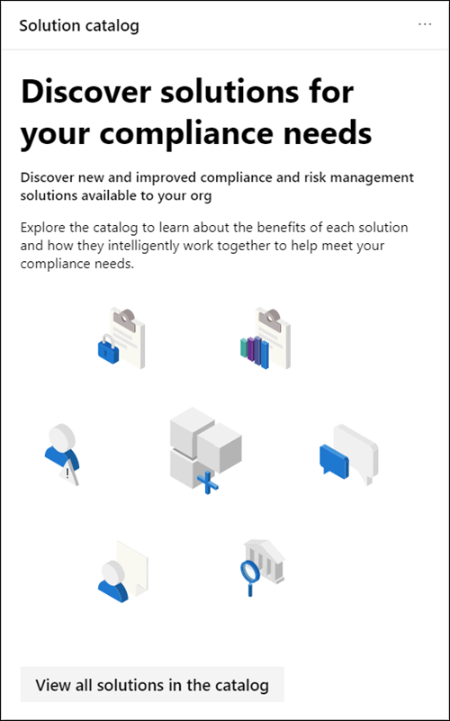

# Centro conformità Microsoft 365Microsoft 365 compliance center

Se si è interessati alla postura di conformità dell'organizzazione, è necessario amare il [centro conformità di Microsoft 365](https://compliance.microsoft.com).If you're interested in your organization's compliance posture, you're going to love the [Microsoft 365 compliance center](https://compliance.microsoft.com). Microsoft 365 Compliance Center consente di accedere facilmente ai dati e agli strumenti necessari per gestire le esigenze di conformità dell'organizzazione.The Microsoft 365 compliance center provides easy access to the data and tools you need to manage to your organization's compliance needs.

Leggere questo articolo per acquisire familiarità con il centro conformità Microsoft 365, [come ottenerlo](#how-do-i-get-the-compliance-center), le [domande frequenti](#frequently-asked-questions)e i [passaggi successivi](#next-steps).Read this article to get acquainted with the Microsoft 365 compliance center, [how to get it](#how-do-i-get-the-compliance-center), [frequently asked questions](#frequently-asked-questions), and your [next steps](#next-steps).

## Conformità a Microsoft 365 ComplianceWelcome to Microsoft 365 compliance

Quando si passa al centro conformità Microsoft 365 per la prima volta, si è accolti con il seguente messaggio di benvenuto:When you go to your Microsoft 365 compliance center for the first time, you're greeted with the following welcome message:

Il banner di benvenuto fornisce alcuni suggerimenti su come iniziare, con i passaggi successivi e un invito a darci un feedback.The welcome banner gives you some pointers on how to get started, with next steps, and an invitation for you to give us feedback.

## Sezione SchedaCard section

Quando si visita per la prima volta il centro conformità di Microsoft 365, nella sezione scheda della Home page viene illustrato come l'organizzazione sta eseguendo la conformità ai dati, quali sono le soluzioni disponibili per la propria organizzazione e un riepilogo di tutti gli avvisi attivi.When you first visit the Microsoft 365 compliance center, the card section on the home page shows you at a glance how your organization is doing with data compliance, what solutions are available for your organization, and a summary of any active alerts.

Da qui, è possibile:From here, you can:

- Esaminare la scheda **Microsoft Compliance Manager** , che consente di eseguire la soluzione [Compliance Manager](compliance-manager.md) .Review the **Microsoft Compliance Manager** card, which leads you to the [Compliance Manager](compliance-manager.md) solution. Compliance Manager consente di semplificare il modo in cui gestire la conformità.Compliance Manager helps simplify the way you manage compliance. Calcola un punteggio basato sui rischi misurando lo stato di avanzamento verso il completamento delle azioni consigliate che contribuiscono alla riduzione dei rischi per la protezione dei dati e gli standard normativi.It calculates a risk-based score measuring your progress toward completing recommended actions that help reduce risks around data protection and regulatory standards. Fornisce inoltre funzionalità per il flusso di lavoro e il mapping del controllo incorporato che consentono di eseguire efficacemente azioni di miglioramento.It also provides workflow capabilities and built-in control mapping to help you efficiently carry out improvement actions.

    

- Esaminare la nuova scheda di **Catalogo della soluzione** , che collega a raccolte di [soluzioni integrate](microsoft-365-solution-catalog.md) che è possibile utilizzare per gestire gli scenari di conformità end-to-end.Review the new **Solution catalog** card, which links to collections of [integrated solutions](microsoft-365-solution-catalog.md) you can use to help you manage end-to-end compliance scenarios. Le funzionalità e gli strumenti di una soluzione possono includere una combinazione di criteri, avvisi, report e altro ancora.A solution's capabilities and tools might include a combination of policies, alerts, reports, and more.

    

- Esaminare la scheda **avvisi attivi** , che include un riepilogo degli avvisi più [attivi](alert-policies.md) e include un collegamento in cui è possibile visualizzare informazioni più dettagliate, ad esempio la gravità, lo stato, la categoria e altro ancora.Review the **Active alerts** card, which includes a summary of the most [active alerts](alert-policies.md) and includes a link where you can view more detailed information, such as Severity, Status, Category, and more.

    

È inoltre possibile utilizzare la funzionalità **Aggiungi schede** per aggiungere altre schede, ad esempio una che mostra la conformità delle app cloud dell'organizzazione e un'altra che mostra i dati relativi agli utenti con file condivisi, con collegamenti a [cloud app Security](https://docs.microsoft.com/cloud-app-security/) o altri strumenti in cui è possibile esplorare i dati.You can also use the **Add cards** feature to add additional cards, such as one showing your organization's cloud app compliance, and another showing data about users with shared files, with links to [Cloud App Security](https://docs.microsoft.com/cloud-app-security/) or other tools where you can explore data.

## Semplificazione della navigazione verso caratteristiche e funzionalità di conformitàEasy navigation to more compliance features and capabilities

Oltre ai collegamenti nelle schede nella Home page, viene visualizzato un riquadro di spostamento a sinistra dello schermo che consente di accedere facilmente agli [avvisi](../security/office-365-security/alerts.md), ai [report](reports-in-security-and-compliance.md), ai [criteri](alert-policies.md), alle soluzioni di conformità e altro ancora.In addition to links in cards on the home page, you'll see a navigation pane on the left side of the screen that gives you easy access to your [alerts](../security/office-365-security/alerts.md), [reports](reports-in-security-and-compliance.md), [policies](alert-policies.md), compliance solutions, and more. Per aggiungere o rimuovere le opzioni per un riquadro di spostamento personalizzato, utilizzare il controllo di **spostamento Personalizza** nel riquadro di spostamento.To add or remove options for a customized navigation pane, use the **Customize navigation** control on the navigation pane. Vengono aperte le impostazioni di **personalizzazione del riquadro di spostamento** , in modo che sia possibile configurare gli elementi visualizzati nel riquadro di spostamento.This opens the **Customize your navigation pane** settings so you can configure which items appear in the navigation pane.

|  |  |
|---------|---------|
|  | Selezionare **Home** per tornare alla pagina principale del centro conformità di Microsoft 365.Select **Home** to return to the Microsoft 365 compliance center main page.   Visitare **Compliance Manager** per controllare il Punteggio di conformità e iniziare a [gestire la conformità](compliance-manager.md) per l'organizzazione.Visit **Compliance Manager** to check your compliance score and start [managing compliance](compliance-manager.md) for your organization.    Selezionare la sezione **classificazione dei dati** per accedere ai [classificatori addestrabili](classifier-learn-about.md), alle [definizioni di entità del tipo di informazioni riservate](sensitive-information-type-entity-definitions.md), agli esploratori di contenuto e [attività](data-classification-activity-explorer.md) .Select the **Data classification** section to access [trainable classifiers](classifier-learn-about.md), [Sensitive information type entity definitions](sensitive-information-type-entity-definitions.md), content and [activity](data-classification-activity-explorer.md) explorers.    Selezionare **connettori dati** per [configurare i connettori](archiving-third-party-data.md) per l'importazione e l'archiviazione dei dati nell'abbonamento a Microsoft 365.Select **Data connectors** to [configure connectors](archiving-third-party-data.md) to import and archive data in your Microsoft 365 subscription.    Passare a **avvisi** per visualizzare e risolvere gli [avvisi](alert-policies.md)Go to **Alerts** to view and resolve [alerts](alert-policies.md)   Visitare i **report** per visualizzare i dati relativi all' [utilizzo e alla conservazione delle etichette](sensitivity-labels.md), alle [corrispondenze e alle sostituzioni dei criteri DLP](view-the-dlp-reports.md), ai [file condivisi](https://docs.microsoft.com/cloud-app-security/file-filters), alle [app di terze parti in uso](https://docs.microsoft.com/cloud-app-security/discovered-apps)e altro ancora.Visit **Reports** to view data about [label usage and retention](sensitivity-labels.md), [DLP policy matches and overrides](view-the-dlp-reports.md), [shared files](https://docs.microsoft.com/cloud-app-security/file-filters), [third-party apps in use](https://docs.microsoft.com/cloud-app-security/discovered-apps), and more.    Passare ai **criteri** per impostare i criteri per la gestione dei dati, gestire i dispositivi e ricevere [avvisi](../security/office-365-security/alerts.md).Go to **Policies** to set up policies to govern data, manage devices, and receive [alerts](../security/office-365-security/alerts.md). È inoltre possibile accedere ai criteri di [conservazione](retention.md) e [DLP](data-loss-prevention-policies.md) .You can also access your [DLP](data-loss-prevention-policies.md) and [retention](retention.md) policies.   Selezionare le **autorizzazioni** per gestire gli utenti dell'organizzazione che dispongono dell'accesso al centro conformità Microsoft 365 per visualizzare il contenuto e completare le attività.Select **Permissions** to manage who in your organization has access to the Microsoft 365 compliance center to view content and complete tasks.    Utilizzare i collegamenti nella sezione **Solutions** per accedere alle soluzioni di conformità dell'organizzazione.Use the links in the **Solutions** section to access your organization's compliance solutions. Ad esempio:These include:    [CatalogoCatalog](microsoft-365-solution-catalog.md)   Scoprire, conoscere e iniziare a utilizzare le soluzioni di gestione dei rischi e la conformità intelligenti disponibili per la propria organizzazione.Discover, learn about, and start using the intelligent compliance and risk management solutions available to your organization.    [AuditAudit](search-the-audit-log-in-security-and-compliance.md)   Utilizzare il registro di controllo per esaminare i problemi di supporto e conformità comuni.Use the Audit log to investigate common support and compliance issues.    [Ricerca contenutoContent search](search-for-content.md)   Utilizzare la ricerca contenuto per trovare rapidamente messaggi di posta elettronica in cassette postali di Exchange, documenti in siti di SharePoint e posizioni di OneDrive e conversazioni di messaggistica istantanea in Microsoft teams e Skype for business.Use Content search to quickly find email in Exchange mailboxes, documents in SharePoint sites and OneDrive locations, and instant messaging conversations in Microsoft Teams and Skype for Business.    [Conformità delle comunicazioniCommunication compliance](communication-compliance.md)   Ridurre al minimo i rischi di comunicazione tramite l'acquisizione automatica dei messaggi inadeguati, l'analisi delle possibili violazioni di criteri e l'adozione di procedure per la correzione.Minimize communication risks by automatically capturing inappropriate messages, investigating possible policy violations, and taking steps to remediate.    [Indagini sui datiData investigations](overview-data-investigations.md)   Eseguire una ricerca tra percorsi di contenuto per identificare dati sensibili, dannosi o fuori luogo in Microsoft 365, in modo da poter esaminare e correggere eventuali incidenti, ad esempio la fuoriuscita di dati.Search across content locations to identify sensitive, malicious, or misplaced data across Microsoft 365 so you can investigate and remediate any incidents, such as data spillage.    [Prevenzione della perdita dei datiData loss prevention](data-loss-prevention-policies.md)   Individuare il contenuto sensibile utilizzato e condiviso nell'organizzazione, nel cloud e nei dispositivi, e consente di evitare la perdita accidentale dei dati.Detect sensitive content as it's used and shared throughout your organization, in the cloud and on devices, and helps prevent accidental data loss.    [Richieste dell'interessatoData subject requests](manage-gdpr-data-subject-requests-with-the-dsr-case-tool.md)   Individuare ed esportare i dati personali di un utente per rispondere alle richieste del soggetto dei dati per il regolamento generale sulla protezione dei dati (GDPR).Find and export a user's personal data to help you respond to data subject requests for the General Data Protection Regulation (GDPR).    [eDiscoveryeDiscovery](overview-ediscovery-20.md)   Espandere questa sezione per utilizzare le funzionalità di eDiscovery di base e avanzate per la conservazione, la raccolta, la revisione, l'analisi e l'esportazione di contenuto rispondente alle indagini interne ed esterne dell'organizzazione.Expand this section to use the core and Advanced eDiscovery for preserving, collecting, reviewing, analyzing, and exporting content that's responsive to your organization's internal and external investigations.    [Governance delle informazioniInformation governance](manage-information-governance.md)   Gestire il ciclo di vita del contenuto utilizzando le funzionalità per importare, archiviare e classificare i dati critici per le aziende in modo da poter mantenere ciò che è necessario ed eliminare ciò che non è possibile.Manage your content lifecycle using features to import, store, and classify business-critical data so you can keep what you need and delete what you don't.    [Protezione delle informazioniInformation protection](protect-information.md)   Individuare, classificare e proteggere il contenuto sensibile e critico per le aziende per tutto il suo ciclo di vita nell'organizzazione.Discover, classify, and protect sensitive and business-critical content throughout its lifecycle across your organization.    [Gestione dei rischi InsiderInsider risk management](insider-risk-management.md)   Individuare le attività rischiose nell'organizzazione per identificare rapidamente, indagare e intraprendere azioni sui rischi e le minacce Insider.Detect risky activity across your organization to help you quickly identify, investigate, and take action on insider risks and threats.    [Gestione recordRecords management](records-management.md)   Automatizzare e semplificare la pianificazione di conservazione per i record normativi, legali e aziendali critici nell'organizzazione.Automate and simplify the retention schedule for regulatory, legal and business-critical records in your organization.

## Come si ottiene il centro conformità?How do I get the compliance center?

- [! Nota] se non si dispone già del nuovo centro conformità di Microsoft 365, lo si avrà al più presto.If you don't have the new Microsoft 365 compliance center already, you'll have it soon. Microsoft 365 Compliance Center è in genere disponibile per i clienti di Microsoft 365 SKU.The Microsoft 365 compliance center is generally available now to Microsoft 365 SKU customers.

- Per visitare il centro conformità Microsoft 365, come amministratore globale, amministratore conformità o amministratore dei dati di conformità accedere [https://compliance.microsoft.com](https://compliance.microsoft.com) e accedere.To visit the Microsoft 365 compliance center, as a global administrator, compliance administrator, or compliance data administrator go to [https://compliance.microsoft.com](https://compliance.microsoft.com) and sign in.

## Domande frequentiFrequently asked questions

**Perché sono state apportate al centro sicurezza & Compliance per completare alcune attività, come la definizione di determinati criteri?****Why am I taken to the Security & Compliance Center to complete some tasks, such as defining certain policies?**

Si sta ancora sviluppando il centro conformità Microsoft 365 e si aggiungono ulteriori funzionalità e soluzioni nei prossimi mesi.We're still developing the Microsoft 365 compliance center, and we add more functionality and solutions over the coming months. Nel frattempo, ci sono alcune attività che devono essere completate nel centro sicurezza & Compliance ( [https://protection.office.com](https://protection.office.com) ).In the meantime, there are a few tasks that must be completed in the Security & Compliance Center ([https://protection.office.com](https://protection.office.com)). In questi casi, l'utente verrà indirizzato automaticamente al percorso in cui è possibile completare l'attività, ad esempio la creazione o la modifica di un criterio di supervisione.In those cases, you'll be directed automatically to the location where you can complete the task at hand, such as creating or editing a supervision policy.

**Perché non viene ancora visualizzato il nuovo centro conformità di Microsoft 365?****Why don't I see the new Microsoft 365 compliance center yet?**

Prima di tutto, assicurarsi di avere le licenze e le autorizzazioni appropriate.First, make sure that you have the appropriate licenses and permissions. Accedere quindi a [https://compliance.microsoft.com](https://compliance.microsoft.com) .Then, sign in at [https://compliance.microsoft.com](https://compliance.microsoft.com). Se non si vede ancora il nuovo centro conformità, lo si avrà presto.If you don't see the new compliance center yet, you'll have it soon.

**Alcune delle funzionalità di conformità non sono disponibili nel centro conformità di Microsoft 365. Cosa devo fare?****Some of my compliance features aren't available in the Microsoft 365 compliance center. What do I do?**

È ancora in aggiunta la funzionalità al centro conformità Microsoft 365.We're still adding functionality to the Microsoft 365 compliance center. Se non si riesce a trovare un elemento, ad esempio la ricerca del registro di controllo, utilizzare il Centro sicurezza & Compliance ( [https://protection.office.com](https://protection.office.com) ).If you can't find something, such as audit log search, use the Security & Compliance Center ([https://protection.office.com](https://protection.office.com)). Le configurazioni vengono salvate automaticamente nel centro sicurezza & Compliance esistente e nel nuovo centro conformità di Microsoft 365.Your configurations are saved in both the existing Security & Compliance Center and in the new Microsoft 365 compliance center automatically.

Per accedere al centro conformità di Microsoft 365, nel riquadro di spostamento a sinistra dello schermo, scegliere **altre risorse**e quindi in **Centro protezione & conformità di Office 365**scegliere **Apri**.To go there, in the Microsoft 365 compliance center, in the navigation pane on the left side of the screen, choose **More resources**, and then, under **Office 365 Security & Compliance Center**, choose **Open**.

## Passaggi successiviNext steps

- **Visitare Microsoft Compliance Manager** per visualizzare il Punteggio di conformità e iniziare a gestire la conformità per l'organizzazione.**Visit Microsoft Compliance Manager** to see your compliance score and start managing compliance for your organization. Per ulteriori informazioni, vedere [Compliance Manager](compliance-manager.md).To learn more, see [Compliance Manager](compliance-manager.md).

- **Configurare i criteri di gestione dei rischi Insider** per ridurre al minimo i rischi interni e consentire all'utente di rilevare, indagare e intraprendere azioni per attività rischiose nell'organizzazione.**Configure insider risk management policies** to help minimize internal risks and enable you to detect, investigate, and take action for risky activities in your organization. Vedere [gestione dei rischi Insider](insider-risk-management.md).See [Insider risk management](insider-risk-management.md).

- **Esaminare i criteri di prevenzione della perdita dei dati dell'organizzazione** e apportare le modifiche necessarie in base alle esigenze.**Review your organization's data loss prevention policies** and make required changes as necessary. Per ulteriori informazioni, vedere [Panoramica dei criteri di prevenzione della perdita di dati](data-loss-prevention-policies.md).To learn more about, see [Overview of data loss prevention policies](data-loss-prevention-policies.md).

- **Familiarizzare e configurare Microsoft cloud app Security**.**Get acquainted with and set up Microsoft Cloud App Security**. Vedere [Guida introduttiva: Introduzione a Microsoft cloud app Security](https://docs.microsoft.com/cloud-app-security/getting-started-with-cloud-app-security).See [Quickstart: Get started with Microsoft Cloud App Security](https://docs.microsoft.com/cloud-app-security/getting-started-with-cloud-app-security).

- Informazioni **su e creare criteri di conformità della comunicazione** per identificare e correggere rapidamente le violazioni dei criteri del codice aziendale.**Learn about and create communication compliance policies** to quickly identify and remediate corporate code-of-conduct policy violations. Vedere [Communication compliance in Microsoft 365](communication-compliance.md).See [Communication compliance in Microsoft 365](communication-compliance.md).

- **Visitare il centro conformità Microsoft 365 spesso**e verificare eventuali avvisi o potenziali rischi che si verificano.**Visit your Microsoft 365 compliance center often**, and make sure to review any alerts or potential risks that arise. Andare su [https://compliance.microsoft.com](https://compliance.microsoft.com) ed eseguire l'accesso.Go to [https://compliance.microsoft.com](https://compliance.microsoft.com) and sign in.
