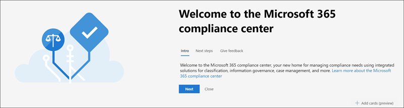

# Centro conformità Microsoft 365

Se si è interessati alla conformità dell'organizzazione, si amerà il Centro conformità [Microsoft 365.](https://compliance.microsoft.com) Il Centro conformità Microsoft 365 consente di accedere facilmente ai dati e agli strumenti necessari per soddisfare le esigenze di conformità dell'organizzazione.

Leggere questo articolo per acquisire familiarità con il Centro conformità Microsoft 365, come ottenerlo, le domande frequenti e i passaggi [successivi.](#next-steps)

## Introduzione alla conformità a Microsoft 365

Quando si passa al Centro conformità Microsoft 365 per la prima volta, viene visualizzato il messaggio di benvenuto seguente:

Il banner di benvenuto fornisce alcuni puntatori su come iniziare, con i passaggi successivi e un invito a inviarci commenti e suggerimenti.

## Sezione Scheda

Quando si visita per la prima volta il Centro conformità Microsoft 365, la sezione della scheda nella home page mostra a colpo d'occhio le prestazioni dell'organizzazione con la conformità dei dati, quali soluzioni sono disponibili per l'organizzazione e un riepilogo degli avvisi attivi.

Da qui è possibile:

- Esaminare la **scheda di Microsoft Compliance Manager,** che consente di accedere alla soluzione Compliance [Manager.](compliance-manager.md) Compliance Manager consente di semplificare la gestione della conformità. Calcola un punteggio basato sul rischio che misura lo stato di avanzamento verso il completamento delle azioni consigliate che consentono di ridurre i rischi relativi alla protezione dei dati e agli standard normativi. Vengono inoltre fornite funzionalità del flusso di lavoro e mapping di controllo predefinito che consentono di eseguire in modo efficiente azioni di miglioramento.

    

- Esaminare la nuova **scheda del catalogo**  delle soluzioni, che consente di accedere a raccolte di soluzioni integrate che è possibile utilizzare per gestire gli scenari di conformità end-to-end. Le funzionalità e gli strumenti di una soluzione possono includere una combinazione di criteri, avvisi, report e altro ancora.

    

- Esaminare la **scheda Avvisi** attivi, che  include un riepilogo degli avvisi più attivi e un collegamento in cui è possibile visualizzare informazioni più dettagliate, ad esempio Gravità, Stato, Categoria e altro ancora.

    

Puoi anche usare  la funzionalità Aggiungi schede per aggiungere altre schede, ad esempio una che mostra la conformità delle app cloud dell'organizzazione e un'altra che mostra i dati sugli utenti con file condivisi, con collegamenti a [Cloud App Security](https://docs.microsoft.com/cloud-app-security/) o ad altri strumenti in cui puoi esplorare i dati.

## Spostamento semplice per altre funzionalità e funzionalità di conformità

Oltre ai collegamenti nelle schede nella home page, sul lato sinistro dello schermo verrà visualizzato un riquadro di spostamento che consente di accedere facilmente agli [avvisi,](../security/office-365-security/alerts.md)ai [report,](reports-in-security-and-compliance.md)ai criteri, alle soluzioni di conformità e altro ancora. Per aggiungere o rimuovere opzioni per un riquadro di spostamento personalizzato, utilizzare il **controllo** Personalizza spostamento nel riquadro di spostamento. Verrà visualizzata la **finestra Personalizza le impostazioni del riquadro di** spostamento in modo da poter configurare gli elementi da visualizzare nel riquadro di spostamento.

|  |  |
|---------|---------|
|  | Selezionare **Home** per tornare alla pagina principale del Centro conformità Microsoft 365.   Visitare **Compliance Manager per** controllare il punteggio di conformità e iniziare a gestire la [conformità](compliance-manager.md) per l'organizzazione.    Selezionare la **sezione Classificazione dei dati** per accedere ai [classificatori](classifier-learn-about.md)formabili, alle definizioni delle entità del tipo di [informazioni riservate,](sensitive-information-type-entity-definitions.md)agli esplora contenuto [ed](data-classification-activity-explorer.md) attività.    Selezionare **Connettori dati per** configurare i [connettori per](archiving-third-party-data.md) importare e archiviare i dati nell'abbonamento a Microsoft 365.    Passare a **Avvisi per** visualizzare e risolvere gli [avvisi](alert-policies.md)   Visitare **i report** per visualizzare i dati sull'utilizzo e la conservazione delle etichette, sulle corrispondenze e le sostituzioni dei criteri [DLP,](view-the-dlp-reports.md)sui file [condivisi,](https://docs.microsoft.com/cloud-app-security/file-filters)sulle app di terze parti [in uso](https://docs.microsoft.com/cloud-app-security/discovered-apps)e altro ancora.     Vai a **Criteri** per configurare i criteri per gestire i dati, gestire i dispositivi e ricevere [avvisi.](../security/office-365-security/alerts.md) È inoltre possibile accedere ai criteri [di prevenzione della perdita dei](data-loss-prevention-policies.md) dati e [di](retention.md) conservazione.   Selezionare **Autorizzazioni per** gestire chi nell'organizzazione ha accesso al Centro conformità Microsoft 365 per visualizzare il contenuto e completare le attività.    Utilizzare i collegamenti nella sezione **Soluzioni** per accedere alle soluzioni di conformità dell'organizzazione. Ad esempio:    [Catalogo](microsoft-365-solution-catalog.md)   Individuare, conoscere e iniziare a usare le soluzioni intelligenti di conformità e gestione dei rischi disponibili per l'organizzazione.    [Audit](search-the-audit-log-in-security-and-compliance.md)   Usare il log di controllo per analizzare i problemi comuni relativi al supporto e alla conformità.    [Ricerca contenuto](search-for-content.md)   Usare Ricerca contenuto per trovare rapidamente la posta elettronica nelle cassette postali di Exchange, i documenti nei siti di SharePoint e nelle posizioni di OneDrive e le conversazioni di messaggistica istantanea in Microsoft Teams e Skype for Business.    [Conformità delle comunicazioni](communication-compliance.md)   Ridurre al minimo i rischi di comunicazione acquisendo automaticamente messaggi inappropriati, analizzando possibili violazioni dei criteri e prendendo misure per la correzione.    [Prevenzione della perdita dei dati](data-loss-prevention-policies.md)   Rilevare i contenuti sensibili quando vengono usati e condivisi in tutta l'organizzazione, nel cloud e nei dispositivi e consente di evitare perdite accidentali di dati.    [Richieste dell'interessato](manage-gdpr-data-subject-requests-with-the-dsr-case-tool.md)   Trovare ed esportare i dati personali di un utente per rispondere alle richieste degli utenti per il Regolamento generale sulla protezione dei dati (GDPR).    [eDiscovery](overview-ediscovery-20.md)   Espandere questa sezione per utilizzare le funzionalità di base e Advanced eDiscovery per conservare, raccogliere, esaminare, analizzare ed esportare contenuti reattivi alle indagini interne ed esterne dell'organizzazione.    [Governance delle informazioni](manage-information-governance.md)   Gestisci il ciclo di vita del contenuto usando le funzionalità per importare, archiviare e classificare i dati business-critical in modo da poter mantenere ciò che ti serve ed eliminare ciò che non ti serve.    [Protezione delle informazioni](information-protection.md)   Individuare, classificare e proteggere i contenuti sensibili e critici per l'azienda durante tutto il ciclo di vita dell'organizzazione.    [Gestione dei rischi Insider](insider-risk-management.md)   Rilevare attività rischiose all'interno dell'organizzazione per identificare, analizzare e intervenire rapidamente sui rischi insider e sulle minacce.    [Gestione record](records-management.md)   Automatizzare e semplificare la pianificazione di conservazione per i record normativi, legali e business-critical nell'organizzazione.

## Come si ottiene il Centro conformità?

- Se non si dispone già del nuovo Centro conformità Microsoft 365, sarà disponibile a breve. Il Centro conformità Microsoft 365 è ora disponibile a livello generale per i clienti SKU di Microsoft 365.

- Per visitare il Centro conformità Microsoft 365, in quanto amministratore globale, amministratore di conformità o amministratore dei dati di conformità [https://compliance.microsoft.com](https://compliance.microsoft.com) accedere.

## Domande frequenti

**Perché si viene portati al Centro sicurezza & conformità per completare alcune attività, ad esempio la definizione di determinati criteri?**

We're still developing the Microsoft 365 compliance center, and we add more functionality and solutions over the coming months. Nel frattempo, è necessario completare alcune attività nel Centro sicurezza & conformità ( [https://protection.office.com](https://protection.office.com) ). In questi casi, si verrà indirizzati automaticamente alla posizione in cui è possibile completare l'attività, ad esempio creando o modificando un criterio di supervisione.

**Perché non viene ancora visualizzato il nuovo Centro conformità Microsoft 365?**

Prima di tutto, assicurarsi di disporre delle licenze e delle autorizzazioni appropriate. Accedere quindi a [https://compliance.microsoft.com](https://compliance.microsoft.com) . Se non viene ancora visualizzato il nuovo Centro conformità, sarà disponibile a breve.

**Alcune delle funzionalità di conformità non sono disponibili nel Centro conformità Microsoft 365. Cosa devo fare?**

We're still adding functionality to the Microsoft 365 compliance center. Se non è possibile trovare elementi, ad esempio la ricerca nel log di controllo, usare il Centro sicurezza & conformità ( [https://protection.office.com](https://protection.office.com) ). Le configurazioni vengono salvate automaticamente sia nel Centro sicurezza & conformità che nel nuovo Centro conformità Microsoft 365.

To go there, in the Microsoft 365 compliance center, in the navigation pane on the left side of the screen, choose **More resources**, and then, under **Office 365 Security & Compliance Center**, choose **Open**.

## Passaggi successivi

- **Visitare Microsoft Compliance Manager per** visualizzare il punteggio di conformità e iniziare a gestire la conformità per l'organizzazione. Per ulteriori informazioni, vedere [Compliance Manager.](compliance-manager.md)

- **Configurare i criteri di gestione dei** rischi Insider per ridurre al minimo i rischi interni e consentire di rilevare, analizzare e intraprendere azioni per le attività rischiose nell'organizzazione. Vedere [Gestione dei rischi Insider.](insider-risk-management.md)

- Esaminare i criteri di prevenzione della perdita dei dati **dell'organizzazione** e apportare le modifiche necessarie in base alle esigenze. Per ulteriori informazioni, vedere Panoramica [dei criteri di prevenzione della perdita dei dati.](data-loss-prevention-policies.md)

- Acquisire familiarità con Microsoft Cloud App Security e **configurarlo.** Vedere [guida introduttiva: Introduzione a Microsoft Cloud App Security.](https://docs.microsoft.com/cloud-app-security/getting-started-with-cloud-app-security)

- **Informazioni e creare criteri di conformità delle comunicazioni** per identificare e correggere rapidamente le violazioni dei criteri di code-of-conduct aziendali. Vedere [Conformità delle comunicazioni in Microsoft 365.](communication-compliance.md)

- Visitare spesso il Centro conformità **Microsoft 365** e assicurarsi di esaminare eventuali avvisi o potenziali rischi che si verificano. Andare su [https://compliance.microsoft.com](https://compliance.microsoft.com) ed eseguire l'accesso.
