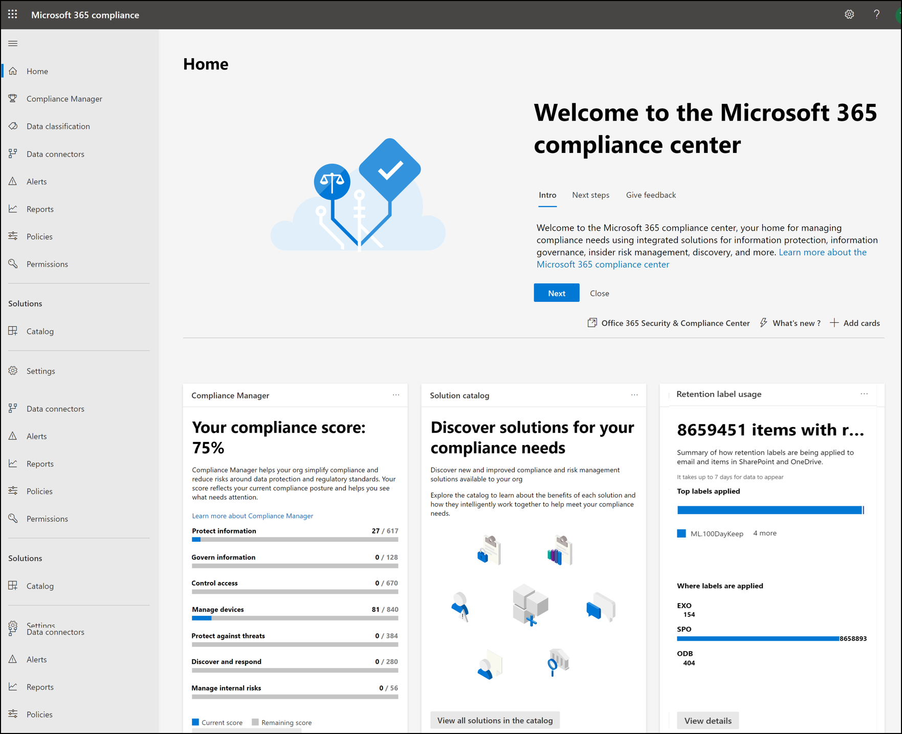
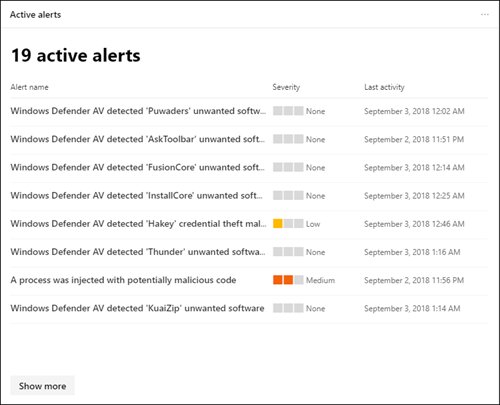

# Centro conformità Microsoft 365

Se si è interessati alla postura di conformità dell'organizzazione, è necessario amare il [centro conformità di Microsoft 365](https://compliance.microsoft.com). Microsoft 365 Compliance Center consente di accedere facilmente ai dati e agli strumenti necessari per gestire le esigenze di conformità dell'organizzazione.

Leggere questo articolo per acquisire familiarità con il centro conformità Microsoft 365, [come ottenerlo](#how-do-i-get-the-compliance-center), le [domande frequenti](#frequently-asked-questions)e i [passaggi successivi](#next-steps).

## Conformità a Microsoft 365 Compliance

Quando si passa al centro conformità Microsoft 365 per la prima volta, si è accolti con il seguente messaggio di benvenuto:

Il banner di benvenuto fornisce alcuni suggerimenti su come iniziare, con i passaggi successivi e un invito a darci un feedback.

## Sezione Scheda

Quando si visita per la prima volta il centro conformità di Microsoft 365, nella sezione scheda della Home page viene illustrato come l'organizzazione sta eseguendo la conformità ai dati, quali sono le soluzioni disponibili per la propria organizzazione e un riepilogo di tutti gli avvisi attivi.

Da qui, è possibile:

- Esaminare la scheda **Punteggio di conformità Microsoft** , che consente di visualizzare la nuova soluzione di [Punteggio di conformità](compliance-score.md) . Calcola un punteggio basato sul rischio che misura lo stato di avanzamento verso il completamento delle azioni consigliate che consentono di ridurre i rischi per la protezione dei dati e gli standard normativi. Fornisce inoltre funzionalità per il flusso di lavoro e il mapping del controllo incorporato che consentono di eseguire efficacemente tali azioni.

    

- Esaminare la nuova scheda di **Catalogo della soluzione** , che collega a raccolte di [soluzioni integrate](microsoft-365-solution-catalog.md) che è possibile utilizzare per gestire gli scenari di conformità end-to-end. Le funzionalità e gli strumenti di una soluzione possono includere una combinazione di criteri, avvisi, report e altro ancora.

    

- Esaminare la scheda **avvisi attivi** , che include un riepilogo degli avvisi più [attivi](alert-policies.md) e include un collegamento in cui è possibile visualizzare informazioni più dettagliate, ad esempio la gravità, lo stato, la categoria e altro ancora.

    

È inoltre possibile utilizzare la funzionalità **Aggiungi schede** per aggiungere altre schede, ad esempio una che mostra la conformità delle app cloud dell'organizzazione e un'altra che mostra i dati relativi agli utenti con file condivisi, con collegamenti a [cloud app Security](https://docs.microsoft.com/cloud-app-security/) o altri strumenti in cui è possibile esplorare i dati.

## Semplificazione della navigazione verso caratteristiche e funzionalità di conformità

Oltre ai collegamenti nelle schede nella Home page, viene visualizzato un riquadro di spostamento a sinistra dello schermo che consente di accedere facilmente agli [avvisi](../security/office-365-security/alerts.md), ai [report](reports-in-security-and-compliance.md), ai [criteri](alert-policies.md), alle soluzioni di conformità e altro ancora. Per aggiungere o rimuovere le opzioni per un riquadro di spostamento personalizzato, utilizzare il controllo di **spostamento Personalizza** nel riquadro di spostamento. Vengono aperte le impostazioni di **personalizzazione del riquadro di spostamento** , in modo che sia possibile configurare gli elementi visualizzati nel riquadro di spostamento.

|  |  |
|---------|---------|
|  | Selezionare **Home** per tornare alla pagina principale del centro conformità di Microsoft 365.    Selezionare la sezione **classificazione dei dati** per accedere ai [classificatori addestrabili](classifier-getting-started-with.md), alle [definizioni di entità del tipo di informazioni riservate](sensitive-information-type-entity-definitions.md), agli esploratori di contenuto e [attività](data-classification-activity-explorer.md) .    Selezionare **connettori dati** per [configurare i connettori](archiving-third-party-data.md) per l'importazione e l'archiviazione dei dati nell'abbonamento a Microsoft 365.    Passare a **avvisi** per visualizzare e risolvere gli [avvisi](alert-policies.md)   Visitare i **report** per visualizzare i dati relativi all' [utilizzo e alla conservazione delle etichette](sensitivity-labels.md), alle [corrispondenze e alle sostituzioni dei criteri DLP](view-the-dlp-reports.md), ai [file condivisi](https://docs.microsoft.com/cloud-app-security/file-filters), alle [app di terze parti in uso](https://docs.microsoft.com/cloud-app-security/discovered-apps)e altro ancora.    Passare ai **criteri** per impostare i criteri per la gestione dei dati, gestire i dispositivi e ricevere [avvisi](../security/office-365-security/alerts.md). È inoltre possibile accedere ai criteri di [conservazione](retention-policies.md) e [DLP](data-loss-prevention-policies.md) .   Selezionare le **autorizzazioni** per gestire gli utenti dell'organizzazione che dispongono dell'accesso al centro conformità Microsoft 365 per visualizzare il contenuto e completare le attività.    Utilizzare i collegamenti nella sezione **Solutions** per accedere alle soluzioni di conformità dell'organizzazione. Ad esempio:    [Catalogo](microsoft-365-solution-catalog.md)   Scoprire, conoscere e iniziare a utilizzare le soluzioni di gestione dei rischi e la conformità intelligenti disponibili per la propria organizzazione.    [Audit](search-the-audit-log-in-security-and-compliance.md)   Utilizzare il registro di controllo per esaminare i problemi di supporto e conformità comuni.    [Ricerca contenuto](search-for-content.md)   Utilizzare la ricerca contenuto per trovare rapidamente messaggi di posta elettronica in cassette postali di Exchange, documenti in siti di SharePoint e posizioni di OneDrive e conversazioni di messaggistica istantanea in Microsoft teams e Skype for business.    [Conformità delle comunicazioni](communication-compliance.md)   Ridurre al minimo i rischi di comunicazione tramite l'acquisizione automatica dei messaggi inadeguati, l'analisi delle possibili violazioni di criteri e l'adozione di procedure per la correzione.    [Indagini sui dati](overview-data-investigations.md)   Eseguire una ricerca tra percorsi di contenuto per identificare dati sensibili, dannosi o fuori luogo in Microsoft 365, in modo da poter esaminare e correggere eventuali incidenti, ad esempio la fuoriuscita di dati.    [Protezione dalla perdita di dati](data-loss-prevention-policies.md)   Individuare il contenuto sensibile utilizzato e condiviso nell'organizzazione, nel cloud e nei dispositivi, e consente di evitare la perdita accidentale dei dati.    [Richieste dell'interessato](manage-gdpr-data-subject-requests-with-the-dsr-case-tool.md)   Individuare ed esportare i dati personali di un utente per rispondere alle richieste del soggetto dei dati per il regolamento generale sulla protezione dei dati (GDPR).    [eDiscovery](overview-ediscovery-20.md)   Espandere questa sezione per utilizzare le funzionalità di eDiscovery di base e avanzate per la conservazione, la raccolta, la revisione, l'analisi e l'esportazione di contenuto rispondente alle indagini interne ed esterne dell'organizzazione.    [Governance delle informazioni](manage-information-governance.md)   Gestire il ciclo di vita del contenuto utilizzando le funzionalità per importare, archiviare e classificare i dati critici per le aziende in modo da poter mantenere ciò che è necessario ed eliminare ciò che non è possibile.    [Protezione delle informazioni](protect-information.md)   Individuare, classificare e proteggere il contenuto sensibile e critico per le aziende per tutto il suo ciclo di vita nell'organizzazione.    [Gestione dei rischi Insider](insider-risk-management.md)   Individuare le attività rischiose nell'organizzazione per identificare rapidamente, indagare e intraprendere azioni sui rischi e le minacce Insider.    [Gestione record](records-management.md)   Automatizzare e semplificare la pianificazione di conservazione per i record normativi, legali e aziendali critici nell'organizzazione.

## Come si ottiene il centro conformità?

- [! Nota] se non si dispone già del nuovo centro conformità di Microsoft 365, lo si avrà al più presto. Microsoft 365 Compliance Center è in genere disponibile per i clienti di Microsoft 365 SKU.

- Per visitare il centro conformità Microsoft 365, come amministratore globale, amministratore conformità o amministratore dei dati di conformità accedere [https://compliance.microsoft.com](https://compliance.microsoft.com) e accedere.

## Domande frequenti

**Perché sono state apportate al centro sicurezza & Compliance per completare alcune attività, come la definizione di determinati criteri?**

Si sta ancora sviluppando il centro conformità Microsoft 365 e si aggiungono ulteriori funzionalità e soluzioni nei prossimi mesi. Nel frattempo, ci sono alcune attività che devono essere completate nel centro sicurezza & Compliance ( [https://protection.office.com](https://protection.office.com) ). In questi casi, l'utente verrà indirizzato automaticamente al percorso in cui è possibile completare l'attività, ad esempio la creazione o la modifica di un criterio di supervisione.

**Perché non viene ancora visualizzato il nuovo centro conformità di Microsoft 365?**

Prima di tutto, assicurarsi di avere le licenze e le autorizzazioni appropriate. Accedere quindi a [https://compliance.microsoft.com](https://compliance.microsoft.com) . Se non si vede ancora il nuovo centro conformità, lo si avrà presto.

**Alcune delle funzionalità di conformità non sono disponibili nel centro conformità di Microsoft 365. Cosa devo fare?**

È ancora in aggiunta la funzionalità al centro conformità Microsoft 365. Se non si riesce a trovare un elemento, ad esempio la ricerca del registro di controllo, utilizzare il Centro sicurezza & Compliance ( [https://protection.office.com](https://protection.office.com) ). Le configurazioni vengono salvate automaticamente nel centro sicurezza & Compliance esistente e nel nuovo centro conformità di Microsoft 365.

Per accedere al centro conformità di Microsoft 365, nel riquadro di spostamento a sinistra dello schermo, scegliere **altre risorse**e quindi in **Centro protezione & conformità di Office 365**scegliere **Apri**.

## Passaggi successivi

- **Esaminare il Punteggio di conformità di Microsoft** per migliorare il Punteggio di conformità. Per ulteriori informazioni, vedere [Compliance Score (Preview)](compliance-score.md).

- **Configurare i criteri di gestione dei rischi Insider** per ridurre al minimo i rischi interni e consentire all'utente di rilevare, indagare e intraprendere azioni per attività rischiose nell'organizzazione. Vedere [gestione dei rischi Insider](insider-risk-management.md).

- **Esaminare i criteri di prevenzione della perdita dei dati dell'organizzazione** e apportare le modifiche necessarie in base alle esigenze. Per ulteriori informazioni, vedere [Panoramica dei criteri di prevenzione della perdita di dati](data-loss-prevention-policies.md).

- **Familiarizzare e configurare Microsoft cloud app Security**. Vedere [Guida introduttiva: Introduzione a Microsoft cloud app Security](https://docs.microsoft.com/cloud-app-security/getting-started-with-cloud-app-security).

- Informazioni **su e creare criteri di conformità della comunicazione** per identificare e correggere rapidamente le violazioni dei criteri del codice aziendale. Vedere [Communication compliance in Microsoft 365](communication-compliance.md).

- **Visitare il centro conformità Microsoft 365 spesso**e verificare eventuali avvisi o potenziali rischi che si verificano. Andare su [https://compliance.microsoft.com](https://compliance.microsoft.com) ed eseguire l'accesso.
