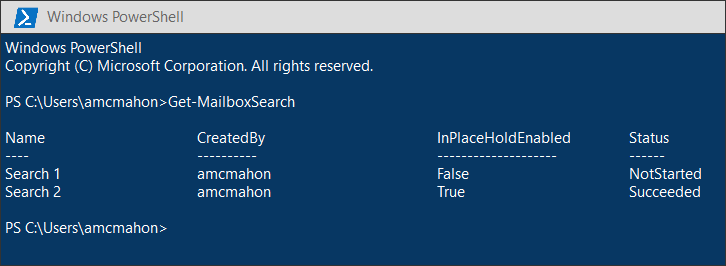
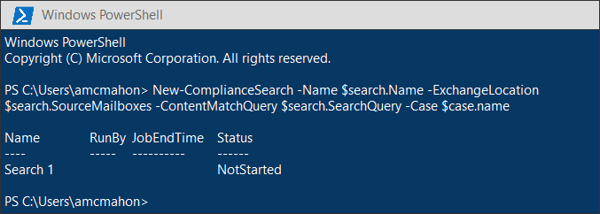

# <a name="migrate-legacy-ediscovery-searches-and-holds-to-the-microsoft-365-compliance-center"></a>Eseguire la migrazione delle ricerche e delle esenzioni eDiscovery legacy al centro conformità di Microsoft 365

Microsoft 365 Compliance Center offre una migliore esperienza per l'utilizzo di eDiscovery, tra cui: maggiore affidabilità, prestazioni migliori e numerose funzionalità su misura per i flussi di lavoro di eDiscovery, tra cui i casi di organizzazione del contenuto, i set di revisione per esaminare contenuto e analisi per facilitare la raccolta dei dati per la revisione, ad esempio il raggruppamento quasi duplicato, il threading di posta elettronica, l'

Per aiutare i clienti a sfruttare le funzionalità nuove e migliorate, in questo articolo vengono fornite indicazioni di base su come eseguire la migrazione delle ricerche eDiscovery sul posto e l'esenzioni dall'interfaccia di amministrazione di Exchange al centro conformità di Microsoft 365.

> [!NOTE]
> Poiché esistono numerosi scenari diversi, in questo articolo vengono fornite indicazioni generali per le ricerche di transizione e vengono conservate in un caso di eDiscovery di base nel centro conformità di Microsoft 365. L'utilizzo dei casi di eDiscovery non è sempre necessario, ma aggiunge un ulteriore livello di sicurezza consentendo di assegnare le autorizzazioni per controllare chi ha accesso ai casi di eDiscovery nell'organizzazione.

## <a name="before-you-begin"></a>Prima di iniziare

- Per eseguire i comandi di PowerShell descritti in questo articolo, è necessario essere membri del gruppo di ruoli eDiscovery Manager nel centro sicurezza & Compliance. È inoltre necessario essere membri del gruppo di ruoli Gestione individuazione nell'interfaccia di amministrazione di Exchange.

- In questo articolo vengono fornite indicazioni su come creare un'esenzione di eDiscovery. Il criterio di blocco verrà applicato alle cassette postali tramite un processo asincrono. Quando si crea un'esenzione eDiscovery, è necessario creare sia CaseHoldPolicy che CaseHoldRule, altrimenti il blocco non verrà creato e i percorsi di contenuto non verranno mantenuti.

## <a name="step-1-connect-to-exchange-online-powershell-and-security--compliance-center-powershell"></a>Passaggio 1: connettersi a PowerShell di Exchange Online e Centro sicurezza & Compliance Center PowerShell

Il primo passaggio consiste nel connettersi a PowerShell di Exchange Online e al centro sicurezza & Compliance Center PowerShell. È possibile copiare lo script seguente, incollarlo in una finestra di PowerShell e quindi eseguirlo. Verranno richieste le credenziali per l'organizzazione a cui si desidera effettuare la connessione. 

```powershell
$UserCredential = Get-Credential
$sccSession = New-PSSession -ConfigurationName Microsoft.Exchange -ConnectionUri https://ps.compliance.protection.outlook.com/powershell-liveid -Credential $UserCredential -Authentication Basic -AllowRedirection
Import-PSSession $sccSession -DisableNameChecking
$exoSession = New-PSSession -ConfigurationName Microsoft.Exchange -ConnectionUri https://ps.outlook.com/powershell-liveid/ -Credential $UserCredential -Authentication Basic -AllowRedirection
Import-PSSession $exoSession -AllowClobber -DisableNameChecking
```

È necessario eseguire i comandi nei passaggi seguenti della sessione di PowerShell.

## <a name="step-2-get-a-list-of-in-place-ediscovery-searches-by-using-get-mailboxsearch"></a>Passaggio 2: ottenere un elenco delle ricerche eDiscovery sul posto tramite Get-MailboxSearch

Dopo aver eseguito l'autenticazione, è possibile ottenere un elenco delle ricerche eDiscovery sul posto eseguendo il cmdlet **Get-MailboxSearch** . Copiare e incollare il comando seguente in PowerShell e quindi eseguirlo. Un elenco di ricerche verrà elencato con i relativi nomi e lo stato di qualsiasi archiviazione sul posto.

```powershell
Get-MailboxSearch
```

L'output del cmdlet sarà analogo al seguente:



## <a name="step-3-get-information-about-the-in-place-ediscovery-searches-and-in-place-holds-you-want-to-migrate"></a>Passaggio 3: ottenere informazioni sulle ricerche eDiscovery sul posto e sulle archiviazioni sul posto in cui si desidera eseguire la migrazione

Anche in questo caso, si utilizzerà il cmdlet **Get-MailboxSearch** , ma questa volta per ottenere le proprietà della ricerca. È possibile archiviare queste proprietà in una variabile per utilizzarla in un secondo momento. Nell'esempio seguente vengono archiviati i risultati del cmdlet **Get-MailboxSearch** in una variabile e quindi vengono visualizzate le proprietà della ricerca.

```powershell
$search = Get-MailboxSearch -Identity "Search 1"
```

```powershell
$search | FL
```

L'output di questi due comandi sarà analogo al seguente:


> [!NOTE]
> La durata del blocco sul posto in questo esempio è indefinita (*ItemHoldPeriod: Unlimited*). Questo è tipico degli scenari di eDiscovery e di indagine legale. Se la durata del blocco ha un valore diverso da quello indefinito, è probabile che il blocco venga utilizzato per mantenere il contenuto in uno scenario di conservazione. Invece di utilizzare i cmdlet di eDiscovery nel centro sicurezza & Compliance PowerShell per gli scenari di conservazione, si consiglia di utilizzare [New-RetentionCompliancePolicy](https://docs.microsoft.com/powershell/module/exchange/new-retentioncompliancepolicy) e [New-RetentionComplianceRule](https://docs.microsoft.com/powershell/module/exchange/new-retentioncompliancerule) per mantenere il contenuto. Il risultato dell'utilizzo di questi cmdlet sarà analogo all'utilizzo di **New-CaseHoldPolicy** e **New-CaseHoldRule**, ma è possibile specificare un periodo di conservazione e un'azione di conservazione, ad esempio l'eliminazione del contenuto dopo la scadenza del periodo di conservazione. Inoltre, l'utilizzo dei cmdlet di conservazione non richiede l'associazione dell'esenzione di conservazione a un caso di eDiscovery.

## <a name="step-4-create-a-case-in-the-microsoft-365-compliance-center"></a>Passaggio 4: creare un caso nel centro conformità di Microsoft 365

Per creare un blocco eDiscovery, è necessario creare un caso di eDiscovery per associare il blocco a. Nell'esempio seguente viene creato un caso di eDiscovery utilizzando un nome di propria scelta. Verranno archiviate le proprietà del nuovo caso in una variabile per l'utilizzo in un secondo momento. È possibile visualizzare tali proprietà eseguendo il `$case | FL` comando dopo aver creato il caso.

```powershell
$case = New-ComplianceCase -Name "[Case name of your choice]"
```


## <a name="step-5-create-the-ediscovery-hold"></a>Passaggio 5: creare il blocco eDiscovery

Dopo aver creato il caso, è possibile creare il blocco e associarlo al caso creato nel passaggio precedente. È importante tenere presente che è necessario creare un criterio di blocco del caso e una regola di blocco del caso. Se la regola di blocco del caso non viene creata dopo aver creato il criterio di blocco del caso, il blocco di eDiscovery non verrà creato e qualsiasi contenuto non verrà messo in attesa.

Eseguire i seguenti comandi per ricreare il blocco di eDiscovery che si desidera migrare. In questi esempi vengono utilizzate le proprietà dall'archiviazione sul posto del passaggio 3 di cui si desidera eseguire la migrazione. Il primo comando crea un nuovo criterio di blocco del caso e salva le proprietà in una variabile. Il secondo comando crea la regola di blocco del caso corrispondente.

```powershell
$policy = New-CaseHoldPolicy -Name $search.Name -Case $case.Identity -ExchangeLocation $search.SourceMailboxes
```

```powershell
New-CaseHoldRule -Name $search.Name -Policy $policy.Identity
```


## <a name="step-6-verify-the-ediscovery-hold"></a>Passaggio 6: verificare l'esenzione di eDiscovery

Per assicurarsi che non vi siano problemi nella creazione del blocco, è consigliabile verificare che lo stato di distribuzione di archiviazione sia stato eseguito correttamente. Distribuzione significa che il blocco è stato applicato a tutti i percorsi di contenuto specificati nel parametro *ExchangeLocation* nel passaggio precedente. A tale scopo, è possibile eseguire il cmdlet **Get-CaseHoldPolicy** . Poiché le proprietà salvate nella variabile *$policy* creata nel passaggio precedente non vengono aggiornate automaticamente nella variabile, è necessario eseguire nuovamente il cmdlet per verificare che la distribuzione abbia esito positivo. La distribuzione dei criteri di blocco del caso può richiedere da 5 a 24 ore.

Eseguire il seguente comando per verificare che il blocco eDiscovery sia stato distribuito correttamente.

```powershell
Get-CaseHoldPolicy -Identity $policy.Identity | Select name, DistributionStatus
```

Il valore di **Success** per la proprietà *Proprietà distributionstatus* indica che il blocco è stato inserito correttamente nei percorsi di contenuto. Se la distribuzione non è ancora stata completata, verrà visualizzato un valore di **Pending** .


## <a name="step-7-create-the-search"></a>Passaggio 7: creare la ricerca

L'ultimo passaggio consiste nel ricreare la ricerca identificata nel passaggio 3 e associarla al caso. Dopo aver creato la ricerca, è possibile eseguirla utilizzando il cmdlet **Start-ComplianceSearch** o eseguirla in un secondo momento.

```powershell
New-ComplianceSearch -Name $search.Name -ExchangeLocation $search.SourceMailboxes -ContentMatchQuery $search.SearchQuery -Case $case.name
```



## <a name="step-8-verify-the-case-hold-and-search-in-the-microsoft-365-compliance-center"></a>Passaggio 8: verificare il caso, il blocco e la ricerca nel centro conformità di Microsoft 365

Per assicurarsi che tutto sia configurato correttamente, passare al centro conformità di Microsoft 365 [https://compliance.microsoft.com](https://compliance.microsoft.com) e fare clic su **eDiscovery > Core**.


Il caso creato nel passaggio 3 è elencato nella pagina principale di **eDiscovery** . Aprire il caso e quindi tenere presente che il blocco creato nel passaggio 4 è elencato nella scheda **esenzioni** . È possibile fare clic sul blocco per visualizzare i dettagli, incluso il numero di cassette postali a cui è applicato il blocco e lo stato della distribuzione.


La ricerca creata al passaggio 7 è elencata nella scheda **ricerche** del caso eDiscovery.


Se si esegue la migrazione di una ricerca eDiscovery sul posto ma non la si associa a un caso di eDiscovery, questa verrà elencata nella pagina Ricerca contenuto del centro conformità di Microsoft 365.

## <a name="more-information"></a>Ulteriori informazioni

- Per ulteriori informazioni su eDiscovery sul posto & conserva nell'interfaccia di amministrazione di Exchange, vedere:
  
  - [eDiscovery sul posto](https://docs.microsoft.com/exchange/security-and-compliance/in-place-ediscovery/in-place-ediscovery)

  - [Conservazione in locale e per controversia legale](https://docs.microsoft.com/exchange/security-and-compliance/in-place-and-litigation-holds)

- Per ulteriori informazioni sui cmdlet di PowerShell utilizzati nell'articolo, vedere:

  - [Get-MailboxSearch](https://docs.microsoft.com/powershell/module/exchange/get-mailboxsearch)
  
  - [New-ComplianceCase](https://docs.microsoft.com/powershell/module/exchange/new-compliancecase)

  - [New-CaseHoldPolicy](https://docs.microsoft.com/powershell/module/exchange/new-caseholdpolicy)
  
  - [New-CaseHoldRule](https://docs.microsoft.com/powershell/module/exchange/new-caseholdrule)

  - [Get-CaseHoldPolicy](https://docs.microsoft.com/powershell/module/exchange/get-caseholdpolicy)
  
  - [New-ComplianceSearch](https://docs.microsoft.com/powershell/module/exchange/new-compliancesearch)

  - [Start-ComplianceSearch](https://docs.microsoft.com/powershell/module/exchange/start-compliancesearch)

- Per ulteriori informazioni sul centro conformità di Microsoft 365, vedere [Overview of the microsoft 365 Compliance Center](microsoft-365-compliance-center.md).
