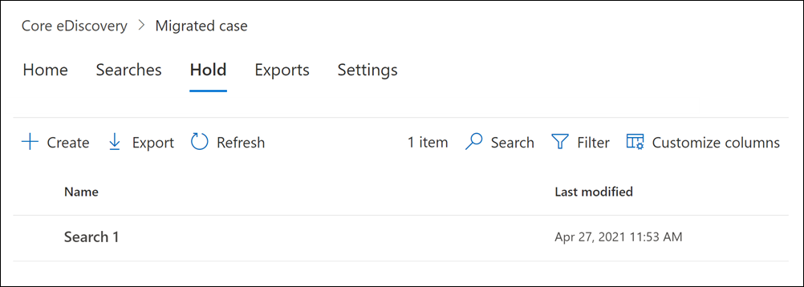

# <a name="migrate-legacy-ediscovery-searches-and-holds-to-the-microsoft-365-compliance-center"></a><span data-ttu-id="a63fd-102">Eseguire la migrazione delle ricerche e dei blocchi legacy di eDiscovery nel Centro conformità Microsoft 365</span><span class="sxs-lookup"><span data-stu-id="a63fd-102">Migrate legacy eDiscovery searches and holds to the Microsoft 365 compliance center</span></span>

<span data-ttu-id="a63fd-103">Il Centro conformità Microsoft 365 offre un'esperienza migliorata per l'utilizzo di eDiscovery, tra cui: maggiore affidabilità, prestazioni migliori e molte funzionalità personalizzate per i flussi di lavoro di eDiscovery, inclusi i casi in cui organizzare il contenuto in base alla materia, i set di revisione per esaminare il contenuto e l'analisi per consentire di culare i dati per la revisione, ad esempio il raggruppamento quasi duplicato, il threading della posta elettronica, l'analisi dei temi e la codifica predittiva.</span><span class="sxs-lookup"><span data-stu-id="a63fd-103">The Microsoft 365 compliance center provides an improved experience for eDiscovery usage, including: higher reliability, better performance and many features tailored to eDiscovery workflows including cases to organize your content by matter, review sets to review content and analytics to help cull data for review such as near-duplicate grouping, email threading, themes analysis, and predictive coding.</span></span>

<span data-ttu-id="a63fd-104">Per aiutare i clienti a sfruttare le funzionalità nuove e migliorate, in questo articolo vengono fornite indicazioni di base su come eseguire la migrazione delle ricerche e dei blocchi di eDiscovery di In-Place dall'interfaccia di amministrazione di Exchange al Centro conformità Microsoft 365.</span><span class="sxs-lookup"><span data-stu-id="a63fd-104">To help customers take advantage of the new and improved functionality, this article provides basic guidance on how to migrate In-Place eDiscovery searches and holds from the Exchange admin center to the Microsoft 365 compliance center.</span></span>

> [!NOTE]
> <span data-ttu-id="a63fd-105">Poiché esistono molti scenari diversi, questo articolo fornisce indicazioni generali per la transizione di ricerche e blocchi a un caso di eDiscovery di base nel Centro conformità Microsoft 365.</span><span class="sxs-lookup"><span data-stu-id="a63fd-105">Because there are many different scenarios, this article provides general guidance to transition searches and holds to a core eDiscovery case in the Microsoft 365 compliance center.</span></span> <span data-ttu-id="a63fd-106">L'utilizzo dei casi di eDiscovery non è sempre necessario, ma aggiunge un ulteriore livello di sicurezza consentendo di assegnare le autorizzazioni per controllare chi ha accesso ai casi di eDiscovery nell'organizzazione.</span><span class="sxs-lookup"><span data-stu-id="a63fd-106">Using eDiscovery cases aren't always required, but they add an extra layer of security by letting you assign permissions to control who has access to the eDiscovery cases in your organization.</span></span>

## <a name="before-you-begin"></a><span data-ttu-id="a63fd-107">Prima di iniziare</span><span class="sxs-lookup"><span data-stu-id="a63fd-107">Before you begin</span></span>

- <span data-ttu-id="a63fd-108">Per eseguire i comandi di PowerShell descritti in questo articolo, è necessario essere membri del gruppo di ruoli Gestore di eDiscovery nel Centro sicurezza & conformità.</span><span class="sxs-lookup"><span data-stu-id="a63fd-108">You have to be a member of the eDiscovery Manager role group in the Security & Compliance Center to run the PowerShell commands described in this article.</span></span> <span data-ttu-id="a63fd-109">È inoltre necessario essere membri del gruppo di ruoli Gestione individuazione nell'interfaccia di amministrazione di Exchange.</span><span class="sxs-lookup"><span data-stu-id="a63fd-109">You also have to be a member of the Discovery Management role group in the Exchange admin center.</span></span>

- <span data-ttu-id="a63fd-110">In questo articolo vengono fornite indicazioni su come creare un blocco di eDiscovery.</span><span class="sxs-lookup"><span data-stu-id="a63fd-110">This article provides guidance on how to create an eDiscovery hold.</span></span> <span data-ttu-id="a63fd-111">Il criterio di blocco verrà applicato alle cassette postali tramite un processo asincrono.</span><span class="sxs-lookup"><span data-stu-id="a63fd-111">The hold policy will be applied to mailboxes through an asynchronous process.</span></span> <span data-ttu-id="a63fd-112">Quando si crea un blocco di eDiscovery, è necessario creare sia CaseHoldPolicy che CaseHoldRule, altrimenti il blocco non verrà creato e i percorsi dei contenuti non verranno messi in attesa.</span><span class="sxs-lookup"><span data-stu-id="a63fd-112">When creating an eDiscovery hold, you must create both a CaseHoldPolicy and CaseHoldRule, otherwise the hold will not be created and content locations will not be placed on hold.</span></span>

## <a name="step-1-connect-to-exchange-online-powershell-and-security--compliance-center-powershell"></a><span data-ttu-id="a63fd-113">Passaggio 1: connettersi a PowerShell di Exchange Online e a PowerShell & Centro conformità</span><span class="sxs-lookup"><span data-stu-id="a63fd-113">Step 1: Connect to Exchange Online PowerShell and Security & Compliance Center PowerShell</span></span>

<span data-ttu-id="a63fd-114">Il primo passaggio consiste nel connettersi a PowerShell di Exchange Online e a PowerShell & Centro conformità.</span><span class="sxs-lookup"><span data-stu-id="a63fd-114">The first step is to connect to Exchange Online PowerShell and Security & Compliance Center PowerShell.</span></span> <span data-ttu-id="a63fd-115">È possibile copiare lo script seguente, incollarlo in una finestra di PowerShell ed eseguirlo.</span><span class="sxs-lookup"><span data-stu-id="a63fd-115">You can copy the following script, paste it into a PowerShell window and then run it.</span></span> <span data-ttu-id="a63fd-116">Ti verranno richieste le credenziali per l'organizzazione a cui vuoi connetterti.</span><span class="sxs-lookup"><span data-stu-id="a63fd-116">You'll be prompted for credentials for the organization that you want to connect to.</span></span> 

```powershell
$UserCredential = Get-Credential
$sccSession = New-PSSession -ConfigurationName Microsoft.Exchange -ConnectionUri https://ps.compliance.protection.outlook.com/powershell-liveid -Credential $UserCredential -Authentication Basic -AllowRedirection
Import-PSSession $sccSession -DisableNameChecking
$exoSession = New-PSSession -ConfigurationName Microsoft.Exchange -ConnectionUri https://ps.outlook.com/powershell-liveid/ -Credential $UserCredential -Authentication Basic -AllowRedirection
Import-PSSession $exoSession -AllowClobber -DisableNameChecking
```

<span data-ttu-id="a63fd-117">È necessario eseguire i comandi nei passaggi seguenti in questa sessione di PowerShell.</span><span class="sxs-lookup"><span data-stu-id="a63fd-117">You need to run the commands in the following steps in this PowerShell session.</span></span>

## <a name="step-2-get-a-list-of-in-place-ediscovery-searches-by-using-get-mailboxsearch"></a><span data-ttu-id="a63fd-118">Passaggio 2: Ottenere un elenco di In-Place ricerche eDiscovery tramite Get-MailboxSearch</span><span class="sxs-lookup"><span data-stu-id="a63fd-118">Step 2: Get a list of In-Place eDiscovery searches by using Get-MailboxSearch</span></span>

<span data-ttu-id="a63fd-119">Dopo aver eseguito l'autenticazione, è possibile ottenere un elenco delle In-Place eDiscovery eseguendo il cmdlet **Get-MailboxSearch.**</span><span class="sxs-lookup"><span data-stu-id="a63fd-119">After you've authenticated, you can get a list of In-Place eDiscovery searches by running the **Get-MailboxSearch** cmdlet.</span></span> <span data-ttu-id="a63fd-120">Copiare e incollare il comando seguente in PowerShell ed eseguirlo.</span><span class="sxs-lookup"><span data-stu-id="a63fd-120">Copy and paste the following command into PowerShell and then run it.</span></span> <span data-ttu-id="a63fd-121">Verrà elencato un elenco di ricerche con i relativi nomi e lo stato di In-Place esenzioni.</span><span class="sxs-lookup"><span data-stu-id="a63fd-121">A list of searches will be listed with their names and the status of any In-Place Holds.</span></span>

```powershell
Get-MailboxSearch
```

<span data-ttu-id="a63fd-122">L'output del cmdlet sarà simile al seguente:</span><span class="sxs-lookup"><span data-stu-id="a63fd-122">The cmdlet output will be similar to the following:</span></span>


## <a name="step-3-get-information-about-the-in-place-ediscovery-searches-and-in-place-holds-you-want-to-migrate"></a><span data-ttu-id="a63fd-124">Passaggio 3: Ottenere informazioni sulle ricerche e In-Place eDiscovery In-Place esenzioni di cui si desidera eseguire la migrazione</span><span class="sxs-lookup"><span data-stu-id="a63fd-124">Step 3: Get information about the In-Place eDiscovery searches and In-Place Holds you want to migrate</span></span>

<span data-ttu-id="a63fd-125">Anche in questo caso si utilizzerà il cmdlet **Get-MailboxSearch,** ma questa volta per ottenere le proprietà della ricerca.</span><span class="sxs-lookup"><span data-stu-id="a63fd-125">Again you will use the **Get-MailboxSearch** cmdlet, but this time to get the properties of the search.</span></span> <span data-ttu-id="a63fd-126">È possibile archiviare queste proprietà in una variabile per utilizzarle in un secondo momento.</span><span class="sxs-lookup"><span data-stu-id="a63fd-126">You can store these properties in a variable for use later.</span></span> <span data-ttu-id="a63fd-127">Nell'esempio seguente i risultati del cmdlet **Get-MailboxSearch** vengono archiviati in una variabile e quindi vengono visualizzate le proprietà della ricerca.</span><span class="sxs-lookup"><span data-stu-id="a63fd-127">The following example stores the results of the **Get-MailboxSearch** cmdlet in a variable and then displays the properties of the search.</span></span>

```powershell
$search = Get-MailboxSearch -Identity "Search 1"
```

```powershell
$search | FL
```

<span data-ttu-id="a63fd-128">L'output di questi due comandi sarà simile al seguente:</span><span class="sxs-lookup"><span data-stu-id="a63fd-128">The output of these two commands will be similar to the following:</span></span>


> [!NOTE]
> <span data-ttu-id="a63fd-130">La durata del blocco In-Place in questo esempio è illimitata (*ItemHoldPeriod: Unlimited).*</span><span class="sxs-lookup"><span data-stu-id="a63fd-130">The duration of the In-Place Hold in this example is indefinite (*ItemHoldPeriod: Unlimited*).</span></span> <span data-ttu-id="a63fd-131">Questo è tipico per gli scenari di eDiscovery e indagini legali.</span><span class="sxs-lookup"><span data-stu-id="a63fd-131">This is typical for eDiscovery and legal investigation scenarios.</span></span> <span data-ttu-id="a63fd-132">Se la durata del blocco ha un valore diverso da quello indefinito, è probabile che il blocco venga usato per conservare il contenuto in uno scenario di conservazione.</span><span class="sxs-lookup"><span data-stu-id="a63fd-132">If the hold duration has is different value than indefinite, the reason is likely because the hold is being used to retain content in a retention scenario.</span></span> <span data-ttu-id="a63fd-133">Anziché utilizzare i cmdlet di eDiscovery in & PowerShell per Centro sicurezza e conformità per gli scenari di conservazione, è consigliabile utilizzare [New-RetentionCompliancePolicy](https://docs.microsoft.com/powershell/module/exchange/new-retentioncompliancepolicy) e [New-RetentionComplianceRule](https://docs.microsoft.com/powershell/module/exchange/new-retentioncompliancerule) per conservare il contenuto.</span><span class="sxs-lookup"><span data-stu-id="a63fd-133">Instead of using the eDiscovery cmdlets in Security & Compliance Center PowerShell for retention scenarios, we recommend that you use [New-RetentionCompliancePolicy](https://docs.microsoft.com/powershell/module/exchange/new-retentioncompliancepolicy) and [New-RetentionComplianceRule](https://docs.microsoft.com/powershell/module/exchange/new-retentioncompliancerule) to retain content.</span></span> <span data-ttu-id="a63fd-134">Il risultato dell'utilizzo di questi cmdlet sarà simile all'utilizzo di **New-CaseHoldPolicy** e **New-CaseHoldRule,** ma sarà possibile specificare un periodo di conservazione e un'azione di conservazione, ad esempio l'eliminazione del contenuto dopo la scadenza del periodo di conservazione.</span><span class="sxs-lookup"><span data-stu-id="a63fd-134">The result of using these cmdlets will be similar to using **New-CaseHoldPolicy** and **New-CaseHoldRule**, but you'll able to specify a retention period and a retention action, such as deleting content after the retention period expires.</span></span> <span data-ttu-id="a63fd-135">Inoltre, utilizzando i cmdlet di conservazione non è necessario associare i blocchi di conservazione a un caso di eDiscovery.</span><span class="sxs-lookup"><span data-stu-id="a63fd-135">Also, using the retention cmdlets don't require you to associate the retention holds with an eDiscovery case.</span></span>

## <a name="step-4-create-a-case-in-the-microsoft-365-compliance-center"></a><span data-ttu-id="a63fd-136">Passaggio 4: Creare un caso nel Centro conformità Microsoft 365</span><span class="sxs-lookup"><span data-stu-id="a63fd-136">Step 4: Create a case in the Microsoft 365 Compliance center</span></span>

<span data-ttu-id="a63fd-137">Per creare un blocco di eDiscovery, è necessario creare un caso di eDiscovery a cui associare il blocco.</span><span class="sxs-lookup"><span data-stu-id="a63fd-137">To create an eDiscovery hold, you have to create an eDiscovery case to associate the hold with.</span></span> <span data-ttu-id="a63fd-138">Nell'esempio seguente viene creato un caso di eDiscovery utilizzando un nome di propria scelta.</span><span class="sxs-lookup"><span data-stu-id="a63fd-138">The following example creates an eDiscovery case using a name of your choice.</span></span> <span data-ttu-id="a63fd-139">Le proprietà del nuovo caso verranno archiviate in una variabile per l'uso in un secondo momento.</span><span class="sxs-lookup"><span data-stu-id="a63fd-139">We will store the properties of the new case in a variable for use later.</span></span> <span data-ttu-id="a63fd-140">È possibile visualizzare tali proprietà eseguendo il `$case | FL` comando dopo aver creato il caso.</span><span class="sxs-lookup"><span data-stu-id="a63fd-140">You can view those properties by running the `$case | FL` command after you create the case.</span></span>

```powershell
$case = New-ComplianceCase -Name "[Case name of your choice]"
```


## <a name="step-5-create-the-ediscovery-hold"></a><span data-ttu-id="a63fd-142">Passaggio 5: Creare il blocco di eDiscovery</span><span class="sxs-lookup"><span data-stu-id="a63fd-142">Step 5: Create the eDiscovery hold</span></span>

<span data-ttu-id="a63fd-143">Dopo aver creato il caso, è possibile creare il blocco e associarlo al caso creato nel passaggio precedente.</span><span class="sxs-lookup"><span data-stu-id="a63fd-143">After the case is created, you can create the hold and associate it with the case that you created in the previous step.</span></span> <span data-ttu-id="a63fd-144">È importante ricordare che è necessario creare sia un criterio di blocco del caso che una regola di blocco del caso.</span><span class="sxs-lookup"><span data-stu-id="a63fd-144">It's important to remember that you must create both a case hold policy and a case hold rule.</span></span> <span data-ttu-id="a63fd-145">Se la regola di blocco del caso non viene creata dopo la creazione del criterio di blocco del caso, il blocco di eDiscovery non verrà creato e il contenuto non verrà messo in attesa.</span><span class="sxs-lookup"><span data-stu-id="a63fd-145">If the case hold rule isn't created after you created case hold policy, the eDiscovery hold will not be created and any content won't be placed on hold.</span></span>

<span data-ttu-id="a63fd-146">Eseguire i comandi seguenti per creare di nuovo il blocco di eDiscovery di cui si desidera eseguire la migrazione.</span><span class="sxs-lookup"><span data-stu-id="a63fd-146">Run the following commands to re-create the eDiscovery hold that you want to migrate.</span></span> <span data-ttu-id="a63fd-147">In questi esempi vengono utilizzate le proprietà del In-Place blocco del passaggio 3 di cui si desidera eseguire la migrazione.</span><span class="sxs-lookup"><span data-stu-id="a63fd-147">These examples use the properties from In-Place Hold from Step 3 that you want to migrate.</span></span> <span data-ttu-id="a63fd-148">Il primo comando crea un nuovo criterio di blocco del caso e salva le proprietà in una variabile.</span><span class="sxs-lookup"><span data-stu-id="a63fd-148">The first command creates a new case hold policy and saves the properties to a variable.</span></span> <span data-ttu-id="a63fd-149">Il secondo comando crea la regola di blocco del caso corrispondente.</span><span class="sxs-lookup"><span data-stu-id="a63fd-149">The second command creates the corresponding case hold rule.</span></span>

```powershell
$policy = New-CaseHoldPolicy -Name $search.Name -Case $case.Identity -ExchangeLocation $search.SourceMailboxes
```

```powershell
New-CaseHoldRule -Name $search.Name -Policy $policy.Identity
```


## <a name="step-6-verify-the-ediscovery-hold"></a><span data-ttu-id="a63fd-151">Passaggio 6: Verificare il blocco di eDiscovery</span><span class="sxs-lookup"><span data-stu-id="a63fd-151">Step 6: Verify the eDiscovery hold</span></span>

<span data-ttu-id="a63fd-152">Per assicurarsi che non si siano verificati problemi durante la creazione del blocco, è bene verificare che lo stato di distribuzione del blocco sia riuscito.</span><span class="sxs-lookup"><span data-stu-id="a63fd-152">To make sure there were no issues in creating the hold, it's good to check that the hold distribution status is successful.</span></span> <span data-ttu-id="a63fd-153">La distribuzione significa che il blocco è stato applicato a tutti i percorsi di contenuto specificati nel *parametro ExchangeLocation* nel passaggio precedente.</span><span class="sxs-lookup"><span data-stu-id="a63fd-153">Distribution means that the hold has been applied to all the content locations specified in the *ExchangeLocation* parameter in the previous step.</span></span> <span data-ttu-id="a63fd-154">A tale scopo, è possibile eseguire il cmdlet **Get-CaseHoldPolicy.**</span><span class="sxs-lookup"><span data-stu-id="a63fd-154">To do this, you can run the **Get-CaseHoldPolicy** cmdlet.</span></span> <span data-ttu-id="a63fd-155">Poiché le proprietà salvate nella variabile *$policy* creata nel passaggio precedente non vengono aggiornate automaticamente nella variabile, è necessario eseguire di nuovo il cmdlet per verificare che la distribuzione sia riuscita.</span><span class="sxs-lookup"><span data-stu-id="a63fd-155">Because the properties saved to the *$policy* variable that you created in the previous step aren't automatically updated in the variable, you need to rerun the cmdlet to verify that distribution is successful.</span></span> <span data-ttu-id="a63fd-156">La corretta distribuzione dei criteri di blocco del caso può richiedere da 5 a 24 ore.</span><span class="sxs-lookup"><span data-stu-id="a63fd-156">It can take between 5 minutes and 24 hours for case hold policies to be successfully distributed.</span></span>

<span data-ttu-id="a63fd-157">Eseguire il seguente comando per verificare che il blocco di eDiscovery sia stato distribuito correttamente.</span><span class="sxs-lookup"><span data-stu-id="a63fd-157">Run the following command to verify that the eDiscovery hold has been successfully distributed.</span></span>

```powershell
Get-CaseHoldPolicy -Identity $policy.Identity | Select name, DistributionStatus
```

<span data-ttu-id="a63fd-158">Il valore **Success per** la proprietà *DistributionStatus* indica che il blocco è stato eseguito correttamente nei percorsi dei contenuti.</span><span class="sxs-lookup"><span data-stu-id="a63fd-158">The value of **Success** for the *DistributionStatus* property indicates the hold was successfully placed on the content locations.</span></span> <span data-ttu-id="a63fd-159">Se la distribuzione non è ancora stata completata, viene visualizzato il valore **In** sospeso.</span><span class="sxs-lookup"><span data-stu-id="a63fd-159">If the distribution is not yet complete, a value of **Pending** is displayed.</span></span>


## <a name="step-7-create-the-search"></a><span data-ttu-id="a63fd-161">Passaggio 7: Creare la ricerca</span><span class="sxs-lookup"><span data-stu-id="a63fd-161">Step 7: Create the search</span></span>

<span data-ttu-id="a63fd-162">L'ultimo passaggio consiste nel creare di nuovo la ricerca identificata nel passaggio 3 e associarla al caso.</span><span class="sxs-lookup"><span data-stu-id="a63fd-162">The last step is to re-create the search that you identified in Step 3 and associate it with the case.</span></span> <span data-ttu-id="a63fd-163">Dopo aver creato la ricerca, è possibile eseguirla utilizzando il cmdlet **Start-ComplianceSearch** o eseguirla in un secondo momento.</span><span class="sxs-lookup"><span data-stu-id="a63fd-163">After you create the search, you can run it by using the **Start-ComplianceSearch** cmdlet or run at a later time.</span></span>

```powershell
New-ComplianceSearch -Name $search.Name -ExchangeLocation $search.SourceMailboxes -ContentMatchQuery $search.SearchQuery -Case $case.name
```


## <a name="step-8-verify-the-case-hold-and-search-in-the-microsoft-365-compliance-center"></a><span data-ttu-id="a63fd-165">Passaggio 8: Verificare il caso, il blocco e la ricerca nel Centro conformità Microsoft 365</span><span class="sxs-lookup"><span data-stu-id="a63fd-165">Step 8: Verify the case, hold, and search in the Microsoft 365 compliance center</span></span>

<span data-ttu-id="a63fd-166">Per assicurarsi che tutto sia configurato correttamente, accedere al Centro conformità Microsoft 365 all'indirizzo e fare clic su [https://compliance.microsoft.com](https://compliance.microsoft.com) **eDiscovery > Core.**</span><span class="sxs-lookup"><span data-stu-id="a63fd-166">To make sure that everything is set up correctly, go to the Microsoft 365 compliance center at [https://compliance.microsoft.com](https://compliance.microsoft.com), and click **eDiscovery > Core**.</span></span>


<span data-ttu-id="a63fd-168">Il caso creato nel passaggio 3 è elencato nella **pagina Core eDiscovery.**</span><span class="sxs-lookup"><span data-stu-id="a63fd-168">The case that you created in Step 3 is listed on the **Core eDiscovery** page.</span></span> <span data-ttu-id="a63fd-169">Aprire il caso e notare l'esenzione creata nel passaggio 4 nella scheda **Esenzioni.** È possibile fare clic sul blocco per visualizzare i dettagli, tra cui il numero di cassette postali a cui viene applicato il blocco e lo stato di distribuzione.</span><span class="sxs-lookup"><span data-stu-id="a63fd-169">Open the case and then notice the hold that you created in Step 4 in listed on the **Holds** tab. You can click the hold to see details, including the number of mailboxes the hold is applied to and the distribution status.</span></span>



<span data-ttu-id="a63fd-171">La ricerca creata nel passaggio 7 è elencata nella scheda **Ricerche** del caso di eDiscovery.</span><span class="sxs-lookup"><span data-stu-id="a63fd-171">The search that you created in Step 7 is listed on the listed on the **Searches** tab of the eDiscovery case.</span></span>


<span data-ttu-id="a63fd-173">Se si esegue la migrazione di una ricerca eDiscovery di In-Place ma non la si associa a un caso di eDiscovery, verrà elencata nella pagina Ricerca contenuto nel Centro conformità Microsoft 365.</span><span class="sxs-lookup"><span data-stu-id="a63fd-173">If you migrate an In-Place eDiscovery search but don't associate it with an eDiscovery case, it will be listed on the Content search page in the Microsoft 365 compliance center.</span></span>

## <a name="more-information"></a><span data-ttu-id="a63fd-174">Altre informazioni</span><span class="sxs-lookup"><span data-stu-id="a63fd-174">More information</span></span>

- <span data-ttu-id="a63fd-175">Per ulteriori informazioni sull'In-Place eDiscovery & blocchi nell'interfaccia di amministrazione di Exchange, vedere:</span><span class="sxs-lookup"><span data-stu-id="a63fd-175">For more information about In-Place eDiscovery & Holds in the Exchange admin center, see:</span></span>
  
  - [<span data-ttu-id="a63fd-176">eDiscovery sul posto</span><span class="sxs-lookup"><span data-stu-id="a63fd-176">In-Place eDiscovery</span></span>](https://docs.microsoft.com/exchange/security-and-compliance/in-place-ediscovery/in-place-ediscovery)

  - [<span data-ttu-id="a63fd-177">Conservazione in locale e per controversia legale</span><span class="sxs-lookup"><span data-stu-id="a63fd-177">In-Place Hold and Litigation Hold</span></span>](https://docs.microsoft.com/exchange/security-and-compliance/in-place-and-litigation-holds)

- <span data-ttu-id="a63fd-178">Per ulteriori informazioni sui cmdlet di PowerShell utilizzati nell'articolo, vedere:</span><span class="sxs-lookup"><span data-stu-id="a63fd-178">For more information about the PowerShell cmdlets used in the article, see:</span></span>

  - [<span data-ttu-id="a63fd-179">Get-MailboxSearch</span><span class="sxs-lookup"><span data-stu-id="a63fd-179">Get-MailboxSearch</span></span>](https://docs.microsoft.com/powershell/module/exchange/get-mailboxsearch)
  
  - [<span data-ttu-id="a63fd-180">New-ComplianceCase</span><span class="sxs-lookup"><span data-stu-id="a63fd-180">New-ComplianceCase</span></span>](https://docs.microsoft.com/powershell/module/exchange/new-compliancecase)

  - [<span data-ttu-id="a63fd-181">New-CaseHoldPolicy</span><span class="sxs-lookup"><span data-stu-id="a63fd-181">New-CaseHoldPolicy</span></span>](https://docs.microsoft.com/powershell/module/exchange/new-caseholdpolicy)
  
  - [<span data-ttu-id="a63fd-182">New-CaseHoldRule</span><span class="sxs-lookup"><span data-stu-id="a63fd-182">New-CaseHoldRule</span></span>](https://docs.microsoft.com/powershell/module/exchange/new-caseholdrule)

  - [<span data-ttu-id="a63fd-183">Get-CaseHoldPolicy</span><span class="sxs-lookup"><span data-stu-id="a63fd-183">Get-CaseHoldPolicy</span></span>](https://docs.microsoft.com/powershell/module/exchange/get-caseholdpolicy)
  
  - [<span data-ttu-id="a63fd-184">New-ComplianceSearch</span><span class="sxs-lookup"><span data-stu-id="a63fd-184">New-ComplianceSearch</span></span>](https://docs.microsoft.com/powershell/module/exchange/new-compliancesearch)

  - [<span data-ttu-id="a63fd-185">Start-ComplianceSearch</span><span class="sxs-lookup"><span data-stu-id="a63fd-185">Start-ComplianceSearch</span></span>](https://docs.microsoft.com/powershell/module/exchange/start-compliancesearch)

- <span data-ttu-id="a63fd-186">Per ulteriori informazioni sul Centro conformità Microsoft 365, vedere Panoramica del Centro conformità [Microsoft 365.](microsoft-365-compliance-center.md)</span><span class="sxs-lookup"><span data-stu-id="a63fd-186">For more information about the Microsoft 365 compliance center, see [Overview of the Microsoft 365 compliance center](microsoft-365-compliance-center.md).</span></span>
