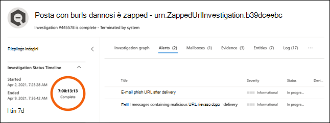

# Nuove funzionalità di Microsoft Defender per Office 365

Microsoft Defender per Office 365 sta introducendo criteri di avviso nuovi e migliorati per i rilevamenti successivi al recapito. Questi includono miglioramenti ai playbook di indagine e risposta automatizzata associati. Inoltre stiamo modificando la classificazione della gravità per sei criteri di avviso predefiniti, per allineare meglio gli avvisi generati da questi criteri agli impatti per l'organizzazione.

## Rilevamenti successivi al recapito

Introdurremo quattro nuovi criteri di avviso predefiniti legati ai rilevamenti successivi al recapito dopo la rimozione dei messaggi dalle caselle di posta da parte del servizio Zero-Hour Auto Purge (ZAP) di Microsoft Defender per Office 365. Questi quattro nuovi criteri sostituiranno i criteri di avviso predefiniti esistenti che coprono scenari ZAP, e forniscono alle organizzazioni maggiori dettagli sui rilevamenti sottostanti e gli indicatori correlati. Questi avvisi (e i playbook AIR che saranno attivati da questi avvisi) cattureranno accuratamente le minacce della posta elettronica, inclusi gli URL collegati a file pericolosi e i file contenenti URL malevoli.

La tabella seguente include i nuovi criter di avviso e criteri di avviso esistent che saranno rimossi. Vedi la sezione [Conseguenze per la tua organizzazione](#how-this-will-affect-your-organization) per i dettagli sull'installazione.

| Criterio di avviso nuovo o esistente | Nome criterio di avviso | ID criterio di avviso|
|:-----------------------------|:----------------|:--------------|
| Nuovo| **Dei messaggi di posta elettronica contenenti URL dannosi sono stati rimossi dopo il recapito**   | 0179B3F7-3FDA-40C3-8F24-278563978DBB |
| Nuovo| **Dei messaggi di posta elettronica contenenti file dannosi sono stati rimossi dopo il recapito**  | 8E6BA277-EF39-404E-AAF1-294F6D9A2B88 |
| Nuovo| **Dei messaggi di posta elettronica della campagna sono stati recapitati e rimossi in seguito** | ef850570-5624-42b2-ff0a-08d8d899d578 |
| Nuovo|**Dei messaggi dannosi sono stati recapitati e rimossi in seguito**                | a1f563cc-fb1f-466b-1fb5-08d8d71a3050 |
| Esistente (verrà rimosso)| **Dei messaggi di posta elettronica contenenti URL di phishing sono stati rimossi dopo il recapito**| EA8169FA-0678-4751-8854-AEBEA7ADECEB |
| Esistente (verrà rimosso)| **Messaggi di posta elettronica contenenti malware rimossi dopo il recapito**| 0179B3F7-3FDA-40C3-8F24-278563978DBB |
||||

## Miglioramenti della gravità degli avvisi

La tabella seguente identifica i criteri di avviso predefiniti le cui classificazioni della gravità sono in corso di modifica. Stiamo modificando la classificazione della gravità per questi criteri di avviso, per allinearla meglio ai potenziali rischi e impatti per l'organizzazione e aiutare i team di sicurezza a attribuire la priorità agli avvisi generati da questi criteri.

| Avviso| ID criterio di avviso| Vecchia gravità| Nuova gravità  |
|:----------|:---------------|:------------|:--------------|
| **Attività sospetta di inoltro della posta elettronica**| BFD48F06-0865-41A6-85FF-ADB746423EBF | Medio| Alto|
| **Email segnalata dagli utenti come malware o phishing** | B26A5770-0C38-434A-9380-3A3C2C27BBB3 | Informativa | Basso|
| **Aumento insolito dei messaggi segnalati come tentativi di phishing** | A00D8C62-9320-4EEA-A7E5-966B9AC09558 | Alto| Medio |
| **Risultato invio amministratore completato** | AE9B83DD-6039-4EA9-B675-6B0AC3BF4A41 | Basso| Informativa |
| **Creazione di regole di inoltro/reindirizzamento** | D59A8FD4-1272-41EE-9408-86F7BCF72479 | Basso| Informativa |
| **Ricerca e-discovery avviata o esportata**| 6FDC5710-3998-47F0-AFBB-57CEFD7378AE | Medio| Informativa |
|||||

## Quando verranno apportate queste modifiche

La tabella seguente identifica quando i nuovi criteri di avviso inizieranno ad attivare gli avvisi successivi al recapito. La tabella identifica anche quando i due criteri di avviso esistenti verranno rimossi.

| Criterio di avviso| Data |
|:------------|:-----|
| **Dei messaggi di posta elettronica contenenti URL dannosi sono stati rimossi dopo il recapito** (nuovo) | Gli avvisi inizieranno a essere attivati il giorno 11 aprile 2021|
| **Dei messaggi di posta elettronica contenenti file dannosi sono stati rimossi dopo il recapito** (nuovo) | Gli avvisi inizieranno a essere attivati il giorno 11 aprile 2021 |
| **Dei messaggi di posta elettronica della campagna sono stati recapitati e rimossi in seguito** (nuovo) | Gli avvisi inizieranno a essere attivati il giorno 14 maggio 2021|
| **Dei messaggi dannosi sono stati recapitati e rimossi in seguito** (nuovo) | Gli avvisi inizieranno a essere attivati il giorno 14 maggio 2021|
| **Dei messaggi di posta elettronica contenenti URL di phishing sono stati rimossi dopo il recapito** (nuovo)| Il criterio di avviso verrà rimosso il 14 maggio 2021. Visita la sezione [Cosa devi fare per prepararti per queste modifiche](#what-you-need-to-do-to-prepare-for-these-changes).|
| **Dei messaggi di posta elettronica contenenti URL di phishing sono stati rimossi dopo il recapito** (esistente, sarà  rimosso) | Il criterio di avviso verrà rimosso il 14 maggio 2021. Visita la sezione [Cosa devi fare per prepararti per queste modifiche](#what-you-need-to-do-to-prepare-for-these-changes). |
|||

Le modifiche del livello di gravità degli avvisi verranno implementate in tutte le organizzazioni entro il 14 maggio 2021.

## Conseguenze per l'organizzazione

I nuovi avvisi inizieranno ad attivarsi, avviando le indagini AIR nell'organizzazione nelle date indicate sopra. Per ridurre l'impatto sulle organizzazioni di sicurezza che hanno reso operativi i due avvisi che devono essere rimossi, saranno mostrati avvisi attivati dai criteri di avviso esistenti *e* avvisi attivati dai nuovi criteri di avviso tra il 5 aprile 2021 e il 14 maggio 2021. Ciò è finalizzato a offrire ai team di sicurezza il tempo di gestire le modifiche richieste. Per aiutare i team di sicurezza con l'aumento del volume di avvisi durante questo breve periodo, sia l'avviso esistente che quelli nuovi saranno correlati alla stessa indagine AIR e allo stesso incidente. Più specificamente, ciò include i seguenti comportamenti relativi ad avvisi, indagini AIR e incidenti:

- **Avvisi**: per impostazione predefinita,  le seguenti coppie di avvisi saranno mostrate per gli avvisi esistenti e nuovi:

  - **Messaggi contenenti URL di phishing rimossi dopo il recapito** E **Messaggi contenenti URL dannosi rimossi dopo il recapito**

  - **Messaggi contenenti malware rimossi dopo il recapito** E **Messaggi contenenti file dannosi rimossi dopo il recapito**

  

   Per altre informazioni sulla gestione di queste coppie di avvisi, vedi la sezione [Cosa devi fare per prepararti per queste modifiche](#what-you-need-to-do-to-prepare-for-these-changes).

- **Indagine AIR**: gli avvisi saranno correlati a indagini AIR individuali, e uno degli avvisi sarà classificato come “attivato” e l'altro come “ripetuto”.

  

- **Incidenti**: entrambi gli avvisi saranno correlati allo stesso incidente

  

## Cosa devi fare per prepararti per queste modifiche

Il modo in cui l'organizzazione utilizza questi avvisi determina ciò che devi fare per prepararti. Se hai reso operativi gli avvisi e gli stai usando o consumando tramite una API, un sistema di notifica tramite posta elettronica, o tramite il Centro sicurezza e conformità di Office 365 (`https://protection.office.com/viewalerts`) o il Centro sicurezza Microsoft (`https://security.microsoft.com/viewalerts`), devi modificare i tuoi flussi di lavoro.

**Se non hai reso operativi questi avvisi, puoi procedere in uno dei modi seguenti:**

- Disabilita quesi criteri di avviso (che stanno per essere rimossi) per ridurre il volume degli avvisi dell'organizzazione:

  - **Dei messaggi di posta elettronica contenenti URL di phishing sono stati rimossi dopo il recapito**

  - **Messaggi di posta elettronica contenenti malware rimossi dopo il recapito**

- Non fare nulla. Disabiliteremo i criteri di avviso esistenti il 14 maggio 2021.

**Se hai reso operativi questi avvisi:**

- Inizia a consumare i nuovi avvisi nell'ambito dei tuoi flussi di lavoro, anticipando la rimozione dei criteri di avviso esistenti prevista per il 14 maggio 2021. Se hai logiche personalizzate per il tuo sistema di gestione dei ticket, cassette postali di sicurezza in cui ricevi i messaggi di notifica, o soluzioni SIEM che dipendono dal nome dell'avviso o dall'ID del criterio di avviso (CorrelationId), dovrai modificare la logica per applicare la modifica.

  > [!NOTE]
  > Le informazioni di avvisi, indagini e incideti non sono cambiate. Infatti, queste informazioni sono state aggiornate con ulteriori dettagli sulle minacce associate.

- Una volta completate le modifiche, puoi disabilitare i criteri di avviso esistenti per ridurre il volume degli avvisi dell'organizzazione.

  - **Dei messaggi di posta elettronica contenenti URL di phishing sono stati rimossi dopo il recapito**

  - **Messaggi di posta elettronica contenenti malware rimossi dopo il recapito**

  In alternativa, puoi lasciare abilitate questi criteri di avviso fino a quando le avremo cancellate il 14 maggio 2021.
