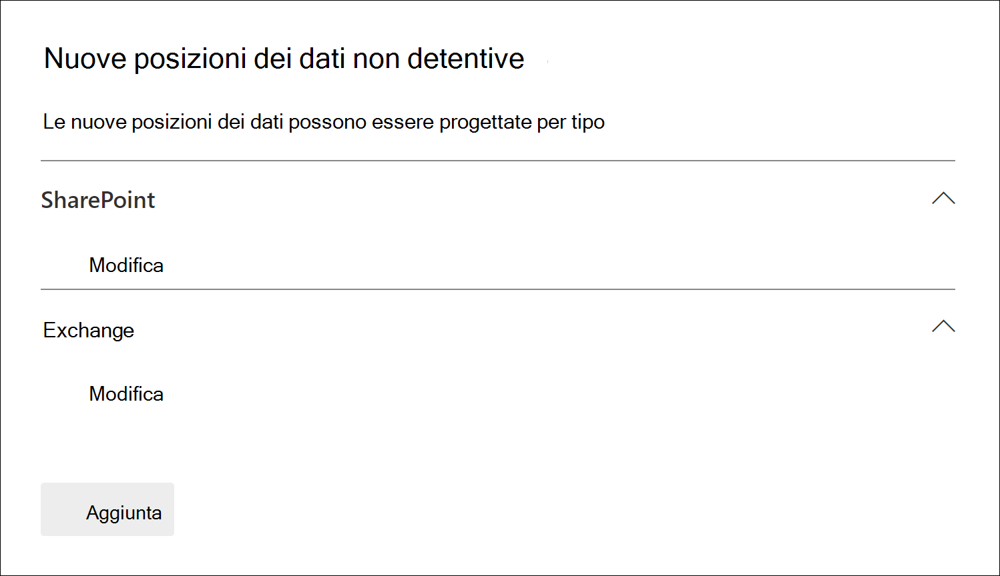
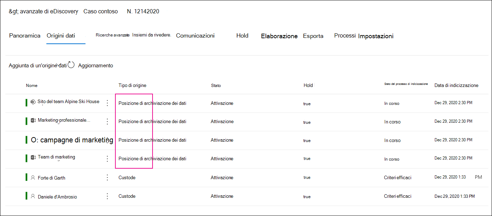

# Aggiungere origini dati non detentive a un caso avanzato di eDiscovery

In Advanced eDiscovery casi, non sempre soddisfare le proprie esigenze per associare un'origine dati Microsoft 365 con un custode nel caso. Tuttavia, potrebbe essere comunque necessario associare tali dati a un caso in modo che sia possibile cercarlo, aggiungerlo a un set di revisione e analizzarlo e rivederlo. La caratteristica in Advanced eDiscovery è denominata *origini dati non detentive* e consente di aggiungere dati a un caso senza che sia necessario associarlo a un custode. Applica inoltre la stessa funzionalità avanzata di eDiscovery ai dati non detentivi disponibili per i dati associati al custode. Due delle cose più utili che è possibile applicare ai dati non detentivi sono l'inserimento e l'elaborazione in attesa tramite l' [indicizzazione avanzata](indexing-custodian-data.md).

## Aggiunta di un'origine dati non priva di detenzione

Eseguire la procedura seguente per aggiungere e gestire origini dati non detentive in un caso di eDiscovery avanzato.

1. Nella Home page di **Advanced eDiscovery** fare clic sul caso per il quale si desidera aggiungere i dati.

2. Fare clic sulla scheda **origini dati** , quindi fare clic su **Aggiungi**  >  **percorsi** dati.

3. Nella pagina nuovo riquadro a comparsa **posizioni non detentive** scegliere le origini dati che si desidera aggiungere al caso. È possibile aggiungere più cassette postali e siti espandendo le sezioni di **SharePoint** o di **Exchange** e quindi facendo clic su **modifica**.

   

   - **SharePoint** -fare clic su **modifica** per aggiungere siti. Selezionare un sito nell'elenco oppure è possibile cercare un sito digitando l'URL del sito nella barra di ricerca. Selezionare i siti che si desidera aggiungere come origini dati non depositarie e fare clic su **Aggiungi**.

   - **Exchange** -fare clic su **modifica** per aggiungere le cassette postali. Digitare un nome o un alias (almeno tre caratteri) nella casella di ricerca per cassette postali o gruppi di distribuzione. Selezionare le cassette postali che si desidera aggiungere come origini dati non depositarie e fare clic su **Aggiungi**.

   > [!NOTE]
   > È possibile utilizzare le sezioni di **SharePoint** ed **Exchange** per aggiungere siti e cassette postali associati a un gruppo di team o Yammer come origini dati non detentive. È necessario aggiungere separatamente la cassetta postale e il sito associati a un gruppo di team o Yammer.

4. Dopo aver aggiunto origini dati non detentive, è possibile disporre di tali posizioni in attesa o meno. Selezionare o deselezionare la casella di controllo **blocca** accanto all'origine dati per metterla in attesa.

5. Fare clic su **Aggiungi** nella parte inferiore della pagina nuovo riquadro a comparsa **posizioni dati non detentive** per aggiungere le origini dati al caso.

   Ogni origine dati non priva di detenzione aggiunta è elencata nella pagina **origini dati** . Le origini dati non detentive sono identificate dal valore **percorso dati** nella colonna **tipo di origine** .

   

Dopo aver aggiunto le origini dati non detentive al caso, viene creato e visualizzato nella scheda **processi** del caso un processo denominato *reindicizzazione dei dati non detentivi* . Una volta creato, il processo di indicizzazione avanzato è stato avviato e le origini dati vengono reindicizzate.

## Gestire il blocco per le origini dati non detentive

Dopo aver posizionato un'esenzione su un'origine dati non di detenzione, viene creato automaticamente un criterio di conservazione contenente le origini dati non detentive del caso. Quando si impostano altre origini dati non detentive, queste vengono aggiunte ai criteri di blocco.

1. Aprire il caso Advanced eDiscovery e selezionare la scheda **blocca** .

2. Fare clic su **NCDSHold- \<GUID\>**, in cui il valore GUID è univoco per il caso.

   La pagina del riquadro a comparsa Visualizza informazioni e statistiche sulle origini dati non detentive in attesa.

   

3. Fare clic su **Modifica blocco** per visualizzare le origini dati non detentive inserite in attesa ed eseguire le attività di gestione seguenti:

   - Nella pagina **percorsi** è possibile rilasciare un'origine dati non priva di detenzione rimuoverla dall'esenzione. Il rilascio di un'origine dati non rimuove l'origine dati non affidatario dal caso. Rimuove solo il blocco che è stato inserito nell'origine dati.

   - Nella pagina **query** è possibile modificare il blocco per creare un blocco basato su query applicato a tutte le origini dati non detentive del caso.
