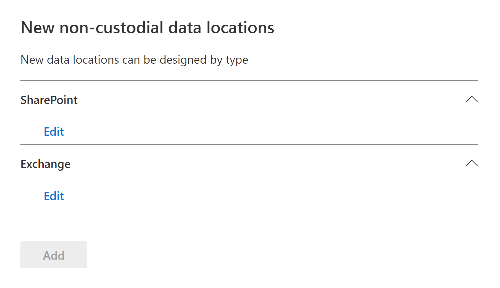

# Aggiungere origini dati non detentive a un caso avanzato di eDiscoveryAdd non-custodial data sources to an Advanced eDiscovery case

In Advanced eDiscovery casi, non sempre soddisfare le proprie esigenze per associare un'origine dati Microsoft 365 con un custode nel caso.In Advanced eDiscovery cases, it doesn't always meet your needs to associate a Microsoft 365 data source with a custodian in the case. Tuttavia, potrebbe essere comunque necessario associare tali dati a un caso in modo che sia possibile cercarlo, aggiungerlo a un set di revisione e analizzarlo e rivederlo.But you may still need to associate that data with a case so that you can search it, add it to a review set, and analyze and review it. La caratteristica in Advanced eDiscovery è denominata *origini dati non detentive* e consente di aggiungere dati a un caso senza che sia necessario associarlo a un custode.The feature in Advanced eDiscovery is called *non-custodial data sources* and lets you add data to a case without having to associate it to a custodian. Applica inoltre la stessa funzionalità avanzata di eDiscovery ai dati non detentivi disponibili per i dati associati al custode.It also applies the same Advanced eDiscovery functionality to non-custodial data that's available for data associated with custodian. Due delle cose più utili che è possibile applicare ai dati non detentivi sono l'inserimento e l'elaborazione in attesa tramite l' [indicizzazione avanzata](indexing-custodian-data.md).Two of the most useful things that you can apply to non-custodial data is placing it on hold and processing it using [Advanced indexing](indexing-custodian-data.md).

## Aggiunta di un'origine dati non priva di detenzioneAdd a non-custodial data source

Eseguire la procedura seguente per aggiungere e gestire origini dati non detentive in un caso di eDiscovery avanzato.Follow these steps to add and manage non-custodial data sources in an Advanced eDiscovery case.

1. Nella Home page di **Advanced eDiscovery** fare clic sul caso per il quale si desidera aggiungere i dati.On the **Advanced eDiscovery** home page, click the case that you want to add the data to.

2. Fare clic sulla scheda **origini dati** , quindi fare clic su **Aggiungi**  >  **percorsi** dati.Click the **Data sources** tab and then click **Add data source** > **Add data locations**.

3. Nella pagina nuovo riquadro a comparsa **posizioni non detentive** scegliere le origini dati che si desidera aggiungere al caso.On the **New non-custodial data locations** flyout page, choose the data sources that you want to add to the case. È possibile aggiungere più cassette postali e siti espandendo le sezioni di **SharePoint** o di **Exchange** e quindi facendo clic su **modifica**.You can add multiple mailboxes and sites by expanding the **SharePoint** or **Exchange** sections and then clicking **Edit**.

   

   - **SharePoint** -fare clic su **modifica** per aggiungere siti.**SharePoint** - Click **Edit** to add sites. Selezionare un sito nell'elenco oppure è possibile cercare un sito digitando l'URL del sito nella barra di ricerca.Select a site in the list or you can search for a site by typing the URL of the site in the search bar. Selezionare i siti che si desidera aggiungere come origini dati non depositarie e fare clic su **Aggiungi**.Select the sites that you want to add as non-custodian data sources and click **Add**.

   - **Exchange** -fare clic su **modifica** per aggiungere le cassette postali.**Exchange** - Click **Edit** to add mailboxes. Digitare un nome o un alias (almeno tre caratteri) nella casella di ricerca per cassette postali o gruppi di distribuzione.Type a name or alias (a minimum of three characters) in the search box for mailboxes or distribution groups. Selezionare le cassette postali che si desidera aggiungere come origini dati non depositarie e fare clic su **Aggiungi**.Select the mailboxes that you want to add as non-custodian data sources and click **Add**.

   > [!NOTE]
   > È possibile utilizzare le sezioni di **SharePoint** ed **Exchange** per aggiungere siti e cassette postali associati a un gruppo di team o Yammer come origini dati non detentive.You can use the **SharePoint** and **Exchange** sections to add sites and mailboxes associated with a Team or Yammer group as non-custodial data sources. È necessario aggiungere separatamente la cassetta postale e il sito associati a un gruppo di team o Yammer.You have to separately add the mailbox and site associated with a Team or Yammer group.

4. Dopo aver aggiunto origini dati non detentive, è possibile disporre di tali posizioni in attesa o meno.After you add non-custodial data sources, you have the option to place those locations on hold or not. Selezionare o deselezionare la casella di controllo **blocca** accanto all'origine dati per metterla in attesa.Select or unselect the **Hold** checkbox next to the data source to place it on hold.

5. Fare clic su **Aggiungi** nella parte inferiore della pagina nuovo riquadro a comparsa **posizioni dati non detentive** per aggiungere le origini dati al caso.Click **Add** at the bottom of the **New non-custodial data locations** flyout page to add the data sources to the case.

   Ogni origine dati non priva di detenzione aggiunta è elencata nella pagina **origini dati** .Each non-custodial data source that you added is listed on the **Data sources** page. Le origini dati non detentive sono identificate dal valore **percorso dati** nella colonna **tipo di origine** .Non-custodial data sources are identified by the **Data location** value in the **Source type** column.

   

Dopo aver aggiunto le origini dati non detentive al caso, viene creato e visualizzato nella scheda **processi** del caso un processo denominato *reindicizzazione dei dati non detentivi* .After you add non-custodial data sources to the case, a job named *Reindexing non-custodial data* is created and displayed on the **Jobs** tab of the case. Una volta creato, il processo di indicizzazione avanzato è stato avviato e le origini dati vengono reindicizzate.After the job is created, the Advanced indexing process in initiated and the data sources are reindexed.

## Gestire il blocco per le origini dati non detentiveManage the hold for non-custodial data sources

Dopo aver posizionato un'esenzione su un'origine dati non di detenzione, viene creato automaticamente un criterio di conservazione contenente le origini dati non detentive del caso.After you place a hold on a non-custodial data source, a hold policy that contains the non-custodial data sources for the case is automatically created. Quando si impostano altre origini dati non detentive, queste vengono aggiunte ai criteri di blocco.When you place other non-custodial data sources on hold, they are added to this hold policy.

1. Aprire il caso Advanced eDiscovery e selezionare la scheda **blocca** .Open the Advanced eDiscovery case and select the **Hold** tab.

2. Fare clic su **NCDSHold- \<GUID\>**, in cui il valore GUID è univoco per il caso.Click **NCDSHold-\<GUID\>**, where the GUID value is unique to the case.

   La pagina del riquadro a comparsa Visualizza informazioni e statistiche sulle origini dati non detentive in attesa.The flyout page display information and statistics about the non-custodial data sources on hold.

   

3. Fare clic su **Modifica blocco** per visualizzare le origini dati non detentive inserite in attesa ed eseguire le attività di gestione seguenti:Click **Edit hold** to view the non-custodial data sources placed on hold and perform the following management tasks:

   - Nella pagina **percorsi** è possibile rilasciare un'origine dati non priva di detenzione rimuoverla dall'esenzione.On the **Locations** page, you can release a non-custodial data source by removing it from the hold. Il rilascio di un'origine dati non rimuove l'origine dati non affidatario dal caso.Releasing a data source doesn't remove the non-custodial data source from the case. Rimuove solo il blocco che è stato inserito nell'origine dati.It only removes the hold that was placed on the data source.

   - Nella pagina **query** è possibile modificare il blocco per creare un blocco basato su query applicato a tutte le origini dati non detentive del caso.On the **Query** page, you can edit the hold to create a query-based hold that is applied to all tha non-custodial data sources in the case.
