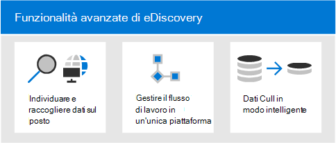
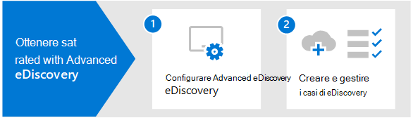

# Panoramica di Microsoft 365 Advanced eDiscoveryOverview of Microsoft 365 Advanced eDiscovery

La Advanced eDiscovery in Microsoft 365 si basa sulle funzionalità di analisi e eDiscovery di Microsoft esistenti.The Advanced eDiscovery solution in Microsoft 365 builds on the existing Microsoft eDiscovery and analytics capabilities. Advanced eDiscovery fornisce un flusso di lavoro end-to-end per conservare, raccogliere, analizzare, esaminare, analizzare ed esportare il contenuto che risponde alle indagini interne ed esterne dell'organizzazione.Advanced eDiscovery provides an end-to-end workflow to preserve, collect, analyze, review, analyze, and export content that's responsive to your organization's internal and external investigations. Consente anche ai team legali di gestire l'intero flusso di lavoro per le notifiche di blocco a fini giudiziari per comunicare con i responsabili coinvolti in un caso.It also lets legal teams manage the entire legal hold notification workflow to communicate with custodians involved in a case.

## Advanced eDiscovery funzionalitàAdvanced eDiscovery capabilities

Advanced eDiscovery può aiutare l'organizzazione a rispondere a questioni legali o indagini interne individuando i dati in cui si trova.Advanced eDiscovery can help your organization respond to legal matters or internal investigations by discovering data where it lives. È possibile gestire senza problemi i flussi di lavoro di eDiscovery identificando le persone di interesse e le relative origini dati, applicare senza problemi i blocchi per conservare i dati e quindi gestire il processo di comunicazione del blocco legale.You can seamlessly manage eDiscovery workflows by identifying persons of interest and their data sources, seamlessly apply holds to preserve data, and then manage the legal hold communication process. Raccogliendo i dati dall'origine, puoi cercare nella piattaforma Microsoft 365 live per trovare rapidamente ciò che ti serve.By collecting data from the source, you can search the live Microsoft 365 platform to quickly find what you need. Le funzionalità di apprendimento automatico intelligenti, ad esempio l'indicizzazione approfondita, il threading della posta elettronica e il rilevamento quasi duplicato, consentono inoltre di ridurre grandi volumi di dati a un set di dati pertinente.Intelligent, machine learning capabilities such as deep indexing, email threading, and near duplicate detection also help you reduce large volumes of data to a relevant data set.

Le sezioni seguenti descrivono in che modo queste Advanced eDiscovery possono aiutare l'organizzazione.The following sections describe how these Advanced eDiscovery capabilities can help your organization.

### Individuare e raccogliere dati sul postoDiscover and collect data in-place

In genere, le organizzazioni che si basano su più soluzioni eDiscovery di terze parti richiedono la copia di grandi volumi di dati Microsoft 365 per elaborare e dover ospitare dati duplicati.Traditionally, organizations that rely on multiple third-party eDiscovery solutions require copying large volumes of data out of Microsoft 365 to process and having to host duplicate data. Questa necessità aumenta il tempo necessario per trovare dati pertinenti e il rischio, i costi e la complessità della gestione di più soluzioni.This necessity increases the time to find relevant data and the risk, cost, and complexity of managing multiple solutions.

Advanced eDiscovery in Microsoft 365 consente di individuare i dati all'origine e di rimanere all'interno del Microsoft 365 di sicurezza e conformità.Advanced eDiscovery in Microsoft 365 lets you discover data at the source and staying within your Microsoft 365 security and compliance boundary.  Raccogliendo i dati sul posto dal sistema reale, Advanced eDiscovery riduce l'attrito di tornare all'origine e riduce il lavoro non necessario di dover trovare contenuto mancante, cosa che spesso accade quando l'inserimento nel journal è in ritardo nelle soluzioni eDiscovery tradizionali.By collecting data in-place from the live system, Advanced eDiscovery reduces the friction of going back to the source and reduces unnecessary work of having to find missing content, which often happens when journaling lags in traditional eDiscovery solutions.

Le funzionalità di ricerca e raccolta native per i dati in Teams, Yammer, SharePoint Online, OneDrive for Business e Exchange Online migliorano ulteriormente l'individuazione dei dati.Native search and collection capabilities for data in Teams, Yammer, SharePoint Online, OneDrive for Business, and Exchange Online further enhances data discovery. Ad esempio, Advanced eDiscovery:For example,  Advanced eDiscovery:

- Ricostruisce Teams conversazioni (anziché restituire singoli messaggi dalle conversazioni).Reconstructs Teams conversations (instead of returning individual messages from conversations).

- Raccoglie contenuto basato sul cloud condiviso con gli utenti tramite collegamenti o allegati moderni nei messaggi di posta elettronica e nelle Teams chat.Collects cloud-based content shared with users by use of links or modern attachments in email message and Teams chats.

- Supporta centinaia di tipi di file non Microsoft 365 incorporati.Has built-in support for hundreds of non-Microsoft 365 file types.

- Raccoglie dati da origini di terze parti (ad esempio Bloomberg, Facebook, Slack e Riunioni zoom) che vengono importati e archiviati in Microsoft 365 dai connettori [di dati.](archiving-third-party-data.md)Collects data from third-party sources (such as Bloomberg, Facebook, Slack, and Zoom Meetings) that's imported and archived in Microsoft 365 by [data connectors](archiving-third-party-data.md).

### Gestire il flusso di lavoro di eDiscovery in una piattaformaManage eDiscovery workflow in one platform

Advanced eDiscovery consente di ridurre il numero di soluzioni eDiscovery su cui è necessario fare affidamento.Advanced eDiscovery can help you reduce the number of eDiscovery solutions you need to rely on. Offre un flusso di lavoro end-to-end semplificato, tutto ciò che si verifica all'interno di Microsoft 365.It provides a streamlined, end-to-end workflow, all which occurs within Microsoft 365. Advanced eDiscovery consente di ridurre l'attrito nell'identificare e raccogliere potenziali fonti di informazioni rilevanti mappando automaticamente origini dati univoche e condivise alla persona di interesse (nota come depositario) e fornendo report e analisi su dati potenzialmente rilevanti prima di raccoglierlo per l'analisi e la revisione.Advanced eDiscovery helps reduce the friction of identifying and collecting potential sources of relevant information by automatically mapping unique and shared data sources to the person of interest (known as a *custodian*), and by providing reporting and analytics on potentially relevant data prior to collecting it for analysis and review.

Inoltre, le API di Microsoft Graph consentono di automatizzare il flusso di lavoro di eDiscovery ed estendere Advanced eDiscovery per soluzioni personalizzate.Additionally, Microsoft Graph APIs can help you automate the eDiscovery workflow and extend Advanced eDiscovery for custom solutions.

### Dati Cull in modo intelligenteCull data intelligently

Le funzionalità di apprendimento automatico intelligenti in Advanced eDiscovery consentono di ridurre la quantità di dati da esaminare.Intelligent, machine learning capabilities in Advanced eDiscovery help you reduce the amount of data to review. Queste funzionalità intelligenti consentono di ridurre e ridurre grandi volumi di dati a un set pertinente.These intelligent capabilities help you reduce and cull large volumes of data to a relevant set. Ad esempio, una query predefinita del set di revisione consente di filtrare solo il contenuto univoco identificando quasi duplicati.For example, a built-in review set query helps filter only for unique content by identifying near duplicates. Questa funzionalità può ridurre notevolmente la quantità di dati da esaminare.This capability can substantially reduce the amount of data to review.

Ulteriori funzionalità di machine learning possono perfezionare e identificare ulteriormente i dati rilevanti utilizzando smart tag e strumenti di revisione assistiti dalla tecnologia come i moduli di pertinenza.Additional machine learning capabilities can further refine and identify relevant data using smart tags and technology assisted review tools like the Relevance modules.

## Advanced eDiscovery allineamento con il modello di riferimento per l'individuazione elettronicaAdvanced eDiscovery alignment with the Electronic Discovery Reference Model

Il flusso di lavoro predefinito di Advanced eDiscovery in Microsoft 365 è allineato al processo di eDiscovery descritto dal modello EDRM (Electronic Discovery Reference Model).The built-in workflow of Advanced eDiscovery in Microsoft 365 aligns with the eDiscovery process outlined by the Electronic Discovery Reference Model (EDRM).

(Origine immagine per gentile edrm.net.(Image source courtesy of edrm.net. L'immagine di origine è stata resa disponibile in Creative Commons Attribution 3.0 Unported License.The source image was made available under Creative Commons Attribution 3.0 Unported License.)

A livello generale, ecco il modo in cui Advanced eDiscovery supporta il flusso di lavoro EDRM:At a high level, here's how Advanced eDiscovery supports the EDRM workflow:

- **Identificazione.****Identification.** Dopo aver identificato le persone potenzialmente coinvolte in un'indagine, è possibile aggiungerle in un caso di Advanced eDiscovery come responsabili (chiamati anche *responsabili dei dati*, perché potrebbero avere informazioni rilevanti per l'indagine).After you identify potential persons of interest in an investigation, you can add them as custodians (also called *data custodians*, because they may possess information that's relevant to the investigation) to an Advanced eDiscovery case. A quel punto, è possibile conservare, raccogliere e rivedere i documenti dei responsabili in tutta facilità.After users are added as custodians, it's easy to preserve, collect, and review custodian documents.

- **Conservazione.****Preservation.** Per conservare e proteggere i dati rilevanti per un'indagine, Advanced eDiscovery consente di impostare un blocco a fini giudiziari sulle origini dati associate ai responsabili in un caso.To preserve and protect data that's relevant to an investigation, Advanced eDiscovery lets you place a legal hold on the data sources associated with the custodians in a case. È anche possibile impostare un blocco per i dati non correlati ai responsabili.You can also place non-custodial data on hold. Advanced eDiscovery include anche un flusso di lavoro predefinito per le comunicazioni, che consente di inviare ai responsabili notifiche di blocco a fini giudiziari e tenere traccia delle loro conferme.Advanced eDiscovery also has a built-in communications workflow so you can send legal hold notifications to custodians and track their acknowledgments.

- **Insieme.****Collection.** Dopo aver identificato e conservato le origini dati rilevanti per l'indagine, è possibile usare lo strumento di ricerca incorporato in Advanced eDiscovery per cercare e raccogliere dati in tempo reale dalle origini dati dei responsabili (e, se applicabile, da origini dati non correlate ai responsabili) che potrebbero essere rilevanti per il caso.After you identified (and preserved) the data sources relevant to the investigation, you can use the built-in search tool in Advanced eDiscovery search for and collect live data from the custodial data sources (and non-custodial data sources, if applicable) that may be relevant to the case.

- **Elaborazione.****Processing.** Dopo aver raccolto tutti i dati rilevanti per il caso, il passaggio successivo consiste nella loro elaborazione per una revisione e un'analisi ulteriori.After you've collected all data relevant to the case, the next step is process it for further review and analysis. In Advanced eDiscovery i dati sul posto identificati nella fase di raccolta vengono copiati in una posizione di Archiviazione di Azure (denominata *insieme da rivedere*), che fornisce una visualizzazione statica dei dati del caso.In Advanced eDiscovery, the in-place data that you identified in the collection phase is copied to an Azure Storage location (called a *review set*), which provides you with a static view of the case data. 

- **Revisione.****Review.** Dopo aver aggiunto i dati a un set di revisioni, è possibile visualizzare documenti specifici ed eseguire query aggiuntive per ridurre i dati a ciò che è più rilevante per il caso.After data has been added to a review set, you can view specific documents and run additional queries to reduce the data to what is most relevant to the case. È possibile inoltre aggiungere annotazioni e tag a documenti specifici.Also, can annotate and tag specific documents.

- **Analisi.****Analysis.** Advanced eDiscovery offre uno strumento di analisi integrato che consente di scegliere ulteriormente i dati dall'insieme da rivedere che si determina non pertinente per l'indagine.Advanced eDiscovery provides integrated analytics tool that helps you further cull data from the review set that you determine isn't relevant to the investigation. Oltre a ridurre il volume dei dati pertinenti, Advance eDiscovery permette anche di risparmiare sui costi di revisione legale, consentendo di organizzare i contenuti in modo da semplificare e rendere più efficiente il processo di revisione.In addition to reducing the volume of relevant data, Advance eDiscovery also helps you save legal review costs by letting you organize content to make the review process easier and more efficient.

- **Produzione** e **presentazione.****Production** and **Presentation.** Quando si è pronti, è possibile esportare i documenti da un insieme da rivedere per la revisione legale.When you're ready, you can export documents from a review set for legal review. È possibile esportare i documenti nel loro formato nativo o in un formato specificato da EDRM in modo da poter essere importati in applicazioni di revisione di terze parti.You can export documents in their native format or in an EDRM-specified format so they can be imported into third-party review applications.

## Abbonamenti e licenzeSubscriptions and licensing

Le licenze per Advanced eDiscovery richiedono l'abbonamento all'organizzazione appropriato e le licenze per utente.Licensing for Advanced eDiscovery requires the appropriate organization subscription and per-user licensing.

- **Sottoscrizione organizzazione:** Per accedere Advanced eDiscovery nel Centro Microsoft 365 conformità, l'organizzazione deve disporre di una delle opzioni seguenti:**Organization subscription:** To access Advanced eDiscovery in the Microsoft 365 compliance center, your organization must have one of the following:

  - Abbonamento a Microsoft 365 E5 o a Office 365 E5Microsoft 365 E5 or Office 365 E5 subscription
  
  - Abbonamento a Microsoft 365 E3 con il componente aggiuntivo E5 ComplianceMicrosoft 365 E3 subscription with E5 Compliance add-on

  - Microsoft 365 E3 sottoscrizione con il componente aggiuntivo E5 eDiscovery e ControlloMicrosoft 365 E3 subscription with E5 eDiscovery and Audit add-on

  - Microsoft 365 Education Sottoscrizione A5 o Office 365 Education A5Microsoft 365 Education A5 or Office 365 Education A5 subscription

   Se non si dispone di un piano di Microsoft 365 E5 esistente e si desidera provare Advanced eDiscovery, è possibile aggiungere [Microsoft 365](https://docs.microsoft.com/office365/admin/try-or-buy-microsoft-365) all'abbonamento esistente o iscriversi [per](https://www.microsoft.com/microsoft-365/enterprise) una versione di valutazione di Microsoft 365 E5.If you don't have an existing Microsoft 365 E5 plan and want to try Advanced eDiscovery, you can [add Microsoft 365](https://docs.microsoft.com/office365/admin/try-or-buy-microsoft-365) to your existing subscription or [sign up for a trial](https://www.microsoft.com/microsoft-365/enterprise) of Microsoft 365 E5.

- **Licenze per utente:** Per aggiungere un utente come responsabile in un caso di Advance eDiscovery, a tale utente deve essere assegnata una delle licenze seguenti, a seconda dell'abbonamento all'organizzazione:**Per-user licensing:** To add a user as a custodian in an Advance eDiscovery case, that user must be assigned one of the following licenses, depending on your organization subscription:

  - Microsoft 365: agli utenti deve essere assegnata una licenza di Microsoft 365 E5, una licenza del componente aggiuntivo Conformità E5 o una licenza del componente aggiuntivo E5 eDiscovery e controllo.Microsoft 365: Users must be assigned a Microsoft 365 E5 license, an E5 Compliance add-on license, or an E5 eDiscovery and Audit add-on license. Microsoft 365 Education agli utenti deve essere assegnata una licenza A5.Microsoft 365 Education users must be assigned an A5 license.

  - Office 365: agli utenti deve essere assegnata una Office 365 E5 o Office 365 Education A5.Office 365: Users must be assigned an Office 365 E5 or Office 365 Education A5 license.

   Per informazioni su come assegnare licenze, vedere [Assegnare licenze agli utenti.](https://docs.microsoft.com/microsoft-365/admin/manage/assign-licenses-to-users)For information about how to assign licenses, see [Assign licenses to users](https://docs.microsoft.com/microsoft-365/admin/manage/assign-licenses-to-users).

> [!NOTE]
> Gli utenti necessitano solo di una licenza E5 o A5 (o della licenza del componente aggiuntivo appropriata) da aggiungere come depositario a un Advanced eDiscovery caso.Users only need an E5 or A5 license (or the appropriate add-on license) to be added as custodians to an Advanced eDiscovery case. Gli amministratori IT, i responsabili di eDiscovery, gli avvocati, i paralegali o gli investigatori che utilizzano Advanced eDiscovery per gestire i casi e esaminare i dati dei casi non necessitano di una licenza E5, A5 o add-on.IT admins, eDiscovery managers, lawyers, paralegals, or investigators who use Advanced eDiscovery to manage cases and review case data don't need an E5, A5, or add-on license.

## Introduzione ad Advanced eDiscoveryGet started with Advanced eDiscovery

Esistono due semplici e rapidi passaggi per iniziare a usare Advanced eDiscovery.There are two quick and easy steps to get started with Advanced eDiscovery.

|PassaggiSteps  |DescrizioneDescription  |
|:---------|:---------|
|[Configurare Advanced eDiscoverySet up Advanced eDiscovery](get-started-with-advanced-ediscovery.md)| Dopo aver verificato i requisiti di sottoscrizione e licenze, è possibile assegnare le autorizzazioni e configurare le impostazioni a livello di organizzazione per iniziare a usare Advanced eDiscovery.After verifying the subscription and licensing requirements, you can assign permissions and configure organization-wide settings to get started using Advanced eDiscovery.|
|[Creare e gestire i casiCreate and manage cases](create-and-manage-advanced-ediscoveryv2-case.md) | Creare casi per gestire il flusso Advanced eDiscovery per tutti i tipi di indagini legali e di altro tipo nell'organizzazione.Create cases to manage the Advanced eDiscovery workflow for all legal and other types of investigations in your organization.|
|||

## Advanced eDiscovery architetturaAdvanced eDiscovery architecture

Ecco un diagramma dell'architettura di Advanced eDiscovery che mostra il flusso di lavoro end-to-end in un ambiente geografico singolo e in un ambiente multi-geografico e il flusso di dati end-to-end allineato a [EDRM.](#advanced-ediscovery-alignment-with-the-electronic-discovery-reference-model)Here's an Advanced eDiscovery architecture diagram that shows the end-to-end workflow in a single-geo environment and in a multi-geo environment, and the end-to-end data flow that's aligned with the [EDRM](#advanced-ediscovery-alignment-with-the-electronic-discovery-reference-model).

[Visualizzazione come immagineView as an image](../media/solutions-architecture-center/m365-advanced-ediscovery-architecture.png)

[Scarica come file PDFDownload as a PDF file](https://download.microsoft.com/download/d/1/c/d1ce536d-9bcf-4d31-b75b-fcf0dc560665/m365-advanced-ediscovery-architecture.pdf)

[Scarica come file VisioDownload as a Visio file](https://download.microsoft.com/download/d/1/c/d1ce536d-9bcf-4d31-b75b-fcf0dc560665/m365-advanced-ediscovery-architecture.vsdx)
