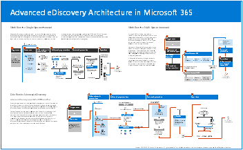
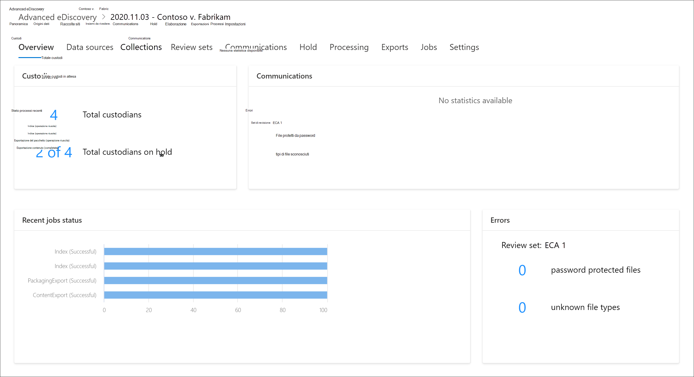

# Panoramica di Microsoft 365 Advanced eDiscovery

La soluzione Advanced eDiscovery in Microsoft 365 si basa sulle funzionalità di analisi e eDiscovery di Microsoft esistenti. Advanced eDiscovery offre un flusso di lavoro end-to-end per conservare, raccogliere, analizzare, esaminare, analizzare ed esportare contenuto che risponde alle indagini interne ed esterne dell'organizzazione. Consente inoltre ai team legali di gestire l'intero flusso di lavoro di notifica di blocco legale per comunicare con i custodi coinvolti in un caso.

Advanced eDiscovery consente all'organizzazione di rispondere a questioni legali o indagini interne individuando i dati in cui si trova. È possibile gestire senza problemi i flussi di lavoro di eDiscovery identificando le persone di interesse e le relative origini dati, applicare senza problemi i blocchi per conservare i dati e quindi gestire il processo di comunicazione del blocco legale. Raccogliendo i dati dall'origine, è possibile cercare nella piattaforma Microsoft 365 live per trovare rapidamente ciò di cui si ha bisogno. Le funzionalità di apprendimento automatico intelligenti, ad esempio l'indicizzazione approfondita, il threading della posta elettronica e il rilevamento quasi duplicato, consentono inoltre di ridurre grandi volumi di dati a un set di dati pertinente.

Nelle sezioni seguenti viene descritto in che modo queste funzionalità di eDiscovery avanzate possono aiutare l'organizzazione.

## Individuare e raccogliere dati sul posto

In genere, le organizzazioni che si basano su più soluzioni eDiscovery di terze parti richiedono la copia di grandi volumi di dati da Microsoft 365 per elaborare e dover ospitare dati duplicati. Questa necessità aumenta il tempo necessario per trovare dati pertinenti e il rischio, i costi e la complessità della gestione di più soluzioni.

Advanced eDiscovery in Microsoft 365 consente di individuare i dati all'origine e di rimanere entro i limiti di sicurezza e conformità di Microsoft 365.  Raccogliendo i dati sul posto dal sistema live, Advanced eDiscovery riduce l'attrito di tornare all'origine e riduce il lavoro non necessario di dover trovare contenuto mancante, cosa che spesso accade quando l'inserimento nel journal è in ritardo nelle soluzioni eDiscovery tradizionali.

Le funzionalità di ricerca e raccolta native per i dati in Teams, Yammer, SharePoint Online, OneDrive for Business ed Exchange Online migliorano ulteriormente l'individuazione dei dati. Ad esempio, Advanced eDiscovery:

- Ricostruisce le conversazioni di Teams anziché restituire singoli messaggi dalle conversazioni.

- Raccoglie contenuto basato sul cloud condiviso con gli utenti tramite collegamenti o allegati moderni nei messaggi di posta elettronica e nelle chat di Teams.

- Supporto incorporato per centinaia di tipi di file non Microsoft 365.

- Raccoglie dati da origini di terze parti (ad esempio Bloomberg, Facebook, Slack e Riunioni zoom) importati e archiviati in Microsoft 365 dai connettori [dati.](archiving-third-party-data.md)

## Gestire il flusso di lavoro di eDiscovery in una piattaforma

Advanced eDiscovery consente di ridurre il numero di soluzioni eDiscovery su cui è necessario fare affidamento. Offre un flusso di lavoro end-to-end semplificato, tutto ciò che avviene all'interno di Microsoft 365. Advanced eDiscovery consente di ridurre l'attrito nell'identificare e raccogliere potenziali fonti di informazioni rilevanti mappando automaticamente origini dati univoche e condivise alla persona di interesse (nota come depositario) e fornendo report e analisi su dati potenzialmente rilevanti prima di raccoglierlo per l'analisi e la revisione.

Inoltre, le API di Microsoft Graph consentono di automatizzare il flusso di lavoro di eDiscovery ed estendere Advanced eDiscovery per soluzioni personalizzate.

## Dati Cull in modo intelligente

Le funzionalità di apprendimento automatico intelligenti in Advanced eDiscovery consentono di ridurre la quantità di dati da esaminare. Queste funzionalità intelligenti consentono di ridurre e ridurre grandi volumi di dati a un set pertinente. Ad esempio, una query predefinita del set di revisione consente di filtrare solo il contenuto univoco identificando quasi duplicati. Questa funzionalità può ridurre notevolmente la quantità di dati da esaminare.

Ulteriori funzionalità di machine learning possono perfezionare e identificare ulteriormente i dati rilevanti utilizzando smart tag e strumenti di revisione assistiti dalla tecnologia come i moduli di pertinenza.

## Architettura avanzata di eDiscovery

Ecco un diagramma dell'architettura di Advanced eDiscovery che mostra il flusso di lavoro end-to-end in un ambiente a singola area geografica e in un ambiente multi-geografico e il flusso di dati end-to-end allineato al modello EDRM [(Electronic Discovery Reference Model).](advanced-ediscovery-edrm.md)

[Visualizzazione come immagine](../media/solutions-architecture-center/m365-advanced-ediscovery-architecture.png)

[Scarica come file PDF](https://download.microsoft.com/download/d/1/c/d1ce536d-9bcf-4d31-b75b-fcf0dc560665/m365-advanced-ediscovery-architecture.pdf)

[Download come file di Visio](https://download.microsoft.com/download/d/1/c/d1ce536d-9bcf-4d31-b75b-fcf0dc560665/m365-advanced-ediscovery-architecture.vsdx)

Per ulteriori informazioni sul flusso di lavoro end-to-end in Advanced eDiscovery, vedere questo [video di Microsoft Mechanics.](https://go.microsoft.com/fwlink/?linkid=2066133)

## Flusso di lavoro advanced eDiscovery

Le sezioni seguenti descrivono ogni passaggio del flusso di lavoro incorporato nello strumento Advanced eDiscovery nel Centro conformità Microsoft 365. Lo screenshot seguente mostra la **scheda Panoramica** di un caso denominato *2020.11.03 - Contoso v. Fabrikam.*

Per informazioni più dettagliate, vedere [Manage the Advanced eDiscovery workflow](create-and-manage-advanced-ediscoveryv2-case.md#manage-the-workflow).

### Gestione dei depositario e delle origini dati non di custodia

Utilizzare la **scheda** Origini dati per aggiungere e gestire le persone identificate come persone di interesse nel caso e altre origini dati che potrebbero non essere associate a un responsabile. Quando si aggiungono i custodi o le origini dati non depositario, è possibile eseguire rapidamente azioni come l'applicazione di un blocco legale alle origini dati depositario e non depositario, la comunicazione con i custodi e la ricerca di origini dati depositario e non depositario per raccogliere contenuti rilevanti per il caso. Con l'avanzamento del caso, è facile aggiungere nuovi depositati o origini data non depositario o rilasciarle dal caso. Per ulteriori informazioni, vedere [Work with custodians.](managing-custodians.md)

### Gestione delle notifiche di blocco legale

Utilizzare la **scheda** Comunicazioni per gestire il processo di comunicazione con i custodi nel caso. Un avviso di blocco legale indica ai custodi di conservare qualsiasi contenuto rilevante per il caso. I team legali devono essere in grado di tenere traccia degli avvisi ricevuti, letti e riconosciuti dai custodi. Il flusso di lavoro per le comunicazioni in Advanced eDiscovery consente di creare e inviare notifiche iniziali, promemoria, avvisi di rilascio e escalation se i custodi non riconoscono una notifica di blocco. Per ulteriori informazioni, vedere [Utilizzo delle comunicazioni.](managing-custodian-communications.md)

### Gestione dell'archiviazione del contenuto

Quando si aggiunge un responsabile a un caso, è possibile mettere un blocco sui dati di custodia. Utilizzare la **scheda Esenzione** per gestire il blocco creato quando si aggiungono i custodi e per gestire altre esenzioni legali associate al caso; ad esempio, è possibile identificare e impostare un blocco sulle origini dati non di custodia. È inoltre possibile modificare qualsiasi blocco nel caso e renderlo un'esenzione basata su query per conservare solo il contenuto corrispondente alla query. Ad esempio, è possibile aggiungere un intervallo di date all'esenzione in modo che solo il contenuto creato all'interno di un intervallo di date specifico sia conservato. Puoi anche ottenere statistiche sul contenuto in attesa, rimuovere il blocco dopo che non è più rilevante per il caso o eliminarlo. Per ulteriori informazioni, vedere [Manage holds](managing-holds.md).

### Indicizzazione dei dati del responsabile

Quando si aggiunge un responsabile e le origini dati di custodia corrispondenti a un caso, qualsiasi elemento parzialmente indicizzato da un'origine dati di tipo depositario viene reindicizzato da un processo denominato *Indicizzazione avanzata.* In questo modo il contenuto di archiviazione, ad esempio immagini, tipi di file non supportati e altri contenuti potenzialmente non indicizzati, può essere completamente ricercabile quando si eseguono ricerche per raccogliere dati per il caso. Utilizzare la **scheda Elaborazione** per monitorare lo stato dell'indicizzazione avanzata e correggere gli errori di elaborazione utilizzando un processo denominato correzione *degli errori.* Per ulteriori informazioni, vedere [Correggere gli errori di elaborazione.](processing-data-for-case.md)

### Raccolta dei dati del caso

Utilizzare la **scheda Ricerche** per creare ricerche per cercare il contenuto rilevante per il caso nelle origini dati sul posto e non depositario. È possibile creare ed eseguire ricerche basate su query (utilizzando parole chiave e condizioni) per identificare un set di messaggi di posta elettronica e documenti rilevanti per il caso e che si desidera esaminare e analizzare ulteriormente nei passaggi successivi del flusso di lavoro di eDiscovery. È possibile creare una o più ricerche associate al caso. È inoltre possibile utilizzare lo strumento di ricerca per visualizzare in anteprima i documenti di esempio e visualizzare le statistiche di ricerca per perfezionare e migliorare i risultati della ricerca. Dopo aver soddisfatto i risultati della ricerca che contengono tutti i dati rilevanti per il caso, è necessario aggiungere i risultati della ricerca a un set di revisione per ulteriori analisi, analisi e analisi. Per ulteriori informazioni, vedere [Raccogliere dati per un caso.](collecting-data-for-ediscovery.md)

### Revisione e analisi dei dati dei casi

Usa la **scheda Review sets** per esaminare e analizzare il contenuto raccolto dal sistema live e aggiunto a un set di recensioni. Un *set* di revisione è una raccolta statica di dati (in altre parole, una copia offline dei dati) di dati di custodia (e, se applicabile, dati non depositario) raccolti nella fase precedente del flusso di lavoro di eDiscovery. Quando si aggiungono risultati di ricerca a un set di revisione, viene attivato un processo per estrarre i file dai contenitori, estrarre metadati ed estrarre testo. Al termine di questo processo, il sistema crea un nuovo indice di tutti i dati raccolti dai custodi e li aggiunge al set di revisione. Dopo aver aggiunto i dati al set di revisioni, è possibile eseguire più query per restringere i dati del caso, visualizzare i dati come testo o nel formato di file nativo e annotare, redigere e contrassegnare i documenti nel set di revisioni. È inoltre possibile eseguire analisi avanzate, ad esempio identificare la duplicazione dei documenti, il threading della posta elettronica e i temi. Dopo aver definito i dati solo per quanto riguarda il caso, è possibile scaricare i documenti direttamente o esportarli insieme a metadati di file, annotazioni ed eventuali tag. Per altre informazioni, vedere:

- [Visualizzare i documenti in un insieme da rivedere](view-documents-in-review-set.md)

- [Eseguire query sui dati in un insieme da rivedere](review-set-search.md)

- [Contrassegnare i documenti in un insieme da rivedere](tagging-documents.md)

- [Analizzare i dati in un set di recensioni](analyzing-data-in-review-set.md)

### Esportazione dei dati per la revisione e la presentazione

Dopo aver esportato i dati da un set di revisione, utilizzare la scheda **Esportazioni** per gestire un processo di esportazione e scaricare i dati da un set di revisione. Quando si esporta un set di recensioni, i dati vengono caricati in una posizione di Archiviazione di Azure fornita da Microsoft (o in una posizione di Archiviazione di Azure gestita dall'organizzazione). Dopo essere stato caricato in Azure, è quindi disponibile per il download in un computer locale. È possibile ottenere la chiave di valutazione di archiviazione necessaria per scaricare i dati esportati nella **scheda** Esportazioni. Per ulteriori informazioni, vedere [Export case data](exporting-data-ediscover20.md).

### Gestione dei processi

Utilizzare la **scheda** Processi per monitorare i processi a esecuzione lunga per le attività correlate al caso avviate. Alcuni esempi di processi sono quelli relativi alla reindicizzazione, alla ricerca e all'esportazione dei dati dei casi. Ad esempio, se si crea  una ricerca nella scheda Ricerche che include molte origini dati, lo stato di questo processo di ricerca verrà visualizzato nella **scheda Processi.** Per ulteriori informazioni, vedere [Manage jobs.](managing-jobs-ediscovery20.md)

### Configurazione delle impostazioni dei casi

Utilizzare la **scheda Impostazioni** per configurare le impostazioni a livello di caso. Ciò include l'aggiunta di membri a un caso, la chiusura o l'eliminazione di un caso e la configurazione delle impostazioni di ricerca e analisi. Per altre informazioni, vedere:

- [Aggiungere membri a un caso](add-or-remove-members-from-a-case-in-advanced-ediscovery.md)

- [Chiudere o eliminare un caso](close-or-delete-case.md)

- [Configurare le impostazioni di ricerca e analisi](configure-search-and-analytics-settings-in-advanced-ediscovery.md)
