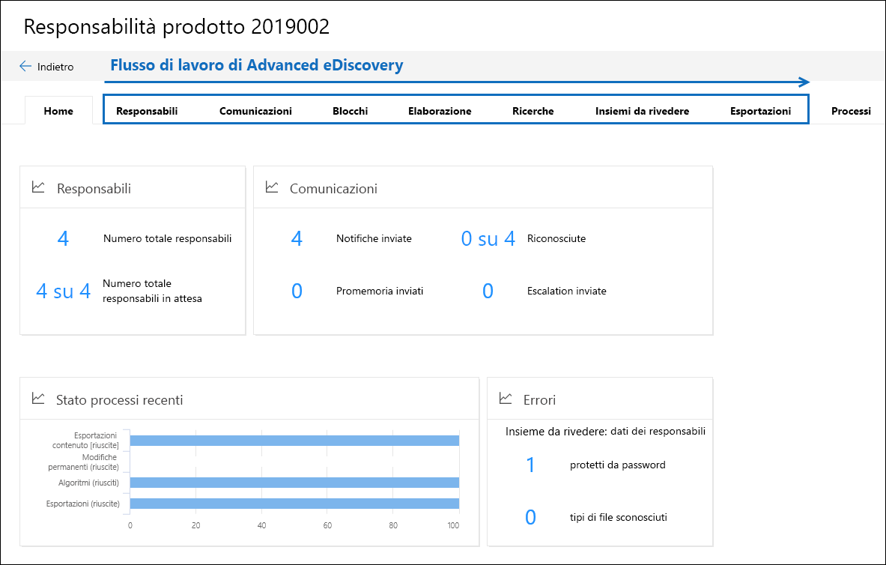

# Panoramica della soluzione avanzata di eDiscovery in Microsoft 365Overview of the Advanced eDiscovery solution in Microsoft 365

La soluzione avanzata di eDiscovery in Microsoft 365 si basa sulle funzionalità esistenti di eDiscovery e analisi di Office 365.The Advanced eDiscovery solution in Microsoft 365 builds on the existing eDiscovery and analytics capabilities in Office 365. Questa nuova soluzione, denominata *Advanced eDiscovery*, offre un flusso di lavoro end-to-end per conservare, raccogliere, rivedere, analizzare ed esportare il contenuto rispondente alle indagini interne ed esterne dell'organizzazione.This new solution, called *Advanced eDiscovery*, provides an end-to-end workflow to preserve, collect, review, analyze, and export content that's responsive to your organization's internal and external investigations. Consente inoltre ai team legali di gestire l'intero flusso di lavoro di notifica per la conservazione legale per comunicare con i depositari coinvolti in un caso.It also lets legal teams manage the entire legal hold notification workflow to communicate with custodians involved in a case. 

## Allineamento con EDRMAlignment with EDRM

Il flusso di lavoro incorporato di Advanced eDiscovery è allineato al processo eDiscovery descritto dal modello di riferimento di Electronic Discovery (EDRM).The built-in workflow of Advanced eDiscovery aligns with the eDiscovery process outlined by the Electronic Discovery Reference Model (EDRM). 

(Fonte di immagini per gentile concessione di edrm.net.(Image source courtesy of edrm.net. L'immagine di origine è stata resa disponibile nella licenza Creative Commons Attribution 3,0 Unported.The source image was made available under Creative Commons Attribution 3.0 Unported License.)

A livello elevato, ecco come Advanced eDiscovery supporta il flusso di lavoro di EDRM:At a high level, here's how Advanced eDiscovery supports the EDRM workflow:

- **Identificazione.****Identification.** Dopo aver identificato potenziali persone di interesse in un'indagine, è possibile aggiungerle come depositari (denominate anche *depositari dei dati*, in quanto potrebbero essere in possesso di informazioni rilevanti per l'indagine) in un caso di eDiscovery avanzato.After you identify potential persons of interest in an investigation, you can add them as custodians (also called *data custodians*, because they may possess information that's relevant to the investigation) to an Advanced eDiscovery case. Dopo che gli utenti vengono aggiunti come depositari, è facile conservare, raccogliere e rivedere i documenti del custode.After users are added as custodians, it's easy to preserve, collect, and review custodian documents.

- **Conservazione.****Preservation.** Per conservare e proteggere i dati rilevanti per un'indagine, Advanced eDiscovery consente di inserire una conservazione legale sulle origini dati associate ai depositari in un caso.To preserve and protect data that's relevant to an investigation, Advanced eDiscovery lets you place a legal hold on the data sources associated with the custodians in a case. È inoltre possibile inserire i dati non detentivi in attesa.You can also place non-custodial data on hold. Advanced eDiscovery dispone anche di un flusso di lavoro di comunicazione incorporato in modo da poter inviare notifiche di archiviazione legale ai depositari e tenere conto dei loro ringraziamenti.Advanced eDiscovery also has a built-in communications workflow so you can send legal hold notifications to custodians and track their acknowledgments.

- **Raccolta.****Collection.** Dopo aver identificato (e conservato) le origini dati rilevanti per l'analisi, è possibile utilizzare lo strumento di ricerca incorporato in Advanced eDiscovery Search for and Collect Live Data from the affidatario Data Sources (e non-affidatario Data Sources, se applicabile) potrebbe essere pertinente per il caso.After you identified (and preserved) the data sources relevant to the investigation, you can use the built-in search tool in Advanced eDiscovery search for and collect live data from the custodial data sources (and non-custodial data sources, if applicable) that may be relevant to the case.

- **Elaborazione.****Processing.** Dopo aver raccolto tutti i dati rilevanti per il caso, il passaggio successivo consiste nel processo per ulteriori riesami e analisi.After you've collected all data relevant to the case, the next step is process it for further review and analysis. In Advanced eDiscovery, i dati sul posto identificati nella fase di raccolta vengono copiati in un percorso di archiviazione di Azure (denominato *set di revisione*), in cui viene fornita una visualizzazione statica dei dati del caso.In Advanced eDiscovery, the in-place data that you identified in the collection phase is copied to an Azure Storage location (called a *review set*), which provides you with a static view of the case data. 
 
- **Recensione.****Review.** Dopo aver aggiunto i dati a un set di revisione, è possibile visualizzare documenti specifici ed eseguire un'altra query per ridurre i dati a ciò che è più pertinente per il caso.After data has been added to a review set, you can view specific documents and run another queries to reduce the data to what is most relevant to the case. Inoltre, è possibile annotare e contrassegnare documenti specifici.Also, can annotate and tag specific documents.
 
- **Analisi.****Analysis.** Advanced eDiscovery fornisce uno strumento di analisi integrata che consente di eliminare i dati dall'insieme di revisione che si determina non è pertinente per l'indagine.Advanced eDiscovery provides integrated analytics tool that helps you further cull data from the review set that you determine isn't relevant to the investigation. Oltre a ridurre il volume dei dati rilevanti, Advance eDiscovery aiuta anche a salvare i costi di revisione legale, consentendo di organizzare il contenuto per semplificare e rendere più efficiente il processo di revisione.In addition to reducing the volume of relevant data, Advance eDiscovery also helps you save legal review costs by letting you organize content to make the review process easier and more efficient.

- **Produzione** e **presentazione.****Production** and **Presentation.** Quando si è pronti, è possibile esportare i documenti da un set di revisione per la revisione legale.When you're ready, you can export documents from a review set for legal review. È possibile esportare documenti nel formato nativo o in un formato specificato per EDRM in modo che possano essere importati in applicazioni di revisione di terze parti.You can export documents in their native format or in an EDRM-specified format so they can be imported into third-party review applications.

## Flusso di lavoro avanzato di eDiscoveryAdvanced eDiscovery workflow

Nelle sezioni seguenti vengono descritti i singoli passaggi del flusso di lavoro incorporato in Advanced eDiscovery.The following sections describe each step in the built-in workflow in Advanced eDiscovery. Nella schermata seguente viene illustrata la scheda **Home** di un caso denominato *Product passivity 2019002*.The following screenshot shows the **Home** tab of a case named *Product Liability 2019002*. Nota le schede del flusso di lavoro nella parte superiore della pagina vengono sequenziate per essere allineate al processo EDRM.Note the workflow tabs at the top of the page are sequenced to align with the EDRM process. 

Per ulteriori informazioni sul flusso di lavoro end-to-end in Advanced eDiscovery, vedere this [Microsoft Mechanics video](https://go.microsoft.com/fwlink/?linkid=2066133).For more information about the end-to-end workflow in Advanced eDiscovery, see this [Microsoft Mechanics video](https://go.microsoft.com/fwlink/?linkid=2066133). 

## Gestione dei depositariManaging custodians

Utilizzare la scheda **depositari** per aggiungere e gestire le persone che sono state identificate come persone di interesse nel caso.Use the **Custodians** tab to add and manage the people that you've identified as persons of interest in the case. Quando si aggiungono depositari, è possibile eseguire rapidamente azioni relative a un custode come l'archiviazione di un blocco legale su origini dati depositarie, la comunicazione con i depositari e la ricerca di origini dati depositarie per raccogliere contenuti rilevanti per il caso.When you add custodians, you can quickly perform custodian-related actions like placing a legal hold on custodian data sources, communicating with custodians, and searching custodian data sources to collect content that's relevant to the case. Quando il caso progredisce, è facile aggiungere nuovi depositari o rilasciarli dal caso.As the case progresses, it's easy to add new custodians or release custodians from the case. Per ulteriori informazioni, vedere [lavorare con i depositari in Advanced eDiscovery](managing-custodians.md).For more information, see [Work with custodians in Advanced eDiscovery](managing-custodians.md).

## Gestione delle notifiche di blocco legaleManaging legal hold notifications

Utilizzare la scheda **comunicazioni** per gestire il processo di comunicazione con i depositari nel caso.Use the **Communications** tab to manage the process of communicating with the custodians in the case. Un avviso per la conservazione legale indica ai depositari di conservare i contenuti rilevanti per il caso.A legal hold notice instructs custodians to preserve any content that's relevant to the case. I team legali devono essere in grado di tenere conto delle notifiche ricevute, lette e riconosciute dai depositari.Legal teams must be able to track the notices that have been received, read, and acknowledged by custodians. Il flusso di lavoro per le comunicazioni in Advanced eDiscovery consente di creare e inviare notifiche iniziali, promemoria, notifiche di rilascio e escalation se i depositari non riescono a riconoscere una notifica di blocco.The communications workflow in Advanced eDiscovery allows you to create and send initial notifications, reminders, release notices, and escalations if custodians fail to acknowledge a hold notification. Per ulteriori informazioni, vedere [work with Communications in Advanced eDiscovery](managing-custodian-communications.md).For more information, see [Work with communications in Advanced eDiscovery](managing-custodian-communications.md).

## Gestione della conservazione dei contenutiManaging content preservation

Quando si aggiunge un custode a un caso, è possibile applicare un blocco ai dati della custodia.When you add a custodian to a case, you can place a hold on custodial data. Utilizzare la scheda **esenzioni** per gestire il blocco creato quando si aggiungono i depositari e per gestire altre esenzioni legali associate al caso. ad esempio, è possibile identificare e applicare un'esenzione su origini dati non detentive.Use the **Holds** tab to manage the hold created when you add custodians, and to manage other legal holds associated with the case; for example, you can identify and place a hold on non-custodial data sources. È inoltre possibile modificare qualsiasi blocco nel caso e renderlo un blocco basato su query per conservare solo il contenuto che corrisponde alla query.You can also edit any hold in the case and make it a query-based hold to preserve only the content that matches the query. Ad esempio, è possibile aggiungere un intervallo di date alla conservazione in modo che solo il contenuto creato all'interno di una data specifica sia stato conservato.For example, you could add a date range to the hold so that only content created within a specific date ranged in preserved. È anche possibile ottenere statistiche sul contenuto che è in attesa, rimuovere il blocco dopo che non è più pertinente al caso o eliminarlo.You can also get statistics on content that's on hold, remove the hold after it's no longer relevant to the case, or delete it. Per ulteriori informazioni, vedere [Manage holds in Advanced eDiscovery](managing-holds.md).For more information, see [Manage holds in Advanced eDiscovery](managing-holds.md).

## Indicizzazione dei dati del custodeIndexing custodian data

Quando si aggiunge un custode e le origini dati di custodia corrispondenti a un caso, qualsiasi elemento parzialmente indicizzato da un'origine dati di un oggetto depositaria viene reindicizzato tramite un processo denominato *Advanced indicizzazione*.When you add a custodian and the corresponding custodial data sources to a case, any partially indexed item from a custodian data source is re-indexed by a process called *Advanced indexing*. In questo modo, è possibile eseguire ricerche per raccogliere i dati per il caso in cui vengano eseguiti contenuti di archiviazione, ad esempio immagini, tipi di file non supportati e altro contenuto potenzialmente non indicizzato.This allows custodial content such as images, unsupported file types, and other potentially unindexed content to be fully searchable when you run searches to collect data for the case. Utilizzare la scheda **elaborazione** per monitorare lo stato dell'indicizzazione avanzata e correggere gli errori di elaborazione utilizzando un *processo denominato correzione degli errori.*Use the **Processing** tab to monitor the status of Advanced indexing and fix processing errors by using a process called *error remediation*. Per ulteriori informazioni, vedere [correggere gli errori di elaborazione in Advanced eDiscovery](processing-data-for-case.md).For more information, see [Fix processing errors in Advanced eDiscovery](processing-data-for-case.md).

## Raccolta dei dati del casoCollecting case data

Utilizzare la scheda **ricerche** per creare ricerche per cercare le origini dati in locale e non detentive in Office 365 per i contenuti rilevanti per il caso.Use the **Searches** tab to create searches to search the in-place custodial and non-custodial data sources in Office 365 for content relevant to the case. È possibile creare ed eseguire ricerche basate su query (utilizzando parole chiave e condizioni) per identificare un insieme di messaggi di posta elettronica e documenti rilevanti per il caso e che si desidera esaminare e analizzare ulteriormente nei passaggi successivi del flusso di lavoro di eDiscovery.You can create and run query-based searches (using keywords and conditions) to identify a set of email messages and documents that are relevant to the case and that you want to further review and analyze in subsequent steps in the eDiscovery workflow. È possibile creare una o più ricerche associate al caso.You can create one or more searches associated with the case. È inoltre possibile utilizzare lo strumento di ricerca per visualizzare in anteprima i documenti di esempio e visualizzare le statistiche di ricerca che consentono di affinare e migliorare i risultati della ricerca.You can also use the search tool to preview sample documents and view search statistics to help you refine and improve the search results. Dopo aver soddisfatto i risultati della ricerca contengono tutti i dati rilevanti per il caso, è possibile aggiungere i risultati della ricerca a un set di revisione per ulteriori riesami, analisi e eliminazione.After you're satisfied the search results contain the all data relevant to the case, you add the search results to a review set for further review, analysis, and culling. Per ulteriori informazioni, vedere [raccolta di dati per un caso in Advanced eDiscovery](collecting-data-for-ediscovery.md).For more information, see [Collect data for a case in Advanced eDiscovery](collecting-data-for-ediscovery.md).

## Revisione e analisi dei dati del casoReviewing and analyzing case data

Utilizzare la scheda **revisione dei set** per esaminare e analizzare il contenuto raccolto dal sistema Live e aggiungerlo a un set di revisione.Use the **Review sets** tab to review and analyze the content that you've collected from the live system and added to a review set. Un *set di revisione* è una raccolta statica di tali dati (in altre parole, una copia offline di dati) dei dati di custodia (e, se applicabile, i dati non detentivi) raccolti nella fase precedente del flusso di lavoro di eDiscovery.A *review set* is a static collection of that data (in other words, an offline copy of data) of custodial data (and if applicable, non-custodial data) that you collected in the previous phase of the eDiscovery workflow. Quando si aggiungono i risultati di ricerca a un set di revisione, viene attivato un processo che estrae i file dai contenitori, estrae i metadati ed estrae il testo.When you add search results to a review set, a process is triggered that extracts files from containers, extracts metadata, and extracts text. Al termine del processo, il sistema crea un nuovo indice di tutti i dati raccolti dai depositari e lo aggiunge al set di revisione.When this process is complete, the system builds a new index of all the data collected from custodians and adds it to the review set. Dopo aver aggiunto i dati al set di revisione, è possibile eseguire altre query per limitare i dati del caso, visualizzare i dati come testo o nel formato di file nativo e annotare, redigere e contrassegnare i documenti nel set di revisione.After the data is added to the review set, you can run more queries to narrow the case data, view data as text or in the native file format, and annotate, redact, and tag documents in the review set. È inoltre possibile eseguire analisi avanzate, ad esempio la duplicazione dei documenti, il threading di posta elettronica e i temi.You can also perform advanced analytics such as identify document duplication, email threading, and themes. Dopo aver abbattuto i dati solo su ciò che è pertinente per il caso, è possibile scaricare i documenti direttamente o esportarli insieme ai metadati, alle annotazioni e ai tag dei file.After you've culled the data to only what is relevant to the case, you can either download documents directly or export them along with file metadata, annotations, and any tags. Per altre informazioni, vedere:For more information, see:

- [Visualizzare i documenti in un insieme da rivedereView documents in a review set](view-documents-in-review-set.md)

- [Eseguire query sui dati in un insieme da rivedereQuery the data in a review set](review-set-search.md)

- [Contrassegnare i documenti in un insieme da rivedereTag documents in a review set](tagging-documents.md)

- [Analizzare i dati in un set di RevisioneAnalyze data in a review set](analyzing-data-in-review-set.md)

## Esportazione di dati per la revisione e la presentazioneExporting data for review and presentation

Dopo aver esportato i dati da un set di revisione, utilizzare la scheda **Esporta** per gestire un processo di esportazione e scaricare i dati da un set di revisione.After you export the data from a review set, use the **Exports** tab to manage an export job and download data from a review set. Quando si esporta un set di revisione, i dati vengono caricati in una posizione di archiviazione di Azure fornita da Microsoft (o in un percorso di archiviazione di Azure gestito dall'organizzazione).When you export a review set, the data is uploaded to a Microsoft-provided Azure Storage location (or an Azure Storage location managed by your organization). Dopo che è stato caricato in Azure, è disponibile per il download in un computer locale.After it's uploaded to Azure, it's then and available to download to a local computer. È possibile ottenere la chiave di valutazione dell'archiviazione necessaria per scaricare i dati esportati nella scheda **esportazioni** . Per ulteriori informazioni, vedere [esportare i dati del caso in Advanced eDiscovery](exporting-data-ediscover20.md).You can obtain the storage assess key necessary to download the exported data on the **Exports** tab. For more information, see [Export case data in Advanced eDiscovery](exporting-data-ediscover20.md).

## Gestione dei processiManaging jobs

Utilizzare la scheda **processi** per monitorare i processi a esecuzione prolungata per le attività correlate al caso che sono state avviate.Use the **Jobs** tab to monitor long-running processes for case-related tasks that you've initiated. Alcuni esempi di processi includono quelli relativi alla reindicizzazione, alla ricerca e all'esportazione dei dati del caso.Examples of jobs include ones related to reindexing, searching, and exporting case data. Ad esempio, se si crea una ricerca nella scheda **ricerche** che include molte origini dati, lo stato del processo di ricerca verrà visualizzato nella scheda **processi** . Per ulteriori informazioni, vedere [gestire i processi in Advanced eDiscovery](managing-jobs-ediscovery20.md).For example, if you create a search on the **Searches** tab that includes many data sources, the status of this search process will be displayed on the **Jobs** tab. For more information, see [Manage jobs in Advanced eDiscovery](managing-jobs-ediscovery20.md).

## Configurazione delle impostazioni del casoConfiguring case settings

Utilizzare la scheda **Impostazioni** per configurare le impostazioni a livello di maiuscole e minuscole.Use the **Settings** tab to configure case-wide settings. Questo include l'aggiunta di membri a un caso, la chiusura o l'eliminazione di un caso e la configurazione delle impostazioni di ricerca e analisi.This includes adding members to a case, closing or deleting a case, and configuring search and analytics settings.

## Report avanzati di eDiscoveryAdvanced eDiscovery reports

È possibile utilizzare i report avanzati di eDiscovery nella Home page per aiutare l'organizzazione a monitorare l'attività e lo stato in tutti i casi di eDiscovery avanzato.You can use the Advanced eDiscovery reports on the home page to help your organization track activity and status across all Advanced eDiscovery cases. La funzionalità Advanced eDiscovery Reports aggrega le informazioni sui casi, i depositari, le origini dati e le comunicazioni.The Advanced eDiscovery reports feature aggregates information about cases, custodians, data sources, and communications. È possibile filtrare i dati del report in base a vari criteri ed esportare le informazioni aggregate in un file CSV per un'ulteriore analisi.You can filter the report data based on various criteria and export the aggregated information to a CSV file for further analysis.  Per ulteriori informazioni, vedere [Advanced eDiscovery Reports](advanced-ediscovery-reports.md).For more information, see [Advanced eDiscovery reports](advanced-ediscovery-reports.md).
