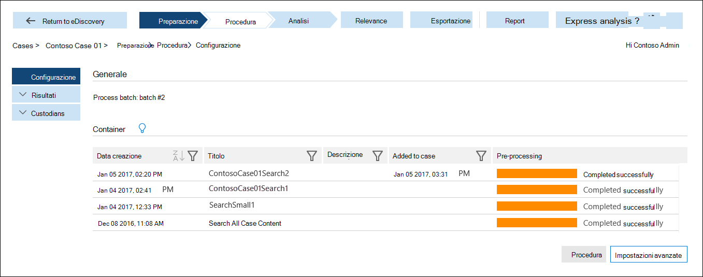

# Preparare i dati per Advanced eDiscovery (Classic)

In questo argomento viene descritto come caricare i risultati di una ricerca di contenuto in un caso in Advanced eDiscovery (Classic). 
  
> [!IMPORTANT]
> Microsoft continua a investire in nuove versioni di Advanced eDiscovery e annuncia il ritiro di Advanced eDiscovery, noto anche come *Advanced eDiscovery (classico)* o *Advanced eDiscovery v1.0*. Se si usa ancora Advanced eDiscovery v 1.0, passare al più presto ad [Advanced eDiscovery v2.0](overview-ediscovery-20.md), noto anche come *soluzione Advanced eDiscovery in Microsoft 365*. Advanced eDiscovery 2.0 contiene funzionalità simili a quelle disponibili in Advanced eDiscovery v1.0, ma offre anche numerose nuove caratteristiche, come gestione dei responsabili, gestione delle comunicazioni e insiemi da rivedere. Per altre informazioni sul ritiro di Advanced eDiscovery v 1.0, vedere [Ritiro degli strumenti di eDiscovery legacy](legacy-ediscovery-retirement.md#advanced-ediscovery-v10).  
  
## Passaggio 1: preparare i dati per Advanced eDiscovery

Per analizzare i dati con Advanced eDiscovery, è possibile utilizzare i risultati di una ricerca di contenuto eseguita nel centro sicurezza e conformità di Microsoft 365 &amp; (elencata nella pagina **Ricerca contenuto** nel centro sicurezza e conformità di Microsoft 365 &amp; ) oppure una ricerca associata a un caso eDiscovery (elencato nella pagina **eDiscovery** nel centro sicurezza e &amp; conformità). 
  
Per la procedura dettagliata relativa alla preparazione dei risultati della ricerca per l'analisi in Advanced eDiscovery, vedere [Prepare search results for Advanced eDiscovery](prepare-search-results-for-advanced-ediscovery.md).
  
> [!NOTE]
> Se si dispone di dati al di fuori di Microsoft 365 e si desidera importarlo in Microsoft 365 in modo che sia possibile prepararlo e analizzarlo in Advanced eDiscovery, vedere [Overview of import PST files to microsoft 365](https://docs.microsoft.com/microsoft-365/compliance/importing-pst-files-to-office-365) e [Archiving Third-Party data](https://www.microsoft.com/?ref=go). 
  
## Passaggio 2: caricare i dati dei risultati della ricerca in un caso in Advanced eDiscovery

Dopo aver preparato i risultati della ricerca nel &amp; Centro sicurezza e conformità per l'analisi, il passaggio successivo consiste nel caricare i risultati della ricerca in un caso in Advanced eDiscovery. Per informazioni più dettagliate, vedere [Run the process Module](run-the-process-module-in-advanced-ediscovery.md).
  
1. Passare a [https://protection.office.com](https://protection.office.com).
    
2. Accedere usando l'account di lavoro o della scuola.
    
3. Nel Centro sicurezza e conformità, fare clic su **Ricerca e analisi** \> **eDiscovery** per visualizzare l'elenco di casi nell'organizzazione. 
    
4. Fare clic su **Apri** accanto al caso in cui si desidera caricare i dati in Advanced eDiscovery. 
    
5. Nella **Home** page del caso, fare clic su **Advanced eDiscovery**. 
    
    
  
    Viene visualizzata la barra **di avanzamento per la connessione a Advanced eDiscovery** . Quando si è connessi a Advanced eDiscovery, viene visualizzato un elenco di contenitori nella pagina di installazione del caso. 
    
    
  
     Questi contenitori rappresentano i risultati della ricerca preparati per l'analisi in Advanced eDiscovery nel passaggio 1. Si noti che il nome del contenitore ha lo stesso nome della ricerca di contenuto nel caso nel centro sicurezza e &amp; conformità. I contenitori presenti nell'elenco sono quelli che sono stati preparati. Se un utente diverso ha preparato i risultati della ricerca per Advanced eDiscovery, i contenitori corrispondenti non verranno inclusi nell'elenco. 
    
6. Per caricare i dati dei risultati di ricerca da un contenitore al caso in Advanced eDiscovery, selezionare un contenitore e quindi fare clic su **processo**.
    
Dopo aver aggiunto i risultati della ricerca dal &amp; Centro sicurezza e conformità al caso in Advanced eDiscovery, il passaggio successivo consiste nell'utilizzare gli strumenti in Advanced eDiscovery per analizzare e abbattere i dati rilevanti per il caso. 
  
## Vedere anche

[Advanced eDiscovery (classico)](office-365-advanced-ediscovery.md)
  
[Configurare gli utenti e i casi](set-up-users-and-cases-in-advanced-ediscovery.md)
  
[Analisi dei dati del caso](analyze-case-data-with-advanced-ediscovery.md)
  
[Gestione della configurazione della pertinenza](manage-relevance-setup-in-advanced-ediscovery.md)
  
[Uso del modulo Rilevanza](use-relevance-in-advanced-ediscovery.md)
  
[Esportazione dei dati del caso](export-case-data-in-advanced-ediscovery.md)

