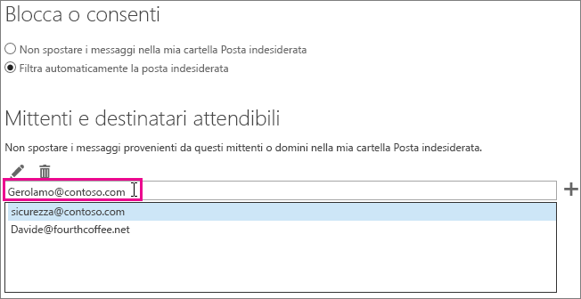

# <a name="how-to-prevent-real-email-from-being-marked-as-spam-in-office-365"></a>Come evitare che i messaggi effettivi vengano contrassegnati come indesiderati in Office 365

 **I messaggi effettivi vengono contrassegnata come posta indesiderata in Office 365? Ecco cosa fare.**

Se si riceve un falso positivo, è opportuno segnalare il messaggio a Microsoft usando il [componente aggiuntivo Segnala messaggio](https://support.office.com/article/b5caa9f1-cdf3-4443-af8c-ff724ea719d2). È inoltre possibile inviare il messaggio usando [Esplora richieste](/security/office-365-security/admin-submission.md).

## <a name="determine-the-reason-why-the-message-was-marked-as-spam"></a>Determinare il motivo per cui il messaggio è stato contrassegnato come posta indesiderata

Per risolvere molti problemi relativi alla posta indesiderata in Office 365, è possibile [visualizzare le intestazioni dei messaggi di posta elettronica](https://support.office.com/article/cd039382-dc6e-4264-ac74-c048563d212c) per determinare la causa del problema. L'intestazione da cercare è X-Forefront-Antispam-Report. Per altre informazioni sulle intestazioni dei messaggi della protezione da posta indesiderata, è possibile consultare [questo articolo](https://technet.microsoft.com/library/dn205071%28v=exchg.150%29.aspx).

Nell'intestazione cercare le intestazioni e i valori seguenti.

### <a name="x-forefront-antispam-report"></a>X-Forefront-Antispam-Report

- **SFV:SPM**: indica che il messaggio è stato contrassegnato come posta indesiderata a causa dei filtri posta indesiderata EOP.

- **SFV:BLK**: indica che il messaggio è stato contrassegnato come posta indesiderata perché l'indirizzo del mittente è incluso nell'elenco mittenti bloccati del destinatario.

- **SFV:SKS**: indica che il messaggio è stato contrassegnato come posta indesiderata prima del filtro del contenuto. Può trattarsi di un regola del flusso di posta elettronica (anche nota come regola di trasporto) che contrassegna il messaggio come posta indesiderata. Eseguire una traccia dei messaggi per scoprire se è stata attivata una regola del flusso di posta elettronica che ha impostato un livello di probabilità di posta indesiderata (SCL) elevato.

- **SFV:SKB**: indica che il messaggio è stato contrassegnato come posta indesiderata perché è stata trovata una corrispondenza con un elenco Blocca nei criteri di filtro posta indesiderata.

- **SFV:BULK**: indica che il valore BCL (Bulk Complaint Level) presente nell'intestazione x-Microsoft-Antispam è superiore alla soglia di blocco impostata per il filtro del contenuto. La posta elettronica inviata in blocco è costituita da messaggi a cui l'utente potrebbe essersi iscritto, ma che potrebbero comunque essere indesiderati. Nell'intestazione del messaggio trovare la proprietà BCL (Bulk Confidence Level) nell'intestazione X-Microsoft-Antispam. Se il valore BCL è inferiore alla soglia impostata nel filtro della posta indesiderata, è consigliabile modificare la soglia per contrassegnare i messaggi inviati in blocco di questo tipo come posta indesiderata. Gli utenti possono avere diversi livelli di tolleranza e diverse preferenze per quanto riguarda la [gestione dei messaggi inviati in blocco](https://docs.microsoft.com/microsoft-365/security/office-365-security/bulk-complaint-level-values). Si possono creare criteri o regole diverse per le varie preferenze utente.

- **CAT:SPOOF** o **CAT:PHISH**: indica che il messaggio potrebbe essere falsificato, ovvero che l'origine del messaggio non può essere convalidata e potrebbe essere sospetta. Se è valido, il mittente dovrà verificare di avere la configurazione SPF e DKIM appropriata. Per altre informazioni, controllare l'intestazione Authentication-Results. Anche se può essere difficile fare in modo che tutti i mittenti usino metodi adeguati di autenticazione della posta elettronica, l'esclusione di questi controlli può essere molto pericolosa ed è la causa principale di compromissioni.

### <a name="x-customspam"></a>x-customspam

- La presenza di questa intestazione indica che il messaggio è stato contrassegnato come posta indesiderata perché una delle [opzioni avanzate della posta indesiderata è abilitata](https://technet.microsoft.com/library/jj200750%28v=exchg.150%29.aspx) nel filtro della posta indesiderata. Se queste funzionalità non sono necessarie, è consigliabile usare le impostazioni predefinite.

## <a name="solutions-to-additional-causes-of-too-much-spam"></a>Soluzioni per altri motivi di posta indesiderata in eccesso

Per funzionare correttamente, Exchange Online Protection (EOP) chiede agli amministratori di completare alcune operazioni. Se non si è un amministratore del proprio tenant di Office 365 e si riceve troppa posta indesiderata, eseguire tali operazioni con l'amministratore. In caso contrario, è possibile passare alla sezione per gli utenti.

### <a name="for-admins"></a>Per gli amministratori

- **Fare in modo che i record DNS puntino a Office 365**: per ottenere la protezione di EOP, è necessario che i record DNS di Mail Exchanger (MX) per tutti i domini puntino a Office 365 e solo a Office 365. Se MX non punta a Office 365, EOP non fornirà il filtro della posta indesiderata per gli utenti. Se si vogliono usare altri servizi o appliance per il filtro della posta indesiderata per il dominio, è consigliabile disabilitare la protezione da posta indesiderata in Exchange Online Protection. A questo scopo, creare una regola del flusso di posta elettronica che imposta il valore SCL su -1. Se successivamente si decide di usare Exchange Online Protection, rimuovere questa regola del flusso di posta elettronica.

- **Attivare il componente aggiuntivo Segnala messaggio per gli utenti**: è consigliabile [abilitare il componente aggiuntivo Segnala messaggio per gli utenti](/security/office-365-security/enable-the-report-message-add-in.md).

- **Usare [Esplora richieste](/security/office-365-security/admin-submission.md)**: gli amministratori possono ora inviare messaggi di posta elettronica con ID messaggio di rete o file, URL e file per l'analisi di Microsoft in Office 365. Un amministratore può anche visualizzare il feedback inviato dagli utenti e usare qualsiasi schema per modificare le impostazioni che potrebbero causare problemi.

- **Verificare che gli utenti rispettino i limiti consentiti** per l'invio e la ricezione dei messaggi di posta elettronica come illustrato [qui](https://docs.microsoft.com/it-IT/office365/servicedescriptions/exchange-online-service-description/exchange-online-limits).

- **Ricontrollare i livelli di blocco** come specificato [qui](/security/office-365-security/bulk-complaint-level-values.md).

### <a name="for-users"></a>Per gli utenti

- **Creare un elenco dei mittenti attendibili**: gli utenti possono aggiungere gli indirizzi dei mittenti che ritengono attendibili all'elenco dei mittenti attendibili in [Outlook](https://go.microsoft.com/fwlink/p/?LinkId=270065) o [Outlook sul web](https://go.microsoft.com/fwlink/p/?LinkId=294862) (in precedenza noto come Outlook Web App). Per iniziare in Outlook sul web, scegliere **Impostazioni**  \> **Opzioni** \> **Blocca o consenti**. Il diagramma seguente mostra un esempio di aggiunta di voci a un elenco di mittenti attendibili.



EOP rispetterà gli elenchi dei mittenti e dei destinatari attendibili, ma non quello dei domini attendibili. Questo avviene indipendentemente dal fatto che il dominio venga aggiunto tramite Outlook sul web o aggiunto in Outlook e sincronizzato tramite Directory Sync.

- **Disabilitare il filtro SmartScreen in Outlook**: se si usa un client desktop Outlook meno recente, è opportuno disabilitare la funzionalità di filtro SmartScreen, che è stata sospesa. Se abilitato, può causare falsi positivi. Questo non dovrebbe essere necessario se si esegue un client Outlook desktop aggiornato.

## <a name="troubleshooting-a-message-ends-up-in-the-junk-folder-even-though-eop-marked-the-message-as-non-spam"></a>Risoluzione dei problemi: un messaggio viene recapitato nella cartella Posta indesiderata anche se è stato contrassegnato come posta legittima da EOP

Se gli utenti hanno abilitato l'opzione "Solo elenchi indirizzi attendibili: nella cartella Posta in arrivo verranno recapitati solo i messaggi inviati dagli utenti o dai domini inclusi nell'elenco Mittenti attendibili o Destinatari attendibili", tutti i messaggi di posta elettronica per un mittente verranno recapitati nella cartella della posta indesiderata, a meno che il mittente non sia incluso nell'elenco dei mittenti attendibili del destinatario. Questo avverrà indipendentemente dal fatto che EOP contrassegni o meno un messaggio come posta legittima o dall'aver configurato o meno una regola in EOP per contrassegnare il messaggio come posta legittima.

È possibile disabilitare l'opzione Solo elenchi indirizzi attendibili per gli utenti di Outlook seguendo le istruzioni in [Outlook: impostazioni dei criteri per disabilitare l'interfaccia utente per la posta indesiderata e il meccanismo di filtro](https://support.microsoft.com/it-IT/kb/2180568).

Se il messaggio viene visualizzato in Outlook sul web, un suggerimento di sicurezza di colore giallo indicherà che il messaggio si trova nella cartella Posta indesiderata perché il mittente non è incluso nell'elenco dei mittenti attendibili del destinatario.

Se si osserva l'intestazione di un messaggio, questa può includere il timbro SFV:SKN (IP Allow or ETR Allow) o SFV:NSPM (non-spam), ma il messaggio viene comunque recapitato nella cartella della posta indesiderata dell'utente. Niente nell'intestazione del messaggio indica che l'utente ha abilitato l'opzione "Solo elenchi indirizzi attendibili". Questo avviene perché l'opzione "Solo elenchi indirizzi attendibili" configurata dagli utenti in Outlook sostituisce l'impostazione di EOP.

### <a name="to-verify-why-a-message-from-a-safe-sender-is-marked-as-non-spam-in-the-message-header-but-still-ends-up-in-the-users-junk-folder"></a>Per verificare il motivo per cui un messaggio proveniente da un mittente attendibile viene contrassegnato come posta legittima nell'intestazione del messaggio ma viene comunque inserito nella cartella Posta indesiderata dell'utente

1. Per informazioni su come connettersi a PowerShell per Exchange Online, vedere [Connettersi a PowerShell per Exchange Online](https://go.microsoft.com/fwlink/p/?LinkId=396554).

2. Eseguire il comando seguente per visualizzare le impostazioni di configurazione della posta indesiderata dell'utente:

  ```Powershell
  Get-MailboxJunkEmailConfiguration example@contoso.com | Format-List TrustedListsOnly,ContactsTrusted,TrustedSendersAndDomains
  ```

- Se TrustedListsOnly è impostato su True, questa impostazione è abilitata.

- Se ContactsTrusted è impostato su True, l'utente accetta i messaggi sia dai contatti sia dai mittenti attendibili.

- TrustedSendersAndDomains elenca il contenuto dell'elenco dei mittenti attendibili dell'utente.

## <a name="eop-only-customers-use-directory-synchronization"></a>Clienti solo di EOP: usare la sincronizzazione della directory

I clienti solo di EOP, ovvero gli utenti abbonati al servizio EOP per l'uso con l'istanza del server di posta elettronica locale (Exchange), devono assicurarsi di sincronizzare le impostazioni utente con il servizio tramite la sincronizzazione della directory. In questo modo, si ha la certezza che gli elenchi dei mittenti attendibili vengano rispettati da EOP. Per altre informazioni, vedere "Utilizzare la sincronizzazione della directory per gestire gli utenti di posta" in [Gestire utenti di posta in Exchange Online Protection](https://go.microsoft.com/fwlink/?LinkId=534098).
