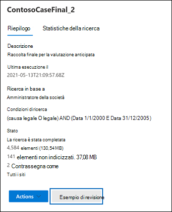
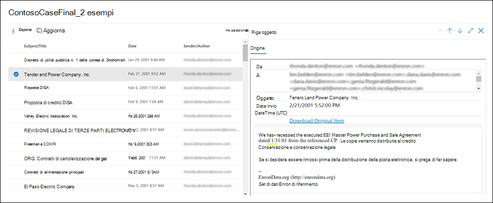

# Visualizzare in anteprima i risultati di una ricerca di eDiscoveryPreview eDiscovery search results

Dopo aver eseguito una Ricerca contenuto o una ricerca associata a un caso di Core eDiscovery, è possibile visualizzare in anteprima un campione dei risultati restituiti dalla ricerca.After you run a Content search or a search associated with a Core eDiscovery case, you can preview a sample of the results returned by the search. La visualizzazione in anteprima degli elementi restituiti dalla query di ricerca consente di determinare se la ricerca restituisce i risultati previsti o se è necessario modificare la query ed eseguire di nuovo la ricerca.Previewing items returned by the search query can help you determine if the search is returning the results you hope for or if you need to change the search query and rerun the search.

Per visualizzare in anteprima un campione dei risultati restituiti da una ricerca:To preview a sample of results returned by a search:

1. Nel Centro conformità Microsoft 365, passare alla pagina Ricerca contenuto o a un caso di Core eDiscovery.In the Microsoft 365 compliance center, go to the Content search page or a Core eDiscovery case.

2. Selezionare la ricerca per visualizzare la pagina a comparsa.Select search to display the flyout page.

3. Nella parte inferiore della pagina, fare clic su **Verifica campione**.On the bottom of the flyout page, click **Review sample**.

   

   Viene visualizzata una pagina contenente un esempio dei risultati della ricerca.A page is displayed containing a sample of the search results.

4. Selezionare un elemento per visualizzarne il contenuto nel Riquadro di lettura.Select an item to view its contents in the reading pane.

   

   Nello screenshot precedente, le parole chiave della query di ricerca sono evidenziate quando si visualizza l'anteprima degli elementi.In the previous screenshot, notice that keywords from the search query are highlighted when you preview items.

## Come vengono selezionati gli esempi dei risultati della ricercaHow the search result samples are selected

Per l'anteprima sono disponibili al massimo 1.000 elementi selezionati casualmente.A maximum of 1,000 randomly selected items are available to preview. Oltre a essere selezionati in modo casuale, gli elementi disponibili per l'anteprima devono anche soddisfare i criteri seguenti:In addition to being randomly selected, items available for preview must also meet the following criteria:

- È possibile visualizzare in anteprima un massimo di 100 elementi da un singolo percorso di contenuto (una cassetta postale o un sito).A maximum of 100 items from a single content location (a mailbox or a site) can be previewed. Ciò significa che è possibile che meno di 1.000 elementi siano disponibili per l'anteprima.This means that it's possible that less than 1,000 items might be available for preview. Ad esempio, se si cerca in quattro cassette postali e la ricerca restituisce 1.500 elementi stimati, solo 400 saranno disponibili per l'anteprima, perché è possibile visualizzare in anteprima solo 100 elementi per ogni cassetta postale.For example, if you search four mailboxes and the search returns 1,500 estimated items, only 400 will be available for preview because only 100 items from each mailbox can be previewed.

- Per gli elementi della cassetta postale, l'anteprima è disponibile solo per i messaggi di posta elettronica.For mailbox items, only email messages are available to preview. Non è possibile visualizzare in anteprima elementi come attività, elementi del calendario e contatti.Items like tasks, calendar items, and contacts can't be previewed.

- Per gli elementi del sito, l'anteprima è disponibile solo per i documenti.For site items, only documents are available to preview. Non è possibile visualizzare in anteprima elementi come cartelle, elenchi o allegati di elenchi.Items like folders, lists, or list attachments can't be previewed.

## Tipi di file supportati quando si visualizza l'anteprima dei risultati della ricercaFile types supported when previewing search results

È possibile visualizzare l'anteprima dei tipi di file supportati nel riquadro di anteprima.You can preview supported file types in the preview pane. Se un tipo di file non è supportato, è necessario scaricarne una copia nel computer locale facendo clic su **Scarica elemento originale**.If a file type isn't supported, you have to download a copy of the file to your local computer (by clicking **Download original item**). Nelle pagine Web ASPX l'URL della pagina è incluso, anche se l'utente potrebbe non avere le autorizzazioni per accedere alla pagina.For .aspx Web pages, the URL for the page is included though you may not have permissions to access the page. Gli elementi non indicizzati non sono disponibili per la visualizzazione in anteprima.Unindexed items aren't available for previewing.

I tipi di file seguenti sono supportati e possono essere visualizzati in anteprima nel riquadro risultati della ricerca.The following file types are supported and can be previewed in the search results pane.
  
- .txt, .html, .mhtml.txt, .html, .mhtml

- .eml.eml

- .doc, .docx, .docm.doc, .docx, .docm

- .pptm, .pptx.pptm, .pptx

- .pdf.pdf

Sono supportati anche i seguenti tipi di contenitori di file.Also, the following file container types are supported. È possibile visualizzare l'elenco di file nel contenitore nel riquadro di anteprima.You can view the list of files in the container in the preview pane.
  
- .zip.zip

- .gzip.gzip