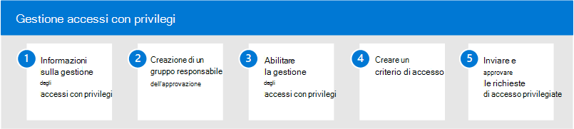

# Gestione degli accessi privilegiati in Microsoft 365

L'accesso permanente da parte di alcuni utenti alle informazioni riservate o alle impostazioni di configurazione di rete critiche in Microsoft Exchange Online rappresenta un potenziale percorso per gli account compromessi o le attività di minacce interne. La gestione degli accessi privilegiati consente di proteggere l'organizzazione dalle violazioni e consente di soddisfare le procedure consigliate di conformità limitando l'accesso permanente ai dati sensibili o l'accesso alle impostazioni di configurazione critiche. Invece che gli amministratori hanno accesso costante, vengono implementate regole di accesso just-in-time per le attività che necessitano di autorizzazioni elevate. L'abilitazione della gestione degli accessi con privilegi per Exchange Online in Microsoft 365 consente all'organizzazione di operare senza privilegi permanenti e fornire un livello di difesa contro le vulnerabilità di accesso amministrativo permanenti.

## Configurare la gestione degli accessi con privilegi per Microsoft 365

Utilizzare la procedura seguente per configurare la gestione degli accessi con privilegi per l'organizzazione:

1. Informazioni sulla [gestione degli accessi con](privileged-access-management-overview.md) privilegi in Microsoft 365
2. Creare un [gruppo di responsabili approvazione](privileged-access-management-configuration.md#step-1-create-an-approvers-group)
3. Abilitare [la gestione degli accessi con privilegi](privileged-access-management-configuration.md#step-2-enable-privileged-access)
4. Creare un [criterio di accesso](privileged-access-management-configuration.md#step-3-create-an-access-policy)
5. Inviare/approvare [richieste di accesso con privilegi](privileged-access-management-configuration.md#step-4-submitapprove-privileged-access-requests)

## Ulteriori informazioni sulla gestione degli accessi con privilegi

- [Domande frequenti sulla gestione degli accessi con privilegi](privileged-access-management-overview.md#frequently-asked-questions)