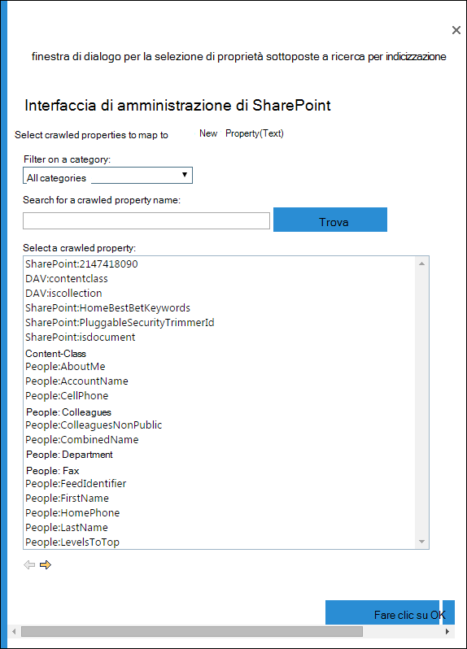

# <a name="create-a-dlp-policy-to-protect-documents-with-fci-or-other-properties"></a><span data-ttu-id="8e043-103">Creare criteri di prevenzione della perdita dei dati per proteggere i documenti con FCI o altre proprietà</span><span class="sxs-lookup"><span data-stu-id="8e043-103">Create a DLP policy to protect documents with FCI or other properties</span></span>

<span data-ttu-id="8e043-104">I criteri di prevenzione della perdita dei dati (DLP) di Microsoft 365 possono utilizzare le proprietà di classificazione o le proprietà degli elementi per identificare gli elementi sensibili.</span><span class="sxs-lookup"><span data-stu-id="8e043-104">Microsoft 365 data loss prevention (DLP) policies can use classification properties or item properties to identify sensitive items.</span></span> <span data-ttu-id="8e043-105">Ad esempio, è possibile utilizzare:</span><span class="sxs-lookup"><span data-stu-id="8e043-105">For example you can use:</span></span>

- <span data-ttu-id="8e043-106">Proprietà FCI (File Classification Infrastructure) di Windows Server</span><span class="sxs-lookup"><span data-stu-id="8e043-106">Windows Server File Classification infrastructure (FCI) properties</span></span>
- <span data-ttu-id="8e043-107">Proprietà dei documenti di SharePoint</span><span class="sxs-lookup"><span data-stu-id="8e043-107">SharePoint document properties</span></span>
- <span data-ttu-id="8e043-108">proprietà dei documenti di sistema di terze parti</span><span class="sxs-lookup"><span data-stu-id="8e043-108">third-party system document properties</span></span>


<span data-ttu-id="8e043-110">Ad esempio, l'organizzazione potrebbe utilizzare Windows Server FCI per identificare gli elementi con dati personali, ad esempio i numeri di previdenza sociale, e quindi classificare il documento impostando la proprietà **Informazioni** personali su **Alta,** **Moderata,**  **Bassa,** Pubblica o Non PIÙ **in** base al tipo e al numero di occorrenze dei dati personali trovati nel documento.</span><span class="sxs-lookup"><span data-stu-id="8e043-110">For example, your organization might use Windows Server FCI to identify items with personal data such as social security numbers, and then classify the document by setting the **Personally Identifiable Information** property to **High**, **Moderate**, **Low**, **Public**, or **Not PII** based on the type and number of occurrences of personal data found in the document.</span></span>

<span data-ttu-id="8e043-111">In Microsoft 365, è possibile creare un criterio DLP che identifichi i documenti la cui proprietà è impostata su valori specifici, ad esempio Alto e **Medio,** e quindi eseguire un'azione come il blocco dell'accesso a tali file. </span><span class="sxs-lookup"><span data-stu-id="8e043-111">In Microsoft 365, you can create a DLP policy that identifies documents that have that property set to specific values, such as **High** and **Medium**, and then takes an action such as blocking access to those files.</span></span> <span data-ttu-id="8e043-112">Lo stesso criterio può disporre di un'altra regola che consente di eseguire un'azione diversa se la proprietà è impostata su **Bassa**, come l'invio di una notifica tramite posta elettronica.</span><span class="sxs-lookup"><span data-stu-id="8e043-112">The same policy can have another rule that takes a different action if the property is set to **Low**, such as sending an email notification.</span></span> <span data-ttu-id="8e043-113">In questo modo, DLP si integra con FCI di Windows Server e consente di proteggere i documenti di Office caricati o condivisi in Microsoft 365 da file server basati su Windows Server.</span><span class="sxs-lookup"><span data-stu-id="8e043-113">In this way, DLP integrates with Windows Server FCI and can help protect Office documents uploaded or shared to Microsoft 365 from Windows Server-based file servers.</span></span>

<span data-ttu-id="8e043-114">Un criterio DLP cerca semplicemente una coppia di nome/valore di proprietà specifiche.</span><span class="sxs-lookup"><span data-stu-id="8e043-114">A DLP policy simply looks for a specific property name/value pair.</span></span> <span data-ttu-id="8e043-115">È possibile utilizzare qualsiasi proprietà del documento, purché la proprietà disponga di una proprietà gestita corrispondente per la ricerca in SharePoint.</span><span class="sxs-lookup"><span data-stu-id="8e043-115">Any document property can be used, as long as the property has a corresponding managed property for SharePoint search.</span></span> <span data-ttu-id="8e043-116">Ad esempio, una raccolta siti di SharePoint potrebbe utilizzare un tipo di contenuto denominato **Report di andata e ritorno** con un campo obbligatorio denominato **Cliente**.</span><span class="sxs-lookup"><span data-stu-id="8e043-116">For example, a SharePoint site collection might use a content type named **Trip Report** with a required field named **Customer**.</span></span> <span data-ttu-id="8e043-117">Ogni volta che un utente crea un report di questo tipo, è necessario immettere il nome del cliente.</span><span class="sxs-lookup"><span data-stu-id="8e043-117">Whenever a person creates a trip report, they must enter the customer name.</span></span> <span data-ttu-id="8e043-118">Questa coppia nome/valore della proprietà può essere utilizzata anche in un criterio DLP, ad esempio  se si desidera una regola che blocchi l'accesso al documento per gli utenti guest quando il campo Cliente contiene **Contoso.**</span><span class="sxs-lookup"><span data-stu-id="8e043-118">This property name/value pair can also be used in a DLP policy—for example, if you want a rule that blocks access to the document for guests when the **Customer** field contains **Contoso**.</span></span>

<span data-ttu-id="8e043-119">Se si desidera applicare il criterio DLP al contenuto con etichette di Microsoft 365 specifiche, non seguire i passaggi qui descritti.</span><span class="sxs-lookup"><span data-stu-id="8e043-119">If you want to apply your DLP policy to content with specific Microsoft 365 labels, you should not follow the steps here.</span></span> <span data-ttu-id="8e043-120">Informazioni su come utilizzare [un'etichetta di conservazione come condizione in un criterio DLP.](data-loss-prevention-policies.md#using-a-retention-label-as-a-condition-in-a-dlp-policy)</span><span class="sxs-lookup"><span data-stu-id="8e043-120">Instead, learn how to [Using a retention label as a condition in a DLP policy](data-loss-prevention-policies.md#using-a-retention-label-as-a-condition-in-a-dlp-policy).</span></span>

## <a name="before-you-create-the-dlp-policy"></a><span data-ttu-id="8e043-121">Prima di creare il criterio DLP</span><span class="sxs-lookup"><span data-stu-id="8e043-121">Before you create the DLP policy</span></span>

<span data-ttu-id="8e043-122">Prima di utilizzare una proprietà di FCI di Windows Server o un'altra proprietà in un criterio DLP, è necessario creare una proprietà gestita nell'interfaccia di amministrazione di SharePoint.</span><span class="sxs-lookup"><span data-stu-id="8e043-122">Before you can use a Windows Server FCI property or other property in a DLP policy, you need to create a managed property in the SharePoint admin center.</span></span> <span data-ttu-id="8e043-123">Ecco perché.</span><span class="sxs-lookup"><span data-stu-id="8e043-123">Here's why.</span></span>

<span data-ttu-id="8e043-p106">Esempi</span><span class="sxs-lookup"><span data-stu-id="8e043-p106">In SharePoint Online and OneDrive for Business, the search index is built up by crawling the content on your sites. The crawler picks up content and metadata from the documents in the form of crawled properties. The search schema helps the crawler decide what content and metadata to pick up. Examples of metadata are the author and the title of a document. However, to get the content and metadata from the documents into the search index, the crawled properties must be mapped to managed properties. Only managed properties are kept in the index. For example, a crawled property related to author is mapped to a managed property related to author.</span></span>

> [!NOTE]
> <span data-ttu-id="8e043-131">Assicurarsi di utilizzare un nome di proprietà gestita e non un nome di proprietà sottoposta a ricerca per indicizzazione durante la creazione di regole DLP utilizzando la `ContentPropertyContainsWords` condizione.</span><span class="sxs-lookup"><span data-stu-id="8e043-131">Be sure to use a managed property name and not a crawled property name when creating DLP rules using the `ContentPropertyContainsWords` condition.</span></span>

<span data-ttu-id="8e043-132">Questo è importante perché DLP utilizza il crawler di ricerca per identificare e classificare le informazioni riservate nei siti e quindi archiviare tali informazioni riservate in una parte sicura dell'indice di ricerca.</span><span class="sxs-lookup"><span data-stu-id="8e043-132">This is important because DLP uses the search crawler to identify and classify sensitive information on your sites, and then store that sensitive information in a secure portion of the search index.</span></span> <span data-ttu-id="8e043-133">Quando si carica un documento in Office 365, SharePoint crea automaticamente le proprietà sottoposte a ricerca per indicizzazione in base alle proprietà del documento.</span><span class="sxs-lookup"><span data-stu-id="8e043-133">When you upload a document to Office 365, SharePoint automatically creates crawled properties based on the document properties.</span></span> <span data-ttu-id="8e043-134">Tuttavia, per utilizzare una proprietà di FCI o di altro tipo in un criterio DLP, la proprietà sottoposta a ricerca per indicizzazione deve essere mappata a una proprietà gestita in modo che il contenuto con tale proprietà venga mantenuto nell'indice.</span><span class="sxs-lookup"><span data-stu-id="8e043-134">But to use an FCI or other property in a DLP policy, that crawled property needs to be mapped to a managed property so that content with that property is kept in the index.</span></span>

<span data-ttu-id="8e043-135">Per ulteriori informazioni sulla ricerca e sulle proprietà gestite, vedere [Gestire lo schema di ricerca in SharePoint Online.](https://go.microsoft.com/fwlink/p/?LinkID=627454)</span><span class="sxs-lookup"><span data-stu-id="8e043-135">For more information on search and managed properties, see [Manage the search schema in SharePoint Online](https://go.microsoft.com/fwlink/p/?LinkID=627454).</span></span>

### <a name="step-1-upload-a-document-with-the-needed-property-to-office-365"></a><span data-ttu-id="8e043-136">Passaggio 1: Caricare un documento con la proprietà necessaria in Office 365</span><span class="sxs-lookup"><span data-stu-id="8e043-136">Step 1: Upload a document with the needed property to Office 365</span></span>

<span data-ttu-id="8e043-137">Prima di tutto, è necessario caricare un documento con la proprietà cui si desidera fare riferimento nel criterio DLP.</span><span class="sxs-lookup"><span data-stu-id="8e043-137">You first need to upload a document with the property that you want to reference in your DLP policy.</span></span> <span data-ttu-id="8e043-138">Microsoft 365 rileverà la proprietà e creerà automaticamente una proprietà sottoposta a ricerca per indicizzazione da essa.</span><span class="sxs-lookup"><span data-stu-id="8e043-138">Microsoft 365 will detect the property and automatically create a crawled property from it.</span></span> <span data-ttu-id="8e043-139">Nel passaggio successivo verrà creata una proprietà gestita e quindi la proprietà gestita verrà mappata a questa proprietà sottoposta a ricerca per indicizzazione.</span><span class="sxs-lookup"><span data-stu-id="8e043-139">In the next step, you'll create a managed property, and then map the managed property to this crawled property.</span></span>

### <a name="step-2-create-a-managed-property"></a><span data-ttu-id="8e043-140">Passaggio 2: Creare una proprietà gestita</span><span class="sxs-lookup"><span data-stu-id="8e043-140">Step 2: Create a managed property</span></span>

1. <span data-ttu-id="8e043-141">Accedere all'interfaccia di amministrazione di Microsoft 365.</span><span class="sxs-lookup"><span data-stu-id="8e043-141">Sign in to the Microsoft 365 admin center.</span></span>

2. <span data-ttu-id="8e043-142">Nel riquadro di spostamento sinistro scegliere **Interfaccia di amministrazione di** \> **SharePoint.**</span><span class="sxs-lookup"><span data-stu-id="8e043-142">In the left navigation, choose **Admin centers** \> **SharePoint**.</span></span> <span data-ttu-id="8e043-143">Ci si trova ora nell'interfaccia di amministrazione di SharePoint.</span><span class="sxs-lookup"><span data-stu-id="8e043-143">You're now in the SharePoint admin center.</span></span>

3. <span data-ttu-id="8e043-144">Nel riquadro di spostamento sinistro scegliere **ricerca nella** pagina di \> amministrazione **della** ricerca Gestisci schema \> **di ricerca.**</span><span class="sxs-lookup"><span data-stu-id="8e043-144">In the left navigation, choose **search** \> on the **search administration** page \> **Manage Search Schema**.</span></span>

   

4. <span data-ttu-id="8e043-146">Nella pagina **Proprietà gestite** nuova \> **proprietà gestita.**</span><span class="sxs-lookup"><span data-stu-id="8e043-146">On the **Managed Properties** page \> **New Managed Property**.</span></span>

   

5. <span data-ttu-id="8e043-p110">Immettere un nome e una descrizione per la proprietà. Questo nome è ciò che apparirà nei criteri DLP.</span><span class="sxs-lookup"><span data-stu-id="8e043-p110">Enter a name and description for the property. This name is what will appear in your DLP policies.</span></span>

6. <span data-ttu-id="8e043-150">Per **Tipo**, selezionare **Testo**.</span><span class="sxs-lookup"><span data-stu-id="8e043-150">For **Type**, choose **Text**.</span></span>

7. <span data-ttu-id="8e043-151">In **Caratteristiche principali**, selezionare **Disponibile per query** e **Recuperabile**.</span><span class="sxs-lookup"><span data-stu-id="8e043-151">Under **Main characteristics**, select **Queryable** and **Retrievable**.</span></span>

8. <span data-ttu-id="8e043-152">In **Mapping alle proprietà sottoposte a ricerca per indicizzazione** aggiungere un \> **mapping.**</span><span class="sxs-lookup"><span data-stu-id="8e043-152">Under **Mappings to crawled properties** \> **Add a mapping**.</span></span>

9. <span data-ttu-id="8e043-153">Nella **finestra** di dialogo di selezione delle proprietà sottoposte a ricerca per indicizzazione individuare e selezionare la proprietà sottoposta a ricerca per indicizzazione corrispondente alla proprietà FCI di Windows Server o a un'altra proprietà che verrà utilizzata nel criterio \> DLP \> **OK.**</span><span class="sxs-lookup"><span data-stu-id="8e043-153">In the **crawled property selection** dialog box \> find and select the crawled property that corresponds to the Windows Server FCI property or other property that you will use in your DLP policy \> **OK**.</span></span>

   

10. <span data-ttu-id="8e043-155">Nella parte inferiore della pagina \> **OK.**</span><span class="sxs-lookup"><span data-stu-id="8e043-155">At the bottom of the page \> **OK**.</span></span>

## <a name="create-a-dlp-policy-that-uses-an-fci-property-or-other-property"></a><span data-ttu-id="8e043-156">Creare un criterio DLP che utilizza una proprietà FCI o un'altra proprietà</span><span class="sxs-lookup"><span data-stu-id="8e043-156">Create a DLP policy that uses an FCI property or other property</span></span>

<span data-ttu-id="8e043-157">In questo esempio, un'organizzazione usa FCI nei file server basati su Windows Server; in particolare, usano la proprietà di classificazione FCI denominata **Informazioni** personali con i possibili valori **High,** **Moderate,** **Low,** **Public** e **Not PII.**</span><span class="sxs-lookup"><span data-stu-id="8e043-157">In this example, an organization is using FCI on its Windows Server-based file servers; specifically, they're using the FCI classification property named **Personally Identifiable Information** with possible values of **High**, **Moderate**, **Low**, **Public**, and **Not PII**.</span></span> <span data-ttu-id="8e043-158">Ora vogliono usare la classificazione FCI esistente nei criteri DLP in Office 365.</span><span class="sxs-lookup"><span data-stu-id="8e043-158">Now they want to use their existing FCI classification in their DLP policies in Office 365.</span></span>

<span data-ttu-id="8e043-159">Prima di tutto, eseguire la procedura precedente per creare una proprietà gestita in SharePoint Online, che consente di eseguire il mapping alla proprietà sottoposta a ricerca per indicizzazione creata automaticamente dalla proprietà FCI.</span><span class="sxs-lookup"><span data-stu-id="8e043-159">First, they follow the steps above to create a managed property in SharePoint Online, which maps to the crawled property created automatically from the FCI property.</span></span>

<span data-ttu-id="8e043-160">Successivamente, creano un criterio DLP con due regole che utilizzano entrambe la condizione Le proprietà del **documento contengono uno di questi valori:**</span><span class="sxs-lookup"><span data-stu-id="8e043-160">Next, they create a DLP policy with two rules that both use the condition **Document properties contain any of these values**:</span></span>

- <span data-ttu-id="8e043-161">**Contenuto FCI PII - Alto, Moderato** La prima regola limita l'accesso al documento se la proprietà di classificazione FCI **Informazioni** personali è uguale a **Alta** o **Moderata** e il documento viene condiviso con persone esterne all'organizzazione.</span><span class="sxs-lookup"><span data-stu-id="8e043-161">**FCI PII content - High, Moderate** The first rule restricts access to the document if the FCI classification property **Personally Identifiable Information** equals **High** or **Moderate** and the document is shared with people outside the organization.</span></span>

- <span data-ttu-id="8e043-162">**Contenuto FCI PII - Basso** La seconda regola invia una notifica al proprietario del documento se la proprietà di classificazione FCI **Informazioni** personali è uguale a **Bassa** e il documento viene condiviso con persone esterne all'organizzazione.</span><span class="sxs-lookup"><span data-stu-id="8e043-162">**FCI PII content - Low** The second rule sends a notification to the document owner if the FCI classification property **Personally Identifiable Information** equals **Low** and the document is shared with people outside the organization.</span></span>

### <a name="create-the-dlp-policy-by-using-powershell"></a><span data-ttu-id="8e043-163">Creare il criterio DLP tramite PowerShell</span><span class="sxs-lookup"><span data-stu-id="8e043-163">Create the DLP policy by using PowerShell</span></span>

<span data-ttu-id="8e043-164">La condizione Le proprietà del **documento** contengono uno di questi valori temporaneamente non disponibili nell'interfaccia utente del Centro sicurezza e conformità, ma è comunque possibile usare questa condizione &amp; tramite PowerShell.</span><span class="sxs-lookup"><span data-stu-id="8e043-164">The condition **Document properties contain any of these values** is temporarily not available in the UI of the Security &amp; Compliance Center, but you can still use this condition by using PowerShell.</span></span> <span data-ttu-id="8e043-165">È possibile utilizzare i cmdlet per utilizzare un criterio DLP e utilizzare i cmdlet con il parametro per aggiungere la condizione Le proprietà del documento contengono `New\Set\Get-DlpCompliancePolicy` `New\Set\Get-DlpComplianceRule` uno di questi `ContentPropertyContainsWords` **valori.**</span><span class="sxs-lookup"><span data-stu-id="8e043-165">You can use the  `New\Set\Get-DlpCompliancePolicy` cmdlets to work with a DLP policy, and use the  `New\Set\Get-DlpComplianceRule` cmdlets with the  `ContentPropertyContainsWords` parameter to add the condition **Document properties contain any of these values**.</span></span>

<span data-ttu-id="8e043-166">Per ulteriori informazioni su questi cmdlet, vedere Cmdlet [del Centro sicurezza e &amp; conformità.](https://go.microsoft.com/fwlink/?LinkID=799772&amp;clcid=0x409)</span><span class="sxs-lookup"><span data-stu-id="8e043-166">For more information on these cmdlets, see [Security &amp; Compliance Center cmdlets](https://go.microsoft.com/fwlink/?LinkID=799772&amp;clcid=0x409).</span></span>

1. [<span data-ttu-id="8e043-167">Connettersi al Centro &amp; sicurezza e conformità tramite Remote PowerShell</span><span class="sxs-lookup"><span data-stu-id="8e043-167">Connect to the Security &amp; Compliance Center using remote PowerShell</span></span>](https://go.microsoft.com/fwlink/?LinkID=799771&amp;clcid=0x409)

2. <span data-ttu-id="8e043-168">Creare il criterio utilizzando  `New-DlpCompliancePolicy` .</span><span class="sxs-lookup"><span data-stu-id="8e043-168">Create the policy by using  `New-DlpCompliancePolicy`.</span></span>

<span data-ttu-id="8e043-169">Questo PowerShell crea un criterio DLP che si applica a tutte le posizioni.</span><span class="sxs-lookup"><span data-stu-id="8e043-169">This PowerShell creates a DLP policy that applies to all locations.</span></span>

   ```powershell
   New-DlpCompliancePolicy -Name FCI_PII_policy -ExchangeLocation All -SharePointLocation All -OneDriveLocation All -Mode Enable
   ```

3. <span data-ttu-id="8e043-170">Creare le due regole descritte in precedenza utilizzando , dove una regola è per il valore Basso e un'altra regola per i valori `New-DlpComplianceRule` **Alto** **e Moderato.** </span><span class="sxs-lookup"><span data-stu-id="8e043-170">Create the two rules described above by using  `New-DlpComplianceRule`, where one rule is for the **Low** value, and another rule is for the **High** and **Moderate** values.</span></span>

   <span data-ttu-id="8e043-171">Ecco un esempio di PowerShell che crea queste due regole.</span><span class="sxs-lookup"><span data-stu-id="8e043-171">Here is a PowerShell example that creates these two rules.</span></span> <span data-ttu-id="8e043-172">Le coppie nome/valore della proprietà sono racchiuse tra virgolette e un nome di proprietà può specificare più valori separati da virgole senza spazi, ad esempio  `"<Property1>:<Value1>,<Value2>","<Property2>:<Value3>,<Value4>"....`</span><span class="sxs-lookup"><span data-stu-id="8e043-172">The property name/value pairs are enclosed in quotation marks, and a property name may specify multiple values separated by commas with no spaces, like  `"<Property1>:<Value1>,<Value2>","<Property2>:<Value3>,<Value4>"....`</span></span>

   ```powershell
   New-DlpComplianceRule -Name FCI_PII_content-High,Moderate -Policy FCI_PII_policy -AccessScope NotInOrganization -BlockAccess $true -ContentPropertyContainsWords "Personally Identifiable Information:High,Moderate" -Disabled $falseNew-DlpComplianceRule -Name FCI_PII_content-Low -Policy FCI_PII_policy -AccessScope NotInOrganization -BlockAccess $false -ContentPropertyContainsWords "Personally Identifiable Information:Low" -Disabled $false -NotifyUser Owner
   ```

   <span data-ttu-id="8e043-173">FCI di Windows Server include molte proprietà predefinite, tra cui **informazioni** personali utilizzate in questo esempio.</span><span class="sxs-lookup"><span data-stu-id="8e043-173">Windows Server FCI includes many built-in properties, including **Personally Identifiable Information** used in this example.</span></span> <span data-ttu-id="8e043-174">I valori possibili per ogni proprietà possono essere diversi per ogni organizzazione.</span><span class="sxs-lookup"><span data-stu-id="8e043-174">The possible values for each property can be different for every organization.</span></span> <span data-ttu-id="8e043-175">I **valori High,** **Moderate** **e Low** utilizzati qui sono solo un esempio.</span><span class="sxs-lookup"><span data-stu-id="8e043-175">The **High**, **Moderate**, and **Low** values used here are only an example.</span></span> <span data-ttu-id="8e043-176">Per l'organizzazione, è possibile visualizzare le proprietà di classificazione FCI di Windows Server con i relativi valori possibili in Gestione risorse file server nel file server basato su Windows Server.</span><span class="sxs-lookup"><span data-stu-id="8e043-176">For your organization, you can view the Windows Server FCI classification properties with their possible values in the file Server Resource Manager on the Windows Server-based file server.</span></span> <span data-ttu-id="8e043-177">Per ulteriori informazioni, vedere [Creare una proprietà di classificazione.](https://go.microsoft.com/fwlink/p/?LinkID=627456)</span><span class="sxs-lookup"><span data-stu-id="8e043-177">For more information, see [Create a classification property](https://go.microsoft.com/fwlink/p/?LinkID=627456).</span></span>

<span data-ttu-id="8e043-178">Al termine, i criteri dovrebbero avere due nuove regole che usano entrambe le proprietà del documento **contenenti una di queste condizioni di** valori.</span><span class="sxs-lookup"><span data-stu-id="8e043-178">When you finish, your policy should have two new rules that both use the **Document properties contain any of these values** condition.</span></span> <span data-ttu-id="8e043-179">Questa condizione non verrà visualizzata nell'interfaccia utente, anche se verranno visualizzate altre condizioni, azioni e impostazioni.</span><span class="sxs-lookup"><span data-stu-id="8e043-179">This condition won't appear in the UI, though the other conditions, actions, and settings will appear.</span></span>

<span data-ttu-id="8e043-180">Una regola blocca l'accesso al contenuto dove la proprietà **Informazioni personali** è uguale a **Elevata** o **Moderata**.</span><span class="sxs-lookup"><span data-stu-id="8e043-180">One rule blocks access to content where the **Personally Identifiable Information** property equals **High** or **Moderate**.</span></span> <span data-ttu-id="8e043-181">Una seconda regola invia una notifica sul contenuto dove la proprietà **Informazioni personali** è uguale a **Bassa**.</span><span class="sxs-lookup"><span data-stu-id="8e043-181">A second rule sends a notification about content where the **Personally Identifiable Information** property equals **Low**.</span></span>


## <a name="after-you-create-the-dlp-policy"></a><span data-ttu-id="8e043-183">Dopo aver creato il criterio DLP</span><span class="sxs-lookup"><span data-stu-id="8e043-183">After you create the DLP policy</span></span>

<span data-ttu-id="8e043-184">Eseguendo i passaggi descritti nelle sezioni precedenti verrà creato un criterio DLP che rileverà rapidamente il contenuto con tale proprietà, ma solo se il contenuto è stato appena caricato (in modo che il contenuto sia indicizzato) o se il contenuto è precedente ma è stato appena modificato (in modo che il contenuto sia stato indicizzato nuovamente).</span><span class="sxs-lookup"><span data-stu-id="8e043-184">Doing the steps in the previous sections will create a DLP policy that will quickly detect content with that property, but only if that content is newly uploaded (so that the content's indexed), or if that content is old but just edited (so that the content's re-indexed).</span></span>

<span data-ttu-id="8e043-p117">Per rilevare il contenuto con tale proprietà ovunque, è possibile richiedere manualmente che la raccolta, il sito o una raccolta siti vengano reindicizzati in modo che il criterio DLP sia a conoscenza di tutto il contenuto con tale proprietà. In SharePoint Online, il contenuto viene automaticamente sottoposto a ricerca per indicizzazione in base a una pianificazione definita. Il crawler rileva il contenuto modificato dall'ultima ricerca per indicizzazione e aggiorna l'indice. Se è necessario che il criterio DLP protegga il contenuto prima della prossima ricerca per indicizzazione pianificata, è possibile eseguire questi passaggi.</span><span class="sxs-lookup"><span data-stu-id="8e043-p117">To detect content with that property everywhere, you may want to manually request that your library, site, or site collection be re-indexed, so that the DLP policy is aware of all the content with that property. In SharePoint Online, content is automatically crawled based on a defined crawl schedule. The crawler picks up content that has changed since the last crawl and updates the index. If you need your DLP policy to protect content before the next scheduled crawl, you can take these steps.</span></span>

> [!CAUTION]
> <span data-ttu-id="8e043-189">[!ATTENZIONE]  La reindicizzazione di un sito può provocare un carico eccessivo nel sistema di ricerca.</span><span class="sxs-lookup"><span data-stu-id="8e043-189">Re-indexing a site can cause a massive load on the search system.</span></span> <span data-ttu-id="8e043-190">Non re-indicizzare il sito a meno che lo scenario non lo richieda assolutamente.</span><span class="sxs-lookup"><span data-stu-id="8e043-190">Don't re-index your site unless your scenario absolutely requires it.</span></span>

<span data-ttu-id="8e043-191">Per altre informazioni, vedere [Richiedere manualmente la ricerca per indicizzazione e la reindicizzazione di un sito, di una raccolta o di un elenco](https://go.microsoft.com/fwlink/p/?LinkID=627457).</span><span class="sxs-lookup"><span data-stu-id="8e043-191">For more information, see [Manually request crawling and re-indexing of a site, a library or a list](https://go.microsoft.com/fwlink/p/?LinkID=627457).</span></span>

### <a name="reindex-a-site-optional"></a><span data-ttu-id="8e043-192">Reindicizzare un sito (facoltativo)</span><span class="sxs-lookup"><span data-stu-id="8e043-192">Reindex a site (optional)</span></span>

1. <span data-ttu-id="8e043-193">Nel sito scegliere Impostazioni **(icona** a forma di ingranaggio in alto a destra) \> **Impostazioni sito.**</span><span class="sxs-lookup"><span data-stu-id="8e043-193">On the site, choose **Settings** (gear icon in upper right) \> **Site Settings**.</span></span>

2. <span data-ttu-id="8e043-194">In **Ricerca** scegliere **Ricerca e disponibilità offline** \> **Reindicizza sito.**</span><span class="sxs-lookup"><span data-stu-id="8e043-194">Under **Search**, choose **Search and offline availability** \> **Reindex site**.</span></span>

## <a name="more-information"></a><span data-ttu-id="8e043-195">Ulteriori informazioni</span><span class="sxs-lookup"><span data-stu-id="8e043-195">More information</span></span>

- [<span data-ttu-id="8e043-196">Panoramica relativa ai criteri di prevenzione della perdita di dati</span><span class="sxs-lookup"><span data-stu-id="8e043-196">Overview of data loss prevention policies</span></span>](data-loss-prevention-policies.md)

- [<span data-ttu-id="8e043-197">Creare un criterio di prevenzione della perdita dei dati da un modello</span><span class="sxs-lookup"><span data-stu-id="8e043-197">Create a DLP policy from a template</span></span>](create-a-dlp-policy-from-a-template.md)

- [<span data-ttu-id="8e043-198">Inviare notifiche e visualizzare i suggerimenti per i criteri di prevenzione della perdita dei dati</span><span class="sxs-lookup"><span data-stu-id="8e043-198">Send notifications and show policy tips for DLP policies</span></span>](use-notifications-and-policy-tips.md)

- [<span data-ttu-id="8e043-199">Elementi inclusi nei modelli dei criteri di prevenzione della perdita dei dati</span><span class="sxs-lookup"><span data-stu-id="8e043-199">What the DLP policy templates include</span></span>](what-the-dlp-policy-templates-include.md)

- [<span data-ttu-id="8e043-200">Definizioni delle entità tipo di informazioni sensibili</span><span class="sxs-lookup"><span data-stu-id="8e043-200">Sensitive information type entity definitions</span></span>](sensitive-information-type-entity-definitions.md)
