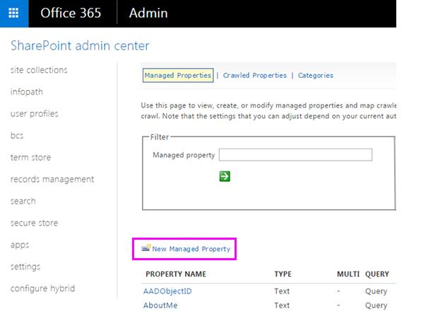

# <a name="create-a-dlp-policy-to-protect-documents-with-fci-or-other-properties"></a>Creare criteri di prevenzione della perdita dei dati per proteggere i documenti con FCI o altre proprietà

In Microsoft 365, è possibile utilizzare un criterio di prevenzione della perdita di dati (DLP) per identificare, monitorare e proteggere le informazioni riservate. Molte organizzazioni dispongono già di un processo per identificare e classificare le informazioni riservate mediante le proprietà di classificazione nell'Infrastruttura di classificazione file (FCI) di Windows Server, le proprietà dei documenti in SharePoint o le proprietà dei documenti applicate da un sistema di terze parti. Se in questo articolo viene descritta l'organizzazione, è possibile creare un criterio DLP che riconosca le proprietà applicate ai documenti da Windows Server FCI o da un altro sistema in modo che sia possibile applicare il criterio DLP ai documenti di Office con valori di proprietà FCI o altri specifici.
  

  
Ad esempio, l'organizzazione potrebbe utilizzare FCI di Windows Server per identificare i documenti con le informazioni di identificazione personale (PII), come i numeri di previdenza sociale, e quindi classificare il documento impostando la proprietà **Informazioni di identificazione personale** su **Elevata**, **Moderata**, **Bassa**, **Pubblica** o **Non PII** in base al tipo e al numero di occorrenze di informazioni personali rilevate nel documento. In Microsoft 365 è possibile creare un criterio DLP che identifichi i documenti che dispongono di una proprietà impostata su valori specifici, ad esempio **alto** e **medio**, e quindi esegue un'azione, ad esempio bloccando l'accesso a tali file. Lo stesso criterio può disporre di un'altra regola che consente di eseguire un'azione diversa se la proprietà è impostata su **Bassa**, come l'invio di una notifica tramite posta elettronica. In questo modo, DLP si integra con Windows Server FCI e può contribuire alla protezione dei documenti di Office caricati o condivisi in Microsoft 365 da file server basati su Windows Server.
  
Un criterio DLP cerca semplicemente una coppia di nome/valore di proprietà specifiche. È possibile utilizzare qualsiasi proprietà del documento, purché la proprietà disponga di una proprietà gestita corrispondente per la ricerca in SharePoint. Ad esempio, una raccolta siti di SharePoint potrebbe utilizzare un tipo di contenuto denominato **Report di andata e ritorno** con un campo obbligatorio denominato **Cliente**. Ogni volta che un utente crea un report di questo tipo, è necessario immettere il nome del cliente. Questa coppia di nome/valore della proprietà può essere utilizzata anche in un criterio DLP; ad esempio, se si desidera che una regola blocchi l'accesso al documento per gli utenti esterni quando il campo **Cliente** contiene **Contoso**.
  
Si noti che se si desidera applicare il criterio DLP al contenuto con etichette specifiche di Microsoft 365, non è necessario eseguire la procedura seguente. In alternativa, viene illustrato come [utilizzare un'etichetta di conservazione come condizione in un criterio DLP](data-loss-prevention-policies.md#using-a-retention-label-as-a-condition-in-a-dlp-policy).
  
## <a name="before-you-create-the-dlp-policy"></a>Prima di creare il criterio DLP

Prima di utilizzare una proprietà di FCI di Windows Server o un'altra proprietà in un criterio DLP, è necessario creare una proprietà gestita nell'interfaccia di amministrazione di SharePoint. Ecco perché.
  
Esempi
  
Questo è importante perché DLP utilizza il crawler di ricerca per identificare e classificare le informazioni riservate nei siti e quindi archiviare tali informazioni riservate in una parte sicura dell'indice di ricerca. Quando si carica un documento in Office 365, SharePoint crea automaticamente le proprietà sottoposte a ricerca per indicizzazione in base alle proprietà del documento. Tuttavia, per utilizzare una proprietà di FCI o di altro tipo in un criterio DLP, la proprietà sottoposta a ricerca per indicizzazione deve essere mappata a una proprietà gestita in modo che il contenuto con tale proprietà venga mantenuto nell'indice.
  
Per ulteriori informazioni sulla ricerca e sulle proprietà gestite, vedere [gestire lo schema di ricerca in SharePoint Online](https://go.microsoft.com/fwlink/p/?LinkID=627454).
  
### <a name="step-1-upload-a-document-with-the-needed-property-to-office-365"></a>Passaggio 1: Caricare un documento con la proprietà necessaria in Office 365

Prima di tutto, è necessario caricare un documento con la proprietà cui si desidera fare riferimento nel criterio DLP. Microsoft 365 rileverà la proprietà e creerà automaticamente una proprietà sottoposta a ricerca per indicizzazione. Nel passaggio successivo è possibile creare una proprietà gestita e quindi eseguire il mapping della proprietà gestita a questa proprietà sottoposta a ricerca per indicizzazione.
  
### <a name="step-2-create-a-managed-property"></a>Passaggio 2: Creare una proprietà gestita

1. Accedere all'interfaccia di amministrazione di Microsoft 365.
    
2. Nel riquadro di spostamento a sinistra, scegliere interfaccia di **Amministrazione** di \> **SharePoint**. Ci si trova ora nell'interfaccia di amministrazione di SharePoint.
    
3. Nella barra di spostamento a sinistra, scegliere **ricerca** \> nella pagina **Amministrazione ricerca** \> **gestire lo schema di ricerca**.
    
    
  
4. Nella pagina **proprietà gestite** \> **nuova proprietà gestita**.
    
    
  
5. Immettere un nome e una descrizione per la proprietà. Questo nome è ciò che apparirà nei criteri DLP.
    
6. Per **Tipo**, selezionare **Testo**. 
    
7. In **Caratteristiche principali**, selezionare **Disponibile per query** e **Recuperabile**.
    
8. In **mapping a proprietà sottoposte a ricerca per indicizzazione** \> **aggiungere un mapping**.
    
9. Nella finestra di dialogo Selezione proprietà sottoposta a **ricerca per indicizzazione** \> trovare e selezionare la proprietà sottoposto a ricerca per indicizzazione corrispondente alla proprietà di Windows Server FCI o ad altre proprietà che verranno utilizzate nel criterio DLP \> **OK**.
    
    
  
10. Nella parte inferiore della pagina \> **OK**.
    
## <a name="create-a-dlp-policy-that-uses-an-fci-property-or-other-property"></a>Creare un criterio DLP che utilizza una proprietà FCI o un'altra proprietà

In questo esempio un'organizzazione utilizza FCI nei file server basati su Windows Server. in particolare, si utilizza la proprietà di classificazione FCI **denominata informazioni di identificazione personale** con i possibili valori di **alto**, **moderato**, **basso**, **pubblico**e **non di pii**. Ora desiderano sfruttare la classificazione FCI esistente nei criteri DLP in Office 365.
  
Prima di tutto, eseguire la procedura precedente per creare una proprietà gestita in SharePoint Online, che consente di eseguire il mapping alla proprietà sottoposta a ricerca per indicizzazione creata automaticamente dalla proprietà FCI.
  
Successivamente, si crea un criterio DLP con due regole che entrambe utilizzano le **proprietà del documento Condition contengono uno dei valori seguenti**:
  
- **Contenuto delle informazioni personali FCI-alto, moderato** La prima regola limita l'accesso al documento se la proprietà di classificazione FCI **identificabile personalmente** è uguale **ad alta** o **moderata** e il documento viene condiviso con persone esterne all'organizzazione. 
    
- **Contenuto delle informazioni personali FCI-basso** La seconda regola invia una notifica al proprietario del documento se la proprietà di classificazione FCI **identifica le informazioni** personali è uguale a **bassa** e il documento viene condiviso con persone esterne all'organizzazione. 
    
### <a name="create-the-dlp-policy-by-using-powershell"></a>Creare il criterio DLP tramite PowerShell

Tenere presente che le **proprietà del documento Condition contengono uno qualsiasi di questi valori** non è temporaneamente disponibile nell'interfaccia utente del &amp; Centro sicurezza e conformità, ma è comunque possibile utilizzare questa condizione tramite PowerShell. È possibile utilizzare i `New\Set\Get-DlpCompliancePolicy` cmdlet per l'utilizzo di un criterio DLP e utilizzare i `New\Set\Get-DlpComplianceRule` cmdlet con il `ContentPropertyContainsWords` parametro per aggiungere le proprietà del documento condition che **contengono uno dei valori seguenti**.
  
Per ulteriori informazioni su questi cmdlet, vedere [cmdlet del &amp; Centro sicurezza e conformità](https://go.microsoft.com/fwlink/?LinkID=799772&amp;clcid=0x409).
  
1. [Connettersi al centro sicurezza e &amp; conformità tramite Remote PowerShell](https://go.microsoft.com/fwlink/?LinkID=799771&amp;clcid=0x409)
    
2. Creare il criterio utilizzando `New-DlpCompliancePolicy` .

Di seguito è riportato un esempio di PowerShell che consente di creare un criterio DLP che si applica a tutte le posizioni.

```powershell
New-DlpCompliancePolicy -Name FCI_PII_policy -ExchangeLocation All -SharePointLocation All -OneDriveLocation All -Mode Enable
```

3. Creare le due regole sopra descritte utilizzando `New-DlpComplianceRule` , in cui una regola è per il valore **basso** e un'altra regola per i valori **alto** e **medio** . 
    
    Di seguito è riportato un esempio di PowerShell che consente di creare queste due regole. Si noti che le coppie nome/valore della proprietà sono racchiuse tra virgolette e il nome di una proprietà può specificare più valori separati da virgole senza spazi, ad esempio`"<Property1>:<Value1>,<Value2>","<Property2>:<Value3>,<Value4>"....`

```powershell
New-DlpComplianceRule -Name FCI_PII_content-High,Moderate -Policy FCI_PII_policy -AccessScope NotInOrganization -BlockAccess $true -ContentPropertyContainsWords "Personally Identifiable Information:High,Moderate" -Disabled $falseNew-DlpComplianceRule -Name FCI_PII_content-Low -Policy FCI_PII_policy -AccessScope NotInOrganization -BlockAccess $false -ContentPropertyContainsWords "Personally Identifiable Information:Low" -Disabled $false -NotifyUser Owner
```

    Note that Windows Server FCI includes many built-in properties, including **Personally Identifiable Information** used in this example. The possible values for each property can be different for every organization. The **High**, **Moderate**, and **Low** values used here are only an example. For your organization, you can view the Windows Server FCI classification properties with their possible values in the file Server Resource Manager on the Windows Server-based file server. For more information, see [Create a classification property](https://go.microsoft.com/fwlink/p/?LinkID=627456).
    
Al termine, i criteri devono disporre di due nuove regole che entrambe utilizzano le **proprietà del documento contengono una qualsiasi delle condizioni di questi valori** . Si noti che questa condizione non viene visualizzata nell'interfaccia utente, anche se vengono visualizzate le altre condizioni, azioni e impostazioni.
  
Una regola blocca l'accesso al contenuto dove la proprietà **Informazioni personali** è uguale a **Elevata** o **Moderata**. Una seconda regola invia una notifica sul contenuto dove la proprietà **Informazioni personali** è uguale a **Bassa**.
  

  
## <a name="after-you-create-the-dlp-policy"></a>Dopo aver creato il criterio DLP

Se si esegue la procedura descritta nelle sezioni precedenti, verrà creato un criterio DLP che rileverà rapidamente il contenuto con tale proprietà, ma solo se il contenuto viene appena caricato (in modo che il contenuto venga indicizzato) oppure se il contenuto è obsoleto, ma è stato modificato in modo che il contenuto venga reindicizzato.
  
Per rilevare il contenuto con tale proprietà ovunque, è possibile richiedere manualmente che la raccolta, il sito o una raccolta siti vengano reindicizzati in modo che il criterio DLP sia a conoscenza di tutto il contenuto con tale proprietà. In SharePoint Online, il contenuto viene automaticamente sottoposto a ricerca per indicizzazione in base a una pianificazione definita. Il crawler rileva il contenuto modificato dall'ultima ricerca per indicizzazione e aggiorna l'indice. Se è necessario che il criterio DLP protegga il contenuto prima della prossima ricerca per indicizzazione pianificata, è possibile eseguire questi passaggi.
  
> [!CAUTION]
> [!ATTENZIONE]  La reindicizzazione di un sito può provocare un carico eccessivo nel sistema di ricerca. Non reindicizzare il sito, a meno che lo scenario non lo richieda assolutamente. 
  
Per altre informazioni, vedere [Richiedere manualmente la ricerca per indicizzazione e la reindicizzazione di un sito, di una raccolta o di un elenco](https://go.microsoft.com/fwlink/p/?LinkID=627457).
  
### <a name="re-index-a-site-optional"></a>Reindicizzare un sito (facoltativo)

1. Nel sito scegliere **Impostazioni** (icona a ingranaggi in alto a destra) \> **impostazioni del sito**.
    
2. In **ricerca**, scegliere **ricerca e** \> **reindicizzazione**disponibilità offline sito.
    
## <a name="more-information"></a>Ulteriori informazioni

- [Panoramica relativa ai criteri di prevenzione della perdita di dati](data-loss-prevention-policies.md)
    
- [Creare un criterio di prevenzione della perdita dei dati da un modello](create-a-dlp-policy-from-a-template.md)
    
- [Inviare notifiche e visualizzare i suggerimenti per i criteri di prevenzione della perdita dei dati](use-notifications-and-policy-tips.md)
    
- [Elementi inclusi nei modelli dei criteri di prevenzione della perdita dei dati](what-the-dlp-policy-templates-include.md)
    
- [Definizioni di entità per il tipo di informazioni riservate](sensitive-information-type-entity-definitions.md)
