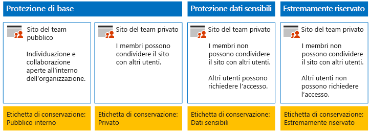
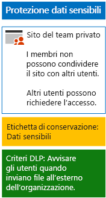
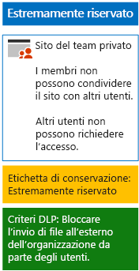

# Proteggere i file di SharePoint Online con le etichette di conservazione e la prevenzione della perdita dei datiProtect SharePoint Online files with retention labels and DLP

Usare i passaggi descritti in questo articolo per progettare e implementare le etichette di conservazione e i criteri di protezione della perdita dei dati (DLP) per i siti del team di SharePoint Online di base, riservati ed estremamente riservati.Use the steps in this article to design and deploy retention labels and DLP policies for baseline, sensitive, and highly confidential SharePoint Online team sites. Per altre informazioni su questi tre livelli di protezione, vedere [Proteggere siti e file di SharePoint Online](../security/office-365-security/secure-sharepoint-online-sites-and-files.md).For more information about these three tiers of protection, see [Secure SharePoint Online sites and files](../security/office-365-security/secure-sharepoint-online-sites-and-files.md).
  
## FunzionamentoHow this works

1. Creare le etichette di conservazione desiderate e pubblicarle.Create the desired retention labels and publish these. La pubblicazione può richiedere fino a 12 ore.It can take up to 12 hours for these to be published.
2. Per i siti di SharePoint desiderati, modificare le impostazioni della raccolta documenti per applicare le etichette di conservazione desiderate agli elementi della raccolta.For the desired SharePoint sites, edit the document library settings to apply the desired retention labels to items in the library.
3. Creare criteri di prevenzione della perdita dei dati per intervenire in base alle etichette di conservazione.Create DLP policies to take action based on the retention labels.

Quando gli utenti aggiungono un documento alla raccolta, il documento riceve per impostazione predefinita l'etichetta di conservazione assegnata.When users add a document to the library, the document will receive the assigned retention label by default. È possibile modificare l'etichetta, se necessario.Users can change the label, if needed. Quando un utente condivide un documento all'esterno dell'organizzazione, i criteri di prevenzione della perdita dei dati verificano se è assegnata un'etichetta e intervengono in caso di corrispondenza all'etichetta.When a user shares a document outside the organization, DLP will check to see if a label is assigned and take action if a DLP policy matches the label. Quindi cercano la corrispondenza anche ad altri criteri, ad esempio la protezione dei file con i numeri di carta di credito, se questo tipo di criterio è configurato.DLP will look for other policy matches as well, such as protecting files with credit card numbers if this type of policy is configured. 

## Etichette di conservazione per i siti di SharePoint OnlineRetention labels for your SharePoint Online sites

La procedura per creare e poi assegnare etichette di conservazione ai siti del team di SharePoint Online prevede tre fasi.There are three phases to creating and then assigning retention labels to SharePoint Online team sites.
  
### Fase 1: Definire i nomi delle etichette di conservazionePhase 1: Determine the retention label names

In questa fase si definiscono i nomi delle etichette di conservazione per i quattro livelli di protezione delle informazioni applicati ai siti del team di SharePoint Online.In this phase, you determine the names of your retention labels for the four levels of information protection applied to SharePoint Online team sites. La tabella seguente elenca i nomi consigliati per ogni livello.The following table lists the recommended names for each level.
  
|**Livello di protezione del sito del team di SharePoint Online****SharePoint Online team site protection level**|**Nome etichetta****Label name**|
|:-----|:-----|
|Pubblico di baseBaseline-Public    |Pubblico internoInternal public    |
|Privato di baseBaseline-Private    |PrivatePrivate    |
|Dati sensibiliSensitive    |Dati sensibiliSensitive    |
|Highly Confidential (Riservatezza elevata)Highly Confidential    |Highly Confidential (Riservatezza elevata)Highly Confidential    |
   
### Fase 2: Creare le etichette di conservazionePhase 2: Create the retention labels

In questa fase si creano e poi pubblicano le etichette specificate per i diversi livelli di protezione delle informazioni.In this phase, you create and then publish your determined labels for the different levels of information protection.
  
1. Accedere al [portale Conformità Microsoft 365](https://compliance.microsoft.com) con un account che dispone del ruolo Amministratore della sicurezza oppure Amministratore della società.Sign in to the [Microsoft 365 compliance portal](https://compliance.microsoft.com) with an account that has the Security Administrator or Company Administrator role.
    
2. Dalla scheda **Home: Conformità Microsoft 365** del browser fare clic su **Classificazioni > Etichette**.From the **Home - Microsoft 365 compliance** tab of your browser, click **Classifications > Labels**.
    
3. Fare clic su **Etichette di conservazione > Crea un'etichetta**.Click **Retention labels > Create a label**.
    
4. Nel riquadro **Assegnare un nome all'etichetta** digitare il nome dell’etichetta e una descrizione per amministratori e utenti, quindi fare clic su **Avanti**.On the **Name your label** pane, type the name of the label and a description for admins and users, and then click **Next**.

5. Nel riquadro **Descrittori del piano di archiviazione** compilare come necessario e quindi fare clic su **Avanti**.On the **File plan descriptors** pane, fill in as needed, and then click **Next**.
    
6. Nel riquadro **Impostazioni etichetta** impostare **Conservazione** su **Sì**, se necessario, e configurare le impostazioni di conservazione.On the **Label settings** pane, if needed, set **Retention** to **On** and configure retention settings. Fare clic su **Avanti**.Click **Next**.
    
7. Nel riquadro **Rivedere le impostazioni** fare clic su **Crea etichetta**.On the **Review your settings** pane, click **Create the label**.
    
8. Per etichette aggiuntive, fare clic su **Crea un'etichetta** e ripetere i passaggi da 3 a 7 in base alle esigenze.For your additional labels, click **Create a label**, and then repeat steps 3-7 as needed.
    

### Pubblicare le nuove etichettePublish your new labels

Successivamente, seguire questa procedura per pubblicare le nuove etichette di conservazione.Next, use these steps to publish the new retention labels.
  
1. Nel riquadro **Etichette** fare clic sulla scheda **Etichette di conservazione** e quindi su **Pubblica etichette**.From the **Labels** pane, click the **Retention labels** tab, and then click **Publish labels**.
    
2. Nel riquadro **Scegliere le etichette da pubblicare** fare clic su **Scegliere le etichette da pubblicare**.On the **Choose labels to publish** pane, click **Choose labels to publish**.
    
3. Nel riquadro **Scegli etichette** fare clic su **Aggiungi**, selezionare le quattro etichette e fare clic su **Aggiungi**.On the **Choose labels** pane, click **Add**, select all four labels, click **Add**.
    
4. Fare clic su **Fine**.Click **Done**.
    
5. Nel riquadro **Choose labels to publish** (Scegli etichette da pubblicare) fare clic su **Avanti**.On the **Choose labels to publish** pane, click **Next**.
    
6. Nel riquadro **Choose locations** (Scegli posizioni) fare clic su **Avanti**.On the **Choose locations** pane, click **Next**.
    
7. Nel riquadro **Denomina il criterio**, digitare un nome per il set di etichette in **Nome**, quindi fare clic su **Avanti**.On the **Name your policy** pane, type a name for your set of labels in **Name**, and then click **Next**.
    
8. Nel riquadro **Verifica le impostazioni** fare clic su **Publish labels** (Pubblica etichette), quindi fare clic su **Chiudi**.On the **Review your settings** pane, click **Publish labels**, and then click **Close**.

    
### Fase 3: applicare le etichette di conservazione ai siti di SharePoint OnlinePhase 3: Apply the retention labels to your SharePoint Online sites

Seguire questa procedura per applicare le etichette di conservazione alle cartelle di documenti dei siti del team di SharePoint Online.Use these steps to apply the retention labels to the documents folders of your SharePoint Online team sites.
  
1. Accedere al [portale di Office 365](https://www.office.com) e fare clic sull'app **SharePoint**.Sign in to the [Office 365 portal](https://www.office.com), click the **SharePoint** app.
    
2. Nella nuova scheda **SharePoint** del browser selezionare un sito per cui è necessario assegnare un'etichetta di conservazione.On the new **SharePoint** tab in your browser, click a site that needs a retention label assigned.
    
3. Nella nuova scheda del sito di SharePoint del browser fare clic su **Documenti**.In the new SharePoint site tab of your browser, click **Documents**.
    
4. Fare clic sull'icona delle impostazioni e selezionare **Impostazioni libreria**.Click the settings icon, and then click **Library settings**.
    
5. In **Autorizzazioni e gestione** fare clic su **Apply label to items in this library** (Applica etichetta agli elementi in questa libreria).Under **Permissions and Management**, click **Apply label to items in this library**.
    
6. In **Impostazioni - Applica etichetta**, selezionare l'etichetta di conservazione appropriata, quindi fare clic su **Salva**.In **Settings-Apply Label**, select the appropriate retention label, and then click **Save**.
    
7. Chiudere la scheda per il sito di SharePoint Online.Close the tab for the SharePoint Online site.
    
8. Ripetere i passaggi da 2 a 8 per assegnare le etichette di conservazione a siti di SharePoint Online aggiuntivi.Repeat steps 2-8 to assign retention labels to your additional SharePoint Online sites.
    
Questa è la configurazione risultante.Here is your resulting configuration.
  

  
## Criteri di prevenzione della perdita dei dati per siti di SharePoint OnlineDLP policies for your SharePoint Online sites

Seguire questa procedura per configurare un criterio della prevenzione della perdita dei dati che notifica agli utenti la condivisione di un documento in un sito sensibile del team di SharePoint Online all'esterno dell'organizzazione.Use these steps to configure a DLP policy that notifies users when they share a document on a SharePoint Online sensitive team site outside the organization.

1. Accedere al [portale Conformità Microsoft 365](https://compliance.microsoft.com/) con un account che dispone del ruolo Amministratore della sicurezza oppure Amministratore della società.Sign in to the [Microsoft 365 compliance portal](https://compliance.microsoft.com/) with an account that has the Security Administrator or Company Administrator role.
    
2. Nella nuova scheda **Sicurezza Microsoft 365** del browser fare clic su **Criteri > Prevenzione della perdita dei dati**.On the new **Microsoft 365 compliance** tab in your browser, click **Policies > Data loss prevention**.
    
3. Nel riquadro **Home > Prevenzione della perdita dei dati** fare clic su **Crea un criterio**.In the **Home > Data loss prevention** pane, click **Create a policy**.
    
4. Nel riquadro **Iniziare con un modello o creare un criterio personalizzato** fare clic su **Personalizza**, quindi su **Avanti**.In the **Start with a template or create a custom policy** pane, click **Custom**, and then click **Next**.
    
5. Nel riquadro **Denomina il criterio**, digitare il nome per il criterio DLP di livello riservato in **Nome**, quindi fare clic su **Avanti**.In the **Name your policy** pane, type the name for the sensitive level DLP policy in **Name**, and then click **Next**.
    
6. Nel riquadro **Scegli posizioni** fare clic su **Consenti di scegliere posizioni specifiche** e fare clic su **Avanti**.In the **Choose locations** pane, click **Let me choose specific locations**, and then click **Next**.
    
7. Nell'elenco di località, disabilitare le località **Posta elettronica di Exchange**, **Account di OneDrive** e **Messaggi di chat e canali di Teams**, quindi fare clic su **Avanti**.In the list of locations, disable the **Exchange email**, **OneDrive accounts**, and **Teams chat and channel messages** locations, and then click **Next**.
    
8. Nel riquadro **Personalizzare il tipo di contenuti da proteggere**, fare clic su **Modifica**.In the **Customize the type of content you want to protect** pane, click **Edit**.
    
9. Nel riquadro **Scegliere i tipi di contenuto da proteggere**,fare clic su **Aggiungi** nella casella di riepilogo a discesa, quindi fare clic su **Etichette di conservazione**.In the **Choose the types of content to protect** pane, click **Add** in the drop-down box, and then click **Retention labels**.
    
10. Nel riquadro **Etichette di conservazione** fare clic su **Aggiungi**, selezionare l'etichetta **Riservato** fare clic su **Aggiungi**, quindi fare clic su **Fine**.In the **Retention labels** pane, click **Add**, select the **Sensitive** label, click **Add**, and then click **Done**.
    
11. Nel riquadro **Choose the types of content to protect** (Scegli i tipi di contenuto da proteggere) fare clic su **Salva**.In the **Choose the types of content to protect** pane, click **Save**.
    
12. Nel riquadro **Personalizzare i tipi di informazioni da proteggere**, fare clic su **Avanti**.In the **Customize the type of content you want to protect** pane, click **Next**.

13. Nel riquadro **What do you want to do if we detect sensitive info?** (Selezionare come procedere in caso di informazioni sensibili rilevate) fare clic su **Customize the tip and email** (Personalizza suggerimento e messaggio di posta elettronica).In the **What do you want to do if we detect sensitive info?** pane, click **Customize the tip and email**.
    
14. Nel riquadro **Customize policy tips and email notifications** (Personalizza i suggerimenti per i criteri e le notifiche tramite posta elettronica) fare clic su **Customize the policy tip text** (Personalizza testo suggerimento per criterio).In the **Customize policy tips and email notifications** pane, click **Customize the policy tip text**.
    
15. Nella casella di testo digitare o incollare uno dei suggerimenti riportati di seguito, a seconda dell'uso facoltativo delle etichette di riservatezza per proteggere i file sensibili:In the text box, type or paste in one of the following tips, depending on if you are optionallyusing sensitivity labels to protect sensitive files:
    
  - Per condividere con un utente esterno all'organizzazione, scaricare il file e quindi aprirlo. Fare clic su File, Proteggi documento, Crittografa con password, quindi specificare una password complessa. Inviare la password in un'e-mail separata o con altri mezzi di comunicazione.To share with a user outside the organization, download the file and then open it. Click File, then Protect Document, and then Encrypt with Password, and then specify a strong password. Send the password in a separate email or other means of communication.
  - I file estremamente riservati sono protetti con crittografia. Solo gli utenti esterni che hanno ricevuto le autorizzazioni per questi file dal reparto IT possono leggerli.Highly confidential files are protected with encryption. Only external users who are granted permissions to these files by your IT department can read them.
    
    In alternativa, digitare o incollare un suggerimento per i criteri che indica agli utenti come condividere un file all'esterno dell'organizzazione.Alternately, type or paste in your own policy tip that instructs users on how to share a file outside your organization.
    
16. Fare clic su **OK**.Click **OK**.
    
17. Nel riquadro **Quale operazione eseguire se vengono rilevate informazioni riservate?**, fare clic su **Avanti**.In the **What do you want to do if we detect sensitive info?** pane, click **Next**.
    
18. Nel riquadro **Abilitare il criterio o eseguire prima un test?**, fare clic su **Sì, abilitarlo immediatamente**, quindi su **Avanti**.In the **Do you want to turn on the policy or test things out first?** pane, click **Yes, turn it on right away**, and then click **Next**.
    
19. Nel riquadro **Verifica le impostazioni** fare clic su **Crea** e quindi su **Chiudi**.In the **Review your settings** pane, click **Create**, and then click **Close**.
    
Di seguito è riportata la configurazione risultante per i siti sensibili del team di SharePoint Online.Here is your resulting configuration for sensitive SharePoint Online team sites.
  

  
Seguire questa procedura per configurare un criterio della prevenzione della perdita dei dati che blocchi gli utenti in fase di condivisione di un documento in un sito con riservatezza elevata del team di SharePoint Online all'esterno dell'organizzazione.Next, use these steps to configure a DLP policy that blocks users when they share a document on a SharePoint Online highly confidential team site outside the organization.
  
1. Nella nuova scheda **Sicurezza Microsoft 365** del browser fare clic su **Criteri > Prevenzione della perdita dei dati**.On the new **Microsoft 365 compliance** tab in your browser, click **Policies > Data loss prevention**.
    
2. Nel riquadro **Prevenzione della perdita dei dati** fare clic su \*\* Crea un criterio\*\*.In the **Data loss prevention** pane, click **Create a policy**.
    
3. Nel riquadro **Inizia con un modello o crea un criterio personalizzato**, fare clic su **Personalizza**, quindi su **Avanti**.In the **Start with a template or create a custom policy** pane, click **Custom**, and then click **Next**.
    
4. Nel riquadro **Denomina il criterio**, digitare il nome per il criterio DLP di livello estremamente riservato in **Nome**, quindi fare clic su **Avanti**.In the **Name your policy** pane, type the name for the highly sensitive level DLP policy in **Name**, and then click **Next**.
    
5. Nel riquadro **Choose locations** (Scegli posizioni) fare clic su **Let me choose specific locations** (Consenti di scegliere posizioni specifiche) e fare clic su **Avanti**.In the **Choose locations** pane, click **Let me choose specific locations**, and then click **Next**.
    
6. Nell'elenco di località, disabilitare le località **Posta elettronica di Exchange**, **Account di OneDrive** e **Messaggi di chat e canali di Teams**, quindi fare clic su **Avanti**.In the list of locations, disable the **Exchange email**, **OneDrive accounts**, and **Teams chat and channel messages** locations, and then click **Next**.
    
7. Nel riquadro **Personalizzare i tipi di informazioni riservate da proteggere** fare clic su **Modifica**.In the **Customize the types of sensitive info you want to protect** pane, click **Edit**.
    
8. Nel riquadro **Scegliere i tipi di contenuto da proteggere**,fare clic su **Aggiungi** nella casella di riepilogo a discesa, quindi fare clic su **Etichette di conservazione**.In the **Choose the types of content to protect** pane, click **Add** in the drop-down box, and then click **Retention labels**.
    
9. Nel riquadro **Etichette** fare clic su **Aggiungi**, selezionare l'etichetta **Estremamente riservato**, fare clic su **Aggiungi**, quindi fare clic su **Fine**.In the **Retention labels** pane, click **Add**, select the **Highly Confidential** label, click **Add**, and then click **Done**.
    
10. Nel riquadro **Choose the types of content to protect** (Scegli i tipi di contenuto da proteggere) fare clic su **Salva**.In the **Choose the types of content to protect** pane, click **Save**.
    
12. Nel riquadro **Customize the types of sensitive info you want to protect** (Personalizza i tipi di informazioni sensibili da proteggere) fare clic su **Avanti**.In the **Customize the types of sensitive info you want to protect** pane, click **Next**.
    
13. Nel riquadro **What do you want to do if we detect sensitive info?** (Selezionare come procedere in caso di informazioni sensibili rilevate) fare clic su **Customize the tip and email** (Personalizza suggerimento e messaggio di posta elettronica).In the **What do you want to do if we detect sensitive info?** pane, click **Customize the tip and email**.
    
14. Nel riquadro **Customize policy tips and email notifications** (Personalizza i suggerimenti per i criteri e le notifiche tramite posta elettronica) fare clic su **Customize the policy tip text** (Personalizza testo suggerimento per criterio).In the **Customize policy tips and email notifications** pane, click **Customize the policy tip text**.
    
15. Nella casella di testo digitare o incollare quanto segue:In the text box, type or paste in the following:
    
  - Per condividere con un utente esterno all'organizzazione, scaricare il file e quindi aprirlo. Fare clic su File, Proteggi documento, Crittografa con password, quindi specificare una password complessa. Inviare la password in un'e-mail separata o con altri mezzi di comunicazione.To share with a user outside the organization, download the file and then open it. Click File, then Protect Document, and then Encrypt with Password, and then specify a strong password. Send the password in a separate email or other means of communication.
    
    In alternativa, digitare o incollare un suggerimento per i criteri che indica agli utenti come condividere un file all'esterno dell'organizzazione.Alternately, type or paste in your own policy tip that instructs users on how to share a file outside your organization.
    
16. Fare clic su **OK**.Click **OK**.
    
17. Nel riquadro **Quale operazione eseguire se vengono rilevate informazioni riservate?** fare clic su **Limita l'accesso o crittografa i contenuti** in **Rileva se viene condivisa una specifica quantità di informazioni sensibili nello stesso momento** e quindi fare clic su **Avanti**.In the **What do you want to do if we detect sensitive info?** pane, under **Detect when a specific amount of sensitive info is being shared at one time**, click **Restrict access or encrypt the content**, and then click **Next**.
    
18. Nel riquadro **Abilitare il criterio o eseguire prima un test?**, fare clic su **Sì, abilitarlo immediatamente**, quindi su **Avanti**.In the **Do you want to turn on the policy or test things out first?** pane, click **Yes, turn it on right away**, and then click **Next**.
    
19. Nel riquadro **Verifica le impostazioni** fare clic su **Crea** e quindi su **Chiudi**.In the **Review your settings** pane, click **Create**, and then click **Close**.
    
Di seguito è riportata la configurazione risultante per i siti con riservatezza elevata del team di SharePoint Online.Here is your resulting configuration for high confidentiality SharePoint Online team sites.
  

  
## Passaggio successivoNext step

[Proteggere i file di SharePoint Online con le etichette di riservatezzaProtect SharePoint Online files with sensitivity labels](protect-sharepoint-online-files-with-sensitivity-label.md)
    
## Vedere ancheSee Also

[Guida sulla sicurezza Microsoft per organizzazioni che si occupano della campagna politica, no profit e altre organizzazioni agiliMicrosoft Security Guidance for Political Campaigns, Nonprofits, and Other Agile Organizations](../security/office-365-security/microsoft-security-guidance-for-political-campaigns-nonprofits-and-other-agile-o.md)
  
[Adozione del cloud e soluzioni ibrideCloud adoption and hybrid solutions](https://docs.microsoft.com/office365/enterprise/cloud-adoption-and-hybrid-solutions)

